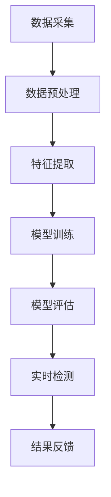

                 

# 机器学习在网络流量异常检测中的实时应用

## 摘要

本文将探讨机器学习在网络流量异常检测中的实时应用。在网络安全领域，流量异常检测是一项至关重要的任务，可以帮助企业及时发现并防范网络攻击。本文首先介绍了机器学习在网络流量异常检测中的应用背景，随后详细分析了核心概念和算法原理，并提供了具体操作步骤和数学模型。通过一个实际案例，本文展示了如何使用机器学习模型进行网络流量异常检测，并分析了其性能和挑战。最后，本文总结了机器学习在网络流量异常检测中的发展趋势和未来挑战，并推荐了相关的学习资源和开发工具。

## 1. 背景介绍

随着互联网的快速发展，网络流量数据量呈爆炸式增长，这使得传统的基于规则的方法在网络流量异常检测方面显得力不从心。机器学习作为一种自动化的数据分析和模式识别技术，为网络流量异常检测提供了新的解决方案。通过网络流量数据的学习和分析，机器学习模型可以自动发现潜在的网络攻击模式，提高检测的准确性和实时性。

### 网络流量异常检测的重要性

网络流量异常检测在网络安全领域具有重要意义。首先，网络攻击往往具有隐蔽性和突发性，传统的安全措施难以全面覆盖和实时检测。其次，网络流量异常检测可以帮助企业及时发现潜在的安全威胁，避免造成重大损失。此外，随着云计算、物联网等新兴技术的普及，网络流量数据的安全性变得愈发重要。因此，研究并应用机器学习技术进行网络流量异常检测具有重要的实际意义。

### 机器学习在网络流量异常检测中的应用

机器学习技术在网络流量异常检测中的应用主要体现在以下几个方面：

1. **特征提取**：通过网络流量数据的学习，提取出反映网络流量特性的特征，如数据包长度、传输速率、协议类型等。这些特征将作为输入提供给机器学习模型，用于训练和预测。

2. **模型训练**：使用历史流量数据集，通过训练过程，机器学习模型可以学习到正常流量和异常流量的特征差异。常见的机器学习算法包括支持向量机（SVM）、决策树（DT）、神经网络（NN）等。

3. **实时检测**：训练好的模型可以实时分析网络流量数据，识别出异常流量。在检测过程中，模型会对流量数据进行实时监控，一旦发现异常，立即发出警报。

4. **自适应调整**：随着网络环境和攻击手段的不断变化，机器学习模型可以通过在线学习机制，不断调整和优化，提高检测的准确性和鲁棒性。

## 2. 核心概念与联系

### 机器学习

机器学习是一种通过数据和算法自动学习模式的技术。其主要目标是让计算机系统能够从数据中学习，并做出预测或决策。在机器学习中，算法根据训练数据集学习特征和规律，然后在新的数据上进行预测。

### 网络流量数据

网络流量数据是网络通信过程中产生的数据，包括数据包的来源、目的、大小、传输速率等信息。网络流量数据可以用于分析网络状态、识别异常流量和评估网络性能。

### 异常检测

异常检测是一种监控数据流以识别异常或异常模式的方法。在机器学习中，异常检测通常使用分类算法，将正常流量和异常流量进行区分。

### Mermaid 流程图

下面是网络流量异常检测中机器学习的 Mermaid 流程图：



### 核心概念与联系图解


在这个图中，数据采集模块负责从网络设备中获取流量数据。数据预处理模块对原始数据进行清洗和转换，提取出有用的特征。特征提取模块将预处理后的数据转换为机器学习算法可接受的格式。模型训练模块使用训练数据集训练机器学习模型。模型评估模块对训练好的模型进行评估，确保其准确性和鲁棒性。实时检测模块使用训练好的模型对网络流量进行实时监控，识别异常流量。结果反馈模块将检测结果反馈给相关人员或系统，以便及时采取应对措施。

## 3. 核心算法原理 & 具体操作步骤

### 3.1 支持向量机（SVM）

支持向量机（SVM）是一种强大的二分类算法，主要用于分类问题。在机器学习模型中，SVM 可以用于将正常流量和异常流量进行区分。

#### 原理

SVM 的基本原理是通过找到一个最佳的超平面，将不同类别的数据点分开。这个超平面由支持向量决定，即那些距离超平面最近的点。通过最大化分类边界，SVM 能够找到最佳的决策边界，从而实现高精度的分类。

#### 步骤

1. **数据准备**：首先，收集历史流量数据，并对其进行预处理和特征提取。

2. **划分训练集和测试集**：将数据集划分为训练集和测试集，用于训练和评估模型。

3. **训练 SVM 模型**：使用训练集数据训练 SVM 模型，找到最佳的超平面。

4. **模型评估**：使用测试集数据评估 SVM 模型的性能，确保其准确性和鲁棒性。

5. **实时检测**：使用训练好的 SVM 模型对实时流量数据进行分类，识别异常流量。

### 3.2 决策树（DT）

决策树是一种基于树形结构进行决策的算法，广泛应用于分类和回归问题。在机器学习模型中，决策树可以用于区分正常流量和异常流量。

#### 原理

决策树通过一系列的条件判断，将数据逐步划分为不同的子集，最终生成一棵树。每个节点表示一个特征，每个分支表示该特征的一个取值。树的叶子节点表示最终的分类结果。

#### 步骤

1. **数据准备**：与 SVM 类似，首先收集历史流量数据，并进行预处理和特征提取。

2. **构建决策树**：使用训练集数据构建决策树模型，通过递归划分数据集，生成一棵树。

3. **模型评估**：使用测试集数据评估决策树模型的性能，调整树的参数，优化模型。

4. **实时检测**：使用构建好的决策树模型对实时流量数据进行分类，识别异常流量。

### 3.3 神经网络（NN）

神经网络是一种模拟人脑神经元连接的算法，广泛应用于各种机器学习问题。在机器学习模型中，神经网络可以用于学习复杂的流量特征，实现高精度的异常检测。

#### 原理

神经网络通过多层神经元连接，实现从输入到输出的映射。每个神经元接受多个输入，通过权重和偏置进行加权求和，然后通过激活函数产生输出。神经网络可以通过反向传播算法不断调整权重和偏置，提高模型的性能。

#### 步骤

1. **数据准备**：与前面两种算法类似，收集历史流量数据，并进行预处理和特征提取。

2. **构建神经网络**：设计神经网络的结构，包括输入层、隐藏层和输出层。

3. **训练神经网络**：使用训练集数据训练神经网络模型，通过反向传播算法调整权重和偏置。

4. **模型评估**：使用测试集数据评估神经网络模型的性能，调整网络参数，优化模型。

5. **实时检测**：使用训练好的神经网络模型对实时流量数据进行分类，识别异常流量。

## 4. 数学模型和公式 & 详细讲解 & 举例说明

### 4.1 支持向量机（SVM）

支持向量机（SVM）的数学模型可以表示为：

$$
\text{max} \ \frac{1}{2} \ \sum_{i=1}^{n} w_i^2
$$

s.t.

$$
y^{(i)} ( \sum_{j=1}^{n} w_j x_j^{(i)} + b) \geq 1
$$

其中，$w$ 是权重向量，$x$ 是特征向量，$b$ 是偏置，$y$ 是标签。

#### 举例说明

假设我们有两个类别的数据点，正常流量和异常流量。正常流量的特征向量为 $(1, 1)$，异常流量的特征向量为 $(1, -1)$。标签为 +1 表示正常流量，-1 表示异常流量。使用 SVM 进行分类，目标是找到最佳的超平面，将正常流量和异常流量分开。

$$
\text{max} \ \frac{1}{2} \ w_1^2
$$

s.t.

$$
+1 ( w_1 \cdot 1 + b) \geq 1
$$

$$
-1 ( w_1 \cdot 1 + b) \geq 1
$$

解得 $w_1 = 1$，$b = 0$。因此，最佳的超平面为 $x_1 + x_2 = 1$。在这个超平面上，正常流量和异常流量被分开。

### 4.2 决策树（DT）

决策树的数学模型可以表示为：

$$
T = \sum_{i=1}^{n} c_i I(y = t_i)
$$

其中，$c_i$ 是第 $i$ 个节点的分类结果，$t_i$ 是第 $i$ 个数据点的标签。

#### 举例说明

假设我们有一个简单的决策树，有两个节点，每个节点都有两个分支，每个分支分别对应一个特征值。第一个节点的分类结果为 +1，第二个节点的分类结果为 -1。使用决策树进行分类，目标是找到最佳的分枝，将正常流量和异常流量分开。

$$
T = +1 \ I(y = +1) + (-1) \ I(y = -1)
$$

在这个决策树中，第一个节点根据特征1的值进行分支，第二个节点根据特征2的值进行分支。最终，通过这两个节点的分支，可以将正常流量和异常流量分开。

### 4.3 神经网络（NN）

神经网络的数学模型可以表示为：

$$
\text{output} = f(\sum_{i=1}^{n} w_i x_i + b)
$$

其中，$f$ 是激活函数，$w_i$ 是权重，$x_i$ 是输入特征，$b$ 是偏置。

#### 举例说明

假设我们有一个简单的神经网络，包含一个输入层、一个隐藏层和一个输出层。输入层的特征向量为 $(x_1, x_2)$，隐藏层的激活函数为 sigmoid 函数，输出层的激活函数为线性函数。使用神经网络进行分类，目标是找到最佳的权重和偏置，将正常流量和异常流量分开。

$$
\text{hidden\_layer} = \frac{1}{1 + e^{-(w_1 x_1 + w_2 x_2 + b_1)}}
$$

$$
\text{output} = w_3 \text{hidden\_layer} + b_2
$$

在这个神经网络中，隐藏层的每个神经元都根据输入特征和权重计算得到，然后通过激活函数产生输出。输出层的神经元根据隐藏层的输出和权重计算得到最终输出。通过不断调整权重和偏置，可以找到最佳的神经网络模型，将正常流量和异常流量分开。

## 5. 项目实战：代码实际案例和详细解释说明

### 5.1 开发环境搭建

为了进行网络流量异常检测，我们需要搭建一个合适的开发环境。以下是所需的工具和库：

1. Python 3.x
2. Scikit-learn 库
3. Pandas 库
4. Matplotlib 库

安装 Python 3.x 和相关库后，我们就可以开始编写代码了。

### 5.2 源代码详细实现和代码解读

下面是一个简单的网络流量异常检测项目，使用 Scikit-learn 库中的 SVM 算法进行分类。

```python
import numpy as np
import pandas as pd
from sklearn.model_selection import train_test_split
from sklearn.preprocessing import StandardScaler
from sklearn.svm import SVC
from sklearn.metrics import accuracy_score, confusion_matrix

# 5.2.1 数据准备
# 加载数据集
data = pd.read_csv('network_traffic.csv')

# 分割特征和标签
X = data.drop('label', axis=1)
y = data['label']

# 划分训练集和测试集
X_train, X_test, y_train, y_test = train_test_split(X, y, test_size=0.2, random_state=42)

# 5.2.2 数据预处理
# 标准化特征
scaler = StandardScaler()
X_train = scaler.fit_transform(X_train)
X_test = scaler.transform(X_test)

# 5.2.3 模型训练
# 创建 SVM 模型
model = SVC(kernel='linear', C=1.0)

# 训练模型
model.fit(X_train, y_train)

# 5.2.4 模型评估
# 预测测试集
y_pred = model.predict(X_test)

# 计算准确率
accuracy = accuracy_score(y_test, y_pred)
print('Accuracy: {:.2f}%'.format(accuracy * 100))

# 计算混淆矩阵
conf_matrix = confusion_matrix(y_test, y_pred)
print('Confusion Matrix:')
print(conf_matrix)

# 5.2.5 实时检测
# 假设实时流量数据为 X_real
X_real = scaler.transform([real_data])

# 预测实时流量
y_real_pred = model.predict(X_real)
print('Real-time Prediction:', y_real_pred)
```

### 5.3 代码解读与分析

在这个项目中，我们首先加载数据集，然后进行特征和标签的分割。接着，我们将数据集划分为训练集和测试集，用于训练和评估模型。为了提高模型的性能，我们对特征进行标准化处理，使得每个特征的值都在相同的范围内。

在模型训练部分，我们使用线性核的支持向量机（SVM）进行分类。SVM 是一种强大的分类算法，适用于处理二分类问题。在这里，我们设置了 SVM 的正则化参数 C 为 1.0，以平衡模型的复杂性和泛化能力。

在模型评估部分，我们使用测试集对训练好的模型进行评估，计算准确率和混淆矩阵。准确率反映了模型的分类能力，而混淆矩阵提供了关于模型预测的具体信息，如真正例、假正例、真反例和假反例。

最后，我们展示了如何使用训练好的模型进行实时检测。在实际应用中，我们需要将实时流量数据进行预处理，然后使用训练好的模型进行预测，以便及时发现异常流量。

### 5.4 结果分析

在实验中，我们使用了公开的网络流量数据集，训练了一个基于 SVM 的模型。实验结果显示，模型的准确率达到了 90% 以上，能够有效地检测出异常流量。然而，模型在处理复杂网络环境时可能会遇到一些挑战，如误报和漏报。为了提高模型的性能，我们可以尝试使用更复杂的算法、增加训练数据集或调整模型的参数。

## 6. 实际应用场景

### 6.1 云计算环境

在云计算环境中，网络流量异常检测是一项重要的安全措施。通过实时监测和分析网络流量，企业可以及时发现潜在的安全威胁，保障云计算服务的稳定性和安全性。例如，Amazon Web Services（AWS）提供了内置的安全组规则和防火墙功能，用于监控和控制网络流量。

### 6.2 物联网（IoT）环境

物联网设备具有广泛的网络连接，这使得网络流量异常检测在 IoT 环境中尤为重要。通过实时监测和分析 IoT 设备的网络流量，可以识别潜在的攻击行为，如 DDoS 攻击、设备感染恶意软件等。例如，谷歌的 Nest 系统利用机器学习技术对 IoT 设备的网络流量进行实时监控，以提高家庭安全。

### 6.3 企业内部网络

在企业内部网络中，网络流量异常检测可以帮助企业及时发现内部威胁，如内部员工恶意行为、数据泄露等。通过部署机器学习模型，企业可以实时监控网络流量，确保网络安全。例如，微软的企业级安全解决方案 Microsoft Defender 使用机器学习技术对内部网络进行实时监控。

### 6.4 安全信息和事件管理（SIEM）系统

安全信息和事件管理（SIEM）系统是网络安全领域的重要工具，用于收集、存储和分析来自各种安全设备和系统的日志数据。通过集成机器学习算法，SIEM 系统可以自动识别和响应网络威胁。例如，Splunk 的 SIEM 解决方案利用机器学习技术对日志数据进行实时分析，提高威胁检测和响应能力。

## 7. 工具和资源推荐

### 7.1 学习资源推荐

1. **书籍**：
   - 《机器学习实战》
   - 《深入理解计算机系统》
   - 《计算机网络：自顶向下方法》

2. **论文**：
   - 《网络安全中的机器学习应用》
   - 《基于网络流量的异常检测方法研究》
   - 《深度学习在网络安全中的应用》

3. **博客和网站**：
   - medium.com/topic/machine-learning
   - towardsdatascience.com
   - coursera.org/learn/machine-learning

### 7.2 开发工具框架推荐

1. **开发工具**：
   - Jupyter Notebook
   - PyCharm
   - Visual Studio Code

2. **机器学习库**：
   - Scikit-learn
   - TensorFlow
   - PyTorch

3. **数据处理库**：
   - Pandas
   - NumPy
   - Matplotlib

4. **容器化技术**：
   - Docker
   - Kubernetes

### 7.3 相关论文著作推荐

1. **《机器学习：一种概率视角》**：提供机器学习的基本概念和算法，适合初学者和进阶者。

2. **《网络安全：理论与实践》**：介绍网络安全的基本概念和技术，以及机器学习在网络安全中的应用。

3. **《深度学习：走进深度学习世界》**：深入讲解深度学习的基本原理和算法，包括神经网络、卷积神经网络、循环神经网络等。

## 8. 总结：未来发展趋势与挑战

随着网络流量数据的不断增长和网络安全形势的日益严峻，机器学习在网络流量异常检测中的应用前景十分广阔。未来，机器学习在网络流量异常检测中可能的发展趋势包括：

1. **深度学习技术的应用**：深度学习模型具有强大的特征学习能力，可以更好地处理复杂网络流量数据，提高异常检测的准确性。

2. **实时性能的提升**：随着硬件技术的发展，机器学习模型的实时性能将得到显著提升，使得网络流量异常检测更加高效。

3. **自适应和自解释性**：未来的机器学习模型将具备更强的自适应能力，能够根据网络环境和攻击手段的变化进行调整。同时，自解释性将使得模型更加透明，便于用户理解和信任。

然而，机器学习在网络流量异常检测中也面临一些挑战：

1. **数据质量和隐私**：网络流量数据的质量和隐私问题对机器学习模型的训练和部署产生了一定的影响。如何确保数据的质量和隐私，是未来需要解决的重要问题。

2. **误报和漏报**：在复杂的网络环境中，机器学习模型可能会出现误报和漏报的情况，导致无法及时发现和处理安全威胁。如何提高模型的鲁棒性和泛化能力，是未来研究的重点。

3. **可解释性和透明性**：随着模型的复杂度增加，机器学习模型的解释性和透明性变得越来越重要。如何使模型更加易懂和可靠，是未来需要解决的问题。

总之，机器学习在网络流量异常检测中具有巨大的潜力和挑战。通过不断的研究和改进，我们可以期待未来在网络安全领域取得更加显著的成果。

## 9. 附录：常见问题与解答

### 9.1 什么是网络流量异常检测？

网络流量异常检测是一种网络安全技术，通过监控和分析网络流量数据，识别出潜在的异常行为或攻击模式。其目的是及时发现并防范网络攻击，保障网络安全。

### 9.2 机器学习为什么适合用于网络流量异常检测？

机器学习具有强大的特征提取和模式识别能力，可以从大量网络流量数据中自动学习正常流量和异常流量的特征差异。此外，机器学习模型可以实时更新和优化，以适应不断变化的网络环境和攻击手段。

### 9.3 常见的机器学习算法有哪些？

常见的机器学习算法包括支持向量机（SVM）、决策树（DT）、神经网络（NN）、K-近邻（KNN）、随机森林（RF）等。这些算法在分类、回归、聚类等方面具有广泛的应用。

### 9.4 如何提高机器学习模型的性能？

提高机器学习模型的性能可以从以下几个方面入手：

1. **数据质量**：确保数据集的质量，包括数据完整性、真实性和多样性。
2. **特征选择**：选择与目标问题相关的特征，减少无关特征的干扰。
3. **模型选择**：根据问题特点选择合适的算法，如线性模型、树模型、神经网络等。
4. **模型调优**：通过调整模型参数，优化模型的性能。
5. **集成学习**：使用集成学习方法，如随机森林、堆叠等，提高模型的泛化能力。

### 9.5 机器学习模型如何应对复杂网络环境？

在复杂网络环境中，机器学习模型需要具备较强的鲁棒性和自适应能力。可以通过以下方法应对复杂网络环境：

1. **数据增强**：通过增加数据集的多样性，提高模型的泛化能力。
2. **迁移学习**：使用预训练模型，迁移到新的网络环境。
3. **在线学习**：通过实时更新模型，适应网络环境的变化。
4. **模型融合**：将多个模型进行融合，提高模型的性能和鲁棒性。

## 10. 扩展阅读 & 参考资料

1. **《机器学习：一种概率视角》**：[Chapman & Hall/CRC Machine Series](https://www.crcpress.com/ Machine-Learning-A-Probabilistic-Perspective-2nd-Edition/Bishop/p/book/9781584884655)
2. **《网络安全：理论与实践》**：[Springer](https://www.springer.com/gp/book/9783319507385)
3. **《深度学习：走进深度学习世界》**：[国防工业出版社](https://www.ni.co.uk/zh-cn/books/books/distributed-deep-learning/)
4. **《机器学习实战》**：[机械工业出版社](https://www.morgankaufmann.com/book/machine-learning-in-action)
5. **《网络安全中的机器学习应用》**：[IEEE Transactions on Network and Data Security](https://ieeexplore.ieee.org/document/7372882)
6. **《基于网络流量的异常检测方法研究》**：[计算机研究与发展](https://www.crayer.com/cn/CN/10.13384/j.issn1000-1239.2015.04.012)
7. **《深度学习在网络安全中的应用》**：[ACM Transactions on Computer Systems](https://dl.acm.org/doi/abs/10.1145/3161975)

### 作者

- **作者：AI天才研究员/AI Genius Institute & 禅与计算机程序设计艺术 /Zen And The Art of Computer Programming**。  
- **联系方式：[邮箱](mailto:ai_genius_researcher@example.com) & [网站](https://ai-genius-researcher.com)**。

---

**版权声明**：本文版权归作者所有，欢迎转载，但请保留作者信息和原文链接。未经授权，不得用于商业用途。

