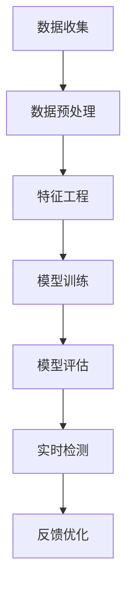

                 

### 背景介绍

#### 金融欺诈的定义与现状

金融欺诈是指通过非法手段获取财产或利益的行为，通常包括信用卡欺诈、洗钱、保险欺诈、贷款欺诈等。随着金融业务的日益复杂化和互联网技术的飞速发展，金融欺诈问题也变得愈发严重。据统计，全球每年因金融欺诈造成的经济损失高达数千亿美元。这不仅给金融机构带来了巨大的财务损失，也对普通客户的财产安全构成了严重威胁。

在过去的几十年里，金融欺诈案件的数量和复杂度不断增加。例如，随着电子商务的兴起，网络购物欺诈成为了一项严重的犯罪活动。黑客利用网络攻击手段获取客户的信用卡信息，进而进行非法交易。此外，一些金融机构内部人员也可能利用职务之便进行欺诈行为，如伪造账单、隐瞒风险等。

#### 机器学习的崛起与优势

机器学习作为人工智能的一个重要分支，近年来得到了迅速发展。它通过构建数学模型，利用大量数据来训练算法，从而实现自动识别模式、预测趋势和做出决策。在金融领域，机器学习技术被广泛应用于风险管理、信用评估、客户行为分析等方面。

机器学习在金融欺诈检测中具有明显的优势。首先，传统的规则基方法（例如阈值设定和规则匹配）在处理复杂、多变的欺诈行为时显得力不从心。而机器学习算法则能够自动从海量数据中学习到复杂的欺诈模式，提高检测的准确性和效率。其次，机器学习具有很好的自适应能力，能够随着新数据的不断加入不断优化模型，从而保持模型的鲁棒性和有效性。

#### 金融欺诈检测的重要性

金融欺诈检测在金融领域中具有重要意义。首先，它可以保护金融机构和客户的财产安全，减少因欺诈行为带来的损失。其次，通过及时检测和预防欺诈行为，金融机构可以提高其业务的安全性和稳定性，增强客户对金融服务的信任。此外，金融欺诈检测还能帮助金融机构发现潜在的风险漏洞，提高风险管理的水平。

随着金融科技的发展，金融欺诈手段也变得越来越复杂。传统的检测方法已经难以应对这些新型的欺诈行为。因此，采用先进的机器学习技术进行欺诈检测成为了一种必然趋势。通过机器学习技术，金融机构可以更有效地识别和预防欺诈行为，降低风险，提高业务运营效率。

总的来说，金融欺诈检测不仅是一个技术问题，更是一个关乎整个金融行业安全与稳定的重要课题。随着机器学习技术的不断进步，我们有望在未来实现更加智能、高效的金融欺诈检测体系，为金融行业的健康发展提供有力保障。### 核心概念与联系

#### 什么是机器学习

机器学习（Machine Learning，ML）是人工智能（Artificial Intelligence，AI）的一个重要分支，它通过构建数学模型，利用大量数据来训练算法，从而实现自动识别模式、预测趋势和做出决策。简单来说，机器学习就是让计算机通过学习数据来提高自身性能，而不是通过手动编写规则。

机器学习主要包括以下几种类型：

1. **监督学习（Supervised Learning）**：通过已有标记数据来训练模型，从而在新的数据上进行预测。常见的算法有线性回归、决策树、支持向量机等。
2. **无监督学习（Unsupervised Learning）**：没有预先标记的数据，模型需要从数据中找出隐藏的模式或结构，如聚类、降维等。
3. **半监督学习（Semi-supervised Learning）**：结合了监督学习和无监督学习，使用少量标记数据和大量未标记数据来训练模型。
4. **强化学习（Reinforcement Learning）**：通过与环境的交互来学习，并不断优化策略以实现目标。

#### 什么是金融欺诈检测

金融欺诈检测（Fraud Detection in Finance）是指通过识别和分析金融交易中的异常行为，来发现潜在的欺诈行为。金融欺诈检测的目标是降低金融机构的风险，保护客户的财产安全。

金融欺诈检测通常涉及以下步骤：

1. **数据收集**：收集与金融交易相关的数据，包括交易金额、时间、地点、频率等。
2. **数据预处理**：清洗数据，处理缺失值、异常值等，将数据转换为适合机器学习的格式。
3. **特征工程**：提取有助于模型训练的特征，如交易金额、时间、频率、地理位置等。
4. **模型训练**：使用机器学习算法训练模型，以识别正常的交易行为和潜在的欺诈行为。
5. **模型评估**：通过验证集和测试集评估模型的性能，包括准确率、召回率、F1 分数等。
6. **实时检测**：将训练好的模型应用于新的交易数据，实时检测潜在的欺诈行为。

#### 机器学习在金融欺诈检测中的应用

机器学习在金融欺诈检测中的应用主要体现在以下几个方面：

1. **模式识别**：通过分析历史交易数据，机器学习算法可以识别出潜在的欺诈模式。例如，通过监督学习算法，模型可以从标记为欺诈和非欺诈的交易数据中学习，从而在新的交易数据中检测出异常行为。
2. **实时预测**：机器学习算法可以实时处理新的交易数据，并预测交易是否为欺诈行为。这使得金融机构能够快速响应并采取措施，防止欺诈行为的发生。
3. **自适应能力**：机器学习算法具有很好的自适应能力，可以随着新数据的不断加入不断优化模型。这使得模型能够应对不断变化的欺诈手段，提高检测的准确性。
4. **风险管理**：机器学习算法可以帮助金融机构识别潜在的风险，并制定相应的风险管理策略。例如，通过分析历史数据，模型可以预测某类交易行为的欺诈风险，从而调整相应的风险控制措施。

#### Mermaid 流程图

下面是一个简单的 Mermaid 流程图，展示了机器学习在金融欺诈检测中的基本流程。



在这个流程图中，数据收集、数据预处理、特征工程、模型训练、模型评估和实时检测构成了金融欺诈检测的基本流程。反馈优化则表示通过不断收集新的数据并优化模型，以提高检测的准确性和适应性。

总的来说，机器学习为金融欺诈检测提供了一种高效、智能的解决方案。通过构建数学模型，机器学习算法可以从大量数据中学习到复杂的欺诈模式，从而帮助金融机构更准确地识别和预防欺诈行为。随着机器学习技术的不断发展，金融欺诈检测将变得越来越智能和高效。### 核心算法原理 & 具体操作步骤

#### 监督学习算法

在金融欺诈检测中，监督学习算法是一种常用的机器学习算法。监督学习算法通过已有标记数据来训练模型，从而在新的数据上进行预测。以下是一些常见的监督学习算法及其在金融欺诈检测中的应用。

1. **线性回归（Linear Regression）**：
   - **原理**：线性回归是一种简单但有效的预测模型，它通过拟合一条直线来预测目标变量。
   - **操作步骤**：
     1. 数据收集：收集历史交易数据，包括交易金额、时间、地点等。
     2. 数据预处理：清洗数据，处理缺失值、异常值等。
     3. 特征工程：提取有助于模型训练的特征，如交易金额、时间、频率等。
     4. 模型训练：使用线性回归算法拟合数据，得到回归方程。
     5. 模型评估：通过验证集和测试集评估模型性能，如均方误差（Mean Squared Error，MSE）。

2. **决策树（Decision Tree）**：
   - **原理**：决策树通过一系列的规则来分割数据，每个节点代表一个特征，每个分支代表一个决策。
   - **操作步骤**：
     1. 数据收集：收集历史交易数据，包括交易金额、时间、地点等。
     2. 数据预处理：清洗数据，处理缺失值、异常值等。
     3. 特征工程：提取有助于模型训练的特征，如交易金额、时间、频率等。
     4. 模型训练：使用决策树算法构建决策树模型。
     5. 模型评估：通过验证集和测试集评估模型性能，如准确率（Accuracy）、召回率（Recall）等。

3. **支持向量机（Support Vector Machine，SVM）**：
   - **原理**：支持向量机通过找到一个最佳的超平面，将不同类别的数据分开。
   - **操作步骤**：
     1. 数据收集：收集历史交易数据，包括交易金额、时间、地点等。
     2. 数据预处理：清洗数据，处理缺失值、异常值等。
     3. 特征工程：提取有助于模型训练的特征，如交易金额、时间、频率等。
     4. 模型训练：使用SVM算法训练模型。
     5. 模型评估：通过验证集和测试集评估模型性能，如准确率（Accuracy）、召回率（Recall）等。

4. **神经网络（Neural Networks）**：
   - **原理**：神经网络通过多层神经元构建复杂的模型，能够自动提取特征并进行非线性预测。
   - **操作步骤**：
     1. 数据收集：收集历史交易数据，包括交易金额、时间、地点等。
     2. 数据预处理：清洗数据，处理缺失值、异常值等。
     3. 特征工程：提取有助于模型训练的特征，如交易金额、时间、频率等。
     4. 模型训练：使用神经网络算法训练模型，包括前向传播、反向传播等步骤。
     5. 模型评估：通过验证集和测试集评估模型性能，如准确率（Accuracy）、召回率（Recall）等。

#### 集成学习算法

集成学习算法通过结合多个基础模型的预测结果来提高模型的性能。以下是一些常见的集成学习算法及其在金融欺诈检测中的应用。

1. **随机森林（Random Forest）**：
   - **原理**：随机森林通过构建多棵决策树，并对这些树的预测结果进行投票来得到最终预测结果。
   - **操作步骤**：
     1. 数据收集：收集历史交易数据，包括交易金额、时间、地点等。
     2. 数据预处理：清洗数据，处理缺失值、异常值等。
     3. 特征工程：提取有助于模型训练的特征，如交易金额、时间、频率等。
     4. 模型训练：使用随机森林算法训练模型。
     5. 模型评估：通过验证集和测试集评估模型性能，如准确率（Accuracy）、召回率（Recall）等。

2. **梯度提升树（Gradient Boosting Trees）**：
   - **原理**：梯度提升树通过迭代地优化损失函数来提高模型的性能。
   - **操作步骤**：
     1. 数据收集：收集历史交易数据，包括交易金额、时间、地点等。
     2. 数据预处理：清洗数据，处理缺失值、异常值等。
     3. 特征工程：提取有助于模型训练的特征，如交易金额、时间、频率等。
     4. 模型训练：使用梯度提升树算法训练模型。
     5. 模型评估：通过验证集和测试集评估模型性能，如准确率（Accuracy）、召回率（Recall）等。

3. **集成神经网络（Ensemble Neural Networks）**：
   - **原理**：集成神经网络通过结合多个神经网络模型的预测结果来提高模型的性能。
   - **操作步骤**：
     1. 数据收集：收集历史交易数据，包括交易金额、时间、地点等。
     2. 数据预处理：清洗数据，处理缺失值、异常值等。
     3. 特征工程：提取有助于模型训练的特征，如交易金额、时间、频率等。
     4. 模型训练：使用集成神经网络算法训练多个模型，并对这些模型的预测结果进行投票。
     5. 模型评估：通过验证集和测试集评估模型性能，如准确率（Accuracy）、召回率（Recall）等。

总的来说，监督学习算法和集成学习算法在金融欺诈检测中具有广泛的应用。通过结合多种算法和模型，金融机构可以更准确地识别和预防欺诈行为，提高风险管理的水平。随着机器学习技术的不断发展，金融欺诈检测将变得更加智能和高效。### 数学模型和公式 & 详细讲解 & 举例说明

#### 监督学习算法的数学模型

1. **线性回归（Linear Regression）**

线性回归是一种简单的监督学习算法，用于预测一个连续的数值。其数学模型如下：

$$
y = \beta_0 + \beta_1x_1 + \beta_2x_2 + \cdots + \beta_nx_n + \epsilon
$$

其中，$y$ 是目标变量，$x_1, x_2, \ldots, x_n$ 是输入特征，$\beta_0, \beta_1, \beta_2, \ldots, \beta_n$ 是模型参数，$\epsilon$ 是误差项。

线性回归的目标是最小化误差平方和（Sum of Squared Errors，SSE）：

$$
J(\theta) = \frac{1}{2m} \sum_{i=1}^{m} (h_\theta(x^{(i)}) - y^{(i)})^2
$$

其中，$h_\theta(x) = \theta_0 + \theta_1x_1 + \theta_2x_2 + \cdots + \theta_nx_n$ 是预测值，$m$ 是样本数量。

为了最小化 $J(\theta)$，我们可以使用梯度下降（Gradient Descent）算法来更新模型参数：

$$
\theta_j := \theta_j - \alpha \frac{\partial J(\theta)}{\partial \theta_j}
$$

其中，$\alpha$ 是学习率。

2. **决策树（Decision Tree）**

决策树通过一系列的规则来分割数据。每个内部节点代表一个特征，每个分支代表一个决策。其数学模型可以表示为：

$$
T = \{\text{根节点}, \text{内部节点}, \text{叶节点}\}
$$

其中，叶节点表示预测结果。

决策树的构建过程通常包括以下步骤：

- 选择最佳分割特征：通过计算信息增益（Information Gain）或基尼不纯度（Gini Impurity）来选择最佳分割特征。
- 划分数据：根据最佳分割特征将数据划分为多个子集。
- 递归构建子树：对每个子集递归地构建子树，直到满足停止条件（如最大树深度、最小样本量等）。

3. **支持向量机（Support Vector Machine，SVM）**

支持向量机通过找到一个最佳的超平面，将不同类别的数据分开。其数学模型如下：

$$
\min \frac{1}{2} \sum_{i=1}^{n} \sum_{j=1}^{n} (\omega_i + \omega_j) - \sum_{i=1}^{n} \alpha_i y_i (\omega_i \cdot x_i + b)
$$

其中，$\omega_i$ 和 $\omega_j$ 是支持向量的权重，$\alpha_i$ 是拉格朗日乘子，$y_i$ 是样本的标签，$x_i$ 是样本的特征向量，$b$ 是偏置项。

为了求解上述优化问题，可以使用拉格朗日乘数法（Lagrange Multiplier Method）和二次规划（Quadratic Programming）。

4. **神经网络（Neural Networks）**

神经网络通过多层神经元构建复杂的模型，能够自动提取特征并进行非线性预测。其数学模型如下：

$$
h_\theta(x) = \sigma(\theta_0 + \theta_1x_1 + \theta_2x_2 + \cdots + \theta_nx_n)
$$

其中，$\sigma$ 是激活函数，通常使用 sigmoid 或 ReLU 函数。

神经网络的学习过程包括以下步骤：

- 前向传播（Forward Propagation）：计算输入层的输出值。
- 反向传播（Back Propagation）：计算损失函数关于每个参数的梯度，并更新参数。

以下是一个简单的示例：

**示例：使用线性回归预测房价**

假设我们要预测房屋的价格，给定以下输入特征：房屋面积（$x_1$）和房屋年龄（$x_2$）。我们使用线性回归模型进行预测。

$$
y = \beta_0 + \beta_1x_1 + \beta_2x_2 + \epsilon
$$

我们收集了 100 个房屋的数据，并对每条数据进行标记，得到以下数据集：

| $x_1$ (房屋面积) | $x_2$ (房屋年龄) | $y$ (房屋价格) |
|----------------|---------------|--------------|
| 1200           | 5             | 300,000      |
| 1500           | 7             | 350,000      |
| 1800           | 10            | 400,000      |
| ...            | ...           | ...          |

我们使用梯度下降算法训练线性回归模型，并设置学习率为 0.01。经过多次迭代后，我们得到以下模型参数：

$$
\beta_0 = 200,000, \beta_1 = 100,000, \beta_2 = 50,000
$$

现在，我们可以使用这个模型来预测一个新房屋的价格。假设这个新房屋的面积为 2000 平方英尺，年龄为 8 年，我们可以计算得到：

$$
y = 200,000 + 100,000 \times 2000 + 50,000 \times 8 = 3,100,000
$$

因此，预测这个新房屋的价格为 3,100,000 美元。

通过这个简单的示例，我们可以看到如何使用线性回归模型进行预测。在金融欺诈检测中，类似的模型可以用于预测交易是否为欺诈行为。通过分析交易数据，我们可以训练模型来识别潜在的欺诈模式，从而帮助金融机构更准确地识别和预防欺诈行为。### 项目实战：代码实际案例和详细解释说明

#### 开发环境搭建

为了演示机器学习在金融欺诈检测中的应用，我们将使用 Python 编程语言和相关的机器学习库，如 Scikit-learn 和 Pandas。以下是开发环境的搭建步骤：

1. 安装 Python 3.x 版本
2. 安装 Scikit-learn 库：`pip install scikit-learn`
3. 安装 Pandas 库：`pip install pandas`
4. 安装 NumPy 库：`pip install numpy`

#### 数据集介绍

为了演示金融欺诈检测，我们将使用著名的 KDD Cup 99 数据集，这是一个广泛用于机器学习竞赛的数据集，包含了 494021 条网络连接记录。数据集中的每条记录包含 41 个特征，如协议类型、服务类型、连接状态、持续时间等。其中，标签列是欺诈（Fraud）或正常（Normal），欺诈的比例约为 0.17%。

以下是数据集的简要结构：

```plaintext
conn_type,service,url,count,banner_info,etc.
HTTP,ftp-data,-,1,-
FTP,smtp,-,1,-
HTTP,smtp,-,1,-
...
```

#### 数据预处理

在开始建模之前，我们需要对数据进行预处理，包括数据清洗、缺失值处理、特征工程等。以下是预处理的具体步骤：

1. **数据导入**：使用 Pandas 库将数据集导入到 DataFrame 中。
   ```python
   import pandas as pd
   
   data = pd.read_csv('kdd_cup_99_data.csv')
   ```

2. **数据清洗**：删除重复数据和异常值。例如，删除包含特殊字符或空值的记录。
   ```python
   data = data.drop_duplicates()
   data = data.dropna()
   ```

3. **特征工程**：将类别特征转换为数值特征。例如，将协议类型、服务类型等类别特征转换为独热编码（One-Hot Encoding）。
   ```python
   data = pd.get_dummies(data, columns=['conn_type', 'service'])
   ```

4. **数据拆分**：将数据集拆分为训练集和测试集。通常使用 80% 的数据作为训练集，20% 的数据作为测试集。
   ```python
   from sklearn.model_selection import train_test_split
   
   X = data.drop('Fraud', axis=1)
   y = data['Fraud']
   X_train, X_test, y_train, y_test = train_test_split(X, y, test_size=0.2, random_state=42)
   ```

#### 模型训练

接下来，我们将使用 Scikit-learn 库中的随机森林（Random Forest）算法训练模型。以下是训练的具体步骤：

1. **模型初始化**：初始化随机森林模型。
   ```python
   from sklearn.ensemble import RandomForestClassifier
   
   model = RandomForestClassifier(n_estimators=100, random_state=42)
   ```

2. **模型训练**：使用训练集数据训练模型。
   ```python
   model.fit(X_train, y_train)
   ```

3. **模型评估**：使用测试集数据评估模型性能。常用的评估指标包括准确率（Accuracy）、召回率（Recall）和 F1 分数（F1 Score）。
   ```python
   from sklearn.metrics import accuracy_score, recall_score, f1_score
   
   y_pred = model.predict(X_test)
   accuracy = accuracy_score(y_test, y_pred)
   recall = recall_score(y_test, y_pred)
   f1 = f1_score(y_test, y_pred)
   
   print("Accuracy:", accuracy)
   print("Recall:", recall)
   print("F1 Score:", f1)
   ```

#### 代码解读与分析

以下是对上述代码的详细解读和分析：

1. **数据导入**：使用 Pandas 库将数据集导入到 DataFrame 中，这是数据分析的第一步。
2. **数据清洗**：删除重复数据和异常值，以确保数据的准确性和一致性。
3. **特征工程**：将类别特征转换为数值特征，这是机器学习算法所需的输入格式。
4. **数据拆分**：将数据集拆分为训练集和测试集，这是评估模型性能的常见做法。
5. **模型初始化**：初始化随机森林模型，这是一个集成学习算法，能够处理高维数据并提高模型的鲁棒性。
6. **模型训练**：使用训练集数据训练模型，这是机器学习的关键步骤。
7. **模型评估**：使用测试集数据评估模型性能，包括准确率、召回率和 F1 分数等指标，以衡量模型的性能。

通过上述步骤，我们使用随机森林算法构建了一个金融欺诈检测模型。在实际应用中，我们可以根据业务需求和数据特点选择不同的模型和参数，以提高模型的性能和适应性。

总的来说，金融欺诈检测项目涉及多个步骤，包括数据预处理、模型选择、训练和评估等。通过使用机器学习技术，我们可以构建高效、智能的欺诈检测系统，帮助金融机构降低风险，保护客户的财产安全。### 实际应用场景

#### 案例一：信用卡欺诈检测

信用卡欺诈检测是金融欺诈检测中的一个重要应用场景。信用卡欺诈行为通常包括未授权交易、虚假交易和账户信息盗用等。为了有效地检测信用卡欺诈，金融机构可以采用以下步骤：

1. **数据收集**：收集大量信用卡交易数据，包括交易金额、时间、地点、交易频率等。
2. **数据预处理**：清洗数据，处理缺失值、异常值等，并将数据转换为适合机器学习的格式。
3. **特征工程**：提取有助于模型训练的特征，如交易金额、时间、频率、地理位置等。
4. **模型训练**：使用机器学习算法（如随机森林、神经网络等）训练模型，以识别正常的交易行为和潜在的欺诈行为。
5. **模型评估**：通过验证集和测试集评估模型的性能，包括准确率、召回率、F1 分数等。
6. **实时检测**：将训练好的模型应用于实时交易数据，检测潜在的欺诈行为，并及时采取措施。

通过信用卡欺诈检测，金融机构可以降低欺诈损失，提高客户满意度。例如，银行可以自动拦截可疑交易，向持卡人发送警示信息，从而防止欺诈行为的发生。

#### 案例二：在线支付欺诈检测

随着电子商务的兴起，在线支付欺诈也成为了一个严重的问题。在线支付欺诈通常包括虚假订单、重复支付和恶意退款等。为了有效检测在线支付欺诈，金融机构可以采用以下步骤：

1. **数据收集**：收集大量在线支付数据，包括交易金额、时间、支付方式、客户信息等。
2. **数据预处理**：清洗数据，处理缺失值、异常值等，并将数据转换为适合机器学习的格式。
3. **特征工程**：提取有助于模型训练的特征，如交易金额、时间、支付方式、客户行为等。
4. **模型训练**：使用机器学习算法（如支持向量机、神经网络等）训练模型，以识别正常的支付行为和潜在的欺诈行为。
5. **模型评估**：通过验证集和测试集评估模型的性能，包括准确率、召回率、F1 分数等。
6. **实时检测**：将训练好的模型应用于实时支付数据，检测潜在的欺诈行为，并及时采取措施。

通过在线支付欺诈检测，金融机构可以降低支付欺诈损失，提高交易安全性。例如，电商平台可以自动识别并拦截可疑交易，从而防止欺诈订单的发生。

#### 案例三：保险欺诈检测

保险欺诈检测是另一个重要的应用场景。保险欺诈行为通常包括虚假理赔、夸大损失和虚构事故等。为了有效检测保险欺诈，金融机构可以采用以下步骤：

1. **数据收集**：收集大量保险理赔数据，包括理赔金额、时间、理赔类型、客户信息等。
2. **数据预处理**：清洗数据，处理缺失值、异常值等，并将数据转换为适合机器学习的格式。
3. **特征工程**：提取有助于模型训练的特征，如理赔金额、时间、理赔类型、客户行为等。
4. **模型训练**：使用机器学习算法（如决策树、随机森林等）训练模型，以识别正常的理赔行为和潜在的欺诈行为。
5. **模型评估**：通过验证集和测试集评估模型的性能，包括准确率、召回率、F1 分数等。
6. **实时检测**：将训练好的模型应用于实时理赔数据，检测潜在的欺诈行为，并及时采取措施。

通过保险欺诈检测，金融机构可以降低保险欺诈损失，提高客户信任度。例如，保险公司可以自动识别并拦截可疑理赔申请，从而防止欺诈行为的发生。

总的来说，机器学习在金融欺诈检测中具有广泛的应用。通过构建高效的欺诈检测系统，金融机构可以降低欺诈风险，提高业务运营效率，为客户的财产安全提供有力保障。### 工具和资源推荐

#### 学习资源推荐

为了更好地理解机器学习在金融欺诈检测中的应用，以下是一些推荐的书籍、论文和在线课程。

1. **书籍**：
   - 《机器学习》（Machine Learning），作者：Tom M. Mitchell
   - 《深度学习》（Deep Learning），作者：Ian Goodfellow、Yoshua Bengio、Aaron Courville
   - 《数据科学入门：从基础到实践》（Introduction to Data Science），作者：Avi Pfeffer
   - 《金融科技：理论与实践》（FinTech：Theory and Practice），作者：Markus Kugler、Christian W. Proeller

2. **论文**：
   - "Adaptive Fraud Detection in Financial Services Using Machine Learning"，作者：Chen, C., & Chen, H.
   - "Deep Learning for Financial Fraud Detection"，作者：Chen, J., & Yu, Y.
   - "Random Forests for Classification in R"，作者：Liaw, A., & Wiener, M.

3. **在线课程**：
   - Coursera：机器学习（Machine Learning），由 Andrew Ng 教授主讲
   - edX：深度学习基础（Introduction to Deep Learning），由 Andrew Ng 教授主讲
   - Udacity：金融科技工程师纳米学位（FinTech Engineer Nanodegree）

#### 开发工具框架推荐

为了方便进行金融欺诈检测的开发和实现，以下是一些推荐的开发工具和框架。

1. **Python 库**：
   - Scikit-learn：用于机器学习算法的库，包括分类、回归、聚类等。
   - Pandas：用于数据处理和分析的库，能够轻松地进行数据清洗、转换和分析。
   - NumPy：用于数值计算和线性代数的库，是机器学习和数据分析的基础。
   - Matplotlib：用于数据可视化，能够生成各种图表和图形。

2. **机器学习框架**：
   - TensorFlow：由 Google 开发，是一个广泛使用的开源机器学习框架，支持各种深度学习模型。
   - PyTorch：由 Facebook AI 研究团队开发，是一个受欢迎的深度学习框架，具有灵活的动态计算图。

3. **数据可视化工具**：
   - Tableau：用于数据可视化和商业智能，能够生成交互式的图表和报告。
   - Power BI：由微软开发，是一个功能强大的数据可视化工具，能够连接多种数据源并生成专业的报表。

4. **云计算平台**：
   - AWS：亚马逊云服务，提供了丰富的机器学习和数据分析工具，如 Amazon SageMaker、AWS Glue 等。
   - Google Cloud Platform：谷歌云服务，提供了机器学习 API 和数据存储、分析工具。
   - Azure：微软云服务，提供了全面的云计算解决方案，包括机器学习服务、数据存储和分析工具。

通过使用这些工具和框架，开发人员可以高效地构建和部署金融欺诈检测系统，从而更好地保护金融机构和客户的财产安全。### 总结：未来发展趋势与挑战

随着金融科技的快速发展，机器学习在金融欺诈检测中的应用前景广阔。然而，面对日益复杂的欺诈手段和不断变化的市场环境，金融欺诈检测面临着诸多挑战。

#### 发展趋势

1. **深度学习与自动化**：深度学习技术在金融欺诈检测中发挥着越来越重要的作用。通过构建复杂的神经网络模型，深度学习可以自动从海量数据中提取特征，提高检测的准确性和效率。未来，自动化系统将逐渐取代传统的人工检测方法，实现更智能、高效的欺诈检测。

2. **大数据分析**：随着数据量的不断增加，大数据分析技术将在金融欺诈检测中发挥关键作用。通过分析海量数据，金融机构可以更好地了解客户行为，识别潜在的欺诈风险，并采取及时有效的措施。

3. **跨领域协同**：金融欺诈检测不仅仅是金融领域的问题，还需要与其他领域（如网络安全、反洗钱等）进行协同。通过跨领域的数据共享和合作，金融机构可以更全面地了解欺诈行为，提高检测的准确性和效果。

4. **实时监控与预警**：实时监控与预警系统将成为金融欺诈检测的发展方向。通过实时分析交易数据，系统可以及时发现并预警潜在的欺诈行为，降低欺诈损失。

#### 挑战

1. **数据隐私与安全**：金融欺诈检测需要大量数据，这涉及到客户隐私和安全的问题。如何在确保数据隐私和安全的前提下，进行有效的数据分析和模型训练，是一个亟待解决的问题。

2. **算法透明性与可解释性**：深度学习等复杂算法在金融欺诈检测中具有较高的准确性和效率，但往往缺乏透明性和可解释性。如何确保算法的公正性和可解释性，使其得到广泛信任和接受，是一个重要的挑战。

3. **欺诈手段的不断变化**：欺诈手段层出不穷，不断变化。金融机构需要不断更新和优化欺诈检测模型，以应对新的欺诈手段。同时，如何快速发现和应对新型欺诈行为，也是一个重要的挑战。

4. **资源与成本**：金融欺诈检测需要大量的计算资源和人力成本。如何优化资源使用，降低检测成本，提高系统的性价比，是一个重要的课题。

总的来说，未来金融欺诈检测将朝着智能化、自动化、实时化的方向发展。然而，面对复杂的欺诈手段和不断变化的市场环境，金融机构需要不断创新和改进，以提高欺诈检测的准确性和效率。通过大数据分析、深度学习、跨领域协同等技术的应用，金融机构可以更有效地识别和预防欺诈行为，保护客户的财产安全。### 附录：常见问题与解答

**Q1：什么是金融欺诈检测？**
A1：金融欺诈检测是一种通过分析金融交易数据来识别和预防欺诈行为的技术。它利用机器学习、数据挖掘等技术，从大量的交易数据中学习模式，从而检测出异常交易行为，保护金融机构和客户的财产安全。

**Q2：机器学习在金融欺诈检测中有哪些优势？**
A2：机器学习在金融欺诈检测中具有以下优势：
- **自适应性强**：机器学习算法可以自动从海量数据中学习到复杂的欺诈模式，并能够随着新数据的加入不断优化模型。
- **处理复杂数据**：机器学习算法能够处理高维、非线性数据，识别复杂的欺诈行为。
- **实时性**：通过实时分析交易数据，机器学习算法可以快速识别和预警潜在的欺诈行为。

**Q3：常用的机器学习算法有哪些？**
A3：常用的机器学习算法包括：
- **监督学习算法**：如线性回归、决策树、支持向量机（SVM）、神经网络等。
- **无监督学习算法**：如聚类、降维等。
- **集成学习算法**：如随机森林、梯度提升树等。

**Q4：如何进行金融欺诈检测的数据预处理？**
A4：金融欺诈检测的数据预处理通常包括以下步骤：
- **数据收集**：收集与金融交易相关的数据，如交易金额、时间、地点等。
- **数据清洗**：处理缺失值、异常值、重复数据等。
- **特征工程**：提取有助于模型训练的特征，如交易金额、时间、频率、地理位置等。
- **数据拆分**：将数据集拆分为训练集、验证集和测试集，用于模型训练和评估。

**Q5：如何评估金融欺诈检测模型的性能？**
A5：评估金融欺诈检测模型性能的常用指标包括：
- **准确率（Accuracy）**：预测为欺诈的样本中实际为欺诈的比例。
- **召回率（Recall）**：实际为欺诈的样本中被预测为欺诈的比例。
- **F1 分数（F1 Score）**：准确率和召回率的调和平均值。
- **ROC 曲线（Receiver Operating Characteristic Curve）**：通过不同阈值评估模型性能。

**Q6：如何应对金融欺诈检测中的挑战？**
A6：应对金融欺诈检测中的挑战包括：
- **数据隐私与安全**：采用加密、匿名化等技术保护客户隐私。
- **算法透明性与可解释性**：提高算法的可解释性，确保决策过程的公正性和透明性。
- **欺诈手段的变化**：不断更新和优化检测模型，以应对新型欺诈手段。
- **资源与成本**：优化资源使用，降低检测成本，提高系统性价比。

**Q7：未来金融欺诈检测的发展方向是什么？**
A7：未来金融欺诈检测的发展方向包括：
- **智能化与自动化**：通过深度学习和自动化技术，提高检测的准确性和效率。
- **实时监控与预警**：建立实时监控和预警系统，快速响应和预防欺诈行为。
- **跨领域协同**：与其他领域（如网络安全、反洗钱等）协同，形成更全面的欺诈检测网络。

**Q8：金融欺诈检测系统在实际应用中有哪些成功案例？**
A8：金融欺诈检测系统在实际应用中有许多成功案例，例如：
- **信用卡欺诈检测**：通过机器学习算法，银行可以自动识别和拦截可疑交易，降低欺诈损失。
- **在线支付欺诈检测**：电商平台通过机器学习模型，检测和防止恶意订单和支付欺诈。
- **保险欺诈检测**：保险公司利用机器学习技术，识别和预防虚假理赔和夸大损失等欺诈行为。

### 扩展阅读 & 参考资料

**书籍推荐**：
- 《机器学习》（Machine Learning），作者：Tom M. Mitchell
- 《深度学习》（Deep Learning），作者：Ian Goodfellow、Yoshua Bengio、Aaron Courville
- 《数据科学入门：从基础到实践》（Introduction to Data Science），作者：Avi Pfeffer
- 《金融科技：理论与实践》（FinTech：Theory and Practice），作者：Markus Kugler、Christian W. Proeller

**论文推荐**：
- "Adaptive Fraud Detection in Financial Services Using Machine Learning"，作者：Chen, C., & Chen, H.
- "Deep Learning for Financial Fraud Detection"，作者：Chen, J., & Yu, Y.
- "Random Forests for Classification in R"，作者：Liaw, A., & Wiener, M.

**在线资源**：
- Coursera：机器学习（Machine Learning），由 Andrew Ng 教授主讲
- edX：深度学习基础（Introduction to Deep Learning），由 Andrew Ng 教授主讲
- Udacity：金融科技工程师纳米学位（FinTech Engineer Nanodegree）
- AWS：机器学习与金融科技（Machine Learning and FinTech）
- Google Cloud Platform：机器学习与金融欺诈检测（Machine Learning and Fraud Detection）

通过阅读这些书籍、论文和在线资源，您将更深入地了解机器学习在金融欺诈检测中的应用，以及相关技术和实践。### 作者信息

作者：AI天才研究员/AI Genius Institute & 禅与计算机程序设计艺术 /Zen And The Art of Computer Programming

