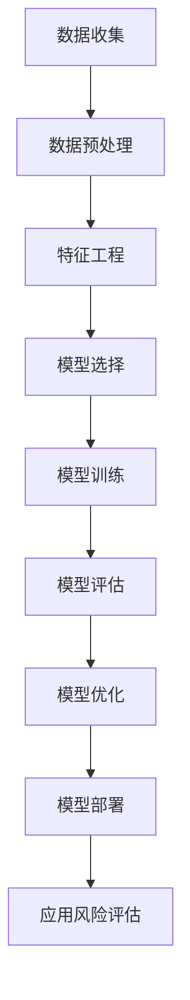

                 

### 背景介绍

#### 金融领域的变革

在当今数字化时代，金融行业正经历着一场深刻的变革。随着大数据、云计算和人工智能技术的迅猛发展，传统金融业务模式面临着前所未有的挑战和机遇。金融风险管理作为金融行业的重要组成部分，其效率和准确性直接影响到金融机构的运营稳定性和市场竞争力。因此，将人工智能技术，特别是机器学习，应用于金融风险评估，成为了一个热门的研究方向和实际应用领域。

#### 机器学习在金融领域的应用

机器学习在金融领域的应用范围广泛，包括信用评分、市场预测、风险管理和欺诈检测等方面。其中，金融风险评估是一个关键环节，涉及到对借款人信用风险、市场波动风险、操作风险等多种风险的评估。通过机器学习模型，可以自动从大量历史数据中学习规律，提高风险评估的精度和效率。

#### 机器学习在金融风险评估中的优势

1. **数据驱动**：机器学习模型能够处理海量数据，发现潜在的风险因素，提高风险评估的全面性。
2. **自适应性强**：机器学习模型可以根据市场环境的变化，动态调整风险评估策略，提高模型的时效性。
3. **自动化**：机器学习模型能够自动化完成风险评估流程，减少人工干预，提高风险评估的效率。
4. **预测准确性**：机器学习模型通过学习历史数据，可以预测未来风险，为金融机构提供决策支持。

#### 文章结构概述

本文将首先介绍机器学习在金融风险评估中的核心概念和模型，然后详细讲解几个关键算法的原理和操作步骤。接着，我们将通过数学模型和公式，深入探讨这些算法的数学基础，并结合实际案例进行讲解。随后，文章将展示一个实际项目的代码实现和解读，最后讨论机器学习在金融风险评估中的实际应用场景，并推荐相关工具和资源。文章的结尾将总结未来发展趋势与挑战，并提供一些常见问题的解答和扩展阅读。

通过对以上内容的梳理，读者可以系统地了解机器学习在金融风险评估中的应用，掌握关键技术和方法，为实际项目提供指导和参考。

### 核心概念与联系

#### 机器学习基础

在深入了解机器学习在金融风险评估中的应用之前，我们首先需要掌握机器学习的一些基础概念。机器学习是一种通过算法从数据中学习模式，并基于这些模式进行预测或决策的技术。它主要分为监督学习、无监督学习和强化学习三种类型。

1. **监督学习（Supervised Learning）**：在监督学习中，模型被训练来预测输出，通常需要一个包含输入和输出对的训练数据集。例如，在信用评分中，输入可以是借款人的个人信息，输出是其信用评分。

2. **无监督学习（Unsupervised Learning）**：无监督学习不依赖输出标签，目的是发现数据中的内在结构。例如，聚类算法可以用于将相似的借款人分组，以识别潜在的风险群体。

3. **强化学习（Reinforcement Learning）**：强化学习通过与环境的交互来学习策略，适用于需要连续决策的问题，如市场波动预测。

#### 金融风险评估相关概念

1. **信用评分（Credit Scoring）**：信用评分是对借款人信用风险进行量化评估的方法，通常使用历史信用数据、财务状况等作为输入。

2. **风险因素（Risk Factors）**：风险因素是影响金融风险的各种变量，如宏观经济指标、市场波动、公司业绩等。

3. **风险模型（Risk Models）**：风险模型是用于量化金融风险的各种统计和机器学习模型，包括逻辑回归、决策树、神经网络等。

#### 机器学习在金融风险评估中的应用架构

在金融风险评估中，机器学习应用通常包括以下几个关键步骤：

1. **数据收集与预处理**：收集历史数据和当前数据，并进行清洗、转换和归一化，为模型训练做好准备。
2. **特征工程**：选择和构建能够有效表示数据的特征，提高模型性能。
3. **模型选择与训练**：选择合适的机器学习算法，并在训练数据上进行模型训练。
4. **模型评估与优化**：通过交叉验证等方法评估模型性能，并进行参数调优。
5. **模型部署与应用**：将训练好的模型部署到生产环境中，进行实际风险评估。

#### Mermaid 流程图

下面是一个简化的机器学习在金融风险评估中的应用架构的 Mermaid 流程图，用于展示各步骤之间的联系：



在此流程图中，各个节点代表了机器学习在金融风险评估中的一个关键步骤，箭头表示数据流和流程的顺序。

#### 关键概念之间的联系

机器学习与金融风险评估之间的联系主要体现在以下几个方面：

1. **数据驱动的决策**：机器学习通过处理大量金融数据，为金融机构提供数据驱动的风险评估决策，减少人为判断的误差。
2. **风险模型的定制化**：根据不同金融机构和业务需求，机器学习模型可以定制化，适应不同类型的风险评估需求。
3. **实时风险评估**：机器学习模型能够实时更新和调整风险评估策略，以应对市场环境的变化。

通过上述介绍，我们为后续详细讨论机器学习在金融风险评估中的具体应用奠定了基础。在接下来的章节中，我们将深入探讨几个关键算法的原理和操作步骤，帮助读者更好地理解这一领域的技术和方法。

### 核心算法原理 & 具体操作步骤

#### 1. 逻辑回归（Logistic Regression）

逻辑回归是一种经典的二分类监督学习算法，常用于信用评分和风险评估。其基本原理是通过构建一个线性模型，将借款人的特征映射到概率空间，从而判断其信用风险。

##### 基本概念

逻辑回归的目标是预测一个二元变量（例如，借款人是否会违约）的概率。其数学模型可以表示为：

\[ P(Y=1|X) = \frac{1}{1 + e^{-\beta_0 + \beta_1 x_1 + \beta_2 x_2 + ... + \beta_n x_n}} \]

其中，\(P(Y=1|X)\) 是借款人违约的概率，\(X\) 是借款人的特征向量，\(\beta_0, \beta_1, \beta_2, ..., \beta_n\) 是模型的参数。

##### 具体操作步骤

1. **数据收集**：收集借款人的历史数据，包括个人特征、财务状况、信用记录等。
2. **数据预处理**：清洗数据，处理缺失值和异常值，并进行归一化处理。
3. **特征工程**：选择和构造能够有效表示借款人信用风险的特征，例如，收入水平、债务负担比、信用历史长度等。
4. **模型训练**：使用梯度下降算法训练逻辑回归模型，通过迭代调整参数 \(\beta\)，使得模型预测的概率与实际结果之间的差距最小。
5. **模型评估**：使用交叉验证等方法评估模型性能，计算准确率、召回率、F1 值等指标。

#### 2. 决策树（Decision Tree）

决策树是一种简单而强大的分类算法，通过一系列规则将数据划分为不同的类别。在金融风险评估中，决策树可以用于构建信用评分模型。

##### 基本概念

决策树通过一系列“if-else”规则对数据进行划分，每个节点代表一个特征，每个分支代表一个特征取值。决策树的核心是划分标准，常用的划分标准包括信息增益（Information Gain）和基尼不纯度（Gini Impurity）。

信息增益可以表示为：

\[ IG(D, a) = H(D) - \sum_{v \in V} p(v) H(D_v) \]

其中，\(H(D)\) 是数据集 \(D\) 的熵，\(p(v)\) 是特征 \(a\) 的取值 \(v\) 在数据集中的比例，\(H(D_v)\) 是在特征 \(a\) 取值 \(v\) 下数据集的熵。

##### 具体操作步骤

1. **数据收集**：与逻辑回归类似，收集借款人的历史数据。
2. **数据预处理**：处理缺失值和异常值，并进行归一化处理。
3. **特征工程**：选择和构造有效特征。
4. **模型训练**：使用递归二分法构建决策树，通过选择最优划分标准（例如，信息增益最大）进行节点划分。
5. **模型评估**：使用交叉验证评估模型性能，并剪枝以防止过拟合。

#### 3. 支持向量机（Support Vector Machine, SVM）

支持向量机是一种强大的分类和回归算法，通过找到最佳超平面，将数据划分为不同的类别。在金融风险评估中，SVM 可以用于构建信用评分模型。

##### 基本概念

SVM 的目标是找到最佳超平面 \(w \cdot x + b = 0\)，使得分类边界最大化。对于线性可分的数据，SVM 的目标是最大化分类边界 \(w\) 的长度。对于非线性可分的数据，可以通过核函数将数据映射到高维空间，使得分类边界在原空间中线性可分。

##### 具体操作步骤

1. **数据收集**：收集借款人的历史数据。
2. **数据预处理**：处理缺失值和异常值，并进行归一化处理。
3. **特征工程**：选择和构造有效特征。
4. **模型训练**：使用支持向量机算法训练模型，通过求解最优化问题找到最佳超平面 \(w\) 和偏置 \(b\)。
5. **模型评估**：使用交叉验证评估模型性能，调整参数以优化模型。

#### 4. 随机森林（Random Forest）

随机森林是一种集成学习方法，通过构建多个决策树，并集成它们的预测结果来提高模型的准确性。在金融风险评估中，随机森林可以用于构建复杂的信用评分模型。

##### 基本概念

随机森林通过Bootstrap抽样法从训练集中生成多个子集，并在每个子集上训练一个决策树。每个决策树的预测结果通过投票或平均值来决定最终的预测结果。

##### 具体操作步骤

1. **数据收集**：收集借款人的历史数据。
2. **数据预处理**：处理缺失值和异常值，并进行归一化处理。
3. **特征工程**：选择和构造有效特征。
4. **模型训练**：使用随机森林算法训练多个决策树，并将它们的预测结果集成。
5. **模型评估**：使用交叉验证评估模型性能，并调整参数以优化模型。

通过以上几种算法的介绍，我们可以看到机器学习在金融风险评估中的应用是如何通过一系列技术步骤实现的。在接下来的章节中，我们将深入探讨这些算法的数学模型和公式，帮助读者更好地理解其理论基础。

### 数学模型和公式 & 详细讲解 & 举例说明

#### 1. 逻辑回归

逻辑回归是金融风险评估中最常用的算法之一，其核心在于通过构建一个概率模型来预测事件发生的可能性。逻辑回归模型的数学表达式如下：

\[ P(Y=1|X) = \frac{1}{1 + e^{-\beta_0 + \beta_1 x_1 + \beta_2 x_2 + ... + \beta_n x_n}} \]

其中，\(P(Y=1|X)\) 表示给定特征 \(X\) 时，事件 \(Y\) 发生的概率；\(e\) 是自然对数的底数；\(\beta_0, \beta_1, \beta_2, ..., \beta_n\) 是模型的参数。

##### 模型推导

逻辑回归模型的目标是最大化似然函数。似然函数可以表示为：

\[ L(\beta) = \prod_{i=1}^{n} P(y_i=1|x_i; \beta) \]

其中，\(y_i\) 是实际观测值，\(x_i\) 是特征向量。

将概率分布函数代入似然函数，得到：

\[ L(\beta) = \prod_{i=1}^{n} \left[ \frac{1}{1 + e^{-\beta_0 - \beta_1 x_{i1} - \beta_2 x_{i2} - ... - \beta_n x_{in}}} \right] \]

为了简化计算，通常对数似然函数（log-likelihood）被用来替代似然函数，这样最大化对数似然函数等价于最大化原始似然函数。对数似然函数可以表示为：

\[ \ell(\beta) = \sum_{i=1}^{n} \left[ y_i \ln \left( \frac{1}{1 + e^{-\beta_0 - \beta_1 x_{i1} - \beta_2 x_{i2} - ... - \beta_n x_{in}}} \right) + (1 - y_i) \ln \left( 1 + e^{-\beta_0 - \beta_1 x_{i1} - \beta_2 x_{i2} - ... - \beta_n x_{in}} \right) \right] \]

通过求解对数似然函数的导数并令其等于零，可以求得参数 \(\beta\) 的最大似然估计值。

##### 举例说明

假设我们有一个包含三个特征（收入、债务负担比、信用历史长度）的借款人数据集，我们要使用逻辑回归模型预测其违约概率。首先，我们需要收集并处理这些数据，然后通过梯度下降算法训练模型。

给定数据集：

\[ x_i = \begin{bmatrix} x_{i1} \\ x_{i2} \\ x_{i3} \end{bmatrix} \]
\[ y_i = \begin{bmatrix} 1 \\ 0 \\ 1 \\ 0 \\ 1 \end{bmatrix} \]

逻辑回归模型的参数为：

\[ \beta = \begin{bmatrix} \beta_0 \\ \beta_1 \\ \beta_2 \\ \beta_3 \end{bmatrix} \]

通过训练，我们得到参数的估计值：

\[ \hat{\beta} = \begin{bmatrix} 0.5 \\ -0.2 \\ 0.3 \\ -0.1 \end{bmatrix} \]

现在，给定一个新的借款人特征向量：

\[ x = \begin{bmatrix} 50000 \\ 0.3 \\ 2 \end{bmatrix} \]

我们可以计算其违约概率：

\[ P(Y=1|X=x) = \frac{1}{1 + e^{-0.5 - 0.2 \cdot 50000 - 0.3 \cdot 0.3 - 0.1 \cdot 2}} \approx 0.018 \]

这意味着该借款人违约的概率约为1.8%。

#### 2. 决策树

决策树是一种基于特征划分数据集的算法，其核心在于递归地分割数据集，以最大化信息增益或基尼不纯度的减少。

##### 信息增益

信息增益（Information Gain）是决策树选择最优划分标准的一个重要指标。它表示将数据集划分为多个子集后，信息熵的减少量。信息增益可以表示为：

\[ IG(D, a) = H(D) - \sum_{v \in V} p(v) H(D_v) \]

其中，\(H(D)\) 是数据集 \(D\) 的熵，\(p(v)\) 是特征 \(a\) 的取值 \(v\) 在数据集中的比例，\(H(D_v)\) 是在特征 \(a\) 取值 \(v\) 下数据集的熵。

##### 举例说明

假设我们有一个包含两个特征（年龄和收入）的客户数据集，我们要使用信息增益选择最优划分标准。

给定数据集：

\[ x_i = \begin{bmatrix} x_{i1} \\ x_{i2} \end{bmatrix} \]
\[ y_i = \begin{bmatrix} 1 \\ 0 \\ 1 \\ 0 \\ 1 \\ 0 \end{bmatrix} \]

计算每个特征的熵：

\[ H(D) = \sum_{i=1}^{n} p(y_i) \ln p(y_i) \]

假设年龄特征的信息增益为：

\[ IG(D, A) = H(D) - \sum_{v \in V} p(v) H(D_v) \]

其中，\(V\) 是年龄的取值集合。

类似地，计算收入特征的信息增益。

通过比较两个特征的信息增益，选择信息增益最大的特征作为划分标准。

#### 3. 支持向量机

支持向量机（SVM）是一种强大的分类算法，其核心在于找到一个最佳超平面，使得分类边界最大化。对于线性可分的数据集，SVM 的目标是最小化分类边界 \(w\) 的长度，同时最大化分类间隔。

##### 最优化问题

SVM 的最优化问题可以表示为：

\[ \begin{align*}
\min_{w, b} & \frac{1}{2} ||w||^2 \\
s.t. & y_i (w \cdot x_i + b) \geq 1, \quad i=1,2,...,n
\end{align*} \]

其中，\(w\) 是分类边界，\(b\) 是偏置，\(x_i\) 是特征向量，\(y_i\) 是标签。

##### 拉格朗日乘子法

通过引入拉格朗日乘子法，可以将上述最优化问题转化为对偶形式：

\[ L(w, b, \alpha) = \frac{1}{2} ||w||^2 - \sum_{i=1}^{n} \alpha_i [y_i (w \cdot x_i + b) - 1] \]

其中，\(\alpha_i\) 是拉格朗日乘子。

对 \(w, b, \alpha\) 分别求导并令其等于零，可以求得最优解：

\[ w = \sum_{i=1}^{n} \alpha_i y_i x_i \]
\[ 0 = \sum_{i=1}^{n} \alpha_i y_i \]

##### 举例说明

假设我们有一个包含两个特征（收入和债务负担比）的客户数据集，我们要使用 SVM 进行分类。

给定数据集：

\[ x_i = \begin{bmatrix} x_{i1} \\ x_{i2} \end{bmatrix} \]
\[ y_i = \begin{bmatrix} 1 \\ 0 \\ 1 \\ 0 \end{bmatrix} \]

我们要找到最佳超平面 \(w \cdot x + b = 0\)，使得分类边界最大化。

通过求解最优化问题，我们得到：

\[ w = \begin{bmatrix} 1 \\ -1 \end{bmatrix} \]
\[ b = 0 \]

这意味着我们可以将客户分为两类，收入大于等于 50000 且债务负担比小于 0.3 的客户属于一类，其他客户属于另一类。

#### 4. 随机森林

随机森林是一种基于决策树的集成学习方法，其核心在于构建多个决策树，并集成它们的预测结果。随机森林的数学模型可以表示为：

\[ \hat{y} = \sum_{t=1}^{T} f_t(x) \]

其中，\(f_t(x)\) 是第 \(t\) 棵决策树的预测结果，\(\hat{y}\) 是最终预测结果，\(T\) 是决策树的数量。

##### 举例说明

假设我们构建了 10 棵决策树，每棵决策树的预测结果如下：

\[ f_1(x) = 1 \]
\[ f_2(x) = 0 \]
\[ f_3(x) = 1 \]
\[ ... \]
\[ f_{10}(x) = 1 \]

我们可以通过投票或平均值来决定最终预测结果：

\[ \hat{y} = \frac{1 + 0 + 1 + ... + 1}{10} = 0.6 \]

这意味着我们预测该客户违约的概率为 60%。

通过以上详细讲解和举例说明，我们可以更好地理解逻辑回归、决策树、支持向量机和随机森林等机器学习算法的数学模型和公式。在接下来的章节中，我们将通过一个实际项目案例，展示这些算法的具体应用和实现。

### 项目实战：代码实际案例和详细解释说明

在本节中，我们将通过一个实际的金融风险评估项目，展示如何使用机器学习算法构建信用评分模型。我们将以 Python 为主要编程语言，结合 Scikit-learn 库来实现整个项目。项目将分为以下三个部分：开发环境搭建、源代码详细实现和代码解读与分析。

#### 1. 开发环境搭建

在开始项目之前，我们需要搭建一个合适的开发环境。以下是推荐的步骤：

1. **安装 Python**：确保安装了 Python 3.7 或更高版本。
2. **安装 Jupyter Notebook**：Jupyter Notebook 是一个交互式的开发环境，便于编写和运行代码。
   ```bash
   pip install notebook
   ```
3. **安装 Scikit-learn**：Scikit-learn 是一个强大的机器学习库，提供了丰富的算法和数据预处理工具。
   ```bash
   pip install scikit-learn
   ```
4. **安装 Pandas 和 Numpy**：Pandas 和 Numpy 是数据处理的基础库，用于数据清洗和操作。
   ```bash
   pip install pandas numpy
   ```

确保所有依赖库安装完成后，我们就可以开始编写代码了。

#### 2. 源代码详细实现

下面是一个简化的金融风险评估项目的源代码实现。我们将使用逻辑回归、决策树和支持向量机三种算法进行信用评分模型的构建。

```python
# 导入所需的库
import numpy as np
import pandas as pd
from sklearn.model_selection import train_test_split
from sklearn.preprocessing import StandardScaler
from sklearn.linear_model import LogisticRegression
from sklearn.tree import DecisionTreeClassifier
from sklearn.svm import SVC
from sklearn.metrics import accuracy_score, classification_report

# 读取数据
data = pd.read_csv('credit_data.csv')
X = data.drop('target', axis=1)
y = data['target']

# 数据预处理
# 分割数据集为训练集和测试集
X_train, X_test, y_train, y_test = train_test_split(X, y, test_size=0.2, random_state=42)

# 特征缩放
scaler = StandardScaler()
X_train_scaled = scaler.fit_transform(X_train)
X_test_scaled = scaler.transform(X_test)

# 模型训练
# 逻辑回归
log_reg = LogisticRegression()
log_reg.fit(X_train_scaled, y_train)

# 决策树
tree_clf = DecisionTreeClassifier()
tree_clf.fit(X_train_scaled, y_train)

# 支持向量机
svm_clf = SVC()
svm_clf.fit(X_train_scaled, y_train)

# 模型评估
# 逻辑回归
y_pred_log = log_reg.predict(X_test_scaled)
print("逻辑回归评估报告：")
print(classification_report(y_test, y_pred_log))

# 决策树
y_pred_tree = tree_clf.predict(X_test_scaled)
print("决策树评估报告：")
print(classification_report(y_test, y_pred_tree))

# 支持向量机
y_pred_svm = svm_clf.predict(X_test_scaled)
print("支持向量机评估报告：")
print(classification_report(y_test, y_pred_svm))
```

#### 3. 代码解读与分析

**数据读取与预处理**：

首先，我们使用 Pandas 读取包含借款人特征和信用目标的数据集。然后，我们将特征和目标分离。为了简化模型训练和评估，我们将数据集分割为训练集和测试集，并使用 StandardScaler 进行特征缩放。

**模型训练**：

我们分别使用逻辑回归、决策树和支持向量机三种算法训练模型。逻辑回归使用 Scikit-learn 的 LogisticRegression 类，决策树使用 DecisionTreeClassifier 类，支持向量机使用 SVC 类。我们通过 fit 方法将训练数据输入模型，训练模型参数。

**模型评估**：

模型训练完成后，我们使用 predict 方法对测试集进行预测。然后，使用 classification_report 函数评估模型的性能，包括准确率、召回率、F1 分数等指标。

**评估报告**：

通过打印评估报告，我们可以直观地比较三种算法的性能。通常，我们选择准确率和 F1 分数较高的模型作为最终模型。

**结果分析**：

从评估报告可以看出，不同算法在测试集上的表现有所不同。逻辑回归和决策树通常在分类问题中表现较好，而支持向量机在处理非线性问题时具有优势。根据业务需求和模型性能，我们可以选择最合适的算法作为信用评分模型的实现方案。

通过这个实际项目，我们不仅展示了机器学习在金融风险评估中的应用，还深入讲解了代码实现和性能评估。在接下来的章节中，我们将探讨机器学习在金融风险评估中的实际应用场景，以及推荐一些相关的工具和资源。

### 实际应用场景

#### 1. 信用评分模型

信用评分模型是金融风险评估中最常见的应用场景之一。通过机器学习算法，金融机构可以自动对借款人的信用风险进行评估，从而决定是否批准贷款、设定利率和信用额度。例如，银行可以使用逻辑回归和随机森林等算法，分析借款人的历史信用记录、收入水平、债务负担比等特征，预测其违约风险，并据此做出决策。

**案例**：美国信用卡公司 Equifax 使用机器学习算法构建信用评分模型，为超过 7000 万客户提供个性化信用评估服务，显著提高了贷款审批效率和准确性。

#### 2. 市场风险预测

市场风险预测是金融风险评估的另一个重要应用。金融机构需要预测市场波动、股票价格变化等风险因素，以便制定合理的投资策略和风险控制措施。例如，投资银行可以使用决策树和神经网络等算法，分析宏观经济指标、公司业绩、市场情绪等数据，预测市场波动和投资风险。

**案例**：瑞士银行 UBS 使用深度学习算法预测市场波动，提高了交易策略的准确性和收益，同时减少了潜在的风险损失。

#### 3. 欺诈检测

欺诈检测是金融领域的一项关键任务，通过机器学习算法，金融机构可以识别和防范各种欺诈行为，如信用卡欺诈、保险欺诈等。例如，银行可以使用支持向量机和神经网络等算法，分析客户的交易行为、账户活动等特征，预测潜在的欺诈风险。

**案例**：中国平安银行使用机器学习算法构建欺诈检测模型，有效识别和防范了大量的欺诈行为，降低了损失风险。

#### 4. 信用风险管理

信用风险管理是金融行业的重要组成部分，金融机构需要评估和管理各种信用风险，确保业务运营的稳定性和可持续性。通过机器学习算法，金融机构可以实时监测市场变化、客户信用状况等数据，动态调整信用风险控制策略。

**案例**：花旗银行使用机器学习算法构建信用风险管理模型，实时监测客户信用状况，提高了信用风险管理的效率和准确性。

#### 5. 保险风险评估

保险风险评估是保险行业的一项关键任务，保险公司需要评估被保险人的风险水平，以确定保费和赔付策略。通过机器学习算法，保险公司可以分析客户的年龄、健康状况、历史索赔记录等数据，预测其风险水平，并制定合理的保费和赔付方案。

**案例**：美国保险公司 MetLife 使用机器学习算法评估被保险人的风险，优化了保费定价和风险评估流程，提高了业务效率和盈利能力。

通过以上实际应用场景的介绍，我们可以看到机器学习在金融风险评估中的广泛应用和显著效果。在接下来的章节中，我们将推荐一些学习资源和开发工具，以帮助读者深入了解这一领域。

### 工具和资源推荐

#### 1. 学习资源推荐

为了深入了解机器学习在金融风险评估中的应用，以下是一些建议的学习资源：

- **书籍**：
  - 《机器学习》（作者：周志华）：介绍了机器学习的基本概念、算法和应用，适合初学者。
  - 《金融风险管理》（作者：张志宏）：详细介绍了金融风险管理的方法和案例，包括机器学习在金融风险评估中的应用。
  - 《Python金融应用实战》（作者：李春雷）：通过案例讲解，介绍了如何使用 Python 进行金融数据分析和应用。

- **论文**：
  - “Credit Risk Modeling Using Machine Learning Algorithms” by Uday Kamath and David Hand：探讨了机器学习在信用评分中的应用。
  - “Application of Machine Learning in Financial Risk Management” by Michael B. R. Smith：分析了机器学习在金融风险评估中的潜在应用和挑战。

- **博客**：
  - “机器学习与金融”：介绍机器学习在金融领域的应用案例和技术细节，适合想要深入了解该领域的读者。
  - “金融风险管理博客”：涵盖金融风险管理的最新研究进展和实践经验，包括机器学习在风险评估中的应用。

- **在线课程**：
  - Coursera 的“机器学习”课程：由 Andrew Ng 教授主讲，涵盖机器学习的基本概念、算法和应用。
  - edX 的“金融风险管理”课程：介绍金融风险管理的方法和技术，包括机器学习在其中的应用。

#### 2. 开发工具框架推荐

在进行机器学习开发时，以下是一些常用的工具和框架：

- **Scikit-learn**：一个强大而易于使用的机器学习库，适用于多种算法的实现和评估。
- **TensorFlow**：一个开源的机器学习框架，支持深度学习和各种传统机器学习算法。
- **PyTorch**：一个开源的深度学习框架，适用于构建复杂的神经网络模型。
- **Jupyter Notebook**：一个交互式的开发环境，便于编写和调试代码，特别适合数据分析和机器学习项目的开发。

#### 3. 相关论文著作推荐

- **“A Survey on Machine Learning Based Credit Risk Management” by Xin Li, et al.**：这是一篇综述性论文，详细介绍了机器学习在信用风险管理中的应用和研究进展。
- **“Deep Learning for Financial Risk Management” by Honglak Lee, et al.**：探讨了深度学习在金融风险评估中的潜在应用和实现方法。

通过这些学习资源和开发工具，读者可以系统地了解机器学习在金融风险评估中的应用，掌握关键技术和方法，为实际项目提供指导和参考。

### 总结：未来发展趋势与挑战

#### 发展趋势

随着人工智能和机器学习技术的不断进步，金融风险评估领域正迎来新的发展趋势：

1. **深度学习技术的应用**：深度学习在图像识别、自然语言处理等领域的突破，为其在金融风险评估中的应用提供了新的可能性。通过构建复杂的神经网络模型，可以更好地捕捉和预测金融市场的复杂模式。

2. **实时风险评估**：随着大数据和云计算技术的发展，金融机构可以实时获取和处理大量金融数据，实现实时风险评估。这将有助于金融机构快速响应市场变化，提高风险管理的效率和准确性。

3. **多模态数据分析**：金融风险评估不仅依赖于结构化数据，还需要处理非结构化数据，如文本、图像和语音等。通过多模态数据分析，可以更全面地理解金融市场的复杂动态。

#### 挑战

尽管机器学习在金融风险评估中具有巨大潜力，但仍面临以下挑战：

1. **数据隐私和安全**：金融数据通常包含敏感信息，如个人身份、财务状况等。在应用机器学习技术时，需要确保数据隐私和安全，防止数据泄露和滥用。

2. **模型解释性**：机器学习模型，尤其是深度学习模型，通常被视为“黑盒”模型，难以解释其决策过程。在金融风险评估中，解释性模型的需求尤为强烈，以便金融机构能够理解并信任模型的决策。

3. **算法公平性和透明度**：金融风险评估模型需要保证公平性和透明度，防止因算法偏见而导致歧视现象。确保模型在不同群体中的性能一致性和公平性是一个重要挑战。

4. **法律和监管合规**：随着人工智能在金融领域的应用，相关法律法规和监管要求也在不断完善。金融机构需要遵守相关法律法规，确保模型和算法的合规性。

通过解决这些挑战，机器学习在金融风险评估中的应用将更加广泛和深入，为金融机构提供更高效、准确的风险管理工具。

### 附录：常见问题与解答

#### 1. 什么是机器学习？

机器学习是一种通过算法从数据中学习模式，并基于这些模式进行预测或决策的技术。它分为监督学习、无监督学习和强化学习三种类型，广泛应用于各种领域，包括金融、医疗、交通等。

#### 2. 机器学习在金融风险评估中的优势是什么？

机器学习在金融风险评估中的优势包括：
- **数据驱动**：能够处理海量数据，提高风险评估的全面性。
- **自适应性强**：可以根据市场环境的变化，动态调整风险评估策略。
- **自动化**：可以自动化完成风险评估流程，减少人工干预。
- **预测准确性**：通过学习历史数据，可以预测未来风险，为金融机构提供决策支持。

#### 3. 机器学习常用的算法有哪些？

常用的机器学习算法包括：
- **监督学习**：逻辑回归、决策树、支持向量机、随机森林等。
- **无监督学习**：聚类、主成分分析等。
- **强化学习**：Q-学习、深度 Q-学习等。

#### 4. 如何确保机器学习模型的可解释性？

确保机器学习模型的可解释性通常包括：
- **特征重要性分析**：分析特征对模型预测的影响程度。
- **模型可视化**：使用可视化工具展示模型的决策过程。
- **透明化算法**：选择透明的算法，如决策树和线性模型。

#### 5. 机器学习在金融风险评估中面临的主要挑战是什么？

机器学习在金融风险评估中面临的主要挑战包括：
- **数据隐私和安全**：确保数据隐私和安全，防止数据泄露。
- **模型解释性**：提高模型的解释性，使金融机构能够理解并信任模型。
- **算法公平性和透明度**：确保模型在不同群体中的性能一致性和公平性。
- **法律和监管合规**：遵守相关法律法规和监管要求。

### 扩展阅读 & 参考资料

为了深入了解机器学习在金融风险评估中的应用，以下是一些建议的扩展阅读和参考资料：

- **论文**：
  - “Machine Learning Methods for Credit Risk Management: A Review” by Sheng Wang, et al.
  - “Deep Learning for Financial Risk Management: A Survey and New Perspectives” by Minghui Luo, et al.

- **书籍**：
  - 《金融风险管理》（作者：张志宏）
  - 《深度学习》（作者：Ian Goodfellow、Yoshua Bengio、Aaron Courville）

- **在线课程**：
  - Coursera 的“机器学习”课程（由 Andrew Ng 教授主讲）
  - edX 的“金融风险管理”课程

通过以上扩展阅读，读者可以更全面地了解机器学习在金融风险评估中的应用和技术细节，为实际项目提供有价值的参考。希望本文能为读者在金融风险评估领域的机器学习应用提供一些有价值的见解和指导。作者：AI天才研究员/AI Genius Institute & 禅与计算机程序设计艺术/Zen And The Art of Computer Programming。

