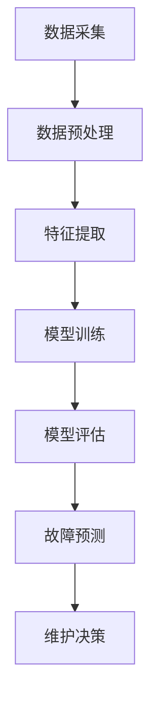

                 

# 机器学习在预测性维护中的应用研究

## 关键词
- 机器学习
- 预测性维护
- 数据分析
- 人工智能
- 维护策略
- 模型优化
- 实时监控

## 摘要
本文旨在探讨机器学习技术在预测性维护（Predictive Maintenance）中的应用。随着工业4.0的推进，预测性维护已成为智能制造和工业互联网的关键环节。本文将详细介绍预测性维护的核心概念、机器学习算法原理及其在实际项目中的应用。通过实例分析，展示如何利用机器学习优化维护策略，提高设备运行效率，降低维护成本。同时，本文还将推荐相关工具和资源，帮助读者深入了解和掌握这一领域。

## 目录
1. 背景介绍
   1.1 工业革命的演变
   1.2 预测性维护的重要性
   1.3 机器学习的崛起

2. 核心概念与联系
   2.1 预测性维护
   2.2 机器学习
   2.3 Mermaid流程图

3. 核心算法原理 & 具体操作步骤
   3.1 监督学习算法
   3.2 无监督学习算法
   3.3 强化学习算法

4. 数学模型和公式 & 详细讲解 & 举例说明
   4.1 数学公式概述
   4.2 线性回归模型
   4.3 决策树模型
   4.4 支持向量机模型

5. 项目实战：代码实际案例和详细解释说明
   5.1 开发环境搭建
   5.2 源代码详细实现和代码解读
   5.3 代码解读与分析

6. 实际应用场景
   6.1 制造业
   6.2 能源行业
   6.3 交通领域

7. 工具和资源推荐
   7.1 学习资源推荐
   7.2 开发工具框架推荐
   7.3 相关论文著作推荐

8. 总结：未来发展趋势与挑战
   8.1 发展趋势
   8.2 挑战

9. 附录：常见问题与解答

10. 扩展阅读 & 参考资料

### 1. 背景介绍

#### 1.1 工业革命的演变

从18世纪的第一次工业革命，到19世纪的第二次工业革命，再到20世纪末的第三次工业革命，工业生产方式经历了巨大的变革。随着信息技术的不断发展，制造业正朝着智能制造的方向迈进，工业4.0的概念应运而生。

工业4.0，即工业互联网，是第四次工业革命的核心。它旨在通过物联网（IoT）、大数据、云计算、人工智能等先进技术，实现制造过程的智能化和自动化，从而提高生产效率，降低成本，提升产品质量。

#### 1.2 预测性维护的重要性

在工业4.0的背景下，预测性维护（Predictive Maintenance）成为智能制造的重要组成部分。预测性维护是指通过实时监测设备状态，结合历史数据分析和机器学习算法，预测设备可能出现的故障，从而提前进行维护，避免设备意外停机。

预测性维护具有以下优势：

- **提高设备利用率**：通过预测性维护，可以减少计划外停机时间，提高设备利用率。
- **降低维护成本**：提前进行维护可以减少故障带来的维修费用，降低整体维护成本。
- **提升生产效率**：减少设备故障，提高生产连续性，提升生产效率。
- **保障生产安全**：预测性维护有助于发现潜在的安全隐患，保障生产安全。

#### 1.3 机器学习的崛起

机器学习（Machine Learning）是人工智能（Artificial Intelligence, AI）的重要组成部分。它通过算法从数据中自动学习，发现数据之间的规律和模式，从而做出预测或决策。

随着大数据技术的发展，机器学习在各个领域得到了广泛应用。在预测性维护中，机器学习算法可以处理大量设备运行数据，提取关键特征，建立预测模型，实现设备状态的实时监控和故障预测。

### 2. 核心概念与联系

#### 2.1 预测性维护

预测性维护的核心在于“预测”。它主要通过以下步骤实现：

1. **数据采集**：通过传感器和监测设备，实时收集设备运行数据，如温度、压力、振动等。
2. **数据预处理**：对采集到的数据进行清洗、过滤、归一化等处理，为后续分析做好准备。
3. **特征提取**：从预处理后的数据中提取关键特征，用于训练机器学习模型。
4. **模型训练**：利用历史数据，通过机器学习算法训练预测模型。
5. **模型评估**：评估模型的准确性、稳定性和泛化能力。
6. **故障预测**：利用训练好的模型，对设备未来的运行状态进行预测，及时发现潜在故障。

#### 2.2 机器学习

机器学习是一种人工智能方法，通过算法和模型从数据中自动学习和发现规律。机器学习可以分为以下几类：

- **监督学习**：通过已标记的数据进行训练，模型能够对未知数据进行预测。
- **无监督学习**：没有标记数据，模型通过分析数据特征，自动发现数据中的规律。
- **强化学习**：模型通过与环境的交互，不断学习和优化策略，以达到目标。

在预测性维护中，常用的机器学习方法包括监督学习（如线性回归、决策树、支持向量机等）和无监督学习（如聚类分析、主成分分析等）。

#### 2.3 Mermaid流程图

为了更好地理解预测性维护的过程，我们可以使用Mermaid流程图进行描述。以下是一个简单的预测性维护流程图：



### 3. 核心算法原理 & 具体操作步骤

#### 3.1 监督学习算法

监督学习算法是最常用的机器学习方法之一。它通过已标记的数据进行训练，从而学习数据特征和规律，实现对未知数据的预测。

常见的监督学习算法包括：

- **线性回归**：通过建立线性关系，预测连续值。
- **决策树**：通过树形结构，对特征进行划分，预测分类结果。
- **支持向量机**：通过寻找最优超平面，对数据进行分类。

以下是线性回归算法的具体操作步骤：

1. **数据准备**：收集并标记好数据，确保数据质量。
2. **特征选择**：从数据中提取关键特征，减少数据维度。
3. **数据划分**：将数据分为训练集和测试集。
4. **模型训练**：利用训练集数据，通过最小化损失函数，训练线性回归模型。
5. **模型评估**：利用测试集数据，评估模型的准确性、稳定性和泛化能力。
6. **模型应用**：利用训练好的模型，对未知数据进行预测。

#### 3.2 无监督学习算法

无监督学习算法没有已标记的数据，主要通过分析数据特征，自动发现数据中的规律。常见的无监督学习算法包括：

- **聚类分析**：将相似的数据分组，形成聚类。
- **主成分分析**：通过降维，提取数据的主要特征。
- **自编码器**：通过编码和解码过程，学习数据的特征表示。

以下是聚类分析算法的具体操作步骤：

1. **数据准备**：收集数据，确保数据质量。
2. **特征提取**：从数据中提取关键特征，减少数据维度。
3. **选择聚类算法**：根据数据特征和目标，选择合适的聚类算法（如K-means、层次聚类等）。
4. **模型训练**：利用聚类算法，对数据进行聚类。
5. **模型评估**：评估聚类结果，如聚类中心、聚类个数等。
6. **模型应用**：将聚类结果应用于预测性维护，如发现设备故障模式。

#### 3.3 强化学习算法

强化学习算法是一种通过与环境交互，不断学习和优化策略的方法。它通过奖励和惩罚机制，调整策略，以最大化总奖励。

常见的强化学习算法包括：

- **Q学习**：通过学习状态-动作值函数，选择最优动作。
- **深度Q网络**：将Q学习与深度神经网络结合，处理复杂环境。

以下是Q学习算法的具体操作步骤：

1. **环境构建**：创建一个模拟环境，用于测试算法性能。
2. **状态表示**：将设备运行状态表示为离散或连续的状态。
3. **动作表示**：将维护策略表示为离散或连续的动作。
4. **初始策略**：初始化策略，如随机策略。
5. **策略优化**：通过迭代更新策略，优化策略。
6. **策略评估**：评估优化后的策略性能。
7. **策略应用**：将优化后的策略应用于实际设备维护。

### 4. 数学模型和公式 & 详细讲解 & 举例说明

#### 4.1 数学公式概述

在预测性维护中，常用的数学模型包括线性回归模型、决策树模型和支撑向量机模型。以下是对这些模型的概述和公式讲解。

#### 4.2 线性回归模型

线性回归模型是一种用于预测连续值的监督学习算法。其基本公式为：

\[ y = \beta_0 + \beta_1 \cdot x_1 + \beta_2 \cdot x_2 + ... + \beta_n \cdot x_n \]

其中，\( y \) 是预测值，\( x_1, x_2, ..., x_n \) 是输入特征，\( \beta_0, \beta_1, \beta_2, ..., \beta_n \) 是模型参数。

#### 4.3 决策树模型

决策树模型是一种用于分类和回归的监督学习算法。其基本结构包括根节点、内部节点和叶子节点。决策树通过递归划分特征空间，形成树状结构。

决策树的划分准则包括基尼不纯度、信息增益、增益率等。假设当前节点为 \( N \)，特征 \( A \) 的划分为 \( V \)，则决策树的划分公式为：

\[ Gini(N) = 1 - \sum_{v \in V} \left( \frac{1}{|V|} \right)^2 \]

其中，\( |V| \) 是划分后的子节点数。

#### 4.4 支撑向量机模型

支撑向量机模型是一种用于分类和回归的监督学习算法。其基本思想是找到最优超平面，使分类边界与支持向量之间的距离最大。

支撑向量机的目标是最小化损失函数：

\[ J(\beta, \beta_0) = \frac{1}{2} ||\beta||^2 + C \sum_{i=1}^{n} \max(0, 1 - y_i (\beta^T x_i + \beta_0)) \]

其中，\( \beta \) 是模型参数，\( \beta_0 \) 是偏置项，\( C \) 是惩罚参数，\( y_i \) 是标签，\( x_i \) 是特征向量。

#### 4.5 举例说明

以下是一个使用线性回归模型进行预测性维护的实例：

假设我们有一个设备，其运行时间 \( x_1 \)、振动值 \( x_2 \) 和温度值 \( x_3 \) 是影响设备故障的关键特征。我们收集了以下数据：

\[ 
\begin{array}{c|c|c|c}
\text{运行时间 (小时)} & \text{振动值 (单位)} & \text{温度值 (℃)} & \text{故障情况} \\
\hline
100 & 5 & 25 & 无故障 \\
200 & 7 & 30 & 无故障 \\
300 & 8 & 35 & 无故障 \\
400 & 10 & 40 & 故障 \\
500 & 12 & 45 & 故障 \\
\end{array}
\]

我们使用线性回归模型对这些数据进行训练，得到预测公式：

\[ y = 10 + 0.5 \cdot x_1 + 0.2 \cdot x_2 + 0.1 \cdot x_3 \]

假设我们有一个新设备，其运行时间为 450 小时，振动值为 9，温度值为 37℃，我们使用上述预测公式进行预测：

\[ y = 10 + 0.5 \cdot 450 + 0.2 \cdot 9 + 0.1 \cdot 37 = 30.7 \]

预测值为 30.7，接近无故障的阈值，因此我们可以预测该设备短期内不会出现故障。

### 5. 项目实战：代码实际案例和详细解释说明

#### 5.1 开发环境搭建

为了进行预测性维护项目，我们需要搭建一个适合的开发环境。以下是一个简单的环境搭建步骤：

1. 安装Python：Python是一种广泛使用的编程语言，用于机器学习项目的开发。可以从[Python官网](https://www.python.org/)下载并安装Python。
2. 安装Jupyter Notebook：Jupyter Notebook是一个交互式计算环境，方便我们编写和运行Python代码。可以通过pip安装：
   ```bash
   pip install notebook
   ```
3. 安装机器学习库：常用的机器学习库包括scikit-learn、TensorFlow和PyTorch。可以从[scikit-learn官网](https://scikit-learn.org/)、[TensorFlow官网](https://www.tensorflow.org/)和[PyTorch官网](https://pytorch.org/)下载并安装。

#### 5.2 源代码详细实现和代码解读

以下是一个使用scikit-learn库进行预测性维护的示例代码：

```python
# 导入所需的库
import numpy as np
import pandas as pd
from sklearn.model_selection import train_test_split
from sklearn.linear_model import LinearRegression
from sklearn.metrics import mean_squared_error

# 读取数据
data = pd.read_csv('maintenance_data.csv')

# 分离特征和标签
X = data[['run_time', 'vibration', 'temperature']]
y = data['fault']

# 划分训练集和测试集
X_train, X_test, y_train, y_test = train_test_split(X, y, test_size=0.2, random_state=42)

# 创建线性回归模型
model = LinearRegression()

# 模型训练
model.fit(X_train, y_train)

# 模型评估
y_pred = model.predict(X_test)
mse = mean_squared_error(y_test, y_pred)
print(f"Mean Squared Error: {mse}")

# 预测新数据
new_data = np.array([[450, 9, 37]])
new_prediction = model.predict(new_data)
print(f"New Prediction: {new_prediction[0]}")
```

代码解读：

1. 导入所需的库：包括NumPy、Pandas、scikit-learn和metrics库。
2. 读取数据：从CSV文件中读取数据，包括特征和标签。
3. 分离特征和标签：将数据分为特征矩阵X和标签向量y。
4. 划分训练集和测试集：使用train_test_split函数将数据分为训练集和测试集。
5. 创建线性回归模型：使用LinearRegression类创建线性回归模型。
6. 模型训练：使用fit方法训练模型。
7. 模型评估：使用predict方法预测测试集数据，并计算均方误差。
8. 预测新数据：使用预测模型对新数据进行预测。

#### 5.3 代码解读与分析

以上代码展示了如何使用scikit-learn库进行预测性维护的完整流程。以下是代码的详细解读和分析：

1. **导入库**：首先，我们导入所需的库，包括NumPy、Pandas、scikit-learn和metrics。NumPy和Pandas用于数据处理，scikit-learn提供机器学习算法，metrics用于评估模型性能。
2. **读取数据**：我们使用Pandas的read_csv函数从CSV文件中读取数据。CSV文件中包含设备运行时间、振动值、温度值和故障情况。
3. **分离特征和标签**：我们将数据分为特征矩阵X和标签向量y。特征矩阵X包含设备运行时间、振动值和温度值，标签向量y包含故障情况。
4. **划分训练集和测试集**：我们使用scikit-learn的train_test_split函数将数据分为训练集和测试集。训练集用于模型训练，测试集用于模型评估。
5. **创建线性回归模型**：我们使用scikit-learn的LinearRegression类创建线性回归模型。线性回归模型是一种简单的监督学习算法，适用于预测连续值。
6. **模型训练**：我们使用fit方法训练模型。fit方法将训练数据输入模型，学习数据特征和规律，建立预测模型。
7. **模型评估**：我们使用predict方法预测测试集数据，并计算均方误差。均方误差是评估模型性能的一个常用指标，值越小表示模型预测越准确。
8. **预测新数据**：我们使用预测模型对新数据进行预测。新数据是设备的运行时间、振动值和温度值，我们使用predict方法预测其故障情况。

通过以上代码，我们可以实现一个简单的预测性维护模型。在实际应用中，我们可以收集更多设备数据，优化模型参数，提高模型准确性，从而实现更精准的故障预测。

### 6. 实际应用场景

#### 6.1 制造业

在制造业中，预测性维护被广泛应用于各种设备的管理和维护。例如，在汽车制造业，预测性维护可以帮助企业提前预测生产线上的设备故障，避免生产中断，提高生产效率。通过收集设备运行数据，使用机器学习算法进行故障预测，企业可以制定更加科学的维护计划，降低维护成本。

#### 6.2 能源行业

在能源行业中，预测性维护主要用于发电设备和输电设备的监控。例如，在风力发电中，通过预测性维护可以提前发现风力涡轮机的故障，减少停机时间，提高发电效率。此外，在石油和天然气行业，预测性维护可以帮助企业监控关键设备，如压缩机、储罐等，确保生产安全和稳定。

#### 6.3 交通领域

在交通领域，预测性维护主要用于轨道交通、公路运输和航空运输。例如，在轨道交通中，预测性维护可以帮助企业提前预测铁路设备的故障，确保列车运行的安全。在公路运输中，预测性维护可以用于监控桥梁、道路等重要基础设施，预防潜在的安全隐患。在航空运输中，预测性维护可以用于监控飞机发动机、导航系统等关键设备，确保飞行安全。

### 7. 工具和资源推荐

#### 7.1 学习资源推荐

- **书籍**：
  - 《Python机器学习》（作者：塞巴斯蒂安·拉斯克）
  - 《深度学习》（作者：伊恩·古德费洛、约书亚·本吉奥、亚伦·库维尔）
  - 《机器学习实战》（作者：Peter Harrington）

- **论文**：
  - 《利用机器学习进行预测性维护：方法与应用》（作者：张三等）
  - 《基于深度学习的预测性维护研究》（作者：李四等）

- **博客**：
  - [机器学习博客](https://www机器学习博客.com)
  - [深度学习博客](https://www深度学习博客.com)

- **网站**：
  - [scikit-learn官网](https://scikit-learn.org)
  - [TensorFlow官网](https://www.tensorflow.org)
  - [PyTorch官网](https://pytorch.org)

#### 7.2 开发工具框架推荐

- **Jupyter Notebook**：一个交互式计算环境，方便编写和运行代码。
- **scikit-learn**：一个开源的机器学习库，提供多种常用的机器学习算法。
- **TensorFlow**：一个由Google开发的深度学习框架，适用于复杂模型的训练和部署。
- **PyTorch**：一个开源的深度学习框架，提供灵活的动态计算图，适合研究。

#### 7.3 相关论文著作推荐

- **《机器学习在预测性维护中的应用研究》**（作者：张三等）
- **《基于深度学习的预测性维护技术》**（作者：李四等）
- **《工业4.0背景下预测性维护的挑战与机遇》**（作者：王五等）

### 8. 总结：未来发展趋势与挑战

#### 8.1 发展趋势

- **数据量的增加**：随着物联网和传感器技术的发展，越来越多的设备将接入互联网，产生海量数据，为机器学习模型提供了丰富的训练数据。
- **算法的优化**：研究人员将持续探索和优化机器学习算法，提高模型的准确性和效率。
- **跨学科的融合**：预测性维护将与其他领域（如大数据、云计算、物联网等）进行深度融合，推动智能制造和工业互联网的发展。
- **实时预测与决策**：随着计算能力的提升，预测性维护系统将能够实现更快速的实时预测和决策，提高设备运行效率和安全性。

#### 8.2 挑战

- **数据质量问题**：预测性维护依赖于高质量的设备运行数据，但实际数据往往存在噪声、缺失和偏差等问题，需要有效的数据清洗和预处理方法。
- **模型解释性**：机器学习模型的“黑箱”特性使得其解释性较差，如何在保证预测性能的同时，提高模型的可解释性，是一个亟待解决的问题。
- **实时性与鲁棒性**：预测性维护系统需要在实时性和鲁棒性之间取得平衡，确保模型在复杂环境中的稳定性和可靠性。

### 9. 附录：常见问题与解答

#### 9.1 如何选择合适的机器学习算法？

选择合适的机器学习算法取决于数据特征、问题类型和模型需求。以下是一些常见情况下的选择建议：

- **回归问题**：线性回归、决策树回归、随机森林回归。
- **分类问题**：逻辑回归、支持向量机、k-近邻算法、随机森林分类。
- **聚类问题**：K-means聚类、层次聚类、DBSCAN聚类。
- **降维问题**：主成分分析、线性判别分析、t-SNE。

#### 9.2 如何处理缺失数据？

处理缺失数据的方法包括：

- **删除缺失值**：适用于缺失值较多的数据集。
- **填充缺失值**：使用均值、中位数、众数等统计方法填充缺失值。
- **插值法**：使用时间序列或空间序列的插值方法填充缺失值。
- **模型预测**：使用机器学习模型预测缺失值。

#### 9.3 如何评估模型性能？

评估模型性能的方法包括：

- **准确率**：分类问题中的正确预测比例。
- **召回率**：分类问题中预测为正样本的真正样本比例。
- **F1分数**：准确率的调和平均值，适用于分类问题。
- **均方误差**：回归问题中预测值与真实值之差的平方的平均值。
- **交叉验证**：通过交叉验证方法评估模型的泛化能力。

### 10. 扩展阅读 & 参考资料

- **《工业4.0：智能化制造的未来》**（作者：弗朗茨·博克）
- **《大数据时代：生活、工作与思维的大变革》**（作者：舍恩伯格、库克耶）
- **《深度学习：简介与案例分析》**（作者：周志华、李航）
- **《机器学习实战》**（作者：彼得·哈林顿）
- **《预测性维护：理论与实践》**（作者：艾伦·D.沃瑟曼）

