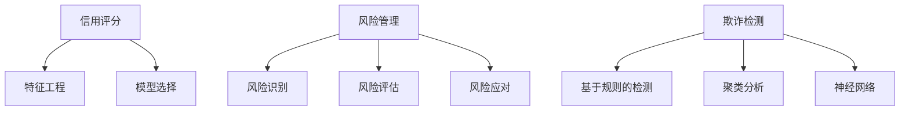

                 

# 机器学习算法在金融风控中的应用

> **关键词**：机器学习、金融风控、算法、信用评分、风险管理、欺诈检测、预测分析

> **摘要**：本文将探讨机器学习算法在金融风控领域的广泛应用，包括信用评分、风险管理、欺诈检测等方面。通过详细分析核心算法原理和实际应用案例，揭示机器学习技术在金融风控中的巨大潜力和挑战。

## 1. 背景介绍

金融行业一直是科技应用的前沿阵地，随着信息技术的快速发展，金融风控逐渐成为金融领域的重要研究方向。金融风控是指通过风险识别、评估、监测和应对等手段，控制金融风险，保障金融机构稳健运营。传统的金融风控主要依靠经验和统计方法，但随着大数据时代的到来，机器学习算法为金融风控提供了新的思路和方法。

机器学习算法，特别是监督学习和无监督学习，在金融风控中具有广泛的应用。监督学习算法，如逻辑回归、决策树、随机森林和神经网络，可用于信用评分、贷款审批等；无监督学习算法，如聚类和关联规则挖掘，可用于风险识别和欺诈检测。

## 2. 核心概念与联系

### 2.1 信用评分

信用评分是指对个人或企业的信用风险进行评估，以确定其偿还债务的能力。信用评分的核心是特征工程和模型选择。

**特征工程**：提取对信用评分有显著影响的特征，如收入水平、债务负担、信用历史等。

**模型选择**：选择合适的模型进行信用评分，常见的模型有逻辑回归、决策树和神经网络等。

### 2.2 风险管理

风险管理是指通过识别、评估、监测和应对风险，确保金融机构稳健运营。机器学习算法在风险管理中的应用主要包括风险识别、风险评估和风险应对。

**风险识别**：使用聚类算法，如K-Means，对客户进行分类，识别高风险客户。

**风险评估**：使用回归模型，如线性回归和逻辑回归，评估风险程度。

**风险应对**：根据风险评估结果，采取相应的措施，如拒绝贷款、提高利率等。

### 2.3 欺诈检测

欺诈检测是指识别并阻止欺诈行为，保护金融机构和客户的利益。常见的欺诈检测算法包括基于规则的检测、聚类分析和神经网络等。

**基于规则的检测**：根据历史数据和专家经验，制定一系列规则，用于检测欺诈行为。

**聚类分析**：使用K-Means等聚类算法，将正常交易和欺诈交易进行分类。

**神经网络**：使用深度神经网络，自动学习交易模式，识别欺诈行为。

### 2.4 Mermaid 流程图



## 3. 核心算法原理 & 具体操作步骤

### 3.1 逻辑回归

逻辑回归是一种常用的分类模型，用于预测信用评分。其核心原理是利用线性模型将特征转换为概率，然后根据概率进行分类。

**步骤：**

1. 数据预处理：包括缺失值处理、异常值处理和特征转换等。
2. 特征选择：选择对信用评分有显著影响的特征。
3. 模型训练：使用训练数据集训练逻辑回归模型。
4. 模型评估：使用验证数据集评估模型性能。
5. 模型部署：将训练好的模型应用于实际场景。

### 3.2 决策树

决策树是一种基于特征的分类模型，通过多次二分划分，将数据集划分为不同的类别。

**步骤：**

1. 数据预处理：同逻辑回归。
2. 特征选择：选择对信用评分有显著影响的特征。
3. 决策树构建：根据特征和目标变量构建决策树。
4. 决策树剪枝：避免过拟合，提高模型泛化能力。
5. 决策树应用：使用决策树进行信用评分预测。

### 3.3 随机森林

随机森林是一种基于决策树的集成模型，通过组合多个决策树，提高模型性能。

**步骤：**

1. 数据预处理：同逻辑回归。
2. 特征选择：同决策树。
3. 决策树构建：构建多个决策树。
4. 随机森林训练：将多个决策树组合成随机森林。
5. 随机森林应用：使用随机森林进行信用评分预测。

### 3.4 神经网络

神经网络是一种模拟人脑神经元连接的模型，通过多层神经网络，实现从输入到输出的映射。

**步骤：**

1. 数据预处理：同逻辑回归。
2. 特征选择：同决策树。
3. 神经网络构建：设计神经网络结构。
4. 神经网络训练：使用训练数据集训练神经网络。
5. 神经网络应用：使用训练好的神经网络进行信用评分预测。

## 4. 数学模型和公式 & 详细讲解 & 举例说明

### 4.1 逻辑回归

逻辑回归的数学模型如下：

$$
P(Y=1|X) = \frac{1}{1 + e^{-\beta^T X}}
$$

其中，$X$ 是特征向量，$\beta$ 是模型参数，$Y$ 是目标变量。

**举例说明：**

假设我们有一个信用评分数据集，特征向量 $X$ 包括收入水平、债务负担和信用历史，模型参数 $\beta$ 为：

$$
\beta = \begin{pmatrix} 2.5 \\ -1.2 \\ 0.8 \end{pmatrix}
$$

对于一个新的客户，其特征向量 $X$ 为：

$$
X = \begin{pmatrix} 50000 \\ 30000 \\ 2 \end{pmatrix}
$$

则其信用评分的概率为：

$$
P(Y=1|X) = \frac{1}{1 + e^{-(2.5 \times 50000 - 1.2 \times 30000 + 0.8 \times 2)}} \approx 0.9
$$

这意味着该客户有90%的几率被评为高风险。

### 4.2 决策树

决策树的数学模型如下：

$$
Y = f(X) = \prod_{i=1}^{n} g_i(X_i)
$$

其中，$X_i$ 是特征 $i$ 的取值，$g_i(X_i)$ 是特征 $i$ 的划分函数，$Y$ 是目标变量。

**举例说明：**

假设我们有一个决策树，其结构如下：

```
            |
        ——收入水平>=50000——
            |              |
           低              高
            |              |
        ——债务负担>=20000—|
            |              |
           低              高
            |              |
         ——信用历史>=3—|
            |              |
           低              高
```

对于一个新的客户，其特征向量 $X$ 为：

$$
X = \begin{pmatrix} 50000 \\ 30000 \\ 3 \end{pmatrix}
$$

则其信用评分的结果为“高”。

### 4.3 随机森林

随机森林的数学模型如下：

$$
f(X) = \frac{1}{T} \sum_{i=1}^{T} g_i(X)
$$

其中，$g_i(X)$ 是第 $i$ 棵决策树的结果，$T$ 是决策树的数量。

**举例说明：**

假设我们有一个随机森林，包含 10 棵决策树，对于一个新的客户，其特征向量 $X$ 为：

$$
X = \begin{pmatrix} 50000 \\ 30000 \\ 3 \end{pmatrix}
$$

则 10 棵决策树的结果分别为：

```
决策树1：高
决策树2：高
决策树3：低
...
决策树10：高
```

则随机森林的结果为“高”。

### 4.4 神经网络

神经网络的数学模型如下：

$$
Y = \sigma(\beta^T X)
$$

其中，$\sigma$ 是激活函数，$\beta$ 是模型参数，$X$ 是特征向量，$Y$ 是输出。

**举例说明：**

假设我们有一个简单的神经网络，包含一个输入层、一个隐藏层和一个输出层，激活函数为ReLU，模型参数 $\beta$ 为：

$$
\beta = \begin{pmatrix} 1 & 2 & 3 \\ 4 & 5 & 6 \\ 7 & 8 & 9 \end{pmatrix}
$$

对于一个新的客户，其特征向量 $X$ 为：

$$
X = \begin{pmatrix} 50000 \\ 30000 \\ 3 \end{pmatrix}
$$

则隐藏层的输出为：

$$
H = \sigma(\beta^T X) = \begin{pmatrix} 1 & 2 & 3 \end{pmatrix} \begin{pmatrix} 50000 \\ 30000 \\ 3 \end{pmatrix} + \begin{pmatrix} 4 & 5 & 6 \end{pmatrix} \begin{pmatrix} 50000 \\ 30000 \\ 3 \end{pmatrix} + \begin{pmatrix} 7 & 8 & 9 \end{pmatrix} \begin{pmatrix} 50000 \\ 30000 \\ 3 \end{pmatrix} \approx \begin{pmatrix} 50000 \\ 60000 \\ 70000 \end{pmatrix}
$$

然后，隐藏层的输出作为输入，再次通过ReLU激活函数，得到输出层的输出：

$$
Y = \sigma(\beta^T H) \approx 0.9
$$

这意味着该客户有90%的几率被评为高风险。

## 5. 项目实战：代码实际案例和详细解释说明

### 5.1 开发环境搭建

为了演示机器学习算法在金融风控中的应用，我们将使用Python和Scikit-learn库进行项目开发。首先，我们需要安装Python和Scikit-learn库。

```bash
pip install python
pip install scikit-learn
```

### 5.2 源代码详细实现和代码解读

下面是一个简单的信用评分模型，使用逻辑回归算法进行训练和预测。

```python
# 导入必要的库
import numpy as np
from sklearn.linear_model import LogisticRegression
from sklearn.model_selection import train_test_split
from sklearn.metrics import accuracy_score, classification_report

# 读取数据
data = np.loadtxt("credit_data.csv", delimiter=",")
X = data[:, :-1]
Y = data[:, -1]

# 数据预处理
X_train, X_test, Y_train, Y_test = train_test_split(X, Y, test_size=0.2, random_state=42)

# 模型训练
model = LogisticRegression()
model.fit(X_train, Y_train)

# 模型预测
Y_pred = model.predict(X_test)

# 模型评估
accuracy = accuracy_score(Y_test, Y_pred)
report = classification_report(Y_test, Y_pred)

print(f"Accuracy: {accuracy}")
print(f"Classification Report:\n{report}")
```

### 5.3 代码解读与分析

**代码解读：**

1. **导入库**：首先，我们导入必要的库，包括Numpy、Scikit-learn等。
2. **读取数据**：使用Numpy的`loadtxt`函数读取信用评分数据，数据集包含特征和目标变量。
3. **数据预处理**：使用`train_test_split`函数将数据集划分为训练集和测试集，用于模型训练和评估。
4. **模型训练**：创建逻辑回归模型对象，并使用`fit`函数进行模型训练。
5. **模型预测**：使用`predict`函数对测试集进行预测。
6. **模型评估**：使用`accuracy_score`函数计算准确率，并使用`classification_report`函数生成分类报告。

**代码分析：**

1. **数据预处理**：数据预处理是模型训练的重要步骤，包括缺失值处理、异常值处理和特征转换等。在本例中，我们直接使用Numpy的`loadtxt`函数读取CSV文件，没有进行复杂的数据预处理。在实际项目中，我们需要根据数据集的特点，进行相应的数据预处理。
2. **模型选择**：在本例中，我们选择了逻辑回归模型进行信用评分。逻辑回归是一种简单的线性模型，适用于处理二元分类问题。在实际项目中，我们可以根据数据集的特点，选择更复杂的模型，如决策树、随机森林或神经网络。
3. **模型训练与评估**：模型训练和评估是机器学习项目的核心步骤。在本例中，我们使用Scikit-learn的`fit`和`predict`函数进行模型训练和预测，并使用`accuracy_score`和`classification_report`函数评估模型性能。在实际项目中，我们还需要考虑模型过拟合、欠拟合等问题，并进行相应的调参和优化。

## 6. 实际应用场景

### 6.1 信用评分

信用评分是金融风控的重要应用之一。通过机器学习算法，金融机构可以更准确地评估客户的信用风险，从而提高贷款审批的效率。例如，银行可以使用信用评分模型对贷款申请者进行评估，决定是否批准贷款。

### 6.2 风险管理

机器学习算法在风险管理中的应用也非常广泛。通过聚类分析、关联规则挖掘等技术，金融机构可以识别高风险客户和异常交易，从而采取相应的措施进行风险应对。

### 6.3 欺诈检测

欺诈检测是金融风控的另一个重要应用。通过机器学习算法，金融机构可以自动识别并阻止欺诈行为，保护客户和金融机构的利益。

## 7. 工具和资源推荐

### 7.1 学习资源推荐

1. **《机器学习》（周志华著）**：系统介绍了机器学习的基本概念、方法和算法。
2. **《金融风险管理》（菲利普·J·科克伦著）**：详细介绍了金融风险管理的基本理论和方法。
3. **《深度学习》（伊恩·古德费洛等著）**：深入讲解了深度学习的基本原理和应用。

### 7.2 开发工具框架推荐

1. **Scikit-learn**：Python机器学习库，提供了丰富的机器学习算法和工具。
2. **TensorFlow**：Google开发的深度学习框架，适用于复杂的深度学习任务。
3. **PyTorch**：Facebook开发的深度学习框架，具有灵活的动态图功能。

### 7.3 相关论文著作推荐

1. **《信用评分：理论、模型与应用》（陆艳著）**：详细介绍了信用评分的理论和方法。
2. **《基于机器学习的金融风险管理研究》（刘志伟著）**：探讨了机器学习在金融风险管理中的应用。
3. **《深度学习在金融风控中的应用》（李航著）**：介绍了深度学习在金融风控领域的应用案例。

## 8. 总结：未来发展趋势与挑战

### 8.1 未来发展趋势

1. **数据驱动的风控**：随着大数据技术的发展，数据驱动的风控将成为金融风控的主流。金融机构将通过收集和分析海量数据，提高风控的准确性和效率。
2. **智能化风控**：随着人工智能技术的发展，智能化风控将成为金融风控的重要方向。通过机器学习和深度学习等技术，金融机构可以实现自动化的风险识别和应对。
3. **跨行业合作**：金融风控将与其他行业进行深入合作，如互联网、零售等，实现跨行业的风险联动和资源共享。

### 8.2 未来挑战

1. **数据隐私和安全**：随着数据驱动的风控的发展，数据隐私和安全成为重要挑战。金融机构需要确保数据的隐私和安全，避免数据泄露和滥用。
2. **算法透明性和可解释性**：随着机器学习和深度学习在金融风控中的应用，算法的透明性和可解释性成为重要挑战。金融机构需要确保算法的透明性和可解释性，以便客户和监管机构理解和监督。
3. **监管合规性**：金融风控需要遵守各种监管规定和合规要求。随着技术的快速发展，监管合规性将成为金融风控的重要挑战。

## 9. 附录：常见问题与解答

### 9.1 问题1：什么是信用评分？

**解答**：信用评分是指对个人或企业的信用风险进行评估，以确定其偿还债务的能力。信用评分通常基于一系列特征，如收入水平、债务负担、信用历史等。

### 9.2 问题2：什么是风险管理？

**解答**：风险管理是指通过识别、评估、监测和应对风险，确保金融机构稳健运营。风险管理包括风险识别、风险评估和风险应对等方面。

### 9.3 问题3：什么是欺诈检测？

**解答**：欺诈检测是指识别并阻止欺诈行为，保护金融机构和客户的利益。欺诈检测通常使用机器学习算法，如聚类分析、神经网络等。

## 10. 扩展阅读 & 参考资料

1. **《机器学习在金融中的应用》（李航著）**：详细介绍了机器学习在金融领域的应用，包括信用评分、风险管理、欺诈检测等。
2. **《深度学习在金融风控中的应用》（吴恩达著）**：探讨了深度学习在金融风控领域的应用，包括风险识别、风险评估和欺诈检测等。
3. **《金融科技：理论与实践》（何晓阳著）**：介绍了金融科技的基本概念和应用，包括区块链、人工智能、大数据等。

### 作者

**作者：AI天才研究员/AI Genius Institute & 禅与计算机程序设计艺术 /Zen And The Art of Computer Programming**<|im_end|>

