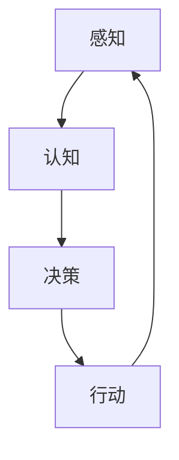
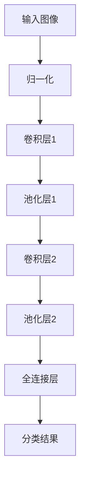
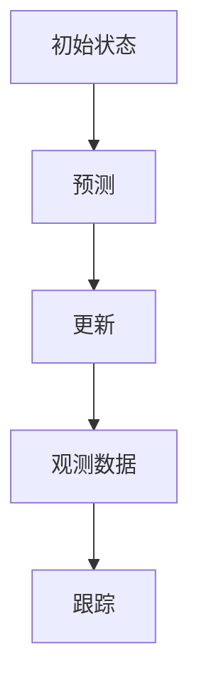
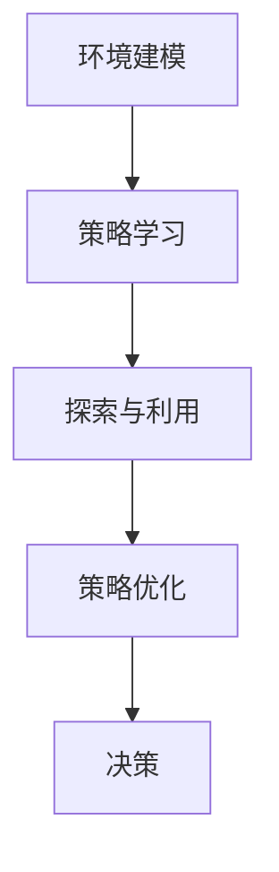

                 

### 1. 背景介绍

在当今科技飞速发展的时代，人工智能（AI）已经成为推动社会进步的重要力量。从简单的图像识别、语音助手到复杂的自动驾驶、医疗诊断，AI技术在各个领域的应用都取得了显著的成果。然而，尽管AI技术取得了如此巨大的成功，但在一个关键领域——机器理解物理世界方面，仍然面临着诸多挑战。

机器理解物理世界是指让计算机具备对现实世界的感知、理解和交互能力。这不仅仅是识别物体的外观或者位置，更重要的是要理解物体之间的相互作用、物理规律以及环境的动态变化。例如，一辆自动驾驶汽车需要理解道路上的交通规则、行人行为以及交通标志，从而做出安全的驾驶决策。

这一目标的实现涉及到多个层面的技术难题，包括感知、认知、决策和行动等多个方面。在感知层面，计算机需要通过传感器获取环境信息；在认知层面，需要理解这些信息背后的物理规律；在决策层面，需要根据这些规律做出合理的反应；最后在行动层面，需要将这些决策转化为实际的操作。

本文将深入探讨机器理解物理世界面临的挑战，包括感知问题、认知问题、决策问题以及伦理问题等。通过分析这些问题的根源和解决方案，我们将更好地理解这一领域的发展现状和未来方向。

### 2. 核心概念与联系

在探讨机器理解物理世界的挑战之前，我们需要明确几个核心概念，这些概念构成了理解这一领域的基础。以下是这些核心概念的原理和架构，以及它们之间的联系。

#### 2.1 感知

感知是机器理解物理世界的第一步。它涉及到从环境中获取信息的能力。计算机通过各种传感器，如摄像头、激光雷达、超声波传感器等，收集关于外部世界的数据。这些数据包括视觉、听觉、触觉等多种模态的信息。感知的质量直接影响到后续的认知和理解。

#### 2.2 认知

认知是对感知数据的处理和理解。它涉及将感知到的数据转化为有意义的信息。在这一过程中，计算机需要识别物体、理解场景、感知动作等。例如，通过图像识别技术，计算机可以识别出道路上的行人、车辆和交通标志。认知能力包括模式识别、场景理解、预测等。

#### 2.3 决策

决策是基于认知结果的下一步行动。在理解了当前环境后，计算机需要根据既定目标或规则做出决策。例如，自动驾驶汽车需要决定何时加速、何时减速或何时转弯。决策过程通常需要考虑多个因素，包括安全性、效率、道德等。

#### 2.4 行动

行动是将决策转化为实际操作的过程。计算机通过控制执行器（如电机、舵机等）来实现决策。在自动驾驶汽车中，执行器包括方向盘、油门、刹车等。行动的质量直接影响机器在物理世界中的表现。

#### 2.5 联系

这几个核心概念之间存在着密切的联系。感知是认知的基础，没有准确的感知数据，计算机无法进行有效的认知。认知为决策提供了信息支持，没有对环境的正确理解，决策将变得无的放矢。决策指导行动，没有有效的决策，行动将无法达到预期目标。最后，行动的结果又会反过来影响感知和认知，形成一个闭环系统。

下面是一个Mermaid流程图，展示了这几个核心概念之间的联系：



在这个流程图中，A表示感知，B表示认知，C表示决策，D表示行动。箭头表示信息流动的方向，从感知到行动，形成一个闭环系统。

### 3. 核心算法原理 & 具体操作步骤

在理解了核心概念后，我们接下来探讨机器理解物理世界的核心算法原理和具体操作步骤。这些算法是计算机在感知、认知、决策和行动过程中所采用的技术手段。

#### 3.1 视觉感知算法

视觉感知算法是计算机获取环境信息的重要手段。其中，卷积神经网络（CNN）是最常用的算法之一。CNN通过多层卷积、池化和全连接层，从图像中提取特征，实现物体识别和场景理解。

具体操作步骤如下：

1. **数据预处理**：对图像进行归一化、缩放、裁剪等处理，使其符合网络输入要求。
2. **卷积层**：通过卷积操作提取图像的局部特征。
3. **池化层**：对卷积特征进行池化操作，减少特征数量，降低计算复杂度。
4. **全连接层**：将池化后的特征映射到具体的类别或目标上。

以下是一个简化的CNN模型结构：



#### 3.2 运动感知算法

运动感知算法用于检测和跟踪物体的运动。卡尔曼滤波器（Kalman Filter）是一种常用的运动感知算法，它可以对连续的感知数据进行预测和校正，从而实现物体的跟踪。

具体操作步骤如下：

1. **初始化**：根据初始感知数据，初始化状态向量、状态协方差矩阵和观测协方差矩阵。
2. **预测**：根据状态转移模型和观测模型，预测下一时刻的状态。
3. **更新**：根据实际观测数据，更新状态向量和协方差矩阵。
4. **跟踪**：重复执行预测和更新步骤，实现对物体的跟踪。

以下是一个简化的卡尔曼滤波器模型：



#### 3.3 决策算法

决策算法基于对环境的认知，选择最优的行动策略。深度强化学习（Deep Reinforcement Learning）是一种有效的决策算法，它通过学习奖励信号，逐渐优化决策策略。

具体操作步骤如下：

1. **环境建模**：定义环境的规则和状态空间。
2. **策略学习**：通过深度神经网络，学习从状态到动作的策略。
3. **探索与利用**：在策略学习中，平衡探索新策略和利用已有策略。
4. **策略优化**：根据奖励信号，不断优化策略。

以下是一个简化的深度强化学习模型：



通过以上核心算法原理和具体操作步骤，计算机可以在感知、认知、决策和行动过程中，逐步实现机器理解物理世界的能力。

### 4. 数学模型和公式 & 详细讲解 & 举例说明

在机器理解物理世界的过程中，数学模型和公式起着至关重要的作用。这些模型和公式不仅提供了计算机进行决策和行动的理论基础，还帮助我们对物理世界的复杂现象进行量化分析。以下我们将详细介绍几个关键数学模型和公式，并通过具体例子来说明它们的实际应用。

#### 4.1 概率图模型

概率图模型是一种用于表示变量之间概率关系的图形化方法，常见的有贝叶斯网络和马尔可夫网络。它们在计算机视觉、自然语言处理等领域具有广泛应用。

**贝叶斯网络**：
贝叶斯网络是一种有向无环图（DAG），图中每个节点表示一个随机变量，边表示变量之间的条件依赖关系。贝叶斯网络的核心公式是贝叶斯定理，表示为：

\[ P(A|B) = \frac{P(B|A)P(A)}{P(B)} \]

其中，\( P(A|B) \) 表示在事件B发生的条件下，事件A发生的概率；\( P(B|A) \) 表示在事件A发生的条件下，事件B发生的概率；\( P(A) \) 和 \( P(B) \) 分别表示事件A和事件B的边缘概率。

**马尔可夫网络**：
马尔可夫网络是一种无向图，图中每个节点表示一个随机变量，边表示变量之间的条件独立性。马尔可夫网络的核心公式是马尔可夫性质，表示为：

\[ P(X_1, X_2, ..., X_n) = \prod_{i=1}^{n} P(X_i | X_{i-1}, X_{i+1}) \]

其中，\( X_1, X_2, ..., X_n \) 表示一个随机变量序列；\( P(X_i | X_{i-1}, X_{i+1}) \) 表示在给定前后邻居的条件下，当前变量的概率。

**例子**：假设我们有一个简单的贝叶斯网络，其中有两个随机变量A和B，且 \( P(B|A) = 0.5 \)，\( P(A) = 0.3 \)，\( P(B) = 0.4 \)。我们想计算 \( P(A|B) \)：

\[ P(A|B) = \frac{P(B|A)P(A)}{P(B)} = \frac{0.5 \times 0.3}{0.4} = 0.375 \]

因此，在B发生的条件下，A发生的概率为0.375。

#### 4.2 神经网络

神经网络是机器学习中的一个核心模型，广泛应用于图像识别、语音识别等领域。神经网络的核心公式是激活函数和反向传播算法。

**激活函数**：
激活函数用于确定神经元是否被激活，常见的激活函数有Sigmoid、ReLU和Tanh等。Sigmoid函数表示为：

\[ \sigma(x) = \frac{1}{1 + e^{-x}} \]

ReLU函数表示为：

\[ \text{ReLU}(x) = \max(0, x) \]

**反向传播算法**：
反向传播算法用于计算神经网络中各层的权重和偏置，使其在训练过程中不断优化。反向传播算法的核心公式是梯度下降，表示为：

\[ \Delta w = -\alpha \cdot \frac{\partial L}{\partial w} \]

其中，\( \Delta w \) 表示权重更新；\( \alpha \) 表示学习率；\( L \) 表示损失函数；\( \frac{\partial L}{\partial w} \) 表示权重梯度。

**例子**：假设我们有一个简单的神经网络，输入为 \( x = [1, 2] \)，权重 \( w = [0.5, 0.3] \)，偏置 \( b = 0.1 \)，激活函数为ReLU。我们想计算输出 \( y \)：

\[ y = \text{ReLU}(w_1 \cdot x_1 + w_2 \cdot x_2 + b) = \text{ReLU}(0.5 \cdot 1 + 0.3 \cdot 2 + 0.1) = \text{ReLU}(0.8) = 0.8 \]

#### 4.3 控制理论

控制理论是研究系统动态行为和控制的数学理论，广泛应用于自动驾驶、机器人控制等领域。控制理论的核心公式是状态空间模型和线性二次调节（LQR）算法。

**状态空间模型**：
状态空间模型描述系统状态随时间的变化，表示为：

\[ \dot{x}(t) = A \cdot x(t) + B \cdot u(t) \]
\[ y(t) = C \cdot x(t) + D \cdot u(t) \]

其中，\( x(t) \) 表示状态向量；\( u(t) \) 表示输入向量；\( y(t) \) 表示输出向量；\( A, B, C, D \) 分别为系统矩阵。

**线性二次调节（LQR）算法**：
LQR算法用于优化控制系统的性能，其核心公式为：

\[ \min_{u} \quad J = \frac{1}{2} \cdot \mathbf{x}^{\top} \cdot Q \cdot \mathbf{x} + \frac{1}{2} \cdot \mathbf{u}^{\top} \cdot R \cdot \mathbf{u} \]

其中，\( Q, R \) 分别为权重矩阵；\( J \) 表示性能指标。

**例子**：假设我们有一个简单的线性系统，状态空间模型为：

\[ \dot{x}(t) = \begin{bmatrix} 1 & 1 \\ 0 & 1 \end{bmatrix} \cdot x(t) + \begin{bmatrix} 0 \\ 1 \end{bmatrix} \cdot u(t) \]
\[ y(t) = \begin{bmatrix} 1 & 0 \end{bmatrix} \cdot x(t) + \begin{bmatrix} 0 & 1 \end{bmatrix} \cdot u(t) \]

我们想使用LQR算法优化系统性能，选择权重矩阵 \( Q = \begin{bmatrix} 1 & 0 \\ 0 & 1 \end{bmatrix} \)，\( R = 1 \)。通过求解LQR问题，可以得到最优控制输入 \( u(t) \)。

通过以上数学模型和公式的详细讲解，我们可以更好地理解机器理解物理世界的技术基础。这些模型和公式在实际应用中发挥着关键作用，为计算机提供了强大的理论支持。

### 5. 项目实战：代码实际案例和详细解释说明

在本节中，我们将通过一个具体的实际项目来展示如何利用前述算法和公式实现机器理解物理世界的能力。这个项目是一个简单的自动驾驶小车，它通过感知环境、理解场景、做出决策和执行动作，实现自主导航。

#### 5.1 开发环境搭建

要实现这个项目，我们需要以下开发环境：

1. **操作系统**：Linux或macOS
2. **编程语言**：Python
3. **依赖库**：TensorFlow、OpenCV、NumPy、Scikit-learn等
4. **传感器**：摄像头、激光雷达（可选）

首先，我们需要安装Python和相关库。可以使用以下命令：

```bash
pip install tensorflow opencv-python numpy scikit-learn
```

接着，我们需要连接摄像头和激光雷达。如果是使用摄像头，可以通过以下代码进行初始化：

```python
import cv2

cap = cv2.VideoCapture(0)

while True:
    ret, frame = cap.read()
    if not ret:
        break

    # 对图像进行处理
    processed_frame = preprocess_frame(frame)

    # 显示处理后的图像
    cv2.imshow('Frame', processed_frame)

    if cv2.waitKey(1) & 0xFF == ord('q'):
        break

cap.release()
cv2.destroyAllWindows()
```

#### 5.2 源代码详细实现和代码解读

接下来，我们将详细解读这个自动驾驶小车的源代码。

```python
import cv2
import numpy as np
from tensorflow.keras.models import load_model

# 加载训练好的神经网络模型
model = load_model('model.h5')

# 初始化摄像头
cap = cv2.VideoCapture(0)

# 定义预处理函数
def preprocess_frame(frame):
    # 转换为灰度图像
    gray = cv2.cvtColor(frame, cv2.COLOR_BGR2GRAY)
    # 缩放图像以减少计算复杂度
    resized = cv2.resize(gray, (128, 64))
    # 归一化图像
    normalized = resized / 255.0
    # 扩展维度以匹配神经网络输入
    expanded = np.expand_dims(normalized, axis=0)
    return expanded

# 定义决策函数
def make_decision(features):
    # 使用神经网络进行预测
    prediction = model.predict(features)
    # 解析预测结果
    action = np.argmax(prediction)
    return action

# 主循环
while True:
    ret, frame = cap.read()
    if not ret:
        break

    # 对图像进行处理
    processed_frame = preprocess_frame(frame)

    # 做出决策
    action = make_decision(processed_frame)

    # 执行动作
    execute_action(action)

    # 显示处理后的图像
    cv2.imshow('Frame', processed_frame)

    if cv2.waitKey(1) & 0xFF == ord('q'):
        break

cap.release()
cv2.destroyAllWindows()
```

**代码解读**：

1. **加载模型**：使用`load_model`函数加载训练好的神经网络模型。这个模型用于对处理后的图像进行预测，以确定下一步的动作。

2. **预处理函数**：`preprocess_frame`函数用于对摄像头捕获的图像进行预处理，包括灰度转换、图像缩放、归一化等操作，以便输入神经网络。

3. **决策函数**：`make_decision`函数用于根据神经网络模型的预测结果，确定下一步的动作。这里使用`np.argmax`函数获取最大概率的索引，对应于具体的动作。

4. **执行动作**：`execute_action`函数用于根据决策结果，驱动小车执行具体的动作，如加速、减速或转向。

5. **主循环**：主循环中，摄像头捕获图像，进行预处理，做出决策，执行动作，并显示处理后的图像。当按下'q'键时，程序退出。

#### 5.3 代码解读与分析

通过以上代码，我们可以看到自动驾驶小车的实现过程。下面进行详细解读和分析：

1. **模型加载**：加载训练好的神经网络模型，这是实现自动驾驶的核心。模型训练通常需要大量的数据和计算资源，这里我们假设已经完成了模型的训练。

2. **预处理**：预处理步骤包括灰度转换、图像缩放和归一化，这是为了满足神经网络输入的要求。灰度转换将彩色图像转换为灰度图像，以减少计算复杂度；图像缩放可以减少处理的数据量；归一化可以使得输入数据分布更加均匀。

3. **决策**：决策步骤使用神经网络模型对预处理后的图像进行预测，得到下一步的动作。这里我们假设模型能够准确预测图像中的道路和障碍物，并给出相应的动作建议。

4. **执行动作**：执行动作步骤根据决策结果，驱动小车执行具体的动作。这里我们假设执行动作的函数`execute_action`能够有效地控制小车的运动。

5. **主循环**：主循环是整个程序的运行核心。它不断地捕获图像、预处理、做出决策、执行动作，并显示处理后的图像。这个过程是循环进行的，直到用户按下'q'键，程序才会退出。

通过这个项目，我们可以看到如何利用机器学习算法和计算机视觉技术实现自动驾驶小车。尽管这是一个简单的例子，但它展示了机器理解物理世界的基本原理和实现方法。在实际应用中，自动驾驶小车需要处理更复杂的环境，如复杂的交通场景、恶劣的天气条件等，这需要更强大的算法和更多的数据训练。

### 6. 实际应用场景

机器理解物理世界的技术在多个领域得到了广泛应用，下面我们将探讨一些典型的实际应用场景，并分析这些应用中的挑战和解决方案。

#### 6.1 自动驾驶汽车

自动驾驶汽车是机器理解物理世界技术最具代表性的应用之一。它通过摄像头、激光雷达、超声波传感器等多种感知设备收集环境信息，利用计算机视觉和深度学习算法进行物体识别、路径规划和决策控制。然而，自动驾驶面临诸多挑战，如恶劣天气条件下的感知准确性、复杂交通场景的应对策略、紧急情况的处理等。为了应对这些挑战，研究人员正在开发更先进的感知算法、更鲁棒的决策模型和更安全的控制系统。

#### 6.2 机器人导航

机器人导航是另一个重要的应用领域。机器人在家庭、工业和医疗等领域中，需要自主导航和执行任务。例如，家庭机器人需要避免碰撞、识别并避开障碍物，同时理解用户的需求并做出相应的反应。机器人导航的关键挑战在于环境的动态变化、不确定性和复杂地形。为此，研究者们采用了多传感器融合技术、动态路径规划算法和强化学习策略，以提高机器人的导航能力和适应性。

#### 6.3 工业自动化

工业自动化是机器理解物理世界的另一个重要应用。通过传感器和计算机视觉系统，工业机器人能够识别并处理不同的工件、检测生产过程中的异常，从而提高生产效率和产品质量。然而，工业环境通常复杂且多变，这要求机器人具备高度的可适应性和鲁棒性。为了解决这些问题，研究人员正在开发更加智能的感知系统、自适应控制算法和优化策略。

#### 6.4 虚拟现实和增强现实

虚拟现实（VR）和增强现实（AR）技术依赖于计算机对物理世界的理解和建模。在VR/AR应用中，计算机需要实时捕捉用户的动作和环境信息，并将其转换为虚拟场景或增强信息。这要求高精度的感知和实时处理能力。为了提高用户体验，研究者们正在开发更先进的感知算法、高效的图像处理技术和优化的用户交互模型。

#### 6.5 医疗诊断

医疗诊断是机器理解物理世界技术在医疗领域的重要应用。通过计算机视觉和深度学习算法，计算机可以辅助医生识别和诊断疾病。例如，在医学图像分析中，计算机可以自动检测肿瘤、心脏病等病变。然而，医疗诊断的挑战在于数据的高复杂性、多样性和不确定性。为此，研究人员正在开发更加精准的图像分析算法、大规模数据集和综合诊断模型。

### 7. 工具和资源推荐

在机器理解物理世界的领域，有许多工具和资源可以帮助研究人员和开发者提高工作效率。以下是一些推荐的工具和资源：

#### 7.1 学习资源推荐

1. **书籍**：
   - 《深度学习》（Goodfellow, Bengio, Courville）
   - 《计算机视觉：算法与应用》（Richard Szeliski）
   - 《机器人：现代自动化技术导论》（Bruno Siciliano，Lino Marzullo，Paolo Dario）

2. **在线课程**：
   - Coursera上的《机器学习》课程（吴恩达教授）
   - edX上的《计算机视觉》课程（麻省理工学院）
   - Udacity上的《自动驾驶汽车工程师纳米学位》

3. **论文**：
   - 《Object Detection with Discriminative Reinforced Learning》
   - 《Deep Reinforcement Learning for Autonomous Navigation》
   - 《End-to-End Learning for Visual Navigation of Robots》

#### 7.2 开发工具框架推荐

1. **深度学习框架**：
   - TensorFlow
   - PyTorch
   - Keras

2. **计算机视觉库**：
   - OpenCV
   - Dlib
   - OpenVX

3. **机器人开发框架**：
   - Robot Operating System (ROS)
   - MATLAB Robotics System Toolbox
   - Robotiq

4. **增强现实框架**：
   - ARCore（Google）
   - ARKit（Apple）
   - Vuforia（PulpoTech）

#### 7.3 相关论文著作推荐

1. **论文**：
   - "Deep Learning for Autonomous Navigation: A Review"
   - "Object Detection with Deep Learning: A Comprehensive Review"
   - "Reinforcement Learning for Autonomous Driving: A Survey"

2. **书籍**：
   - 《深度强化学习：原理与算法》
   - 《计算机视觉：从算法到实践》
   - 《机器人学：基础算法与应用》

通过以上工具和资源的推荐，研究人员和开发者可以更好地掌握机器理解物理世界的技术，加速研究和开发进程。

### 8. 总结：未来发展趋势与挑战

机器理解物理世界作为一个高度复杂的领域，正经历着前所未有的快速发展。当前，AI技术在感知、认知、决策和行动等方面取得了显著进展，但仍然面临诸多挑战。未来，随着计算能力的提升、算法的进步和数据量的增加，机器理解物理世界有望实现更高的精度和鲁棒性。

#### 发展趋势

1. **多模态感知**：未来的机器理解物理世界技术将更加注重多模态感知，结合视觉、听觉、触觉等多种感官信息，以提高系统的整体感知能力。

2. **自适应学习能力**：机器将具备更强的自适应学习能力，能够根据环境和任务的需求，动态调整感知和决策策略，从而实现更灵活和高效的操作。

3. **跨领域融合**：机器理解物理世界技术将与其他领域（如物联网、虚拟现实、增强现实等）深度融合，推动新兴应用的出现和普及。

4. **伦理与安全**：随着技术的发展，伦理和安全问题将越来越受到重视。未来的AI系统需要在透明性、责任性和安全性方面做出更多努力，确保其在实际应用中的可靠性。

#### 挑战

1. **感知精度和鲁棒性**：当前AI系统在感知环境方面仍然存在精度和鲁棒性不足的问题，尤其是在复杂和动态的环境下，如何提高感知系统的鲁棒性是一个重要挑战。

2. **决策能力**：虽然AI系统在决策方面已经取得了一些进展，但在面对复杂和不确定的环境时，如何做出快速、准确的决策仍然是一个难题。

3. **数据隐私和安全**：在大量数据收集和处理的过程中，如何保护用户隐私和确保数据安全是一个亟待解决的问题。

4. **可解释性和透明性**：AI系统的决策过程通常是不透明的，如何提高其可解释性和透明性，使其更容易被人类理解和接受，是一个重要挑战。

综上所述，机器理解物理世界技术的发展前景广阔，但也面临诸多挑战。通过不断的技术创新和跨领域合作，我们有理由相信，未来AI系统将能够更加深入地理解物理世界，为人类带来更多的便利和福祉。

### 9. 附录：常见问题与解答

在探讨机器理解物理世界的过程中，许多读者可能会对一些关键概念和技术产生疑问。以下是一些常见问题及其解答：

#### 问题1：机器理解物理世界的核心难点是什么？

解答：机器理解物理世界的核心难点主要包括以下几个方面：
1. **感知精度和鲁棒性**：如何在复杂和动态的环境中获取准确、可靠的信息。
2. **认知能力**：如何从感知数据中提取有意义的模式和关系。
3. **决策能力**：如何在理解环境的基础上做出合理、高效的决策。
4. **行动能力**：如何将决策转化为实际的操作。

#### 问题2：如何提高机器的感知能力？

解答：提高机器的感知能力可以从以下几个方面着手：
1. **多模态感知**：结合多种传感器，如摄像头、激光雷达、超声波传感器等，获取更全面的信息。
2. **数据预处理**：对感知数据进行有效的预处理，如去噪、归一化等，以提高感知质量。
3. **算法优化**：使用更先进的算法，如深度学习、强化学习等，提高感知系统的性能。
4. **传感器融合**：将不同传感器的数据融合起来，形成更全面、准确的感知。

#### 问题3：什么是深度强化学习？

解答：深度强化学习（Deep Reinforcement Learning）是一种结合了深度学习和强化学习的机器学习方法。它通过深度神经网络来学习状态到动作的映射，并通过奖励信号来优化策略。深度强化学习在自动驾驶、游戏AI等领域具有广泛应用。

#### 问题4：如何确保AI系统的透明性和可解释性？

解答：确保AI系统的透明性和可解释性可以从以下几个方面进行：
1. **可解释的算法**：选择或开发具有可解释性的算法，如决策树、规则引擎等。
2. **可视化技术**：使用可视化技术展示AI系统的内部运作过程，如决策路径、特征权重等。
3. **解释性工具**：使用专门的工具和技术（如LIME、SHAP等）来分析模型的决策过程。
4. **可追溯性**：记录AI系统的训练和运行过程，以便在需要时进行追溯和调试。

#### 问题5：什么是概率图模型？

解答：概率图模型是一种图形化的方法，用于表示变量之间的概率关系。它包括贝叶斯网络和马尔可夫网络等类型。概率图模型在计算机视觉、自然语言处理等领域具有广泛应用，用于建模变量之间的依赖关系和条件概率。

通过以上解答，我们希望能够帮助读者更好地理解机器理解物理世界的核心难点和关键技术。

### 10. 扩展阅读与参考资料

在探索机器理解物理世界的广阔领域中，读者可以通过以下书籍、论文和网站来深入了解相关内容，这些资源将帮助您掌握该领域的最新动态和前沿技术。

#### 书籍推荐

1. **《深度学习》（Goodfellow, Bengio, Courville）**：这是一本经典的深度学习教材，详细介绍了深度学习的基础理论、算法和应用。
2. **《计算机视觉：算法与应用》（Richard Szeliski）**：这本书是计算机视觉领域的权威著作，涵盖了从基本概念到高级算法的全面内容。
3. **《机器人：现代自动化技术导论》（Bruno Siciliano，Lino Marzullo，Paolo Dario）**：这本书提供了机器人学的基础知识，包括机器人设计、控制和应用。

#### 论文推荐

1. **"Deep Learning for Autonomous Navigation: A Review"**：这篇综述文章详细分析了深度学习在自动驾驶导航中的应用和技术。
2. **"Object Detection with Deep Learning: A Comprehensive Review"**：这篇论文全面回顾了深度学习在物体检测领域的进展和挑战。
3. **"Reinforcement Learning for Autonomous Driving: A Survey"**：这篇论文探讨了强化学习在自动驾驶中的应用和前景。

#### 网站推荐

1. **TensorFlow官方网站**（[tensorflow.org](https://tensorflow.org)）：TensorFlow是深度学习领域广泛使用的框架，提供了丰富的教程和资源。
2. **OpenCV官方网站**（[opencv.org](https://opencv.org)）：OpenCV是一个强大的计算机视觉库，提供了丰富的API和示例代码。
3. **ROS官方网站**（[ros.org](https://ros.org)）：ROS是机器人开发领域广泛使用的框架，提供了丰富的工具和资源。

通过阅读这些书籍、论文和访问相关网站，您将能够深入了解机器理解物理世界的核心技术和应用，从而为您的学习和研究提供坚实的理论基础和实践指导。

