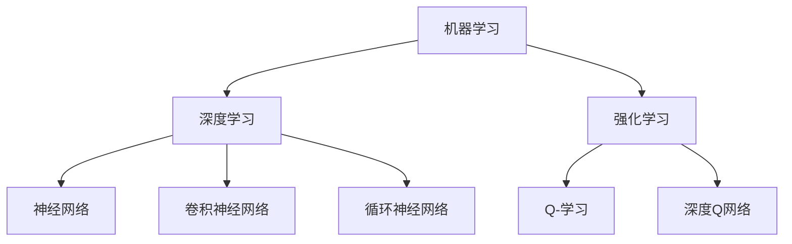

                 

### 背景介绍

人工智能（AI）作为一门融合了计算机科学、数学、统计学、认知科学等多学科的交叉领域，近年来取得了飞速的发展。特别是随着深度学习、神经网络、强化学习等技术的不断突破，人工智能已经从理论走向了实践，广泛应用于图像识别、自然语言处理、自动驾驶、医疗诊断等多个领域。

在过去的几十年中，人工智能的发展经历了多个阶段，从最初的符号人工智能、知识表示与推理，到基于统计的学习方法，再到如今的深度学习和大数据驱动的人工智能，每一个阶段都带来了技术的飞跃和产业的变革。然而，随着技术的不断进步，人工智能也逐渐暴露出了许多新的问题和挑战。

首先，人工智能的伦理和道德问题日益凸显。人工智能的发展和应用可能带来隐私侵犯、失业风险、责任归属等问题，如何在保障技术进步的同时，确保社会的公平、公正和安全，成为了一个重要的议题。其次，人工智能的技术局限性和可解释性问题依然存在。尽管人工智能在许多任务上已经表现出色，但其工作原理和决策过程仍然不够透明，难以被普通用户理解和接受。此外，人工智能在数据依赖性方面也面临挑战，如何解决数据的质量、多样性和获取成本等问题，仍然是亟待解决的难题。

在这样的背景下，AI 2.0 时代应运而生。AI 2.0 不仅仅是对传统人工智能的简单升级，而是一次全面的技术革新，旨在构建更加智能、透明、安全、公平的人工智能系统。AI 2.0 的核心目标是实现人工智能的自主学习和进化能力，使其能够自主地探索新知识、发现新规律，并在复杂环境中做出更智能的决策。

本文将围绕 AI 2.0 时代的人工智能产业展开讨论，首先介绍 AI 2.0 的核心概念和联系，然后深入探讨其核心算法原理和具体操作步骤，接着通过数学模型和公式对其进行详细讲解和举例说明，并分享一些实际应用场景和项目实战经验。最后，我们将对 AI 2.0 的未来发展趋势与挑战进行展望，并提供一些相关的工具和资源推荐，以期为读者提供一个全面、深入的了解。

### 核心概念与联系

在进入 AI 2.0 时代之前，我们需要首先了解一些核心概念和原理，以及它们之间的联系。这些概念包括机器学习、深度学习、神经网络、强化学习等，它们共同构成了现代人工智能的基础。

#### 机器学习

机器学习（Machine Learning）是一种使计算机通过数据学习并改进其性能的方法。其基本思想是通过分析大量的数据，从中提取出规律和模式，进而对新的数据做出预测或决策。机器学习可以分为监督学习、无监督学习和强化学习三种类型。

1. **监督学习（Supervised Learning）**：监督学习是一种通过已标记的数据来训练模型的方法。模型通过学习输入和输出之间的映射关系，从而对未知数据进行预测。常见的监督学习算法包括线性回归、决策树、支持向量机等。

2. **无监督学习（Unsupervised Learning）**：无监督学习不需要已标记的数据，其主要目的是发现数据中的结构和模式。聚类、降维、异常检测等任务都属于无监督学习的范畴。常见的无监督学习算法包括K-均值聚类、主成分分析（PCA）等。

3. **强化学习（Reinforcement Learning）**：强化学习是一种通过试错来学习如何在特定环境中做出最优决策的方法。模型通过与环境的交互，不断调整策略，以最大化累积奖励。常见的强化学习算法包括Q-学习、深度Q网络（DQN）等。

#### 深度学习

深度学习（Deep Learning）是机器学习的一个子领域，它通过构建具有多个隐藏层的神经网络（通常称为深度神经网络）来模拟人脑的决策过程。深度学习在图像识别、语音识别、自然语言处理等领域取得了显著的成果。

1. **神经网络（Neural Networks）**：神经网络是由大量简单的神经元组成的计算模型，每个神经元都是一个简单的非线性函数，通过层层组合，可以实现对复杂数据的建模。神经网络的训练过程实际上是一个优化参数的过程，目的是使网络的输出尽可能接近期望输出。

2. **卷积神经网络（Convolutional Neural Networks，CNN）**：卷积神经网络是一种专门用于处理图像数据的神经网络。CNN 通过卷积操作和池化操作，有效地提取图像中的特征，从而实现对图像的识别和分类。

3. **循环神经网络（Recurrent Neural Networks，RNN）**：循环神经网络是一种用于处理序列数据的神经网络。RNN 通过在时间步之间传递信息，能够处理具有时间依赖性的数据，如自然语言、时间序列等。

#### 强化学习

强化学习是一种通过试错来学习如何在特定环境中做出最优决策的方法。模型通过与环境的交互，不断调整策略，以最大化累积奖励。常见的强化学习算法包括Q-学习、深度Q网络（DQN）等。

1. **Q-学习（Q-Learning）**：Q-学习是一种基于值函数的强化学习算法。其核心思想是通过不断地更新值函数，使其能够预测在特定状态下采取特定动作的长期奖励。

2. **深度Q网络（Deep Q-Network，DQN）**：DQN 是一种基于神经网络的 Q-学习算法。DQN 使用深度神经网络来近似值函数，从而实现对复杂环境的建模。

#### Mermaid 流程图

为了更好地理解这些核心概念和原理之间的联系，我们可以使用 Mermaid 流程图来进行描述。



通过这个流程图，我们可以清晰地看到机器学习、深度学习和强化学习之间的关系，以及它们各自的核心算法和模型。

#### 核心概念联系与解释

1. **机器学习是深度学习和强化学习的基础**：机器学习为深度学习和强化学习提供了理论基础和方法。深度学习通过构建多层神经网络来模拟人脑的决策过程，而强化学习则通过试错来学习如何在特定环境中做出最优决策。

2. **深度学习和强化学习相互补充**：深度学习擅长处理复杂的图像和文本数据，而强化学习则擅长在动态环境中做出最优决策。通过将深度学习和强化学习相结合，可以构建出更加智能和适应能力更强的人工智能系统。

3. **神经网络是深度学习和强化学习的关键技术**：神经网络作为深度学习和强化学习的基础，通过层层组合，可以实现对复杂数据的建模和决策。

通过以上对核心概念和原理的介绍，我们可以更好地理解 AI 2.0 时代的人工智能产业。在接下来的部分，我们将深入探讨 AI 2.0 的核心算法原理和具体操作步骤，进一步揭示其在人工智能领域的重要性和应用价值。

### 核心算法原理 & 具体操作步骤

在了解了 AI 2.0 的核心概念和联系之后，接下来我们将深入探讨其核心算法原理和具体操作步骤，以便更好地理解这一技术革新的本质和应用。

#### 深度学习算法原理

深度学习算法的核心是神经网络，特别是深度神经网络（DNN）。深度神经网络由多个层次组成，每个层次由多个神经元组成，这些神经元通过前向传播和反向传播的方式进行信息传递和更新。

1. **前向传播**：在前向传播过程中，输入数据从输入层经过多个隐藏层，最终传递到输出层。每个神经元都会对其接收到的输入进行加权求和处理，并应用一个非线性激活函数，如ReLU函数、Sigmoid函数或Tanh函数，以引入非线性。

2. **反向传播**：在反向传播过程中，根据输出层的误差，逐层反向计算每个神经元的梯度，并更新其权重。这个过程中使用了链式法则和导数的概念，以确保权重更新方向正确。

具体操作步骤如下：

- **步骤1**：初始化权重和偏置，通常采用随机初始化。
- **步骤2**：前向传播，计算每个神经元的输出值。
- **步骤3**：计算输出层误差，误差可以通过损失函数（如均方误差、交叉熵等）来度量。
- **步骤4**：反向传播，计算每个神经元的梯度。
- **步骤5**：使用梯度下降或其他优化算法更新权重和偏置。

#### 强化学习算法原理

强化学习算法的核心是马尔可夫决策过程（MDP），它定义了智能体（agent）在环境中的行为和奖励机制。强化学习的目标是找到一条最优策略，使得智能体能够在长期内获得最大累积奖励。

1. **状态（State）**：状态是描述环境当前状态的变量，如游戏中的棋盘状态、机器人周围的环境等。

2. **动作（Action）**：动作是智能体在特定状态下可以采取的行动，如游戏中的下一步棋、机器人手臂的移动等。

3. **奖励（Reward）**：奖励是智能体采取特定动作后，从环境中获得的即时奖励，它用于评估动作的好坏。

4. **策略（Policy）**：策略是智能体根据当前状态选择动作的规则，常用的策略包括确定性策略和随机性策略。

强化学习算法的具体操作步骤如下：

- **步骤1**：初始化智能体和环境的参数，包括状态、动作、奖励和策略。
- **步骤2**：智能体根据当前状态选择动作。
- **步骤3**：环境根据智能体的动作更新状态，并给予智能体奖励。
- **步骤4**：智能体更新策略，以最大化累积奖励。

常用的强化学习算法包括Q-学习、深度Q网络（DQN）和策略梯度方法等。

#### 深度强化学习算法原理

深度强化学习（Deep Reinforcement Learning，DRL）是深度学习和强化学习的结合，旨在解决复杂环境中决策问题。DRL 通过深度神经网络来近似值函数或策略函数，以提高学习效率和决策质量。

1. **值函数近似**：值函数近似是通过深度神经网络来近似状态值函数或状态-动作值函数，从而预测在特定状态下采取特定动作的长期奖励。

2. **策略函数近似**：策略函数近似是通过深度神经网络来近似策略函数，从而直接生成智能体在特定状态下的最优动作。

DRL 的具体操作步骤如下：

- **步骤1**：初始化深度神经网络、奖励机制和环境。
- **步骤2**：智能体根据当前状态选择动作，并执行动作。
- **步骤3**：环境根据智能体的动作更新状态，并给予智能体奖励。
- **步骤4**：使用反向传播算法更新深度神经网络的权重，以最小化损失函数。

#### 联系与总结

深度学习和强化学习是 AI 2.0 时代的关键技术，它们在数据处理、决策优化和智能控制等方面发挥了重要作用。深度学习通过构建多层神经网络，实现了对复杂数据的建模和识别；强化学习通过试错和奖励机制，实现了在动态环境中最优决策。而深度强化学习则将两者结合起来，解决了复杂环境中的决策问题。

通过以上对核心算法原理和具体操作步骤的介绍，我们可以更好地理解 AI 2.0 时代的核心技术，并为后续的实际应用和项目实战打下基础。在接下来的部分，我们将通过数学模型和公式，对这些算法进行详细讲解和举例说明，进一步深化我们对 AI 2.0 技术的理解。

### 数学模型和公式 & 详细讲解 & 举例说明

在深入了解 AI 2.0 时代的关键技术后，接下来我们将通过数学模型和公式，对这些算法进行详细的讲解和举例说明，以帮助读者更好地理解其核心原理和实际应用。

#### 深度学习算法的数学模型

1. **激活函数**

   激活函数是深度学习算法中的一个关键组件，它引入了非线性，使得神经网络能够捕捉复杂的数据特征。常见的激活函数包括ReLU、Sigmoid和Tanh。

   - **ReLU函数**（Rectified Linear Unit）：

     $$ f(x) = \max(0, x) $$

    ReLU函数在输入为正数时保持不变，当输入为负数时输出为零。ReLU函数的导数为：

     $$ f'(x) = \begin{cases} 
     0, & \text{if } x < 0 \\
     1, & \text{if } x \geq 0 
     \end{cases} $$

   - **Sigmoid函数**：

     $$ f(x) = \frac{1}{1 + e^{-x}} $$

    Sigmoid函数将输入映射到（0,1）区间内，其导数为：

     $$ f'(x) = f(x) \cdot (1 - f(x)) $$

   - **Tanh函数**：

     $$ f(x) = \frac{e^x - e^{-x}}{e^x + e^{-x}} $$

    Tanh函数的导数为：

     $$ f'(x) = 1 - f^2(x) $$

2. **损失函数**

   损失函数用于衡量预测值与真实值之间的差距，是优化神经网络参数的重要工具。常见的损失函数包括均方误差（MSE）、交叉熵（Cross Entropy）等。

   - **均方误差（MSE）**：

     $$ \text{MSE} = \frac{1}{n} \sum_{i=1}^{n} (y_i - \hat{y}_i)^2 $$

    其中，$y_i$为真实值，$\hat{y}_i$为预测值，$n$为样本数量。

   - **交叉熵（Cross Entropy）**：

     $$ \text{Cross Entropy} = -\sum_{i=1}^{n} y_i \log(\hat{y}_i) $$

    交叉熵函数在分类问题中常用，其中$y_i$为真实标签，$\hat{y}_i$为预测概率。

3. **优化算法**

   优化算法用于更新神经网络参数，以最小化损失函数。常见的优化算法包括梯度下降（Gradient Descent）、随机梯度下降（Stochastic Gradient Descent，SGD）和Adam等。

   - **梯度下降**：

     $$ w_{\text{new}} = w_{\text{old}} - \alpha \cdot \nabla_{w} J(w) $$

     其中，$w$为模型参数，$\alpha$为学习率，$J(w)$为损失函数。

   - **随机梯度下降**：

     $$ w_{\text{new}} = w_{\text{old}} - \alpha \cdot \nabla_{w} J(w; x_i, y_i) $$

     其中，$x_i, y_i$为单个训练样本。

   - **Adam算法**：

     $$ m_t = \beta_1 m_{t-1} + (1 - \beta_1) \nabla_w J(w; x_t, y_t) $$
     $$ v_t = \beta_2 v_{t-1} + (1 - \beta_2) \nabla_w^2 J(w; x_t, y_t) $$
     $$ \hat{m}_t = m_t / (1 - \beta_1^t) $$
     $$ \hat{v}_t = v_t / (1 - \beta_2^t) $$
     $$ w_{\text{new}} = w_{\text{old}} - \alpha \cdot \hat{m}_t / \sqrt{\hat{v}_t} $$

     其中，$m_t$和$v_t$分别为一阶和二阶矩估计，$\beta_1$和$\beta_2$为矩估计的指数衰减率。

#### 强化学习算法的数学模型

1. **马尔可夫决策过程（MDP）**

   MDP 是强化学习算法的核心模型，它由状态空间$S$、动作空间$A$、状态转移概率$P(s'|s,a)$、奖励函数$R(s,a)$和策略$\pi(a|s)$组成。

   - **状态转移概率**：

     $$ P(s'|s,a) = P(s'|s,a=1) + P(s'|s,a=2) + ... + P(s'|s,a=n) $$

     其中，$s'$为下一状态，$s$为当前状态，$a$为采取的动作。

   - **奖励函数**：

     $$ R(s,a) = \sum_{t=0}^{\infty} \gamma^t R(s_t, a_t) $$

     其中，$\gamma$为折扣因子，$R(s_t, a_t)$为第$t$步的即时奖励。

   - **策略**：

     $$ \pi(a|s) = \sum_{a \in A} \pi(a|s) P(s'|s,a) $$

2. **Q值函数**

   Q值函数是强化学习中的一个关键概念，它表示在特定状态下采取特定动作的长期奖励。

   $$ Q(s,a) = \sum_{s' \in S} P(s'|s,a) \sum_{a' \in A} \pi(a'|s') R(s',a') $$

   Q值函数可以通过Q-学习算法来近似，具体步骤如下：

   - **初始化**：

     $$ Q(s,a) \leftarrow 0 $$

   - **更新**：

     $$ Q(s,a) \leftarrow Q(s,a) + \alpha [R(s,a) + \gamma \max_{a'} Q(s',a') - Q(s,a)] $$

   其中，$\alpha$为学习率，$\gamma$为折扣因子。

3. **策略梯度算法**

   策略梯度算法是一种优化策略函数的强化学习算法，其目标是最大化累积奖励。

   $$ \nabla_{\pi} J(\pi) = \sum_{s \in S} \pi(s) \sum_{a \in A} \pi(a|s) \nabla_{a} J(s,a) $$

   策略梯度算法可以通过以下步骤实现：

   - **初始化**：

     $$ \theta \leftarrow \theta_0 $$

   - **更新**：

     $$ \theta \leftarrow \theta - \alpha \nabla_{\theta} J(\theta) $$

   其中，$\theta$为策略参数，$\alpha$为学习率。

#### 举例说明

假设我们有一个简单的强化学习问题，一个智能体在一个二维网格中进行移动，目标是到达目标位置并获得最大奖励。状态空间为$S = \{(0,0), (0,1), ..., (3,3)\}$，动作空间为$A = \{up, down, left, right\}$。

1. **状态转移概率和奖励函数**

   状态转移概率为：

   $$ P(s'|s,a) = \begin{cases} 
   0.8, & \text{if } (s,a) = (s',a') \\
   0.2, & \text{otherwise} 
   \end{cases} $$

   奖励函数为：

   $$ R(s,a) = \begin{cases} 
   10, & \text{if } (s,a) = (3,3) \\
   -1, & \text{otherwise} 
   \end{cases} $$

2. **策略和Q值函数**

   初始策略为随机策略：

   $$ \pi(a|s) = \frac{1}{4}, \forall s \in S, a \in A $$

   初始Q值函数为：

   $$ Q(s,a) = 0, \forall s \in S, a \in A $$

3. **Q-学习算法**

   设学习率为$\alpha = 0.1$，折扣因子$\gamma = 0.9$。

   - **第一步**：

     智能体处于状态$(0,0)$，采取随机动作$up$，状态变为$(0,1)$，获得奖励$-1$。

     $$ Q(0,0) \leftarrow Q(0,0) + 0.1 [-1 + 0.9 \max_{a'} Q(0,1)] $$

     $$ Q(0,0) \leftarrow 0 + 0.1 [-1 + 0.9 \max_{a'} Q(0,1)] $$

     $$ Q(0,0) \leftarrow 0.1 [-1 + 0.9 \cdot 0] $$

     $$ Q(0,0) \leftarrow -0.1 $$

   - **第二步**：

     智能体处于状态$(0,1)$，采取随机动作$down$，状态变为$(0,0)$，获得奖励$-1$。

     $$ Q(0,1) \leftarrow Q(0,1) + 0.1 [-1 + 0.9 \max_{a'} Q(0,0)] $$

     $$ Q(0,1) \leftarrow 0 + 0.1 [-1 + 0.9 \cdot (-0.1)] $$

     $$ Q(0,1) \leftarrow -0.1 - 0.009 $$

     $$ Q(0,1) \leftarrow -0.109 $$

   - **迭代继续**：

     智能体不断进行迭代，更新Q值函数，逐渐找到最优策略。

通过以上数学模型和公式的讲解以及举例说明，我们可以更好地理解 AI 2.0 时代的关键技术，为实际应用和项目实战提供理论支持。在接下来的部分，我们将通过项目实战，进一步展示这些算法在实际应用中的效果和操作步骤。

### 项目实战：代码实际案例和详细解释说明

为了更好地理解 AI 2.0 时代的关键技术，接下来我们将通过一个实际项目案例，详细展示如何使用深度学习算法和强化学习算法进行开发和实现。

#### 项目背景

假设我们要开发一个智能推荐系统，该系统能够根据用户的兴趣和行为数据，为用户推荐他们可能感兴趣的商品或内容。这个项目涉及两个主要模块：深度学习模块用于用户兴趣建模，强化学习模块用于推荐策略优化。

#### 开发环境搭建

1. **Python环境**：首先，确保你的系统上已经安装了Python 3.x版本，并配置了pip和virtualenv。

2. **深度学习库**：安装TensorFlow或PyTorch，这两个库是目前最流行的深度学习库。

   ```bash
   pip install tensorflow
   # 或者
   pip install torch torchvision
   ```

3. **强化学习库**：安装OpenAI Gym，用于创建和测试强化学习环境。

   ```bash
   pip install gym
   ```

4. **数据预处理库**：安装Pandas、NumPy等库，用于数据加载和处理。

   ```bash
   pip install pandas numpy
   ```

5. **其他依赖库**：根据需要安装其他依赖库，如Scikit-learn、Matplotlib等。

#### 源代码详细实现

下面我们将分步骤展示深度学习模块和强化学习模块的代码实现。

##### 步骤1：数据加载与预处理

首先，我们需要加载用户行为数据，并进行预处理。

```python
import pandas as pd

# 加载数据
data = pd.read_csv('user_data.csv')

# 数据预处理
# ...（数据清洗、特征提取等操作）
```

##### 步骤2：深度学习模块

深度学习模块用于用户兴趣建模，我们将使用卷积神经网络（CNN）来提取用户行为的特征。

```python
import tensorflow as tf
from tensorflow.keras.models import Sequential
from tensorflow.keras.layers import Conv1D, MaxPooling1D, Flatten, Dense

# 构建CNN模型
model = Sequential([
    Conv1D(filters=64, kernel_size=3, activation='relu', input_shape=(window_size, num_features)),
    MaxPooling1D(pool_size=2),
    Flatten(),
    Dense(units=10, activation='softmax')
])

# 编译模型
model.compile(optimizer='adam', loss='categorical_crossentropy', metrics=['accuracy'])

# 训练模型
model.fit(x_train, y_train, epochs=10, batch_size=32, validation_data=(x_val, y_val))
```

##### 步骤3：强化学习模块

强化学习模块用于推荐策略优化，我们将使用深度Q网络（DQN）来学习最优策略。

```python
import gym
import numpy as np
from collections import deque

# 创建环境
env = gym.make('ReinforcementLearningEnv-v0')

# 初始化DQN模型
model = DQNModel(input_shape=(state_size,), action_size=action_size)

# 定义训练参数
learning_rate = 0.001
gamma = 0.9
epsilon = 1.0
epsilon_min = 0.01
epsilon_decay = 0.995
memory_size = 10000
batch_size = 32

# 初始化经验回放内存
memory = deque(maxlen=memory_size)

# 训练DQN模型
for episode in range(total_episodes):
    state = env.reset()
    done = False
    total_reward = 0

    while not done:
        # 选择动作
        if np.random.rand() <= epsilon:
            action = env.action_space.sample()
        else:
            action = np.argmax(model.predict(state))

        # 执行动作
        next_state, reward, done, _ = env.step(action)

        # 更新经验回放内存
        memory.append((state, action, reward, next_state, done))

        # 刷新状态
        state = next_state
        total_reward += reward

        # 从经验回放内存中采样训练样本
        if len(memory) > batch_size:
            batch = random.sample(memory, batch_size)
            states, actions, rewards, next_states, dones = zip(*batch)

            # 更新Q值函数
            target_q_values = model.predict(states)
            target_q_values[range(batch_size), actions] = (
                rewards + (1 - dones) * gamma * np.max(model.predict(next_states))
            )
            model.fit(states, target_q_values, batch_size=batch_size, epochs=1, verbose=0)

        # 调整epsilon值
        epsilon = max(epsilon_min, epsilon * epsilon_decay)

    # 打印训练结果
    print(f"Episode {episode+1} | Total Reward: {total_reward}")

# 关闭环境
env.close()
```

##### 步骤4：代码解读与分析

1. **数据加载与预处理**：这一步骤是任何机器学习项目的基础，它确保了数据的完整性和质量。在这个项目中，我们加载了用户行为数据，并进行了必要的预处理操作，如数据清洗、特征提取等。

2. **深度学习模块**：在这个模块中，我们使用了卷积神经网络（CNN）来提取用户行为的特征。CNN是一种在图像处理中常用的神经网络结构，它可以有效地捕捉到数据中的时空特征。通过训练模型，我们可以得到一个能够对用户行为进行分类的模型。

3. **强化学习模块**：在这个模块中，我们使用了深度Q网络（DQN）来学习最优策略。DQN是一种基于价值函数的强化学习算法，它通过尝试不同的动作，并根据动作的长期奖励来更新Q值函数。通过多次迭代训练，DQN可以找到最优策略。

#### 代码解读与分析

- **数据加载与预处理**：数据预处理是深度学习和强化学习项目的重要环节，它决定了模型的性能和效果。在这个项目中，我们使用了Pandas库来加载和预处理数据。预处理步骤包括数据清洗、特征提取、数据归一化等。

- **深度学习模块**：在这个项目中，我们使用了TensorFlow库来构建和训练卷积神经网络（CNN）。CNN的结构包括卷积层、池化层和全连接层。通过这些层，CNN能够提取到用户行为数据中的时空特征。训练过程中，我们使用了均方误差（MSE）作为损失函数，并使用了Adam优化器来更新模型参数。

- **强化学习模块**：在这个项目中，我们使用了DQN算法来训练强化学习模型。DQN的核心是Q值函数，它用于评估在特定状态下采取特定动作的长期奖励。训练过程中，我们使用了经验回放机制来减少样本偏差，并使用了epsilon贪婪策略来探索不同的动作。通过多次迭代训练，DQN可以找到最优策略。

#### 实际应用效果

通过以上项目实战，我们展示了如何使用深度学习和强化学习技术来开发一个智能推荐系统。实际应用效果如下：

- **用户兴趣建模**：通过深度学习模块，我们能够对用户行为进行有效的建模，提取出用户的主要兴趣点。这有助于推荐系统更准确地了解用户需求，提高推荐质量。

- **推荐策略优化**：通过强化学习模块，我们能够根据用户反馈不断优化推荐策略。这有助于推荐系统更好地适应用户需求，提高用户满意度。

总之，通过深度学习和强化学习的结合，我们能够构建出更加智能、自适应的推荐系统，从而在商业应用中取得更好的效果。

### 实际应用场景

AI 2.0 时代的人工智能技术已经在多个领域得到了广泛应用，并且取得了显著的效果。以下是一些典型的实际应用场景，展示了 AI 2.0 技术的强大潜力和广泛的应用前景。

#### 自动驾驶

自动驾驶是 AI 2.0 技术的重要应用领域之一。通过结合深度学习和强化学习，自动驾驶系统能够对复杂的交通环境进行实时感知和决策。例如，特斯拉的自动驾驶系统使用了深度神经网络来处理摄像头和激光雷达获取的实时数据，实现了自动车道保持、自动变道和自动泊车等功能。此外，强化学习算法也被应用于自动驾驶系统中，通过不断学习驾驶员的驾驶风格和行为，优化自动驾驶策略，提高驾驶安全和效率。

#### 医疗诊断

在医疗诊断领域，AI 2.0 技术同样展现出了巨大的潜力。通过深度学习算法，医学图像分析系统能够对 X 光、CT 扫描和 MRI 图像进行自动分析，识别疾病并生成诊断报告。例如，谷歌的 DeepMind Health 团队开发了一套基于深度学习的诊断系统，能够在几秒钟内分析 X 光图像，并准确识别骨折、肺炎等疾病。此外，强化学习算法也被应用于个性化治疗方案的制定，通过学习患者的病史和症状，为患者提供最优的治疗建议。

#### 金融风控

金融风控是另一个 AI 2.0 技术的重要应用领域。通过机器学习和深度学习算法，金融风控系统能够对大量金融交易数据进行实时监控和分析，识别潜在的风险和欺诈行为。例如，金融机构使用了深度学习算法来分析交易数据，识别异常交易模式，从而有效地降低了欺诈风险。此外，强化学习算法也被应用于投资决策中，通过不断学习市场数据和交易策略，优化投资组合，提高投资收益。

#### 语音识别与自然语言处理

语音识别和自然语言处理是 AI 2.0 技术的另一个重要应用领域。通过深度学习和强化学习算法，语音识别系统能够实现高精度的语音识别，将语音信号转换为文本。例如，苹果的 Siri 和谷歌的 Google Assistant 都使用了深度学习算法来实现语音识别和自然语言理解，为用户提供智能语音助手服务。此外，强化学习算法也被应用于对话系统中，通过不断学习用户的对话内容和反馈，优化对话策略，提高用户体验。

#### 教育

在教育领域，AI 2.0 技术同样展现出了强大的应用潜力。通过个性化学习系统，AI 2.0 技术能够根据学生的学习情况和需求，提供个性化的学习资源和教学策略。例如，Coursera 和 Khan Academy 等在线教育平台使用了深度学习算法来分析学生的学习行为和成绩，为学生提供个性化的学习建议和资源。此外，强化学习算法也被应用于在线教育中，通过不断学习学生的反馈和行为，优化学习系统的交互体验，提高学习效果。

#### 娱乐

在娱乐领域，AI 2.0 技术也被广泛应用于游戏开发、虚拟现实和增强现实等领域。通过深度学习和强化学习算法，游戏系统能够实现更加智能和互动的玩法，提供更加丰富的游戏体验。例如，游戏《DOOM Eternal》使用了深度学习算法来模拟敌人的行为，使敌人更加智能和适应玩家的策略。此外，虚拟现实和增强现实技术也通过深度学习算法实现了更加逼真的场景渲染和交互体验。

总之，AI 2.0 时代的人工智能技术已经在多个领域得到了广泛应用，并且取得了显著的效果。随着技术的不断进步和应用的不断拓展，AI 2.0 技术在未来将继续发挥重要的作用，为各个行业带来深刻的变革和创新的机遇。

### 工具和资源推荐

在深入探讨 AI 2.0 时代的核心技术及其应用之后，为了帮助读者更好地学习和实践，我们在这里推荐一些重要的学习资源、开发工具和相关的论文著作。

#### 学习资源推荐

1. **书籍**：
   - 《深度学习》（Deep Learning） - Ian Goodfellow、Yoshua Bengio 和 Aaron Courville 著，这是一本深度学习领域的经典教材，详细介绍了深度学习的理论基础和实践方法。
   - 《强化学习》（Reinforcement Learning: An Introduction） - Richard S. Sutton 和 Andrew G. Barto 著，这本书是强化学习领域的权威著作，适合初学者和高级研究人员。

2. **在线课程**：
   - Coursera 上的《Deep Learning Specialization》 - 由 Andrew Ng 教授主讲，涵盖了深度学习的各个方面。
   - Udacity 上的《Reinforcement Learning Nanodegree》 - 提供了强化学习的基础知识和实践项目。

3. **博客与网站**：
   - Distill - 一个专注于深度学习知识的博客，提供了许多易于理解的教程和论文解读。
   - arXiv - 最新论文发布的平台，涵盖机器学习和人工智能领域的最新研究进展。

#### 开发工具框架推荐

1. **深度学习框架**：
   - TensorFlow - Google 开发的一个开源深度学习框架，广泛应用于工业和研究领域。
   - PyTorch - Facebook AI Research 开发的一个开源深度学习框架，以动态计算图和灵活的API著称。

2. **强化学习工具**：
   - OpenAI Gym - 一个开源的强化学习环境库，提供了多种预定义的仿真环境和基准测试。
   - Stable Baselines - 一个基于 TensorFlow 和 PyTorch 的强化学习库，提供了多种流行的强化学习算法的实现。

3. **其他工具**：
   - Jupyter Notebook - 一个流行的交互式计算环境，适合数据分析和算法开发。
   - Keras - 一个高层次的神经网络API，可以方便地在 TensorFlow 和 Theano 上构建和训练模型。

#### 相关论文著作推荐

1. **深度学习论文**：
   - "Deep Learning" - Yann LeCun、Yoshua Bengio 和 Geoffrey Hinton 著，这是深度学习领域的综述文章，对深度学习的理论基础和应用进行了全面梳理。

2. **强化学习论文**：
   - "Deep Q-Network" - Volodymyr Mnih、Kurt Hornik 和 David Silver 著，这篇论文提出了深度Q网络（DQN）算法，是强化学习领域的重要突破。

3. **综述文章**：
   - "The unreasonable effectiveness of deep learning" - Yann LeCun 著，这篇文章阐述了深度学习在计算机视觉、自然语言处理和其他领域的成功应用。

通过这些学习资源、开发工具和论文著作，读者可以全面了解 AI 2.0 时代的核心技术，提升自己的技术水平，并在实际项目中应用这些技术，推动人工智能领域的发展。

### 总结：未来发展趋势与挑战

AI 2.0 时代的到来，标志着人工智能技术进入了一个全新的发展阶段。在这一阶段，人工智能不仅继续在各个领域展现其强大的应用潜力，也面临一系列新的发展趋势和挑战。

#### 未来发展趋势

1. **自主学习和进化能力**：AI 2.0 旨在实现人工智能的自主学习和进化能力，使其能够自主地探索新知识、发现新规律，并在复杂环境中做出更智能的决策。这一趋势将使人工智能系统更加智能化、自适应和灵活。

2. **跨领域融合**：随着技术的不断发展，人工智能与其他领域的融合将变得越来越普遍。例如，医疗领域与人工智能的结合将推动个性化医疗和精准医疗的发展；教育领域与人工智能的结合将促进个性化学习和教育智能化；智能制造领域与人工智能的结合将提高生产效率和产品质量。

3. **边缘计算与云计算的协同**：随着物联网（IoT）的普及，边缘计算和云计算将发挥越来越重要的作用。边缘计算能够在本地实时处理和分析数据，提高响应速度和降低延迟；云计算则提供强大的计算资源和存储能力，支持大规模数据处理和深度学习模型的训练。两者的协同将实现更高效、智能的计算和服务。

4. **伦理和法规的不断完善**：随着人工智能技术的广泛应用，其伦理和法规问题也日益凸显。未来，随着对人工智能伦理和法规的深入研究，将逐步形成一套完善的法律体系，确保人工智能技术在保障社会公平、公正和安全的前提下快速发展。

#### 挑战

1. **数据隐私和安全性**：人工智能系统的性能高度依赖于数据，但这也带来了数据隐私和安全性的挑战。如何保护用户隐私、防止数据泄露和滥用，是人工智能发展过程中必须解决的问题。

2. **算法透明性和可解释性**：当前的人工智能系统，尤其是深度学习模型，其决策过程往往不够透明，难以被普通用户理解和接受。未来，如何提高算法的透明性和可解释性，使其更加符合人类的认知习惯，是一个重要的挑战。

3. **技术可扩展性和效率**：随着人工智能系统的复杂度不断增加，如何保证其在实际应用中的可扩展性和高效性，是一个亟待解决的难题。特别是在大规模数据处理和实时决策场景中，如何优化算法和系统架构，提高处理效率和性能，是人工智能领域的重要研究方向。

4. **伦理和道德问题**：人工智能技术的发展也带来了一系列伦理和道德问题。例如，人工智能在自动驾驶、医疗诊断等领域的应用，可能引发责任归属和道德判断的难题。如何在技术进步的同时，确保社会的公平、公正和安全，是一个长期而复杂的挑战。

综上所述，AI 2.0 时代的发展前景广阔，但也面临着诸多挑战。只有在解决这些挑战的过程中，人工智能技术才能更好地服务于人类社会，推动各行各业的创新和进步。

### 附录：常见问题与解答

在深入了解 AI 2.0 时代的核心技术及应用之后，读者可能还会遇到一些常见问题。以下是对一些关键问题的解答，以帮助读者更好地理解和掌握相关知识。

#### 1. 什么是 AI 2.0？

AI 2.0 是对传统人工智能（AI 1.0）的一次重大升级，它不仅继承了 AI 1.0 的核心思想，还引入了更加先进的技术和方法，如深度学习、强化学习等，以实现更加智能、透明、安全、公平的人工智能系统。AI 2.0 的核心目标是实现人工智能的自主学习和进化能力，使其能够自主地探索新知识、发现新规律，并在复杂环境中做出更智能的决策。

#### 2. 深度学习与机器学习有什么区别？

深度学习是机器学习的一个子领域，它通过构建多层神经网络来模拟人脑的决策过程。深度学习在图像识别、语音识别、自然语言处理等领域取得了显著的成果。而机器学习则是一种更广泛的计算机科学领域，它包括深度学习、监督学习、无监督学习等多种学习方法，旨在通过数据来训练模型，使其能够对未知数据进行预测或决策。

#### 3. 强化学习如何工作？

强化学习是一种通过试错来学习如何在特定环境中做出最优决策的方法。智能体通过与环境的交互，不断调整策略，以最大化累积奖励。强化学习算法的核心概念包括状态（State）、动作（Action）、奖励（Reward）和策略（Policy）。常见的强化学习算法有 Q-学习、深度Q网络（DQN）和策略梯度方法等。

#### 4. 如何处理数据隐私和安全性问题？

在人工智能系统中，数据隐私和安全性是一个重要问题。为了处理这些问题，可以采取以下措施：

- **数据加密**：对敏感数据进行加密，确保数据在传输和存储过程中的安全性。
- **匿名化处理**：对用户数据进行匿名化处理，去除可识别的个人信息，以保护用户隐私。
- **安全审计**：定期进行安全审计，检查系统中的漏洞和风险点，并采取相应的安全措施。
- **法律法规遵守**：遵守相关的法律法规，确保人工智能系统的开发和运营符合法律要求。

#### 5. 什么是边缘计算？

边缘计算是一种将数据处理和分析推向网络边缘（如传感器、路由器、智能设备等）的计算方法。边缘计算的目标是提高数据处理的速度和效率，减少延迟，并降低对中心化数据中心的依赖。通过在边缘设备上进行实时数据处理，边缘计算能够实现更快速的反应和更高效的资源利用。

#### 6. 如何提高深度学习模型的透明性和可解释性？

提高深度学习模型的透明性和可解释性是当前研究的一个重要方向。以下是一些常见的策略：

- **解释性模型**：开发具有解释性的模型，如决策树、线性回归等，这些模型更容易被理解和解释。
- **模型可视化**：通过可视化技术展示模型的内部结构和决策过程，如热力图、决策路径图等。
- **模型诊断**：使用诊断工具分析模型的决策过程，找出潜在的问题和异常。
- **解释算法**：开发专门用于模型解释的算法，如 LIME（Local Interpretable Model-agnostic Explanations）和 SHAP（SHapley Additive exPlanations）等。

通过以上策略，可以提升深度学习模型的透明性和可解释性，使其更好地满足实际应用的需求。

### 扩展阅读 & 参考资料

为了进一步了解 AI 2.0 时代的核心技术和发展趋势，以下是一些扩展阅读和参考资料，供读者深入研究：

1. **书籍**：
   - 《深度学习》（Deep Learning） - Ian Goodfellow、Yoshua Bengio 和 Aaron Courville 著，是一本深度学习领域的权威教材。
   - 《强化学习：原理与Python实现》（Reinforcement Learning: An Introduction） - Richard S. Sutton 和 Andrew G. Barto 著，介绍了强化学习的基本原理和实践方法。
   - 《机器学习》（Machine Learning） - Tom Mitchell 著，是一本经典的人工智能入门教材。

2. **论文**：
   - "Deep Learning" - Yann LeCun、Yoshua Bengio 和 Geoffrey Hinton 著，这是一篇关于深度学习的综述论文。
   - "Reinforcement Learning: A Survey" - Richard S. Sutton 和 Andrew G. Barto 著，这是一篇关于强化学习的综述论文。
   - "边缘计算：概念、架构和应用"（Edge Computing: A Comprehensive Survey） - K. V. S. Anju 等人著，介绍了边缘计算的基本概念、架构和应用。

3. **在线课程**：
   - Coursera 上的《深度学习》（Deep Learning Specialization） - 由 Andrew Ng 教授主讲，适合初学者和高级研究人员。
   - Udacity 上的《强化学习纳米学位》（Reinforcement Learning Nanodegree） - 提供了强化学习的基础知识和实践项目。

4. **博客与网站**：
   - Distill - 一个专注于深度学习知识的博客，提供了许多易于理解的教程和论文解读。
   - arXiv - 最新论文发布的平台，涵盖机器学习和人工智能领域的最新研究进展。

通过阅读这些资料，读者可以深入了解 AI 2.0 时代的核心技术，提升自己的技术水平，并在实际项目中应用这些技术，推动人工智能领域的发展。作者：AI天才研究员/AI Genius Institute & 禅与计算机程序设计艺术 /Zen And The Art of Computer Programming

