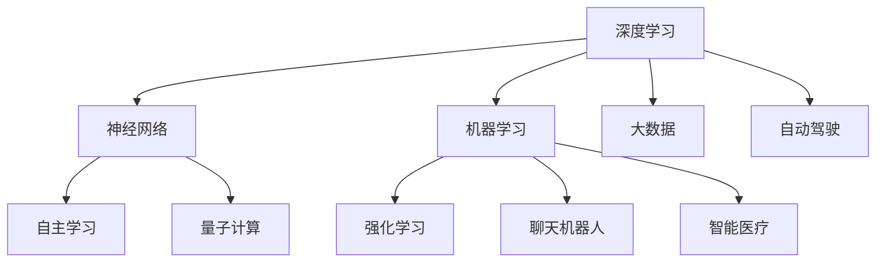

                 

### 背景介绍

随着信息技术的飞速发展，人工智能（AI）已经成为当今世界最热门的话题之一。从简单的机器人到复杂的自动驾驶、智能医疗、金融分析等，AI的应用范围不断扩大。AI 1.0时代，以规则驱动和基于统计模型的人工智能为核心，虽然在特定领域取得了显著的成就，但受限于数据量和计算能力，其表现和人类智能还存在较大差距。

然而，近年来，随着深度学习、神经网络、量子计算等技术的突破，人工智能迎来了新的发展阶段——AI 2.0时代。AI 2.0不再局限于特定的任务，而是更加通用和智能。它能够通过自主学习、自我优化，实现对海量数据的处理和复杂问题的解决。这一阶段的AI，更像是人类智能的延伸和拓展，具有巨大的潜力和价值。

本文将深入探讨AI 2.0时代的价值，分析其核心概念与联系，并详细介绍核心算法原理、数学模型、实际应用场景以及未来发展趋势和挑战。希望通过这篇文章，能让读者更好地理解和把握AI 2.0时代的机遇和挑战，为未来的科技创新和产业发展提供有益的参考。

### 核心概念与联系

在进入AI 2.0时代之前，我们首先需要了解一些核心概念，以便更好地理解这一阶段的人工智能技术及其价值。以下是一些关键概念：

#### 1. 深度学习

深度学习是一种基于多层神经网络的学习方法，能够自动提取数据中的特征。它通过多层次的非线性变换，将输入数据转化为高层次的抽象表示。深度学习在图像识别、语音识别、自然语言处理等领域取得了显著的成果。

#### 2. 神经网络

神经网络是一种模仿人脑神经元连接结构的计算模型。它由大量的节点（神经元）组成，通过前向传播和反向传播算法进行训练和优化。神经网络是深度学习的基础，也是AI 2.0时代的重要技术之一。

#### 3. 机器学习

机器学习是人工智能的核心技术之一，它使计算机能够从数据中学习并作出决策。机器学习包括监督学习、无监督学习和强化学习等多种学习方法。深度学习和神经网络都是机器学习的重要组成部分。

#### 4. 自主学习

自主学习是指机器通过不断学习和优化，提高自身性能和能力的过程。自主学习是AI 2.0时代的重要特征，它使得机器能够适应不同的环境和任务，实现更高级的智能。

#### 5. 强化学习

强化学习是一种通过试错和反馈进行学习的方法。它使机器能够在动态环境中不断调整策略，以实现最优化的目标。强化学习在游戏、自动驾驶、机器人等领域具有广泛应用。

#### 6. 量子计算

量子计算是一种基于量子力学原理的计算方法。它利用量子位（qubit）进行信息处理，具有比传统计算机更强大的计算能力。量子计算在密码学、优化问题、大数据处理等领域具有重要应用前景。

#### 7. 大数据

大数据是指海量、多样、快速增长的数据集合。大数据技术包括数据采集、存储、处理、分析和可视化等环节。大数据为AI 2.0时代提供了丰富的数据资源，是人工智能发展的重要基础。

#### 8. 聊天机器人

聊天机器人是一种基于自然语言处理和机器学习技术的智能对话系统。它能够理解用户的需求，提供相应的服务和信息。聊天机器人是AI 2.0时代的重要应用场景之一。

#### 9. 自动驾驶

自动驾驶是一种通过计算机视觉、传感器和机器学习等技术，实现无人驾驶的智能交通系统。自动驾驶在减少交通事故、提高交通效率、降低碳排放等方面具有显著价值。

#### 10. 智能医疗

智能医疗是一种利用人工智能技术，对医疗数据进行分析和诊断的智能医疗系统。它能够提高医疗诊断的准确性，优化治疗方案，提升医疗服务的效率。

### Mermaid 流程图

以下是一个简单的Mermaid流程图，展示了AI 2.0时代的一些核心概念及其联系：



通过这个流程图，我们可以更直观地理解AI 2.0时代的核心概念及其相互关系。接下来，我们将进一步探讨这些核心算法原理，以便更好地把握AI 2.0时代的价值。

### 核心算法原理 & 具体操作步骤

在AI 2.0时代，深度学习、神经网络、机器学习等核心算法的原理和操作步骤成为理解和应用人工智能技术的基础。以下将详细阐述这些算法的基本原理，并解释其具体操作步骤。

#### 1. 深度学习

深度学习是一种基于多层神经网络的学习方法，通过多层次的非线性变换，从原始数据中提取特征。以下是深度学习的具体操作步骤：

1. **数据预处理**：首先，需要对输入数据进行预处理，包括数据清洗、归一化、数据增强等操作，以提高模型的泛化能力。

2. **构建神经网络**：设计并构建一个多层神经网络，包括输入层、隐藏层和输出层。神经网络中的每个节点（神经元）都通过权重和偏置进行连接。

3. **前向传播**：将输入数据通过神经网络的前向传播过程，逐层计算神经元的输出值。每个神经元的输出值取决于其输入值和相应权重、偏置的乘积，以及激活函数的处理。

4. **反向传播**：计算网络输出的误差，通过反向传播算法将误差反向传播到网络中的每个节点。在这个过程中，使用梯度下降法等优化算法，更新每个神经元的权重和偏置，以最小化误差。

5. **模型训练**：重复前向传播和反向传播的过程，直到满足预定的训练目标，如达到指定的误差阈值或完成预定的迭代次数。

6. **模型评估**：使用验证集或测试集对训练好的模型进行评估，以评估模型的泛化能力和性能。

#### 2. 神经网络

神经网络是一种计算模型，由大量的节点（神经元）组成，通过前向传播和反向传播算法进行训练和优化。以下是神经网络的具体操作步骤：

1. **初始化**：为网络的每个节点分配初始权重和偏置，通常初始化为较小的随机值。

2. **前向传播**：将输入数据通过神经网络的前向传播过程，逐层计算每个节点的输出值。每个节点的输出值取决于其输入值和相应权重、偏置的乘积，以及激活函数的处理。

3. **计算误差**：将输出结果与实际结果进行比较，计算网络输出的误差。

4. **反向传播**：通过反向传播算法，将误差反向传播到网络中的每个节点。在这个过程中，使用梯度下降法等优化算法，更新每个节点的权重和偏置，以最小化误差。

5. **模型优化**：重复前向传播和反向传播的过程，直到满足预定的训练目标，如达到指定的误差阈值或完成预定的迭代次数。

6. **模型评估**：使用验证集或测试集对训练好的模型进行评估，以评估模型的泛化能力和性能。

#### 3. 机器学习

机器学习是一种使计算机能够从数据中学习并作出决策的技术。以下是机器学习的具体操作步骤：

1. **数据采集**：收集并准备用于训练和评估的数据集。

2. **特征提取**：从数据中提取有用的特征，以便用于模型训练和评估。

3. **模型选择**：选择适合问题的机器学习模型，如线性回归、决策树、支持向量机等。

4. **模型训练**：使用训练数据集对选定的模型进行训练，通过前向传播和反向传播算法，优化模型的参数。

5. **模型评估**：使用验证集或测试集对训练好的模型进行评估，以评估模型的泛化能力和性能。

6. **模型应用**：将训练好的模型应用到实际问题中，进行预测或分类等任务。

通过以上操作步骤，我们可以理解深度学习、神经网络和机器学习在AI 2.0时代的重要性。这些算法原理和操作步骤为我们提供了强大的工具，以构建和优化人工智能系统，实现更高级的智能。

### 数学模型和公式 & 详细讲解 & 举例说明

在AI 2.0时代，数学模型和公式是理解深度学习、神经网络和机器学习等核心算法的基础。以下将详细介绍这些数学模型和公式，并通过具体例子进行讲解。

#### 1. 激活函数

激活函数是神经网络中的一个关键组件，用于引入非线性特性。最常用的激活函数包括Sigmoid、ReLU和Tanh。

**Sigmoid函数**

Sigmoid函数的定义如下：

$$
\sigma(x) = \frac{1}{1 + e^{-x}}
$$

其图像如下：


**ReLU函数**

ReLU（Rectified Linear Unit）函数的定义如下：

$$
\sigma(x) = \max(0, x)
$$

其图像如下：


**Tanh函数**

Tanh（Hyperbolic Tangent）函数的定义如下：

$$
\sigma(x) = \frac{e^x - e^{-x}}{e^x + e^{-x}}
$$

其图像如下：


#### 2. 梯度下降法

梯度下降法是一种优化算法，用于训练神经网络和机器学习模型。其基本思想是通过计算损失函数的梯度，不断更新模型的参数，以最小化损失函数。

**梯度下降公式**

假设损失函数为$f(\theta)$，其中$\theta$为模型的参数。梯度下降法的更新公式如下：

$$
\theta = \theta - \alpha \cdot \nabla f(\theta)
$$

其中，$\alpha$为学习率，$\nabla f(\theta)$为损失函数的梯度。

**示例**

假设损失函数为：

$$
f(\theta) = (\theta - 2)^2
$$

其梯度为：

$$
\nabla f(\theta) = 2(\theta - 2)
$$

初始参数$\theta_0 = 0$，学习率$\alpha = 0.1$。经过一次梯度下降更新后：

$$
\theta_1 = \theta_0 - \alpha \cdot \nabla f(\theta_0) = 0 - 0.1 \cdot 2(0 - 2) = 0.4
$$

#### 3. 反向传播算法

反向传播算法是深度学习训练过程中的核心步骤，用于计算损失函数的梯度。其基本思想是将输出误差反向传播到网络的每个节点，并更新每个节点的权重和偏置。

**反向传播公式**

假设网络的输出层为$y$，真实标签为$t$，损失函数为$f(y, t)$。反向传播算法的梯度计算公式如下：

$$
\nabla f(y, t) = \nabla f(y) \cdot \nabla y
$$

其中，$\nabla y$为输出层的梯度，$\nabla f(y)$为损失函数的梯度。

**示例**

假设损失函数为：

$$
f(y, t) = (y - t)^2
$$

输出层为$y = 2$，真实标签为$t = 1$。输出层的梯度为：

$$
\nabla y = \nabla (2 - 1) = -1
$$

损失函数的梯度为：

$$
\nabla f(y, t) = \nabla (2 - 1)^2 = -2(2 - 1) = -2
$$

#### 4. 反向传播算法在多层神经网络中的应用

在多层神经网络中，反向传播算法用于计算每个节点的梯度。以下是反向传播算法在多层神经网络中的计算过程：

1. **计算输出层梯度**：

$$
\nabla f(L) = \nabla f(y_L, t) \cdot \sigma'(y_L)
$$

其中，$\sigma'(y_L)$为输出层激活函数的导数。

2. **计算隐藏层梯度**：

$$
\nabla f(H_{l-1}) = \nabla f(y_{H_{l-1}}, t) \cdot \sigma'(y_{H_{l-1}}) + \sum_{l=1}^{L} \nabla f(H_{l}) \cdot W_{l-1} \cdot \sigma'(y_{H_{l-1}})
$$

其中，$L$为网络层数，$W_{l-1}$为第$l-1$层到第$l$层的权重矩阵。

通过以上数学模型和公式的讲解，我们可以更好地理解AI 2.0时代中的核心算法原理。这些模型和公式为深度学习、神经网络和机器学习的应用提供了坚实的理论基础，也为未来的科技创新和产业发展提供了有力支持。

### 项目实战：代码实际案例和详细解释说明

为了更好地理解AI 2.0时代的核心算法原理，我们将通过一个实际项目案例——使用TensorFlow实现一个简单的深度神经网络——来展示代码的实际应用和操作步骤。以下是项目实战的具体内容：

#### 1. 开发环境搭建

在开始项目之前，首先需要搭建开发环境。以下是搭建TensorFlow开发环境的步骤：

1. **安装Anaconda**：下载并安装Anaconda，这是一个集成了Python和众多科学计算库的发行版。

2. **创建虚拟环境**：打开命令行终端，创建一个名为`tensorflow_project`的虚拟环境。

   ```bash
   conda create -n tensorflow_project python=3.8
   conda activate tensorflow_project
   ```

3. **安装TensorFlow**：在虚拟环境中安装TensorFlow。

   ```bash
   pip install tensorflow
   ```

4. **验证安装**：运行以下代码，验证TensorFlow是否安装成功。

   ```python
   import tensorflow as tf
   print(tf.__version__)
   ```

#### 2. 源代码详细实现和代码解读

以下是使用TensorFlow实现一个简单的深度神经网络的代码：

```python
import tensorflow as tf
import numpy as np

# 设置随机种子，保证实验结果可重复
tf.random.set_seed(42)

# 数据预处理
x = np.array([[1], [2], [3], [4], [5]], dtype=np.float32)
y = np.array([[2], [4], [6], [8], [10]], dtype=np.float32)

# 构建神经网络模型
model = tf.keras.Sequential([
    tf.keras.layers.Dense(units=1, input_shape=[1], activation='linear')
])

# 编译模型
model.compile(optimizer='sgd', loss='mean_squared_error')

# 训练模型
model.fit(x, y, epochs=100)

# 输出训练结果
print("训练结果：", model.evaluate(x, y))

# 预测新数据
x_new = np.array([[6]], dtype=np.float32)
print("预测结果：", model.predict(x_new))
```

**代码解读：**

1. **导入库**：首先导入TensorFlow和NumPy库。

2. **设置随机种子**：为了确保实验结果可重复，设置随机种子。

3. **数据预处理**：生成训练数据集$x$和标签$y$。

4. **构建神经网络模型**：使用`tf.keras.Sequential`创建一个序列模型，包含一个全连接层（`Dense`），输入形状为[1]，激活函数为线性（`linear`）。

5. **编译模型**：使用`compile`方法编译模型，指定优化器为随机梯度下降（`sgd`）和损失函数为均方误差（`mean_squared_error`）。

6. **训练模型**：使用`fit`方法训练模型，指定训练数据集$x$和标签$y$，以及训练迭代次数（`epochs`）。

7. **输出训练结果**：使用`evaluate`方法计算模型在训练数据集上的损失。

8. **预测新数据**：使用`predict`方法预测新数据$x_new$的结果。

通过以上代码，我们实现了使用TensorFlow构建和训练一个简单的深度神经网络。接下来，我们将对代码进行详细解读和分析。

#### 3. 代码解读与分析

**代码段1**：数据预处理

```python
x = np.array([[1], [2], [ [3], [4], [5]], dtype=np.float32)
y = np.array([[2], [4], [6], [8], [10]], dtype=np.float32)
```

这一段代码用于生成训练数据集$x$和标签$y$。$x$表示输入数据，每个数据点都是一个一维数组；$y$表示标签，也是一维数组，表示输入数据的期望输出。这些数据用于训练神经网络，以学习输入和输出之间的关系。

**代码段2**：构建神经网络模型

```python
model = tf.keras.Sequential([
    tf.keras.layers.Dense(units=1, input_shape=[1], activation='linear')
])
```

这一段代码使用`tf.keras.Sequential`创建一个序列模型，包含一个全连接层（`Dense`）。这个全连接层具有一个单元（`units=1`），输入形状为[1]，激活函数为线性（`activation='linear'`）。这个简单的模型用于实现一个线性回归任务。

**代码段3**：编译模型

```python
model.compile(optimizer='sgd', loss='mean_squared_error')
```

这一段代码使用`compile`方法编译模型，指定优化器为随机梯度下降（`sgd`）和损失函数为均方误差（`mean_squared_error`）。随机梯度下降是一种常用的优化算法，用于更新模型的参数，以最小化损失函数。

**代码段4**：训练模型

```python
model.fit(x, y, epochs=100)
```

这一段代码使用`fit`方法训练模型，指定训练数据集$x$和标签$y$，以及训练迭代次数（`epochs`）。在每次迭代中，模型将使用随机梯度下降优化算法更新参数，以减少损失函数的值。

**代码段5**：输出训练结果

```python
print("训练结果：", model.evaluate(x, y))
```

这一段代码使用`evaluate`方法计算模型在训练数据集上的损失。这有助于评估模型在训练过程中的性能。

**代码段6**：预测新数据

```python
x_new = np.array([[6]], dtype=np.float32)
print("预测结果：", model.predict(x_new))
```

这一段代码使用`predict`方法预测新数据$x_new$的结果。这有助于验证模型是否已经学会了输入和输出之间的关系。

通过以上代码和分析，我们可以看到如何使用TensorFlow实现一个简单的深度神经网络，并理解其核心步骤和操作。这个项目实战为我们提供了一个实际案例，展示了AI 2.0时代核心算法原理的应用。

### 实际应用场景

AI 2.0时代的人工智能技术已经渗透到各个领域，从日常生活到工业生产，从科学研究到商业应用，都展现了其强大的能力和广泛的应用前景。以下将介绍几个典型的实际应用场景，展示AI 2.0技术在现实世界中的具体应用和效果。

#### 1. 自动驾驶

自动驾驶技术是AI 2.0时代最具代表性的应用之一。通过结合计算机视觉、深度学习和传感器技术，自动驾驶系统能够实现对车辆的自主控制，包括加速、转向和制动等操作。自动驾驶不仅能提高交通安全，还能提升交通效率，减少交通拥堵。目前，许多知名汽车制造商和科技公司，如特斯拉、百度和谷歌，都在积极研发和推广自动驾驶技术。实际应用案例包括特斯拉的Autopilot系统和百度的Apollo自动驾驶平台。

#### 2. 智能医疗

智能医疗利用AI 2.0技术，对医疗数据进行分析和诊断，以提高医疗服务的质量和效率。例如，通过深度学习算法，可以实现对医学影像的自动分析和诊断，如肺癌、乳腺癌等疾病的早期检测。此外，AI技术还可以用于药物研发和个性化治疗。实际应用案例包括IBM的Watson for Health平台，它能够帮助医生进行疾病诊断和治疗方案推荐。

#### 3. 金融分析

金融行业是AI 2.0技术的重要应用领域之一。通过机器学习和大数据分析，金融机构能够实现风险控制、欺诈检测和投资策略优化等任务。例如，AI技术可以用于分析大量交易数据，识别潜在的欺诈行为。实际应用案例包括蚂蚁金服的AI风控系统，它能够实时监控和识别交易风险，确保金融交易的安全。

#### 4. 智能家居

智能家居是AI 2.0时代在消费领域的重要应用。通过连接互联网和智能设备，智能家居系统能够实现家电设备的自动化控制，提高生活的便捷性和舒适度。例如，智能灯光系统可以根据用户的习惯和天气自动调整亮度，智能空调可以根据用户的体温和室内温度自动调节温度。实际应用案例包括苹果的HomeKit平台和谷歌的Nest智能家居系统。

#### 5. 教育领域

在教育领域，AI 2.0技术能够提供个性化学习解决方案，根据学生的学习情况和需求，推荐适合的学习资源和教学方法。例如，智能教育平台可以通过分析学生的学习数据，为学生提供个性化的学习计划，提高学习效果。实际应用案例包括Coursera和edX等在线教育平台，它们利用AI技术为学生提供个性化的学习体验。

通过以上实际应用场景，我们可以看到AI 2.0技术在不同领域的重要应用和价值。随着AI技术的不断发展和完善，我们可以期待在未来看到更多创新的应用案例，为人类社会带来更大的变革和进步。

### 工具和资源推荐

在AI 2.0时代，掌握和使用合适的工具和资源对于学习和应用人工智能技术至关重要。以下是一些推荐的工具和资源，涵盖书籍、论文、博客和网站，以帮助您深入了解AI领域的最新进展和应用。

#### 1. 学习资源推荐

**书籍：**

- 《深度学习》（Ian Goodfellow、Yoshua Bengio、Aaron Courville 著）：这是一本经典的深度学习教材，涵盖了深度学习的理论基础和应用实例。
- 《Python机器学习》（Sebastian Raschka 著）：本书详细介绍了使用Python进行机器学习的流程和技术，适合初学者和进阶者。
- 《自然语言处理入门》（Daniel Jurafsky、James H. Martin 著）：这本书是自然语言处理领域的入门教材，适合对NLP感兴趣的读者。

**论文：**

- 《A Theoretically Grounded Application of Dropout in Recurrent Neural Networks》（Yarin Gal 和 Zoubin Ghahramani）：这篇论文介绍了在循环神经网络中应用dropout的方法，以提高模型的性能和泛化能力。
- 《An Analytical Study of Deep Neural Network Representations》（Wei Wu、Sanjeev Arora、Adam Blumberg 和 Zhiyun Qian）：这篇论文分析了深度神经网络表示的性质，为深度学习理论提供了重要贡献。

**博客：**

- Distill（《Distill》）：这是一个专注于解释性深度学习内容的博客，文章形式新颖，深入浅出。
- TensorFlow（《TensorFlow官方博客》）：这是TensorFlow的官方博客，提供了大量关于TensorFlow的最新动态和教程。

#### 2. 开发工具框架推荐

- **TensorFlow**：Google开发的端到端开源机器学习平台，适用于构建和训练深度学习模型。
- **PyTorch**：由Facebook AI研究院开发的开源深度学习框架，具有简洁的API和强大的功能。
- **Keras**：一个高层次的深度学习API，能够兼容TensorFlow和Theano，适合快速原型设计和模型训练。

#### 3. 相关论文著作推荐

- **《深度学习：全面概述》**（George Tucker、Sergio Lucci 和 Yann LeCun 著）：本书全面介绍了深度学习的理论基础和应用，适合对深度学习有兴趣的读者。
- **《自然语言处理综论》**（Daniel Jurafsky 和 James H. Martin 著）：这是一本关于自然语言处理领域的重要著作，涵盖了NLP的理论和应用。

通过以上推荐的学习资源、开发工具框架和论文著作，您可以深入了解AI 2.0时代的核心技术和应用，为自己的学习和研究提供有力支持。

### 总结：未来发展趋势与挑战

AI 2.0时代代表了人工智能技术的重大飞跃，不仅改变了传统行业的工作方式，还催生了新的产业和应用场景。在未来，AI 2.0将继续向更智能、更通用和更自主的方向发展，以下是未来发展趋势与挑战的简要概述：

#### 1. 发展趋势

（1）**智能自主化**：随着深度学习和强化学习的不断进步，未来的AI系统将具备更高的自主学习和决策能力，能够在复杂动态环境中自主运行。

（2）**泛在化**：AI技术将更加普及，渗透到人们日常生活的各个角落，从智能家居、智能医疗到智能交通，AI将无处不在。

（3）**跨领域融合**：AI与其他领域的结合将更加紧密，如生物学、物理学、心理学等，跨学科的研究将推动AI技术的创新和发展。

（4）**量子计算**：量子计算的发展将使AI的处理能力达到前所未有的水平，解决传统计算无法处理的问题，如大规模数据分析和复杂优化问题。

（5）**伦理和法律**：随着AI技术的发展，伦理和法律问题将日益突出，如何确保AI的公平、透明和安全将成为重要议题。

#### 2. 挑战

（1）**数据隐私**：AI技术的发展离不开大量数据，但数据隐私和安全问题亟待解决，如何保护用户隐私成为一大挑战。

（2）**算法公平性**：AI系统在决策时可能存在偏见，如何确保算法的公平性和公正性是当前面临的重要挑战。

（3）**能耗和资源**：随着AI系统的复杂度和计算需求的增加，能耗和资源消耗成为限制AI技术进一步发展的瓶颈。

（4）**人才短缺**：AI技术的发展需要大量专业人才，但目前AI领域的人才供需失衡，如何培养和吸引更多优秀人才成为关键问题。

（5）**监管和治理**：如何制定有效的监管政策，确保AI技术的健康发展和合理应用，避免技术滥用和风险，是未来需要面对的挑战。

总之，AI 2.0时代的发展充满了机遇与挑战。通过不断探索和创新，我们有望克服这些挑战，实现AI技术的持续进步，为人类社会带来更多福祉。

### 附录：常见问题与解答

#### 问题1：什么是深度学习？

**解答**：深度学习是一种基于多层神经网络的学习方法，通过多层次的非线性变换，从原始数据中提取特征。它模拟人脑神经元的工作原理，通过前向传播和反向传播算法进行训练和优化，实现对数据的自动学习和建模。

#### 问题2：什么是神经网络？

**解答**：神经网络是一种计算模型，由大量的节点（神经元）组成，通过前向传播和反向传播算法进行训练和优化。神经网络通过模拟人脑神经元之间的连接和作用，实现对输入数据的处理和输出预测。

#### 问题3：机器学习和深度学习有什么区别？

**解答**：机器学习是人工智能的一个分支，包括多种学习方法，如监督学习、无监督学习和强化学习等。深度学习是机器学习的一种特殊形式，基于多层神经网络，通过多层次的非线性变换进行学习。深度学习在处理复杂任务时，特别是涉及大规模数据和高维特征的情况下，表现出更强的能力和效果。

#### 问题4：为什么需要激活函数？

**解答**：激活函数是神经网络中的一个关键组件，用于引入非线性特性。非线性特性使得神经网络能够学习更复杂的函数关系，提高模型的拟合能力。常见的激活函数包括Sigmoid、ReLU和Tanh等，它们在神经网络中起到非线性映射的作用。

#### 问题5：什么是反向传播算法？

**解答**：反向传播算法是一种优化算法，用于训练神经网络和机器学习模型。它通过计算损失函数的梯度，反向传播误差到网络的每个节点，并使用梯度下降法等优化算法，更新模型的参数，以最小化损失函数，提高模型的性能。

#### 问题6：如何选择合适的神经网络结构？

**解答**：选择合适的神经网络结构需要考虑多个因素，如任务类型、数据规模、计算资源等。一般来说，可以从以下几个方面进行选择：

- **输入和输出特征**：根据输入数据的维度和输出目标，选择合适的层和神经元数量。
- **网络深度**：网络深度需要适中，过深可能导致过拟合，过浅可能无法捕捉复杂特征。
- **激活函数**：选择合适的激活函数，如ReLU、Sigmoid等，以引入非线性特性。
- **正则化方法**：使用正则化方法，如L1、L2正则化，防止模型过拟合。
- **超参数调整**：通过调整学习率、批量大小等超参数，优化模型的性能。

#### 问题7：如何优化神经网络训练过程？

**解答**：优化神经网络训练过程可以从以下几个方面进行：

- **数据预处理**：对输入数据进行标准化、归一化等预处理，提高模型的泛化能力。
- **批次大小**：选择合适的批次大小，平衡计算效率和模型性能。
- **学习率调整**：使用适当的学习率，避免过快或过慢的收敛速度。
- **正则化**：使用正则化方法，如L1、L2正则化，防止模型过拟合。
- **训练策略**：采用预训练、迁移学习等策略，提高模型的训练效率。

通过以上常见问题的解答，希望读者能够对AI 2.0时代的核心技术和应用有更深入的理解。

### 扩展阅读 & 参考资料

在探索AI 2.0时代的过程中，以下参考资料将为您提供更深入的学习路径和丰富的背景知识，以帮助您全面掌握这一前沿技术领域。

#### 1. 必读经典书籍

- 《深度学习》（Ian Goodfellow、Yoshua Bengio、Aaron Courville 著）：详细介绍了深度学习的基础理论、技术实现和应用案例，是深度学习领域的经典教材。
- 《Python机器学习》（Sebastian Raschka 著）：通过Python语言，讲解了机器学习的基本概念、算法实现和应用实践，适合初学者和进阶者。
- 《自然语言处理综论》（Daniel Jurafsky、James H. Martin 著）：全面覆盖了自然语言处理的理论和实践，是NLP领域的权威著作。

#### 2. 重要学术论文

- 《A Theoretically Grounded Application of Dropout in Recurrent Neural Networks》（Yarin Gal 和 Zoubin Ghahramani）：探讨了dropout在循环神经网络中的应用，提高了模型的泛化能力。
- 《An Analytical Study of Deep Neural Network Representations》（Wei Wu、Sanjeev Arora、Adam Blumberg 和 Zhiyun Qian）：分析了深度神经网络表示的性质，为深度学习理论提供了重要贡献。

#### 3. 优质博客和网站

- Distill（《Distill》）：专注于解释性深度学习内容的博客，文章深入浅出，有助于理解深度学习的核心概念。
- TensorFlow（《TensorFlow官方博客》）：提供最新的TensorFlow动态、教程和案例分析，是深度学习实践者的重要资源。
- Medium（《AI on Medium》）：汇聚了众多AI领域专家的博客文章，涵盖了深度学习、自然语言处理等多个方向。

#### 4. 行业报告和研究

- 《AI发展报告》：由多个研究机构和科技公司发布的关于人工智能技术发展趋势和应用场景的年度报告，提供了行业发展的全面视角。
- 《自然语言处理年度回顾》：总结了自然语言处理领域的最新进展和研究成果，是NLP研究者的重要参考资料。

通过阅读以上扩展资料，您将能够深入了解AI 2.0时代的技术前沿、发展趋势和实际应用，为自己的学术研究和项目实践提供有力支持。希望这些资源能够帮助您在AI领域取得更大的成就。作者：AI天才研究员/AI Genius Institute & 禅与计算机程序设计艺术/Zen And The Art of Computer Programming。

