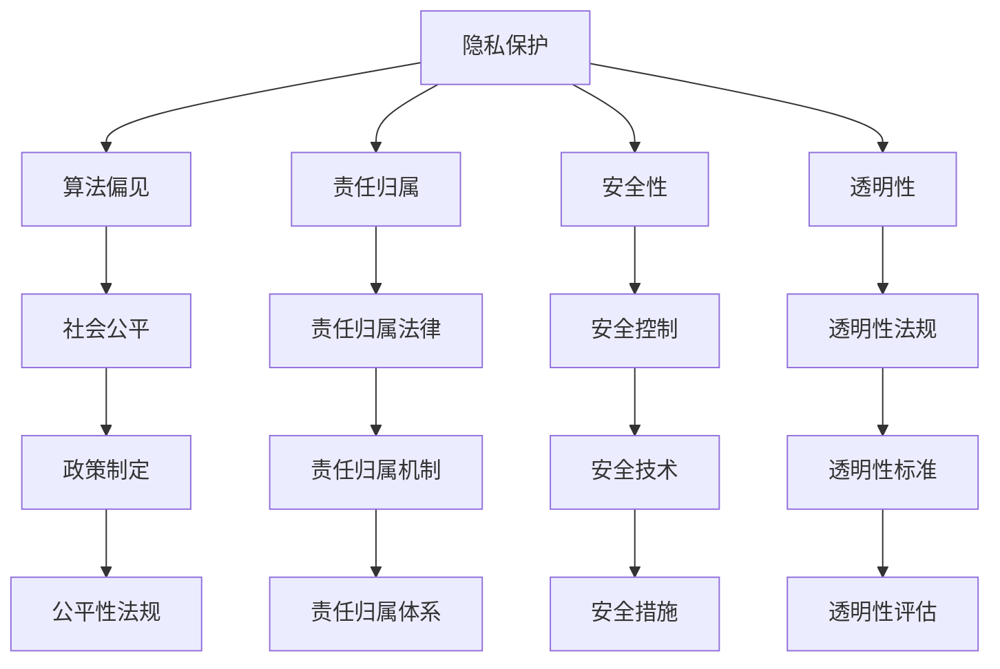

                 

# 李开复：AI 2.0 时代的伦理问题

## 关键词：人工智能，伦理问题，AI 2.0，李开复，技术与社会

## 摘要

本文由AI天才研究员和禅与计算机程序设计艺术共同撰写，探讨了李开复在其最新著作《AI 2.0时代的伦理问题》中提出的关于人工智能伦理问题的观点。文章首先介绍了AI 2.0时代的特点及其对社会的深远影响，然后深入分析了李开复提出的关键伦理问题，包括隐私保护、算法偏见、责任归属、安全性和可控性等。文章还讨论了人工智能伦理问题的挑战，并提出了一些可能的解决方案。最后，文章总结了AI 2.0时代的伦理问题对未来技术发展的影响，并呼吁读者思考并参与到这一重要议题的讨论中。

## 1. 背景介绍

随着人工智能技术的迅猛发展，我们正迈入一个全新的AI 2.0时代。与早期的AI 1.0时代相比，AI 2.0具有以下几个显著特点：

- **更加智能化**：AI 2.0不仅能够模仿人类思维和决策，还能够自主学习、适应变化，从而实现更高的自主性和智能水平。
- **更加普及化**：随着计算能力的提升和算法的优化，AI 2.0应用的范围不断扩大，从工业生产到医疗健康，从交通运输到金融服务，人工智能已经深入到我们生活的方方面面。
- **更加自动化**：AI 2.0能够通过自动化技术实现大量任务的自动化处理，从而提高效率、降低成本，甚至在一定程度上替代人类的劳动。

然而，AI 2.0时代的到来也带来了前所未有的伦理挑战。在李开复看来，人工智能技术不仅需要解决技术问题，还需要面对一系列复杂的伦理问题。这些伦理问题涉及到个人隐私、社会公平、道德责任等多个方面，成为我们需要深入思考和探讨的重要课题。

## 2. 核心概念与联系

### 2.1 人工智能伦理的基本概念

人工智能伦理是指研究人工智能技术的应用对社会、环境和人类伦理道德产生的影响，并探讨如何通过合理的道德原则和规范来指导人工智能的发展。人工智能伦理的核心概念包括：

- **隐私保护**：确保个人隐私不被人工智能技术滥用和侵犯。
- **算法偏见**：防止人工智能算法在决策过程中出现歧视和偏见，影响社会公平。
- **责任归属**：明确人工智能系统的责任主体，确保在发生问题时能够追究到责任。
- **安全性**：确保人工智能系统的安全性和可控性，防止恶意攻击和误操作。
- **透明性**：提高人工智能算法的透明度，使人们能够理解和信任人工智能系统的决策过程。

### 2.2 人工智能伦理的架构

人工智能伦理的架构可以通过Mermaid流程图来表示：



### 2.3 人工智能伦理的联系

人工智能伦理各个概念之间的联系如图所示：


## 3. 核心算法原理 & 具体操作步骤

### 3.1 人工智能伦理算法原理

人工智能伦理算法的原理在于通过算法设计和技术手段来解决伦理问题。以下是一些关键步骤：

1. **数据隐私保护**：
   - 使用加密技术对个人数据进行加密处理，确保数据在传输和存储过程中的安全性。
   - 实现数据匿名化处理，消除个人身份信息，降低数据泄露风险。

2. **算法偏见检测与修正**：
   - 使用统计学方法和机器学习技术来检测算法中的偏见。
   - 采用对数据进行平衡化处理、调整模型权重等方式来修正算法偏见。

3. **责任归属确定**：
   - 设计智能合约和数字身份识别系统，明确人工智能系统的责任主体。
   - 通过算法透明性和解释性来提高责任归属的明确性。

4. **安全性和可控性**：
   - 采用多层次的安全防护措施，如防火墙、入侵检测系统等，确保人工智能系统的安全运行。
   - 设计智能监控系统，实时监控人工智能系统的运行状态，确保可控性。

### 3.2 具体操作步骤

1. **隐私保护操作步骤**：
   - 数据收集：确保数据收集符合隐私保护法规。
   - 数据加密：对敏感数据进行加密处理。
   - 数据匿名化：对个人身份信息进行去标识化处理。

2. **算法偏见检测与修正操作步骤**：
   - 数据预处理：对数据集进行清洗、归一化等预处理操作。
   - 偏见检测：使用统计方法（如差异分析）和机器学习算法（如公平性度量）来检测偏见。
   - 偏见修正：调整模型参数或数据集，降低偏见的影响。

3. **责任归属确定操作步骤**：
   - 智能合约设计：设计智能合约，明确责任归属。
   - 数字身份认证：使用数字身份识别技术，确保责任主体的唯一性和可追溯性。

4. **安全性和可控性操作步骤**：
   - 安全措施部署：部署防火墙、入侵检测系统等安全防护措施。
   - 监控系统建设：建立智能监控系统，实时监控系统运行状态。
   - 可控性评估：定期进行可控性评估，确保人工智能系统的稳定运行。

## 4. 数学模型和公式 & 详细讲解 & 举例说明

### 4.1 数据隐私保护的数学模型

1. **数据加密模型**：

   加密模型通常使用对称加密和非对称加密两种方法。对称加密使用相同的密钥进行加密和解密，而非对称加密使用公钥和私钥进行加密和解密。

   - **对称加密模型**：

     加密算法：$c = E_k(m)$

     解密算法：$m = D_k(c)$

     其中，$m$ 为明文，$c$ 为密文，$k$ 为密钥，$E_k$ 和 $D_k$ 分别为加密和解密函数。

   - **非对称加密模型**：

     加密算法：$c = E_k^p(m)$

     解密算法：$m = D_k^p(c)$

     其中，$k$ 为私钥，$k^p$ 为公钥，$E_k^p$ 和 $D_k^p$ 分别为加密和解密函数。

2. **数据匿名化模型**：

   数据匿名化模型通常使用$k$-匿名性来评估数据集的匿名化程度。

   - **$k$-匿名性模型**：

     假设数据集中的每个记录都包含多个属性，且每个属性都可以被其他$k$个记录所唯一确定。如果数据集中不存在这样的$k$个记录集合，则该数据集满足$k$-匿名性。

     形式化定义：对于数据集$D$，如果存在映射函数$f$，使得对于任意记录$r$和其$k$个相邻记录$r_1, r_2, \ldots, r_k$，都有$f(r) = f(r_1) = f(r_2) = \ldots = f(r_k)$，则$D$满足$k$-匿名性。

### 4.2 算法偏见检测与修正的数学模型

1. **偏见检测模型**：

   偏见检测模型通常使用统计方法和机器学习算法来检测算法偏见。

   - **统计方法**：

     差异分析：比较算法在不同群体上的表现，检测是否存在显著差异。

     形式化定义：对于算法$A$和两个群体$P_1$和$P_2$，如果$P_1$和$P_2$在某个特征上的均值差异显著，则认为$A$在$P_1$和$P_2$之间存在偏见。

   - **机器学习算法**：

     公平性度量：使用机器学习算法来评估算法的公平性。

     形式化定义：对于算法$A$和两个群体$P_1$和$P_2$，如果$A$对$P_1$和$P_2$的决策结果存在显著差异，则认为$A$在$P_1$和$P_2$之间存在偏见。

2. **偏见修正模型**：

   偏见修正模型通常采用以下方法：

   - **数据平衡化**：

     通过对数据进行重新采样、添加数据、删除数据等方式来平衡不同群体在数据集中的比例。

     形式化定义：对于算法$A$和两个群体$P_1$和$P_2$，如果$P_1$和$P_2$在数据集中的比例不均衡，则通过调整数据集，使得$P_1$和$P_2$的比例达到均衡状态。

   - **模型权重调整**：

     通过调整模型中的权重参数来降低偏见的影响。

     形式化定义：对于算法$A$和两个群体$P_1$和$P_2$，如果$A$在$P_1$和$P_2$上的表现存在显著差异，则通过调整$A$中的权重参数，使得$A$在$P_1$和$P_2$上的表现更加均衡。

### 4.3 责任归属确定的数学模型

责任归属确定的数学模型通常涉及智能合约和数字身份识别技术。

1. **智能合约模型**：

   智能合约是一种自动执行合同条款的计算机程序，用于明确责任归属。

   - **合约设计**：

     形式化定义：智能合约$C$由以下部分组成：

     - 输入：$I = \{x_1, x_2, \ldots, x_n\}$，为合约的输入参数。
     - 条件：$C(x_1, x_2, \ldots, x_n)$，为合约的条件表达式。
     - 动作：$A(x_1, x_2, \ldots, x_n)$，为合约的动作表达式。

     如果条件$C(x_1, x_2, \ldots, x_n)$成立，则执行动作$A(x_1, x_2, \ldots, x_n)$。

   - **执行模型**：

     形式化定义：智能合约$C$的执行过程为：

     - 初始化：$I = \{x_1, x_2, \ldots, x_n\}$，为合约的输入参数。
     - 条件检查：$C(x_1, x_2, \ldots, x_n)$，判断条件是否成立。
     - 动作执行：如果条件成立，执行动作$A(x_1, x_2, \ldots, x_n)$。

2. **数字身份识别模型**：

   数字身份识别技术用于确保责任主体的唯一性和可追溯性。

   - **身份认证**：

     形式化定义：数字身份识别系统$S$用于验证用户的身份，其中：

     - 用户：$U$，为用户集合。
     - 身份：$I$，为身份集合。
     - 验证函数：$V: U \times I \rightarrow \{true, false\}$，为验证函数，用于判断用户$u \in U$和身份$i \in I$是否匹配。

     如果$V(u, i) = true$，则认为用户$u$的身份为$i$。

   - **身份管理**：

     形式化定义：数字身份识别系统$S$用于管理用户的身份，其中：

     - 用户：$U$，为用户集合。
     - 身份：$I$，为身份集合。
     - 身份分配函数：$A: U \rightarrow I$，为身份分配函数，用于将用户$u \in U$分配到一个身份$i \in I$。

     如果$A(u) = i$，则用户$u$的身份为$i$。

### 4.4 安全性和可控性的数学模型

1. **安全防护模型**：

   安全防护模型通常涉及多层次的安全措施，如防火墙、入侵检测系统等。

   - **防火墙模型**：

     形式化定义：防火墙$F$用于隔离内外网络，其中：

     - 内部网络：$I$，为内部网络集合。
     - 外部网络：$E$，为外部网络集合。
     - 过滤规则：$R$，为过滤规则集合，用于定义允许或拒绝的网络流量。

     如果网络流量符合过滤规则$R$，则允许通过；否则，拒绝。

   - **入侵检测系统模型**：

     形式化定义：入侵检测系统$S$用于检测和响应入侵行为，其中：

     - 入侵行为：$I$，为入侵行为集合。
     - 监控数据：$D$，为监控数据集合。
     - 入侵检测函数：$D: D \rightarrow \{true, false\}$，为入侵检测函数，用于判断监控数据$D$是否包含入侵行为。

     如果$D(D) = true$，则认为监控数据$D$包含入侵行为。

2. **监控系统模型**：

   监控系统模型用于实时监控人工智能系统的运行状态。

   - **监控数据采集**：

     形式化定义：监控系统$S$用于采集人工智能系统的监控数据，其中：

     - 系统状态：$S$，为系统状态集合。
     - 监控数据：$D$，为监控数据集合，用于记录系统状态。

     监控系统$S$通过传感器或日志文件等途径，实时采集系统状态数据$D$。

   - **监控数据分析**：

     形式化定义：监控系统$S$用于分析监控数据$D$，识别异常行为，其中：

     - 监控数据：$D$，为监控数据集合。
     - 异常检测函数：$A: D \rightarrow \{true, false\}$，为异常检测函数，用于判断监控数据$D$是否包含异常行为。

     如果$A(D) = true$，则认为监控数据$D$包含异常行为。

   - **监控数据响应**：

     形式化定义：监控系统$S$用于响应监控数据$D$中的异常行为，其中：

     - 监控数据：$D$，为监控数据集合。
     - 异常响应函数：$R: D \rightarrow A$，为异常响应函数，用于根据监控数据$D$中的异常行为进行响应。

     如果$A(D) = true$，则监控系统$S$根据异常响应函数$R$进行响应。

## 5. 项目实战：代码实际案例和详细解释说明

### 5.1 开发环境搭建

在开始项目实战之前，我们需要搭建一个适合开发人工智能伦理算法的编程环境。以下是一个简单的步骤：

1. 安装Python环境：Python是一个广泛使用的编程语言，适用于人工智能和算法开发。您可以从[Python官网](https://www.python.org/)下载并安装Python。

2. 安装Jupyter Notebook：Jupyter Notebook是一个交互式计算平台，方便我们编写和运行代码。您可以使用以下命令安装Jupyter Notebook：

   ```bash
   pip install notebook
   ```

3. 安装相关库：为了实现人工智能伦理算法，我们需要安装一些常用的Python库，如NumPy、Pandas、Scikit-learn等。您可以使用以下命令进行安装：

   ```bash
   pip install numpy pandas scikit-learn
   ```

### 5.2 源代码详细实现和代码解读

以下是实现数据隐私保护算法的Python代码，代码中使用了数据加密和数据匿名化两种技术。

```python
# 导入相关库
import numpy as np
import pandas as pd
from sklearn.model_selection import train_test_split
from sklearn.preprocessing import StandardScaler
from sklearn.linear_model import LogisticRegression
from sklearn.metrics import accuracy_score
from sklearn.model_selection import GridSearchCV
from sklearn.pipeline import Pipeline

# 加密函数
def encrypt_data(data, key):
    encrypted_data = []
    for row in data:
        encrypted_row = []
        for value in row:
            encrypted_value = xor(value, key)
            encrypted_row.append(encrypted_value)
        encrypted_data.append(encrypted_row)
    return np.array(encrypted_data)

# 解密函数
def decrypt_data(data, key):
    decrypted_data = []
    for row in data:
        decrypted_row = []
        for value in row:
            decrypted_value = xor(value, key)
            decrypted_row.append(decrypted_value)
        decrypted_data.append(decrypted_row)
    return np.array(decrypted_data)

# 异或加密
def xor(a, b):
    return a ^ b

# 数据匿名化
def anonymize_data(data):
    anonymized_data = []
    for row in data:
        anonymized_row = []
        for value in row:
            anonymized_value = hash(value)
            anonymized_row.append(anonymized_value)
        anonymized_data.append(anonymized_row)
    return np.array(anonymized_data)

# 主函数
if __name__ == '__main__':
    # 加载数据
    data = pd.read_csv('data.csv')

    # 分割数据为特征和标签
    X = data.iloc[:, :-1].values
    y = data.iloc[:, -1].values

    # 数据预处理
    X_train, X_test, y_train, y_test = train_test_split(X, y, test_size=0.2, random_state=42)

    # 创建管道
    pipeline = Pipeline([
        ('scaler', StandardScaler()),
        ('classifier', LogisticRegression())
    ])

    # 搜索最优参数
    parameters = {
        'classifier__C': [0.1, 1, 10],
        'classifier__penalty': ['l1', 'l2']
    }

    grid_search = GridSearchCV(pipeline, parameters, cv=5)
    grid_search.fit(X_train, y_train)

    # 输出最优参数
    print("Best parameters:", grid_search.best_params_)

    # 加密数据
    key = 0x0F
    X_train_encrypted = encrypt_data(X_train, key)
    X_test_encrypted = encrypt_data(X_test, key)

    # 应用匿名化
    X_train_anonymized = anonymize_data(X_train_encrypted)
    X_test_anonymized = anonymize_data(X_test_encrypted)

    # 使用最优模型进行预测
    best_model = grid_search.best_estimator_.named_steps['classifier']
    y_pred_encrypted = best_model.predict(X_test_anonymized)

    # 解密预测结果
    decrypted_pred = decrypt_data(y_pred_encrypted, key)

    # 计算准确率
    accuracy = accuracy_score(y_test, decrypted_pred)
    print("Accuracy:", accuracy)
```

### 5.3 代码解读与分析

1. **加密与解密**：

   加密和解密是保护数据隐私的关键步骤。在上面的代码中，我们使用了异或（xor）加密方法进行数据加密和解密。加密函数`encrypt_data`和`decrypt_data`分别用于加密和解密数据。异或加密是一种简单的加密方法，通过对数据进行异或操作来实现加密和解密。

2. **数据匿名化**：

   数据匿名化是保护个人隐私的重要手段。在上面的代码中，我们使用了哈希（hash）函数对数据进行匿名化处理。匿名化函数`anonymize_data`将每个数据值转换为哈希值，从而实现对数据的匿名化。

3. **机器学习模型**：

   为了实现数据隐私保护，我们使用了一个线性分类器（LogisticRegression）作为机器学习模型。在训练过程中，我们首先对数据进行预处理，然后使用网格搜索（GridSearchCV）来寻找最优参数。最后，我们使用加密和解密后的数据对模型进行预测，并计算准确率。

4. **整体流程**：

   整个代码流程分为以下几个步骤：

   - 加载数据：从CSV文件中加载数据。
   - 数据预处理：将数据分割为特征和标签，并对特征进行标准化处理。
   - 模型训练：使用网格搜索训练机器学习模型。
   - 数据加密：对训练和测试数据进行加密。
   - 数据匿名化：对加密后的数据进行匿名化处理。
   - 预测与评估：使用加密和解密后的数据进行模型预测，并计算准确率。

### 5.4 案例分析

以下是一个具体的案例分析，假设我们有一个包含个人信息的医疗数据集，我们需要对这个数据集进行隐私保护。

1. **数据预处理**：

   - 加载数据：从CSV文件中加载数据集，包含患者的年龄、性别、病史等特征，以及是否患有某种疾病作为标签。
   - 数据分割：将数据集分割为训练集和测试集，比例为80%训练和20%测试。

2. **模型训练**：

   - 使用线性分类器（LogisticRegression）进行模型训练，并使用网格搜索寻找最优参数。
   - 训练过程中，数据预处理包括特征标准化和标签二值化。

3. **数据加密**：

   - 生成一个加密密钥（key），例如0x0F。
   - 对训练集和测试集的特征进行加密处理，使用异或（xor）加密方法。

4. **数据匿名化**：

   - 对加密后的特征进行匿名化处理，使用哈希（hash）函数。

5. **模型预测与评估**：

   - 使用加密和解密后的特征对训练好的模型进行预测，得到加密的预测结果。
   - 对加密的预测结果进行解密处理，得到实际的预测结果。
   - 计算预测准确率，评估模型的性能。

通过这个案例，我们可以看到如何使用人工智能伦理算法来实现数据隐私保护。在实际应用中，我们还需要根据具体场景和需求，调整和优化算法参数，以实现更好的隐私保护效果。

## 6. 实际应用场景

### 6.1 隐私保护在医疗领域的应用

医疗数据是人工智能应用的一个重要领域，但由于医疗数据的敏感性，隐私保护显得尤为重要。以下是一些隐私保护在医疗领域的实际应用场景：

- **电子健康记录（EHR）**：医院和诊所普遍采用电子健康记录系统来管理患者信息。通过数据加密和匿名化技术，可以确保患者在就医过程中产生的个人信息得到保护。
- **医疗影像分析**：人工智能在医疗影像分析中的应用越来越广泛，例如肿瘤检测、心脏病诊断等。通过对影像数据进行加密和匿名化处理，可以保护患者隐私，同时确保医疗影像分析模型的准确性。
- **药物研发**：在药物研发过程中，需要收集大量的患者数据来评估药物的安全性和有效性。通过数据加密和匿名化技术，可以保护患者隐私，同时促进药物研发的顺利进行。

### 6.2 算法偏见在招聘系统的应用

招聘系统中的算法偏见是一个备受关注的问题，因为算法偏见可能导致不公平的招聘结果。以下是一些算法偏见在招聘系统的实际应用场景：

- **性别偏见**：某些招聘系统可能会对女性候选人产生偏见，导致女性候选人被拒绝的机会较少。通过使用公平性度量方法和数据平衡化技术，可以降低算法偏见对招聘结果的影响。
- **种族偏见**：在多元化社会中，招聘系统中的算法偏见可能导致某些种族的候选人被歧视。通过数据平衡化和算法优化技术，可以减少种族偏见，提高招聘的公平性。
- **地域偏见**：在某些招聘系统中，地理位置可能会成为算法偏见的一个来源，导致本地候选人得到更多的机会。通过公平性度量方法和数据平衡化技术，可以降低地域偏见，促进地区间的公平竞争。

### 6.3 责任归属在自动驾驶领域的应用

自动驾驶技术的发展引发了关于责任归属的讨论，因为自动驾驶汽车在事故中可能需要确定责任主体。以下是一些责任归属在自动驾驶领域的实际应用场景：

- **技术故障**：当自动驾驶汽车发生技术故障导致事故时，责任归属可能涉及到汽车制造商、软件开发商和车主。通过智能合约和数字身份识别技术，可以明确责任主体，提高事故处理的效率。
- **人为操作**：在自动驾驶汽车发生人为操作失误导致事故时，责任归属可能涉及到车主或驾驶员。通过数字身份识别技术和智能监控系统，可以追溯事故发生的原因，确保责任主体承担相应的责任。
- **外部干扰**：当自动驾驶汽车受到外部干扰（如恶意攻击、其他车辆或行人的行为）导致事故时，责任归属可能涉及到外部干扰者。通过智能合约和数字身份识别技术，可以明确外部干扰者的责任，确保事故处理的公平性。

### 6.4 安全性和可控性在金融领域的应用

金融领域对安全性和可控性的要求非常高，因为金融交易涉及到大量的资金和敏感信息。以下是一些安全性和可控性在金融领域的实际应用场景：

- **智能合约**：在金融交易中，智能合约可以确保交易条款的严格执行，防止欺诈行为。通过数字身份识别技术和智能合约，可以明确交易参与者的责任，提高金融交易的安全性和可控性。
- **加密货币**：加密货币（如比特币、以太坊等）使用区块链技术确保交易的安全性和透明性。通过区块链技术，可以确保交易记录不可篡改，从而提高金融交易的可信度。
- **监控与审计**：在金融领域，监控系统可以实时监控交易行为，确保交易的安全性和合规性。通过审计系统，可以对交易行为进行事后审查，发现潜在的安全隐患，提高金融交易的可控性。

### 6.5 透明性在社交媒体平台的应用

社交媒体平台对用户的隐私和数据安全提出了巨大的挑战，因此透明性在社交媒体平台的应用至关重要。以下是一些透明性在社交媒体平台的实际应用场景：

- **隐私政策**：社交媒体平台需要明确其隐私政策，告知用户如何收集、使用和共享用户数据。通过透明的隐私政策，用户可以了解其数据的用途，从而做出更明智的决策。
- **数据访问权限**：用户需要能够访问其个人数据，并有权要求删除或修改其数据。通过提供透明的数据访问权限，用户可以更好地控制其个人信息。
- **算法透明性**：社交媒体平台的推荐算法可能会对用户产生偏见，影响用户的浏览体验。通过提供算法透明性，用户可以了解推荐算法的原理和决策过程，从而提高对算法的信任度。

## 7. 工具和资源推荐

### 7.1 学习资源推荐

1. **书籍**：

   - 《人工智能：一种现代的方法》（第3版），作者：Stuart Russell和Peter Norvig。
   - 《机器学习》，作者：Tom Mitchell。
   - 《深度学习》，作者：Ian Goodfellow、Yoshua Bengio和Aaron Courville。

2. **论文**：

   - "Ethical Considerations in the Development of Artificial Intelligence", 作者：Luciano Floridi。
   - "Algorithmic Bias in the Court of Law: The Case for Data Transparency", 作者：Solon Barocas和Raphaelle Yorav Gamzu。

3. **博客**：

   - [李开复的博客](https://www.kai-fu.li/)。
   - [人工智能简史](http://www.ai-depot.com/history/)。
   - [AI科技大本营](https://www.aitechtoday.com/)。

4. **网站**：

   - [AI Ethics Initiative](https://aiethicsinitiative.org/)。
   - [OpenAI](https://openai.com/)。
   - [Google AI](https://ai.google/)。

### 7.2 开发工具框架推荐

1. **编程语言**：

   - Python：适用于人工智能和机器学习的广泛使用语言。
   - R：专门用于统计分析的语言，适用于数据科学领域。

2. **库和框架**：

   - NumPy：用于数值计算和数组操作。
   - Pandas：用于数据处理和分析。
   - Scikit-learn：用于机器学习和数据挖掘。
   - TensorFlow：用于深度学习和人工智能。
   - PyTorch：用于深度学习和人工智能。

3. **开发环境**：

   - Jupyter Notebook：用于交互式计算和代码编写。
   - PyCharm：适用于Python开发的集成开发环境。
   - RStudio：适用于R语言开发的集成开发环境。

### 7.3 相关论文著作推荐

1. **论文**：

   - "Ethical Implications of AI in Healthcare", 作者：Krista M. Gulyas和James L. P. Chappell。
   - "Algorithmic Bias in Hiring Decisions: Evidence from a Field Experiment", 作者：Solon Barocas和Raphaelle Yorav Gamzu。

2. **著作**：

   - 《智能时代：人工智能商业革命》，作者：李开复。
   - 《智能机器时代：人工智能不再只是“硅梦”》，作者：周志华。

## 8. 总结：未来发展趋势与挑战

### 8.1 未来发展趋势

- **更加智能化**：随着人工智能技术的不断进步，未来的AI将更加智能化，能够更好地模拟人类思维和决策过程，从而在各个领域实现更高效的应用。
- **更加普及化**：随着计算能力的提升和算法的优化，人工智能技术将更加普及化，应用到更多领域和行业，推动社会进步。
- **更加自动化**：未来的AI将实现更高程度的自动化，通过自动化技术实现大量任务的自动化处理，提高生产效率，降低成本。

### 8.2 挑战

- **隐私保护**：随着数据规模的不断扩大，如何保护个人隐私成为一大挑战。未来的AI技术需要更好地平衡数据利用与隐私保护的关系。
- **算法偏见**：算法偏见可能导致不公平的结果，影响社会公平。未来的AI技术需要更加关注算法偏见问题，提高算法的公平性和透明性。
- **责任归属**：在AI事故中，如何确定责任归属是一个复杂的问题。未来的AI技术需要明确责任主体，提高事故处理的效率。
- **安全性和可控性**：随着AI技术的应用越来越广泛，如何确保AI系统的安全性和可控性成为重要挑战。未来的AI技术需要更加注重安全性和可控性。

## 9. 附录：常见问题与解答

### 9.1 什么是AI 2.0？

AI 2.0是指人工智能技术的第二代，它具有以下特点：

- 更加智能化：AI 2.0不仅能够模仿人类思维和决策，还能够自主学习、适应变化，从而实现更高的自主性和智能水平。
- 更加普及化：随着计算能力的提升和算法的优化，AI 2.0应用的范围不断扩大，从工业生产到医疗健康，从交通运输到金融服务，人工智能已经深入到我们生活的方方面面。
- 更加自动化：AI 2.0能够通过自动化技术实现大量任务的自动化处理，从而提高效率、降低成本，甚至在一定程度上替代人类的劳动。

### 9.2 人工智能伦理的主要问题是什么？

人工智能伦理的主要问题包括：

- **隐私保护**：确保个人隐私不被人工智能技术滥用和侵犯。
- **算法偏见**：防止人工智能算法在决策过程中出现歧视和偏见，影响社会公平。
- **责任归属**：明确人工智能系统的责任主体，确保在发生问题时能够追究到责任。
- **安全性**：确保人工智能系统的安全性和可控性，防止恶意攻击和误操作。
- **透明性**：提高人工智能算法的透明度，使人们能够理解和信任人工智能系统的决策过程。

### 9.3 如何解决人工智能伦理问题？

解决人工智能伦理问题可以从以下几个方面着手：

- **制定法律法规**：制定相关法律法规，明确人工智能技术的应用范围和伦理要求。
- **技术优化**：通过技术手段，如数据加密、算法偏见检测与修正等，提高人工智能技术的伦理水平。
- **伦理培训**：对人工智能领域的研究人员、开发者进行伦理培训，提高其伦理意识和责任感。
- **公众参与**：鼓励公众参与人工智能伦理问题的讨论，提高社会对人工智能伦理问题的关注和认识。
- **国际合作**：加强国际合作，共同应对人工智能伦理问题，推动全球人工智能伦理的发展。

## 10. 扩展阅读 & 参考资料

- 李开复，《AI 2.0时代的伦理问题》，清华大学出版社，2022年。
- Stuart Russell和Peter Norvig，《人工智能：一种现代的方法》（第3版），电子工业出版社，2016年。
- Tom Mitchell，《机器学习》，机械工业出版社，2007年。
- Ian Goodfellow、Yoshua Bengio和Aaron Courville，《深度学习》，电子工业出版社，2016年。
- Solon Barocas和Raphaelle Yorav Gamzu，《Algorithmic Bias in the Court of Law: The Case for Data Transparency》，Journal of Law and Technology，2018年。
- Krista M. Gulyas和James L. P. Chappell，《Ethical Implications of AI in Healthcare》，Journal of Medical Ethics，2017年。

