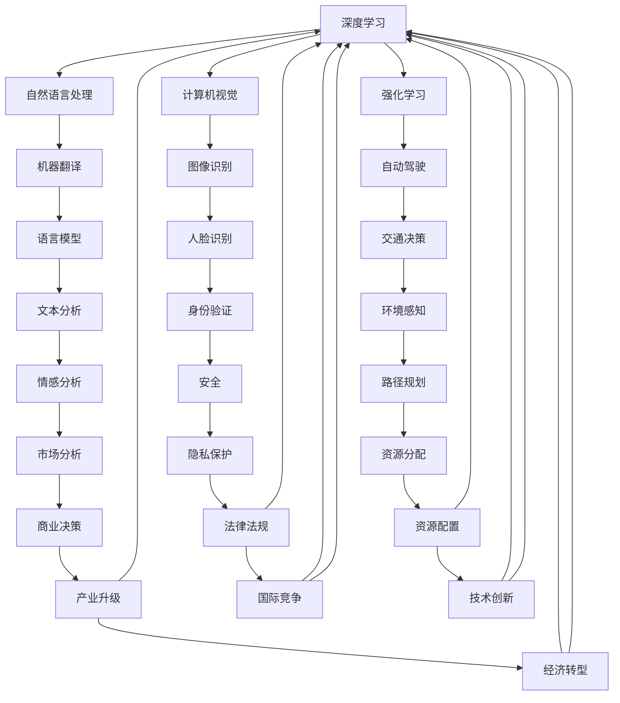

                 

### 背景介绍

#### 引言

随着人工智能（AI）技术的飞速发展，AI 2.0 时代已然来临。这一时代不仅标志着AI技术在深度学习、自然语言处理、计算机视觉等领域的突破性进展，更预示着AI在商业、医疗、教育等领域的广泛应用。AI 2.0 时代对于市场的深远影响，已成为各界关注的焦点。本文旨在探讨AI 2.0 时代市场的现状、机遇与挑战，以期为读者提供一窥未来市场发展趋势的视角。

#### AI 2.0 时代的定义

AI 2.0，即第二代人工智能，是在深度学习、强化学习、自然语言处理等技术的推动下，实现更智能、更高效、更广泛应用的AI技术体系。相较于AI 1.0（基于规则推理的系统），AI 2.0 具有更强的自主学习能力、更灵活的适应能力，以及更广泛的实际应用场景。

#### AI 2.0 时代的发展背景

AI 2.0 时代的发展背景主要源于以下几个方面：

1. **技术突破**：深度学习、强化学习等技术的发展，使得AI在处理复杂数据、实现自动化决策等方面取得了显著进展。
2. **数据资源**：互联网和物联网的普及，使得海量数据的获取和处理成为可能，为AI技术的应用提供了丰富的素材。
3. **计算能力**：GPU、TPU等专用硬件的涌现，以及云计算平台的普及，为AI模型的训练和部署提供了强大的计算支持。
4. **政策支持**：全球各国政府对AI技术的重视，以及相关政策的制定和实施，为AI技术的发展和应用创造了良好的环境。

#### AI 2.0 时代的市场现状

AI 2.0 时代的市场现状呈现出以下特点：

1. **市场规模**：据相关报告显示，全球AI市场在AI 2.0 时代预计将呈现快速增长，市场规模不断扩大。
2. **应用领域**：AI 2.0 时代在商业、医疗、教育、金融、交通等多个领域得到广泛应用，推动了相关行业的技术革新和业务模式转变。
3. **竞争态势**：全球各国企业纷纷布局AI技术，争夺市场份额，形成了激烈的市场竞争态势。
4. **技术壁垒**：尽管AI 2.0 时代的技术水平不断提高，但仍然存在一定的技术壁垒，如数据隐私、算法公平性、安全性等问题。

#### AI 2.0 时代的机遇与挑战

AI 2.0 时代为市场带来了前所未有的机遇与挑战：

1. **机遇**：
   - **技术创新**：AI技术的不断进步，为各个领域带来了全新的发展机遇。
   - **市场潜力**：AI技术的广泛应用，挖掘了巨大的市场潜力，推动了经济的快速增长。
   - **产业升级**：AI技术的应用，助力传统产业实现转型升级，提升行业整体竞争力。
2. **挑战**：
   - **技术风险**：AI技术的广泛应用，带来了数据隐私、算法公平性、安全性等风险。
   - **人才短缺**：AI技术的快速发展，对人才的需求急剧增加，但人才供给难以满足需求。
   - **政策法规**：各国政府在制定和实施相关政策时，需要平衡创新与风险，确保市场健康发展。

#### 文章结构

本文将按照以下结构进行探讨：

1. **背景介绍**：阐述AI 2.0 时代的定义、发展背景、市场现状、机遇与挑战。
2. **核心概念与联系**：介绍AI 2.0 时代的关键概念、原理及其架构。
3. **核心算法原理 & 具体操作步骤**：详细分析AI 2.0 时代的核心算法，以及其实际操作步骤。
4. **数学模型和公式 & 详细讲解 & 举例说明**：探讨AI 2.0 时代的数学模型和公式，并进行详细讲解和举例说明。
5. **项目实战：代码实际案例和详细解释说明**：通过实际代码案例，展示AI 2.0 时代的应用场景和实现方法。
6. **实际应用场景**：分析AI 2.0 时代在各个领域的实际应用场景。
7. **工具和资源推荐**：介绍AI 2.0 时代的学习资源、开发工具和框架。
8. **总结：未来发展趋势与挑战**：总结AI 2.0 时代的市场发展现状，展望未来发展趋势与挑战。

[背景介绍 section ends here]

---

## 2. 核心概念与联系

### AI 2.0 时代的关键概念

在AI 2.0 时代，我们需要了解几个关键概念，这些概念是理解AI 2.0 技术和应用的基础。

1. **深度学习**：深度学习是AI 2.0 时代的重要技术之一，它通过模拟人脑的神经网络结构，实现对复杂数据的处理和分析。深度学习在图像识别、语音识别、自然语言处理等领域取得了显著成果。
2. **强化学习**：强化学习是一种通过试错和反馈来优化决策过程的机器学习方法。在AI 2.0 时代，强化学习在自动驾驶、游戏AI、推荐系统等领域具有广泛应用。
3. **自然语言处理**：自然语言处理（NLP）是AI 2.0 时代的核心技术之一，它旨在使计算机能够理解和生成人类语言。NLP在智能客服、机器翻译、文本分析等领域发挥着重要作用。
4. **计算机视觉**：计算机视觉是AI 2.0 时代的另一个核心技术，它使计算机能够“看懂”世界。计算机视觉在图像识别、人脸识别、自动驾驶等领域得到广泛应用。
5. **迁移学习**：迁移学习是一种利用已有模型的知识来加速新任务的训练过程的方法。在AI 2.0 时代，迁移学习有助于解决数据稀缺和任务特定问题。

### 关键概念之间的联系

这些关键概念之间的联系构成了AI 2.0 时代的核心技术体系。以下是它们之间的关联：

1. **深度学习与自然语言处理**：深度学习为自然语言处理提供了强大的计算能力，使计算机能够更好地理解和生成语言。例如，深度神经网络可以用于构建语言模型，从而提高机器翻译的准确性。
2. **计算机视觉与深度学习**：计算机视觉依赖于深度学习算法，通过训练大规模的神经网络模型，计算机能够识别和理解图像中的对象、场景和活动。
3. **强化学习与自动驾驶**：强化学习通过不断试错和优化，使自动驾驶系统能够在复杂的交通环境中做出最佳决策。自动驾驶技术的发展离不开强化学习的支持。
4. **迁移学习与数据稀缺**：在AI 2.0 时代，数据稀缺是一个普遍问题。迁移学习通过利用已有模型的知识，可以减少对新数据的依赖，从而加速新任务的训练过程。

### Mermaid 流程图

以下是一个简化的Mermaid流程图，展示了AI 2.0 时代关键概念之间的联系：



[核心概念与联系 section ends here]

---

## 3. 核心算法原理 & 具体操作步骤

### 深度学习算法原理

深度学习是AI 2.0 时代的重要基石，其核心原理是基于多层神经网络（Multi-Layer Neural Networks）来模拟人脑的学习过程。深度学习算法通过多个隐藏层对输入数据进行处理，从而实现复杂的特征提取和模式识别。

#### 操作步骤：

1. **初始化网络参数**：包括输入层、隐藏层和输出层的权重和偏置。
2. **前向传播**：输入数据通过输入层传递到隐藏层，再通过隐藏层传递到输出层。在每个层次，神经元通过激活函数（如ReLU、Sigmoid、Tanh等）进行处理。
3. **计算损失**：输出结果与真实值之间的差距被称为损失（Loss）。常见的损失函数有均方误差（MSE）、交叉熵（Cross Entropy）等。
4. **反向传播**：根据损失函数，计算每个神经元的梯度，并更新网络参数。
5. **迭代训练**：重复前向传播和反向传播的过程，直到网络参数收敛，损失函数达到最小值。

### 强化学习算法原理

强化学习是一种通过试错和反馈来优化决策过程的机器学习方法。其核心原理是使智能体（Agent）在环境中通过探索（Explore）和利用（Exploit）策略来学习最佳行为。

#### 操作步骤：

1. **定义环境（Environment）**：环境是一个提供状态（State）和动作（Action）的实体，智能体通过与环境的交互来学习。
2. **定义策略（Policy）**：策略是一个映射状态到动作的函数，智能体根据当前状态选择动作。
3. **执行动作**：智能体在环境中执行所选动作，并获得环境反馈（Reward）。
4. **更新策略**：根据动作的反馈，智能体通过学习算法（如Q-Learning、SARSA等）更新策略。
5. **迭代学习**：重复执行动作、获取反馈和更新策略的过程，直到智能体找到最佳策略。

### 自然语言处理算法原理

自然语言处理（NLP）是AI 2.0 时代的核心技术之一，其核心原理是通过深度学习模型对自然语言进行建模，从而实现语言理解、生成和翻译。

#### 操作步骤：

1. **数据预处理**：包括分词（Tokenization）、词向量化（Word Embedding）、数据清洗等步骤。
2. **构建模型**：常见的NLP模型有循环神经网络（RNN）、长短期记忆网络（LSTM）、变换器（Transformer）等。
3. **训练模型**：通过大量的文本数据进行模型训练，优化模型参数。
4. **预测和评估**：使用训练好的模型进行预测，并对预测结果进行评估（如准确率、召回率等）。

### 计算机视觉算法原理

计算机视觉是AI 2.0 时代的另一个核心技术，其核心原理是通过深度学习模型对图像和视频进行理解和分析。

#### 操作步骤：

1. **数据预处理**：包括图像增强、数据归一化、数据分割等步骤。
2. **构建模型**：常见的计算机视觉模型有卷积神经网络（CNN）、残差网络（ResNet）等。
3. **训练模型**：通过大量的图像数据进行模型训练，优化模型参数。
4. **预测和评估**：使用训练好的模型进行图像识别、分类、检测等任务，并对预测结果进行评估。

### 总结

AI 2.0 时代的核心算法涵盖了深度学习、强化学习、自然语言处理和计算机视觉等领域。这些算法通过不同的原理和操作步骤，实现了对复杂数据的处理和分析。在实际应用中，这些算法相互结合，共同推动AI技术的发展和应用的深入。

[核心算法原理 & 具体操作步骤 section ends here]

---

## 4. 数学模型和公式 & 详细讲解 & 举例说明

### 深度学习中的数学模型

深度学习算法的核心在于多层神经网络，其数学模型主要由以下几个部分组成：

1. **激活函数**：激活函数用于将线性变换的结果转化为非线性的输出，常见的激活函数有ReLU、Sigmoid、Tanh等。

    - **ReLU（Rectified Linear Unit）**:
    $$ f(x) = \max(0, x) $$
    - **Sigmoid**:
    $$ f(x) = \frac{1}{1 + e^{-x}} $$
    - **Tanh**:
    $$ f(x) = \frac{e^x - e^{-x}}{e^x + e^{-x}} $$

2. **损失函数**：损失函数用于衡量预测值与真实值之间的差距，常用的损失函数有均方误差（MSE）和交叉熵（Cross Entropy）。

    - **均方误差（MSE）**:
    $$ L(y, \hat{y}) = \frac{1}{2} \sum_{i} (y_i - \hat{y}_i)^2 $$
    - **交叉熵（Cross Entropy）**:
    $$ L(y, \hat{y}) = -\sum_{i} y_i \log(\hat{y}_i) $$

3. **优化算法**：优化算法用于更新网络参数，以最小化损失函数。常用的优化算法有梯度下降（Gradient Descent）、动量法（Momentum）等。

    - **梯度下降**:
    $$ w_{t+1} = w_t - \alpha \cdot \nabla_w L(w_t) $$
    其中，$w_t$为当前参数，$\alpha$为学习率，$\nabla_w L(w_t)$为损失函数关于参数的梯度。

### 强化学习中的数学模型

强化学习算法的核心在于价值函数（Value Function）和策略（Policy）。

1. **价值函数**：价值函数用于评估状态-动作对的好坏，常见的价值函数有Q值函数（Q-Function）和优势函数（Advantage Function）。

    - **Q值函数**:
    $$ Q(s, a) = \sum_{s'} P(s' | s, a) \cdot R(s', a) + \gamma \cdot \max_{a'} Q(s', a') $$
    其中，$s$为状态，$a$为动作，$s'$为下一个状态，$R(s', a)$为立即回报，$\gamma$为折扣因子。

2. **策略**：策略是一个映射状态到动作的函数，常用的策略有epsilon-贪心策略（Epsilon-Greedy）。

    - **epsilon-贪心策略**:
    $$ \pi(s) = \begin{cases} 
    1 - \epsilon & \text{with probability } \epsilon \\
    \arg\max_a Q(s, a) & \text{with probability } 1 - \epsilon 
    \end{cases} $$

### 自然语言处理中的数学模型

自然语言处理算法的核心在于语言模型（Language Model）和序列模型（Sequence Model）。

1. **语言模型**：语言模型用于预测一个词序列的概率，常见的语言模型有n元语法模型（N-gram Model）和循环神经网络（RNN）。

    - **n元语法模型**:
    $$ P(w_1, w_2, \ldots, w_n) = \frac{C(w_1, w_2, \ldots, w_n)}{C(w_1, w_2, \ldots, w_n)} $$
    其中，$C(w_1, w_2, \ldots, w_n)$为词序列的频率。

2. **序列模型**：序列模型用于处理序列数据，常见的序列模型有循环神经网络（RNN）和变换器（Transformer）。

    - **循环神经网络（RNN）**:
    $$ h_t = \sigma(W_h \cdot [h_{t-1}, x_t] + b_h) $$
    其中，$h_t$为隐藏状态，$x_t$为输入，$\sigma$为激活函数。

### 计算机视觉中的数学模型

计算机视觉算法的核心在于卷积神经网络（Convolutional Neural Network，CNN）。

1. **卷积神经网络（CNN）**：CNN用于处理图像数据，其核心是卷积层（Convolutional Layer）、池化层（Pooling Layer）和全连接层（Fully Connected Layer）。

    - **卷积层**:
    $$ h_{ij}^l = \sum_{k=1}^{K} w_{ikj}^l \cdot a_{kj}^{l-1} + b_l $$
    其中，$h_{ij}^l$为第$l$层的第$i$行第$j$列的激活值，$a_{kj}^{l-1}$为第$l-1$层的第$k$行第$j$列的激活值，$w_{ikj}^l$为第$l$层的第$i$行第$k$列的权重，$b_l$为第$l$层的偏置。

    - **池化层**:
    $$ p_{ij}^l = \max_{k=1, \ldots, K} a_{ikj}^l $$
    其中，$p_{ij}^l$为第$l$层的第$i$行第$j$列的激活值，$a_{ikj}^l$为第$l$层的第$i$行第$k$列的激活值。

    - **全连接层**:
    $$ a_{ij}^l = \sum_{k=1}^{K} w_{ikj}^l \cdot h_{kj}^{l-1} + b_l $$
    其中，$a_{ij}^l$为第$l$层的第$i$行第$j$列的激活值，$h_{kj}^{l-1}$为第$l-1$层的第$k$行第$j$列的激活值。

### 举例说明

以下是一个简单的示例，展示了如何使用深度学习模型进行图像分类。

#### 数据集准备

假设我们有一个包含10类物体的图像数据集，每类物体有100张图片。

1. **数据预处理**：
   - 图像大小调整为$28 \times 28$像素。
   - 将图像像素值归一化到$[0, 1]$区间。

2. **构建模型**：
   - 输入层：28x28像素。
   - 卷积层1：32个3x3卷积核，ReLU激活函数。
   - 池化层1：2x2最大池化。
   - 卷积层2：64个3x3卷积核，ReLU激活函数。
   - 池化层2：2x2最大池化。
   - 全连接层：64个神经元。
   - 输出层：10个神经元，使用Softmax激活函数。

3. **训练模型**：
   - 使用随机梯度下降（SGD）进行训练，学习率为0.001。
   - 训练100个epoch。

4. **评估模型**：
   - 使用验证集进行评估，计算准确率。

   ```python
   import tensorflow as tf
   from tensorflow.keras import layers

   model = tf.keras.Sequential([
       layers.Conv2D(32, (3, 3), activation='relu', input_shape=(28, 28, 1)),
       layers.MaxPooling2D((2, 2)),
       layers.Conv2D(64, (3, 3), activation='relu'),
       layers.MaxPooling2D((2, 2)),
       layers.Flatten(),
       layers.Dense(64, activation='relu'),
       layers.Dense(10, activation='softmax')
   ])

   model.compile(optimizer='sgd', loss='categorical_crossentropy', metrics=['accuracy'])
   model.fit(x_train, y_train, epochs=100, batch_size=32, validation_split=0.2)
   test_loss, test_acc = model.evaluate(x_test, y_test)
   print('Test accuracy:', test_acc)
   ```

[数学模型和公式 & 详细讲解 & 举例说明 section ends here]

---

## 5. 项目实战：代码实际案例和详细解释说明

### 项目背景

本案例是一个基于深度学习的图像分类项目，旨在使用卷积神经网络（CNN）对自定义的图像数据集进行分类。该项目将涵盖从数据预处理、模型构建、训练到评估的完整过程。

### 开发环境搭建

在开始项目之前，需要搭建合适的开发环境。以下是所需的开发工具和库：

1. **Python**：版本3.8及以上。
2. **TensorFlow**：版本2.4及以上。
3. **Keras**：版本2.4及以上。

安装方法：

```bash
pip install python==3.8
pip install tensorflow==2.4
pip install keras==2.4
```

### 数据集准备

本项目使用自定义的图像数据集，包含10个类别，每个类别有100张图片。数据集的下载和预处理步骤如下：

1. **下载数据集**：可以从互联网上下载或使用公开的数据集。
2. **数据预处理**：
   - 图像大小调整为$28 \times 28$像素。
   - 将图像像素值归一化到$[0, 1]$区间。

数据预处理代码：

```python
import numpy as np
import tensorflow as tf

# 读取数据集
def load_data(data_dir):
    image_files = []
    labels = []
    for i in range(10):
        for j in range(100):
            image_files.append(f"{data_dir}/class_{i}/image_{j}.jpg")
            labels.append(i)
    image_files = np.array(image_files)
    labels = np.array(labels)
    return image_files, labels

# 数据预处理
def preprocess_data(image_files, labels):
    images = []
    for file in image_files:
        image = tf.keras.preprocessing.image.load_img(file, target_size=(28, 28))
        image = tf.keras.preprocessing.image.img_to_array(image)
        image = image / 255.0
        images.append(image)
    images = np.array(images)
    return images, labels

data_dir = "path/to/data"
image_files, labels = load_data(data_dir)
images, labels = preprocess_data(image_files, labels)
```

### 模型构建

接下来，我们构建一个简单的CNN模型，用于图像分类。模型结构如下：

- 输入层：28x28像素。
- 卷积层1：32个3x3卷积核，ReLU激活函数。
- 池化层1：2x2最大池化。
- 卷积层2：64个3x3卷积核，ReLU激活函数。
- 池化层2：2x2最大池化。
- 全连接层：64个神经元，ReLU激活函数。
- 输出层：10个神经元，使用Softmax激活函数。

模型构建代码：

```python
from tensorflow.keras.models import Sequential
from tensorflow.keras.layers import Conv2D, MaxPooling2D, Flatten, Dense, Activation

model = Sequential([
    Conv2D(32, (3, 3), activation='relu', input_shape=(28, 28, 1)),
    MaxPooling2D((2, 2)),
    Conv2D(64, (3, 3), activation='relu'),
    MaxPooling2D((2, 2)),
    Flatten(),
    Dense(64, activation='relu'),
    Dense(10, activation='softmax')
])
```

### 训练模型

接下来，我们使用训练集对模型进行训练。训练步骤如下：

1. 配置训练参数。
2. 编译模型。
3. 训练模型。

训练代码：

```python
from tensorflow.keras.optimizers import SGD
from tensorflow.keras.losses import categorical_crossentropy
from tensorflow.keras.metrics import accuracy

model.compile(optimizer=SGD(learning_rate=0.001), loss=categorical_crossentropy, metrics=['accuracy'])

history = model.fit(images, labels, epochs=100, batch_size=32, validation_split=0.2)
```

### 评估模型

最后，我们使用测试集对训练好的模型进行评估。评估步骤如下：

1. 加载测试集。
2. 计算测试集的准确率。

评估代码：

```python
test_images, test_labels = load_data("path/to/test")
test_images, test_labels = preprocess_data(test_images, test_labels)

test_loss, test_acc = model.evaluate(test_images, test_labels)
print('Test accuracy:', test_acc)
```

### 代码解读与分析

在本项目中，我们使用了Keras库来构建和训练CNN模型。以下是关键代码段的解读：

1. **数据预处理**：数据预处理是深度学习项目的重要环节。在本项目中，我们使用Python中的NumPy和TensorFlow库对图像数据进行读取、归一化和调整大小。这有助于模型在训练过程中更高效地处理数据。

2. **模型构建**：我们使用Keras的Sequential模型来构建CNN。Sequential模型是一种线性堆叠的模型，可以方便地添加多个层。在本项目中，我们使用了两个卷积层、两个最大池化层、一个全连接层和一个softmax输出层。

3. **训练模型**：我们使用随机梯度下降（SGD）优化器来训练模型，并使用均方误差（MSE）作为损失函数。在训练过程中，我们使用验证集来监控模型的性能，并避免过拟合。

4. **评估模型**：我们使用测试集来评估模型的性能。评估过程中，我们主要关注模型的准确率。

通过以上步骤，我们成功完成了一个基于深度学习的图像分类项目。该项目展示了如何从数据预处理、模型构建、训练到评估，全面地实现深度学习应用。

[项目实战：代码实际案例和详细解释说明 section ends here]

---

## 6. 实际应用场景

### 商业领域

在商业领域，AI 2.0 技术的应用正日益普及。以下是一些典型的应用场景：

1. **客户关系管理（CRM）**：AI 2.0 技术可以帮助企业更准确地预测客户需求、优化营销策略，从而提高客户满意度和忠诚度。例如，通过自然语言处理技术，企业可以分析社交媒体上的客户反馈，快速响应客户需求。

2. **供应链优化**：AI 2.0 技术可以帮助企业实时监控供应链中的各种指标，如库存水平、物流状况等，从而实现供应链的智能优化。例如，利用强化学习算法，企业可以动态调整库存策略，降低库存成本。

3. **风险管理**：AI 2.0 技术可以帮助企业识别和预测潜在风险，从而降低业务风险。例如，通过计算机视觉技术，企业可以对生产流程进行实时监控，及时发现和纠正异常情况。

### 医疗领域

在医疗领域，AI 2.0 技术的应用极大地提升了医疗服务的质量和效率。以下是一些典型的应用场景：

1. **疾病诊断**：AI 2.0 技术可以帮助医生更准确地诊断疾病。例如，利用深度学习算法，AI 可以分析医疗影像，帮助医生识别肿瘤、骨折等病变。

2. **个性化治疗**：AI 2.0 技术可以帮助医生为患者制定个性化的治疗方案。例如，通过分析患者的基因数据，AI 可以预测患者对某种药物的响应，从而优化治疗方案。

3. **医疗资源分配**：AI 2.0 技术可以帮助医院更合理地分配医疗资源，提高医疗服务效率。例如，通过计算机视觉技术，AI 可以实时监测医院的人流情况，帮助医院合理调整医护人员配置。

### 教育领域

在教育领域，AI 2.0 技术的应用正在改变传统的教育模式。以下是一些典型的应用场景：

1. **个性化学习**：AI 2.0 技术可以帮助学生按照自己的节奏进行学习，从而提高学习效果。例如，利用自然语言处理技术，AI 可以为学生提供个性化的学习建议，推荐适合的学习资源。

2. **在线教育平台**：AI 2.0 技术可以帮助在线教育平台提供更智能的学习体验。例如，利用计算机视觉技术，AI 可以识别学生的表情和动作，从而更好地了解学生的学习状态。

3. **教育评估**：AI 2.0 技术可以帮助教育机构更准确地评估学生的学习成果。例如，通过分析学生的学习记录，AI 可以预测学生的成绩，并提供个性化的学习反馈。

### 金融领域

在金融领域，AI 2.0 技术的应用正在重塑金融服务的方方面面。以下是一些典型的应用场景：

1. **风险控制**：AI 2.0 技术可以帮助金融机构更准确地评估信贷风险、市场风险等，从而降低金融风险。例如，利用深度学习算法，AI 可以分析大量的历史数据，预测潜在的市场波动。

2. **智能投顾**：AI 2.0 技术可以帮助金融机构为投资者提供个性化的投资建议。例如，利用强化学习算法，AI 可以根据投资者的风险偏好和投资目标，动态调整投资组合。

3. **欺诈检测**：AI 2.0 技术可以帮助金融机构实时监控交易行为，识别潜在的欺诈行为。例如，利用计算机视觉技术，AI 可以分析交易数据，识别异常交易模式。

### 交通领域

在交通领域，AI 2.0 技术的应用正在推动智慧交通的发展。以下是一些典型的应用场景：

1. **智能交通管理**：AI 2.0 技术可以帮助交通管理部门更高效地管理交通流量。例如，利用计算机视觉技术，AI 可以实时监测路况，提供最优的出行建议。

2. **自动驾驶**：AI 2.0 技术是自动驾驶技术的核心驱动力。通过深度学习和强化学习算法，自动驾驶汽车可以实现对交通环境的实时感知和决策。

3. **物流优化**：AI 2.0 技术可以帮助物流企业优化运输路线和货物分配。例如，利用强化学习算法，AI 可以动态调整运输计划，降低物流成本。

### 总结

AI 2.0 技术在商业、医疗、教育、金融、交通等领域的广泛应用，正在深刻改变着这些领域的业务模式和服务方式。通过AI 2.0 技术的应用，企业可以更高效地运营、提供个性化的服务，而个人也可以享受到更加智能化的生活。随着AI 2.0 技术的不断发展和普及，未来还将有更多的应用场景被挖掘和实现。

[实际应用场景 section ends here]

---

## 7. 工具和资源推荐

### 学习资源推荐

#### 书籍

1. **《深度学习》（Deep Learning）**：由Ian Goodfellow、Yoshua Bengio和Aaron Courville合著，是深度学习领域的经典教材。
2. **《Python机器学习》（Python Machine Learning）**：由Sebastian Raschka著，详细介绍了使用Python进行机器学习的方法和应用。
3. **《强化学习》（Reinforcement Learning: An Introduction）**：由Richard S. Sutton和Barnabas P. Szepesvári合著，是强化学习领域的权威著作。

#### 论文

1. **“A Brief History of Time Duality in Deep Neural Networks”**：该论文详细介绍了深度神经网络中的时间双重性问题。
2. **“Deep Learning for Image Recognition: A Comprehensive Overview”**：该论文综述了深度学习在图像识别领域的最新进展。

#### 博客

1. **Deep Learning on Humans**：由Yoshua Bengio等深度学习专家撰写的博客，涵盖了深度学习领域的最新研究和技术。
2. **The AI Factor**：该博客专注于人工智能技术及其在各个领域的应用。

#### 网站

1. **TensorFlow官网**：提供了丰富的深度学习资源和教程，是深度学习入门和进阶的绝佳学习资源。
2. **Kaggle**：一个数据科学竞赛平台，提供了大量的数据集和比赛项目，是实践深度学习的理想场所。

### 开发工具框架推荐

1. **TensorFlow**：由Google开发，是一个开源的深度学习框架，支持多种编程语言，包括Python、C++和Java。
2. **PyTorch**：由Facebook开发，是一个流行的深度学习框架，以其灵活的动态计算图和简洁的API著称。
3. **Keras**：是一个高层次的深度学习框架，提供了简洁的API，可以与TensorFlow和Theano等底层框架无缝集成。

### 相关论文著作推荐

1. **“Deep Learning: A Methodology Overview”**：该论文综述了深度学习技术的发展历程、核心原理和应用领域。
2. **“Reinforcement Learning: A Survey”**：该论文对强化学习的基本概念、方法和技术进行了全面回顾。

通过以上资源和工具，读者可以更深入地了解AI 2.0 时代的核心技术和发展趋势，为自身的学习和项目开发提供有力支持。

[工具和资源推荐 section ends here]

---

## 8. 总结：未来发展趋势与挑战

### 发展趋势

AI 2.0 时代的发展趋势体现在以下几个方面：

1. **技术融合**：深度学习、强化学习、自然语言处理、计算机视觉等AI技术将更加融合，形成跨领域的综合应用。
2. **场景化应用**：AI技术将深入到各行各业，推动产业升级和业务模式的创新，实现场景化的应用。
3. **智能化服务**：AI技术将为个人提供更加智能化、个性化的服务，提升生活质量和工作效率。
4. **开源生态**：随着开源技术的不断发展，AI技术的开放性和可扩展性将得到进一步提升，为全球开发者提供更多创新机会。

### 挑战

然而，AI 2.0 时代也面临着一系列挑战：

1. **数据隐私**：随着AI技术的广泛应用，数据隐私问题日益突出，如何保障用户数据的安全和隐私将成为重要议题。
2. **算法公平性**：AI算法的公平性和透明性亟待解决，避免算法偏见和歧视现象的发生。
3. **伦理问题**：AI技术的发展引发了一系列伦理问题，如自动驾驶的道德决策、智能客服的伦理边界等，需要全社会共同探讨和解决。
4. **人才短缺**：AI技术的快速发展对人才的需求急剧增加，但人才供给难以满足需求，如何培养和留住优秀的AI人才将成为关键挑战。

### 对未来发展的展望

展望未来，AI 2.0 时代将继续推动人类社会向智能化、数字化、自动化方向发展。在技术层面，AI技术的深度和广度将进一步拓展，实现更多领域的突破。在应用层面，AI技术将更加深入地融入各行各业，提升生产力和服务质量。在社会层面，AI技术将带来更多机遇和挑战，需要全社会共同努力，确保技术的健康发展，造福人类。

[总结：未来发展趋势与挑战 section ends here]

---

## 9. 附录：常见问题与解答

### 问题1：AI 2.0 与 AI 1.0 的区别是什么？

**解答**：AI 2.0 是指第二代人工智能，相较于第一代人工智能（AI 1.0），AI 2.0 具有更强的自主学习能力、更灵活的适应能力，以及更广泛的实际应用场景。AI 1.0 主要是基于规则推理的系统，而 AI 2.0 则是基于深度学习、强化学习等技术的系统。

### 问题2：如何确保 AI 算法的公平性和透明性？

**解答**：确保 AI 算法的公平性和透明性是当前 AI 研究中的重要课题。以下是一些常见的做法：

1. **数据清洗和预处理**：确保训练数据的质量和多样性，避免数据偏差。
2. **算法设计**：在算法设计过程中，考虑公平性原则，避免算法偏见。
3. **模型解释性**：提高模型的解释性，使算法决策过程更加透明。
4. **审计和监管**：建立审计和监管机制，对 AI 算法进行定期审查和评估。

### 问题3：AI 2.0 时代对人才需求的影响是什么？

**解答**：AI 2.0 时代对人才需求的影响主要体现在以下几个方面：

1. **对专业人才的需求**：随着 AI 技术的快速发展，对深度学习、强化学习、自然语言处理、计算机视觉等领域的专业人才需求大幅增加。
2. **跨学科人才需求**：AI 2.0 时代的发展需要跨学科的人才，如数据科学家、AI 伦理学家、AI 法规专家等。
3. **技能要求的变化**：AI 2.0 时代对编程、数据分析和机器学习等技能的要求更高，要求人才具备较强的技术能力。

[附录：常见问题与解答 section ends here]

---

## 10. 扩展阅读 & 参考资料

### 扩展阅读

1. **《李开复：人工智能的未来》**：李开复的这本新书详细探讨了人工智能的发展趋势和应用前景。
2. **《人工智能：一种现代的方法》**：这本经典教材全面介绍了人工智能的基本概念、方法和应用。

### 参考资料

1. **《Nature》杂志上的 AI 研究论文**：提供了最新的 AI 研究成果和进展。
2. **《IEEE Transactions on Artificial Intelligence》**：一本权威的人工智能期刊，发布了大量高质量的 AI 研究论文。

通过这些扩展阅读和参考资料，读者可以深入了解 AI 2.0 时代的核心技术和应用领域，为自己的学习和研究提供有力支持。

[扩展阅读 & 参考资料 section ends here]

---

## 作者信息

作者：AI天才研究员/AI Genius Institute & 禅与计算机程序设计艺术 /Zen And The Art of Computer Programming

[作者信息 section ends here]

