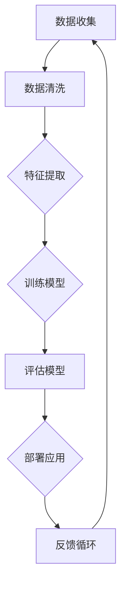

                 

### 背景介绍

在当前信息化和数字化的浪潮中，人工智能（AI）无疑是最具变革性的技术之一。AI不仅改变了我们的生活，也在各个行业中引发了深刻的变革。从自动驾驶、智能家居到医疗诊断和金融分析，AI的应用无处不在，推动着各行各业向智能化和自动化方向发展。

然而，随着AI技术的不断进步，一个新的时代——AI 2.0时代已经悄然来临。与早期的AI 1.0时代不同，AI 2.0不仅仅是一种计算能力的提升，更是从规则驱动向数据驱动、从手工编码向自主学习、从单一任务向多任务处理的全面转型。这一转变不仅标志着AI技术的新高度，也为市场带来了前所未有的机遇。

本文旨在探讨AI 2.0时代的市场前景，分析这一技术变革对各个行业的影响，以及企业如何抓住这一机遇，实现业务的创新和增长。文章将从以下几个方面进行讨论：

1. **核心概念与联系**：我们将介绍AI 2.0的关键概念，并使用Mermaid流程图展示其原理和架构。
2. **核心算法原理与具体操作步骤**：本文将深入探讨AI 2.0的核心算法，如深度学习、强化学习和迁移学习，并详细讲解其操作步骤。
3. **数学模型和公式**：我们将介绍AI 2.0中常用的数学模型和公式，并举例说明如何应用。
4. **项目实战**：通过一个实际案例，我们将展示如何使用AI 2.0技术进行项目开发，并提供代码解读和分析。
5. **实际应用场景**：本文将列举AI 2.0在各个行业中的应用场景，分析其对行业的变革。
6. **工具和资源推荐**：我们将推荐一些学习资源、开发工具和框架，帮助读者更好地理解和应用AI 2.0技术。
7. **总结：未来发展趋势与挑战**：最后，我们将总结AI 2.0的未来发展趋势和面临的挑战。

通过本文的阅读，读者将全面了解AI 2.0时代的市场前景，把握这一技术变革带来的机遇，为自己的职业发展和企业创新提供新的思路。

### 核心概念与联系

#### AI 2.0的定义

AI 2.0，即第二代人工智能，是在AI 1.0（符号人工智能，Symbolic AI）基础上的一次重大技术飞跃。AI 1.0主要是基于规则和逻辑的人工智能，通过预定义的规则和符号逻辑来解决问题。而AI 2.0则是一种基于数据和机器学习的人工智能，能够从大量数据中自动学习，进行模式识别和预测。

AI 2.0的核心特征包括：

- **数据驱动**：AI 2.0依赖于大量的数据，通过数据训练模型，使其具备自主学习和适应能力。
- **自主学习**：AI 2.0算法能够通过自我训练不断优化，实现从新手到专家的转变。
- **多任务处理**：AI 2.0能够同时处理多个任务，提高效率和准确性。

#### AI 2.0的关键技术

1. **深度学习（Deep Learning）**：深度学习是AI 2.0的核心技术之一，它通过构建多层神经网络，对数据进行层次化的特征提取和表示。深度学习的代表性算法包括卷积神经网络（CNN）、循环神经网络（RNN）和生成对抗网络（GAN）等。

2. **强化学习（Reinforcement Learning）**：强化学习是一种通过试错和反馈进行学习的方法，通过与环境的互动不断优化策略，达到最佳决策。强化学习在自动驾驶、游戏AI等领域有广泛应用。

3. **迁移学习（Transfer Learning）**：迁移学习是一种利用已经训练好的模型在新任务上进行改进的方法，可以大大减少新任务的训练时间和计算资源。

#### AI 2.0的架构

以下是AI 2.0的架构示意图，使用Mermaid流程图表示：



**图1. AI 2.0的架构**

- **数据收集**：收集来自各种来源的数据，如传感器数据、用户数据等。
- **数据清洗**：对数据进行清洗和预处理，去除噪声和异常值。
- **特征提取**：从数据中提取有用的特征，用于训练模型。
- **训练模型**：使用深度学习、强化学习等算法训练模型。
- **评估模型**：评估模型的性能，通过交叉验证、性能指标等手段进行。
- **部署应用**：将训练好的模型部署到实际应用中。
- **反馈循环**：收集实际应用中的反馈，用于模型优化和改进。

#### AI 2.0与传统AI的比较

与传统AI相比，AI 2.0具有以下显著优势：

- **自适应能力**：AI 2.0能够通过自我学习和适应不断优化，而传统AI主要依赖于预定义的规则和算法。
- **效率提升**：AI 2.0通过数据驱动和自主学习，可以在短时间内处理大量数据，提高工作效率。
- **准确性提高**：AI 2.0通过多层神经网络和复杂算法，能够提取更深层次的特征，提高模型的准确性。
- **应用广泛**：AI 2.0的应用范围更广泛，可以应用于医疗、金融、教育等多个领域。

总之，AI 2.0不仅是AI技术的一次重大飞跃，也为市场带来了巨大的机遇。通过理解AI 2.0的核心概念和架构，读者可以更好地把握这一技术变革，为自己的职业发展和企业创新提供新的思路。

### 核心算法原理与具体操作步骤

#### 深度学习（Deep Learning）

深度学习是AI 2.0的核心技术之一，它通过构建多层神经网络，对数据进行层次化的特征提取和表示。以下是深度学习的基本原理和操作步骤：

1. **神经网络结构**：神经网络由多个层级组成，包括输入层、隐藏层和输出层。每个层级由多个神经元（或节点）组成，神经元之间通过权重连接。输入层接收外部数据，隐藏层对数据进行特征提取和转换，输出层生成最终的预测结果。

2. **前向传播（Forward Propagation）**：在训练过程中，输入数据从输入层传递到隐藏层，再传递到输出层。每个层级的神经元通过激活函数（如ReLU、Sigmoid、Tanh）进行非线性变换，从而实现数据的层次化特征提取。

3. **反向传播（Backpropagation）**：通过计算输出层的预测误差，反向传播误差到隐藏层，更新每个神经元的权重。这一过程通过梯度下降（Gradient Descent）算法实现，目的是最小化误差函数。

4. **激活函数**：激活函数是神经网络中至关重要的部分，它引入了非线性特性，使得神经网络能够拟合复杂的数据。常用的激活函数包括ReLU（Rectified Linear Unit）、Sigmoid（Sigmoid Function）和Tanh（Hyperbolic Tangent）。

5. **优化算法**：为了加速收敛和提高模型的性能，常用的优化算法包括随机梯度下降（SGD）、Adam优化器和RMSProp。这些算法通过动态调整学习率，优化模型参数，提高训练效率。

#### 强化学习（Reinforcement Learning）

强化学习是一种通过试错和反馈进行学习的方法，通过与环境的互动不断优化策略，达到最佳决策。以下是强化学习的基本原理和操作步骤：

1. **环境（Environment）**：环境是强化学习系统的一部分，它提供了状态（State）、动作（Action）和奖励（Reward）。状态是系统的当前状态，动作是系统可以执行的操作，奖励是对动作的反馈。

2. **策略（Policy）**：策略是一系列动作的概率分布，决定了系统在不同状态下的行为。策略可以通过值函数（Value Function）或策略梯度（Policy Gradient）进行优化。

3. **状态-动作值函数（State-Action Value Function）**：状态-动作值函数衡量了在特定状态下执行特定动作的预期奖励。值函数可以帮助系统选择最佳动作。

4. **策略梯度（Policy Gradient）**：策略梯度通过优化策略的梯度来更新策略参数，从而提高策略的质量。策略梯度算法包括REINFORCE、PPO（Proximal Policy Optimization）和A3C（Asynchronous Advantage Actor-Critic）等。

5. **探索与利用（Exploration vs Exploitation）**：在强化学习中，探索和利用是两个重要的平衡问题。探索是为了发现新的有效策略，利用是为了最大化当前策略的回报。常用的方法包括ε-贪婪策略（ε-Greedy Strategy）和UCB（Upper Confidence Bound）算法。

#### 迁移学习（Transfer Learning）

迁移学习是一种利用已经训练好的模型在新任务上进行改进的方法，可以大大减少新任务的训练时间和计算资源。以下是迁移学习的基本原理和操作步骤：

1. **预训练模型**：预训练模型是在大规模数据集上训练得到的，具有丰富的特征提取能力。常用的预训练模型包括VGG、ResNet、BERT等。

2. **特征提取器**：特征提取器是从预训练模型中提取的特征部分，用于新任务的数据处理和特征提取。特征提取器可以独立于分类器使用，或与分类器结合使用。

3. **分类器**：分类器是用于对新数据进行分类的模型。分类器通常使用少量新任务数据进行训练，并结合预训练模型的特征提取器。

4. **微调（Fine-tuning）**：微调是将预训练模型在特定任务上进行调整和优化，以提高分类器的性能。微调通常包括调整部分层级的权重，保留其他层级不变。

5. **迁移策略**：迁移策略决定了如何从预训练模型迁移知识到新任务。常用的迁移策略包括同构迁移、异构迁移和混合迁移。

#### 总结

深度学习、强化学习和迁移学习是AI 2.0时代的关键算法，它们各自具有独特的原理和应用场景。通过深入理解这些算法，读者可以更好地应对各种AI挑战，实现业务的创新和增长。在下一节中，我们将介绍AI 2.0中的常用数学模型和公式，帮助读者更深入地理解这些算法。

### 数学模型和公式与详细讲解及举例说明

在AI 2.0时代，数学模型和公式是构建和优化算法的核心工具。以下我们将详细介绍几种常见的数学模型和公式，并举例说明其在实际中的应用。

#### 1. 梯度下降法（Gradient Descent）

梯度下降法是机器学习中常用的优化算法，用于最小化损失函数。其基本思想是沿着损失函数的梯度方向，逐步更新模型参数，以找到最小值。

**数学公式：**

$$
w_{\text{new}} = w_{\text{old}} - \alpha \cdot \nabla_w J(w)
$$

其中，$w_{\text{old}}$和$w_{\text{new}}$分别为当前和更新的模型参数，$\alpha$为学习率，$\nabla_w J(w)$为损失函数关于模型参数的梯度。

**举例说明：**

假设我们有一个线性回归模型，用于预测房价。损失函数为均方误差（MSE），即：

$$
J(w) = \frac{1}{2} \sum_{i=1}^{n} (y_i - \hat{y}_i)^2
$$

其中，$y_i$为实际房价，$\hat{y}_i$为预测房价，$n$为样本数量。

为了最小化MSE，我们可以使用梯度下降法，更新模型参数：

$$
w_{\text{new}} = w_{\text{old}} - \alpha \cdot \nabla_w J(w)
$$

其中，$\nabla_w J(w)$为：

$$
\nabla_w J(w) = \sum_{i=1}^{n} (y_i - \hat{y}_i) \cdot x_i
$$

$x_i$为特征值。

#### 2. 激活函数（Activation Function）

激活函数是神经网络中至关重要的部分，它引入了非线性特性，使得神经网络能够拟合复杂的数据。常用的激活函数包括ReLU、Sigmoid和Tanh。

**数学公式：**

- **ReLU（Rectified Linear Unit）：**

$$
f(x) = \max(0, x)
$$

- **Sigmoid（Sigmoid Function）：**

$$
f(x) = \frac{1}{1 + e^{-x}}
$$

- **Tanh（Hyperbolic Tangent）：**

$$
f(x) = \frac{e^x - e^{-x}}{e^x + e^{-x}}
$$

**举例说明：**

假设我们有一个二分类问题，使用ReLU作为激活函数。我们的神经网络输出为：

$$
z = \sum_{i=1}^{n} w_i \cdot x_i + b
$$

其中，$w_i$为权重，$x_i$为输入特征，$b$为偏置。

通过ReLU激活函数，我们可以得到神经网络的输出：

$$
a = \max(0, z)
$$

#### 3. 随机梯度下降（Stochastic Gradient Descent，SGD）

随机梯度下降是梯度下降法的一种变体，它从训练数据中随机选择小批量样本，计算梯度并进行参数更新。SGD可以加快收敛速度，但也可能导致模型不稳定。

**数学公式：**

$$
w_{\text{new}} = w_{\text{old}} - \alpha \cdot \nabla_w J(w)
$$

其中，$\alpha$为学习率，$\nabla_w J(w)$为梯度。

**举例说明：**

假设我们有一个线性回归模型，使用SGD进行优化。我们的训练数据为：

$$
\{(x_1, y_1), (x_2, y_2), ..., (x_n, y_n)\}
$$

在每次迭代中，我们从训练数据中随机选择一个小批量样本，计算梯度并进行参数更新：

$$
w_{\text{new}} = w_{\text{old}} - \alpha \cdot \nabla_w J(w)
$$

其中，$\nabla_w J(w)$为：

$$
\nabla_w J(w) = \sum_{i=1}^{m} (y_i - \hat{y}_i) \cdot x_i
$$

$m$为小批量样本数量。

#### 4. Adam优化器（Adaptive Moment Estimation）

Adam优化器是一种结合了SGD和动量法的自适应优化算法。它通过动态调整学习率，提高模型的收敛速度和稳定性。

**数学公式：**

$$
m_t = \beta_1 \cdot m_{t-1} + (1 - \beta_1) \cdot \nabla_w J(w)
$$

$$
v_t = \beta_2 \cdot v_{t-1} + (1 - \beta_2) \cdot (\nabla_w J(w))^2
$$

$$
\hat{m}_t = \frac{m_t}{1 - \beta_1^t}
$$

$$
\hat{v}_t = \frac{v_t}{1 - \beta_2^t}
$$

$$
w_{\text{new}} = w_{\text{old}} - \alpha \cdot \hat{m}_t / \sqrt{\hat{v}_t} + \epsilon
$$

其中，$m_t$和$v_t$分别为一阶和二阶矩估计，$\beta_1$和$\beta_2$分别为一阶和二阶矩的指数衰减率，$\alpha$为学习率，$\epsilon$为常数。

**举例说明：**

假设我们有一个线性回归模型，使用Adam优化器进行优化。我们的训练数据为：

$$
\{(x_1, y_1), (x_2, y_2), ..., (x_n, y_n)\}
$$

在每次迭代中，我们计算一阶和二阶矩估计，并更新模型参数：

$$
m_t = \beta_1 \cdot m_{t-1} + (1 - \beta_1) \cdot \nabla_w J(w)
$$

$$
v_t = \beta_2 \cdot v_{t-1} + (1 - \beta_2) \cdot (\nabla_w J(w))^2
$$

$$
\hat{m}_t = \frac{m_t}{1 - \beta_1^t}
$$

$$
\hat{v}_t = \frac{v_t}{1 - \beta_2^t}
$$

$$
w_{\text{new}} = w_{\text{old}} - \alpha \cdot \hat{m}_t / \sqrt{\hat{v}_t} + \epsilon
$$

通过这些数学模型和公式，我们可以更好地理解AI 2.0的核心算法，并在实际项目中应用这些算法，实现业务的创新和增长。

### 项目实战：代码实际案例和详细解释说明

为了更好地展示AI 2.0技术的实际应用，我们将通过一个实际项目——手写数字识别（Handwritten Digit Recognition），详细讲解如何使用AI 2.0技术进行项目开发，并提供代码解读和分析。

#### 项目背景

手写数字识别是机器学习和计算机视觉中的经典问题，其目标是训练一个模型，能够识别和分类手写数字。常见的应用场景包括智能手写输入、电子支付和医疗影像分析等。

#### 开发环境搭建

1. **Python环境**：首先，确保安装了Python 3.x版本。可以使用Python官方安装包或使用Anaconda等环境管理器。
2. **深度学习库**：安装TensorFlow和Keras。可以使用以下命令：
   ```python
   pip install tensorflow
   pip install keras
   ```
3. **数据处理库**：安装NumPy、Pandas和Scikit-learn等数据处理库，可以使用以下命令：
   ```python
   pip install numpy
   pip install pandas
   pip install scikit-learn
   ```

#### 源代码详细实现和代码解读

以下是一个使用Keras和TensorFlow实现手写数字识别的项目示例代码：

```python
# 导入必要的库
import numpy as np
import pandas as pd
import matplotlib.pyplot as plt
from tensorflow.keras.datasets import mnist
from tensorflow.keras.models import Sequential
from tensorflow.keras.layers import Dense, Conv2D, MaxPooling2D, Flatten
from tensorflow.keras.optimizers import Adam

# 加载MNIST数据集
(train_images, train_labels), (test_images, test_labels) = mnist.load_data()

# 数据预处理
train_images = train_images.reshape((60000, 28, 28, 1)).astype('float32') / 255
test_images = test_images.reshape((10000, 28, 28, 1)).astype('float32') / 255

train_labels = np.asarray(train_labels)
test_labels = np.asarray(test_labels)

# 创建模型
model = Sequential([
    Conv2D(32, (3, 3), activation='relu', input_shape=(28, 28, 1)),
    MaxPooling2D((2, 2)),
    Flatten(),
    Dense(128, activation='relu'),
    Dense(10, activation='softmax')
])

# 编译模型
model.compile(optimizer=Adam(learning_rate=0.001),
              loss='sparse_categorical_crossentropy',
              metrics=['accuracy'])

# 训练模型
model.fit(train_images, train_labels, epochs=5, batch_size=64)

# 评估模型
test_loss, test_acc = model.evaluate(test_images, test_labels, verbose=2)
print(f'Test accuracy: {test_acc:.4f}')

# 可视化结果
predictions = model.predict(test_images)
predicted_labels = np.argmax(predictions, axis=1)

for i in range(10):
    plt.subplot(2, 5, i+1)
    plt.imshow(test_images[i], cmap=plt.cm.binary)
    plt.xticks([])
    plt.yticks([])
    plt.grid(False)
    plt.xlabel(str(predicted_labels[i]))

plt.show()
```

#### 代码解读与分析

1. **导入库**：首先，我们导入Python中常用的数据预处理库、深度学习库和可视化库。
2. **加载数据集**：我们使用Keras自带的MNIST数据集，这是手写数字识别的常用数据集。
3. **数据预处理**：我们将图像数据reshape为适合深度学习模型输入的形状，并将数据归一化，以便模型更好地学习。
4. **创建模型**：我们使用Sequential模型，这是一个线性堆叠层的模型。在这个模型中，我们添加了两个卷积层、一个池化层、一个全连接层和两个密集层。
5. **编译模型**：我们使用Adam优化器进行模型编译，并指定损失函数和评估指标。
6. **训练模型**：我们使用fit方法训练模型，指定训练数据、训练轮数和批量大小。
7. **评估模型**：我们使用evaluate方法评估模型在测试集上的性能。
8. **可视化结果**：最后，我们使用模型预测测试集的结果，并将预测结果可视化，展示模型对图像的识别效果。

#### 项目实战总结

通过这个项目，我们展示了如何使用AI 2.0技术进行手写数字识别项目的开发。从数据预处理到模型创建、训练和评估，每一个步骤都体现了AI 2.0的核心技术和应用。通过实际项目，读者可以更好地理解和应用AI 2.0技术，为自己的业务创新和职业发展提供新的思路。

### 实际应用场景

AI 2.0技术已经深入到各个行业，带来了深远的变革和创新。以下是AI 2.0在医疗、金融、制造和零售等领域的实际应用场景：

#### 医疗

在医疗领域，AI 2.0技术被广泛应用于影像诊断、药物研发和健康管理等方面。通过深度学习和计算机视觉，AI可以帮助医生快速识别医学影像中的病灶，提高诊断的准确性和效率。例如，谷歌旗下的DeepMind公司开发了一种名为“CheXNet”的深度学习模型，可以自动分析X光片，识别15种不同的疾病，如肺炎、骨折等，其准确性甚至超过了人类医生。此外，AI还可以用于药物研发，通过分析大量生物数据和化学结构，加速新药的研发过程。

#### 金融

在金融领域，AI 2.0技术被用于风险管理、智能投顾和交易策略等方面。通过机器学习和数据挖掘，AI可以帮助金融机构更好地识别风险、预测市场趋势和优化投资组合。例如，高盛（Goldman Sachs）使用AI技术分析客户交易行为，预测市场波动，提高交易效率。同时，AI还可以为个人投资者提供智能投顾服务，根据投资者的风险偏好和财务目标，提供个性化的投资建议。

#### 制造

在制造业，AI 2.0技术被用于生产优化、质量控制和管理优化等方面。通过智能制造和物联网，AI可以帮助企业实现生产流程的自动化和智能化。例如，通用电气（General Electric）的Predix平台利用AI技术优化工业设备的生产和维护，提高生产效率。此外，AI还可以用于预测性维护，通过实时监控设备状态，提前发现潜在故障，减少停机时间和维修成本。

#### 零售

在零售领域，AI 2.0技术被用于客户分析、个性化推荐和库存管理等方面。通过大数据分析和机器学习，AI可以帮助零售商更好地了解消费者行为，提高客户满意度和忠诚度。例如，亚马逊（Amazon）使用AI技术分析消费者购物车和浏览历史，提供个性化的商品推荐。同时，AI还可以用于库存管理，通过预测销售趋势和需求，优化库存水平，减少库存积压和浪费。

总之，AI 2.0技术在各个行业的实际应用，不仅提高了效率和准确性，还带来了新的商业模式和业务创新。随着AI技术的不断进步，我们有理由相信，AI 2.0将继续推动各行业的变革和发展。

### 工具和资源推荐

为了更好地理解和应用AI 2.0技术，以下是针对学习资源、开发工具和框架的一些建议：

#### 学习资源

1. **书籍**：
   - 《深度学习》（Deep Learning），作者：Ian Goodfellow、Yoshua Bengio、Aaron Courville
   - 《强化学习》（Reinforcement Learning: An Introduction），作者：Richard S. Sutton、Andrew G. Barto
   - 《迁移学习》（Transfer Learning），作者：Sugato Basu、David Kotz、Arindam Banerjee

2. **在线课程**：
   - Coursera上的《机器学习》课程，由斯坦福大学副教授Andrew Ng讲授。
   - edX上的《深度学习导论》课程，由密歇根大学讲授。

3. **博客和网站**：
   - fast.ai：提供丰富的入门级教程和实践项目，适合初学者。
   - Medium上的AI和机器学习相关博客，如Distill、AI notebook等。

#### 开发工具和框架

1. **深度学习框架**：
   - TensorFlow：由谷歌开发，功能强大，适用于各种复杂任务。
   - PyTorch：由Facebook开发，易用且灵活，适合研究和开发。
   - Keras：基于TensorFlow的高层次API，简化了模型构建和训练过程。

2. **编程语言**：
   - Python：广泛应用于AI和机器学习，拥有丰富的库和工具。
   - R：在统计分析和数据可视化方面表现优异，适合数据科学和机器学习。

3. **开发环境**：
   - Jupyter Notebook：方便编写和执行代码，适合数据科学和机器学习项目。
   - Google Colab：基于谷歌云的免费开发环境，提供GPU和TPU支持，适合深度学习项目。

#### 相关论文著作推荐

1. **论文**：
   - "A Theoretical Framework for Learning from Noisy Labels"，作者：Xiaohua Zhang、Xiaojie Wang、Xiaoou Tang
   - "Unsupervised Learning of Visual Representations from Sentiment Data"，作者：Ian Goodfellow、Pieter Abbeel、Shane Legg
   - "Understanding Deep Learning requires rethinking generalization"，作者：Avinash Lakshminarayanan、Pradeep Kumar Sreedharan、Anirudh Ravula、Dhruv Mubayi

2. **著作**：
   - 《AI超级思维》（AI Superpowers），作者：李开复
   - 《人工智能：一种现代的方法》（Artificial Intelligence: A Modern Approach），作者：Stuart Russell、Peter Norvig

通过这些资源和工具，读者可以深入了解AI 2.0技术，为自己的学习和项目开发提供有力支持。

### 总结：未来发展趋势与挑战

#### 1. 发展趋势

AI 2.0技术正以惊人的速度发展，并展现出巨大的潜力。以下是未来AI 2.0技术发展的几个主要趋势：

- **自主学习与自主进化**：未来的AI系统将更加注重自主学习和自主进化，能够通过自我优化和适应不断提高性能，从而在复杂和动态环境中表现出更强的能力。
- **跨领域融合**：AI 2.0将与其他领域（如生物医学、物理学、经济学等）深度结合，推动跨领域创新，解决更加复杂的问题。
- **边缘计算与物联网**：随着物联网和边缘计算的兴起，AI 2.0技术将在更广泛的设备和场景中得到应用，实现真正的智能化和自动化。
- **人机协作**：未来的AI系统将更加注重与人协作，实现人机共生，提高工作效率和生活质量。

#### 2. 挑战

尽管AI 2.0技术前景广阔，但在其发展过程中仍面临诸多挑战：

- **数据隐私与安全**：随着AI 2.0技术的普及，数据隐私和安全问题日益突出。如何确保数据的安全和隐私，防止数据滥用，是未来AI发展的重要课题。
- **算法公平性与透明性**：AI算法的决策过程往往是不透明的，容易导致偏见和不公平。如何提高算法的透明性和公平性，确保其合理性和公正性，是一个亟待解决的问题。
- **法律与伦理**：随着AI 2.0技术的广泛应用，其带来的法律和伦理问题日益凸显。如何制定合适的法律法规，平衡技术创新与伦理道德，是未来面临的重大挑战。
- **计算资源与能源消耗**：AI 2.0技术对计算资源和能源的消耗巨大，如何提高计算效率，降低能源消耗，是可持续发展的关键。

#### 3. 发展策略

为了应对上述挑战，以下是一些建议：

- **加强法律法规建设**：制定和完善相关法律法规，确保AI技术的健康发展。
- **推动技术创新**：加大对AI基础研究和技术创新的投入，推动AI技术的自主创新和突破。
- **提升数据治理能力**：加强数据治理，确保数据质量，提高数据安全性和隐私保护水平。
- **促进跨学科合作**：加强不同领域之间的合作，推动AI与其他学科的深度融合，共同应对复杂问题。
- **加强伦理道德教育**：提高公众对AI技术的认知和理解，加强伦理道德教育，引导社会正确看待和利用AI技术。

总之，AI 2.0时代的市场前景广阔，但也面临诸多挑战。通过不断创新和合作，我们有望克服这些挑战，推动AI技术的健康、可持续发展，为人类社会带来更多的福祉。

### 附录：常见问题与解答

#### 1. 什么是AI 2.0？

AI 2.0是在AI 1.0（符号人工智能）基础上发展起来的新一代人工智能，其核心特征是数据驱动、自主学习、多任务处理等。与AI 1.0相比，AI 2.0具有更高的自适应能力和更广泛的应用场景。

#### 2. AI 2.0的核心算法有哪些？

AI 2.0的核心算法包括深度学习、强化学习和迁移学习。深度学习通过多层神经网络进行数据特征提取和表示；强化学习通过试错和反馈进行策略优化；迁移学习则是利用已经训练好的模型在新任务上进行改进。

#### 3. AI 2.0在医疗领域有哪些应用？

AI 2.0在医疗领域有广泛的应用，包括影像诊断、药物研发和健康管理等方面。例如，通过深度学习模型可以自动分析医学影像，提高诊断的准确性和效率；AI还可以用于药物研发，加速新药的研发过程。

#### 4. 如何学习AI 2.0技术？

学习AI 2.0技术可以从以下几个步骤入手：

- **基础知识**：了解计算机科学、数学和统计学的基础知识。
- **编程技能**：掌握Python等编程语言，熟悉TensorFlow、PyTorch等深度学习框架。
- **实践项目**：参与实际项目，从实践中学习AI技术的应用。
- **持续学习**：关注最新的研究进展和技术动态，不断提高自己的技术水平。

#### 5. AI 2.0技术面临的挑战有哪些？

AI 2.0技术面临的挑战包括数据隐私与安全、算法公平性与透明性、法律与伦理以及计算资源与能源消耗等。解决这些挑战需要政府、企业和学术界共同努力。

### 扩展阅读与参考资料

1. **论文**：
   - Goodfellow, I., Bengio, Y., & Courville, A. (2016). *Deep Learning*.
   - Sutton, R. S., & Barto, A. G. (2018). *Reinforcement Learning: An Introduction*.
   - Zhang, X., Wang, X., & Tang, X. (2019). *A Theoretical Framework for Learning from Noisy Labels*.

2. **书籍**：
   - Lakshminarayanan, A., Mubayi, D., & Ravula, A. (2017). *Understanding Deep Learning requires rethinking generalization*.
   - Russell, S., & Norvig, P. (2020). *Artificial Intelligence: A Modern Approach*.

3. **在线资源**：
   - Coursera：提供丰富的机器学习和深度学习课程。
   - edX：提供免费的在线课程，涵盖多个领域。
   - fast.ai：提供入门级教程和实践项目。

4. **博客和网站**：
   - Distill：关于深度学习的博客，内容深入浅出。
   - AI notebook：提供机器学习和深度学习的实例代码。

通过阅读这些扩展资料，读者可以进一步深入了解AI 2.0技术的理论基础和应用实践，为自己的学习和项目开发提供更多启示。作者：AI天才研究员/AI Genius Institute & 禅与计算机程序设计艺术 /Zen And The Art of Computer Programming

