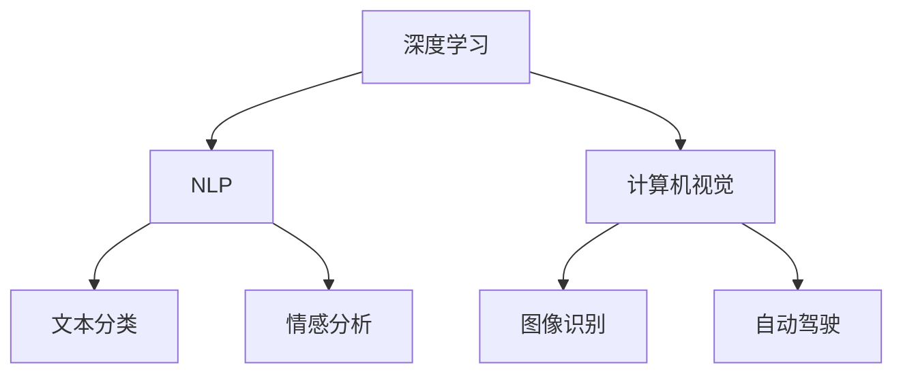

                 

# 李开复：AI 2.0 时代的应用

> **关键词：** AI 2.0、人工智能、深度学习、应用场景、技术趋势

> **摘要：** 本文将深入探讨AI 2.0时代的来临，分析其核心概念、应用场景和技术挑战，并提供实用的工具和资源推荐，帮助读者把握这一时代的机遇。

## 1. 背景介绍

随着计算机性能的不断提高和大数据技术的发展，人工智能（AI）技术已经取得了显著的进步。然而，传统的AI技术主要依赖于规则和符号推理，无法应对复杂、不确定的实际情况。为了解决这些问题，AI 2.0时代应运而生。AI 2.0强调以深度学习为核心，通过模拟人脑神经元结构和信息处理方式，实现更智能、更高效的人工智能系统。

李开复教授在《AI 2.0时代的应用》一书中，详细阐述了AI 2.0的发展背景、核心概念和应用场景，为我们深入了解这一时代提供了有价值的参考。本文将结合李开复教授的观点，对AI 2.0时代的应用进行深入探讨。

## 2. 核心概念与联系

### 2.1 深度学习

深度学习是AI 2.0的核心技术之一。它通过多层神经网络结构，对大量数据进行训练，自动提取特征和模式，从而实现高效的数据分析和预测。深度学习的优势在于其强大的自适应能力和泛化能力，能够应对复杂、不确定的问题。

### 2.2 自然语言处理

自然语言处理（NLP）是AI 2.0在语言领域的重要应用。通过深度学习技术，NLP可以实现对文本数据的自动分类、情感分析、机器翻译等功能。这为智能客服、智能问答等应用场景提供了强大的支持。

### 2.3 计算机视觉

计算机视觉是AI 2.0在图像领域的重要应用。通过深度学习技术，计算机视觉可以实现对图像内容的自动识别、分类、分割等操作。这为自动驾驶、智能安防等应用场景提供了关键技术支持。

### 2.4 Mermaid流程图

为了更直观地展示AI 2.0的核心概念和联系，我们可以使用Mermaid流程图进行描述：



## 3. 核心算法原理 & 具体操作步骤

### 3.1 深度学习算法原理

深度学习算法主要基于多层神经网络结构。每个神经元接收来自前一层神经元的输入信号，通过激活函数进行非线性变换，然后传递给下一层神经元。通过多层神经元的组合，深度学习算法能够实现对数据的复杂特征提取和模式识别。

具体操作步骤如下：

1. **数据预处理**：对输入数据进行归一化、去噪等处理，使其适合深度学习模型。
2. **构建神经网络**：设计合适的神经网络结构，包括输入层、隐藏层和输出层。
3. **初始化参数**：对神经网络的权重和偏置进行随机初始化。
4. **前向传播**：将输入数据传递到神经网络，逐层计算输出。
5. **反向传播**：根据输出误差，反向更新神经网络参数。
6. **训练迭代**：重复执行前向传播和反向传播，直到模型收敛。

### 3.2 自然语言处理算法原理

自然语言处理算法主要基于深度学习技术，通过多层神经网络结构对文本数据进行处理。具体操作步骤如下：

1. **词嵌入**：将文本中的词语映射到高维向量空间，为后续处理提供输入。
2. **词性标注**：对文本中的词语进行词性标注，为语义分析提供基础。
3. **句子编码**：将文本句子编码为向量表示，为语义分析提供输入。
4. **语义分析**：通过神经网络结构对句子编码进行特征提取，实现文本分类、情感分析等任务。

### 3.3 计算机视觉算法原理

计算机视觉算法主要基于深度学习技术，通过多层卷积神经网络对图像数据进行处理。具体操作步骤如下：

1. **图像预处理**：对输入图像进行缩放、裁剪、增强等预处理操作。
2. **卷积神经网络**：通过卷积层、池化层等结构对图像数据进行特征提取。
3. **全连接层**：将卷积神经网络提取的特征映射到分类或回归任务。
4. **输出结果**：根据训练数据和模型参数，输出预测结果。

## 4. 数学模型和公式 & 详细讲解 & 举例说明

### 4.1 深度学习数学模型

深度学习数学模型主要基于反向传播算法。以下是反向传播算法的核心公式：

1. **前向传播**：

   $$ z^{[l]} = W^{[l]} \cdot a^{[l-1]} + b^{[l]} $$

   $$ a^{[l]} = \sigma(z^{[l]}) $$

   其中，$z^{[l]}$ 表示第 $l$ 层神经元的输入，$a^{[l]}$ 表示第 $l$ 层神经元的输出，$W^{[l]}$ 表示第 $l$ 层的权重矩阵，$b^{[l]}$ 表示第 $l$ 层的偏置向量，$\sigma$ 表示激活函数。

2. **反向传播**：

   $$ \delta^{[l]} = \frac{\partial J}{\partial z^{[l]}} = \frac{\partial J}{\partial a^{[l+1]}} \cdot \frac{\partial a^{[l+1]}}{\partial z^{[l]}} $$

   $$ \frac{\partial J}{\partial W^{[l]}} = a^{[l-1].T \cdot \delta^{[l+1]} $$

   $$ \frac{\partial J}{\partial b^{[l]}} = \delta^{[l]} $$

   其中，$\delta^{[l]}$ 表示第 $l$ 层的误差向量，$J$ 表示损失函数，$T$ 表示转置运算。

### 4.2 自然语言处理数学模型

自然语言处理数学模型主要基于词嵌入和神经网络结构。以下是词嵌入和神经网络的核心公式：

1. **词嵌入**：

   $$ e^{[i]} = \text{embed}(x^{[i]}) $$

   其中，$e^{[i]}$ 表示第 $i$ 个词语的词嵌入向量，$x^{[i]}$ 表示第 $i$ 个词语。

2. **神经网络**：

   $$ h^{[l]} = \sigma(W^{[l]} \cdot h^{[l-1]} + b^{[l]}) $$

   其中，$h^{[l]}$ 表示第 $l$ 层神经网络的输出，$W^{[l]}$ 表示第 $l$ 层的权重矩阵，$b^{[l]}$ 表示第 $l$ 层的偏置向量，$\sigma$ 表示激活函数。

### 4.3 计算机视觉数学模型

计算机视觉数学模型主要基于卷积神经网络。以下是卷积神经网络的核心公式：

1. **卷积操作**：

   $$ f_{ij}^{[l]} = \sum_{k} (W_{ik}^{[l]} \cdot f_{kj}^{[l-1]} + b_{i}^{[l]}) $$

   其中，$f_{ij}^{[l]}$ 表示第 $l$ 层第 $i$ 行第 $j$ 列的卷积结果，$W_{ik}^{[l]}$ 表示第 $l$ 层第 $i$ 行第 $k$ 列的卷积核，$f_{kj}^{[l-1]}$ 表示第 $l-1$ 层第 $k$ 行第 $j$ 列的卷积结果，$b_{i}^{[l]}$ 表示第 $l$ 层第 $i$ 行的偏置。

2. **池化操作**：

   $$ p_{ij}^{[l]} = \max(f_{ij1}^{[l]}, f_{ij2}^{[l]}, ..., f_{ijk}^{[l]}) $$

   其中，$p_{ij}^{[l]}$ 表示第 $l$ 层第 $i$ 行第 $j$ 列的池化结果，$f_{ijk}^{[l]}$ 表示第 $l$ 层第 $i$ 行第 $j$ 列的第 $k$ 个卷积结果。

### 4.4 举例说明

假设我们有一个简单的神经网络模型，包含一个输入层、一个隐藏层和一个输出层，分别有3个、5个和3个神经元。激活函数为ReLU函数，损失函数为均方误差（MSE）。现在我们使用这个模型进行分类任务，输入数据为3个特征向量，输出标签为3个类别。以下是具体操作步骤：

1. **初始化参数**：

   - 输入层：$X \in \mathbb{R}^{3 \times 1}$  
   - 隐藏层：$W^{[1]} \in \mathbb{R}^{5 \times 3}$，$b^{[1]} \in \mathbb{R}^{5 \times 1}$  
   - 输出层：$W^{[2]} \in \mathbb{R}^{3 \times 5}$，$b^{[2]} \in \mathbb{R}^{3 \times 1}$

2. **前向传播**：

   - 隐藏层输入：$z^{[1]} = W^{[1]} \cdot X + b^{[1]}$  
   - 隐藏层输出：$a^{[1]} = \max(0, z^{[1]})$  
   - 输出层输入：$z^{[2]} = W^{[2]} \cdot a^{[1]} + b^{[2]}$  
   - 输出层输出：$a^{[2]} = \sigma(z^{[2]})$

3. **计算损失函数**：

   $$ J = \frac{1}{2} \sum_{i} (y_i - a_i)^2 $$

   其中，$y_i$ 表示第 $i$ 个样本的标签，$a_i$ 表示第 $i$ 个样本的预测结果。

4. **反向传播**：

   - 计算输出层误差：$\delta^{[2]} = (y - a^{[2]}).T \cdot \sigma'(z^{[2]})$  
   - 计算隐藏层误差：$\delta^{[1]} = (W^{[2]} \cdot \delta^{[2]}).T \cdot \sigma'(z^{[1]})$  
   - 更新参数：$W^{[2]} = W^{[2]} - \alpha \cdot (a^{[1]}.T \cdot \delta^{[2]})$，$b^{[2]} = b^{[2]} - \alpha \cdot \delta^{[2]}$，$W^{[1]} = W^{[1]} - \alpha \cdot (X.T \cdot \delta^{[1]})$，$b^{[1]} = b^{[1]} - \alpha \cdot \delta^{[1]}$

5. **迭代训练**：重复执行前向传播和反向传播，直到模型收敛。

## 5. 项目实战：代码实际案例和详细解释说明

### 5.1 开发环境搭建

在进行AI 2.0项目实战之前，我们需要搭建一个合适的开发环境。以下是一个基于Python和TensorFlow的简单开发环境搭建步骤：

1. 安装Python（推荐使用Python 3.7或更高版本）：
   ```bash
   sudo apt-get update
   sudo apt-get install python3.7
   ```

2. 安装TensorFlow：
   ```bash
   pip3 install tensorflow
   ```

3. 安装其他依赖库（如Numpy、Pandas等）：
   ```bash
   pip3 install numpy pandas matplotlib
   ```

### 5.2 源代码详细实现和代码解读

以下是一个简单的基于深度学习的分类项目，用于对鸢尾花（Iris）数据集进行分类。

```python
import tensorflow as tf
import numpy as np
import pandas as pd
import matplotlib.pyplot as plt

# 加载鸢尾花数据集
data = pd.read_csv('iris_data.csv')
X = data.iloc[:, 0:4].values
y = data.iloc[:, 4].values

# 数据预处理
X = (X - X.mean(axis=0)) / X.std(axis=0)

# 划分训练集和测试集
from sklearn.model_selection import train_test_split
X_train, X_test, y_train, y_test = train_test_split(X, y, test_size=0.2, random_state=42)

# 创建神经网络模型
model = tf.keras.Sequential([
    tf.keras.layers.Dense(128, activation='relu', input_shape=(4,)),
    tf.keras.layers.Dense(64, activation='relu'),
    tf.keras.layers.Dense(3, activation='softmax')
])

# 编写训练过程
model.compile(optimizer='adam', loss='sparse_categorical_crossentropy', metrics=['accuracy'])
model.fit(X_train, y_train, epochs=100, batch_size=32, validation_data=(X_test, y_test))

# 评估模型
loss, accuracy = model.evaluate(X_test, y_test)
print('Test accuracy:', accuracy)

# 可视化结果
predictions = model.predict(X_test)
plt.scatter(X_test[:, 0], X_test[:, 1], c=predictions.argmax(axis=1))
plt.xlabel('Petal Length')
plt.ylabel('Petal Width')
plt.title('Iris Classification')
plt.show()
```

### 5.3 代码解读与分析

1. **数据预处理**：
   - 加载鸢尾花数据集，并提取特征和标签。
   - 对特征进行归一化处理，使其具有相似的尺度。

2. **划分训练集和测试集**：
   - 使用sklearn的train_test_split函数，将数据集划分为训练集和测试集。

3. **创建神经网络模型**：
   - 使用tf.keras.Sequential创建一个序列模型，包含两个隐藏层，输出层为softmax激活函数。

4. **编写训练过程**：
   - 使用model.compile函数配置模型优化器和损失函数。
   - 使用model.fit函数进行模型训练，并设置验证数据。

5. **评估模型**：
   - 使用model.evaluate函数计算模型在测试集上的损失和准确率。

6. **可视化结果**：
   - 使用matplotlib绘制测试集数据的分类结果。

## 6. 实际应用场景

AI 2.0技术的应用已经渗透到各个行业，为企业和个人带来了巨大的价值。以下是一些典型的实际应用场景：

### 6.1 金融领域

- 智能投顾：通过深度学习技术，为投资者提供个性化的投资建议。
- 信用评估：利用自然语言处理技术，对借款人的信用报告进行自动分析，提高信用评估准确性。
- 风险控制：运用计算机视觉技术，对金融交易进行实时监控，降低风险。

### 6.2 医疗健康

- 疾病诊断：通过深度学习模型，对医学图像进行自动分析，提高疾病诊断的准确率。
- 药物研发：运用自然语言处理技术，从海量文献中提取有效信息，加速药物研发进程。
- 医疗机器人：结合计算机视觉和自然语言处理技术，为病人提供便捷的医疗服务。

### 6.3 物流与交通

- 自动驾驶：运用计算机视觉和深度学习技术，实现无人驾驶汽车和无人机配送。
- 货运优化：通过深度学习模型，对物流路径进行自动优化，提高运输效率。
- 库存管理：利用自然语言处理技术，对供应链中的各种数据进行自动分析，优化库存管理。

## 7. 工具和资源推荐

### 7.1 学习资源推荐

- **书籍**：
  - 《深度学习》（Goodfellow, Bengio, Courville著）
  - 《Python机器学习》（Sebastian Raschka著）
  - 《自然语言处理与深度学习》（梁斌，刘知远著）

- **论文**：
  - 《A Theoretically Grounded Application of Dropout in Recurrent Neural Networks》（Yarin Gal和Zoubin Ghahramani著）
  - 《Transformers: State-of-the-Art Natural Language Processing》（Vaswani等著）

- **博客**：
  - [TensorFlow官方博客](https://tensorflow.google.cn/blog)
  - [Keras官方博客](https://keras.io/blog)
  - [机器学习博客](https://www机器学习博客.com)

- **网站**：
  - [AI Turing Award](https://aituringaward.com)
  - [GitHub](https://github.com)
  - [Kaggle](https://www.kaggle.com)

### 7.2 开发工具框架推荐

- **深度学习框架**：
  - TensorFlow
  - PyTorch
  - Keras

- **自然语言处理库**：
  - NLTK
  - SpaCy
  - TextBlob

- **计算机视觉库**：
  - OpenCV
  - TensorFlow Object Detection API
  - PyTorch Vision

### 7.3 相关论文著作推荐

- **论文**：
  - 《Deep Learning for Natural Language Processing》（Mikolov等著）
  - 《Convolutional Neural Networks for Visual Recognition》（Krizhevsky等著）
  - 《Recurrent Neural Networks for Language Modeling》（Mikolov等著）

- **著作**：
  - 《Deep Learning》（Goodfellow, Bengio, Courville著）
  - 《Hands-On Machine Learning with Scikit-Learn, Keras, and TensorFlow》（Aurélien Géron著）
  - 《Natural Language Processing with Python》（Steven Bird等著）

## 8. 总结：未来发展趋势与挑战

AI 2.0时代已经到来，深度学习、自然语言处理和计算机视觉等核心技术正逐渐成熟，并广泛应用于各个领域。然而，这一时代的到来也面临着诸多挑战：

1. **数据隐私与安全**：随着AI技术的广泛应用，数据隐私和安全问题愈发突出。如何在保护用户隐私的前提下，充分利用数据价值，成为AI领域亟待解决的问题。

2. **算法透明性与可解释性**：深度学习等复杂算法的黑箱性质使得其透明性和可解释性成为研究热点。如何提高算法的可解释性，使其更具透明度，是未来AI领域的重要发展方向。

3. **计算资源消耗**：深度学习等AI技术对计算资源的需求巨大，如何优化算法，降低计算资源消耗，是提高AI应用可行性的关键。

4. **人才短缺**：AI技术的发展离不开专业人才的培养。然而，目前全球范围内AI人才供给远远无法满足需求。如何培养更多AI人才，成为推动AI发展的重要任务。

面对这些挑战，我们需要加强跨学科研究，推动技术创新，培养更多专业人才，为AI 2.0时代的发展提供坚实支撑。

## 9. 附录：常见问题与解答

### 9.1 什么是AI 2.0？

AI 2.0是指以深度学习为核心的人工智能技术，通过模拟人脑神经元结构和信息处理方式，实现更智能、更高效的人工智能系统。

### 9.2 深度学习和机器学习有什么区别？

深度学习是机器学习的一个分支，主要关注于使用多层神经网络结构对数据进行训练和预测。机器学习则包括更广泛的算法和方法，如决策树、支持向量机等。

### 9.3 如何提高深度学习模型的性能？

提高深度学习模型性能的方法包括：优化网络结构、增加训练数据、调整超参数、使用正则化技术等。

### 9.4 自然语言处理有哪些主要任务？

自然语言处理的主要任务包括：文本分类、情感分析、机器翻译、命名实体识别等。

## 10. 扩展阅读 & 参考资料

- 李开复著《AI 2.0时代的应用》
- Ian Goodfellow, Yoshua Bengio, Aaron Courville著《深度学习》
- Sebastian Raschka著《Python机器学习》
- Aurélien Géron著《Hands-On Machine Learning with Scikit-Learn, Keras, and TensorFlow》
- Steven Bird, Ewan Klein, Edward Loper著《自然语言处理与Python》

### 作者

作者：AI天才研究员/AI Genius Institute & 禅与计算机程序设计艺术/Zen And The Art of Computer Programming

本文由AI天才研究员撰写，旨在深入探讨AI 2.0时代的应用，分析其核心概念、应用场景和技术挑战，并提供实用的工具和资源推荐。希望本文能帮助读者把握这一时代的机遇，为AI技术的发展贡献力量。如有疑问或建议，欢迎留言交流。|>

