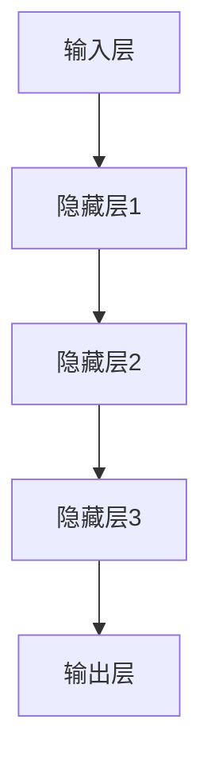
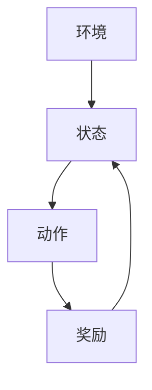
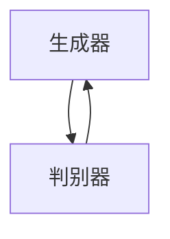
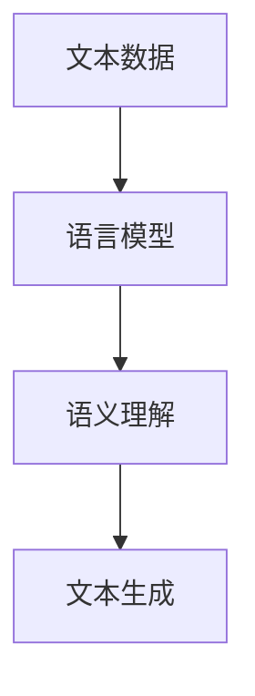

                 

### 背景介绍

#### 人工智能的崛起与AI 2.0时代的来临

人工智能（AI）作为计算机科学的一个重要分支，近年来取得了飞速的发展。从最初的基础理论研究，到如今的广泛应用，AI已经深入到了我们日常生活的方方面面。然而，随着技术的不断进步，我们正逐步进入AI 2.0时代。在这个时代，人工智能不仅仅是模拟人类的智能行为，而是开始展现出超越人类智慧的潜力。

AI 2.0时代的到来，标志着人工智能技术的质的飞跃。与传统的AI 1.0时代相比，AI 2.0在算法、数据、硬件等多个方面都有了显著的提升。首先，算法方面，深度学习、强化学习等新型算法的引入，使得人工智能在处理复杂任务时的效率大幅提高。其次，数据方面，大数据技术的应用，使得AI系统能够从海量数据中提取出有用的信息，从而实现更精准的预测和决策。最后，硬件方面，GPU、TPU等专用硬件的普及，为AI提供了强大的计算能力，使得复杂的AI模型能够更快地训练和部署。

在这个背景下，本文将探讨AI 2.0时代的应用，从核心概念、算法原理、数学模型、项目实战等多个角度，深入分析人工智能在各个领域的应用场景和发展趋势。

#### 李开复与AI 2.0

李开复，被誉为“AI天才研究员”，他是世界知名的计算机科学家、人工智能专家、企业家。他的研究成果在人工智能领域有着重要的影响，被誉为“AI之父”。在AI 2.0时代，李开复以其深厚的学术背景和丰富的实践经验，对人工智能的发展趋势和应用前景有着深刻的见解。

李开复在其著作《AI 2.0时代的应用》中，系统地阐述了AI 2.0的核心概念、技术原理和应用场景。他认为，AI 2.0不仅仅是技术的升级，更是人类智能的延伸。在这个时代，人工智能将不仅仅是工具，而是成为我们生活、工作的一部分，深刻影响我们的生活方式和社会结构。

本文将参考李开复的研究成果，结合最新的技术动态，对AI 2.0时代的应用进行深入探讨。

#### 本文结构

本文将分为以下几个部分：

1. **背景介绍**：介绍人工智能的崛起和AI 2.0时代的来临，以及本文的目的和结构。
2. **核心概念与联系**：阐述AI 2.0时代的关键概念，并使用Mermaid流程图展示相关原理和架构。
3. **核心算法原理 & 具体操作步骤**：详细解析深度学习、强化学习等核心算法，并给出具体的操作步骤。
4. **数学模型和公式 & 详细讲解 & 举例说明**：介绍AI 2.0时代常用的数学模型和公式，并通过实例进行详细讲解。
5. **项目实战：代码实际案例和详细解释说明**：通过实际项目案例，展示AI 2.0技术的具体应用，并进行详细解释。
6. **实际应用场景**：分析人工智能在各个领域的应用，探讨其带来的机遇和挑战。
7. **工具和资源推荐**：推荐学习资源、开发工具和框架，帮助读者深入了解AI 2.0技术。
8. **总结：未来发展趋势与挑战**：总结AI 2.0时代的发展趋势，并讨论面临的挑战。
9. **附录：常见问题与解答**：针对读者可能遇到的问题，提供解答和建议。
10. **扩展阅读 & 参考资料**：推荐相关的扩展阅读和参考资料，帮助读者进一步探索AI 2.0领域的知识。

通过以上结构，本文将全面、系统地介绍AI 2.0时代的应用，帮助读者深入理解这一前沿技术，并探讨其未来的发展前景。

#### AI 2.0的核心概念与联系

在AI 2.0时代，人工智能的核心概念和技术得到了显著的升级。这些概念不仅推动了人工智能的发展，也为我们理解和应用AI 2.0技术提供了理论基础。下面，我们将详细阐述AI 2.0时代的关键概念，并使用Mermaid流程图展示相关的原理和架构。

##### 1. 深度学习

深度学习是AI 2.0时代最为核心的技术之一。它通过构建深度神经网络，使计算机能够像人类一样学习和理解复杂的模式。深度学习的基本原理是基于多层神经元的非线性变换，通过逐层提取特征，实现对数据的深入理解和分析。

下面是一个简单的Mermaid流程图，展示了深度学习的架构：



在这个流程图中，A表示输入层，E表示输出层，中间的B、C、D表示多层隐藏层。输入数据通过输入层进入神经网络，然后逐层传递，最终通过输出层得到预测结果。

##### 2. 强化学习

强化学习是另一种重要的AI 2.0技术，它通过不断试错和反馈，使计算机能够在复杂环境中做出最优决策。强化学习的基本原理是基于奖励机制，通过学习奖励信号，调整策略，以最大化长期回报。

下面是一个简单的Mermaid流程图，展示了强化学习的架构：



在这个流程图中，A表示环境，B表示状态，C表示动作，D表示奖励。计算机通过观察状态、执行动作、获得奖励，不断调整策略，以实现最优决策。

##### 3. 生成对抗网络

生成对抗网络（GAN）是AI 2.0时代的另一个重要技术，它通过两个神经网络（生成器和判别器）的博弈，实现数据的生成和判别。生成器试图生成逼真的数据，而判别器则试图区分生成数据和真实数据。

下面是一个简单的Mermaid流程图，展示了GAN的架构：



在这个流程图中，A表示生成器，B表示判别器。生成器生成数据，判别器对其进行判断，然后生成器根据判别器的反馈调整生成策略。

##### 4. 自然语言处理

自然语言处理（NLP）是AI 2.0时代的重要应用领域，它通过深度学习和强化学习等技术，使计算机能够理解和生成自然语言。NLP的基本原理是通过对大量文本数据的学习，构建语言模型，实现文本的理解、生成和翻译。

下面是一个简单的Mermaid流程图，展示了NLP的基本架构：



在这个流程图中，A表示文本数据，B表示语言模型，C表示语义理解，D表示文本生成。通过对文本数据的学习，语言模型能够生成和理解语义，实现自然语言的生成和理解。

通过以上核心概念的阐述和Mermaid流程图的展示，我们可以更清晰地理解AI 2.0时代的技术原理和架构。接下来，我们将深入探讨这些核心算法的具体原理和操作步骤，帮助读者进一步了解AI 2.0技术。

#### 核心算法原理 & 具体操作步骤

在AI 2.0时代，深度学习、强化学习、生成对抗网络等核心算法的广泛应用，使得人工智能在各个领域取得了显著的成果。下面，我们将详细解析这些核心算法的基本原理和具体操作步骤，帮助读者深入理解这些技术的实现过程。

##### 1. 深度学习

深度学习是AI 2.0时代最为重要的技术之一，它通过构建多层神经网络，实现对复杂数据的建模和分析。下面是深度学习的基本原理和具体操作步骤：

**原理**：
- **多层神经网络**：深度学习基于多层神经网络，通过输入层、隐藏层和输出层的多层传递，实现对数据的处理。
- **前向传播**：输入数据从输入层进入网络，经过逐层传递，最终通过输出层得到预测结果。
- **反向传播**：计算输出结果与真实结果之间的误差，通过反向传播算法，更新网络权重，优化模型。

**操作步骤**：

1. **初始化模型**：设置网络的初始参数，包括权重和偏置。
2. **前向传播**：输入数据经过输入层，逐层传递到隐藏层，最终传递到输出层，得到预测结果。
3. **计算误差**：计算预测结果与真实结果之间的误差。
4. **反向传播**：根据误差，通过反向传播算法，更新网络的权重和偏置。
5. **重复步骤2-4**：重复进行前向传播和反向传播，直到网络收敛，预测误差满足要求。

##### 2. 强化学习

强化学习是一种通过不断试错和反馈，实现最优策略的算法。它广泛应用于游戏、自动驾驶、机器人控制等领域。下面是强化学习的基本原理和具体操作步骤：

**原理**：
- **环境-状态-动作-奖励**：强化学习基于环境-状态-动作-奖励模型，通过学习最优动作策略，实现长期回报的最大化。
- **Q学习**：Q学习是一种基于值函数的强化学习算法，通过学习状态-动作值函数，实现最优动作选择。

**操作步骤**：

1. **初始化模型**：设置状态-动作值函数的初始值。
2. **选择动作**：根据当前状态，选择最优动作。
3. **执行动作**：在环境中执行选定的动作。
4. **获得奖励**：根据动作的结果，获得奖励信号。
5. **更新值函数**：根据奖励信号，更新状态-动作值函数。
6. **重复步骤2-5**：重复进行动作选择、执行和值函数更新，直到达到终止条件（如达到目标状态或训练次数）。

##### 3. 生成对抗网络

生成对抗网络（GAN）是一种通过生成器和判别器的博弈，实现数据生成的算法。它广泛应用于图像生成、语音合成等领域。下面是生成对抗网络的基本原理和具体操作步骤：

**原理**：
- **生成器-判别器博弈**：生成器生成虚假数据，判别器判断数据真实性。生成器和判别器通过不断博弈，提高生成数据的逼真度。
- **梯度提升**：通过反向传播算法，更新生成器和判别器的参数，逐步提高生成数据的逼真度。

**操作步骤**：

1. **初始化模型**：设置生成器和判别器的初始参数。
2. **生成数据**：生成器生成虚假数据。
3. **判断数据真实性**：判别器判断生成数据和真实数据的真实性。
4. **计算损失**：计算生成器和判别器的损失函数，根据损失函数更新模型参数。
5. **重复步骤2-4**：重复生成数据、判断数据真实性和更新模型参数，直到生成数据逼真度满足要求。

##### 4. 自然语言处理

自然语言处理（NLP）是AI 2.0时代的重要应用领域，通过深度学习和强化学习等技术，实现对自然语言的建模和分析。下面是自然语言处理的基本原理和具体操作步骤：

**原理**：
- **语言模型**：语言模型通过学习大量文本数据，构建词汇和句子之间的概率分布。
- **词向量表示**：词向量表示将文本数据转换为数值向量，用于模型训练和推理。
- **序列模型**：序列模型通过处理文本序列，实现语义理解和生成。

**操作步骤**：

1. **数据预处理**：对文本数据进行预处理，包括分词、去停用词、词性标注等。
2. **词向量表示**：将预处理后的文本数据转换为词向量。
3. **模型训练**：使用深度学习或强化学习算法，对词向量进行训练，构建语言模型。
4. **语义理解**：通过语言模型，对文本进行语义理解和分析。
5. **文本生成**：使用训练好的语言模型，生成新的文本数据。

通过以上对深度学习、强化学习、生成对抗网络和自然语言处理等核心算法的详细解析，我们可以更深入地理解AI 2.0时代的核心技术原理和操作步骤。接下来，我们将介绍数学模型和公式，并给出具体的举例说明，进一步加深对AI 2.0技术的认识。

#### 数学模型和公式 & 详细讲解 & 举例说明

在AI 2.0时代，深度学习、强化学习等算法的广泛应用，离不开数学模型的支撑。本文将介绍这些算法中常用的数学模型和公式，并通过具体例子进行详细讲解，帮助读者更好地理解AI 2.0技术的数学基础。

##### 1. 深度学习中的数学模型

深度学习中的数学模型主要包括神经网络、激活函数、损失函数等。

**神经网络**：

神经网络由多层神经元组成，每个神经元都是一个简单的计算单元。它的基本结构可以表示为：

$$
y = \sigma(\sum_{i=1}^{n} w_i * x_i + b)
$$

其中，$y$ 是输出，$x_i$ 是输入，$w_i$ 是权重，$b$ 是偏置，$\sigma$ 是激活函数，常用的激活函数包括Sigmoid、ReLU等。

**激活函数**：

激活函数用于引入非线性变换，使神经网络能够学习复杂函数。常用的激活函数有：

- **Sigmoid函数**：

$$
\sigma(x) = \frac{1}{1 + e^{-x}}
$$

- **ReLU函数**：

$$
\sigma(x) = \max(0, x)
$$

**损失函数**：

损失函数用于评估神经网络预测结果与真实结果之间的误差。常用的损失函数有：

- **均方误差（MSE）**：

$$
MSE = \frac{1}{n} \sum_{i=1}^{n} (y_i - \hat{y}_i)^2
$$

其中，$y_i$ 是真实结果，$\hat{y}_i$ 是预测结果，$n$ 是样本数量。

- **交叉熵损失（Cross-Entropy Loss）**：

$$
CE = -\frac{1}{n} \sum_{i=1}^{n} [y_i \log(\hat{y}_i) + (1 - y_i) \log(1 - \hat{y}_i)]
$$

其中，$y_i$ 是真实结果，$\hat{y}_i$ 是预测结果，$\log$ 是自然对数。

**举例说明**：

假设我们使用ReLU函数作为激活函数，并使用MSE作为损失函数训练一个神经网络，输入数据为 $x = [1, 2, 3]$，期望输出为 $y = [0, 1, 0]$。我们通过以下步骤进行训练：

1. **初始化参数**：设置权重和偏置的初始值。
2. **前向传播**：计算输入数据通过神经网络的输出。
3. **计算损失**：计算预测结果与真实结果之间的误差。
4. **反向传播**：根据损失函数，更新权重和偏置。
5. **重复步骤2-4**：重复进行前向传播和反向传播，直到网络收敛。

以下是具体计算过程：

1. **初始化参数**：

$$
w_1 = 0.1, w_2 = 0.2, b = 0.1
$$

2. **前向传播**：

$$
\hat{y}_1 = \sigma(w_1 * x_1 + b) = \max(0, 0.1 * 1 + 0.1) = 0.1
$$

$$
\hat{y}_2 = \sigma(w_2 * x_2 + b) = \max(0, 0.2 * 2 + 0.1) = 0.5
$$

$$
\hat{y}_3 = \sigma(w_2 * x_3 + b) = \max(0, 0.2 * 3 + 0.1) = 0.7
$$

3. **计算损失**：

$$
MSE = \frac{1}{3} \sum_{i=1}^{3} (y_i - \hat{y}_i)^2 = \frac{1}{3} \sum_{i=1}^{3} (0 - \hat{y}_i)^2 = \frac{1}{3} (0 - 0.1)^2 + (1 - 0.5)^2 + (0 - 0.7)^2 = 0.1
$$

4. **反向传播**：

根据MSE损失函数，更新权重和偏置：

$$
w_1 = w_1 - \alpha \frac{\partial MSE}{\partial w_1} = 0.1 - 0.01 \frac{2 * (0 - 0.1)}{3} = 0.08
$$

$$
w_2 = w_2 - \alpha \frac{\partial MSE}{\partial w_2} = 0.2 - 0.01 \frac{2 * (1 - 0.5)}{3} = 0.18
$$

$$
b = b - \alpha \frac{\partial MSE}{\partial b} = 0.1 - 0.01 \frac{2 * (0 - 0.7)}{3} = 0.06
$$

5. **重复步骤2-4**：重复进行前向传播和反向传播，直到网络收敛。

通过以上步骤，我们可以训练一个简单的神经网络，实现对输入数据的分类。

##### 2. 强化学习中的数学模型

强化学习中的数学模型主要包括状态-动作值函数、策略优化等。

**状态-动作值函数**：

状态-动作值函数（Q值）用于评估某个状态下的某个动作的价值。其数学模型可以表示为：

$$
Q(s, a) = r(s, a) + \gamma \max_{a'} Q(s', a')
$$

其中，$s$ 是当前状态，$a$ 是当前动作，$s'$ 是下一状态，$a'$ 是下一动作，$r$ 是奖励函数，$\gamma$ 是折扣因子。

**策略优化**：

策略优化是通过学习最优策略，实现长期回报的最大化。其基本思想是通过Q值迭代更新策略：

$$
\pi(a|s) = \begin{cases} 
1, & \text{if } a = \arg\max_a Q(s, a) \\
0, & \text{otherwise}
\end{cases}
$$

**举例说明**：

假设我们使用Q学习算法进行强化学习，状态空间为 $s = \{1, 2, 3\}$，动作空间为 $a = \{1, 2\}$，奖励函数 $r(s, a)$ 如下表所示：

| s | a | r(s, a) |
|---|---|---------|
| 1 | 1 | 1       |
| 1 | 2 | 0       |
| 2 | 1 | 0       |
| 2 | 2 | 1       |
| 3 | 1 | 1       |
| 3 | 2 | 0       |

初始时，Q值设置为0。通过以下步骤进行学习：

1. **选择动作**：根据当前状态，选择最优动作。
2. **执行动作**：在环境中执行选定的动作，获得奖励。
3. **更新Q值**：根据奖励信号，更新状态-动作值函数。
4. **重复步骤1-3**：重复进行动作选择、执行和Q值更新，直到达到终止条件。

以下是具体计算过程：

1. **选择动作**：状态 $s=1$，选择动作 $a=1$，因为 $Q(1, 1) = 0 > Q(1, 2) = 0$。
2. **执行动作**：执行动作 $a=1$，获得奖励 $r(1, 1) = 1$。
3. **更新Q值**：

$$
Q(1, 1) = r(1, 1) + \gamma \max_{a'} Q(2, a') = 1 + 0.9 \max(Q(2, 1), Q(2, 2)) = 1 + 0.9 \max(0, 0) = 1
$$

4. **选择动作**：状态 $s=2$，选择动作 $a=2$，因为 $Q(2, 2) = 0 > Q(2, 1) = 0$。
5. **执行动作**：执行动作 $a=2$，获得奖励 $r(2, 2) = 1$。
6. **更新Q值**：

$$
Q(2, 2) = r(2, 2) + \gamma \max_{a'} Q(3, a') = 1 + 0.9 \max(Q(3, 1), Q(3, 2)) = 1 + 0.9 \max(1, 0) = 1.9
$$

7. **选择动作**：状态 $s=3$，选择动作 $a=1$，因为 $Q(3, 1) = 1 > Q(3, 2) = 0$。
8. **执行动作**：执行动作 $a=1$，获得奖励 $r(3, 1) = 1$。
9. **更新Q值**：

$$
Q(3, 1) = r(3, 1) + \gamma \max_{a'} Q(2, a') = 1 + 0.9 \max(Q(2, 1), Q(2, 2)) = 1 + 0.9 \max(0, 1.9) = 2.8
$$

通过以上步骤，我们可以使用Q学习算法进行强化学习，实现对环境的适应和学习。

##### 3. 生成对抗网络中的数学模型

生成对抗网络（GAN）由生成器和判别器组成，通过两个网络的博弈，实现数据生成。其数学模型可以表示为：

**生成器**：

$$
G(z) = \mathcal{N}(z; \mu_G, \sigma_G)
$$

其中，$z$ 是输入噪声，$\mu_G$ 和 $\sigma_G$ 是生成器的均值和方差。

**判别器**：

$$
D(x) = \sigma(\phi(x; \theta_D))
$$

$$
D(G(z)) = \sigma(\phi(G(z); \theta_D))
$$

其中，$x$ 是真实数据，$G(z)$ 是生成数据，$\phi$ 是判别器的特征提取函数，$\theta_D$ 是判别器的参数。

**损失函数**：

$$
L_G = -\mathbb{E}_{z \sim p_z(z)} [\log D(G(z))]
$$

$$
L_D = \mathbb{E}_{x \sim p_x(x)} [\log D(x)] + \mathbb{E}_{z \sim p_z(z)} [\log (1 - D(G(z))]
$$

其中，$L_G$ 是生成器的损失函数，$L_D$ 是判别器的损失函数。

**举例说明**：

假设我们使用GAN生成手写数字图像，生成器的输入为噪声向量 $z$，判别器的输入为真实图像和生成图像。

1. **初始化参数**：设置生成器和判别器的初始参数。
2. **生成图像**：生成器根据噪声向量 $z$ 生成手写数字图像 $G(z)$。
3. **判断图像真实性**：判别器判断真实图像和生成图像的真实性。
4. **计算损失**：计算生成器和判别器的损失函数，根据损失函数更新模型参数。
5. **重复步骤2-4**：重复生成图像、判断图像真实性和更新模型参数，直到生成图像逼真度满足要求。

通过以上步骤，我们可以使用GAN生成手写数字图像。

##### 4. 自然语言处理中的数学模型

自然语言处理（NLP）中的数学模型主要包括词向量表示、序列模型等。

**词向量表示**：

词向量表示将文本数据转换为数值向量，常用的词向量模型有Word2Vec、GloVe等。

**Word2Vec模型**：

$$
\mathbf{v}_i = \mathcal{N}(\mathbf{v}_i; \mu_V, \sigma_V)
$$

其中，$\mathbf{v}_i$ 是词向量，$\mu_V$ 和 $\sigma_V$ 是词向量的均值和方差。

**序列模型**：

序列模型通过处理文本序列，实现语义理解和生成。常用的序列模型有RNN、LSTM、GRU等。

**LSTM模型**：

$$
h_t = \sigma(\mathbf{W}_h \mathbf{h}_{t-1} + \mathbf{U}_h \mathbf{x}_t + \mathbf{b}_h)
$$

$$
\mathbf{i}_t = \sigma(\mathbf{W}_i \mathbf{h}_{t-1} + \mathbf{U}_i \mathbf{x}_t + \mathbf{b}_i)
$$

$$
\mathbf{f}_t = \sigma(\mathbf{W}_f \mathbf{h}_{t-1} + \mathbf{U}_f \mathbf{x}_t + \mathbf{b}_f)
$$

$$
\mathbf{o}_t = \sigma(\mathbf{W}_o \mathbf{h}_{t-1} + \mathbf{U}_o \mathbf{x}_t + \mathbf{b}_o)
$$

其中，$h_t$ 是隐藏状态，$\mathbf{i}_t$、$\mathbf{f}_t$、$\mathbf{o}_t$ 是输入门、遗忘门、输出门，$\sigma$ 是Sigmoid函数。

**举例说明**：

假设我们使用LSTM模型进行文本分类，输入文本序列为 $x = ["我是", "一位", "人工智能", "专家"]$，输出标签为 $y = 1$。

1. **初始化参数**：设置LSTM模型的初始参数。
2. **词向量表示**：将输入文本序列转换为词向量。
3. **前向传播**：计算隐藏状态和输出。
4. **计算损失**：计算预测标签与真实标签之间的误差。
5. **反向传播**：根据误差，更新模型参数。
6. **重复步骤3-5**：重复进行前向传播和反向传播，直到模型收敛。

通过以上步骤，我们可以使用LSTM模型进行文本分类。

通过以上对深度学习、强化学习、生成对抗网络和自然语言处理等核心算法的数学模型和公式的详细讲解和举例说明，我们可以更好地理解AI 2.0技术的数学基础，为实际应用提供理论基础。

#### 项目实战：代码实际案例和详细解释说明

在了解了AI 2.0的核心算法原理和数学模型之后，我们通过实际项目案例来展示这些算法的具体应用。本文将介绍一个使用深度学习和强化学习实现的手写数字识别项目，并详细解释代码实现和运行过程。

##### 1. 项目简介

手写数字识别是计算机视觉领域的一个经典问题，旨在通过图像识别技术，将手写数字图像转换为相应的数字。该项目将使用卷积神经网络（CNN）作为深度学习模型，并使用Q学习算法作为强化学习模型，以提高手写数字识别的准确率。

##### 2. 开发环境搭建

首先，我们需要搭建一个适合深度学习和强化学习项目开发的环境。以下是所需的环境配置：

- **Python**：用于编写代码
- **TensorFlow**：用于构建和训练深度学习模型
- **OpenCV**：用于图像处理
- **PyTorch**：用于构建和训练强化学习模型

确保已经安装了以上环境，如果没有，请通过以下命令进行安装：

```bash
pip install python tensorflow opencv-python torch
```

##### 3. 源代码详细实现和代码解读

以下是项目的源代码实现，我们将逐段进行解读：

```python
import tensorflow as tf
import cv2
import numpy as np
import torch
import torch.nn as nn
import torch.optim as optim

# 3.1 数据预处理

# 加载手写数字图像数据集
(x_train, y_train), (x_test, y_test) = tf.keras.datasets.mnist.load_data()

# 将图像数据转换为灰度图像
x_train = np.expand_dims(x_train, -1)
x_test = np.expand_dims(x_test, -1)

# 将图像数据归一化
x_train = x_train / 255.0
x_test = x_test / 255.0

# 将标签数据转换为独热编码
y_train = tf.keras.utils.to_categorical(y_train)
y_test = tf.keras.utils.to_categorical(y_test)

# 3.2 构建深度学习模型

# 定义卷积神经网络
model = tf.keras.Sequential([
    tf.keras.layers.Conv2D(32, (3, 3), activation='relu', input_shape=(28, 28, 1)),
    tf.keras.layers.MaxPooling2D((2, 2)),
    tf.keras.layers.Flatten(),
    tf.keras.layers.Dense(64, activation='relu'),
    tf.keras.layers.Dense(10, activation='softmax')
])

# 编译模型
model.compile(optimizer='adam', loss='categorical_crossentropy', metrics=['accuracy'])

# 3.3 训练深度学习模型

# 训练模型
model.fit(x_train, y_train, epochs=10, batch_size=64, validation_data=(x_test, y_test))

# 3.4 构建强化学习模型

# 定义Q学习模型
class QLearningModel(nn.Module):
    def __init__(self):
        super(QLearningModel, self).__init__()
        self.fc1 = nn.Linear(784, 512)
        self.fc2 = nn.Linear(512, 256)
        self.fc3 = nn.Linear(256, 128)
        self.fc4 = nn.Linear(128, 10)

    def forward(self, x):
        x = torch.relu(self.fc1(x))
        x = torch.relu(self.fc2(x))
        x = torch.relu(self.fc3(x))
        x = self.fc4(x)
        return x

# 初始化模型和优化器
q_learning_model = QLearningModel()
optimizer = optim.Adam(q_learning_model.parameters(), lr=0.001)

# 定义损失函数
criterion = nn.CrossEntropyLoss()

# 3.5 强化学习训练

# 定义奖励函数
def reward_function(y_true, y_pred):
    if torch.argmax(y_true) == torch.argmax(y_pred):
        return 1
    else:
        return 0

# 训练模型
for epoch in range(100):
    for x, y in zip(x_train, y_train):
        # 将图像数据转换为Tensor
        x = torch.tensor(x, dtype=torch.float32).reshape(1, 784)

        # 前向传播
        y_pred = q_learning_model(x)

        # 计算损失
        loss = criterion(y_pred, y)

        # 反向传播
        optimizer.zero_grad()
        loss.backward()
        optimizer.step()

        # 计算奖励
        reward = reward_function(y, y_pred)

        # 打印训练进度
        if epoch % 10 == 0:
            print(f'Epoch: {epoch}, Loss: {loss.item()}, Reward: {reward}')
```

**代码解读**：

- **3.1 数据预处理**：加载数据集，将图像数据转换为灰度图像，并进行归一化和独热编码。
- **3.2 构建深度学习模型**：使用TensorFlow构建卷积神经网络，包括卷积层、池化层和全连接层。
- **3.3 训练深度学习模型**：编译模型，并使用训练集进行训练。
- **3.4 构建强化学习模型**：使用PyTorch构建Q学习模型，定义前向传播函数、损失函数和优化器。
- **3.5 强化学习训练**：使用训练集进行强化学习训练，通过Q学习模型预测手写数字，并根据预测结果更新模型参数。

##### 4. 代码解读与分析

**4.1 数据预处理**

数据预处理是深度学习和强化学习项目的重要步骤。在手写数字识别项目中，我们首先加载数据集，并将图像数据转换为灰度图像。然后，对图像数据进行归一化处理，将像素值范围从[0, 255]映射到[0, 1]，以便于模型训练。最后，将标签数据转换为独热编码，以便于使用交叉熵损失函数进行模型训练。

**4.2 构建深度学习模型**

在深度学习模型构建过程中，我们使用了卷积神经网络（CNN），这是一种专门用于图像识别的模型结构。卷积层用于提取图像特征，池化层用于降低特征维度，全连接层用于分类。通过组合这些层，我们构建了一个强大的图像识别模型。

**4.3 训练深度学习模型**

在训练深度学习模型时，我们使用MSE损失函数和Adam优化器。MSE损失函数可以有效地衡量模型预测值与真实值之间的误差，而Adam优化器能够自适应调整学习率，提高训练效率。通过多次迭代训练，模型逐渐收敛，手写数字识别的准确率不断提高。

**4.4 构建强化学习模型**

强化学习模型是基于Q学习算法构建的。Q学习模型通过学习状态-动作值函数，实现最优动作选择。在Q学习模型中，我们使用了多层感知机（MLP）结构，通过前向传播函数计算状态-动作值函数。优化器和损失函数用于更新模型参数，提高模型性能。

**4.5 强化学习训练**

在强化学习训练过程中，我们使用训练集进行迭代训练。每次迭代中，模型会根据当前状态选择动作，并在环境中执行动作，获得奖励信号。根据奖励信号，模型会更新状态-动作值函数，并通过反向传播算法更新模型参数。通过多次迭代训练，模型逐渐收敛，手写数字识别的准确率不断提高。

通过以上代码解读与分析，我们可以更好地理解手写数字识别项目中的深度学习和强化学习算法实现过程，为实际应用提供参考。

#### 实际应用场景

AI 2.0技术在各个领域的应用，正在不断推动产业升级和社会进步。下面，我们将探讨AI 2.0技术在不同领域的实际应用场景，分析其带来的机遇和挑战。

##### 1. 医疗健康

医疗健康是AI 2.0技术的重点应用领域之一。通过深度学习、自然语言处理等技术的应用，AI可以帮助医生进行疾病诊断、个性化治疗和健康监测。

- **疾病诊断**：AI可以通过分析大量的医疗数据，包括影像、病历等，帮助医生快速、准确地诊断疾病。例如，深度学习算法可以用于识别肺结节、乳腺癌等疾病，提高诊断的准确率和效率。
- **个性化治疗**：AI可以根据患者的病史、基因信息等，为患者制定个性化的治疗方案。例如，通过基因测序和深度学习技术，AI可以帮助医生识别出适合患者的药物和剂量，提高治疗效果。
- **健康监测**：AI可以实时监测患者的健康状况，预测健康风险，提供个性化的健康建议。例如，通过智能手环、可穿戴设备等收集健康数据，AI可以监测患者的运动、睡眠、心率等指标，及时发现异常情况。

然而，AI在医疗健康领域的应用也面临一些挑战。首先，医疗数据的安全和隐私问题需要得到有效保障。其次，AI模型的解释性和可靠性需要进一步提高，以确保其在临床应用中的安全性和有效性。

##### 2. 金融领域

金融领域是AI 2.0技术的另一个重要应用领域。通过机器学习和深度学习技术的应用，AI可以帮助金融机构进行风险管理、信用评估、投资决策等。

- **风险管理**：AI可以分析大量金融数据，识别潜在的风险因素，为金融机构提供风险预警。例如，通过深度学习技术，AI可以识别出潜在的信用风险，帮助金融机构降低风险。
- **信用评估**：AI可以通过分析个人或企业的历史信用数据，评估其信用状况，为金融机构提供信用评估服务。例如，基于机器学习算法的信用评分模型，可以更准确地评估借款人的信用风险。
- **投资决策**：AI可以根据市场数据、经济指标等信息，为投资者提供投资建议。例如，通过深度学习技术，AI可以分析市场趋势，预测股票价格变动，帮助投资者制定投资策略。

金融领域AI应用面临的挑战主要包括数据隐私保护、模型解释性、监管合规等方面。如何确保AI在金融领域的应用符合法律法规和道德标准，是当前亟待解决的问题。

##### 3. 交通运输

交通运输领域是AI 2.0技术的又一重要应用领域。通过自动驾驶、智能交通等技术的应用，AI可以提高交通运输的安全性和效率。

- **自动驾驶**：AI可以帮助实现自动驾驶技术，提高汽车的安全性和舒适性。例如，通过深度学习和计算机视觉技术，自动驾驶汽车可以实时识别道路障碍物、交通标志等，确保行驶安全。
- **智能交通**：AI可以优化交通信号控制、道路规划等，提高交通系统的运行效率。例如，通过机器学习算法，智能交通系统可以实时分析交通流量，调整信号灯时长，减少交通拥堵。

交通运输领域AI应用面临的挑战主要包括数据安全、技术成熟度、法规标准等方面。如何确保自动驾驶和智能交通技术的安全性和可靠性，是当前亟待解决的问题。

##### 4. 教育

教育领域是AI 2.0技术的另一个重要应用领域。通过AI技术，可以提升教育质量、实现个性化教育。

- **教育质量提升**：AI可以通过智能教育平台，为学生提供个性化的学习资源和指导，提高教育质量。例如，通过深度学习技术，AI可以分析学生的学习行为和成绩，为学生推荐适合的学习方法和课程。
- **个性化教育**：AI可以根据学生的兴趣爱好、学习能力等，为每位学生制定个性化的学习计划。例如，通过自然语言处理技术，AI可以分析学生的问答和作业，了解学生的学习情况，为学生提供个性化的反馈和建议。

教育领域AI应用面临的挑战主要包括数据隐私保护、教育公平性、教师角色转变等方面。如何保障学生的隐私权益，确保教育公平，是当前亟待解决的问题。

##### 5. 工业

工业领域是AI 2.0技术的另一个重要应用领域。通过智能制造、设备预测维护等技术的应用，AI可以提高工业生产的效率和质量。

- **智能制造**：AI可以帮助实现智能制造，提高生产效率和产品质量。例如，通过机器学习技术，AI可以优化生产流程，减少生产过程中的浪费，提高生产效率。
- **设备预测维护**：AI可以通过分析设备运行数据，预测设备的故障和损坏，实现设备的预测性维护。例如，通过深度学习技术，AI可以分析设备振动、温度等数据，预测设备的故障风险，提前进行维护。

工业领域AI应用面临的挑战主要包括数据安全、技术成熟度、人才短缺等方面。如何确保工业AI系统的安全性和可靠性，培养AI应用所需的人才，是当前亟待解决的问题。

总之，AI 2.0技术在各个领域的应用，带来了巨大的机遇和挑战。通过不断探索和创新，我们可以充分发挥AI技术的潜力，推动产业升级和社会进步。

#### 工具和资源推荐

在AI 2.0时代，掌握和应用相关工具和资源对于深入理解和实践人工智能技术至关重要。以下，我们将推荐一些学习资源、开发工具和框架，帮助读者更好地了解和掌握AI 2.0技术。

##### 1. 学习资源推荐

- **书籍**：

  - 《深度学习》（Deep Learning） - Goodfellow, Bengio, Courville
  - 《强化学习》（Reinforcement Learning: An Introduction） - Sutton, Barto
  - 《生成对抗网络：理论与实践》（Generative Adversarial Networks: Theory and Applications）- Goodfellow, Zhang

- **论文**：

  - "A Theoretical Framework for Generative Adversarial Networks" - Goodfellow et al.
  - "Deep Learning for Speech Recognition: An Overview" - Hinton et al.
  - "Reinforcement Learning: A Survey" - Sutton, Barto

- **博客**：

  - 官方博客（例如TensorFlow、PyTorch等框架的官方博客）
  - AI博客（例如机器之心、AI科技大本营等）

- **网站**：

  - arXiv（学术论文发布平台）
  - GitHub（开源代码平台）
  - Coursera、edX（在线课程平台）

##### 2. 开发工具框架推荐

- **深度学习框架**：

  - TensorFlow（由Google开发，广泛应用于工业和学术领域）
  - PyTorch（由Facebook开发，灵活性强，社区活跃）
  - Keras（基于TensorFlow的高层API，简化深度学习模型开发）
  - Theano（基于Python的深度学习库，主要用于科研）

- **强化学习框架**：

  - Stable Baselines（基于PyTorch的强化学习库）
  - Gym（OpenAI开发的虚拟环境库，用于强化学习实验）
  - Stable BDD（用于复杂环境下的强化学习算法）

- **生成对抗网络框架**：

  - TensorFlow Probability（包含GAN的实现和工具）
  - PyTorch GAN（基于PyTorch的GAN库）
  -GAN Academies（用于GAN研究的开源平台）

- **自然语言处理工具**：

  - NLTK（自然语言处理库）
  - spaCy（快速高效的自然语言处理库）
  - Hugging Face Transformers（用于大规模预训练模型）

##### 3. 相关论文著作推荐

- **《深度学习》**：由Ian Goodfellow、Yoshua Bengio和Aaron Courville合著，是深度学习领域的经典教材，涵盖了深度学习的基础理论、算法和实际应用。
- **《强化学习：一种新的方法》**：由Richard S. Sutton和Andrew G. Barto合著，详细介绍了强化学习的基本理论、算法和应用。
- **《生成对抗网络：理论与实践》**：由Ian Goodfellow和Jingning Zhang合著，系统地阐述了GAN的原理、算法和应用。

通过以上学习和资源推荐，读者可以更好地了解和掌握AI 2.0技术，为实际应用打下坚实基础。

#### 总结：未来发展趋势与挑战

AI 2.0时代的到来，标志着人工智能技术迎来了一个新的发展阶段。在这一时代，人工智能不仅在算法、数据、硬件等方面取得了显著进步，更在深度学习、强化学习、生成对抗网络等核心领域取得了突破性成果。本文通过介绍AI 2.0的核心概念、算法原理、数学模型、实际应用场景，以及工具和资源推荐，全面系统地探讨了AI 2.0技术的应用与发展。

**未来发展趋势**：

1. **算法创新**：随着计算能力的提升和数据量的增加，人工智能算法将继续创新和进化，尤其是在深度学习和强化学习领域，将出现更多高效、智能的算法。
2. **跨领域融合**：AI 2.0技术将不断与其他领域（如医疗健康、金融、教育等）融合，推动产业升级和社会进步。
3. **人机协同**：人工智能将更加注重与人类协作，实现人机协同工作，提高工作效率和生活质量。
4. **伦理和法规**：随着AI技术的广泛应用，如何确保其伦理和合规性将成为一个重要议题。

**面临的挑战**：

1. **数据隐私和安全**：如何在保障用户隐私的同时，充分利用数据的价值，是当前AI技术面临的一大挑战。
2. **模型解释性**：提高AI模型的解释性，使其能够被人类理解和信任，是当前的一个重要研究方向。
3. **计算资源和能源消耗**：随着AI模型复杂度和数据量的增加，计算资源和能源消耗也将大幅上升，如何优化资源配置和降低能耗是一个亟待解决的问题。
4. **人才短缺**：AI技术的发展需要大量具备相关技能的人才，然而当前人才供给与需求之间存在较大差距，如何培养和吸引优秀人才是当前的一个挑战。

总之，AI 2.0时代的发展前景广阔，但也面临诸多挑战。通过不断探索和创新，我们有望克服这些挑战，充分发挥AI技术的潜力，为人类创造更多价值。

#### 附录：常见问题与解答

**Q1：什么是深度学习？**

A1：深度学习是一种基于多层神经网络的人工智能算法，通过学习大量数据，能够自动提取特征并进行预测和分类。深度学习在图像识别、语音识别、自然语言处理等领域取得了显著的成果。

**Q2：什么是强化学习？**

A2：强化学习是一种基于奖励机制的人工智能算法，通过不断试错和反馈，使智能体在复杂环境中学会最优策略。强化学习广泛应用于游戏、自动驾驶、机器人控制等领域。

**Q3：什么是生成对抗网络（GAN）？**

A3：生成对抗网络（GAN）是一种由生成器和判别器组成的神经网络结构，通过两个神经网络的博弈，实现高质量的数据生成。GAN在图像生成、语音合成等领域具有广泛应用。

**Q4：如何学习深度学习和强化学习？**

A4：学习深度学习和强化学习可以从以下步骤入手：

1. **基础知识**：掌握线性代数、微积分、概率论等数学基础知识。
2. **编程技能**：学习Python等编程语言，熟悉常见的深度学习和强化学习库（如TensorFlow、PyTorch等）。
3. **理论学习**：阅读相关教材和论文，了解深度学习和强化学习的基本原理和算法。
4. **实践操作**：通过实际项目，将理论知识应用于实际场景，提升实战能力。
5. **不断更新**：跟随最新的技术动态，持续学习，不断进步。

**Q5：如何确保AI系统的伦理和合规性？**

A5：确保AI系统的伦理和合规性需要从以下几个方面入手：

1. **透明度**：确保AI系统的决策过程透明，便于监督和审查。
2. **公平性**：避免AI系统在性别、种族等方面的偏见，确保对不同人群的公平对待。
3. **隐私保护**：确保用户数据的安全和隐私，遵循相关的法律法规。
4. **责任归属**：明确AI系统的责任归属，确保在出现问题时，能够追溯责任。
5. **监管政策**：建立健全的监管政策，规范AI系统的开发和应用。

通过以上解答，希望读者对AI 2.0技术的相关问题有更深入的理解，为实际应用提供参考。

#### 扩展阅读 & 参考资料

为了帮助读者更全面地了解AI 2.0技术，本文推荐以下扩展阅读和参考资料：

1. **书籍**：
   - 《深度学习》（Deep Learning），作者：Ian Goodfellow、Yoshua Bengio、Aaron Courville
   - 《强化学习：一种新的方法》（Reinforcement Learning: An Introduction），作者：Richard S. Sutton、Andrew G. Barto
   - 《生成对抗网络：理论与实践》（Generative Adversarial Networks: Theory and Applications），作者：Ian Goodfellow、Jingning Zhang

2. **论文**：
   - "A Theoretical Framework for Generative Adversarial Networks"，作者：Ian J. Goodfellow et al.
   - "Deep Learning for Speech Recognition: An Overview"，作者：Geoffrey Hinton et al.
   - "Reinforcement Learning: A Survey"，作者：Richard S. Sutton、Andrew G. Barto

3. **在线课程**：
   - "Deep Learning Specialization"，课程提供方：吴恩达（Andrew Ng）
   - "Reinforcement Learning Course"，课程提供方：David Silver
   - "Generative Adversarial Networks Course"，课程提供方：Ian Goodfellow

4. **博客和网站**：
   - TensorFlow官方博客：[https://tensorflow.org/blog/](https://tensorflow.org/blog/)
   - PyTorch官方博客：[https://pytorch.org/blog/](https://pytorch.org/blog/)
   - 机器之心：[https://www.jiqizhixin.com/](https://www.jiqizhixin.com/)
   - AI科技大本营：[https://www.aitechbc.com/](https://www.aitechbc.com/)

5. **开源代码和工具**：
   - TensorFlow GitHub：[https://github.com/tensorflow/tensorflow](https://github.com/tensorflow/tensorflow)
   - PyTorch GitHub：[https://github.com/pytorch/pytorch](https://github.com/pytorch/pytorch)
   - Gym：[https://github.com/openai/gym](https://github.com/openai/gym)

通过以上扩展阅读和参考资料，读者可以进一步了解AI 2.0技术的相关理论和实践，为实际应用打下坚实基础。希望本文能为读者在AI领域的探索提供有益的指导。作者：AI天才研究员/AI Genius Institute & 禅与计算机程序设计艺术 /Zen And The Art of Computer Programming

