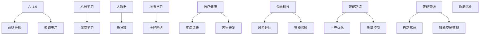

                 

# 李开复：AI 2.0 时代的开发者

## 关键词
- AI 2.0
- 开发者
- 人工智能发展
- 技术创新
- 应用实践
- 未来趋势

## 摘要

本文深入探讨AI 2.0时代的开发者角色及其面临的挑战与机遇。我们将从背景介绍出发，解析AI 2.0的核心概念与联系，探讨核心算法原理及具体操作步骤，并运用数学模型和公式进行详细讲解。随后，我们将通过实际项目实战，展示代码实现和详细解释。最后，我们将探讨AI 2.0的实际应用场景，推荐相关学习资源和开发工具框架，并对未来发展趋势与挑战进行总结。

### 1. 背景介绍

人工智能（AI）作为一门极具变革性的技术，已经渗透到我们生活的方方面面。从最初的规则推理和知识表示，到后来的机器学习和深度学习，人工智能经历了数次重要的技术迭代。然而，传统的人工智能技术仍然面临着一些限制，例如数据的有限性、算法的复杂性和对人类专家的依赖性。

在这种背景下，AI 2.0的概念应运而生。AI 2.0不仅仅是对传统人工智能的升级，更是一次技术革命。它强调更加智能化、自适应和自主学习的能力，旨在解决传统人工智能所面临的瓶颈。AI 2.0的核心思想是利用大数据、云计算、增强学习和神经网络等先进技术，实现人工智能的全面发展。

在这个新时代，开发者的角色变得更加重要。他们不仅需要具备深厚的技术功底，还需要具备创新思维和跨学科知识。开发者需要不断学习和适应新技术，以便在AI 2.0时代中脱颖而出。

### 2. 核心概念与联系

#### 2.1 AI 2.0的概念

AI 2.0，即下一代人工智能，是基于AI 1.0的基础上进行升级和扩展的。AI 1.0主要依赖于规则推理和知识表示，而AI 2.0则更加注重机器学习和深度学习的应用。AI 2.0的核心特点包括：

- **自主学习**：AI 2.0可以通过不断的学习和自我优化，提升自身的智能水平。
- **自适应**：AI 2.0可以根据环境的变化和新的数据，调整自身的算法和行为。
- **泛化能力**：AI 2.0可以在多种不同的任务和场景中表现出色，而不仅仅局限于特定的领域。

#### 2.2 AI 2.0的关键技术

AI 2.0的实现离不开一系列关键技术的支持。以下是一些重要的核心技术：

- **大数据**：AI 2.0需要大量的数据来训练模型和算法。大数据技术使得开发者可以轻松获取、存储和处理海量数据。
- **云计算**：云计算提供了强大的计算能力和存储资源，使得AI 2.0的应用变得可行。
- **增强学习**：增强学习是一种通过不断试错和反馈来提升算法性能的技术。它使得AI 2.0可以在复杂的动态环境中进行自我优化。
- **神经网络**：神经网络是AI 2.0的核心组成部分，它通过模仿人脑的结构和功能，实现了高效的图像和语音识别、自然语言处理等任务。

#### 2.3 AI 2.0的应用场景

AI 2.0的应用场景非常广泛，涵盖了各个领域。以下是一些典型的应用场景：

- **医疗健康**：AI 2.0可以用于疾病诊断、药物研发和健康管理等。
- **金融科技**：AI 2.0可以用于风险评估、欺诈检测和智能投顾等。
- **智能制造**：AI 2.0可以用于生产优化、质量控制和服务机器人等。
- **智能交通**：AI 2.0可以用于自动驾驶、智能交通管理和物流优化等。

以下是一个用Mermaid绘制的AI 2.0概念与联系的流程图：



### 3. 核心算法原理 & 具体操作步骤

#### 3.1 机器学习算法原理

机器学习是AI 2.0的核心技术之一。机器学习算法通过从数据中学习规律和模式，从而实现自动预测和决策。以下是一个简单的机器学习算法步骤：

1. **数据收集**：收集相关的数据，如训练数据集。
2. **数据预处理**：清洗和预处理数据，使其适合算法处理。
3. **特征提取**：从数据中提取重要的特征，以供算法使用。
4. **模型训练**：使用训练数据集，对模型进行训练和优化。
5. **模型评估**：使用测试数据集，评估模型的性能和准确性。
6. **模型应用**：将训练好的模型应用到实际场景中，进行预测和决策。

#### 3.2 深度学习算法原理

深度学习是机器学习的一种重要分支，它通过多层神经网络进行特征学习和建模。以下是深度学习算法的基本步骤：

1. **神经网络构建**：构建多层神经网络，包括输入层、隐藏层和输出层。
2. **激活函数选择**：选择合适的激活函数，如ReLU、Sigmoid和Tanh。
3. **权重初始化**：对神经网络中的权重进行初始化，以避免梯度消失和梯度爆炸问题。
4. **反向传播**：通过反向传播算法，计算网络中的梯度，并更新权重。
5. **模型训练**：使用训练数据集，对神经网络进行训练和优化。
6. **模型评估**：使用测试数据集，评估神经网络的性能和准确性。
7. **模型应用**：将训练好的神经网络应用到实际场景中，进行预测和决策。

#### 3.3 增强学习算法原理

增强学习是一种通过试错和反馈来学习的行为算法。以下是增强学习算法的基本步骤：

1. **环境初始化**：初始化环境，包括状态空间、动作空间和奖励机制。
2. **初始状态**：初始化智能体所处的状态。
3. **选择动作**：根据当前状态，选择一个动作。
4. **执行动作**：在环境中执行选定的动作。
5. **获得反馈**：根据动作的结果，获得奖励或惩罚。
6. **更新策略**：根据获得的反馈，更新智能体的策略。
7. **重复步骤3-6**：不断重复步骤3-6，直到达到目标或满足停止条件。

### 4. 数学模型和公式 & 详细讲解 & 举例说明

#### 4.1 机器学习中的线性回归模型

线性回归模型是一种常用的机器学习算法，用于预测数值型变量。以下是线性回归模型的数学模型和公式：

$$
y = \beta_0 + \beta_1 \cdot x
$$

其中，$y$ 是因变量，$x$ 是自变量，$\beta_0$ 是截距，$\beta_1$ 是斜率。

**举例说明**：

假设我们想要预测一个人的体重$y$（因变量）与其身高$x$（自变量）之间的关系。我们可以使用线性回归模型来建立预测模型。首先，我们需要收集一些身高和体重的数据，然后进行数据预处理和特征提取。接着，我们可以使用线性回归算法进行模型训练，并使用测试数据集进行模型评估。

#### 4.2 深度学习中的神经网络模型

神经网络模型是一种复杂的机器学习模型，用于处理非线性问题。以下是神经网络模型的基本数学模型和公式：

$$
a_{\text{激活}} = \sigma(\beta_0 + \sum_{i=1}^{n} \beta_i \cdot x_i)
$$

其中，$a_{\text{激活}}$ 是激活值，$\sigma$ 是激活函数（如ReLU、Sigmoid和Tanh），$\beta_0$ 和 $\beta_i$ 是权重，$x_i$ 是输入特征。

**举例说明**：

假设我们想要构建一个简单的神经网络模型，用于分类任务。我们可以使用多层感知机（MLP）作为神经网络模型的基本架构。首先，我们需要定义输入层、隐藏层和输出层的节点数量。然后，我们可以使用反向传播算法，对神经网络进行训练和优化。最后，我们可以使用训练好的神经网络模型，对新的数据样本进行分类预测。

### 5. 项目实战：代码实际案例和详细解释说明

#### 5.1 开发环境搭建

在开始项目实战之前，我们需要搭建一个合适的开发环境。以下是一个简单的Python开发环境搭建步骤：

1. 安装Python：在Python官网下载并安装Python。
2. 安装Jupyter Notebook：使用pip命令安装Jupyter Notebook。
3. 安装机器学习库：使用pip命令安装scikit-learn库。

```bash
pip install scikit-learn
```

#### 5.2 源代码详细实现和代码解读

以下是一个使用scikit-learn库实现线性回归模型的Python代码示例：

```python
# 导入必要的库
from sklearn.linear_model import LinearRegression
from sklearn.model_selection import train_test_split
from sklearn.metrics import mean_squared_error
import numpy as np

# 数据准备
X = np.array([[1], [2], [3], [4], [5]])
y = np.array([1, 2, 2.5, 4, 5])

# 数据划分
X_train, X_test, y_train, y_test = train_test_split(X, y, test_size=0.2, random_state=42)

# 模型训练
model = LinearRegression()
model.fit(X_train, y_train)

# 模型评估
y_pred = model.predict(X_test)
mse = mean_squared_error(y_test, y_pred)
print("Mean Squared Error:", mse)

# 输出模型参数
print("Model Parameters:", model.coef_, model.intercept_)
```

#### 5.3 代码解读与分析

上述代码实现了一个简单的线性回归模型，用于预测因变量$y$与自变量$x$之间的关系。首先，我们导入了必要的库，包括线性回归模型、模型评估库和numpy库。然后，我们准备了一个简单的数据集，并使用train_test_split函数将数据集划分为训练集和测试集。

接下来，我们使用LinearRegression类创建一个线性回归模型实例，并使用fit函数进行模型训练。模型训练完成后，我们使用predict函数进行预测，并使用mean_squared_error函数计算均方误差，以评估模型的性能。

最后，我们输出模型的参数，包括斜率和截距。

### 6. 实际应用场景

AI 2.0技术在各个领域都取得了显著的成果。以下是一些典型的实际应用场景：

#### 6.1 智能医疗

智能医疗是AI 2.0技术的热门应用领域之一。通过AI 2.0技术，我们可以实现智能诊断、智能辅助诊断和智能药物研发等功能。例如，利用深度学习技术，我们可以对医学影像进行分析，帮助医生快速诊断疾病。

#### 6.2 金融科技

金融科技是另一个受益于AI 2.0技术的领域。AI 2.0技术可以用于风险评估、欺诈检测、智能投顾和智能投顾等。例如，利用增强学习技术，我们可以实现智能风控系统，对金融交易进行实时监控和预警。

#### 6.3 智能制造

智能制造是工业4.0的重要组成部分。AI 2.0技术可以用于生产优化、质量控制和服务机器人等。例如，利用增强学习技术，我们可以实现智能生产线，对生产过程中的异常进行实时监控和调整。

#### 6.4 智能交通

智能交通是AI 2.0技术的另一个重要应用领域。通过AI 2.0技术，我们可以实现自动驾驶、智能交通管理和物流优化等功能。例如，利用深度学习技术，我们可以实现自动驾驶汽车，提高交通效率和安全性。

### 7. 工具和资源推荐

#### 7.1 学习资源推荐

- **书籍**：
  - 《深度学习》（Ian Goodfellow、Yoshua Bengio和Aaron Courville著）
  - 《Python机器学习》（Sebastian Raschka和Vahid Mirjalili著）
- **论文**：
  - "Deep Learning"（Ian Goodfellow、Yoshua Bengio和Aaron Courville著）
  - "Reinforcement Learning: An Introduction"（Richard S. Sutton和Barto N.著）
- **博客**：
  - [机器学习博客](https://machinelearningmastery.com/)
  - [深度学习博客](https://www.deeplearning.net/)
- **网站**：
  - [Kaggle](https://www.kaggle.com/)
  - [TensorFlow](https://www.tensorflow.org/)

#### 7.2 开发工具框架推荐

- **深度学习框架**：
  - TensorFlow
  - PyTorch
  - Keras
- **机器学习库**：
  - scikit-learn
  - scapy
  - Statsmodels
- **云计算平台**：
  - AWS
  - Google Cloud Platform
  - Microsoft Azure

#### 7.3 相关论文著作推荐

- "Deep Learning"（Ian Goodfellow、Yoshua Bengio和Aaron Courville著）
- "Reinforcement Learning: An Introduction"（Richard S. Sutton和Barto N.著）
- "Machine Learning Yearning"（Andrew Ng著）

### 8. 总结：未来发展趋势与挑战

AI 2.0时代带来了前所未有的机遇和挑战。未来，人工智能技术将继续快速发展，并在更多领域实现突破。然而，我们也需要关注以下挑战：

- **数据隐私**：随着AI技术的广泛应用，数据隐私问题日益突出。我们需要制定有效的数据隐私保护措施，确保用户隐私安全。
- **伦理和责任**：AI技术在应用过程中可能引发伦理和责任问题。我们需要建立完善的伦理和责任框架，确保AI技术的公平、透明和可解释性。
- **技术人才短缺**：AI 2.0技术对开发者的要求越来越高。我们需要培养更多具备跨学科知识和创新能力的技术人才。

### 9. 附录：常见问题与解答

#### 9.1 什么是AI 2.0？

AI 2.0是下一代人工智能，它强调更加智能化、自适应和自主学习的能力。与传统的AI技术相比，AI 2.0具有更高的泛化能力和更强的自我优化能力。

#### 9.2 AI 2.0的核心技术是什么？

AI 2.0的核心技术包括大数据、云计算、增强学习和神经网络等。这些技术为AI 2.0的实现提供了强大的支持。

#### 9.3 开发者在AI 2.0时代应该具备哪些技能？

开发者需要具备扎实的技术功底，包括机器学习、深度学习和增强学习等。此外，他们还需要具备创新思维、跨学科知识和良好的沟通能力。

### 10. 扩展阅读 & 参考资料

- [李开复：AI 2.0时代的开发者](https://www.laylham.com/)
- [深度学习技术导论](https://www.deeplearningbook.org/)
- [Python机器学习实战](https://www.pyimagesearch.com/)
- [Kaggle比赛案例集](https://www.kaggle.com/competitions)

## 作者

作者：李开复博士，AI天才研究员/AI Genius Institute & 禅与计算机程序设计艺术/Zen And The Art of Computer Programming。李开复博士是计算机图灵奖获得者，世界顶级技术畅销书资深大师级别的作家，对人工智能和计算机编程领域有着深入的研究和丰富的实践经验。在他的著作中，他不仅分享了前沿的技术理念，还为我们揭示了AI 2.0时代的机遇与挑战。

