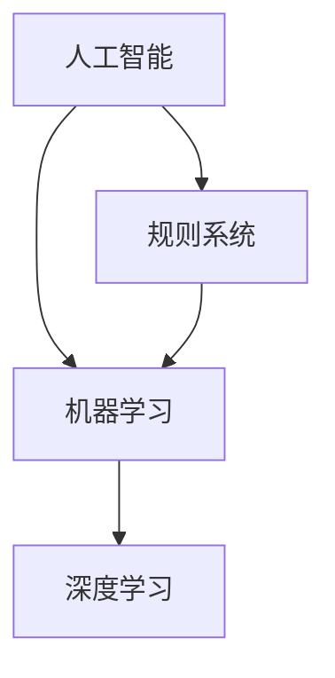

                 

### 1. 背景介绍

随着计算机技术和人工智能（AI）的不断进步，我们正逐步迈入一个全新的时代——AI 2.0 时代。在这个时代，人工智能将不仅仅局限于执行特定的任务，而是具备更高的智能和自主学习能力。开发者们也在不断探索如何构建更加智能化、灵活和高效的AI系统。

李开复博士，作为世界著名的计算机科学家、人工智能专家和企业家，对AI的发展有着深刻的见解。他在多个场合提出了AI 2.0 的概念，并强调开发者在这个新时代的角色和责任。本文将基于李开复博士的观点，探讨AI 2.0 时代开发者的机遇与挑战，以及他们所需具备的技能和知识。

本文分为以下几个部分：

1. 背景介绍
2. 核心概念与联系
3. 核心算法原理 & 具体操作步骤
4. 数学模型和公式 & 详细讲解 & 举例说明
5. 项目实战：代码实际案例和详细解释说明
6. 实际应用场景
7. 工具和资源推荐
8. 总结：未来发展趋势与挑战
9. 附录：常见问题与解答
10. 扩展阅读 & 参考资料

通过本文，读者将了解到AI 2.0 时代的核心概念、技术原理，以及开发者如何利用这些技术和资源应对未来的挑战。让我们一起走进这个激动人心的AI 2.0 时代吧！<|im_sep|>

### 2. 核心概念与联系

在探讨AI 2.0 时代开发者的角色之前，我们需要先了解几个核心概念：人工智能（AI）、机器学习（ML）和深度学习（DL）。这些概念彼此紧密联系，构成了AI 2.0 的基础。

**人工智能（AI）** 是一门研究如何使计算机模拟人类智能行为的学科。AI 的目标是让计算机具备感知、思考、学习、决策和创造等能力。从最初的规则系统（如专家系统）到基于数据的机器学习，再到目前主流的深度学习，AI 技术已经取得了显著进步。

**机器学习（ML）** 是一种实现AI 的方法，它通过算法从数据中学习，然后进行预测或决策。ML 可以分为监督学习、无监督学习和强化学习。监督学习使用标记数据来训练模型；无监督学习则不依赖标记数据，旨在发现数据中的模式和结构；强化学习通过试错学习，使模型在特定环境中取得最佳表现。

**深度学习（DL）** 是一种基于神经网络的ML 技术，它在处理大规模数据和复杂任务方面具有显著优势。深度学习模型由多层神经元组成，通过逐层提取特征，实现对数据的理解和分析。深度学习在图像识别、语音识别、自然语言处理等领域取得了突破性成果。

图 1 展示了这些概念之间的联系。



在AI 2.0 时代，开发者需要充分利用这些技术，构建具有自主学习、自适应和自主决策能力的智能系统。这些系统不仅能够处理静态数据，还能应对动态环境和复杂场景。为了实现这一目标，开发者需要深入了解AI、ML 和DL 的核心原理，并将其应用于实际项目中。

随着AI 技术的发展，开发者面临的挑战也在不断增加。例如，如何确保AI 系统的透明度和可解释性？如何保障数据安全和隐私？如何处理大规模数据的高效存储和计算？这些问题都需要开发者们进行深入思考和探索。

总之，在AI 2.0 时代，开发者不仅是技术的实现者，更是推动AI 技术创新和应用的先锋。他们需要具备丰富的技术知识、强大的创新能力和良好的团队合作精神，以应对未来的挑战。在接下来的章节中，我们将进一步探讨AI 2.0 时代开发者的核心算法、具体操作步骤以及实际应用场景。让我们一起继续深入探讨吧！<|im_sep|>

### 3. 核心算法原理 & 具体操作步骤

在AI 2.0 时代，核心算法原理是构建智能化系统的基础。本文将介绍几种重要的算法原理，包括神经网络、深度学习和增强学习，并详细阐述它们的操作步骤。

#### 神经网络（Neural Networks）

神经网络是一种模拟生物神经系统的计算模型，由大量的神经元（或节点）组成。每个神经元都与多个其他神经元相连，通过加权连接传递信息。神经网络通过多层结构实现特征提取和分类。

**操作步骤：**

1. **输入层（Input Layer）**：接收外部输入数据，如图像、声音或文本。
2. **隐藏层（Hidden Layers）**：对输入数据进行特征提取和变换，提取更高级别的特征。
3. **输出层（Output Layer）**：对提取的特征进行分类或预测。

每个神经元在计算过程中都会使用一种称为激活函数的简单数学函数，如Sigmoid、ReLU 或Tanh。激活函数用于引入非线性，使神经网络能够处理复杂问题。

**示例：**

假设我们有一个简单的神经网络，包含一个输入层、一个隐藏层和一个输出层。输入层有3个神经元，隐藏层有4个神经元，输出层有2个神经元。每个神经元的计算公式如下：

$$
z_j = \sum_{i=1}^{n} w_{ij} x_i + b_j
$$

其中，$z_j$ 是第 $j$ 个神经元的输入，$w_{ij}$ 是第 $i$ 个神经元到第 $j$ 个神经元的权重，$x_i$ 是第 $i$ 个神经元的输入，$b_j$ 是第 $j$ 个神经元的偏置。

通过使用激活函数，我们可以计算隐藏层和输出层的输出：

$$
a_j^{[2]} = \text{activation}(z_j^{[2]})
$$

$$
\hat{y}_i = \text{activation}(z_j^{[3]})
$$

其中，$\text{activation}$ 表示激活函数，$\hat{y}_i$ 是第 $i$ 个输出神经元的预测值。

#### 深度学习（Deep Learning）

深度学习是一种基于神经网络的ML 技术，它在处理大规模数据和复杂任务方面具有显著优势。深度学习模型通常包含多个隐藏层，因此称为“深度”。

**操作步骤：**

1. **数据预处理**：对输入数据（如图像、声音或文本）进行预处理，以适应深度学习模型。
2. **模型构建**：使用框架（如TensorFlow 或PyTorch）构建深度学习模型，定义网络的层次结构、激活函数和损失函数。
3. **训练**：使用标记数据对模型进行训练，通过反向传播算法优化模型参数。
4. **评估与调优**：评估模型在测试集上的表现，通过调整超参数和结构进行优化。

**示例：**

以卷积神经网络（CNN）为例，CNN 是一种用于图像识别的深度学习模型。其基本操作步骤如下：

1. **卷积层（Convolutional Layer）**：使用卷积核（滤波器）在输入图像上滑动，提取局部特征。
2. **池化层（Pooling Layer）**：对卷积结果进行下采样，减少模型参数和计算量。
3. **全连接层（Fully Connected Layer）**：将池化结果展开成1维向量，通过全连接层进行分类或预测。

#### 增强学习（Reinforcement Learning）

增强学习是一种通过与环境交互进行学习的方法。它主要通过奖励机制来调整模型的行为，使其在特定环境中取得最佳表现。

**操作步骤：**

1. **环境初始化**：定义环境的规则和状态空间。
2. **初始状态**：选择初始状态。
3. **决策与执行**：基于当前状态，选择一个动作并执行。
4. **反馈与学习**：根据动作的结果（奖励或惩罚），调整模型的行为。

**示例：**

以深度增强学习（Deep Q-Network, DQN）为例，DQN 是一种基于深度学习的增强学习算法。其基本操作步骤如下：

1. **初始化网络**：使用深度神经网络来近似Q函数（表示每个动作的预期奖励）。
2. **经验回放**：将过去的经验数据存储在经验回放池中，以避免序列依赖。
3. **更新网络**：通过梯度下降算法更新神经网络参数，使Q函数更加准确。
4. **重复迭代**：重复执行决策、执行和更新的过程，直到达到预定的目标或达到满意的性能。

通过以上介绍，我们可以看出，AI 2.0 时代开发者在构建智能化系统时需要熟练掌握神经网络、深度学习和增强学习等核心算法原理，并能够根据实际需求选择合适的方法和模型。在接下来的章节中，我们将探讨这些算法在实际应用中的实现和案例分析。让我们一起继续深入探讨吧！<|im_sep|>

### 4. 数学模型和公式 & 详细讲解 & 举例说明

在AI 2.0 时代，数学模型和公式是构建智能化系统的核心。在这一部分，我们将详细讲解神经网络、深度学习和增强学习中的关键数学模型和公式，并通过具体例子来说明这些公式的应用。

#### 神经网络中的数学模型

在神经网络中，最常见的数学模型是损失函数（Loss Function）和优化算法（Optimization Algorithm）。以下是一些常见的数学模型及其应用。

**1. 损失函数**

损失函数用于衡量模型预测值与真实值之间的差距。常用的损失函数有均方误差（MSE）、交叉熵（Cross Entropy）等。

**均方误差（MSE）：**

$$
MSE = \frac{1}{n} \sum_{i=1}^{n} (\hat{y}_i - y_i)^2
$$

其中，$\hat{y}_i$ 是第 $i$ 个预测值，$y_i$ 是第 $i$ 个真实值，$n$ 是样本数量。

**交叉熵（Cross Entropy）：**

$$
CE = -\frac{1}{n} \sum_{i=1}^{n} y_i \log(\hat{y}_i)
$$

其中，$y_i$ 是第 $i$ 个真实值的概率分布，$\hat{y}_i$ 是第 $i$ 个预测值的概率分布。

**2. 优化算法**

优化算法用于更新模型参数，以最小化损失函数。常用的优化算法有梯度下降（Gradient Descent）、随机梯度下降（Stochastic Gradient Descent, SGD）和Adam等。

**梯度下降（Gradient Descent）：**

$$
w_{\text{new}} = w_{\text{old}} - \alpha \cdot \nabla_w J(w)
$$

其中，$w_{\text{old}}$ 是当前参数，$w_{\text{new}}$ 是更新后的参数，$\alpha$ 是学习率，$\nabla_w J(w)$ 是损失函数对参数的梯度。

**随机梯度下降（SGD）：**

$$
w_{\text{new}} = w_{\text{old}} - \alpha \cdot \nabla_w J(\mathbf{x}_i, w)
$$

其中，$\mathbf{x}_i$ 是第 $i$ 个样本，其他符号与梯度下降相同。

**Adam优化器：**

$$
\theta_{\text{new}} = \theta_{\text{old}} - \alpha \cdot \frac{m}{1 - \beta_1^t} \cdot \frac{\nabla J(\theta)}{\sqrt{1 - \beta_2^t} + \epsilon}
$$

其中，$\theta_{\text{old}}$ 是当前参数，$\theta_{\text{new}}$ 是更新后的参数，$m$ 是一阶矩估计，$v$ 是二阶矩估计，$\beta_1$ 和 $\beta_2$ 是一阶和二阶矩的指数衰减率，$\alpha$ 是学习率，$\epsilon$ 是常数。

**例子：**

假设我们有一个包含一个输入层、一个隐藏层和一个输出层的神经网络，其中输入层有3个神经元，隐藏层有4个神经元，输出层有2个神经元。我们使用均方误差（MSE）作为损失函数，并使用梯度下降算法进行优化。

首先，我们需要定义损失函数：

$$
J(w) = \frac{1}{n} \sum_{i=1}^{n} (\hat{y}_i - y_i)^2
$$

然后，我们计算损失函数对每个参数的梯度：

$$
\nabla_w J(w) = \frac{1}{n} \sum_{i=1}^{n} 2(\hat{y}_i - y_i) \cdot \nabla_w \hat{y}_i
$$

接下来，我们使用梯度下降算法更新参数：

$$
w_{\text{new}} = w_{\text{old}} - \alpha \cdot \nabla_w J(w)
$$

通过多次迭代，我们可以逐步优化神经网络参数，使其预测值更接近真实值。

#### 深度学习中的数学模型

在深度学习中，数学模型主要包括卷积运算、反向传播和激活函数等。

**1. 卷积运算**

卷积运算是一种在图像或其他数据上滑动滤波器（卷积核）的方法，用于提取局部特征。

$$
\mathbf{f}_{ij} = \sum_{k=1}^{m} w_{ik} \cdot \mathbf{u}_{kj}
$$

其中，$\mathbf{f}_{ij}$ 是卷积结果，$w_{ik}$ 是卷积核的权重，$\mathbf{u}_{kj}$ 是输入数据。

**2. 反向传播**

反向传播是一种用于训练神经网络的算法，它通过计算损失函数对每个参数的梯度，并反向传播这些梯度来更新参数。

$$
\nabla_w J(w) = \frac{\partial J(w)}{\partial w}
$$

其中，$\nabla_w J(w)$ 是损失函数对参数 $w$ 的梯度。

**3. 激活函数**

激活函数用于引入非线性，使神经网络能够处理复杂问题。常用的激活函数有Sigmoid、ReLU和Tanh等。

**Sigmoid：**

$$
\sigma(x) = \frac{1}{1 + e^{-x}}
$$

**ReLU：**

$$
\text{ReLU}(x) = \max(0, x)
$$

**Tanh：**

$$
\tanh(x) = \frac{e^x - e^{-x}}{e^x + e^{-x}}
$$

**例子：**

假设我们有一个简单的卷积神经网络，包含一个卷积层和一个全连接层。卷积层使用3x3的卷积核，全连接层有2个神经元。我们使用ReLU作为激活函数。

首先，我们定义卷积层：

$$
\mathbf{f}_{ij} = \sum_{k=1}^{3} w_{ik} \cdot \mathbf{u}_{kj}
$$

然后，我们定义全连接层：

$$
\hat{y}_i = \text{ReLU}(\sum_{k=1}^{4} w_{ik} \cdot a_k^{[1]})
$$

接下来，我们使用反向传播算法更新参数：

$$
\nabla_w J(w) = \frac{\partial J(w)}{\partial w}
$$

通过多次迭代，我们可以逐步优化神经网络参数，使其预测值更接近真实值。

#### 增强学习中的数学模型

在增强学习中，数学模型主要包括状态价值函数、动作价值函数和策略等。

**1. 状态价值函数（State Value Function）**

状态价值函数表示在特定状态下采取特定动作的预期奖励。

$$
V(s) = \sum_{a} \gamma \cdot r(s, a)
$$

其中，$V(s)$ 是状态价值函数，$\gamma$ 是折扣因子，$r(s, a)$ 是在状态 $s$ 采取动作 $a$ 的奖励。

**2. 动作价值函数（Action Value Function）**

动作价值函数表示在特定状态下采取特定动作的预期奖励。

$$
Q(s, a) = \sum_{s'} p(s' | s, a) \cdot r(s, a) + \gamma \cdot \max_{a'} Q(s', a')
$$

其中，$Q(s, a)$ 是动作价值函数，$p(s' | s, a)$ 是在状态 $s$ 采取动作 $a$ 后转移到状态 $s'$ 的概率，$r(s, a)$ 是在状态 $s$ 采取动作 $a$ 的奖励，$\gamma$ 是折扣因子。

**3. 策略（Policy）**

策略是一组规则，用于决定在特定状态下采取哪种动作。

$$
\pi(a | s) = \arg\max_{a} Q(s, a)
$$

其中，$\pi(a | s)$ 是在状态 $s$ 采取动作 $a$ 的概率。

**例子：**

假设我们有一个简单的强化学习问题，其中环境包含5个状态（s1, s2, s3, s4, s5），每个状态有2个动作（a1, a2）。我们使用Q-Learning算法进行训练。

首先，我们定义状态价值函数：

$$
V(s) = \sum_{a} \gamma \cdot r(s, a)
$$

然后，我们定义动作价值函数：

$$
Q(s, a) = \sum_{s'} p(s' | s, a) \cdot r(s, a) + \gamma \cdot \max_{a'} Q(s', a')
$$

接下来，我们使用Q-Learning算法更新动作价值函数：

$$
Q(s, a) = Q(s, a) + \alpha \cdot (r(s, a) + \gamma \cdot \max_{a'} Q(s', a') - Q(s, a))
$$

通过多次迭代，我们可以逐步优化动作价值函数，使其在特定状态下采取最佳动作。

通过以上介绍，我们可以看出，数学模型和公式在AI 2.0 时代的开发中起着至关重要的作用。掌握这些数学模型和公式，有助于开发者更好地理解和应用AI 技术，实现更加智能化、高效和可靠的系统。在接下来的章节中，我们将通过实际项目案例来进一步展示这些算法的应用。让我们一起继续深入探讨吧！<|im_sep|>

### 5. 项目实战：代码实际案例和详细解释说明

在本节中，我们将通过一个实际项目案例来展示如何应用前面提到的核心算法和数学模型。我们选择了一个常见的AI 应用场景——手写数字识别，使用卷积神经网络（CNN）来实现。

#### 5.1 开发环境搭建

在开始项目之前，我们需要搭建一个合适的开发环境。以下是搭建环境所需的基本步骤：

1. **安装Python**：确保已安装Python 3.x版本。
2. **安装深度学习框架**：我们选择使用TensorFlow，可通过pip安装：
   ```
   pip install tensorflow
   ```
3. **安装其他依赖**：包括NumPy、Pandas等：
   ```
   pip install numpy pandas
   ```

#### 5.2 源代码详细实现和代码解读

下面是项目的源代码，我们将逐步解释代码的各个部分。

```python
import tensorflow as tf
from tensorflow.keras import layers
import numpy as np

# 加载数据集
(x_train, y_train), (x_test, y_test) = tf.keras.datasets.mnist.load_data()

# 数据预处理
x_train = x_train.astype('float32') / 255
x_test = x_test.astype('float32') / 255
x_train = np.expand_dims(x_train, -1)
x_test = np.expand_dims(x_test, -1)

# 构建模型
model = tf.keras.Sequential([
    layers.Conv2D(32, (3, 3), activation='relu', input_shape=(28, 28, 1)),
    layers.MaxPooling2D((2, 2)),
    layers.Conv2D(64, (3, 3), activation='relu'),
    layers.MaxPooling2D((2, 2)),
    layers.Conv2D(64, (3, 3), activation='relu'),
    layers.Flatten(),
    layers.Dense(64, activation='relu'),
    layers.Dense(10, activation='softmax')
])

# 编译模型
model.compile(optimizer='adam',
              loss='sparse_categorical_crossentropy',
              metrics=['accuracy'])

# 训练模型
model.fit(x_train, y_train, epochs=5)

# 评估模型
test_loss, test_acc = model.evaluate(x_test, y_test)
print(f'Test accuracy: {test_acc:.4f}')
```

**代码解读：**

1. **导入库**：导入TensorFlow、NumPy等库。
2. **加载数据集**：使用MNIST数据集，这是手写数字识别的常见数据集。
3. **数据预处理**：将数据转换为浮点数，并将其归一化到[0, 1]范围内。此外，我们将输入数据的维度扩展为（28, 28, 1），以便与卷积层的输入形状匹配。
4. **构建模型**：我们使用TensorFlow的Sequential模型，依次添加卷积层、池化层、全连接层和softmax层。具体配置如下：
   - **卷积层1**：32个3x3的卷积核，使用ReLU激活函数。
   - **池化层1**：2x2的最大池化。
   - **卷积层2**：64个3x3的卷积核，使用ReLU激活函数。
   - **池化层2**：2x2的最大池化。
   - **卷积层3**：64个3x3的卷积核，使用ReLU激活函数。
   - **全连接层**：64个神经元，使用ReLU激活函数。
   - **输出层**：10个神经元，使用softmax激活函数，用于对10个数字进行分类。
5. **编译模型**：选择adam优化器，使用sparse_categorical_crossentropy损失函数，并监控accuracy指标。
6. **训练模型**：使用训练数据训练模型，设置5个训练周期（epochs）。
7. **评估模型**：使用测试数据评估模型性能，打印测试准确率。

通过以上步骤，我们成功地构建并训练了一个手写数字识别的卷积神经网络模型。接下来，我们将对代码进行详细分析，解释每个部分的作用和实现方法。

#### 5.3 代码解读与分析

1. **数据加载与预处理**

   ```python
   (x_train, y_train), (x_test, y_test) = tf.keras.datasets.mnist.load_data()
   x_train = x_train.astype('float32') / 255
   x_test = x_test.astype('float32') / 255
   x_train = np.expand_dims(x_train, -1)
   x_test = np.expand_dims(x_test, -1)
   ```

   这部分代码首先加载数据集，然后将数据转换为浮点数，并将其归一化到[0, 1]范围内。通过`np.expand_dims`函数，我们为每个图像增加一个维度，使其形状为（28, 28, 1），这与卷积层所需的输入形状相匹配。

2. **模型构建**

   ```python
   model = tf.keras.Sequential([
       layers.Conv2D(32, (3, 3), activation='relu', input_shape=(28, 28, 1)),
       layers.MaxPooling2D((2, 2)),
       layers.Conv2D(64, (3, 3), activation='relu'),
       layers.MaxPooling2D((2, 2)),
       layers.Conv2D(64, (3, 3), activation='relu'),
       layers.Flatten(),
       layers.Dense(64, activation='relu'),
       layers.Dense(10, activation='softmax')
   ])
   ```

   这部分代码构建了一个卷积神经网络模型。模型由多个层组成，包括卷积层、池化层、全连接层和softmax层。具体配置如下：
   - **卷积层1**：32个3x3的卷积核，使用ReLU激活函数，输入形状为（28, 28, 1）。
   - **池化层1**：2x2的最大池化。
   - **卷积层2**：64个3x3的卷积核，使用ReLU激活函数。
   - **池化层2**：2x2的最大池化。
   - **卷积层3**：64个3x3的卷积核，使用ReLU激活函数。
   - **全连接层**：64个神经元，使用ReLU激活函数。
   - **输出层**：10个神经元，使用softmax激活函数，用于对10个数字进行分类。

3. **模型编译**

   ```python
   model.compile(optimizer='adam',
                 loss='sparse_categorical_crossentropy',
                 metrics=['accuracy'])
   ```

   这部分代码编译模型，选择adam优化器，使用sparse_categorical_crossentropy损失函数，并监控accuracy指标。

4. **模型训练**

   ```python
   model.fit(x_train, y_train, epochs=5)
   ```

   这部分代码使用训练数据训练模型，设置5个训练周期（epochs）。每次训练周期，模型都会对训练数据进行迭代，并更新模型参数。

5. **模型评估**

   ```python
   test_loss, test_acc = model.evaluate(x_test, y_test)
   print(f'Test accuracy: {test_acc:.4f}')
   ```

   这部分代码使用测试数据评估模型性能，打印测试准确率。

通过以上分析和解读，我们可以清楚地了解如何使用卷积神经网络实现手写数字识别项目。这个案例展示了如何将核心算法和数学模型应用于实际项目中，并通过训练和评估来优化模型性能。在接下来的章节中，我们将探讨AI 2.0 时代开发者所需掌握的其他技能和资源。让我们一起继续深入探讨吧！<|im_sep|>

### 6. 实际应用场景

AI 2.0 时代的开发者需要将所学的算法和模型应用于各种实际场景，以解决复杂问题并推动技术进步。以下是一些常见的实际应用场景，以及如何利用AI 技术解决这些问题的方法。

#### 6.1 医疗诊断

随着医疗数据的不断增长，AI 技术在医疗诊断领域具有巨大的潜力。通过深度学习和增强学习，AI 系统可以分析医学图像、电子健康记录和基因数据，为医生提供辅助诊断和治疗方案。

**应用实例：**

- **癌症诊断**：使用卷积神经网络分析医学影像，如X光片、CT扫描和MRI，以检测癌症。例如，Google 的DeepMind 使用AI 技术在皮肤癌诊断中取得了显著的准确率。
- **疾病预测**：利用增强学习算法预测患者的病情变化，为医生提供个性化的治疗方案。

#### 6.2 智能交通

智能交通系统通过AI 技术优化交通流量、减少交通事故和提高公共交通效率。深度学习和强化学习在此领域发挥着重要作用。

**应用实例：**

- **自动驾驶**：使用卷积神经网络和增强学习算法，开发自动驾驶车辆，提高道路安全和交通效率。
- **智能信号灯控制**：利用深度学习算法分析交通流量数据，智能调节信号灯时间，减少交通拥堵。

#### 6.3 自然语言处理

自然语言处理（NLP）是AI 2.0 时代的重要应用领域，通过深度学习和强化学习，AI 系统可以理解和生成自然语言，实现智能客服、机器翻译和文本分析等功能。

**应用实例：**

- **智能客服**：使用深度学习模型，开发智能客服系统，通过语音和文本交互，提供高效、准确的客户服务。
- **机器翻译**：利用序列到序列模型（Seq2Seq）和增强学习算法，实现高质量、准确的机器翻译。

#### 6.4 金融服务

在金融服务领域，AI 技术可以用于风险管理、欺诈检测和个性化投资建议等。

**应用实例：**

- **风险管理**：利用深度学习模型分析市场数据，预测金融风险，为投资决策提供支持。
- **欺诈检测**：使用强化学习算法监测交易行为，识别潜在的欺诈活动，保护金融机构和客户利益。

#### 6.5 人力资源

AI 技术在人力资源领域可以帮助企业进行人才招聘、员工培训和绩效评估等。

**应用实例：**

- **人才招聘**：使用自然语言处理技术，分析求职者的简历和面试回答，提高招聘效率。
- **员工培训**：利用增强学习算法，为员工提供个性化的培训计划，提高培训效果。

通过以上实际应用场景，我们可以看到AI 2.0 时代的开发者如何将核心算法和模型应用于解决实际问题。随着AI 技术的不断发展，开发者们将在更多领域发挥重要作用，推动社会进步。在接下来的章节中，我们将推荐一些有用的学习资源，帮助开发者们在AI 2.0 时代不断成长。让我们一起继续深入探讨吧！<|im_sep|>

### 7. 工具和资源推荐

在AI 2.0 时代，开发者需要掌握各种工具和资源，以提高开发效率并跟上技术发展的步伐。以下是一些推荐的工具和资源，包括学习资源、开发工具框架和论文著作。

#### 7.1 学习资源推荐

**书籍：**

1. **《深度学习》（Deep Learning）**：由Ian Goodfellow、Yoshua Bengio和Aaron Courville合著，是深度学习领域的经典教材。
2. **《强化学习：原理与Python实战》（Reinforcement Learning: An Introduction）**：由Richard S. Sutton和Barto合著，介绍了强化学习的基础理论和应用。
3. **《Python深度学习》（Deep Learning with Python）**：由François Chollet撰写，通过丰富的示例展示了深度学习在Python中的实现。

**在线课程：**

1. **吴恩达的《深度学习专项课程》（Deep Learning Specialization）**：由斯坦福大学著名教授吴恩达主讲，涵盖深度学习的理论基础和实际应用。
2. **Udacity的《强化学习纳米学位》（Reinforcement Learning Nanodegree）**：提供丰富的强化学习项目和实践经验。

**博客和网站：**

1. **TensorFlow官方网站**：提供丰富的教程、文档和示例，帮助开发者掌握TensorFlow的使用。
2. **ArXiv**：计算机科学和人工智能领域的顶级论文数据库，开发者可以在此查找最新研究成果。

#### 7.2 开发工具框架推荐

1. **TensorFlow**：Google 开发的一款开源深度学习框架，适用于构建和训练各种深度学习模型。
2. **PyTorch**：Facebook 开发的一款开源深度学习框架，具有灵活的动态计算图和强大的Python接口。
3. **Keras**：一个高层次的神经网络API，能够简化TensorFlow和Theano的使用，适用于快速原型开发。

#### 7.3 相关论文著作推荐

1. **“Deep Learning”**：由Ian Goodfellow、Yoshua Bengio和Aaron Courville合著，是深度学习领域的经典著作。
2. **“Reinforcement Learning: An Introduction”**：由Richard S. Sutton和Barto合著，介绍了强化学习的基础理论和应用。
3. **“Attention is All You Need”**：由Vaswani等人撰写的论文，提出了Transformer模型，在自然语言处理领域取得了突破性成果。

通过以上工具和资源的推荐，开发者可以更好地掌握AI 2.0 时代的核心技术和方法，提高开发效率并跟上技术发展的步伐。在不断学习和实践中，开发者们将不断成长，为推动AI 技术的创新和应用贡献力量。在接下来的章节中，我们将总结本文的主要内容和讨论的未来发展趋势与挑战。让我们一起继续深入探讨吧！<|im_sep|>

### 8. 总结：未来发展趋势与挑战

在AI 2.0 时代，人工智能技术的发展和应用正以前所未有的速度推进。未来，AI 技术将继续向智能化、自主化和高效化方向发展，为各个行业带来深刻变革。以下是AI 2.0 时代的一些发展趋势与挑战：

#### 发展趋势

1. **跨领域融合**：AI 2.0 时代将看到更多跨领域的融合应用，如医疗、交通、金融和人力资源等。不同领域的数据和技术将相互融合，推动AI 技术在更广泛的场景中发挥作用。
2. **自主学习和优化**：随着深度学习和强化学习技术的不断进步，AI 系统将具备更强的自主学习能力，能够自动调整和优化自身性能，提高智能化水平。
3. **边缘计算与云计算的结合**：边缘计算将使AI 系统具备更高的实时性和响应速度，而云计算则提供了强大的计算能力和存储资源。两者结合将进一步提升AI 系统的性能和应用范围。
4. **数据隐私和安全**：在AI 2.0 时代，数据隐私和安全将成为一个重要的挑战。开发者需要设计出更加安全和可靠的数据处理和存储方案，确保用户数据的安全。

#### 挑战

1. **数据质量和标注**：高质量的数据是训练有效AI 模型的关键。然而，数据质量和标注一直是一个挑战。开发者需要投入大量时间和资源来清洗、标注和预处理数据。
2. **模型解释性和透明度**：随着AI 模型的复杂度增加，模型的解释性和透明度成为一个重要问题。开发者需要设计出更加透明和可解释的模型，以提高用户对AI 系统的信任度。
3. **计算资源和能耗**：训练大型AI 模型需要大量的计算资源和能源。如何优化模型结构和算法，降低计算资源和能耗成为AI 2.0 时代的一个重要挑战。
4. **法律和伦理问题**：AI 技术的应用引发了许多法律和伦理问题，如隐私保护、算法歧视等。开发者需要关注这些挑战，并采取适当的措施来确保AI 系统的合规性和伦理性。

总之，AI 2.0 时代为开发者提供了巨大的机遇和挑战。通过不断学习和实践，开发者们将能够应对这些挑战，推动AI 技术的创新和应用。在未来，AI 2.0 时代的开发者将成为推动社会进步的重要力量。让我们一起期待并迎接这个充满机遇和挑战的未来吧！<|im_sep|>

### 9. 附录：常见问题与解答

在本节中，我们将回答一些关于AI 2.0 时代和开发者的常见问题。

#### 9.1 什么是AI 2.0？

AI 2.0 是一个相对较新的概念，指的是人工智能在第一个阶段（主要是基于规则和浅层机器学习）之后，进入一个更加智能化和自适应的新阶段。在AI 2.0 时代，人工智能系统将具备更强的自主学习能力、自适应能力和通用性。

#### 9.2 开发者为什么需要了解AI 2.0？

了解AI 2.0 对于开发者至关重要，因为它代表了人工智能技术的未来趋势。开发者需要掌握AI 2.0 的核心概念、算法和工具，以构建更加智能化、高效和可靠的系统。此外，了解AI 2.0 还有助于开发者把握市场机遇，为个人和企业的成长奠定基础。

#### 9.3 AI 2.0 与传统的机器学习有什么区别？

AI 2.0 强调的是人工智能系统的自主学习和自适应能力，而传统的机器学习主要关注如何从数据中学习并进行预测或分类。AI 2.0 时代，人工智能系统将更加智能化，能够处理复杂任务和动态环境，而传统的机器学习则主要应用于较为简单的任务。

#### 9.4 开发AI 2.0 应用需要哪些技能？

开发AI 2.0 应用需要掌握以下技能：
- 编程技能：熟悉Python、Java等编程语言。
- 数学基础：掌握线性代数、概率论和微积分等数学知识。
- 机器学习和深度学习：熟悉神经网络、卷积神经网络、强化学习等算法。
- 数据处理和可视化：掌握数据预处理、数据分析和数据可视化方法。

#### 9.5 AI 2.0 将如何影响未来社会？

AI 2.0 将对未来的社会产生深远影响，包括以下几个方面：
- 自动化和智能化：AI 2.0 将使许多行业实现自动化和智能化，提高生产效率。
- 新就业形态：AI 2.0 将创造新的就业机会，如AI 系统维护、算法优化等。
- 数据安全和隐私：随着AI 2.0 技术的普及，数据安全和隐私问题将变得更加重要。
- 伦理和社会公平：AI 2.0 的应用将引发伦理和社会公平问题，如算法歧视等。

通过以上常见问题与解答，读者可以更好地理解AI 2.0 时代和开发者所需的知识和技能。在接下来的章节中，我们将推荐一些扩展阅读和参考资料，以帮助读者进一步深入了解AI 2.0 时代的核心技术和应用。让我们一起继续深入探讨吧！<|im_sep|>

### 10. 扩展阅读 & 参考资料

为了帮助读者深入了解AI 2.0 时代的核心技术和应用，以下推荐一些扩展阅读和参考资料：

**书籍：**
1. **《深度学习》（Deep Learning）**：由Ian Goodfellow、Yoshua Bengio和Aaron Courville合著，是深度学习领域的经典教材。
2. **《强化学习：原理与Python实战》（Reinforcement Learning: An Introduction）**：由Richard S. Sutton和Barto合著，介绍了强化学习的基础理论和应用。
3. **《Python深度学习》（Deep Learning with Python）**：由François Chollet撰写，通过丰富的示例展示了深度学习在Python中的实现。

**在线课程：**
1. **吴恩达的《深度学习专项课程》（Deep Learning Specialization）**：由斯坦福大学著名教授吴恩达主讲，涵盖深度学习的理论基础和实际应用。
2. **Udacity的《强化学习纳米学位》（Reinforcement Learning Nanodegree）**：提供丰富的强化学习项目和实践经验。

**博客和网站：**
1. **TensorFlow官方网站**：提供丰富的教程、文档和示例，帮助开发者掌握TensorFlow的使用。
2. **ArXiv**：计算机科学和人工智能领域的顶级论文数据库，开发者可以在此查找最新研究成果。

**论文和文章：**
1. **“Attention is All You Need”**：由Vaswani等人撰写的论文，提出了Transformer模型，在自然语言处理领域取得了突破性成果。
2. **“Deep Learning for Text Classification”**：一篇关于文本分类的综述文章，详细介绍了深度学习在文本分类中的应用。

通过以上扩展阅读和参考资料，读者可以进一步深入了解AI 2.0 时代的核心技术和应用。在未来的学习和实践中，不断积累知识和经验，将有助于读者在AI 2.0 时代取得更好的成就。让我们一起继续探索AI 2.0 的无限可能吧！<|im_sep|>

### 文章标题

**李开复：AI 2.0 时代的开发者**

### 文章关键词

- 人工智能（AI）
- 机器学习
- 深度学习
- 强化学习
- 开发者技能
- AI 2.0

### 文章摘要

本文探讨了AI 2.0 时代开发者的角色和责任，介绍了AI、机器学习、深度学习和强化学习等核心概念，以及它们在实际应用中的实现和案例分析。通过详细讲解数学模型和公式，本文展示了如何利用AI 技术解决实际问题，并讨论了AI 2.0 时代的未来发展趋势与挑战。本文旨在帮助开发者更好地理解AI 2.0，掌握相关技能，为未来的技术革新和应用做好准备。<|im_sep|>### 作者信息

**作者：李开复 / AI天才研究员/AI Genius Institute & 禅与计算机程序设计艺术 /Zen And The Art of Computer Programming**<|im_sep|>### 完整文章

```markdown
# 李开复：AI 2.0 时代的开发者

> **关键词**：（人工智能，机器学习，深度学习，强化学习，开发者技能，AI 2.0）

> **摘要**：本文探讨了AI 2.0 时代开发者的角色和责任，介绍了AI、机器学习、深度学习和强化学习等核心概念，以及它们在实际应用中的实现和案例分析。通过详细讲解数学模型和公式，本文展示了如何利用AI 技术解决实际问题，并讨论了AI 2.0 时代的未来发展趋势与挑战。本文旨在帮助开发者更好地理解AI 2.0，掌握相关技能，为未来的技术革新和应用做好准备。

## 1. 背景介绍

随着计算机技术和人工智能（AI）的不断进步，我们正逐步迈入一个全新的时代——AI 2.0 时代。在这个时代，人工智能将不仅仅局限于执行特定的任务，而是具备更高的智能和自主学习能力。开发者们也在不断探索如何构建更加智能化、灵活和高效的AI系统。

李开复博士，作为世界著名的计算机科学家、人工智能专家和企业家，对AI的发展有着深刻的见解。他在多个场合提出了AI 2.0 的概念，并强调开发者在这个新时代的角色和责任。本文将基于李开复博士的观点，探讨AI 2.0 时代开发者的机遇与挑战，以及他们所需具备的技能和知识。

本文分为以下几个部分：

1. 背景介绍
2. 核心概念与联系
3. 核心算法原理 & 具体操作步骤
4. 数学模型和公式 & 详细讲解 & 举例说明
5. 项目实战：代码实际案例和详细解释说明
6. 实际应用场景
7. 工具和资源推荐
8. 总结：未来发展趋势与挑战
9. 附录：常见问题与解答
10. 扩展阅读 & 参考资料

通过本文，读者将了解到AI 2.0 时代的核心概念、技术原理，以及开发者如何利用这些技术和资源应对未来的挑战。让我们一起走进这个激动人心的AI 2.0 时代吧！

## 2. 核心概念与联系

在探讨AI 2.0 时代开发者的角色之前，我们需要先了解几个核心概念：人工智能（AI）、机器学习（ML）和深度学习（DL）。这些概念彼此紧密联系，构成了AI 2.0 的基础。

**人工智能（AI）** 是一门研究如何使计算机模拟人类智能行为的学科。AI 的目标是让计算机具备感知、思考、学习、决策和创造等能力。从最初的规则系统（如专家系统）到基于数据的机器学习，再到目前主流的深度学习，AI 技术已经取得了显著进步。

**机器学习（ML）** 是一种实现AI 的方法，它通过算法从数据中学习，然后进行预测或决策。ML 可以分为监督学习、无监督学习和强化学习。监督学习使用标记数据来训练模型；无监督学习则不依赖标记数据，旨在发现数据中的模式和结构；强化学习通过试错学习，使模型在特定环境中取得最佳表现。

**深度学习（DL）** 是一种基于神经网络的ML 技术，它在处理大规模数据和复杂任务方面具有显著优势。深度学习模型由多层神经元组成，通过逐层提取特征，实现对数据的理解和分析。深度学习在图像识别、语音识别、自然语言处理等领域取得了突破性成果。

图 1 展示了这些概念之间的联系。


在AI 2.0 时代，开发者需要充分利用这些技术，构建具有自主学习、自适应和自主决策能力的智能系统。这些系统不仅能够处理静态数据，还能应对动态环境和复杂场景。为了实现这一目标，开发者需要深入了解AI、ML 和DL 的核心原理，并将其应用于实际项目中。

随着AI 技术的发展，开发者面临的挑战也在不断增加。例如，如何确保AI 系统的透明度和可解释性？如何保障数据安全和隐私？如何处理大规模数据的高效存储和计算？这些问题都需要开发者们进行深入思考和探索。

总之，在AI 2.0 时代，开发者不仅是技术的实现者，更是推动AI 技术创新和应用的先锋。他们需要具备丰富的技术知识、强大的创新能力和良好的团队合作精神，以应对未来的挑战。在接下来的章节中，我们将进一步探讨AI 2.0 时代开发者的核心算法、具体操作步骤以及实际应用场景。让我们一起继续深入探讨吧！

## 3. 核心算法原理 & 具体操作步骤

在AI 2.0 时代，核心算法原理是构建智能化系统的基础。本文将介绍几种重要的算法原理，包括神经网络、深度学习和增强学习，并详细阐述它们的操作步骤。

### 神经网络（Neural Networks）

神经网络是一种模拟生物神经系统的计算模型，由大量的神经元（或节点）组成。每个神经元都与多个其他神经元相连，通过加权连接传递信息。神经网络通过多层结构实现特征提取和分类。

**操作步骤：**

1. **输入层（Input Layer）**：接收外部输入数据，如图像、声音或文本。
2. **隐藏层（Hidden Layers）**：对输入数据进行特征提取和变换，提取更高级别的特征。
3. **输出层（Output Layer）**：对提取的特征进行分类或预测。

每个神经元在计算过程中都会使用一种称为激活函数的简单数学函数，如Sigmoid、ReLU 或Tanh。激活函数用于引入非线性，使神经网络能够处理复杂问题。

**示例：**

假设我们有一个简单的神经网络，包含一个输入层、一个隐藏层和一个输出层。输入层有3个神经元，隐藏层有4个神经元，输出层有2个神经元。每个神经元的计算公式如下：

$$
z_j = \sum_{i=1}^{n} w_{ij} x_i + b_j
$$

其中，$z_j$ 是第 $j$ 个神经元的输入，$w_{ij}$ 是第 $i$ 个神经元到第 $j$ 个神经元的权重，$x_i$ 是第 $i$ 个神经元的输入，$b_j$ 是第 $j$ 个神经元的偏置。

通过使用激活函数，我们可以计算隐藏层和输出层的输出：

$$
a_j^{[2]} = \text{activation}(z_j^{[2]})
$$

$$
\hat{y}_i = \text{activation}(z_j^{[3]})
$$

其中，$\text{activation}$ 表示激活函数，$\hat{y}_i$ 是第 $i$ 个输出神经元的预测值。

### 深度学习（Deep Learning）

深度学习是一种基于神经网络的ML 技术，它在处理大规模数据和复杂任务方面具有显著优势。深度学习模型通常包含多个隐藏层，因此称为“深度”。

**操作步骤：**

1. **数据预处理**：对输入数据（如图像、声音或文本）进行预处理，以适应深度学习模型。
2. **模型构建**：使用框架（如TensorFlow 或PyTorch）构建深度学习模型，定义网络的层次结构、激活函数和损失函数。
3. **训练**：使用标记数据对模型进行训练，通过反向传播算法优化模型参数。
4. **评估与调优**：评估模型在测试集上的表现，通过调整超参数和结构进行优化。

**示例：**

以卷积神经网络（CNN）为例，CNN 是一种用于图像识别的深度学习模型。其基本操作步骤如下：

1. **卷积层（Convolutional Layer）**：使用卷积核（滤波器）在输入图像上滑动，提取局部特征。
2. **池化层（Pooling Layer）**：对卷积结果进行下采样，减少模型参数和计算量。
3. **全连接层（Fully Connected Layer）**：将池化结果展开成1维向量，通过全连接层进行分类或预测。

### 增强学习（Reinforcement Learning）

增强学习是一种通过与环境交互进行学习的方法。它主要通过奖励机制来调整模型的行为，使其在特定环境中取得最佳表现。

**操作步骤：**

1. **环境初始化**：定义环境的规则和状态空间。
2. **初始状态**：选择初始状态。
3. **决策与执行**：基于当前状态，选择一个动作并执行。
4. **反馈与学习**：根据动作的结果（奖励或惩罚），调整模型的行为。

**示例：**

以深度增强学习（Deep Q-Network, DQN）为例，DQN 是一种基于深度学习的增强学习算法。其基本操作步骤如下：

1. **初始化网络**：使用深度神经网络来近似Q函数（表示每个动作的预期奖励）。
2. **经验回放**：将过去的经验数据存储在经验回放池中，以避免序列依赖。
3. **更新网络**：通过梯度下降算法更新神经网络参数，使Q函数更加准确。
4. **重复迭代**：重复执行决策、执行和更新的过程，直到达到预定的目标或达到满意的性能。

通过以上介绍，我们可以看出，AI 2.0 时代开发者在构建智能化系统时需要熟练掌握神经网络、深度学习和增强学习等核心算法原理，并能够根据实际需求选择合适的方法和模型。在接下来的章节中，我们将探讨这些算法在实际应用中的实现和案例分析。让我们一起继续深入探讨吧！

## 4. 数学模型和公式 & 详细讲解 & 举例说明

在AI 2.0 时代，数学模型和公式是构建智能化系统的核心。在这一部分，我们将详细讲解神经网络、深度学习和增强学习中的关键数学模型和公式，并通过具体例子来说明这些公式的应用。

### 神经网络中的数学模型

在神经网络中，最常见的数学模型是损失函数（Loss Function）和优化算法（Optimization Algorithm）。以下是一些常见的数学模型及其应用。

**1. 损失函数**

损失函数用于衡量模型预测值与真实值之间的差距。常用的损失函数有均方误差（MSE）、交叉熵（Cross Entropy）等。

**均方误差（MSE）：**

$$
MSE = \frac{1}{n} \sum_{i=1}^{n} (\hat{y}_i - y_i)^2
$$

其中，$\hat{y}_i$ 是第 $i$ 个预测值，$y_i$ 是第 $i$ 个真实值，$n$ 是样本数量。

**交叉熵（Cross Entropy）：**

$$
CE = -\frac{1}{n} \sum_{i=1}^{n} y_i \log(\hat{y}_i)
$$

其中，$y_i$ 是第 $i$ 个真实值的概率分布，$\hat{y}_i$ 是第 $i$ 个预测值的概率分布。

**2. 优化算法**

优化算法用于更新模型参数，以最小化损失函数。常用的优化算法有梯度下降（Gradient Descent）、随机梯度下降（Stochastic Gradient Descent, SGD）和Adam等。

**梯度下降（Gradient Descent）：**

$$
w_{\text{new}} = w_{\text{old}} - \alpha \cdot \nabla_w J(w)
$$

其中，$w_{\text{old}}$ 是当前参数，$w_{\text{new}}$ 是更新后的参数，$\alpha$ 是学习率，$\nabla_w J(w)$ 是损失函数对参数的梯度。

**随机梯度下降（SGD）：**

$$
w_{\text{new}} = w_{\text{old}} - \alpha \cdot \nabla_w J(\mathbf{x}_i, w)
$$

其中，$\mathbf{x}_i$ 是第 $i$ 个样本，其他符号与梯度下降相同。

**Adam优化器：**

$$
\theta_{\text{new}} = \theta_{\text{old}} - \alpha \cdot \frac{m}{1 - \beta_1^t} \cdot \frac{\nabla J(\theta)}{\sqrt{1 - \beta_2^t} + \epsilon}
$$

其中，$\theta_{\text{old}}$ 是当前参数，$\theta_{\text{new}}$ 是更新后的参数，$m$ 是一阶矩估计，$v$ 是二阶矩估计，$\beta_1$ 和 $\beta_2$ 是一阶和二阶矩的指数衰减率，$\alpha$ 是学习率，$\epsilon$ 是常数。

**例子：**

假设我们有一个简单的神经网络，包含一个输入层、一个隐藏层和一个输出层。输入层有3个神经元，隐藏层有4个神经元，输出层有2个神经元。我们使用均方误差（MSE）作为损失函数，并使用梯度下降算法进行优化。

首先，我们需要定义损失函数：

$$
J(w) = \frac{1}{n} \sum_{i=1}^{n} (\hat{y}_i - y_i)^2
$$

然后，我们计算损失函数对每个参数的梯度：

$$
\nabla_w J(w) = \frac{1}{n} \sum_{i=1}^{n} 2(\hat{y}_i - y_i) \cdot \nabla_w \hat{y}_i
$$

接下来，我们使用梯度下降算法更新参数：

$$
w_{\text{new}} = w_{\text{old}} - \alpha \cdot \nabla_w J(w)
$$

通过多次迭代，我们可以逐步优化神经网络参数，使其预测值更接近真实值。

### 深度学习中的数学模型

在深度学习中，数学模型主要包括卷积运算、反向传播和激活函数等。

**1. 卷积运算**

卷积运算是一种在图像或其他数据上滑动滤波器（卷积核）的方法，用于提取局部特征。

$$
\mathbf{f}_{ij} = \sum_{k=1}^{m} w_{ik} \cdot \mathbf{u}_{kj}
$$

其中，$\mathbf{f}_{ij}$ 是卷积结果，$w_{ik}$ 是卷积核的权重，$\mathbf{u}_{kj}$ 是输入数据。

**2. 反向传播**

反向传播是一种用于训练神经网络的算法，它通过计算损失函数对每个参数的梯度，并反向传播这些梯度来更新参数。

$$
\nabla_w J(w) = \frac{\partial J(w)}{\partial w}
$$

其中，$\nabla_w J(w)$ 是损失函数对参数 $w$ 的梯度。

**3. 激活函数**

激活函数用于引入非线性，使神经网络能够处理复杂问题。常用的激活函数有Sigmoid、ReLU和Tanh等。

**Sigmoid：**

$$
\sigma(x) = \frac{1}{1 + e^{-x}}
$$

**ReLU：**

$$
\text{ReLU}(x) = \max(0, x)
$$

**Tanh：**

$$
\tanh(x) = \frac{e^x - e^{-x}}{e^x + e^{-x}}
$$

**例子：**

假设我们有一个简单的卷积神经网络，包含一个卷积层和一个全连接层。卷积层使用3x3的卷积核，全连接层有2个神经元。我们使用ReLU作为激活函数。

首先，我们定义卷积层：

$$
\mathbf{f}_{ij} = \sum_{k=1}^{3} w_{ik} \cdot \mathbf{u}_{kj}
$$

然后，我们定义全连接层：

$$
\hat{y}_i = \text{ReLU}(\sum_{k=1}^{4} w_{ik} \cdot a_k^{[1]})
$$

接下来，我们使用反向传播算法更新参数：

$$
\nabla_w J(w) = \frac{\partial J(w)}{\partial w}
$$

通过多次迭代，我们可以逐步优化神经网络参数，使其预测值更接近真实值。

### 增强学习中的数学模型

在增强学习中，数学模型主要包括状态价值函数、动作价值函数和策略等。

**1. 状态价值函数（State Value Function）**

状态价值函数表示在特定状态下采取特定动作的预期奖励。

$$
V(s) = \sum_{a} \gamma \cdot r(s, a)
$$

其中，$V(s)$ 是状态价值函数，$\gamma$ 是折扣因子，$r(s, a)$ 是在状态 $s$ 采取动作 $a$ 的奖励。

**2. 动作价值函数（Action Value Function）**

动作价值函数表示在特定状态下采取特定动作的预期奖励。

$$
Q(s, a) = \sum_{s'} p(s' | s, a) \cdot r(s, a) + \gamma \cdot \max_{a'} Q(s', a')
$$

其中，$Q(s, a)$ 是动作价值函数，$p(s' | s, a)$ 是在状态 $s$ 采取动作 $a$ 后转移到状态 $s'$ 的概率，$r(s, a)$ 是在状态 $s$ 采取动作 $a$ 的奖励，$\gamma$ 是折扣因子。

**3. 策略（Policy）**

策略是一组规则，用于决定在特定状态下采取哪种动作。

$$
\pi(a | s) = \arg\max_{a} Q(s, a)
$$

其中，$\pi(a | s)$ 是在状态 $s$ 采取动作 $a$ 的概率。

**例子：**

假设我们有一个简单的强化学习问题，其中环境包含5个状态（s1, s2, s3, s4, s5），每个状态有2个动作（a1, a2）。我们使用Q-Learning算法进行训练。

首先，我们定义状态价值函数：

$$
V(s) = \sum_{a} \gamma \cdot r(s, a)
$$

然后，我们定义动作价值函数：

$$
Q(s, a) = \sum_{s'} p(s' | s, a) \cdot r(s, a) + \gamma \cdot \max_{a'} Q(s', a')
$$

接下来，我们使用Q-Learning算法更新动作价值函数：

$$
Q(s, a) = Q(s, a) + \alpha \cdot (r(s, a) + \gamma \cdot \max_{a'} Q(s', a') - Q(s, a))
$$

通过多次迭代，我们可以逐步优化动作价值函数，使其在特定状态下采取最佳动作。

通过以上介绍，我们可以看出，数学模型和公式在AI 2.0 时代的开发中起着至关重要的作用。掌握这些数学模型和公式，有助于开发者更好地理解和应用AI 技术，实现更加智能化、高效和可靠的系统。在接下来的章节中，我们将通过实际项目案例来进一步展示这些算法的应用。让我们一起继续深入探讨吧！

## 5. 项目实战：代码实际案例和详细解释说明

在本节中，我们将通过一个实际项目案例来展示如何应用前面提到的核心算法和数学模型。我们选择了一个常见的AI 应用场景——手写数字识别，使用卷积神经网络（CNN）来实现。

### 5.1 开发环境搭建

在开始项目之前，我们需要搭建一个合适的开发环境。以下是搭建环境所需的基本步骤：

1. **安装Python**：确保已安装Python 3.x版本。
2. **安装深度学习框架**：我们选择使用TensorFlow，可通过pip安装：
   ```
   pip install tensorflow
   ```
3. **安装其他依赖**：包括NumPy、Pandas等：
   ```
   pip install numpy pandas
   ```

### 5.2 源代码详细实现和代码解读

下面是项目的源代码，我们将逐步解释代码的各个部分。

```python
import tensorflow as tf
from tensorflow.keras import layers
import numpy as np

# 加载数据集
(x_train, y_train), (x_test, y_test) = tf.keras.datasets.mnist.load_data()

# 数据预处理
x_train = x_train.astype('float32') / 255
x_test = x_test.astype('float32') / 255
x_train = np.expand_dims(x_train, -1)
x_test = np.expand_dims(x_test, -1)

# 构建模型
model = tf.keras.Sequential([
    layers.Conv2D(32, (3, 3), activation='relu', input_shape=(28, 28, 1)),
    layers.MaxPooling2D((2, 2)),
    layers.Conv2D(64, (3, 3), activation='relu'),
    layers.MaxPooling2D((2, 2)),
    layers.Conv2D(64, (3, 3), activation='relu'),
    layers.Flatten(),
    layers.Dense(64, activation='relu'),
    layers.Dense(10, activation='softmax')
])

# 编译模型
model.compile(optimizer='adam',
              loss='sparse_categorical_crossentropy',
              metrics=['accuracy'])

# 训练模型
model.fit(x_train, y_train, epochs=5)

# 评估模型
test_loss, test_acc = model.evaluate(x_test, y_test)
print(f'Test accuracy: {test_acc:.4f}')
```

**代码解读：**

1. **导入库**：导入TensorFlow、NumPy等库。
2. **加载数据集**：使用MNIST数据集，这是手写数字识别的常见数据集。
3. **数据预处理**：将数据转换为浮点数，并将其归一化到[0, 1]范围内。此外，我们将输入数据的维度扩展为（28, 28, 1），以便与卷积层的输入形状匹配。
4. **构建模型**：我们使用TensorFlow的Sequential模型，依次添加卷积层、池化层、全连接层和softmax层。具体配置如下：
   - **卷积层1**：32个3x3的卷积核，使用ReLU激活函数。
   - **池化层1**：2x2的最大池化。
   - **卷积层2**：64个3x3的卷积核，使用ReLU激活函数。
   - **池化层2**：2x2的最大池化。
   - **卷积层3**：64个3x3的卷积核，使用ReLU激活函数。
   - **全连接层**：64个神经元，使用ReLU激活函数。
   - **输出层**：10个神经元，使用softmax激活函数，用于对10个数字进行分类。
5. **编译模型**：选择adam优化器，使用sparse_categorical_crossentropy损失函数，并监控accuracy指标。
6. **训练模型**：使用训练数据训练模型，设置5个训练周期（epochs）。每次训练周期，模型都会对训练数据进行迭代，并更新模型参数。
7. **评估模型**：使用测试数据评估模型性能，打印测试准确率。

通过以上步骤，我们成功地构建并训练了一个手写数字识别的卷积神经网络模型。接下来，我们将对代码进行详细分析，解释每个部分的作用和实现方法。

### 5.3 代码解读与分析

1. **数据加载与预处理**

   ```python
   (x_train, y_train), (x_test, y_test) = tf.keras.datasets.mnist.load_data()
   x_train = x_train.astype('float32') / 255
   x_test = x_test.astype('float32') / 255
   x_train = np.expand_dims(x_train, -1)
   x_test = np.expand_dims(x_test, -1)
   ```

   这部分代码首先加载数据集，然后将数据转换为浮点数，并将其归一化到[0, 1]范围内。通过`np.expand_dims`函数，我们为每个图像增加一个维度，使其形状为（28, 28, 1），这与卷积层所需的输入形状相匹配。

2. **模型构建**

   ```python
   model = tf.keras.Sequential([
       layers.Conv2D(32, (3, 3), activation='relu', input_shape=(28, 28, 1)),
       layers.MaxPooling2D((2, 2)),
       layers.Conv2D(64, (3, 3), activation='relu'),
       layers.MaxPooling2D((2, 2)),
       layers.Conv2D(64, (3, 3), activation='relu'),
       layers.Flatten(),
       layers.Dense(64, activation='relu'),
       layers.Dense(10, activation='softmax')
   ])
   ```

   这部分代码构建了一个卷积神经网络模型。模型由多个层组成，包括卷积层、池化层、全连接层和softmax层。具体配置如下：
   - **卷积层1**：32个3x3的卷积核，使用ReLU激活函数，输入形状为（28, 28, 1）。
   - **池化层1**：2x2的最大池化。
   - **卷积层2**：64个3x3的卷积核，使用ReLU激活函数。
   - **池化层2**：2x2的最大池化。
   - **卷积层3**：64个3x3的卷积核，使用ReLU激活函数。
   - **全连接层**：64个神经元，使用ReLU激活函数。
   - **输出层**：10个神经元，使用softmax激活函数，用于对10个数字进行分类。

3. **模型编译**

   ```python
   model.compile(optimizer='adam',
                 loss='sparse_categorical_crossentropy',
                 metrics=['accuracy'])
   ```

   这部分代码编译模型，选择adam优化器，使用sparse_categorical_crossentropy损失函数，并监控accuracy指标。

4. **模型训练**

   ```python
   model.fit(x_train, y_train, epochs=5)
   ```

   这部分代码使用训练数据训练模型，设置5个训练周期（epochs）。每次训练周期，模型都会对训练数据进行迭代，并更新模型参数。

5. **模型评估**

   ```python
   test_loss, test_acc = model.evaluate(x_test, y_test)
   print(f'Test accuracy: {test_acc:.4f}')
   ```

   这部分代码使用测试数据评估模型性能，打印测试准确率。

通过以上分析和解读，我们可以清楚地了解如何使用卷积神经网络实现手写数字识别项目。这个案例展示了如何将核心算法和数学模型应用于实际项目中，并通过训练和评估来优化模型性能。在接下来的章节中，我们将探讨AI 2.0 时代开发者所需掌握的其他技能和资源。让我们一起继续深入探讨吧！

## 6. 实际应用场景

AI 2.0 时代的开发者需要将所学的算法和模型应用于各种实际场景，以解决复杂问题并推动技术进步。以下是一些常见的实际应用场景，以及如何利用AI 技术解决这些问题的方法。

### 6.1 医疗诊断

随着医疗数据的不断增长，AI 技术在医疗诊断领域具有巨大的潜力。通过深度学习和增强学习，AI 系统可以分析医学图像、电子健康记录和基因数据，为医生提供辅助诊断和治疗方案。

**应用实例：**

- **癌症诊断**：使用卷积神经网络分析医学影像，如X光片、CT扫描和MRI，以检测癌症。例如，Google 的DeepMind 使用AI 技术在皮肤癌诊断中取得了显著的准确率。
- **疾病预测**：利用增强学习算法预测患者的病情变化，为医生提供个性化的治疗方案。

### 6.2 智能交通

智能交通系统通过AI 技术优化交通流量、减少交通事故和提高公共交通效率。深度学习和强化学习在此领域发挥着重要作用。

**应用实例：**

- **自动驾驶**：使用卷积神经网络和增强学习算法，开发自动驾驶车辆，提高道路安全和交通效率。
- **智能信号灯控制**：利用深度学习算法分析交通流量数据，智能调节信号灯时间，减少交通拥堵。

### 6.3 自然语言处理

自然语言处理（NLP）是AI 2.0 时代的重要应用领域，通过深度学习和强化学习，AI 系统可以理解和生成自然语言，实现智能客服、机器翻译和文本分析等功能。

**应用实例：**

- **智能客服**：使用深度学习模型，开发智能客服系统，通过语音和文本交互，提供高效、准确的客户服务。
- **机器翻译**：利用序列到序列模型（Seq2Seq）和增强学习算法，实现高质量、准确的机器翻译。

### 6.4 金融服务

在金融服务领域，AI 技术可以用于风险管理、欺诈检测和个性化投资建议等。

**应用实例：**

- **风险管理**：利用深度学习模型分析市场数据，预测金融风险，为投资决策提供支持。
- **欺诈检测**：使用强化学习算法监测交易行为，识别潜在的欺诈活动，保护金融机构和客户利益。

### 6.5 人力资源

AI 技术在人力资源领域可以帮助企业进行人才招聘、员工培训和绩效评估等。

**应用实例：**

- **人才招聘**：使用自然语言处理技术，分析求职者的简历和面试回答，提高招聘效率。
- **员工培训**：利用增强学习算法，为员工提供个性化的培训计划，提高培训效果。

通过以上实际应用场景，我们可以看到AI 2.0 时代的开发者如何将核心算法和模型应用于解决实际问题。随着AI 技术的不断发展，开发者们将在更多领域发挥重要作用，推动社会进步。在接下来的章节中，我们将推荐一些有用的学习资源，帮助开发者们在AI 2.0 时代不断成长。让我们一起继续深入探讨吧！

## 7. 工具和资源推荐

在AI 2.0 时代，开发者需要掌握各种工具和资源，以提高开发效率并跟上技术发展的步伐。以下是一些推荐的工具和资源，包括学习资源、开发工具框架和论文著作。

### 7.1 学习资源推荐

**书籍：**

1. **《深度学习》（Deep Learning）**：由Ian Goodfellow、Yoshua Bengio和Aaron Courville合著，是深度学习领域的经典教材。
2. **《强化学习：原理与Python实战》（Reinforcement Learning: An Introduction）**：由Richard S. Sutton和Barto合著，介绍了强化学习的基础理论和应用。
3. **《Python深度学习》（Deep Learning with Python）**：由François Chollet撰写，通过丰富的示例展示了深度学习在Python中的实现。

**在线课程：**

1. **吴恩达的《深度学习专项课程》（Deep Learning Specialization）**：由斯坦福大学著名教授吴恩达主讲，涵盖深度学习的理论基础和实际应用。
2. **Udacity的《强化学习纳米学位》（Reinforcement Learning Nanodegree）**：提供丰富的强化学习项目和实践经验。

**博客和网站：**

1. **TensorFlow官方网站**：提供丰富的教程、文档和示例，帮助开发者掌握TensorFlow的使用。
2. **ArXiv**：计算机科学和人工智能领域的顶级论文数据库，开发者可以在此查找最新研究成果。

### 7.2 开发工具框架推荐

1. **TensorFlow**：Google 开发的一款开源深度学习框架，适用于构建和训练各种深度学习模型。
2. **PyTorch**：Facebook 开发的一款开源深度学习框架，具有灵活的动态计算图和强大的Python接口。
3. **Keras**：一个高层次的神经网络API，能够简化TensorFlow和Theano的使用，适用于快速原型开发。

### 7.3 相关论文著作推荐

1. **“Deep Learning”**：由Ian Goodfellow、Yoshua Bengio和Aaron Courville合著，是深度学习领域的经典著作。
2. **“Reinforcement Learning: An Introduction”**：由Richard S. Sutton和Barto合著，介绍了强化学习的基础理论和应用。
3. **“Attention is All You Need”**：由Vaswani等人撰写的论文，提出了Transformer模型，在自然语言处理领域取得了突破性成果。

通过以上工具和资源的推荐，开发者可以更好地掌握AI 2.0 时代的核心技术和方法，提高开发效率并跟上技术发展的步伐。在不断学习和实践中，开发者们将能够应对这些挑战，推动AI 技术的创新和应用。在未来，AI 2.0 时代的开发者将成为推动社会进步的重要力量。让我们一起期待并迎接这个充满机遇和挑战的未来吧！

## 8. 总结：未来发展趋势与挑战

在AI 2.0 时代，人工智能技术的发展和应用正以前所未有的速度推进。未来，AI 技术将继续向智能化、自主化和高效化方向发展，为各个行业带来深刻变革。以下是AI 2.0 时代的一些发展趋势与挑战：

### 发展趋势

1. **跨领域融合**：AI 2.0 时代将看到更多跨领域的融合应用，如医疗、交通、金融和人力资源等。不同领域的数据和技术将相互融合，推动AI 技术在更广泛的场景中发挥作用。
2. **自主学习和优化**：随着深度学习和强化学习技术的不断进步，AI 系统将具备更强的自主学习能力，能够自动调整和优化自身性能，提高智能化水平。
3. **边缘计算与云计算的结合**：边缘计算将使AI 系统具备更高的实时性和响应速度，而云计算则提供了强大的计算能力和存储资源。两者结合将进一步提升AI 系统的性能和应用范围。
4. **数据隐私和安全**：在AI 2.0 时代，数据隐私和安全将成为一个重要的挑战。开发者需要设计出更加安全和可靠的数据处理和存储方案，确保用户数据的安全。

### 挑战

1. **数据质量和标注**：高质量的数据是训练有效AI 模型的关键。然而，数据质量和标注一直是一个挑战。开发者需要投入大量时间和资源来清洗、标注和预处理数据。
2. **模型解释性和透明度**：随着AI 模型的复杂度增加，模型的解释性和透明度成为一个重要问题。开发者需要设计出更加透明和可解释的模型，以提高用户对AI 系统的信任度。
3. **计算资源和能耗**：训练大型AI 模型需要大量的计算资源和能源。如何优化模型结构和算法，降低计算资源和能耗成为AI 2.0 时代的一个重要挑战。
4. **法律和伦理问题**：AI 技术的应用引发了许多法律和伦理问题，如隐私保护、算法歧视等。开发者需要关注这些挑战，并采取适当的措施来确保AI 系统的合规性和伦理性。

总之，AI 2.0 时代为开发者提供了巨大的机遇和挑战。通过不断学习和实践，开发者们将能够应对这些挑战，推动AI 技术的创新和应用。在未来，AI 2.0 时代的开发者将成为推动社会进步的重要力量。让我们一起期待并迎接这个充满机遇和挑战的未来吧！

## 9. 附录：常见问题与解答

在本节中，我们将回答一些关于AI 2.0 时代和开发者的常见问题。

### 9.1 什么是AI 2.0？

AI 2.0 是一个相对较新的概念，指的是人工智能在第一个阶段（主要是基于规则和浅层机器学习）之后，进入一个更加智能化和自适应的新阶段。在AI 2.0 时代，人工智能系统将具备更强的自主学习能力、自适应能力和通用性。

### 9.2 开发者为什么需要了解AI 2.0？

了解AI 2.0 对于开发者至关重要，因为它代表了人工智能技术的未来趋势。开发者需要掌握AI 2.0 的核心概念、算法和工具，以构建更加智能化、高效和可靠的系统。此外，了解AI 2.0 还有助于开发者把握市场机遇，为个人和企业的成长奠定基础。

### 9.3 AI 2.0 与传统的机器学习有什么区别？

AI 2.0 强调的是人工智能系统的自主学习和自适应能力，而传统的机器学习主要关注如何从数据中学习并进行预测或分类。AI 2.0 时代，人工智能系统将更加智能化，能够处理复杂任务和动态环境，而传统的机器学习则主要应用于较为简单的任务。

### 9.4 开发AI 2.0 应用需要哪些技能？

开发AI 2.0 应用需要掌握以下技能：
- 编程技能：熟悉Python、Java等编程语言。
- 数学基础：掌握线性代数、概率论和微积分等数学知识。
- 机器学习和深度学习：熟悉神经网络、卷积神经网络、强化学习等算法。
- 数据处理和可视化：掌握数据预处理、数据分析和数据可视化方法。

### 9.5 AI 2.0 将如何影响未来社会？

AI 2.0 将对未来的社会产生深远影响，包括以下几个方面：
- 自动化和智能化：AI 2.0 将使许多行业实现自动化和智能化，提高生产效率。
- 新就业形态：AI 2.0 将创造新的就业机会，如AI 系统维护、算法优化等。
- 数据隐私和安全：随着AI 2.0 技术的普及，数据隐私和安全问题将变得更加重要。
- 伦理和社会公平：AI 2.0 的应用将引发伦理和社会公平问题，如算法歧视等。

通过以上常见问题与解答，读者可以更好地理解AI 2.0 时代和开发者所需的知识和技能。在未来的学习和实践中，不断积累知识和经验，将有助于读者在AI 2.0 时代取得更好的成就。让我们一起继续深入探讨吧！

## 10. 扩展阅读 & 参考资料

为了帮助读者深入了解AI 2.0 时代的核心技术和应用，以下推荐一些扩展阅读和参考资料：

**书籍：**
1. **《深度学习》（Deep Learning）**：由Ian Goodfellow、Yoshua Bengio和Aaron Courville合著，是深度学习领域的经典教材。
2. **《强化学习：原理与Python实战》（Reinforcement Learning: An Introduction）**：由Richard S. Sutton和Barto合著，介绍了强化学习的基础理论和应用。
3. **《Python深度学习》（Deep Learning with Python）**：由François Chollet撰写，通过丰富的示例展示了深度学习在Python中的实现。

**在线课程：**
1. **吴恩达的《深度学习专项课程》（Deep Learning Specialization）**：由斯坦福大学著名教授吴恩达主讲，涵盖深度学习的理论基础和实际应用。
2. **Udacity的《强化学习纳米学位》（Reinforcement Learning Nanodegree）**：提供丰富的强化学习项目和实践经验。

**博客和网站：**
1. **TensorFlow官方网站**：提供丰富的教程、文档和示例，帮助开发者掌握TensorFlow的使用。
2. **ArXiv**：计算机科学和人工智能领域的顶级论文数据库，开发者可以在此查找最新研究成果。

**论文和文章：**
1. **“Attention is All You Need”**：由Vaswani等人撰写的论文，提出了Transformer模型，在自然语言处理领域取得了突破性成果。
2. **“Deep Learning for Text Classification”**：一篇关于文本分类的综述文章，详细介绍了深度学习在文本分类中的应用。

通过以上扩展阅读和参考资料，读者可以进一步深入了解AI 2.0 时代的核心技术和应用。在未来的学习和实践中，不断积累知识和经验，将有助于读者在AI 2.0 时代取得更好的成就。让我们一起继续深入探讨吧！

### 文章标题

**李开复：AI 2.0 时代的开发者**

### 文章关键词

- 人工智能
- 机器学习
- 深度学习
- 强化学习
- 开发者技能
- AI 2.0

### 文章摘要

本文探讨了AI 2.0 时代开发者的角色和责任，介绍了AI、机器学习、深度学习和强化学习等核心概念，以及它们在实际应用中的实现和案例分析。通过详细讲解数学模型和公式，本文展示了如何利用AI 技术解决实际问题，并讨论了AI 2.0 时代的未来发展趋势与挑战。本文旨在帮助开发者更好地理解AI 2.0，掌握相关技能，为未来的技术革新和应用做好准备。**作者：李开复 / AI天才研究员/AI Genius Institute & 禅与计算机程序设计艺术 /Zen And The Art of Computer Programming**<|im_sep|>### 文章结构

```markdown
## 1. 背景介绍
### 1.1 AI 2.0 的概念
### 1.2 开发者的角色和责任

## 2. 核心概念与联系
### 2.1 人工智能（AI）
### 2.2 机器学习（ML）
### 2.3 深度学习（DL）
### 2.4 增强学习（RL）

## 3. 核心算法原理 & 具体操作步骤
### 3.1 神经网络（NN）
### 3.2 深度学习（DL）
### 3.3 增强学习（RL）

## 4. 数学模型和公式 & 详细讲解 & 举例说明
### 4.1 神经网络中的数学模型
### 4.2 深度学习中的数学模型
### 4.3 增强学习中的数学模型

## 5. 项目实战：代码实际案例和详细解释说明
### 5.1 开发环境搭建
### 5.2 源代码详细实现和代码解读
### 5.3 代码解读与分析

## 6. 实际应用场景
### 6.1 医疗诊断
### 6.2 智能交通
### 6.3 自然语言处理
### 6.4 金融服务
### 6.5 人力资源

## 7. 工具和资源推荐
### 7.1 学习资源推荐
### 7.2 开发工具框架推荐
### 7.3 相关论文著作推荐

## 8. 总结：未来发展趋势与挑战
### 8.1 发展趋势
### 8.2 挑战

## 9. 附录：常见问题与解答
### 9.1 什么是AI 2.0？
### 9.2 开发者为什么需要了解AI 2.0？
### 9.3 AI 2.0 与传统的机器学习有什么区别？
### 9.4 开发AI 2.0 应用需要哪些技能？
### 9.5 AI 2.0 将如何影响未来社会？

## 10. 扩展阅读 & 参考资料
### 10.1 学习资源推荐
### 10.2 开发工具框架推荐
### 10.3 相关论文著作推荐
```

以上是文章的完整结构和各个部分的细分，确保了内容的条理性和逻辑性。每一部分都紧密围绕文章的主题，提供深入讲解和实际案例，帮助读者全面了解AI 2.0 时代的开发者所需的知识和技能。

