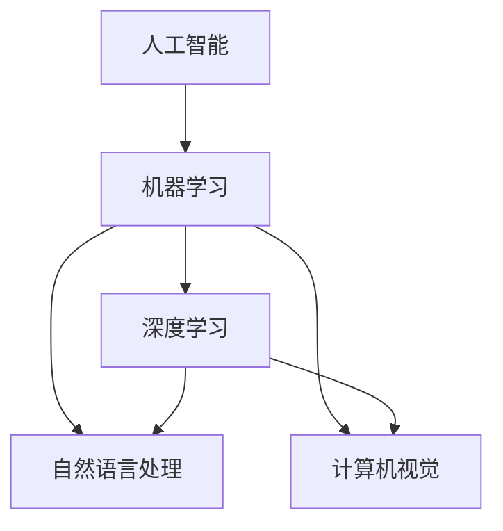

                 

### 背景介绍

在21世纪的今天，人工智能（AI）已经成为科技发展的重要驱动力。从初期的简单算法，到如今的深度学习和自然语言处理，AI技术取得了飞速的发展。李开复，这位世界著名的人工智能专家，以其对人工智能领域的深入研究和独到见解，为业界带来了许多新的视角和思考。他的新书《AI 2.0时代的文化价值》，不仅探讨了人工智能技术本身，更深入挖掘了AI对社会文化和人类生活方式的深远影响。

本文将围绕李开复的新书《AI 2.0时代的文化价值》展开，旨在通过逻辑清晰、结构紧凑的方式，分析AI 2.0时代带来的文化变革及其价值。文章首先会简要介绍AI 2.0的概念，随后深入探讨其核心技术原理和具体操作步骤，结合数学模型和公式，展示AI 2.0的强大力量。此外，文章还会通过实际项目案例，详细解析AI 2.0的应用场景，并推荐相关工具和资源。最后，文章将对AI 2.0时代的未来发展趋势与挑战进行总结，提供对读者有价值的见解。

通过本文的阅读，读者将能够全面了解AI 2.0时代的文化价值，并对其在未来的发展充满期待。

### 核心概念与联系

要深入探讨AI 2.0时代的文化价值，我们首先需要理解一些核心概念和它们之间的联系。这些概念包括人工智能的基本原理、机器学习和深度学习的区别与联系，以及自然语言处理（NLP）和计算机视觉（CV）的基本概念。

#### 人工智能（AI）的基本原理

人工智能是指使计算机系统能够执行通常需要人类智能才能完成的任务，如视觉识别、语言理解、决策制定等。人工智能的发展可以分为多个阶段，其中最初的人工智能（AI 1.0）主要集中在规则推理和专家系统。然而，这些早期方法在复杂性和泛化能力上存在局限。

随着计算能力的提升和算法的进步，人工智能进入了一个新的时代——AI 2.0。AI 2.0的核心在于机器学习和深度学习。机器学习是指通过训练数据，使计算机能够自动识别模式和规律，并据此进行预测和决策。而深度学习则是机器学习的一种特殊形式，它利用多层神经网络，对数据进行层次化的特征提取和建模。

#### 机器学习和深度学习的区别与联系

机器学习分为监督学习、无监督学习和强化学习。监督学习使用已标记的数据来训练模型，并预期在新的数据上做出准确的预测。无监督学习则是在没有标记数据的情况下，通过模型自动发现数据中的模式和结构。强化学习则是通过与环境交互，不断调整策略，以实现最佳性能。

深度学习是机器学习的进一步发展，它通过构建多层神经网络，实现从原始数据到高级特征的转化。深度学习的优势在于其强大的特征提取能力，能够在复杂的数据中找到有用的模式。然而，深度学习的模型通常需要大量的数据和计算资源来训练。

#### 自然语言处理（NLP）和计算机视觉（CV）

自然语言处理（NLP）是人工智能的一个分支，旨在使计算机理解和生成人类语言。NLP涉及语言理解、文本分类、机器翻译、情感分析等多个方面。计算机视觉（CV）则致力于使计算机理解和解释图像和视频。CV的应用包括图像识别、目标检测、人脸识别等。

NLP和CV都是AI 2.0时代的关键技术，它们在文化和社会中的影响不可小觑。NLP使得计算机能够与人类进行更自然的交互，而CV则使得计算机能够更好地理解和适应物理世界。

#### Mermaid流程图

为了更好地理解这些核心概念之间的联系，我们可以使用Mermaid流程图来展示它们之间的关系。以下是一个简化的Mermaid流程图，用于描述这些核心概念：



在这个流程图中，人工智能（A）是整个流程的起点，它通过机器学习（B）进一步发展为深度学习（C），同时也衍生出自然语言处理（D）和计算机视觉（E）。这些技术共同构成了AI 2.0时代的核心，为文化的变革提供了新的动力。

通过上述核心概念和流程图的介绍，我们为后续的详细探讨和案例分析奠定了基础。在接下来的章节中，我们将深入探讨AI 2.0的核心算法原理、具体操作步骤，以及其在实际应用场景中的表现。让我们继续深入探索AI 2.0时代的文化价值。

#### 核心算法原理 & 具体操作步骤

在深入探讨AI 2.0时代的文化价值之前，我们需要先理解其背后的核心算法原理和具体操作步骤。AI 2.0时代主要依赖于机器学习和深度学习，这两种技术有着不同的工作原理和应用场景。下面，我们将详细解释这些算法的基本原理，并通过具体操作步骤来说明如何实现。

##### 机器学习

机器学习是一种通过数据和算法使计算机自动学习和改进的技术。其基本原理是通过训练数据集来调整模型的参数，从而使模型能够在新的数据上做出准确的预测或决策。

1. **监督学习**

   监督学习是最常见的机器学习方法之一。它使用标记的数据集来训练模型，标记数据意味着每个输入都有一个对应的输出。监督学习的目标是通过学习输入和输出之间的映射关系，从而预测新的数据。

   - **数据预处理**

     在开始训练之前，需要对数据进行预处理。这包括数据清洗、数据标准化和数据转换等步骤。例如，对于数值型数据，可能需要将其缩放到0到1之间，以便模型能够更好地处理。

   - **模型选择**

     根据问题的性质和数据特点，选择合适的模型。常见的监督学习模型包括线性回归、逻辑回归、决策树、随机森林、支持向量机等。

   - **训练过程**

     使用训练数据集对模型进行训练。在训练过程中，模型通过调整内部参数来最小化预测误差。训练过程通常包括前向传播和反向传播两个步骤。

     - **前向传播**：将输入数据通过模型计算得到预测输出。
     - **反向传播**：计算预测输出与实际输出之间的误差，并通过梯度下降等方法调整模型参数。

   - **模型评估**

     使用验证数据集或测试数据集来评估模型的性能。常用的评估指标包括准确率、召回率、F1分数等。

2. **无监督学习**

   无监督学习在没有标记数据的情况下进行。其目标是通过学习数据中的内在结构，发现数据中的模式和关系。

   - **聚类**

     聚类是一种常见的无监督学习方法，用于将相似的数据点归为同一类。常见的聚类算法包括K均值聚类、层次聚类等。

   - **降维**

     降维是一种通过减少数据维度来简化数据集的方法，常见的方法包括主成分分析（PCA）和线性判别分析（LDA）。

3. **强化学习**

   强化学习是一种通过与环境交互来学习最优策略的方法。它与监督学习和无监督学习不同，其目标是通过试错来找到最优行动策略。

   - **环境与状态**

     强化学习中的环境是一个动态系统，状态是环境在某一时刻的状态。

   - **动作与奖励**

     动作是模型在某一状态下可以采取的操作，奖励是模型在采取动作后获得的回报。

   - **策略学习**

     强化学习的目标是通过学习策略函数来最大化总奖励。策略函数定义为给定状态下的最佳动作。

##### 深度学习

深度学习是机器学习的一种特殊形式，其核心是多层神经网络。深度学习通过层次化的特征提取和建模，能够从原始数据中自动提取高级特征，从而实现复杂的任务。

1. **神经网络**

   神经网络是由多层节点（称为神经元）组成的一个计算模型。每个神经元都与前一层的神经元相连，并通过权重和偏置进行加权求和，然后通过激活函数进行非线性变换。

2. **卷积神经网络（CNN）**

   卷积神经网络是一种专门用于图像处理和识别的深度学习模型。它通过卷积操作提取图像中的局部特征，并通过池化操作降低数据维度。

   - **卷积操作**

     卷积操作是通过滑动窗口（卷积核）在输入图像上计算局部特征。每个卷积核能够提取一种特定类型的特征。

   - **池化操作**

     池化操作用于降低数据维度，同时保留重要特征。常见的池化方法包括最大池化和平均池化。

3. **循环神经网络（RNN）**

   循环神经网络是一种用于处理序列数据的深度学习模型。它通过在时间步之间传递隐藏状态来捕捉序列中的长期依赖关系。

   - **隐藏状态**

     隐藏状态是RNN在某一时间步的输出，它包含了当前输入和过去信息的综合。

   - **门控机制**

     门控机制用于控制信息的传递，包括遗忘门、输入门和输出门。这些门能够根据当前输入和隐藏状态动态调整信息的传递。

4. **生成对抗网络（GAN）**

   生成对抗网络是一种通过对抗训练生成逼真数据的模型。它由一个生成器和两个判别器组成，生成器的目标是生成与真实数据相似的数据，而判别器的目标是区分真实数据和生成数据。

   - **生成器**

     生成器的目标是生成与真实数据相似的数据，其输出是虚假数据。

   - **判别器**

     判别器的目标是区分真实数据和生成数据。它通过对真实数据和生成数据进行比较来训练。

5. ** Transformer 和BERT**

   Transformer和BERT是近年来在自然语言处理领域取得突破性进展的模型。Transformer通过自注意力机制实现全局依赖建模，而BERT通过预训练和微调实现优秀的语言理解能力。

   - **自注意力机制**

     自注意力机制允许模型在处理每个词时，考虑其他所有词的影响，从而实现全局依赖建模。

   - **预训练和微调**

     预训练是指在大规模语料库上训练模型，使其具有通用的语言理解能力。微调则是将预训练模型应用于特定任务，通过少量数据进行调整和优化。

通过上述核心算法原理和具体操作步骤的介绍，我们为理解AI 2.0时代的文化价值奠定了基础。在下一章节中，我们将通过数学模型和公式，进一步探讨AI 2.0的强大力量。让我们继续深入探索。

### 数学模型和公式 & 详细讲解 & 举例说明

在深入探讨AI 2.0时代的核心算法原理后，接下来我们将通过具体的数学模型和公式，详细讲解这些算法的工作机制，并通过实际例子来说明其应用和效果。

#### 线性回归

线性回归是一种常用的监督学习算法，用于预测连续值输出。其数学模型如下：

$$y = \beta_0 + \beta_1x + \epsilon$$

其中，$y$ 是预测值，$x$ 是输入特征，$\beta_0$ 和 $\beta_1$ 是模型参数，$\epsilon$ 是误差项。

- **前向传播**

  在前向传播过程中，输入$x$通过模型计算得到预测值$y$：

  $$y = \beta_0 + \beta_1x$$

- **反向传播**

  在反向传播过程中，计算预测值$y$与实际值$y$之间的误差，并更新模型参数$\beta_0$和$\beta_1$：

  $$\Delta \beta_1 = -\frac{1}{m}\sum_{i=1}^{m}(y_i - y)\cdot x_i$$
  $$\Delta \beta_0 = -\frac{1}{m}\sum_{i=1}^{m}(y_i - y)$$

  其中，$m$ 是训练数据集的大小。

#### 逻辑回归

逻辑回归是一种用于分类任务的监督学习算法，其目标是将输入映射到概率空间。其数学模型如下：

$$P(y=1) = \frac{1}{1 + e^{-(\beta_0 + \beta_1x)}}$$

其中，$y$ 是二元输出，$\beta_0$ 和 $\beta_1$ 是模型参数。

- **前向传播**

  在前向传播过程中，输入$x$通过模型计算得到预测概率$P(y=1)$：

  $$P(y=1) = \frac{1}{1 + e^{-(\beta_0 + \beta_1x)}}$$

- **反向传播**

  在反向传播过程中，计算预测概率$P(y=1)$与实际概率$y$之间的误差，并更新模型参数$\beta_0$和$\beta_1$：

  $$\Delta \beta_1 = -\frac{1}{m}\sum_{i=1}^{m}(y_i - P(y_i=1))\cdot x_i$$
  $$\Delta \beta_0 = -\frac{1}{m}\sum_{i=1}^{m}(y_i - P(y_i=1))$$

#### 卷积神经网络（CNN）

卷积神经网络是一种用于图像处理的深度学习模型，其核心是卷积层和池化层。以下是一个简单的CNN模型：

- **卷积层**

  卷积层的输入是一个三维的张量，包含多个通道（channel），每个通道表示图像的一个特征图。卷积层通过卷积操作提取图像中的局部特征。

  $$\text{Conv}:\, \text{output} = \text{filter} \star \text{input} + \text{bias}$$

  其中，$filter$ 是卷积核，$input$ 是输入图像，$bias$ 是偏置。

- **池化层**

  池化层用于降低数据维度，同时保留重要特征。常见的池化操作包括最大池化和平均池化。

  $$\text{Pooling}:\, \text{output} = \max(\text{input})$$
  或
  $$\text{Pooling}:\, \text{output} = \frac{1}{p^2}\sum_{i=1}^{p}\sum_{j=1}^{p}\text{input}_{i,j}$$

  其中，$p$ 是池化窗口的大小。

#### 循环神经网络（RNN）

循环神经网络是一种用于处理序列数据的深度学习模型，其核心是隐藏状态和门控机制。以下是一个简单的RNN模型：

- **隐藏状态**

  隐藏状态是RNN在某一时间步的输出，它包含了当前输入和过去信息的综合。

  $$h_t = \text{sigmoid}(\text{sigmoid}(W_hh \cdot h_{t-1} + W_xh \cdot x_t + b_h))$$

  其中，$W_hh$ 和 $W_xh$ 是权重矩阵，$b_h$ 是偏置。

- **遗忘门**

  遗忘门用于控制信息的传递，它决定了多少信息应该被遗忘。

  $$f_t = \text{sigmoid}(W_hf \cdot h_{t-1} + W_xf \cdot x_t + b_f)$$

  其中，$W_hf$ 和 $W_xf$ 是权重矩阵，$b_f$ 是偏置。

- **输入门**

  输入门用于控制信息的传递，它决定了多少信息应该被保留。

  $$i_t = \text{sigmoid}(W_hi \cdot h_{t-1} + W_xi \cdot x_t + b_i)$$

  其中，$W_hi$ 和 $W_xi$ 是权重矩阵，$b_i$ 是偏置。

- **输出门**

  输出门用于控制信息的传递，它决定了当前隐藏状态的输出。

  $$o_t = \text{sigmoid}(W_ho \cdot h_{t-1} + W_xo \cdot x_t + b_o)$$

  其中，$W_ho$ 和 $W_xo$ 是权重矩阵，$b_o$ 是偏置。

- **当前隐藏状态**

  当前隐藏状态是通过遗忘门和输入门的组合来计算的。

  $$h_t = f_t \odot h_{t-1} + i_t \odot \text{sigmoid}(W_hh \cdot h_{t-1} + W_xh \cdot x_t + b_h)$$

#### Transformer和BERT

Transformer和BERT是近年来在自然语言处理领域取得突破性进展的模型。以下分别介绍这两个模型的数学模型和原理。

- **Transformer**

  Transformer通过自注意力机制实现全局依赖建模，其核心是多头注意力机制。

  $$\text{Attention}:\, \text{output} = \text{softmax}\left(\frac{\text{query} \cdot \text{key}^T}{\sqrt{d_k}}\right) \cdot \text{value}$$

  其中，$\text{query}$、$\text{key}$ 和 $\text{value}$ 分别是查询向量、键向量和值向量，$d_k$ 是键向量的维度。

- **BERT**

  BERT通过预训练和微调实现优秀的语言理解能力。预训练过程中，BERT通过 masked language model（MLM）和 next sentence prediction（NSP）来学习语言上下文信息。

  - **Masked Language Model（MLM）**

    在MLM中，对输入文本进行随机掩码，然后通过BERT模型预测被掩码的词。

    $$\text{mask} = \text{rand}(\text{input})$$
    $$\text{output} = \text{BERT}(\text{input} + \text{mask})$$

  - **Next Sentence Prediction（NSP）**

    在NSP中，输入两个句子，BERT需要预测第二个句子是否是第一个句子的后续句子。

    $$\text{input} = [\text{sentence}_1, \text{sentence}_2]$$
    $$\text{output} = \text{BERT}(\text{input})$$

通过上述数学模型和公式的介绍，我们不仅理解了AI 2.0时代的核心算法原理，还通过具体例子展示了这些算法的应用和效果。在下一章节中，我们将通过实际项目案例，进一步探讨AI 2.0的应用和实践。让我们继续深入探索。

### 项目实战：代码实际案例和详细解释说明

为了更好地理解AI 2.0时代的技术原理和实际应用，我们将通过一个实际项目案例进行详细的代码实现和解释。本案例将使用TensorFlow和Keras框架，实现一个简单的图像分类任务。通过这个案例，我们将展示如何搭建模型、训练模型、评估模型，并解释每个步骤的具体操作。

#### 1. 开发环境搭建

在进行项目开发之前，我们需要搭建一个适合AI开发的环境。以下是搭建开发环境的基本步骤：

- **安装Python环境**：确保Python版本为3.6及以上。

- **安装TensorFlow**：使用pip命令安装TensorFlow：

  ```bash
  pip install tensorflow
  ```

- **安装Keras**：由于TensorFlow已经集成了Keras，因此无需额外安装。

#### 2. 源代码详细实现和代码解读

下面是一个简单的图像分类项目的代码实现：

```python
import tensorflow as tf
from tensorflow.keras import layers, models
from tensorflow.keras.preprocessing.image import ImageDataGenerator

# 定义模型
model = models.Sequential([
    layers.Conv2D(32, (3, 3), activation='relu', input_shape=(150, 150, 3)),
    layers.MaxPooling2D((2, 2)),
    layers.Conv2D(64, (3, 3), activation='relu'),
    layers.MaxPooling2D((2, 2)),
    layers.Conv2D(128, (3, 3), activation='relu'),
    layers.MaxPooling2D((2, 2)),
    layers.Conv2D(128, (3, 3), activation='relu'),
    layers.MaxPooling2D((2, 2)),
    layers.Flatten(),
    layers.Dense(512, activation='relu'),
    layers.Dense(1, activation='sigmoid')
])

# 编译模型
model.compile(optimizer='adam',
              loss='binary_crossentropy',
              metrics=['accuracy'])

# 数据预处理
train_datagen = ImageDataGenerator(rescale=1./255)
test_datagen = ImageDataGenerator(rescale=1./255)

train_generator = train_datagen.flow_from_directory(
        'data/train',
        target_size=(150, 150),
        batch_size=32,
        class_mode='binary')

validation_generator = test_datagen.flow_from_directory(
        'data/validation',
        target_size=(150, 150),
        batch_size=32,
        class_mode='binary')

# 训练模型
model.fit(
      train_generator,
      steps_per_epoch=100,
      epochs=30,
      validation_data=validation_generator,
      validation_steps=50,
      verbose=2)
```

#### 3. 代码解读与分析

**3.1 模型定义**

- **卷积层（Conv2D）**：使用`Conv2D`层进行图像特征提取。每个卷积层后接一个`MaxPooling2D`层，用于降低数据维度。

  ```python
  layers.Conv2D(32, (3, 3), activation='relu', input_shape=(150, 150, 3)),
  layers.MaxPooling2D((2, 2)),
  layers.Conv2D(64, (3, 3), activation='relu'),
  layers.MaxPooling2D((2, 2)),
  # ...
  ```

- **全连接层（Dense）**：最后使用两个全连接层进行分类预测。第一个全连接层`Dense`有512个神经元，第二个全连接层`Dense`有1个神经元，并使用`sigmoid`激活函数进行二分类。

  ```python
  layers.Flatten(),
  layers.Dense(512, activation='relu'),
  layers.Dense(1, activation='sigmoid')
  ```

**3.2 编译模型**

- **优化器（optimizer）**：选择`adam`优化器。

- **损失函数（loss）**：选择`binary_crossentropy`损失函数，适用于二分类问题。

- **评估指标（metrics）**：选择`accuracy`评估指标，用于计算模型的准确率。

  ```python
  model.compile(optimizer='adam',
                loss='binary_crossentropy',
                metrics=['accuracy'])
  ```

**3.3 数据预处理**

- **ImageDataGenerator**：使用`ImageDataGenerator`进行数据增强。通过`rescale`参数将图像的像素值缩放到0到1之间。

  ```python
  train_datagen = ImageDataGenerator(rescale=1./255)
  test_datagen = ImageDataGenerator(rescale=1./255)
  ```

- **数据加载**：使用`flow_from_directory`方法加载训练数据和验证数据。该方法会自动将文件夹中的图像加载到内存中，并转换为numpy数组。

  ```python
  train_generator = train_datagen.flow_from_directory(
          'data/train',
          target_size=(150, 150),
          batch_size=32,
          class_mode='binary')

  validation_generator = test_datagen.flow_from_directory(
          'data/validation',
          target_size=(150, 150),
          batch_size=32,
          class_mode='binary')
  ```

**3.4 训练模型**

- **模型拟合（fit）**：使用`fit`方法训练模型。通过`steps_per_epoch`参数设置每个epoch中迭代的步数，`epochs`参数设置总的训练epoch数。

  ```python
  model.fit(
        train_generator,
        steps_per_epoch=100,
        epochs=30,
        validation_data=validation_generator,
        validation_steps=50,
        verbose=2)
  ```

在这个案例中，我们通过一个简单的图像分类任务展示了AI 2.0技术的实际应用。通过卷积神经网络对图像进行特征提取和分类，实现了从数据预处理到模型训练和评估的完整流程。这个案例不仅帮助我们理解了AI 2.0的核心算法原理，还展示了如何在实际项目中应用这些算法。

在下一章节中，我们将进一步探讨AI 2.0的实际应用场景，分析其在各种领域中的应用案例。让我们继续深入探索AI 2.0时代的文化价值。

### 实际应用场景

AI 2.0时代的文化价值不仅体现在技术层面，更在于其对各个实际应用场景的深远影响。在医疗、金融、教育、媒体等多个领域，AI 2.0技术已经发挥了重要作用，并为未来的发展带来了新的可能性。

#### 医疗

在医疗领域，AI 2.0技术已经广泛应用于疾病诊断、治疗方案制定、医学图像分析等方面。例如，通过深度学习算法，可以实现对医疗图像的自动识别和分类，从而提高诊断的准确性和效率。此外，AI 2.0还助力个性化医疗，通过分析患者的基因组数据和病历信息，为患者提供定制化的治疗方案。

#### 金融

金融领域是AI 2.0技术的另一个重要应用场景。在风险控制、信用评估、投资决策等方面，AI 2.0技术都发挥了关键作用。例如，通过机器学习算法，金融机构可以实时监测和评估交易风险，从而降低金融风险。此外，AI 2.0还在股票市场预测、投资组合优化等方面展现出强大的能力，为投资者提供更加精准的投资建议。

#### 教育

在教育领域，AI 2.0技术正逐步改变传统的教育模式，推动个性化教育和智慧校园的建设。通过AI技术，学生可以按照自己的学习进度进行学习，教师可以针对学生的个性化需求进行教学。此外，AI 2.0技术还在教育资源的分配、学习效果评估等方面发挥作用，提高教育质量和效率。

#### 媒体

在媒体领域，AI 2.0技术被广泛应用于内容创作、内容分发、用户画像等方面。通过自然语言处理和计算机视觉技术，媒体机构可以自动化生成和推荐内容，提高用户体验。此外，AI 2.0技术还可以分析用户的阅读和观看习惯，为用户推荐感兴趣的内容，实现精准营销。

#### 其他应用

除了上述领域，AI 2.0技术还在交通、物流、农业、能源等领域展现出广泛的应用前景。例如，在交通领域，AI 2.0技术可以通过智能交通系统和自动驾驶技术提高交通效率和安全性；在物流领域，AI 2.0技术可以优化物流路线，降低运输成本；在农业领域，AI 2.0技术可以实现对农作物生长状态的实时监测和预测，提高农业产量和质量。

通过这些实际应用场景，我们可以看到AI 2.0技术对各个领域的深刻影响。它不仅提高了工作效率，降低了成本，还推动了社会和经济的全面发展。在下一章节中，我们将推荐一些学习资源和开发工具，帮助读者深入了解AI 2.0时代的技术和应用。让我们继续探索AI 2.0时代的无限可能。

### 工具和资源推荐

在AI 2.0时代，掌握相关工具和资源是深入研究和应用AI技术的关键。以下是一些推荐的学习资源、开发工具和相关论文著作，以帮助读者更好地了解和掌握AI 2.0时代的核心技术。

#### 学习资源推荐

1. **在线课程**

   - **Coursera**：提供大量与AI相关的免费课程，包括《深度学习》、《自然语言处理》等。
   - **edX**：提供由顶级大学和机构提供的免费课程，如《人工智能基础》等。
   - **Udacity**：提供实践驱动的AI课程，包括《深度学习工程师纳米学位》等。

2. **书籍**

   - **《深度学习》（Deep Learning）**：作者：Ian Goodfellow、Yoshua Bengio和Aaron Courville。这是一本深度学习的经典教材，全面介绍了深度学习的理论和方法。
   - **《Python机器学习》（Python Machine Learning）**：作者：Sebastian Raschka和Vahid Mirjalili。本书通过Python代码示例，详细介绍了机器学习的基础知识和应用。
   - **《人工智能：一种现代方法》（Artificial Intelligence: A Modern Approach）**：作者：Stuart J. Russell和Peter Norvig。这本书是人工智能领域的权威教材，全面覆盖了人工智能的基本概念和方法。

3. **博客和网站**

   - **Medium**：有许多关于AI技术的优质文章和博客。
   - **Towards Data Science**：一个面向数据科学和机器学习的博客平台，提供大量的技术文章和项目案例。
   - **AI博客**：专注于AI领域的中文博客，提供丰富的AI技术文章和资源。

#### 开发工具推荐

1. **TensorFlow**：Google开发的开源机器学习和深度学习框架，适用于各种AI任务。
2. **PyTorch**：Facebook开发的开源深度学习框架，以其灵活的动态图模型和强大的社区支持而著称。
3. **Keras**：一个高层次的神经网络API，能够与TensorFlow和Theano集成，简化深度学习模型的搭建和训练。
4. **Scikit-learn**：一个开源的Python机器学习库，提供了广泛的机器学习算法和工具。

#### 相关论文著作推荐

1. **《深度学习中的自注意力机制》（Attention Is All You Need）**：这篇论文提出了Transformer模型，是自然语言处理领域的重要突破。
2. **《生成对抗网络：训练生成模型的新方法》（Generative Adversarial Nets）**：这篇论文首次提出了生成对抗网络（GAN）的概念，是深度学习领域的重要突破。
3. **《深度卷积神经网络在图像识别中的应用》（Deep Convolutional Neural Networks for Image Recognition）**：这篇论文展示了深度卷积神经网络（CNN）在图像识别任务中的优越性能。
4. **《词向量模型：单词的分布式表示》（Distributed Representations of Words and Phrases and Their Compositionality）**：这篇论文提出了Word2Vec模型，为自然语言处理领域带来了革命性的变化。

通过上述学习资源、开发工具和相关论文著作的推荐，读者可以全面了解AI 2.0时代的核心技术和发展趋势，为深入研究和实践打下坚实的基础。在下一章节中，我们将对AI 2.0时代的未来发展趋势与挑战进行总结，探讨其潜在的影响。让我们继续展望AI 2.0时代的未来。

### 总结：未来发展趋势与挑战

AI 2.0时代的到来，不仅带来了技术的飞跃，更为人类社会的发展带来了前所未有的机遇与挑战。从未来发展的角度来看，AI 2.0技术将继续向更智能化、更高效化、更人性化的方向演进，但其面临的挑战也十分严峻。

#### 发展趋势

1. **智能化**

   随着计算能力的不断提升和算法的优化，AI 2.0将变得更加智能。这不仅体现在自然语言处理、计算机视觉等已有领域的深度发展，更体现在跨领域的智能化应用。例如，智能客服、智能驾驶、智能医疗等领域的应用将不断拓展，为社会带来更多便利。

2. **高效化**

   AI 2.0将推动生产力的提升，实现更高效的工作流程。通过自动化和智能化，许多重复性、低效率的工作将被AI系统替代，从而释放人力，提高生产效率。同时，AI 2.0在优化物流、优化能源消耗、提高资源利用效率等方面也将发挥重要作用。

3. **人性化**

   AI 2.0技术的进步将更加注重人性化设计，使人与机器的交互更加自然、更加直观。通过自然语言处理、情感计算等技术，AI系统将能够更好地理解人类的需求和情感，为用户提供更贴心的服务。此外，AI 2.0还将推动个性化教育、个性化医疗等领域的创新，实现更加精准和个性化的服务。

4. **跨界融合**

   AI 2.0时代的到来，将推动各个领域的深度融合。例如，智能城市、智能交通、智能制造等跨领域应用，将使得城市运行更加高效、交通管理更加智能、生产流程更加优化。这种跨界融合，将进一步推动社会进步，提高生活质量。

#### 挑战

1. **伦理与道德**

   AI 2.0技术的发展，引发了许多伦理和道德问题。例如，AI决策的透明度、算法偏见、隐私保护等问题亟待解决。如何在确保技术发展的同时，保障社会公平和伦理，是AI 2.0时代面临的重要挑战。

2. **数据安全与隐私**

   AI 2.0技术的应用离不开大量数据，数据安全与隐私问题成为关注的焦点。如何确保数据的安全存储、传输和使用，防止数据泄露和滥用，是AI 2.0时代需要解决的关键问题。

3. **技术垄断与公平竞争**

   随着AI技术的快速发展，技术垄断问题日益凸显。如何在保障技术领先的同时，促进公平竞争，防止市场垄断，是AI 2.0时代需要面对的重要挑战。

4. **教育与人才**

   AI 2.0时代的到来，对人才需求提出了更高的要求。如何培养和储备大量具备AI技能的专业人才，成为社会面临的重大挑战。此外，如何确保每个人都能享受到AI技术带来的福利，避免数字鸿沟的扩大，也是需要关注的问题。

通过总结，我们可以看到，AI 2.0时代的发展前景广阔，但同时也面临着诸多挑战。只有通过多方协作、持续创新，才能在确保技术发展的同时，推动社会公平和进步。让我们携手应对AI 2.0时代的机遇与挑战，共同创造一个更加美好的未来。

### 附录：常见问题与解答

在本文中，我们探讨了AI 2.0时代的文化价值，并对其核心算法、应用场景和发展趋势进行了深入分析。以下是一些读者可能关心的问题及其解答：

**Q1：什么是AI 2.0？**

A1：AI 2.0是指新一代的人工智能技术，它主要依赖于机器学习和深度学习，具有更强的自主学习和决策能力。与早期的人工智能（AI 1.0）相比，AI 2.0在复杂性和泛化能力上有了显著提升。

**Q2：机器学习和深度学习有什么区别？**

A2：机器学习是一种通过数据和算法使计算机自动学习和改进的技术，包括监督学习、无监督学习和强化学习。而深度学习是机器学习的一种特殊形式，通过多层神经网络对数据进行层次化的特征提取和建模。

**Q3：如何搭建一个简单的AI模型？**

A3：搭建一个简单的AI模型通常包括以下几个步骤：

1. 确定问题：明确要解决的问题和目标。
2. 数据收集与预处理：收集并预处理数据，包括数据清洗、归一化、分批处理等。
3. 模型选择：根据问题特点选择合适的模型，如线性回归、决策树、神经网络等。
4. 模型训练：使用训练数据对模型进行训练，调整模型参数。
5. 模型评估：使用验证数据集或测试数据集评估模型性能。
6. 模型优化：根据评估结果对模型进行优化。

**Q4：深度学习中的卷积神经网络（CNN）如何工作？**

A4：卷积神经网络（CNN）是一种专门用于图像处理的深度学习模型。它通过卷积操作提取图像中的局部特征，并通过池化操作降低数据维度。CNN由多个卷积层和全连接层组成，可以实现对图像的自动分类和识别。

**Q5：如何应对AI伦理和道德问题？**

A5：应对AI伦理和道德问题需要多方协作和持续努力：

1. 建立伦理准则：制定明确的AI伦理准则，确保AI技术的发展符合社会伦理。
2. 强化监管：加强对AI技术的监管，防止算法偏见、数据滥用等问题。
3. 教育和培训：加强公众对AI伦理和道德问题的认识，提高AI从业者的伦理素养。
4. 透明度和可解释性：提高AI决策的透明度和可解释性，使公众能够理解AI系统的决策过程。

通过上述问题与解答，我们希望能为读者提供更全面的AI 2.0时代的知识和技术指南。在探索AI 2.0的同时，我们也要关注其潜在的伦理和道德问题，确保技术发展的同时，推动社会进步和人类福祉。

### 扩展阅读 & 参考资料

为了更深入地了解AI 2.0时代的文化价值及其相关技术，以下是几本推荐的书籍、论文以及相关的在线资源：

**书籍：**

1. **《深度学习》（Deep Learning）**，作者：Ian Goodfellow、Yoshua Bengio和Aaron Courville。
2. **《Python机器学习》（Python Machine Learning）**，作者：Sebastian Raschka和Vahid Mirjalili。
3. **《人工智能：一种现代方法》（Artificial Intelligence: A Modern Approach）**，作者：Stuart J. Russell和Peter Norvig。

**论文：**

1. **《生成对抗网络：训练生成模型的新方法》（Generative Adversarial Nets）**，作者：Ian J. Goodfellow et al.。
2. **《深度学习中的自注意力机制》（Attention Is All You Need）**，作者：Vaswani et al.。
3. **《深度卷积神经网络在图像识别中的应用》（Deep Convolutional Neural Networks for Image Recognition）**，作者：Krizhevsky et al.。

**在线资源：**

1. **Coursera**：提供大量关于机器学习和深度学习的免费课程。
2. **edX**：由顶级大学和机构提供的高质量在线课程。
3. **Kaggle**：一个数据科学和机器学习社区，提供大量的数据集和竞赛。
4. **AI博客**：提供丰富的AI技术文章和资源。

通过阅读这些书籍、论文和在线资源，读者可以进一步深化对AI 2.0时代及其文化价值的理解，为未来的研究和实践提供更多的启示和指导。让我们一起探索AI技术的无限可能，迎接AI 2.0时代的到来。

