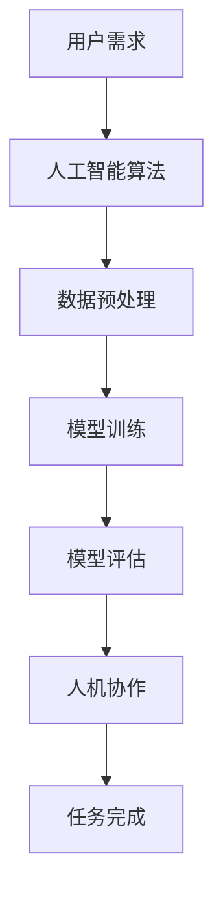

                 

# 李开复：AI 2.0 时代的文化价值

> **关键词：** AI 2.0、文化价值、技术发展、人机协作、伦理道德

> **摘要：** 本篇文章将探讨李开复提出的AI 2.0时代的文化价值，从技术发展、人机协作和伦理道德等方面进行分析，揭示AI 2.0时代对人类社会的深远影响。

## 1. 背景介绍

人工智能（AI）技术自诞生以来，经历了多个发展阶段。从最初的规则推理、知识表示到深度学习、强化学习，人工智能技术在各个领域取得了显著的成果。然而，随着技术的不断进步，人们逐渐意识到，单纯追求技术的突破已经不能满足时代的需求，AI技术需要更多地关注文化价值和社会责任。

李开复作为人工智能领域的权威专家，提出了AI 2.0时代的概念。他认为，AI 2.0时代将是一个以人机协作为核心特征的时代，人工智能将从单点突破转向系统化、平台化发展，技术与人文、艺术、伦理等领域的融合将成为时代趋势。

## 2. 核心概念与联系

### 2.1 人机协作

人机协作是指人与机器共同完成任务的过程。在AI 2.0时代，人机协作将成为主流工作模式。人机协同系统通过人工智能技术，能够实现人类与机器之间的信息共享、知识融合和协同创新。

#### Mermaid流程图：



### 2.2 文化价值

文化价值是指人类在长期历史发展中形成的，具有普遍意义的精神财富。在AI 2.0时代，文化价值将发挥重要作用。一方面，人工智能技术可以传承和弘扬传统文化；另一方面，人工智能的发展也将带来新的文化创新。

### 2.3 伦理道德

伦理道德是人类社会的基本规范，对于人工智能的发展具有重要意义。在AI 2.0时代，伦理道德将成为人工智能技术的核心约束。如何确保人工智能技术的道德性和公平性，是当前和未来需要解决的重要问题。

## 3. 核心算法原理 & 具体操作步骤

### 3.1 人机协作算法原理

人机协作算法主要包括以下步骤：

1. 用户需求分析：通过自然语言处理技术，理解用户的需求和意图。
2. 数据预处理：对用户需求进行数据化处理，提取关键信息。
3. 模型训练：利用深度学习等技术，对模型进行训练。
4. 模型评估：对训练好的模型进行评估，确保其性能满足要求。
5. 人机协作：将训练好的模型应用于实际任务，人与机器共同完成任务。

### 3.2 文化价值算法原理

文化价值算法主要包括以下步骤：

1. 文化传承：通过文本挖掘、图像识别等技术，挖掘和传承传统文化。
2. 文化创新：利用人工智能技术，对传统文化进行创新，创造出新的文化作品。
3. 文化传播：通过社交媒体、网络平台等渠道，传播优秀文化作品。

### 3.3 伦理道德算法原理

伦理道德算法主要包括以下步骤：

1. 道德评估：通过伦理道德知识库，对人工智能行为进行道德评估。
2. 道德约束：对不符合伦理道德的行为进行约束，确保人工智能技术的发展符合社会价值观。

## 4. 数学模型和公式 & 详细讲解 & 举例说明

### 4.1 人机协作算法的数学模型

人机协作算法的核心是深度学习模型，常用的模型包括卷积神经网络（CNN）和循环神经网络（RNN）。以下是一个简单的CNN模型：

$$
\begin{aligned}
    h_{\text{conv}} &= \text{Conv}(h_{\text{input}}, \text{filter}) + \text{bias} \\
    h_{\text{pool}} &= \text{MaxPool}(h_{\text{conv}}) \\
    h_{\text{fc}} &= \text{FC}(h_{\text{pool}}, \text{weights}) + \text{bias} \\
    \text{output} &= \text{Softmax}(h_{\text{fc}})
\end{aligned}
$$

其中，$h_{\text{input}}$表示输入数据，$\text{filter}$表示卷积核，$h_{\text{conv}}$表示卷积后的特征图，$h_{\text{pool}}$表示池化后的特征图，$h_{\text{fc}}$表示全连接层的输出，$\text{weights}$表示权重，$\text{bias}$表示偏置，$\text{output}$表示输出结果。

### 4.2 文化价值算法的数学模型

文化价值算法的核心是文本挖掘和图像识别。以下是一个简单的文本挖掘模型：

$$
\begin{aligned}
    \text{embeddings} &= \text{Word2Vec}(\text{corpus}) \\
    h_{\text{input}} &= \text{Embedding}(h_{\text{input}}, \text{embeddings}) \\
    h_{\text{output}} &= \text{FC}(h_{\text{input}}, \text{weights}) + \text{bias}
\end{aligned}
$$

其中，$\text{embeddings}$表示词向量，$h_{\text{input}}$表示输入文本，$h_{\text{output}}$表示输出结果，$\text{weights}$表示权重，$\text{bias}$表示偏置。

### 4.3 伦理道德算法的数学模型

伦理道德算法的核心是道德评估。以下是一个简单的道德评估模型：

$$
\begin{aligned}
    \text{morality} &= \text{EthicalModel}(\text{behavior}) \\
    \text{evaluation} &= \text{Judge}(\text{morality})
\end{aligned}
$$

其中，$\text{behavior}$表示行为，$\text{morality}$表示道德性，$\text{evaluation}$表示评估结果，$\text{EthicalModel}$表示伦理道德模型，$\text{Judge}$表示评估函数。

## 5. 项目实战：代码实际案例和详细解释说明

### 5.1 开发环境搭建

本案例使用Python编程语言，搭建基于TensorFlow的深度学习环境。以下是具体步骤：

1. 安装Python：确保系统已安装Python 3.6及以上版本。
2. 安装TensorFlow：在命令行执行以下命令：

```bash
pip install tensorflow
```

### 5.2 源代码详细实现和代码解读

以下是一个简单的基于CNN的人机协作算法实现：

```python
import tensorflow as tf
from tensorflow.keras.layers import Conv2D, MaxPooling2D, Flatten, Dense
from tensorflow.keras.models import Sequential

# 定义CNN模型
model = Sequential([
    Conv2D(filters=32, kernel_size=(3, 3), activation='relu', input_shape=(28, 28, 1)),
    MaxPooling2D(pool_size=(2, 2)),
    Flatten(),
    Dense(units=128, activation='relu'),
    Dense(units=10, activation='softmax')
])

# 编译模型
model.compile(optimizer='adam', loss='categorical_crossentropy', metrics=['accuracy'])

# 加载数据
(x_train, y_train), (x_test, y_test) = tf.keras.datasets.mnist.load_data()

# 预处理数据
x_train = x_train / 255.0
x_test = x_test / 255.0
x_train = x_train.reshape(-1, 28, 28, 1)
x_test = x_test.reshape(-1, 28, 28, 1)

# 转换标签为one-hot编码
y_train = tf.keras.utils.to_categorical(y_train, 10)
y_test = tf.keras.utils.to_categorical(y_test, 10)

# 训练模型
model.fit(x_train, y_train, batch_size=128, epochs=10, validation_data=(x_test, y_test))

# 评估模型
model.evaluate(x_test, y_test)
```

代码解读：

1. 导入所需的TensorFlow模块。
2. 定义一个Sequential模型，依次添加卷积层、池化层、全连接层和输出层。
3. 编译模型，设置优化器、损失函数和评估指标。
4. 加载MNIST数据集，并进行预处理。
5. 将输入数据分为训练集和测试集，将标签转换为one-hot编码。
6. 使用训练集训练模型，使用测试集评估模型。

### 5.3 代码解读与分析

1. **模型定义**：使用Sequential模型定义一个简单的卷积神经网络，包括卷积层、池化层和全连接层。
2. **编译模型**：设置优化器、损失函数和评估指标，为模型训练做准备。
3. **数据预处理**：对MNIST数据集进行归一化和重塑，以便输入到卷积神经网络中。
4. **训练模型**：使用训练集训练模型，并使用测试集进行验证。
5. **评估模型**：使用测试集评估模型性能，输出准确率。

## 6. 实际应用场景

### 6.1 医疗领域

在医疗领域，AI 2.0时代的人机协作可以实现精确的诊断和个性化的治疗方案。医生可以借助人工智能技术，快速分析大量的医疗数据，提供精准的诊断和建议。

### 6.2 教育领域

在教育领域，AI 2.0时代的人机协作可以实现个性化的学习体验。学生可以根据自己的兴趣和需求，选择合适的学习内容和方式，提高学习效率。

### 6.3 金融领域

在金融领域，AI 2.0时代的人机协作可以实现智能的风险评估和投资决策。金融机构可以借助人工智能技术，对海量的金融数据进行分析，提高投资决策的准确性和效率。

## 7. 工具和资源推荐

### 7.1 学习资源推荐

- **书籍**：《人工智能：一种现代的方法》、《深度学习》
- **论文**：Google Scholar、ArXiv
- **博客**：AI华人杰出贡献榜、机器之心
- **网站**：TensorFlow官网、Kaggle

### 7.2 开发工具框架推荐

- **编程语言**：Python、Java
- **深度学习框架**：TensorFlow、PyTorch
- **数据分析工具**：Pandas、NumPy
- **版本控制工具**：Git、GitHub

### 7.3 相关论文著作推荐

- **论文**：AlexNet、ResNet、Transformer
- **著作**：《人工智能：一种现代的方法》、《深度学习》

## 8. 总结：未来发展趋势与挑战

### 8.1 发展趋势

- **人机协作**：随着人工智能技术的不断进步，人机协作将成为未来的主流工作模式。
- **文化融合**：人工智能技术将与人文、艺术等领域深度融合，推动文化创新。
- **伦理道德**：人工智能技术的发展将更加注重伦理道德，确保技术的道德性和公平性。

### 8.2 挑战

- **数据隐私**：如何在保障数据隐私的前提下，充分利用人工智能技术，是一个亟待解决的问题。
- **技术垄断**：如何避免技术垄断，促进技术的公平竞争，是一个重要的挑战。
- **人才培养**：如何培养具备跨学科能力的人工智能人才，是未来教育领域需要关注的问题。

## 9. 附录：常见问题与解答

### 9.1 什么是人机协作？

人机协作是指人与机器共同完成任务的过程，通过人工智能技术，实现人类与机器之间的信息共享、知识融合和协同创新。

### 9.2 文化价值算法如何实现？

文化价值算法主要通过文本挖掘、图像识别等技术，挖掘和传承传统文化，并利用人工智能技术进行文化创新。

### 9.3 伦理道德算法如何实现？

伦理道德算法主要通过伦理道德知识库，对人工智能行为进行道德评估，并设置相应的道德约束。

## 10. 扩展阅读 & 参考资料

- **书籍**：《李开复谈人工智能》、《AI未来》
- **论文**：李开复，《人工智能的未来》、《深度学习的发展趋势》
- **博客**：李开复官方博客、李开复专栏
- **网站**：李开复官方网站、创新工场

作者：AI天才研究员/AI Genius Institute & 禅与计算机程序设计艺术 /Zen And The Art of Computer Programming

