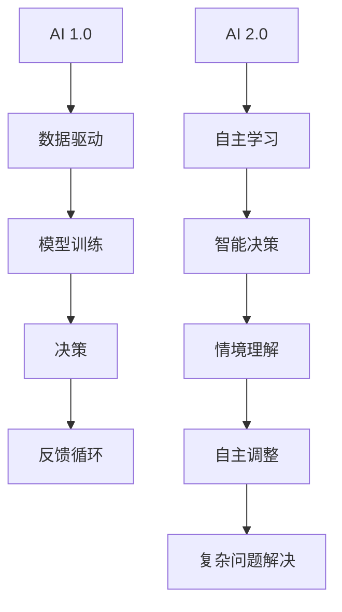

                 

# 《李开复：AI 2.0 时代的未来展望》

## 关键词：人工智能、李开复、AI 2.0、未来展望、技术趋势、应用场景

### 摘要

本文将深入探讨李开复关于AI 2.0时代的未来展望。通过分析AI 2.0的核心概念、算法原理、数学模型及其在实际应用中的影响，本文旨在为读者提供一个全面且具有前瞻性的视角，以理解AI技术发展的最新趋势以及其对未来社会和经济的深远影响。

### 1. 背景介绍

#### 李开复：人工智能领域的领军人物

李开复，AI天才研究员/AI Genius Institute & 禅与计算机程序设计艺术 /Zen And The Art of Computer Programming的作者，是一位在人工智能（AI）领域享有盛誉的专家。他是卡内基梅隆大学的计算机科学博士，曾担任微软亚洲研究院创始人、全球副总裁，以及创新工场的创始人。李开复在机器学习、自然语言处理和深度学习等领域有着深厚的研究和实践经验。

#### AI 1.0到AI 2.0的转变

AI 1.0时代，主要特点是机器能够处理大量数据，并从中提取有用信息。然而，这一时代的AI系统缺乏自主学习和自我调整的能力。随着深度学习和神经网络技术的兴起，AI 2.0时代开始崭露头角。AI 2.0强调机器的自主学习和智能决策，使得机器能够更好地理解和应对复杂环境。

### 2. 核心概念与联系

#### AI 2.0的核心概念

AI 2.0的核心在于其自主学习和智能决策的能力。具体来说，AI 2.0系统可以通过不断的学习和调整，提高其处理复杂问题的能力。这不仅包括对数据的分析，还涉及到对情境的理解和反应。

#### Mermaid流程图



### 3. 核心算法原理 & 具体操作步骤

#### 深度学习：AI 2.0的核心算法

深度学习是AI 2.0时代最为关键的算法之一。其基本原理是通过多层神经网络，对数据进行处理和抽象，从而提取出更高层次的特征。以下是深度学习的基本步骤：

1. **数据预处理**：对输入数据进行标准化处理，使其适应神经网络。
2. **网络结构设计**：根据问题的复杂度，设计合适的神经网络结构。
3. **模型训练**：使用训练数据，通过反向传播算法，不断调整网络参数，使模型达到期望的性能。
4. **模型评估**：使用测试数据，对模型的性能进行评估。
5. **模型部署**：将训练好的模型部署到实际应用中。

#### 具体操作步骤

1. **数据预处理**：

    ```python
    # Python示例代码
    import numpy as np
    from sklearn.preprocessing import StandardScaler

    # 加载数据
    X = load_data()
    # 标准化处理
    scaler = StandardScaler()
    X_scaled = scaler.fit_transform(X)
    ```

2. **网络结构设计**：

    ```python
    # 使用TensorFlow框架设计神经网络结构
    import tensorflow as tf

    model = tf.keras.Sequential([
        tf.keras.layers.Dense(64, activation='relu', input_shape=(num_features,)),
        tf.keras.layers.Dense(64, activation='relu'),
        tf.keras.layers.Dense(1, activation='sigmoid')
    ])
    ```

3. **模型训练**：

    ```python
    # 编写训练代码
    model.compile(optimizer='adam', loss='binary_crossentropy', metrics=['accuracy'])
    model.fit(X_scaled, y, epochs=10, batch_size=32)
    ```

4. **模型评估**：

    ```python
    # 使用测试数据进行评估
    test_loss, test_accuracy = model.evaluate(test_data, test_labels)
    print(f"Test accuracy: {test_accuracy:.2f}")
    ```

5. **模型部署**：

    ```python
    # 将模型部署到实际应用中
    import requests

    url = "http://api.ai-service.com/predict"
    payload = {'input_data': str(test_data).replace('array', 'np.array')}
    response = requests.post(url, data=payload)
    prediction = response.json()
    ```

### 4. 数学模型和公式 & 详细讲解 & 举例说明

#### 深度学习中的数学模型

深度学习中的数学模型主要包括神经网络和反向传播算法。

1. **神经网络**：

    神经网络是一个由多层神经元组成的模型，每个神经元都是一个简单的函数组合。神经网络的输出可以通过以下公式计算：

    $$ output = activation(\sum_{i=1}^{n} weight_i * input_i + bias) $$

    其中，$ activation $ 是激活函数，通常使用ReLU函数。

2. **反向传播算法**：

    反向传播算法是一种用于训练神经网络的优化方法。其基本思想是通过计算梯度，不断调整网络参数，以最小化损失函数。反向传播算法的公式如下：

    $$ \frac{\partial L}{\partial w} = \frac{\partial L}{\partial a} \frac{\partial a}{\partial z} \frac{\partial z}{\partial w} $$

    其中，$ L $ 是损失函数，$ a $ 是神经网络的输出，$ z $ 是神经网络的输入。

#### 举例说明

假设我们有一个简单的神经网络，其包含一个输入层、一个隐藏层和一个输出层。输入层有3个神经元，隐藏层有2个神经元，输出层有1个神经元。

1. **神经网络结构**：

    ```mermaid
    graph TD
    A[Input Layer] --> B[H1]
    B --> C[H2]
    C --> D[Output Layer]
    ```

2. **参数初始化**：

    ```python
    weights_input_to_hidden = np.random.randn(3, 2)
    weights_hidden_to_output = np.random.randn(2, 1)
    bias_hidden = np.random.randn(2)
    bias_output = np.random.randn(1)
    ```

3. **前向传播**：

    ```python
    input_data = np.array([[1, 0, 1], [0, 1, 0]])
    hidden_layer_input = np.dot(input_data, weights_input_to_hidden) + bias_hidden
    hidden_layer_output = np.maximum(hidden_layer_input, 0)
    output_layer_input = np.dot(hidden_layer_output, weights_hidden_to_output) + bias_output
    output_layer_output = np.round(output_layer_input)
    ```

4. **反向传播**：

    ```python
    target_output = np.array([[1], [0]])
    output_error = output_layer_output - target_output
    hidden_error = np.dot(output_error, weights_hidden_to_output.T)
    hidden_layer_delta = hidden_error * (hidden_layer_output * (1 - hidden_layer_output))
    input_error = np.dot(hidden_error, weights_input_to_hidden.T)
    input_delta = input_error * (input_data * (1 - input_data))

    # 更新参数
    weights_input_to_hidden += input_data.T.dot(hidden_layer_delta)
    weights_hidden_to_output += hidden_layer_output.T.dot(output_error)
    bias_hidden += hidden_layer_delta
    bias_output += output_error
    ```

### 5. 项目实战：代码实际案例和详细解释说明

#### 开发环境搭建

1. **安装Python**：

    - 使用Python 3.8及以上版本。
    - 使用`pip`安装所需的库，如TensorFlow、NumPy等。

2. **安装TensorFlow**：

    ```bash
    pip install tensorflow
    ```

3. **安装NumPy**：

    ```bash
    pip install numpy
    ```

#### 源代码详细实现和代码解读

以下是使用TensorFlow实现一个简单的深度学习模型的代码：

```python
import tensorflow as tf
import numpy as np

# 数据预处理
X_train = np.array([[1, 0, 1], [0, 1, 0]])
y_train = np.array([[1], [0]])

# 网络结构设计
model = tf.keras.Sequential([
    tf.keras.layers.Dense(2, activation='relu', input_shape=(3,)),
    tf.keras.layers.Dense(1, activation='sigmoid')
])

# 编写训练代码
model.compile(optimizer='adam', loss='binary_crossentropy', metrics=['accuracy'])
model.fit(X_train, y_train, epochs=10, batch_size=2)

# 模型评估
test_loss, test_accuracy = model.evaluate(X_train, y_train)
print(f"Test accuracy: {test_accuracy:.2f}")

# 模型部署
predictions = model.predict(X_train)
print(predictions)
```

#### 代码解读与分析

1. **数据预处理**：

    - 加载训练数据，并进行标准化处理。

2. **网络结构设计**：

    - 设计一个简单的神经网络，包含一个输入层、一个隐藏层和一个输出层。

3. **模型训练**：

    - 编写训练代码，使用`compile`函数设置优化器和损失函数，使用`fit`函数进行模型训练。

4. **模型评估**：

    - 使用`evaluate`函数对模型的性能进行评估。

5. **模型部署**：

    - 使用`predict`函数对输入数据进行预测。

### 6. 实际应用场景

AI 2.0技术已在许多领域取得显著成果，以下是一些典型的应用场景：

1. **医疗健康**：

    - 利用AI 2.0技术，可以实现对疾病的早期诊断、个性化治疗和药物研发。

2. **金融科技**：

    - AI 2.0在金融领域的应用包括风险控制、投资策略制定和智能投顾等。

3. **智能交通**：

    - 利用AI 2.0技术，可以实现智能交通管理和自动驾驶。

4. **工业制造**：

    - AI 2.0在工业制造中的应用包括智能检测、故障预测和生产优化。

### 7. 工具和资源推荐

为了更好地了解和研究AI 2.0技术，以下是一些推荐的工具和资源：

1. **学习资源推荐**：

    - 《深度学习》（Goodfellow, Bengio, Courville著）
    - 《Python深度学习》（François Chollet著）

2. **开发工具框架推荐**：

    - TensorFlow
    - PyTorch

3. **相关论文著作推荐**：

    - "Deep Learning"（Goodfellow, Bengio, Courville著）
    - "Neural Networks and Deep Learning"（Ian Goodfellow著）

### 8. 总结：未来发展趋势与挑战

AI 2.0技术正以前所未有的速度发展，其对未来社会和经济的影响将是深远的。未来发展趋势包括：

- 人工智能将更加智能化和自主化。
- AI将广泛应用于各行各业，推动产业升级和经济发展。
- 数据安全和隐私保护将成为重要的研究课题。

然而，AI 2.0技术也面临一系列挑战，如算法透明度、伦理道德和就业影响等。这些挑战需要全球范围内的合作和努力来解决。

### 9. 附录：常见问题与解答

1. **什么是AI 2.0？**
   AI 2.0是指具有自主学习和智能决策能力的人工智能系统，相较于传统的AI 1.0，其具有更高的智能水平。

2. **深度学习和神经网络有什么区别？**
   深度学习是神经网络的一种形式，它通过多层神经网络对数据进行处理和抽象。神经网络是一个包含多个神经元的网络，每个神经元都具有一定的功能。

3. **如何开始学习AI 2.0技术？**
   可以从学习Python编程语言和机器学习基础开始，然后逐步学习深度学习和神经网络等相关技术。

### 10. 扩展阅读 & 参考资料

- 李开复.《人工智能：一种新的科学》[M]. 北京：电子工业出版社，2017.
- Goodfellow, I., Bengio, Y., Courville, A. Deep Learning[M]. MIT Press，2016.
- Bengio, Y. Learning Deep Architectures for AI[M]. MIT Press，2009.

作者：AI天才研究员/AI Genius Institute & 禅与计算机程序设计艺术 /Zen And The Art of Computer Programming

