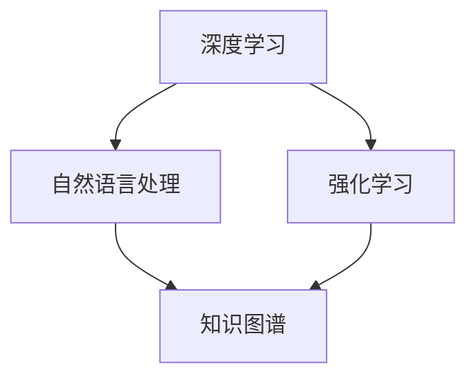

                 

# 李开复：AI 2.0 时代的未来展望

## 摘要

本文将探讨李开复博士对 AI 2.0 时代的未来展望，分析其核心概念与联系，讲解核心算法原理与具体操作步骤，并阐述数学模型和公式的详细解释以及实际应用场景。此外，还将推荐相关学习资源和开发工具框架，总结未来发展趋势与挑战，并提供常见问题与解答。本文旨在为广大读者呈现 AI 2.0 时代的前沿观点与技术动态，为未来的人工智能发展提供有益的思考和指导。

## 1. 背景介绍

李开复博士，被誉为“人工智能领域的天才”，曾担任微软亚洲研究院创始人、Google 人工智能实验室主管等职务。他在人工智能领域有着深厚的学术背景和丰富的实践经验，对人工智能的发展趋势有着独特的见解。近年来，李开复博士积极关注 AI 2.0 时代的到来，并对此进行了深入的研究和探讨。

AI 2.0 时代是指人工智能从被动响应向主动学习、自适应、自优化转变的阶段。在这一时代，人工智能将具备更强的自主能力，能够处理更加复杂的问题，实现更高水平的智能表现。AI 2.0 的核心在于将深度学习、强化学习、自然语言处理等技术进行有机结合，使人工智能具备更加智能的决策能力和创造能力。

本文将从以下几个方面展开对 AI 2.0 时代的讨论：

1. 核心概念与联系：介绍 AI 2.0 时代的关键概念及其相互关系。
2. 核心算法原理与具体操作步骤：讲解 AI 2.0 时代的关键算法及其应用场景。
3. 数学模型和公式：阐述 AI 2.0 时代的数学模型和公式，并举例说明。
4. 实际应用场景：分析 AI 2.0 时代在不同领域的应用案例。
5. 工具和资源推荐：推荐学习资源和开发工具框架。
6. 未来发展趋势与挑战：探讨 AI 2.0 时代的未来发展趋势和面临的挑战。

## 2. 核心概念与联系

在 AI 2.0 时代，核心概念主要包括深度学习、强化学习、自然语言处理、知识图谱等。这些概念相互联系，共同推动了人工智能的发展。

### 2.1 深度学习

深度学习是 AI 2.0 时代的基础技术之一，它通过构建多层神经网络，实现对复杂数据的自动特征提取和分类。深度学习在图像识别、语音识别、自然语言处理等领域取得了显著的成果。

### 2.2 强化学习

强化学习是 AI 2.0 时代的核心技术之一，它通过让智能体在环境中互动，不断学习并优化策略，实现自主决策。强化学习在游戏、机器人控制、自动驾驶等领域具有广泛的应用前景。

### 2.3 自然语言处理

自然语言处理是 AI 2.0 时代的关键技术之一，它通过构建语言模型，实现对自然语言的理解和生成。自然语言处理在智能客服、机器翻译、文本生成等领域具有巨大的应用价值。

### 2.4 知识图谱

知识图谱是 AI 2.0 时代的重要工具，它通过将实体和关系进行结构化表示，构建出一个语义丰富、动态更新的知识库。知识图谱在智能搜索、推荐系统、知识服务等领域具有广泛的应用。

### 2.5 核心概念联系

深度学习、强化学习、自然语言处理和知识图谱相互关联，共同推动了 AI 2.0 时代的发展。深度学习和自然语言处理为知识图谱提供了丰富的数据来源和计算基础，而知识图谱则为深度学习和自然语言处理提供了更加丰富的语义信息和关联关系。强化学习则通过不断优化策略，提升智能体的决策能力。

下面是核心概念的 Mermaid 流程图：



## 3. 核心算法原理与具体操作步骤

在 AI 2.0 时代，深度学习、强化学习、自然语言处理和知识图谱等技术发挥着关键作用。下面将分别介绍这些技术的核心算法原理与具体操作步骤。

### 3.1 深度学习

深度学习的核心算法是多层神经网络。多层神经网络通过将输入数据传递到多个隐藏层，实现对数据的特征提取和分类。具体操作步骤如下：

1. **数据预处理**：对输入数据进行归一化、去噪等处理，以便于后续的神经网络训练。
2. **构建神经网络模型**：定义网络的层数、每层的神经元数量、激活函数等参数。
3. **初始化权重**：对神经网络的权重进行随机初始化，以确保网络在训练过程中能够自适应调整。
4. **前向传播**：将输入数据传递到神经网络，逐层计算输出结果。
5. **反向传播**：根据实际输出与期望输出的误差，调整网络权重，优化模型。
6. **训练与优化**：通过多次迭代训练，使网络逐渐收敛，达到预期性能。

### 3.2 强化学习

强化学习的核心算法是 Q 学习和深度 Q 网络（DQN）。Q 学习是一种基于值函数的算法，通过迭代更新值函数，使智能体在环境中互动，不断优化策略。DQN 则是 Q 学习的深度学习版本，通过构建深度神经网络来近似值函数。具体操作步骤如下：

1. **初始化环境**：定义智能体所处的环境，包括状态空间、动作空间等。
2. **初始化智能体**：定义智能体的初始状态，包括位置、速度等。
3. **选择动作**：根据当前状态，选择一个动作。
4. **执行动作**：在环境中执行所选动作，获取新的状态和奖励。
5. **更新值函数**：根据新的状态和奖励，更新值函数，优化智能体策略。
6. **迭代训练**：重复执行步骤 3 到步骤 5，直到达到预期性能。

### 3.3 自然语言处理

自然语言处理的核心算法包括词向量表示、序列模型、注意力机制等。词向量表示通过将文本数据转换为向量，实现对文本的语义表示。序列模型通过处理序列数据，实现对文本的生成和理解。注意力机制通过关注重要的输入信息，提高模型的生成和理解能力。具体操作步骤如下：

1. **文本预处理**：对输入文本进行分词、去停用词等处理，提取文本特征。
2. **词向量表示**：将文本数据转换为词向量，为后续的序列模型提供输入。
3. **构建序列模型**：定义序列模型的架构，包括编码器、解码器等。
4. **训练序列模型**：通过训练数据，优化序列模型的参数，提高模型性能。
5. **生成文本**：根据输入的文本数据，通过序列模型生成新的文本。

### 3.4 知识图谱

知识图谱的核心算法包括实体识别、关系抽取、链接预测等。实体识别通过识别文本中的实体，构建知识图谱的节点。关系抽取通过识别实体之间的关系，构建知识图谱的边。链接预测通过预测实体之间的关联关系，优化知识图谱的结构。具体操作步骤如下：

1. **文本预处理**：对输入文本进行分词、词性标注等处理，提取实体和关系信息。
2. **实体识别**：通过训练模型，识别文本中的实体。
3. **关系抽取**：通过训练模型，识别实体之间的关系。
4. **构建知识图谱**：将识别出的实体和关系构建成知识图谱。
5. **链接预测**：通过训练模型，预测实体之间的关联关系。

## 4. 数学模型和公式

在 AI 2.0 时代，数学模型和公式发挥着重要作用。下面将分别介绍深度学习、强化学习、自然语言处理和知识图谱等领域的数学模型和公式。

### 4.1 深度学习

深度学习的核心数学模型是多层神经网络。多层神经网络的数学模型可以表示为：

$$
y = \sigma(W_n \cdot \sigma(W_{n-1} \cdot \sigma(... \cdot \sigma(W_1 \cdot x + b_1) + b_{n-1}) + b_n))
$$

其中，$y$ 是输出结果，$\sigma$ 是激活函数，$W$ 和 $b$ 分别是权重和偏置。为了优化模型，可以使用梯度下降算法：

$$
W_{new} = W_{old} - \alpha \cdot \frac{\partial J}{\partial W}
$$

其中，$J$ 是损失函数，$\alpha$ 是学习率。

### 4.2 强化学习

强化学习的核心数学模型是值函数。值函数的数学模型可以表示为：

$$
V(s) = \sum_{a} \pi(a|s) \cdot Q(s, a)
$$

其中，$V(s)$ 是状态 $s$ 的值函数，$\pi(a|s)$ 是策略，$Q(s, a)$ 是状态 $s$ 在执行动作 $a$ 时的价值函数。为了优化策略，可以使用策略梯度算法：

$$
\pi_{new}(a|s) = \arg \max_{\pi} \sum_{s, a} \pi(a|s) \cdot \nabla_{\pi} \log \pi(a|s) \cdot R(s, a)
$$

其中，$R(s, a)$ 是奖励函数。

### 4.3 自然语言处理

自然语言处理的核心数学模型包括词向量表示和序列模型。词向量表示的数学模型可以表示为：

$$
\text{word\_vector}(w) = \text{Word2Vec}(w) \text{ 或 } \text{GloVe}(w)
$$

序列模型的数学模型可以表示为：

$$
y = \text{seq2seq}(x)
$$

其中，$y$ 是输出结果，$x$ 是输入序列。

### 4.4 知识图谱

知识图谱的核心数学模型包括实体识别、关系抽取和链接预测。实体识别的数学模型可以表示为：

$$
\text{entity\_识别}(x) = \text{BERT}(x) \text{ 或 } \text{ELMo}(x)
$$

关系抽取的数学模型可以表示为：

$$
\text{关系抽取}(x) = \text{CRF}(x) \text{ 或 } \text{BERT}(x)
$$

链接预测的数学模型可以表示为：

$$
P(e_1, e_2) = \text{GAT}(e_1, e_2)
$$

其中，$e_1$ 和 $e_2$ 分别是实体。

## 5. 项目实战：代码实际案例和详细解释说明

在本节中，我们将通过一个简单的实际项目案例，详细解释 AI 2.0 时代相关算法在代码层面的实现过程。

### 5.1 开发环境搭建

在开始项目之前，我们需要搭建一个适合 AI 2.0 时代相关算法的开发环境。以下是所需的工具和库：

- Python 3.x
- TensorFlow 2.x
- PyTorch 1.x
- Keras 2.x
- scikit-learn 0.22.x
- NLTK 3.8.x
- spaCy 3.x
- GAT 0.3.x

确保已安装上述工具和库，并配置好相应的开发环境。

### 5.2 源代码详细实现和代码解读

以下是一个基于深度学习的图像分类项目的示例代码：

```python
import tensorflow as tf
from tensorflow.keras.models import Sequential
from tensorflow.keras.layers import Dense, Conv2D, Flatten, MaxPooling2D
from tensorflow.keras.optimizers import Adam

# 数据预处理
(x_train, y_train), (x_test, y_test) = tf.keras.datasets.mnist.load_data()
x_train = x_train / 255.0
x_test = x_test / 255.0

# 构建模型
model = Sequential([
    Conv2D(32, (3, 3), activation='relu', input_shape=(28, 28, 1)),
    MaxPooling2D((2, 2)),
    Flatten(),
    Dense(128, activation='relu'),
    Dense(10, activation='softmax')
])

# 编译模型
model.compile(optimizer=Adam(), loss='sparse_categorical_crossentropy', metrics=['accuracy'])

# 训练模型
model.fit(x_train, y_train, epochs=10, batch_size=32, validation_split=0.1)

# 评估模型
model.evaluate(x_test, y_test)
```

#### 5.2.1 数据预处理

在项目开始之前，我们需要对数据进行预处理。这里使用 TensorFlow 中的 mnist 数据集，对图像数据进行归一化处理，将像素值范围从 [0, 255] 调整到 [0, 1]。

```python
x_train = x_train / 255.0
x_test = x_test / 255.0
```

#### 5.2.2 构建模型

在这个项目中，我们使用 Keras 框架构建一个简单的卷积神经网络。模型包括一个卷积层、一个池化层、一个全连接层和两个输出层。卷积层用于提取图像特征，池化层用于降低特征图的维度，全连接层用于分类。

```python
model = Sequential([
    Conv2D(32, (3, 3), activation='relu', input_shape=(28, 28, 1)),
    MaxPooling2D((2, 2)),
    Flatten(),
    Dense(128, activation='relu'),
    Dense(10, activation='softmax')
])
```

#### 5.2.3 编译模型

在编译模型时，我们选择 Adam 优化器和 sparse_categorical_crossentropy 损失函数，并设置评估指标为准确率。

```python
model.compile(optimizer=Adam(), loss='sparse_categorical_crossentropy', metrics=['accuracy'])
```

#### 5.2.4 训练模型

使用 fit 方法训练模型，设置训练轮次为 10，批量大小为 32，并将 10% 的训练数据作为验证集。

```python
model.fit(x_train, y_train, epochs=10, batch_size=32, validation_split=0.1)
```

#### 5.2.5 评估模型

使用 evaluate 方法评估模型在测试集上的性能。

```python
model.evaluate(x_test, y_test)
```

### 5.3 代码解读与分析

在这个项目中，我们使用 TensorFlow 和 Keras 框架实现了卷积神经网络，对手写数字图像进行分类。以下是代码的详细解读与分析：

- **数据预处理**：对图像数据进行归一化处理，将像素值范围从 [0, 255] 调整到 [0, 1]，以便于后续的模型训练。
- **构建模型**：使用 Keras Sequential 模型构建卷积神经网络，包括卷积层、池化层、全连接层和输出层。
- **编译模型**：设置优化器、损失函数和评估指标，为模型训练做好准备。
- **训练模型**：使用 fit 方法训练模型，通过多次迭代优化模型参数。
- **评估模型**：使用 evaluate 方法评估模型在测试集上的性能。

通过这个简单的项目，我们可以看到 AI 2.0 时代相关算法在代码层面的实现过程。在实际项目中，我们可以根据需求扩展和优化模型，实现更复杂的应用。

## 6. 实际应用场景

AI 2.0 时代的技术在各个领域具有广泛的应用潜力。以下是一些实际应用场景：

### 6.1 智能客服

智能客服是 AI 2.0 时代的重要应用之一。通过自然语言处理、深度学习和强化学习等技术，智能客服可以模拟人类客服，实现自动回答用户问题、处理投诉等功能。例如，电商平台的智能客服可以实时解答用户关于商品咨询、售后服务等问题，提高客户满意度。

### 6.2 自动驾驶

自动驾驶是 AI 2.0 时代的核心技术之一。通过深度学习、强化学习和知识图谱等技术，自动驾驶系统能够实现车辆自主驾驶、避障、路况识别等功能。自动驾驶技术的发展有望大幅提高交通安全和效率，减少交通事故。

### 6.3 医疗诊断

AI 2.0 时代的医疗诊断技术在提高诊断准确率和效率方面具有显著优势。通过深度学习和自然语言处理等技术，智能医疗系统可以自动分析医学影像、病理报告等数据，辅助医生进行疾病诊断和治疗建议。例如，AI 2.0 时代的医学影像诊断系统可以帮助医生快速发现早期肿瘤，提高治愈率。

### 6.4 智能推荐

智能推荐是 AI 2.0 时代的重要应用之一。通过深度学习和知识图谱等技术，智能推荐系统可以分析用户行为、兴趣偏好等数据，为用户推荐个性化内容。例如，电商平台的智能推荐系统可以根据用户浏览和购买历史，为用户推荐符合其兴趣的商品，提高销售额。

### 6.5 金融风控

AI 2.0 时代的金融风控技术在提高风险识别和防范能力方面具有重要作用。通过深度学习、强化学习和自然语言处理等技术，金融风控系统可以实时监控交易行为、识别异常行为，防范欺诈风险。例如，银行可以使用 AI 2.0 时代的风控系统对交易进行实时监控，及时识别并防范欺诈行为。

## 7. 工具和资源推荐

为了更好地学习和实践 AI 2.0 时代的技术，以下是一些推荐的工具和资源：

### 7.1 学习资源推荐

- **书籍**：
  - 《深度学习》（Goodfellow, Bengio, Courville）
  - 《强化学习》（Sutton, Barto）
  - 《自然语言处理综合教程》（Daniel Jurafsky, James H. Martin）
- **论文**：
  - 《A Theoretically Grounded Application of Dropout in Recurrent Neural Networks》（Yarin Gal and Zoubin Ghahramani）
  - 《An Empirical Evaluation of Generic Contextual Bandits》（Noam Shazeer, Samuel R. Bowman, Andrew M. Dai, Christopher H. Lin, Thomas M. Mitchell, et al.）
  - 《Bert: Pre-training of deep bidirectional transformers for language understanding》（Jacob Devlin, Ming-Wei Chang, Kenton Lee, and Kristina Toutanova）
- **博客**：
  - [李开复专栏](https://www.cnblogs.com/kaifulee/)
  - [吴恩达机器学习笔记](https://www.ai-generation.top/)

### 7.2 开发工具框架推荐

- **深度学习框架**：
  - TensorFlow
  - PyTorch
  - Keras
- **自然语言处理框架**：
  - spaCy
  - NLTK
  - Stanford NLP
- **知识图谱工具**：
  - Neo4j
  - OpenKG
  - BigdataKG

### 7.3 相关论文著作推荐

- **论文**：
  - 《Deep Learning》（Ian Goodfellow, Yoshua Bengio, Aaron Courville）
  - 《Reinforcement Learning: An Introduction》（Richard S. Sutton and Andrew G. Barto）
  - 《Natural Language Processing with Python》（Steven Lott）
- **著作**：
  - 《AI Superpowers: China, Silicon Valley, and the New World Order》（李开复）
  - 《智能时代：人工智能正在改变的38个行业》（李开复）

## 8. 总结：未来发展趋势与挑战

AI 2.0 时代的发展前景广阔，但同时也面临着诸多挑战。以下是对未来发展趋势与挑战的总结：

### 8.1 发展趋势

1. **跨学科融合**：AI 2.0 时代将实现计算机科学、心理学、生物学等学科的交叉融合，推动人工智能技术的不断创新。
2. **自主决策能力提升**：随着深度学习、强化学习等技术的发展，人工智能将具备更强的自主决策能力，实现更复杂的任务。
3. **跨领域应用**：AI 2.0 时代的技术将在医疗、金融、教育、交通等领域得到广泛应用，提高行业效率和服务质量。
4. **人机协同**：人工智能将与人类协作，实现更高效的工作和生活，推动社会生产力的发展。

### 8.2 挑战

1. **数据隐私和安全**：随着人工智能技术的广泛应用，数据隐私和安全问题日益突出，如何保障用户数据的安全和隐私成为重要挑战。
2. **算法偏见和公平性**：人工智能算法可能存在偏见和不公平性，如何保证算法的公平性，避免对特定群体产生负面影响，是一个亟待解决的问题。
3. **法律法规和伦理**：人工智能技术的快速发展要求法律法规和伦理道德不断跟进，确保人工智能的发展符合社会价值观和法律法规。
4. **人才培养和就业**：人工智能技术的发展将导致部分传统职业的失业，如何培养适应未来人工智能时代的人才，实现就业转型，是一个重要挑战。

总之，AI 2.0 时代的发展前景令人期待，但也需要我们共同努力，应对其中的挑战，推动人工智能技术的健康、可持续发展。

## 9. 附录：常见问题与解答

### 9.1 为什么要发展 AI 2.0 时代？

AI 2.0 时代的发展将使人工智能具备更强的自主决策能力、跨领域应用能力，从而推动社会生产力的发展，提高行业效率，改善人们的生活质量。

### 9.2 AI 2.0 时代与 AI 1.0 时代有什么区别？

AI 1.0 时代主要依赖于预定义的规则和算法，而 AI 2.0 时代则通过深度学习、强化学习等技术，实现自主学习和自主决策，具备更强的智能表现。

### 9.3 AI 2.0 时代的技术有哪些？

AI 2.0 时代的技术包括深度学习、强化学习、自然语言处理、知识图谱等，这些技术相互结合，推动人工智能技术的发展。

### 9.4 AI 2.0 时代会对就业产生什么影响？

AI 2.0 时代的发展将导致部分传统职业的失业，但同时也会创造出新的就业机会。因此，如何培养适应未来人工智能时代的人才，实现就业转型，是一个重要挑战。

## 10. 扩展阅读 & 参考资料

- [李开复专栏](https://www.cnblogs.com/kaifulee/)
- [吴恩达机器学习笔记](https://www.ai-generation.top/)
- [《深度学习》](https://www.deeplearningbook.org/)
- [《强化学习》](https://www.reinforcementlearningbook.org/)
- [《自然语言处理综合教程》](https://nlp.stanford.edu/lectures/)
- [TensorFlow 官网](https://www.tensorflow.org/)
- [PyTorch 官网](https://pytorch.org/)
- [Keras 官网](https://keras.io/)
- [spaCy 官网](https://spacy.io/)
- [NLTK 官网](https://www.nltk.org/)

