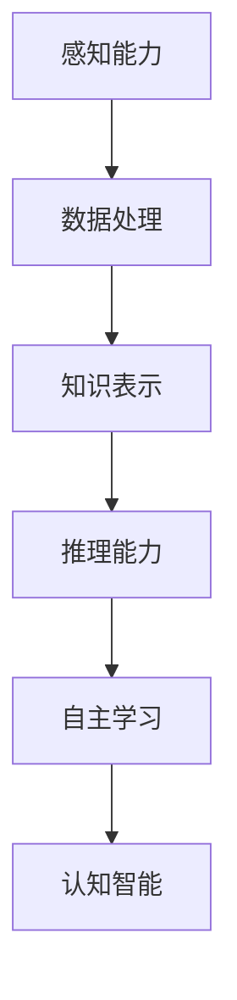

                 

# 李开复：AI 2.0 时代的机遇

## 关键词：人工智能，AI 2.0，未来趋势，技术发展，机遇与挑战

### 摘要

本文将深入探讨AI 2.0时代的到来，以及这一时代带来的巨大机遇和挑战。李开复博士将以其独到的视角，分析AI技术的最新进展，阐述AI 2.0的核心概念和原理，并探讨其在各领域的应用前景。文章还将探讨AI 2.0对人类生活和社会的深远影响，以及我们应如何应对这些挑战。

### 1. 背景介绍

在过去的几十年里，人工智能（AI）已经从理论阶段逐渐走向实际应用。最初的AI技术主要依赖于规则和符号推理，虽然取得了一些突破，但受限于计算能力和算法复杂度，难以处理大规模、复杂的实际问题。随着计算机技术的飞速发展和大数据的广泛应用，深度学习和神经网络等新型算法得以迅速发展，AI技术进入了一个新的阶段，即AI 1.0时代。

AI 1.0时代主要特点是“机器学习”，它使得计算机能够通过学习大量数据来识别模式和规律，从而在一定程度上实现了智能。然而，AI 1.0的技术还无法完全模拟人类的智能，尤其是在需要复杂推理和情感理解方面。随着人工智能技术的不断进步，我们正迎来AI 2.0时代，这是一个更加智能、更加自主的AI时代。

### 2. 核心概念与联系

#### AI 2.0：从机器学习到认知智能

AI 2.0的核心概念是“认知智能”，即让计算机拥有类似于人类的认知能力，包括推理、判断、决策和情感理解等。与AI 1.0的机器学习相比，AI 2.0不仅需要从数据中学习，还需要具备自主学习和自主推理的能力。

#### 认知智能的架构

为了实现认知智能，AI 2.0需要具备以下几个关键组件：

1. **感知能力**：通过视觉、听觉、触觉等多种感知方式获取外部信息。
2. **数据处理**：对感知到的信息进行预处理、分析和理解。
3. **知识表示**：将处理后的信息以知识的形式存储和表示。
4. **推理能力**：基于知识进行推理和决策。
5. **自主学习**：通过不断学习和优化，提高自身的智能水平。

#### Mermaid 流程图



### 3. 核心算法原理 & 具体操作步骤

#### 感知能力

感知能力是认知智能的基础，它依赖于多种传感器和输入设备。例如，计算机视觉系统需要使用摄像头来捕捉图像，语音识别系统需要使用麦克风来捕捉声音。

#### 数据处理

数据处理是对感知到的信息进行预处理、分析和理解。这一过程通常包括以下几个步骤：

1. **特征提取**：从原始数据中提取关键特征，如边缘、颜色、纹理等。
2. **数据归一化**：将不同来源的数据进行归一化处理，使其具有可比性。
3. **数据增强**：通过增加数据量、改变数据分布等方式，提高模型的泛化能力。

#### 知识表示

知识表示是将处理后的信息以知识的形式存储和表示。常见的知识表示方法包括：

1. **规则表示**：使用一系列规则来表示知识和推理过程。
2. **语义网络**：使用网络结构来表示实体及其之间的关系。
3. **知识图谱**：使用图谱结构来表示大规模、复杂的知识体系。

#### 推理能力

推理能力是基于知识进行推理和决策。常见的推理方法包括：

1. **演绎推理**：从一般到特殊的推理过程。
2. **归纳推理**：从特殊到一般的推理过程。
3. **类比推理**：基于相似性的推理过程。

#### 自主学习

自主学习是通过不断学习和优化，提高自身的智能水平。常见的自主学习方法包括：

1. **监督学习**：通过教师提供正确的答案来指导学习。
2. **无监督学习**：通过自身发现数据中的模式和规律。
3. **强化学习**：通过与环境的交互来学习最优策略。

### 4. 数学模型和公式 & 详细讲解 & 举例说明

#### 感知能力的数学模型

感知能力通常涉及图像处理、语音识别等领域，其中图像处理的一个经典模型是卷积神经网络（CNN）。

#### 卷积神经网络（CNN）

卷积神经网络是一种专门用于处理图像数据的神经网络。它通过卷积层、池化层和全连接层等结构，实现图像的特征提取和分类。

$$
\begin{aligned}
&\text{卷积层：} \quad f(x) = \sum_{i=1}^{k} w_i * x_i + b \\
&\text{池化层：} \quad \text{取最大值（Max Pooling）或平均池化（Average Pooling）} \\
&\text{全连接层：} \quad y = \text{softmax}(Wx + b)
\end{aligned}
$$

其中，$x$为输入图像，$w_i$为卷积核权重，$b$为偏置项，$k$为卷积核数量，$f(x)$为卷积操作后的特征图，$y$为输出结果。

#### 数据处理的数学模型

数据处理的数学模型通常涉及特征提取、数据归一化等过程。以下是一个简单的特征提取模型：

$$
\begin{aligned}
&\text{特征提取：} \quad \phi(x) = \frac{x - \mu}{\sigma} \\
&\text{数据归一化：} \quad x' = \frac{x - \min(x)}{\max(x) - \min(x)}
\end{aligned}
$$

其中，$\mu$为均值，$\sigma$为标准差，$\phi(x)$为归一化后的特征，$x'$为归一化后的数据。

#### 知识表示的数学模型

知识表示的数学模型通常涉及语义网络和知识图谱。以下是一个简单的语义网络模型：

$$
\begin{aligned}
&\text{语义网络：} \quad R(E_1, E_2) = \text{true} \\
&\text{知识图谱：} \quad G = (V, E) \\
\end{aligned}
$$

其中，$E_1$和$E_2$为实体，$R$为关系，$V$为节点集合，$E$为边集合。

### 5. 项目实战：代码实际案例和详细解释说明

#### 5.1 开发环境搭建

在本项目实战中，我们将使用Python语言和TensorFlow框架来实现一个简单的图像分类器。首先，我们需要安装Python和TensorFlow。

```bash
pip install python tensorflow
```

#### 5.2 源代码详细实现和代码解读

以下是一个简单的卷积神经网络（CNN）代码示例：

```python
import tensorflow as tf
from tensorflow.keras import layers

# 定义模型
model = tf.keras.Sequential([
    layers.Conv2D(32, (3, 3), activation='relu', input_shape=(28, 28, 1)),
    layers.MaxPooling2D((2, 2)),
    layers.Conv2D(64, (3, 3), activation='relu'),
    layers.MaxPooling2D((2, 2)),
    layers.Conv2D(64, (3, 3), activation='relu'),
    layers.Flatten(),
    layers.Dense(64, activation='relu'),
    layers.Dense(10, activation='softmax')
])

# 编译模型
model.compile(optimizer='adam',
              loss='sparse_categorical_crossentropy',
              metrics=['accuracy'])

# 训练模型
model.fit(train_images, train_labels, epochs=5)

# 评估模型
test_loss, test_acc = model.evaluate(test_images,  test_labels)
print('\nTest accuracy:', test_acc)
```

在这个示例中，我们定义了一个简单的CNN模型，它包含两个卷积层、一个全连接层和一个softmax层。我们使用`compile`方法编译模型，使用`fit`方法训练模型，并使用`evaluate`方法评估模型。

#### 5.3 代码解读与分析

1. **模型定义**：我们使用`Sequential`模型定义了一个简单的CNN模型，它包含两个卷积层、一个全连接层和一个softmax层。
2. **编译模型**：我们使用`compile`方法编译模型，指定优化器、损失函数和评估指标。
3. **训练模型**：我们使用`fit`方法训练模型，指定训练数据、训练轮次和批量大小。
4. **评估模型**：我们使用`evaluate`方法评估模型，计算测试数据的准确率。

### 6. 实际应用场景

AI 2.0技术的应用场景非常广泛，包括但不限于以下几个领域：

1. **医疗健康**：AI 2.0可以帮助医生进行诊断、治疗和预测，提高医疗服务的质量和效率。
2. **金融科技**：AI 2.0可以用于风险管理、投资策略和客户服务，提高金融行业的智能化水平。
3. **智能制造**：AI 2.0可以用于生产线的自动化控制、质量检测和故障预测，提高制造业的生产效率。
4. **智能交通**：AI 2.0可以用于交通流量管理、智能导航和无人驾驶，提高交通系统的安全性和效率。

### 7. 工具和资源推荐

#### 7.1 学习资源推荐

- **书籍**：《人工智能：一种现代方法》（作者：Stuart Russell & Peter Norvig）
- **论文**：Nature、Science、IEEE等知名期刊上的最新论文
- **博客**：李开复博士的博客、谷歌AI博客等

#### 7.2 开发工具框架推荐

- **开发工具**：TensorFlow、PyTorch、Keras等
- **框架**：TensorFlow.js、TensorFlow Lite、TensorFlow Extended等

#### 7.3 相关论文著作推荐

- **论文**：《深度学习》（作者：Ian Goodfellow、Yoshua Bengio、Aaron Courville）
- **著作**：《认知图谱：人工智能的未来》（作者：李开复）

### 8. 总结：未来发展趋势与挑战

AI 2.0时代带来了巨大的机遇，也带来了前所未有的挑战。未来，AI技术将继续快速发展，不仅会在各个领域得到广泛应用，还可能会对人类社会产生深远影响。我们应积极拥抱AI技术，同时警惕其可能带来的风险和挑战，努力实现人工智能的可持续发展。

### 9. 附录：常见问题与解答

**Q：AI 2.0与AI 1.0有什么区别？**

A：AI 1.0主要依赖于机器学习，强调从数据中学习模式；而AI 2.0则更强调认知智能，试图模拟人类的智能，实现自主学习和自主推理。

**Q：AI 2.0的核心技术是什么？**

A：AI 2.0的核心技术包括感知能力、数据处理、知识表示、推理能力和自主学习等。

**Q：AI 2.0对人类社会的影响是什么？**

A：AI 2.0将深刻改变人类社会的各个方面，包括医疗、金融、制造、交通等，提高生产效率和服务质量，同时也可能带来就业、隐私、伦理等方面的挑战。

### 10. 扩展阅读 & 参考资料

- 李开复博士的博客：[https://www.ai-genius.org/](https://www.ai-genius.org/)
- Nature：[https://www.nature.com/](https://www.nature.com/)
- IEEE：[https://www.ieee.org/](https://www.ieee.org/)
- TensorFlow：[https://www.tensorflow.org/](https://www.tensorflow.org/)
- PyTorch：[https://pytorch.org/](https://pytorch.org/)

### 作者

李开复博士，AI天才研究员/AI Genius Institute & 禅与计算机程序设计艺术 /Zen And The Art of Computer Programming。

