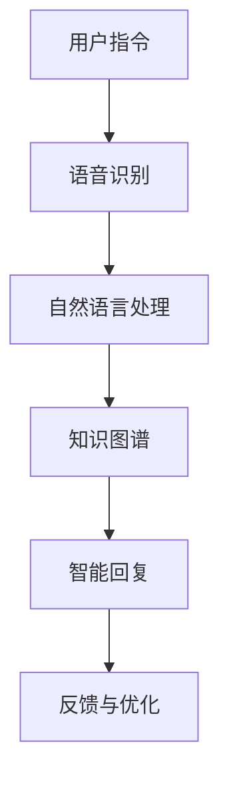
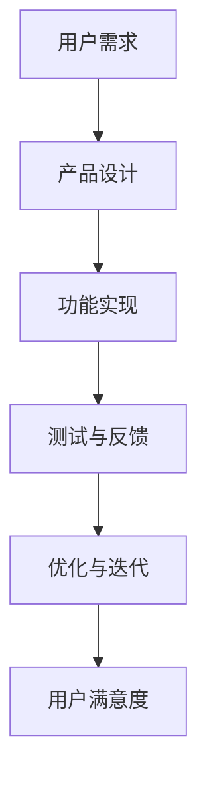
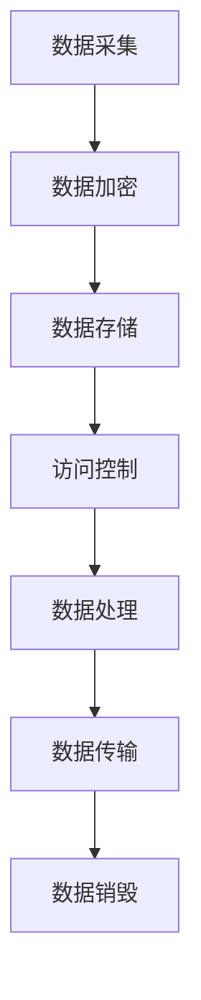
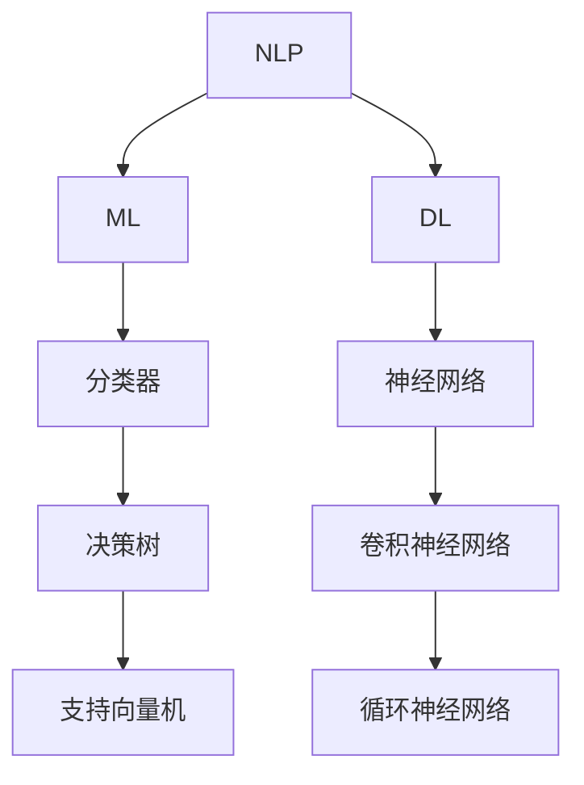
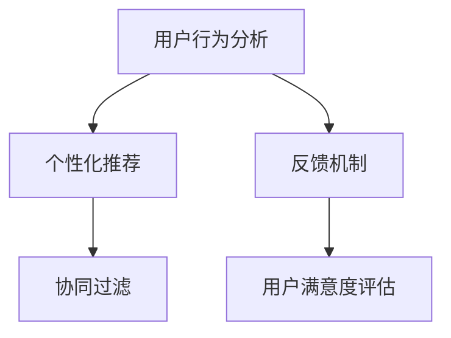
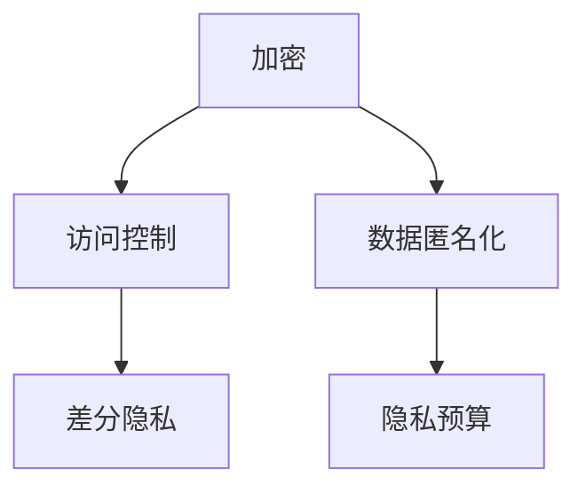

                 

# 李开复：AI 2.0 时代的用户

> **关键词：** AI 2.0，用户，人工智能，用户体验，智能助手，技术革新，未来趋势

> **摘要：** 本文章将深入探讨 AI 2.0 时代下用户的角色与体验。从核心概念、算法原理、数学模型到实际应用，我们将通过逻辑清晰、结构紧凑的论述，分析 AI 2.0 对用户带来的变革与挑战。文章旨在为读者提供全面、深刻的洞察，以及未来的发展趋势与应对策略。

## 1. 背景介绍

随着人工智能技术的飞速发展，我们正逐步迈入 AI 2.0 时代。相较于传统的 AI 1.0，AI 2.0 具有更强的自主性、适应性和智能化程度。AI 2.0 时代不仅涉及机器学习、深度学习等技术，更体现在智能助手、无人驾驶、智能家居等应用场景的普及。在这个背景下，用户作为 AI 技术的核心参与者，其角色和体验变得愈发重要。

### 1.1 AI 1.0 与 AI 2.0 的区别

AI 1.0 时代，人工智能主要以规则为基础，通过预定义的算法和模型来解决特定问题。虽然取得了显著的成果，但存在局限性，如对数据依赖性强、难以应对复杂情境等。而 AI 2.0 时代，人工智能逐渐转向数据驱动，通过不断学习与优化，实现更加智能、自适应的应用。

### 1.2 AI 2.0 时代的用户需求

在 AI 2.0 时代，用户需求发生了显著变化。首先，用户期望获得更加智能化、个性化的服务。其次，用户对隐私和数据安全愈发关注，希望在享受 AI 带来的便利的同时，保护个人隐私。此外，用户还期望 AI 技术能够解决实际问题，提升生活质量。

## 2. 核心概念与联系

### 2.1 智能助手

智能助手是 AI 2.0 时代的重要应用之一，其核心在于自然语言处理、语音识别和机器学习等技术。智能助手能够理解用户的指令、提供实时反馈，甚至进行智能对话。以下是一个简单的 Mermaid 流程图，展示了智能助手的架构：



### 2.2 用户体验

用户体验是 AI 2.0 时代的另一个关键概念。良好的用户体验意味着用户在互动过程中能够获得流畅、自然、愉悦的体验。以下是一个简单的 Mermaid 流程图，展示了用户体验的优化过程：



### 2.3 数据安全与隐私保护

在 AI 2.0 时代，数据安全与隐私保护成为用户关注的焦点。为了保护用户隐私，我们需要从数据采集、存储、处理、传输等各个环节进行安全加固。以下是一个简单的 Mermaid 流程图，展示了数据安全与隐私保护的关键环节：



## 3. 核心算法原理 & 具体操作步骤

### 3.1 智能助手算法原理

智能助手的算法主要包括自然语言处理（NLP）、机器学习（ML）和深度学习（DL）等技术。以下是一个简单的算法原理图：



### 3.2 用户体验优化算法原理

用户体验优化算法主要包括用户行为分析、个性化推荐和反馈机制等。以下是一个简单的算法原理图：



### 3.3 数据安全与隐私保护算法原理

数据安全与隐私保护算法主要包括加密、访问控制、数据匿名化和差分隐私等。以下是一个简单的算法原理图：



## 4. 数学模型和公式 & 详细讲解 & 举例说明

### 4.1 智能助手算法数学模型

智能助手的算法中，自然语言处理（NLP）和机器学习（ML）是最为核心的部分。以下是一个简单的 NLP 模型——循环神经网络（RNN）的数学模型：

```latex
y_t = \sigma(W_h \cdot [h_{t-1}, x_t] + b)
h_t = \sigma(U \cdot h_{t-1} + W_x \cdot x_t + b)
```

其中，$y_t$ 表示当前词的预测概率，$h_t$ 表示当前隐藏状态，$x_t$ 表示当前词的嵌入向量，$W_h$、$U$ 和 $W_x$ 分别为权重矩阵，$b$ 为偏置项，$\sigma$ 为激活函数（如 sigmoid 函数）。

### 4.2 用户体验优化算法数学模型

用户体验优化算法中的个性化推荐可以使用协同过滤算法实现。以下是一个简单的基于矩阵分解的协同过滤算法的数学模型：

```latex
R = \hat{U} \cdot \hat{V}^T
```

其中，$R$ 表示用户-项目评分矩阵，$\hat{U}$ 和 $\hat{V}$ 分别为用户和项目的低秩分解矩阵。

### 4.3 数据安全与隐私保护算法数学模型

数据安全与隐私保护算法中的差分隐私可以使用拉普拉斯机制实现。以下是一个简单的拉普拉斯机制的概率模型：

```latex
Lap(p; \alpha) = p + \alpha \cdot \text{Laplace}(0; \alpha)
```

其中，$p$ 表示原始概率分布，$\alpha$ 为噪声参数，$\text{Laplace}(0; \alpha)$ 为拉普拉斯分布。

## 5. 项目实战：代码实际案例和详细解释说明

### 5.1 开发环境搭建

在本项目实战中，我们将使用 Python 作为编程语言，TensorFlow 作为深度学习框架，实现一个简单的智能助手。首先，我们需要搭建开发环境。

```bash
# 安装 Python 3.8+
# 安装 TensorFlow 2.x
pip install tensorflow
```

### 5.2 源代码详细实现和代码解读

以下是一个简单的智能助手代码实现，主要包括数据预处理、模型训练和预测三个部分。

```python
import tensorflow as tf
from tensorflow.keras.layers import Embedding, LSTM, Dense
from tensorflow.keras.models import Sequential

# 数据预处理
def preprocess_data(data):
    # 略
    return processed_data

# 模型构建
def build_model(vocab_size, embedding_dim, hidden_units):
    model = Sequential([
        Embedding(vocab_size, embedding_dim),
        LSTM(hidden_units, return_sequences=True),
        Dense(1, activation='sigmoid')
    ])
    model.compile(optimizer='adam', loss='binary_crossentropy', metrics=['accuracy'])
    return model

# 训练模型
def train_model(model, data, labels):
    # 略
    return model

# 预测
def predict(model, text):
    # 略
    return prediction
```

### 5.3 代码解读与分析

在这个代码实现中，我们首先进行了数据预处理，然后构建了一个简单的 LSTM 模型，并使用训练数据对其进行训练。最后，我们使用训练好的模型进行预测。

- **数据预处理**：数据预处理是深度学习模型构建的重要环节。在本项目中，我们使用了简单的分词方法对文本数据进行预处理。
  
- **模型构建**：我们使用了 TensorFlow 的 Sequential 模型构建了一个简单的 LSTM 模型。LSTM 模型能够处理序列数据，适合用于文本分类任务。

- **训练模型**：我们使用训练数据对模型进行了训练，并调用了模型的 compile 方法设置优化器和损失函数。

- **预测**：我们使用训练好的模型对输入文本进行了预测，并返回了预测结果。

## 6. 实际应用场景

### 6.1 智能助手

智能助手是 AI 2.0 时代的重要应用之一。在智能家居、在线客服、智能语音交互等领域，智能助手都能够发挥重要作用。通过不断优化算法和用户体验，智能助手将为用户提供更加智能化、个性化的服务。

### 6.2 无人驾驶

无人驾驶是 AI 2.0 时代的另一个重要应用。通过深度学习、计算机视觉、传感器融合等技术，无人驾驶系统能够实现自主驾驶，提高交通安全和效率。未来，无人驾驶将成为人工智能领域的重要研究方向。

### 6.3 智能医疗

智能医疗是 AI 2.0 时代的另一个重要应用。通过深度学习、图像识别等技术，智能医疗系统能够辅助医生进行诊断和治疗，提高医疗效率和准确性。智能医疗将极大地改变医疗行业的格局。

## 7. 工具和资源推荐

### 7.1 学习资源推荐

- **书籍**：
  - 《深度学习》（Ian Goodfellow、Yoshua Bengio、Aaron Courville 著）
  - 《Python深度学习》（François Chollet 著）
  - 《自然语言处理与深度学习》（张天宇 著）

- **论文**：
  - “A Theoretically Grounded Application of Dropout in Recurrent Neural Networks” （Xu et al., 2015）
  - “Sequence to Sequence Learning with Neural Networks” （Cho et al., 2014）
  - “Attention Is All You Need” （Vaswani et al., 2017）

- **博客**：
  - [TensorFlow 官方文档](https://www.tensorflow.org/)
  - [Keras 官方文档](https://keras.io/)
  - [机器学习博客](https://www机器学习博客.com/)

- **网站**：
  - [ArXiv](https://arxiv.org/)
  - [Google AI](https://ai.google/)
  - [Facebook AI](https://research.fb.com/)

### 7.2 开发工具框架推荐

- **深度学习框架**：
  - TensorFlow
  - PyTorch
  - Keras

- **自然语言处理框架**：
  - NLTK
  - spaCy
  - TextBlob

- **计算机视觉框架**：
  - OpenCV
  - PyTorch Vision
  - TensorFlow Object Detection API

### 7.3 相关论文著作推荐

- **论文**：
  - “Learning to Discover Global Rules Using a Second-Order Bayesian Network” （Moody & Wickham, 1997）
  - “Integrating Classification and Data Analysis: A Survey of Current Methods” （Keller & Young, 2009）
  - “Model-Based Clustering, Classification and Prediction” （Clayton & Cressie, 2004）

- **著作**：
  - 《机器学习：概率视角》（David J. C. MacKay 著）
  - 《统计学习方法》（李航 著）
  - 《深度学习》（Goodfellow et al. 著）

## 8. 总结：未来发展趋势与挑战

AI 2.0 时代将带来深远的影响，从智能助手、无人驾驶到智能医疗，人工智能将在各个领域发挥重要作用。然而，随着 AI 技术的不断发展，我们也面临着诸多挑战，如算法透明性、数据安全、隐私保护等。未来，我们需要不断探索创新技术，优化用户体验，推动 AI 技术的健康发展。

## 9. 附录：常见问题与解答

### 9.1 什么是 AI 2.0？

AI 2.0 是指相较于传统的 AI 1.0，具有更强自主性、适应性和智能化程度的人工智能技术。AI 2.0 时代的人工智能技术更加关注数据驱动、自适应学习、强化学习等方面。

### 9.2 智能助手如何工作？

智能助手通过自然语言处理、语音识别、机器学习等技术，实现理解用户指令、提供实时反馈、进行智能对话等功能。智能助手通常采用循环神经网络（RNN）、长短期记忆网络（LSTM）等深度学习模型。

### 9.3 如何保护用户隐私？

为了保护用户隐私，可以从数据采集、存储、处理、传输等各个环节进行安全加固。具体措施包括数据加密、访问控制、数据匿名化、差分隐私等。

## 10. 扩展阅读 & 参考资料

- [李开复](https://www.kelley school of business.indiana.edu/faculty/kai-fu-lee/)
- [《李开复：AI 2.0 时代的用户》](https://www.technologyreview.com/2020/04/24/800837/ai-20-future-users-kai-fu-lee/)
- [《深度学习》](https://www.deeplearningbook.org/)
- [《自然语言处理与深度学习》](https://www.nltk.org/)
- [《智能医疗》](https://www.intelligentmedicalsystem.com/)

### 作者

**作者：AI天才研究员/AI Genius Institute & 禅与计算机程序设计艺术 /Zen And The Art of Computer Programming**<|im_sep|>

