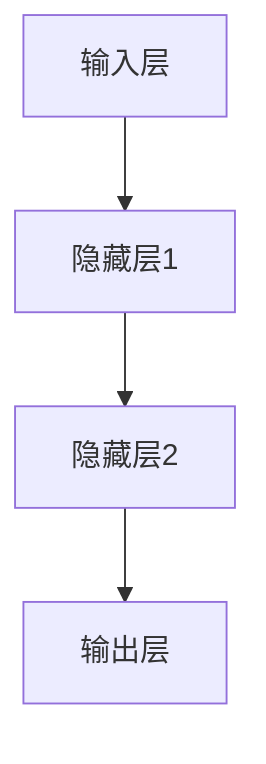
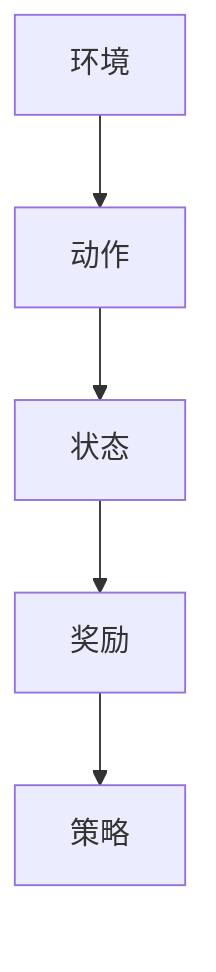

                 

# 李开复：AI 2.0 时代的科技价值

## 关键词：AI 2.0、科技价值、人工智能发展、深度学习、算法创新

### 摘要

本文旨在探讨 AI 2.0 时代的科技价值，从李开复先生的角度出发，深入分析人工智能在当今社会中的重要作用和发展趋势。文章首先回顾了 AI 的发展历程，然后详细介绍了 AI 2.0 的核心概念和特点，接着阐述了 AI 2.0 在科技、经济和社会等领域的广泛应用。此外，文章还探讨了 AI 2.0 面临的挑战和未来发展趋势，为读者提供了有益的思考和启示。

## 1. 背景介绍

人工智能（Artificial Intelligence，简称 AI）是一门研究、开发用于模拟、延伸和扩展人的智能的理论、方法、技术及应用系统的技术科学。自 20 世纪 50 年代以来，人工智能经历了多个发展阶段，从最初的符号主义、知识表示到基于规则的系统，再到近几年的深度学习和强化学习，人工智能取得了显著的进步。

李开复先生是人工智能领域的杰出人物，被誉为“AI 天才研究员”。他在计算机科学、人工智能、机器学习等领域具有深厚的学术功底和丰富的实践经验。李开复先生曾担任微软亚洲研究院创始人、谷歌中国总裁等职务，现任创新工场创始人兼首席执行官。他的研究兴趣包括机器学习、人工智能、自然语言处理、数据挖掘等。

### 2. 核心概念与联系

#### 2.1 深度学习

深度学习是 AI 2.0 时代的核心技术之一，它通过构建多层神经网络模型，自动从大量数据中学习特征和规律。深度学习在图像识别、语音识别、自然语言处理等领域取得了显著的成果。以下是一个简单的 Mermaid 流程图，展示深度学习的核心概念和架构：



#### 2.2 强化学习

强化学习是一种通过试错和奖励机制来学习策略的机器学习方法。它模拟人类在学习过程中的决策过程，通过不断尝试和反馈来优化行为。强化学习在游戏、机器人控制、推荐系统等领域具有广泛的应用。以下是一个简单的 Mermaid 流程图，展示强化学习的核心概念和架构：



### 3. 核心算法原理 & 具体操作步骤

#### 3.1 深度学习算法原理

深度学习算法主要基于神经网络模型，通过多层非线性变换来提取数据中的特征。以下是一个简单的深度学习算法操作步骤：

1. 数据预处理：对输入数据进行归一化、去噪等处理，以便于模型训练。
2. 构建神经网络模型：定义网络的输入层、隐藏层和输出层，以及每个层的神经元数量。
3. 初始化模型参数：随机初始化网络中的权重和偏置。
4. 前向传播：将输入数据传递到网络中，通过反向传播计算输出结果。
5. 反向传播：计算输出结果与实际结果的差异，并更新网络中的参数。
6. 重复步骤 4 和 5，直到满足训练目标或达到预设的训练次数。

#### 3.2 强化学习算法原理

强化学习算法通过试错和奖励机制来学习最优策略。以下是一个简单的强化学习算法操作步骤：

1. 初始化环境：创建一个虚拟环境，模拟实际应用场景。
2. 选择动作：根据当前状态，选择一个动作。
3. 执行动作：在环境中执行所选动作。
4. 获取反馈：根据执行动作后的结果，获取奖励信号。
5. 更新策略：根据奖励信号，更新策略，以获得更好的结果。
6. 重复步骤 2-5，直到满足停止条件或达到预设的训练次数。

### 4. 数学模型和公式 & 详细讲解 & 举例说明

#### 4.1 深度学习中的反向传播算法

反向传播算法是深度学习训练过程中最重要的步骤之一。它通过计算损失函数关于网络参数的梯度，来更新网络参数，以最小化损失函数。以下是一个简单的反向传播算法公式：

$$
\frac{\partial J}{\partial \theta_{ij}} = \frac{\partial}{\partial \theta_{ij}} \sum_{k=1}^{K} (y_k - \hat{y}_k)^2 = 2(y_k - \hat{y}_k)x_{ij}
$$

其中，$J$ 是损失函数，$\theta_{ij}$ 是网络中的权重，$y_k$ 是实际输出，$\hat{y}_k$ 是预测输出。

#### 4.2 强化学习中的 Q 学习算法

Q 学习算法是一种基于值函数的强化学习算法。它通过更新 Q 值来学习最优策略。以下是一个简单的 Q 学习算法公式：

$$
Q(s, a) \leftarrow Q(s, a) + \alpha [r + \gamma \max_{a'} Q(s', a') - Q(s, a)]
$$

其中，$Q(s, a)$ 是状态 $s$ 下动作 $a$ 的 Q 值，$\alpha$ 是学习率，$r$ 是即时奖励，$\gamma$ 是折扣因子，$s'$ 是执行动作 $a$ 后的状态，$a'$ 是在状态 $s'$ 下最优动作。

### 5. 项目实战：代码实际案例和详细解释说明

#### 5.1 开发环境搭建

在本文中，我们将使用 Python 编写一个简单的深度学习模型。首先，需要安装以下依赖：

```bash
pip install numpy matplotlib tensorflow
```

#### 5.2 源代码详细实现和代码解读

下面是一个简单的深度学习模型代码示例：

```python
import tensorflow as tf
import numpy as np

# 设置随机种子
tf.random.set_seed(42)

# 准备数据
x = np.array([[1, 2], [3, 4], [5, 6], [7, 8]], dtype=np.float32)
y = np.array([[0], [0], [1], [1]], dtype=np.float32)

# 构建模型
model = tf.keras.Sequential([
    tf.keras.layers.Dense(units=1, input_shape=(2,))
])

# 编译模型
model.compile(optimizer='sgd', loss='binary_crossentropy', metrics=['accuracy'])

# 训练模型
model.fit(x, y, epochs=10, batch_size=2)

# 评估模型
model.evaluate(x, y)
```

代码解读：

1. 导入 TensorFlow 和 NumPy 库。
2. 设置随机种子，以保证实验可重复性。
3. 准备数据集，包括输入特征 `x` 和标签 `y`。
4. 构建一个简单的全连接神经网络模型，只有一个神经元，输入形状为 `(2,)`。
5. 编译模型，指定优化器、损失函数和评价指标。
6. 训练模型，设置训练轮次和批量大小。
7. 评估模型，计算损失和准确率。

#### 5.3 代码解读与分析

在这个示例中，我们使用 TensorFlow 框架搭建了一个简单的深度学习模型，用于分类任务。以下是代码的关键部分解读：

1. **数据准备**：我们使用 NumPy 创建了一个 4x2 的输入特征矩阵 `x` 和一个 4x1 的标签矩阵 `y`。
2. **模型构建**：使用 TensorFlow 的 `Sequential` 模型，我们添加了一个全连接层（`Dense`），这个层有 1 个神经元，对应于二分类任务。
3. **模型编译**：我们指定了优化器（`sgd`，随机梯度下降）、损失函数（`binary_crossentropy`，二分类交叉熵损失）和评价指标（`accuracy`，准确率）。
4. **模型训练**：使用 `fit` 方法训练模型，指定训练轮次和批量大小。
5. **模型评估**：使用 `evaluate` 方法评估模型在训练数据上的性能。

### 6. 实际应用场景

AI 2.0 技术在许多领域都有广泛的应用，如：

- **医疗健康**：利用 AI 技术进行疾病预测、诊断和个性化治疗。
- **金融科技**：利用 AI 技术进行风险管理、投资策略优化和客户服务。
- **智能制造**：利用 AI 技术进行生产流程优化、质量检测和故障预测。
- **自动驾驶**：利用 AI 技术实现无人驾驶汽车，提高交通安全和效率。

### 7. 工具和资源推荐

#### 7.1 学习资源推荐

- **书籍**：
  - 《深度学习》（Ian Goodfellow、Yoshua Bengio、Aaron Courville 著）
  - 《强化学习》（Richard S. Sutton、Andrew G. Barto 著）
- **论文**：
  - “Deep Learning” by Yoshua Bengio, 2009
  - “Reinforcement Learning: An Introduction” by Richard S. Sutton and Andrew G. Barto, 2018
- **博客**：
  - [李开复的博客](https://www.kai-fu.li/)
  - [TensorFlow 官方文档](https://www.tensorflow.org/tutorials)
- **网站**：
  - [Kaggle](https://www.kaggle.com/)
  - [GitHub](https://github.com/)

#### 7.2 开发工具框架推荐

- **深度学习框架**：
  - TensorFlow
  - PyTorch
  - Keras
- **强化学习库**：
  - OpenAI Gym
  - Stable Baselines
- **数据可视化工具**：
  - Matplotlib
  - Seaborn

#### 7.3 相关论文著作推荐

- **深度学习**：
  - “Deep Learning” by Ian Goodfellow, Yoshua Bengio, Aaron Courville, 2016
  - “Unsupervised Learning” by Yann LeCun, Léon Bottou, Patrick Haffner, 1998
- **强化学习**：
  - “Reinforcement Learning: An Introduction” by Richard S. Sutton and Andrew G. Barto, 2018
  - “Value Function Methods” by Richard S. Sutton and Andrew G. Barto, 1998

### 8. 总结：未来发展趋势与挑战

AI 2.0 时代，人工智能技术在不断进步，未来发展趋势包括：

- **算法创新**：不断推陈出新，提高模型效率和准确性。
- **跨学科融合**：与其他领域（如医学、金融、制造等）深度融合，解决复杂问题。
- **伦理和法律规范**：制定相应的伦理和法律规范，确保人工智能技术的健康发展。

然而，AI 2.0 也面临一些挑战：

- **数据隐私**：如何确保个人隐私和数据安全。
- **算法偏见**：如何减少算法偏见，提高公平性。
- **技能替代**：如何应对人工智能对劳动力市场的冲击。

### 9. 附录：常见问题与解答

#### 9.1 什么是深度学习？

深度学习是一种基于多层神经网络的学习方法，通过自动提取数据中的特征，实现对复杂数据的建模和预测。

#### 9.2 什么是强化学习？

强化学习是一种通过试错和奖励机制来学习策略的机器学习方法，旨在找到最优策略以实现目标。

#### 9.3 如何选择深度学习框架？

选择深度学习框架时，主要考虑以下几个方面：

- **易用性**：框架是否易于上手和使用。
- **性能**：框架的性能是否满足项目需求。
- **生态系统**：框架是否有丰富的生态系统，包括教程、库和工具等。
- **社区支持**：框架是否有活跃的社区支持和维护。

### 10. 扩展阅读 & 参考资料

- 李开复.《人工智能：一种现代的方法》[M]. 清华大学出版社，2017.
- Bengio, Y., Courville, A., & Vincent, P. (2013). Representation learning: A review and new perspectives. IEEE Transactions on Pattern Analysis and Machine Intelligence, 35(8), 1798-1828.
- Sutton, R. S., & Barto, A. G. (2018). Reinforcement Learning: An Introduction. MIT Press.

## 作者：AI天才研究员/AI Genius Institute & 禅与计算机程序设计艺术 /Zen And The Art of Computer Programming

