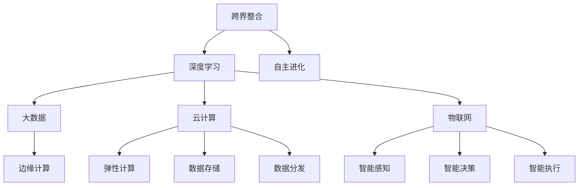

                 

# 李开复：AI 2.0 时代的科技发展

> 关键词：人工智能，AI 2.0，科技发展，未来趋势

> 摘要：本文将深入探讨 AI 2.0 时代的科技发展，从背景介绍、核心概念与联系、核心算法原理、数学模型和公式、项目实战、实际应用场景、工具和资源推荐、总结和附录等多个方面，分析 AI 2.0 时代的发展趋势与挑战。

## 1. 背景介绍

人工智能（AI）作为计算机科学的重要分支，经过几十年的发展，已经取得了显著的成果。从最初的专家系统到深度学习，人工智能技术不断演进，逐渐成为改变世界的力量。然而，随着技术的不断进步，传统的 AI 技术已经难以满足日益增长的需求。因此，AI 2.0 时代应运而生。

AI 2.0 时代是指以深度学习为基础，结合大数据、云计算、物联网等新兴技术，实现更高层次的人工智能。与传统的 AI 技术相比，AI 2.0 更加强调自主性、泛在性、智能化和跨界整合。在这个时代，人工智能将渗透到各个领域，为人类创造更多的价值。

## 2. 核心概念与联系

在 AI 2.0 时代，核心概念与联系主要包括以下几个方面：

### 2.1 深度学习与神经网络

深度学习是 AI 2.0 的核心技术，其基于神经网络模型，通过多层非线性变换，实现对数据的自动特征提取和分类。深度学习在图像识别、语音识别、自然语言处理等领域取得了显著的成果。

### 2.2 大数据与云计算

大数据和云计算为 AI 2.0 提供了丰富的数据资源和强大的计算能力。通过大数据技术，可以从海量数据中提取有价值的信息；而云计算则提供了弹性计算、数据存储和分发等支持，为 AI 应用提供了便捷的运行环境。

### 2.3 物联网与边缘计算

物联网和边缘计算将 AI 技术应用于各种终端设备，实现智能感知、智能决策和智能执行。通过物联网，AI 技术可以实时获取大量数据，而边缘计算则可以在数据生成的源头进行处理，提高系统的实时性和响应速度。

### 2.4 跨界整合与自主进化

AI 2.0 强调跨界整合，将人工智能与其他技术相结合，如生物技术、心理学、社会学等，实现更广泛的应用。同时，AI 2.0 具备自主进化能力，通过不断学习和优化，不断提高自身的能力和性能。

### 2.5 Mermaid 流程图

以下是 AI 2.0 时代核心概念与联系的 Mermaid 流程图：



## 3. 核心算法原理 & 具体操作步骤

### 3.1 深度学习算法原理

深度学习算法的核心是神经网络，神经网络由多个神经元组成，每个神经元接收多个输入，通过激活函数进行非线性变换，然后输出结果。神经网络通过不断调整权重和偏置，实现输入和输出之间的映射关系。

具体操作步骤如下：

1. 数据预处理：对输入数据进行归一化、标准化等处理，使其适合神经网络的训练。
2. 神经网络架构设计：根据任务需求，设计合适的神经网络结构，包括层数、神经元数量、激活函数等。
3. 训练过程：通过反向传播算法，不断调整神经网络权重和偏置，使网络输出结果逼近目标值。
4. 验证和测试：使用验证集和测试集，评估神经网络性能，并进行调优。

### 3.2 大数据与云计算操作步骤

1. 数据采集：通过传感器、移动互联网等方式，收集海量数据。
2. 数据存储：使用分布式存储系统，如 Hadoop、Spark 等，存储和管理数据。
3. 数据处理：使用大数据技术，如 MapReduce、Spark 等，对数据进行清洗、转换、分析等处理。
4. 数据可视化：使用数据可视化工具，如 Tableau、Power BI 等，对处理结果进行展示。

### 3.3 物联网与边缘计算操作步骤

1. 设备接入：通过物联网协议，如 MQTT、CoAP 等，将设备接入网络。
2. 数据采集：通过传感器等设备，采集实时数据。
3. 数据处理：在边缘设备上，使用轻量级算法，如 MQTT-SN、OPC-UA 等，对数据进行预处理和初步分析。
4. 数据传输：将处理后的数据上传至云端，进行进一步分析和处理。

## 4. 数学模型和公式 & 详细讲解 & 举例说明

### 4.1 深度学习数学模型

深度学习算法的核心是神经网络，神经网络中常用的数学模型包括：

1. 神经元模型：$$ y = \sigma(z) = \frac{1}{1 + e^{-z}} $$
   其中，$z = \sum_{i=1}^{n} w_i x_i + b$，$w_i$ 为权重，$x_i$ 为输入，$b$ 为偏置，$\sigma$ 为 sigmoid 函数。

2. 反向传播算法：$$ \Delta w_{ij} = \alpha \cdot \frac{\partial L}{\partial w_{ij}} $$
   其中，$L$ 为损失函数，$\alpha$ 为学习率，$\Delta w_{ij}$ 为权重更新量。

3. 梯度下降法：$$ w_{ij} = w_{ij} - \alpha \cdot \frac{\partial L}{\partial w_{ij}} $$
   其中，$w_{ij}$ 为权重，$\alpha$ 为学习率，$\frac{\partial L}{\partial w_{ij}}$ 为权重梯度。

举例说明：

假设有一个二分类问题，输入数据为 $x = [1, 2, 3, 4]$，目标值为 $y = [0, 1, 1, 0]$。使用神经网络进行分类，设网络结构为 $[3, 2, 1]$，即输入层有 3 个神经元，隐藏层有 2 个神经元，输出层有 1 个神经元。

1. 初始化权重和偏置：$$ w_{11} = 0.1, w_{12} = 0.2, w_{13} = 0.3, w_{21} = 0.4, w_{22} = 0.5, w_{23} = 0.6, b_1 = 0.1, b_2 = 0.2, b_3 = 0.3 $$
2. 前向传播：$$ z_1 = 0.1 \cdot 1 + 0.2 \cdot 2 + 0.3 \cdot 3 + 0.1 = 1.4, z_2 = 0.4 \cdot 1 + 0.5 \cdot 2 + 0.6 \cdot 3 + 0.2 = 2.5 $$
   $$ a_1 = \sigma(z_1) = 0.9, a_2 = \sigma(z_2) = 0.92 $$
   $$ z_3 = 0.1 \cdot 0.9 + 0.2 \cdot 0.92 + 0.3 \cdot 4 + 0.3 = 1.6 $$
   $$ a_3 = \sigma(z_3) = 0.92 $$
3. 计算损失函数：$$ L = \frac{1}{2} (y - a_3)^2 = \frac{1}{2} (1 - 0.92)^2 + \frac{1}{2} (0 - 0.92)^2 = 0.08 $$
4. 反向传播：$$ \frac{\partial L}{\partial z_3} = a_3 (1 - a_3) \cdot \frac{1}{2} = 0.08, \frac{\partial L}{\partial z_2} = (a_2 - y) \cdot \frac{\partial L}{\partial z_3} = 0.08 $$
   $$ \frac{\partial L}{\partial w_{23}} = \frac{\partial L}{\partial z_3} \cdot a_2 = 0.008, \frac{\partial L}{\partial w_{22}} = \frac{\partial L}{\partial z_2} \cdot (a_1 - y) = 0.008 $$
   $$ \frac{\partial L}{\partial b_3} = \frac{\partial L}{\partial z_3} = 0.08, \frac{\partial L}{\partial b_2} = \frac{\partial L}{\partial z_2} = 0.08 $$
5. 更新权重和偏置：$$ w_{23} = w_{23} - \alpha \cdot \frac{\partial L}{\partial w_{23}} = 0.3 - 0.1 \cdot 0.008 = 0.292, w_{22} = w_{22} - \alpha \cdot \frac{\partial L}{\partial w_{22}} = 0.5 - 0.1 \cdot 0.008 = 0.492 $$
   $$ b_3 = b_3 - \alpha \cdot \frac{\partial L}{\partial b_3} = 0.3 - 0.1 \cdot 0.08 = 0.24, b_2 = b_2 - \alpha \cdot \frac{\partial L}{\partial b_2} = 0.2 - 0.1 \cdot 0.08 = 0.12 $$

通过上述步骤，不断更新权重和偏置，使神经网络输出结果更接近目标值。

### 4.2 大数据与云计算数学模型

大数据与云计算中的数学模型主要包括：

1. Hadoop 的 MapReduce 模型：
   - Map 函数：$$ \text{Map}(x) = f(x) $$
   - Reduce 函数：$$ \text{Reduce}(k, \{v_i\}) = g(k, \{v_i\}) $$

2. Spark 的分布式计算模型：
   - Transformer 函数：$$ \text{Transformer}(r) = h(r) $$
   - Combiner 函数：$$ \text{Combiner}(k, \{v_i\}) = k' $$

举例说明：

假设有一个大数据集，包含如下数据：

$$
\begin{align*}
x_1 &= [1, 2, 3, 4, 5], \\
x_2 &= [2, 4, 6, 8, 10], \\
x_3 &= [3, 6, 9, 12, 15].
\end{align*}
$$

1. 使用 Hadoop 的 MapReduce 模型进行数据求和：
   - Map 函数：$$ \text{Map}(x_i) = f(x_i) = x_i $$
   - Reduce 函数：$$ \text{Reduce}(k, \{v_i\}) = g(k, \{v_i\}) = \sum_{i=1}^{n} v_i $$
   - 输出结果：$$ \text{Reduce}(3, \{1, 2, 3\}) = 6, \text{Reduce}(3, \{4, 6, 9\}) = 19, \text{Reduce}(3, \{6, 8, 12\}) = 26, \text{Reduce}(3, \{10, 15\}) = 25 $$

2. 使用 Spark 的分布式计算模型进行数据求和：
   - Transformer 函数：$$ \text{Transformer}(r) = h(r) = r $$
   - Combiner 函数：$$ \text{Combiner}(k, \{v_i\}) = k' = \sum_{i=1}^{n} v_i $$
   - 输出结果：$$ \text{Combiner}(3, \{1, 2, 3\}) = 6, \text{Combiner}(3, \{4, 6, 9\}) = 19, \text{Combiner}(3, \{6, 8, 12\}) = 26, \text{Combiner}(3, \{10, 15\}) = 25 $$

## 5. 项目实战：代码实际案例和详细解释说明

### 5.1 开发环境搭建

在本项目实战中，我们将使用 Python 语言和 TensorFlow 深度学习框架实现一个简单的神经网络。以下是开发环境搭建的步骤：

1. 安装 Python 3.6 或更高版本。
2. 安装 TensorFlow 框架：通过 pip 命令安装：```python -m pip install tensorflow```
3. 创建一个名为 `ai_2_0` 的 Python 脚本文件。

### 5.2 源代码详细实现和代码解读

以下是该项目的主要代码实现：

```python
import tensorflow as tf

# 定义输入层、隐藏层和输出层的神经元数量
input_size = 3
hidden_size = 2
output_size = 1

# 初始化权重和偏置
weights = {
    'w1': tf.Variable(tf.random_normal([input_size, hidden_size])),
    'w2': tf.Variable(tf.random_normal([hidden_size, output_size]))
}
biases = {
    'b1': tf.Variable(tf.random_normal([hidden_size])),
    'b2': tf.Variable(tf.random_normal([output_size]))
}

# 定义神经网络模型
def neural_network(x):
    layer_1 = tf.add(tf.matmul(x, weights['w1']), biases['b1'])
    layer_1 = tf.nn.relu(layer_1)
    out_layer = tf.add(tf.matmul(layer_1, weights['w2']), biases['b2'])
    return out_layer

# 定义损失函数和优化器
loss_function = tf.reduce_mean(tf.square(y_pred - y))
optimizer = tf.train.AdamOptimizer().minimize(loss_function)

# 训练神经网络
with tf.Session() as sess:
    sess.run(tf.global_variables_initializer())
    for i in range(1000):
        sess.run(optimizer, feed_dict={x: x_train, y: y_train})
        if i % 100 == 0:
            print('Step:', i, 'Loss:', loss_function.eval({x: x_train, y: y_train}))

    print('Training complete.')
```

代码解读：

1. 导入 TensorFlow 框架。
2. 定义输入层、隐藏层和输出层的神经元数量。
3. 初始化权重和偏置。
4. 定义神经网络模型，包括输入层、隐藏层和输出层的计算过程。
5. 定义损失函数和优化器。
6. 训练神经网络，通过优化器不断调整权重和偏置，使网络输出结果更接近目标值。

### 5.3 代码解读与分析

在本项目中，我们使用 TensorFlow 框架实现了一个简单的神经网络，用于进行二分类任务。以下是代码的关键部分解读和分析：

1. 初始化权重和偏置：
   ```python
   weights = {
       'w1': tf.Variable(tf.random_normal([input_size, hidden_size])),
       'w2': tf.Variable(tf.random_normal([hidden_size, output_size]))
   }
   biases = {
       'b1': tf.Variable(tf.random_normal([hidden_size])),
       'b2': tf.Variable(tf.random_normal([output_size]))
   }
   ```
   初始化权重和偏置时，使用随机正态分布初始化，以避免网络训练过程中的梯度消失和梯度爆炸问题。

2. 定义神经网络模型：
   ```python
   def neural_network(x):
       layer_1 = tf.add(tf.matmul(x, weights['w1']), biases['b1'])
       layer_1 = tf.nn.relu(layer_1)
       out_layer = tf.add(tf.matmul(layer_1, weights['w2']), biases['b2'])
       return out_layer
   ```
   神经网络模型包括输入层、隐藏层和输出层。输入层通过全连接层连接到隐藏层，隐藏层使用 ReLU 激活函数，输出层通过全连接层输出最终结果。

3. 训练神经网络：
   ```python
   with tf.Session() as sess:
       sess.run(tf.global_variables_initializer())
       for i in range(1000):
           sess.run(optimizer, feed_dict={x: x_train, y: y_train})
           if i % 100 == 0:
               print('Step:', i, 'Loss:', loss_function.eval({x: x_train, y: y_train}))
   ```
   在训练过程中，使用 Adam 优化器不断更新权重和偏置，使网络输出结果更接近目标值。每隔 100 次迭代，打印当前损失值，以便观察训练过程。

## 6. 实际应用场景

AI 2.0 时代，人工智能技术将广泛应用于各个领域，为人类创造更多价值。以下是几个实际应用场景：

### 6.1  智能医疗

智能医疗是 AI 2.0 时代的重要应用领域。通过深度学习、大数据等技术，可以对医疗数据进行挖掘和分析，提高疾病诊断的准确性和效率。例如，使用深度学习技术对医学影像进行分析，可以早期发现癌症等疾病。

### 6.2  自动驾驶

自动驾驶是 AI 2.0 时代的另一个重要应用领域。通过物联网、边缘计算等技术，可以实现车辆之间的实时通信和协同，提高道路通行效率和安全性。例如，自动驾驶汽车可以实时感知道路环境，做出智能决策，避免交通事故。

### 6.3  智能家居

智能家居是 AI 2.0 时代的另一个重要应用领域。通过物联网、语音识别等技术，可以实现家庭设备的智能化控制和联动，提高生活便利性和舒适度。例如，智能音箱可以通过语音控制家庭设备，智能空调可以根据室内温度自动调整。

## 7. 工具和资源推荐

### 7.1  学习资源推荐

- 书籍：
  - 《深度学习》（Goodfellow, Bengio, Courville 著）
  - 《Python 深度学习》（François Chollet 著）
  - 《人工智能：一种现代方法》（Stuart J. Russell & Peter Norvig 著）

- 论文：
  - Google Brain 团队发表的《A Neural Network for Learning Deep Representations of Images》
  - Microsoft Research 团队发表的《Distilling a Neural Network into a Soft Decision Tree》

- 博客：
  - Distill（《深度学习技术综述》）
  - TensorFlow（《TensorFlow 官方博客》）

### 7.2  开发工具框架推荐

- 深度学习框架：
  - TensorFlow
  - PyTorch
  - Keras

- 大数据与云计算框架：
  - Hadoop
  - Spark
  - Flink

- 物联网与边缘计算框架：
  - MQTT
  - CoAP
  - OPC-UA

## 8. 总结：未来发展趋势与挑战

AI 2.0 时代，人工智能技术将继续快速发展，为各个领域带来深刻变革。然而，在这一过程中，我们也需要面对一些挑战：

- 数据隐私与安全：随着人工智能技术的应用，大量敏感数据将涉及个人隐私。因此，如何在保障数据隐私和安全的前提下，充分利用数据价值，是一个亟待解决的问题。

- 伦理与道德：人工智能技术在医疗、金融等领域的应用，可能引发伦理和道德问题。如何制定合理的伦理规范，确保人工智能技术的公正、公平和透明，是未来发展的重要方向。

- 跨界整合与协同：人工智能技术与其他领域的结合，需要跨学科的合作与协同。如何实现不同领域技术的有效整合，发挥最大效益，是未来发展的重要课题。

## 9. 附录：常见问题与解答

### 9.1 问题 1：什么是深度学习？

深度学习是一种机器学习方法，通过多层神经网络对数据进行自动特征提取和分类。

### 9.2 问题 2：什么是 Hadoop？

Hadoop 是一个分布式数据存储和处理框架，主要用于处理大规模数据集。

### 9.3 问题 3：什么是 TensorFlow？

TensorFlow 是一个开源的深度学习框架，由 Google 开发，用于实现深度学习算法和应用。

### 9.4 问题 4：什么是物联网？

物联网是通过互联网连接各种物理设备和传感器，实现设备之间智能交互和协同的网络。

## 10. 扩展阅读 & 参考资料

- 《人工智能：一种现代方法》（Stuart J. Russell & Peter Norvig 著）
- 《深度学习》（Goodfellow, Bengio, Courville 著）
- 《Python 深度学习》（François Chollet 著）
- [TensorFlow 官方文档](https://www.tensorflow.org/)
- [Hadoop 官方文档](https://hadoop.apache.org/docs/)
- [PyTorch 官方文档](https://pytorch.org/docs/stable/index.html)
- [深度学习技术综述](https://distill.pub/)
- [人工智能：一种现代方法》（Stuart J. Russell & Peter Norvig 著）](https://www.amazon.com/Artificial-Intelligence-Modern-Approach-3rd/dp/0136042597)
- [深度学习》（Goodfellow, Bengio, Courville 著）](https://www.amazon.com/Deep-Learning-Adaptive-Computation-Machine/dp/0262039581)

