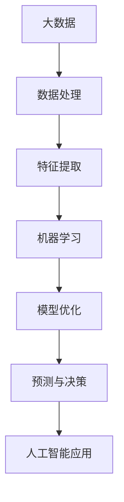

                 

# 李开复：AI 2.0 时代的见证者

> 关键词：李开复、AI 2.0、人工智能、技术发展、见证者

> 摘要：本文将深入探讨人工智能领域的杰出人物李开复在AI 2.0时代的贡献与影响。通过分析其核心观点、技术理念和实践案例，揭示AI 2.0时代的本质特征和发展趋势，为读者提供对人工智能未来发展的深刻洞察。

## 1. 背景介绍

李开复，世界著名的计算机科学家、人工智能专家、创新者和教育者。他曾担任微软全球副总裁、Google中国总裁等职位，目前担任创新工场的创始人兼CEO。李开复在人工智能领域的贡献和影响深远，特别是在自然语言处理、机器学习、人工智能伦理等方面。

AI 2.0时代是指人工智能技术从以数据驱动为主，转向以算法驱动为主的新阶段。这一时代标志着人工智能从“弱AI”向“强AI”的过渡，人类与人工智能的互动将更加紧密和智能化。

## 2. 核心概念与联系

### 2.1 人工智能与大数据

人工智能（AI）是一种模拟人类智能的技术，包括机器学习、深度学习、自然语言处理等子领域。大数据（Big Data）是指海量、多样化的数据集合，为人工智能的发展提供了丰富的数据资源。

李开复认为，大数据是AI 2.0时代的重要驱动力，使得人工智能能够从数据中学习、推理和发现规律。以下是一个简化的Mermaid流程图，描述了人工智能与大数据之间的联系：



### 2.2 算法与算力

算法是人工智能的核心，决定了人工智能系统的性能和效果。算力是支撑算法运行的硬件和软件基础设施，包括计算能力、存储能力和网络带宽等。

李开复指出，算法和算力的协同发展是AI 2.0时代的关键。随着深度学习等算法的突破，以及云计算、GPU等新型计算平台的普及，人工智能的算力得到了极大提升，为AI 2.0时代的到来奠定了基础。

## 3. 核心算法原理 & 具体操作步骤

### 3.1 深度学习

深度学习是一种基于多层神经网络的人工智能技术，通过模拟人脑的神经元连接，实现图像识别、语音识别、自然语言处理等复杂任务。

具体操作步骤如下：

1. 数据预处理：对原始数据进行清洗、归一化等处理，以便输入到神经网络中。
2. 神经网络构建：设计并构建多层神经网络结构，包括输入层、隐藏层和输出层。
3. 模型训练：使用训练数据对神经网络进行训练，优化模型参数。
4. 模型评估：使用测试数据对模型进行评估，调整模型结构和参数。
5. 预测与决策：将训练好的模型应用于实际问题，进行预测和决策。

### 3.2 自然语言处理

自然语言处理（NLP）是一种人工智能技术，旨在使计算机理解和处理自然语言。其核心算法包括词向量表示、语言模型、序列标注等。

具体操作步骤如下：

1. 词向量表示：将自然语言文本转化为计算机可处理的向量表示。
2. 语言模型：构建基于统计或神经网络的模型，预测下一个词的概率分布。
3. 序列标注：对自然语言文本进行词性标注、命名实体识别等任务。
4. 语义理解：利用深度学习等技术，对自然语言文本进行语义理解和推理。

## 4. 数学模型和公式 & 详细讲解 & 举例说明

### 4.1 深度学习中的激活函数

深度学习中的激活函数（Activation Function）是神经网络中的关键组件，用于引入非线性特性，使神经网络能够拟合复杂的数据分布。

常见的激活函数包括：

1. **Sigmoid函数**：\( f(x) = \frac{1}{1 + e^{-x}} \)
   - 特点：输出值介于0和1之间，适合用于二分类问题。
   - 举例：\( f(2) = \frac{1}{1 + e^{-2}} \approx 0.931 \)

2. **ReLU函数**：\( f(x) = \max(0, x) \)
   - 特点：简单且易于计算，能够缓解梯度消失问题。
   - 举例：\( f(-2) = \max(0, -2) = 0 \)，\( f(2) = \max(0, 2) = 2 \)

3. **Tanh函数**：\( f(x) = \frac{e^x - e^{-x}}{e^x + e^{-x}} \)
   - 特点：输出值介于-1和1之间，适合于处理回归问题。
   - 举例：\( f(2) = \frac{e^2 - e^{-2}}{e^2 + e^{-2}} \approx 0.961 \)

### 4.2 自然语言处理中的语言模型

自然语言处理中的语言模型（Language Model）用于预测下一个词的概率分布，常见模型包括N元语法模型和神经网络语言模型。

1. **N元语法模型**：

   - 公式：\( P(w_n | w_{n-1}, w_{n-2}, \ldots, w_1) = \frac{C(w_{n-1}, w_n)}{C(w_{n-1}, w_{n-2}, \ldots, w_1)} \)

   - 举例：对于句子“我喜欢吃苹果”，我们可以计算“苹果”的概率：

     \( P(苹果 | 我，喜欢，吃) = \frac{C(吃，苹果)}{C(吃，苹果，我，喜欢)} \)

   - 注意：这里\( C(w_i, w_j) \)表示连续出现的词\( w_i \)和\( w_j \)的计数。

2. **神经网络语言模型**：

   - 公式：\( P(w_n | w_{n-1}, w_{n-2}, \ldots, w_1) = \sigma(\text{神经网络输出}) \)

   - 举例：假设神经网络输出一个向量\[v\]，我们可以使用Sigmoid函数计算概率：

     \( P(苹果 | 我，喜欢，吃) = \sigma(v) \)

   - 注意：这里\( \sigma \)表示Sigmoid函数。

## 5. 项目实战：代码实际案例和详细解释说明

### 5.1 开发环境搭建

为了实现深度学习和自然语言处理，我们需要搭建一个合适的开发环境。以下是Python环境下的开发环境搭建步骤：

1. 安装Python 3.7及以上版本。
2. 安装Anaconda，以便管理Python环境和依赖库。
3. 创建一个新的conda环境，并安装TensorFlow、PyTorch、NLTK等依赖库。

```bash
conda create -n ai_env python=3.8
conda activate ai_env
conda install tensorflow pytorch nltk
```

### 5.2 源代码详细实现和代码解读

以下是一个简单的深度学习项目，用于分类手写数字。

```python
import tensorflow as tf
from tensorflow.keras.datasets import mnist
from tensorflow.keras.models import Sequential
from tensorflow.keras.layers import Dense, Flatten
from tensorflow.keras.utils import to_categorical

# 加载数据集
(x_train, y_train), (x_test, y_test) = mnist.load_data()

# 数据预处理
x_train = x_train / 255.0
x_test = x_test / 255.0
y_train = to_categorical(y_train)
y_test = to_categorical(y_test)

# 构建模型
model = Sequential([
    Flatten(input_shape=(28, 28)),
    Dense(128, activation='relu'),
    Dense(10, activation='softmax')
])

# 编译模型
model.compile(optimizer='adam',
              loss='categorical_crossentropy',
              metrics=['accuracy'])

# 训练模型
model.fit(x_train, y_train, epochs=5, batch_size=64)

# 评估模型
model.evaluate(x_test, y_test)
```

### 5.3 代码解读与分析

1. **数据预处理**：

   - 加载MNIST手写数字数据集，并进行归一化处理，以便输入到神经网络中。
   - 将标签转换为one-hot编码，以便使用softmax函数进行分类。

2. **模型构建**：

   - 使用Sequential模型构建一个简单的深度神经网络，包括Flatten层、Dense层和softmax层。
   - Flatten层将输入数据的形状从（28，28）转换为（28 * 28，1），以便输入到Dense层。
   - Dense层包括128个神经元，使用ReLU函数作为激活函数。
   - softmax层用于计算分类概率，输出10个神经元的概率分布。

3. **模型编译**：

   - 选择adam优化器和categorical_crossentropy损失函数。
   - 计算准确率作为评估指标。

4. **模型训练**：

   - 使用训练数据进行5个epochs的训练，每个epoch使用64个样本进行批量训练。

5. **模型评估**：

   - 使用测试数据进行评估，输出损失和准确率。

## 6. 实际应用场景

### 6.1 人工智能医疗

李开复认为，人工智能在医疗领域的应用前景广阔，包括疾病诊断、药物研发、健康管理等。例如，通过深度学习和自然语言处理技术，可以对大量医学文献和病例进行数据分析，辅助医生进行诊断和治疗。

### 6.2 人工智能金融

人工智能在金融领域的应用日益广泛，包括风险管理、量化交易、信用评分等。李开复指出，通过大数据和深度学习技术，金融机构可以更准确地预测市场走势，降低风险，提高盈利能力。

### 6.3 人工智能教育

人工智能在教育领域的应用逐渐受到关注，包括个性化学习、智能评估、教育资源分配等。李开复认为，人工智能可以帮助学生更好地理解知识点，提高学习效果，同时为教师提供更加科学的评估和指导。

## 7. 工具和资源推荐

### 7.1 学习资源推荐

- **书籍**：
  - 《深度学习》（Goodfellow, Bengio, Courville）
  - 《Python机器学习》（Sebastian Raschka）
  - 《自然语言处理入门》（Daniel Jurafsky，James H. Martin）
- **论文**：
  - 《A Theoretical Investigation of the Context-Free Learning Problem》（Papert）
  - 《Deep Learning》（Geoffrey Hinton，Yoshua Bengio，Yann LeCun）
- **博客**：
  - [李开复官方博客](https://www.kelvinhku.com/)
  - [Deep Learning Specialization](https://www.deeplearning.ai/)
- **网站**：
  - [Kaggle](https://www.kaggle.com/)
  - [GitHub](https://github.com/)

### 7.2 开发工具框架推荐

- **深度学习框架**：
  - TensorFlow
  - PyTorch
  - Keras
- **自然语言处理库**：
  - NLTK
  - spaCy
  - gensim
- **开发工具**：
  - Jupyter Notebook
  - PyCharm
  - Google Colab

### 7.3 相关论文著作推荐

- **自然语言处理**：
  - 《自然语言处理综论》（Daniel Jurafsky，James H. Martin）
  - 《词向量模型与神经网络语言模型》（Tomas Mikolov，Ilya Sutskever，Quoc V. Le）
- **深度学习**：
  - 《深度学习》（Ian Goodfellow，Yoshua Bengio，Aaron Courville）
  - 《深度学习进阶》（Aaron Courville，Yoshua Bengio，Pierre Vincent）
- **计算机视觉**：
  - 《计算机视觉：算法与应用》（David S. Kriegman，Jian Sun，Shimon J.小龙）
  - 《卷积神经网络与视觉计算》（Yann LeCun，Yoshua Bengio，Geoffrey Hinton）

## 8. 总结：未来发展趋势与挑战

李开复认为，AI 2.0时代将带来以下发展趋势：

1. **人工智能与各行各业深度融合**：人工智能将在医疗、金融、教育、制造等领域发挥重要作用，推动行业变革。
2. **跨领域合作与技术创新**：人工智能领域将涌现更多跨学科的合作项目，推动技术不断突破。
3. **人机协同与智能化生活**：人工智能将与人类生活更加紧密地结合，带来更加便捷和智能的生活方式。

然而，AI 2.0时代也面临着一系列挑战：

1. **数据隐私与安全**：随着数据规模的扩大，数据隐私和安全问题将日益突出。
2. **人工智能伦理与责任**：人工智能在道德和伦理方面的问题需要得到关注和解决。
3. **人才短缺与教育**：人工智能领域的人才需求快速增长，需要加强人才培养和教育。

## 9. 附录：常见问题与解答

### 9.1 什么是AI 2.0？

AI 2.0是指人工智能技术从以数据驱动为主，转向以算法驱动为主的新阶段。这一时代标志着人工智能从“弱AI”向“强AI”的过渡，人类与人工智能的互动将更加紧密和智能化。

### 9.2 深度学习和机器学习的区别是什么？

深度学习是机器学习的一种方法，它使用多层神经网络来模拟人脑的神经元连接，实现图像识别、语音识别、自然语言处理等复杂任务。机器学习是更广泛的概念，包括深度学习、决策树、支持向量机等算法。

### 9.3 自然语言处理有哪些常见任务？

自然语言处理包括词向量表示、语言模型、序列标注、语义理解等任务。常见任务包括词性标注、命名实体识别、情感分析、机器翻译等。

## 10. 扩展阅读 & 参考资料

- 李开复. (2018). 《人工智能：一种新的认知科学》(Artificial Intelligence: A Modern Approach).
- Goodfellow, I., Bengio, Y., & Courville, A. (2016). *Deep Learning*.
- Russell, S., & Norvig, P. (2016). *Artificial Intelligence: A Modern Approach*.
- Mikolov, T., Sutskever, I., & Le, Q. V. (2013). *Distributed Representations of Words and Phrases and their Compositionality*.
- Jurafsky, D., & Martin, J. H. (2008). *Speech and Language Processing*.

