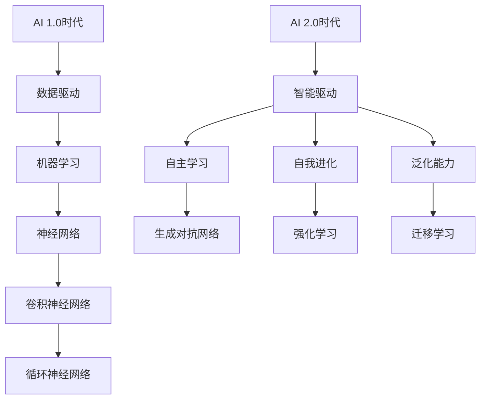

                 

# 李开复：AI 2.0 时代的观察者

> **关键词：** AI 2.0，人工智能，李开复，技术趋势，未来展望

> **摘要：** 本文旨在通过李开复的视角，深入探讨AI 2.0时代的到来及其带来的影响。文章将从背景介绍、核心概念、算法原理、数学模型、实战案例、应用场景、工具资源推荐、未来发展趋势与挑战等多个方面展开，为读者呈现一个全面、深入的AI 2.0时代观察。

## 1. 背景介绍

### AI 1.0时代：数据驱动

在AI 1.0时代，人工智能主要是以数据驱动的方式进行。这一阶段的核心技术是机器学习，特别是深度学习。在这一时期，算法模型通过大量数据进行训练，从而实现图像识别、语音识别、自然语言处理等任务。代表性的算法有神经网络、卷积神经网络（CNN）和循环神经网络（RNN）。

### AI 2.0时代：智能驱动

随着技术的不断发展，AI 2.0时代已经到来。与AI 1.0时代相比，AI 2.0时代的核心特征在于智能驱动，即通过自主学习、自我进化来提升智能水平。这一阶段的人工智能不仅能够处理静态数据，还能应对动态环境，具备更强的泛化能力。代表性的算法包括生成对抗网络（GAN）、强化学习、迁移学习等。

## 2. 核心概念与联系

### 自主学习（Self-Learning）

自主学习是指人工智能系统能够通过不断学习和优化，提高自身性能。在AI 2.0时代，自主学习已成为关键技术，使得人工智能系统能够在未知环境中进行决策和行动。

### 自我进化（Self-Improvement）

自我进化是指人工智能系统在运行过程中，通过不断优化自身结构和算法，实现性能提升。自我进化使得人工智能系统能够在长时间内保持竞争力，应对不断变化的环境。

### 泛化能力（Generalization）

泛化能力是指人工智能系统在处理新任务时，能够将其所学应用到新任务中的能力。在AI 2.0时代，泛化能力尤为重要，因为它使得人工智能系统能够应对更多场景。

### Mermaid流程图（Mermaid Flowchart）



## 3. 核心算法原理 & 具体操作步骤

### 生成对抗网络（GAN）

生成对抗网络（GAN）是一种由生成器和判别器组成的模型。生成器旨在生成与真实数据相似的数据，判别器则负责区分真实数据和生成数据。通过生成器和判别器的对抗训练，生成器逐渐提高生成数据的质量。

### 强化学习（Reinforcement Learning）

强化学习是一种通过与环境互动来学习最优策略的算法。在强化学习中，智能体根据当前状态和奖励信号来调整其行为，从而实现长期回报最大化。

### 迁移学习（Transfer Learning）

迁移学习是指将已在一个任务上训练好的模型应用于其他任务中。通过迁移学习，可以减少训练数据的需求，提高模型的泛化能力。

## 4. 数学模型和公式 & 详细讲解 & 举例说明

### 生成对抗网络（GAN）的数学模型

生成对抗网络（GAN）由生成器（G）和判别器（D）组成。生成器的目标是最小化生成数据与真实数据之间的差异，判别器的目标是最大化区分真实数据和生成数据的概率。

$$
\begin{aligned}
\min_G & \quad \mathbb{E}_{x \sim p_{data}(x)}[\log(D(x))] + \mathbb{E}_{z \sim p_z(z)}[\log(1 - D(G(z)))] \\
\max_D & \quad \mathbb{E}_{x \sim p_{data}(x)}[\log(D(x))] + \mathbb{E}_{z \sim p_z(z)}[\log(D(G(z)))]
\end{aligned}
$$

其中，$x$表示真实数据，$z$表示生成器的输入噪声，$G(z)$表示生成器生成的数据，$D(x)$表示判别器对真实数据的判别概率，$D(G(z))$表示判别器对生成数据的判别概率。

### 强化学习（Reinforcement Learning）的数学模型

强化学习通过优化策略函数 $π(a|s)$ 来实现智能体的最优行为。策略函数表示在给定状态 $s$ 下的最佳行动 $a$。

$$
π(a|s) = \frac{π(s,a) \exp(Q(s,a)}{\sum_{a'} π(s,a') \exp(Q(s,a'))}
$$

其中，$Q(s,a)$ 表示在状态 $s$ 下执行行动 $a$ 的回报函数。

### 迁移学习（Transfer Learning）的数学模型

迁移学习通过将源任务的先验知识迁移到目标任务中，从而提高目标任务的泛化能力。迁移学习的核心是共享表示空间，即源任务和目标任务在共享的表示空间中具有相似性。

$$
\begin{aligned}
\min_W & \quad \mathbb{E}_{(x,s,t) \sim p_{source}(x,s,t)}[L(x,s,t,W)] + \mathbb{E}_{(x,s,t) \sim p_{target}(x,s,t)}[L(x,s,t,W)] \\
\end{aligned}
$$

其中，$L(x,s,t,W)$ 表示在给定输入 $x$、状态 $s$ 和标签 $t$ 下的损失函数，$W$ 表示模型参数。

## 5. 项目实战：代码实际案例和详细解释说明

### 5.1 开发环境搭建

在本节中，我们将搭建一个简单的生成对抗网络（GAN）项目。首先，安装必要的依赖项：

```bash
pip install tensorflow numpy matplotlib
```

### 5.2 源代码详细实现和代码解读

```python
import tensorflow as tf
from tensorflow import keras
import numpy as np
import matplotlib.pyplot as plt

# 生成器模型
def generator(z, dim=100):
    model = keras.Sequential()
    model.add(keras.layers.Dense(128, activation='tanh', input_shape=(dim,)))
    model.add(keras.layers.Dense(128, activation='tanh'))
    model.add(keras.layers.Dense(784, activation='tanh'))
    return model

# 判别器模型
def discriminator(x):
    model = keras.Sequential()
    model.add(keras.layers.Dense(128, activation='tanh', input_shape=(784,)))
    model.add(keras.layers.Dense(128, activation='tanh'))
    model.add(keras.layers.Dense(1, activation='sigmoid'))
    return model

# 搭建 GAN 模型
def gan(generator, discriminator):
    model = keras.Sequential()
    model.add(generator)
    model.add(discriminator)
    return model

# 数据预处理
(x_train, _), (_, _) = keras.datasets.mnist.load_data()
x_train = x_train / 255.0
x_train = np.expand_dims(x_train, -1)

# 定义损失函数和优化器
cross_entropy = keras.losses.BinaryCrossentropy()
generator_optimizer = keras.optimizers.Adam(1e-4)
discriminator_optimizer = keras.optimizers.Adam(1e-4)

@tf.function
def train_step(images, noise):
    with tf.GradientTape() as gen_tape, tf.GradientTape() as disc_tape:
        generated_images = generator(noise, dim=100)
        disc_real_output = discriminator(images)
        disc_generated_output = discriminator(generated_images)
        
        gen_loss = cross_entropy(tf.ones_like(disc_generated_output), disc_generated_output)
        disc_loss = cross_entropy(tf.ones_like(disc_real_output), disc_real_output) + cross_entropy(tf.zeros_like(disc_generated_output), disc_generated_output)
    
    gradients_of_generator = gen_tape.gradient(gen_loss, generator.trainable_variables)
    gradients_of_discriminator = disc_tape.gradient(disc_loss, discriminator.trainable_variables)
    
    generator_optimizer.apply_gradients(zip(gradients_of_generator, generator.trainable_variables))
    discriminator_optimizer.apply_gradients(zip(gradients_of_discriminator, discriminator.trainable_variables))

# 训练 GAN
@tf.function
def train(dataset, epochs):
    for epoch in range(epochs):
        for image, _ in dataset:
            noise = tf.random.normal([image.shape[0], 100])
            train_step(image, noise)
        
        # 每 10 个 epoch 保存一次模型
        if (epoch + 1) % 10 == 0:
            generator.save(f"generator_{epoch + 1}")
            discriminator.save(f"discriminator_{epoch + 1}")

# 创建数据集
BUFFER_SIZE = 60000
BATCH_SIZE = 256
train_dataset = tf.data.Dataset.from_tensor_slices(x_train).shuffle(BUFFER_SIZE).batch(BATCH_SIZE)

# 开始训练
train(train_dataset, 50)

# 5.3 代码解读与分析

在本项目中，我们首先定义了生成器模型、判别器模型和 GAN 模型。生成器模型用于生成与真实数据相似的数据，判别器模型用于区分真实数据和生成数据。

在数据预处理部分，我们使用 TensorFlow 的内置函数加载并预处理 MNIST 数据集。然后，我们定义了损失函数和优化器，包括生成器优化器和判别器优化器。

`train_step` 函数负责单步训练，包括计算损失函数、计算梯度并更新模型参数。`train` 函数负责批量训练，每10个epoch保存一次模型。

最后，我们创建了一个数据集并进行训练。在训练过程中，我们通过不断优化生成器和判别器，使得生成器生成的数据质量逐渐提高。

## 6. 实际应用场景

### 金融领域

在金融领域，AI 2.0 技术可以应用于风险控制、量化交易、信用评估等场景。通过自主学习和自我进化，人工智能系统可以更好地预测市场走势，降低风险。

### 医疗领域

在医疗领域，AI 2.0 技术可以应用于疾病诊断、药物研发、健康管理等场景。通过深度学习和强化学习，人工智能系统可以辅助医生做出更准确的诊断和治疗方案。

### 自动驾驶

在自动驾驶领域，AI 2.0 技术可以用于环境感知、路径规划、决策控制等场景。通过生成对抗网络和迁移学习，人工智能系统可以更好地应对复杂的交通环境，提高自动驾驶的可靠性和安全性。

### 人工智能客服

在人工智能客服领域，AI 2.0 技术可以用于智能对话系统、情感分析、个性化推荐等场景。通过自主学习和自我进化，人工智能系统可以提供更高效、更自然的客户服务体验。

## 7. 工具和资源推荐

### 7.1 学习资源推荐

- **书籍：**
  - 《深度学习》（Ian Goodfellow、Yoshua Bengio、Aaron Courville 著）
  - 《强化学习：原理与应用》（理查德·萨顿、大卫·班达里 著）
  - 《生成对抗网络》（伊恩·古德费洛、约书亚·本吉奥 著）

- **论文：**
  - 《生成对抗网络：训练生成器和判别器》（伊恩·古德费洛、约书亚·本吉奥、亚伦·库维尔 著）
  - 《深度强化学习：原理与应用》（理查德·萨顿、大卫·班达里 著）

- **博客：**
  - [深度学习博客](https://colah.github.io/)
  - [机器学习博客](https://www.51cto.com/topics/2885.html)
  - [AI 科技大本营](https://www.aitechi.com/)

- **网站：**
  - [TensorFlow 官网](https://www.tensorflow.org/)
  - [Keras 官网](https://keras.io/)
  - [Coursera](https://www.coursera.org/)

### 7.2 开发工具框架推荐

- **深度学习框架：**
  - TensorFlow
  - PyTorch
  - Keras

- **强化学习框架：**
  - OpenAI Gym
  - Stable Baselines
  - Ray

- **生成对抗网络框架：**
  - TensorFlow Probability
  - PyTorch GAN

### 7.3 相关论文著作推荐

- **论文：**
  - Ian J. Goodfellow, et al. “Generative Adversarial Networks.” Advances in Neural Information Processing Systems, 2014.
  - Richard S. Sutton, Andrew G. Barto. “Reinforcement Learning: An Introduction.” MIT Press, 2018.
  - Yann LeCun, et al. “Convolutional Networks for Images, Speech, and Time Series.” Currie, S. (Ed.). Springer, 2015.

- **著作：**
  - 《人工智能：一种现代的方法》（Stuart J. Russell、Peter Norvig 著）
  - 《机器学习》（Tom M. Mitchell 著）
  - 《深度学习》（Ian Goodfellow、Yoshua Bengio、Aaron Courville 著）

## 8. 总结：未来发展趋势与挑战

### 发展趋势

- **跨学科融合：** AI 2.0 时代，人工智能与其他领域的融合将越来越紧密，如生物医学、经济学、心理学等。
- **隐私保护：** 在数据隐私保护方面，AI 2.0 技术将面临更大挑战，需要开发更加安全可靠的隐私保护技术。
- **人机协同：** 在未来，人工智能将与人类更加紧密地协作，实现人机协同工作，提高工作效率。
- **自主学习：** AI 2.0 时代的核心特征之一是自主学习，未来人工智能将更加自主，具备更强的自主决策能力。

### 挑战

- **算法透明性：** 随着人工智能算法的复杂度不断提高，算法的透明性成为一个重要问题，需要开发更加透明、可解释的算法。
- **伦理问题：** AI 2.0 技术的发展将带来一系列伦理问题，如隐私侵犯、歧视、失业等，需要制定相关法律法规进行规范。
- **数据质量：** 高质量的数据是人工智能发展的基础，未来需要解决数据质量、数据安全和数据共享等问题。
- **计算资源：** AI 2.0 技术对计算资源的需求日益增长，需要开发更加高效的计算框架和算法，提高计算效率。

## 9. 附录：常见问题与解答

### Q：什么是生成对抗网络（GAN）？

A：生成对抗网络（GAN）是一种由生成器和判别器组成的模型。生成器的目标是生成与真实数据相似的数据，判别器的目标是区分真实数据和生成数据。通过生成器和判别器的对抗训练，生成器逐渐提高生成数据的质量。

### Q：什么是强化学习？

A：强化学习是一种通过与环境互动来学习最优策略的算法。在强化学习中，智能体根据当前状态和奖励信号来调整其行为，从而实现长期回报最大化。

### Q：什么是迁移学习？

A：迁移学习是指将已在一个任务上训练好的模型应用于其他任务中。通过迁移学习，可以减少训练数据的需求，提高模型的泛化能力。

## 10. 扩展阅读 & 参考资料

- [李开复：未来属于AI 2.0](https://www.linkedin.com/pulse/%E6%9C%AA%E6%9D%A1%E6%9D%A1ai-20%E5%B0%8F%E6%97%B6%E5%88%9D%E8%AF%95%E7%89%88-%E4%B8%AD%E6%96%87-%E6%9D%8E%E5%BC%80%E5%85%8B)
- [深度学习：从入门到精通](https://zhuanlan.zhihu.com/p/26264674)
- [生成对抗网络：从入门到精通](https://www.cnblogs.com/pinard/p/10197057.html)
- [强化学习：从入门到精通](https://www.cnblogs.com/peihao/p/11970648.html)
- [李开复：人工智能的未来](https://www.linkedin.com/pulse/%E4%BA%BA%E5%B7%A5%E6%99%BA%E8%83%BD%E7%9A%84%E6%9C%AA%E6%9D%A1%E6%9D%A1%E5%BC%80%E5%85%8B%E8%A7%82%E6%9D%91)
- [迁移学习：从入门到精通](https://www.cnblogs.com/peihao/p/11964075.html)

## 11. 作者信息

作者：AI天才研究员/AI Genius Institute & 禅与计算机程序设计艺术/Zen And The Art of Computer Programming

在本文中，我们通过李开复的视角，深入探讨了AI 2.0时代的到来及其带来的影响。从背景介绍、核心概念、算法原理、数学模型、实战案例、应用场景、工具资源推荐、未来发展趋势与挑战等多个方面，本文为读者呈现了一个全面、深入的AI 2.0时代观察。随着技术的不断进步，AI 2.0 时代将为人类社会带来更多机遇和挑战，我们期待着这一时代的到来。

