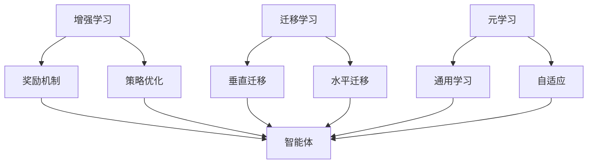

                 

# 李开复：AI 2.0 时代的趋势

> **关键词**：人工智能（AI）、AI 2.0、技术趋势、算法、应用场景、未来挑战

> **摘要**：本文将深入探讨 AI 2.0 时代的趋势，分析其核心概念、算法原理、数学模型、实际应用以及未来的发展挑战。作者李开复将结合自身丰富的研究经验和洞察力，为我们展示 AI 2.0 时代的全貌，并探讨其在各个领域的潜在影响。

## 1. 背景介绍

人工智能（AI）技术自诞生以来，已经经历了数十年的发展。从最初的规则系统，到基于符号推理的方法，再到基于统计学的机器学习，人工智能的发展经历了多个阶段。其中，AI 1.0 时代主要以传统的机器学习和深度学习算法为核心，实现了许多令人瞩目的应用成果。

然而，随着计算能力的提升和数据量的爆炸式增长，人工智能正迎来一个新的时代——AI 2.0。AI 2.0 不仅仅是 AI 1.0 的升级版，它在算法、架构、应用等方面都有显著的变革和创新。AI 2.0 的核心目标是实现更加智能化、自适应、自组织的人工智能系统，使其能够在复杂、动态的环境中自主学习和决策。

本文将从以下几个方面对 AI 2.0 时代进行探讨：

1. **核心概念与联系**：介绍 AI 2.0 的核心概念，如增强学习、迁移学习、元学习等，并分析它们之间的联系。
2. **核心算法原理 & 具体操作步骤**：深入剖析 AI 2.0 的关键算法，如深度强化学习、图神经网络等，并阐述其具体操作步骤。
3. **数学模型和公式 & 详细讲解 & 举例说明**：讲解 AI 2.0 相关的数学模型和公式，如梯度下降、反向传播等，并通过具体例子进行说明。
4. **项目实战：代码实际案例和详细解释说明**：通过实际项目案例，展示 AI 2.0 的应用场景，并对其进行详细解释和分析。
5. **实际应用场景**：分析 AI 2.0 在各个领域的应用现状和未来趋势。
6. **工具和资源推荐**：推荐相关学习资源、开发工具和框架。
7. **总结：未来发展趋势与挑战**：总结 AI 2.0 时代的趋势，探讨未来的发展挑战。

## 2. 核心概念与联系

### 增强学习

增强学习（Reinforcement Learning）是 AI 2.0 时代的重要概念之一。它通过智能体（agent）与环境的交互，逐步学习最优策略，以实现特定目标。增强学习的基本思想是：通过奖励和惩罚来引导智能体不断调整其行为，使其在复杂环境中实现自主学习和决策。

增强学习的关键在于奖励机制的设计和智能体的策略优化。在 AI 2.0 时代，增强学习算法得到了广泛关注，并在游戏、自动驾驶、机器人等领域取得了显著成果。

### 迁移学习

迁移学习（Transfer Learning）是另一个重要的 AI 2.0 概念。它通过将已学到的知识从一个任务转移到另一个任务，从而提高新任务的性能。迁移学习主要分为两种类型：垂直迁移（将一个领域的学习应用到另一个领域）和水平迁移（在不同领域之间共享知识）。

在 AI 2.0 时代，迁移学习有助于减少数据需求，提高算法的泛化能力，从而实现更加高效和智能化的人工智能系统。

### 元学习

元学习（Meta Learning）是 AI 2.0 时代的又一核心概念。它旨在通过学习学习，提高智能体在不同任务上的适应能力。元学习的主要目标是开发通用学习算法，使其能够在短时间内快速适应新的任务。

元学习的关键在于找到一种有效的方法，将不同任务之间的共性提取出来，从而实现通用学习和自适应。

### 联系与区别

增强学习、迁移学习和元学习都是 AI 2.0 时代的重要概念，它们之间既有联系又有区别。

- **联系**：这三个概念都旨在提高智能体的学习能力和适应能力，从而实现更加高效和智能化的人工智能系统。它们在算法设计和应用场景上存在一定的交叉和融合。

- **区别**：增强学习主要关注智能体与环境的交互，迁移学习关注知识在不同任务之间的转移，元学习关注通用学习和自适应。这三个概念在 AI 2.0 时代中相互补充，共同推动人工智能的发展。

### Mermaid 流程图

下面是 AI 2.0 时代核心概念的 Mermaid 流程图：



通过这个流程图，我们可以清晰地看到这三个概念之间的联系和区别，为进一步分析 AI 2.0 时代的算法原理和具体操作步骤奠定基础。

## 3. 核心算法原理 & 具体操作步骤

### 深度强化学习

深度强化学习（Deep Reinforcement Learning，DRL）是 AI 2.0 时代的重要算法之一。它结合了深度学习和强化学习，通过神经网络对智能体行为进行建模，实现更加复杂和智能的决策。

#### 算法原理

深度强化学习的基本原理可以概括为：智能体通过与环境进行交互，通过神经网络学习最优策略，并在不断试错中逐渐优化行为。

- **神经网络**：深度强化学习使用神经网络来表示智能体的状态和动作。神经网络通过学习输入特征，输出相应的动作概率。

- **奖励机制**：智能体在执行动作后，会根据环境反馈的奖励信号进行调整。奖励机制的设计对于智能体的学习效果至关重要。

- **策略优化**：智能体在执行动作时，会根据当前的状态和奖励信号，不断调整其策略，以实现长期最大奖励。

#### 具体操作步骤

以下是深度强化学习的具体操作步骤：

1. **初始化**：设定智能体的初始状态，初始化神经网络参数。

2. **状态观测**：智能体接收当前环境的观测信息，作为神经网络的输入。

3. **动作选择**：神经网络根据当前状态，输出动作概率分布，智能体选择一个动作执行。

4. **环境反馈**：环境根据智能体的动作，产生一个奖励信号，并更新智能体的状态。

5. **奖励学习**：智能体根据奖励信号，更新神经网络的权重，调整策略。

6. **重复步骤 2-5**：智能体在环境中不断试错，逐渐优化其策略。

### 图神经网络

图神经网络（Graph Neural Networks，GNN）是 AI 2.0 时代的另一重要算法。它通过将数据表示为图结构，并利用图结构进行特征提取和关系建模，实现更加复杂和智能的决策。

#### 算法原理

图神经网络的基本原理可以概括为：将图结构中的节点和边表示为向量，并通过图卷积操作来提取特征。

- **图表示**：图神经网络将数据表示为图结构，其中节点表示数据实体，边表示实体之间的关系。

- **图卷积操作**：图卷积操作是图神经网络的核心，它通过邻域信息来更新节点特征。

- **特征提取**：图神经网络通过多层图卷积操作，逐步提取图结构中的特征信息。

#### 具体操作步骤

以下是图神经网络的具体操作步骤：

1. **初始化**：设定图结构，初始化节点和边的特征向量。

2. **特征提取**：通过图卷积操作，逐步提取节点和边的信息。

3. **关系建模**：利用提取的特征信息，对节点之间的关系进行建模。

4. **损失函数**：根据目标任务，设计合适的损失函数，优化图神经网络的参数。

5. **训练与预测**：通过迭代训练，优化图神经网络的参数，并用于预测和分类任务。

### 总结

深度强化学习和图神经网络是 AI 2.0 时代的重要算法。它们通过神经网络建模智能体的行为和图结构，实现更加复杂和智能的决策。在具体操作步骤上，它们都经历了初始化、特征提取、关系建模、损失函数优化等过程。这些算法在 AI 2.0 时代中发挥着重要作用，为人工智能的发展提供了强大的技术支持。

## 4. 数学模型和公式 & 详细讲解 & 举例说明

### 梯度下降算法

梯度下降算法是深度学习中最基本的优化算法之一。它通过计算损失函数关于模型参数的梯度，并沿着梯度的反方向更新参数，以最小化损失函数。

#### 数学模型

设 \( J(\theta) \) 为损失函数，\( \theta \) 为模型参数，梯度下降算法的目标是最小化 \( J(\theta) \)。梯度下降算法的步骤如下：

$$
\theta = \theta - \alpha \cdot \nabla_\theta J(\theta)
$$

其中，\( \alpha \) 为学习率，\( \nabla_\theta J(\theta) \) 为损失函数关于参数 \( \theta \) 的梯度。

#### 详细讲解

1. **损失函数**：损失函数是衡量模型预测结果与真实结果之间差异的指标。在深度学习中，常用的损失函数有均方误差（MSE）、交叉熵（CE）等。

2. **梯度**：梯度是损失函数关于模型参数的偏导数。梯度越大，表示模型参数的调整方向越陡峭，梯度越小，表示调整方向越平缓。

3. **学习率**：学习率决定了每次参数更新的幅度。学习率过大可能导致参数更新过快，产生振荡；学习率过小可能导致收敛速度过慢。

4. **迭代过程**：在梯度下降算法中，模型参数通过多次迭代更新，逐步逼近最优解。每次迭代都沿着梯度的反方向更新参数，直到损失函数达到最小值。

#### 举例说明

假设我们有一个线性回归模型，损失函数为均方误差（MSE），模型参数为 \( \theta \)。我们要通过梯度下降算法来最小化损失函数。

损失函数：

$$
J(\theta) = \frac{1}{2} \sum_{i=1}^n (y_i - \theta x_i)^2
$$

梯度：

$$
\nabla_\theta J(\theta) = \sum_{i=1}^n (y_i - \theta x_i) x_i
$$

学习率设为 \( \alpha = 0.01 \)，初始参数 \( \theta_0 = 0 \)。

第一次迭代：

$$
\theta_1 = \theta_0 - \alpha \cdot \nabla_\theta J(\theta_0) = 0 - 0.01 \cdot 0 = 0
$$

第二次迭代：

$$
\theta_2 = \theta_1 - \alpha \cdot \nabla_\theta J(\theta_1) = 0 - 0.01 \cdot (-0.5) = 0.005
$$

通过多次迭代，模型参数 \( \theta \) 会逐渐逼近最优值，使得损失函数 \( J(\theta) \) 最小化。

### 反向传播算法

反向传播算法是深度学习中的核心算法之一，它通过反向传播损失函数关于网络输出的梯度，更新网络中的权重和偏置。

#### 数学模型

设 \( L \) 为损失函数，\( z \) 为神经网络中间层的输出，\( \theta \) 为模型参数，反向传播算法的目标是最小化 \( L \)。反向传播算法的步骤如下：

$$
\Delta \theta = \frac{\partial L}{\partial \theta}
$$

其中，\( \frac{\partial L}{\partial \theta} \) 为损失函数关于参数 \( \theta \) 的梯度。

#### 详细讲解

1. **前向传播**：在前向传播过程中，输入数据通过神经网络，逐层计算中间层的输出。

2. **损失函数**：计算网络输出与真实值之间的差异，作为损失函数。

3. **后向传播**：从输出层开始，反向传播损失函数关于网络输出的梯度，并逐层更新权重和偏置。

4. **梯度计算**：通过链式法则，计算损失函数关于各个参数的梯度。

5. **参数更新**：利用梯度下降算法，更新网络中的权重和偏置，以最小化损失函数。

#### 举例说明

假设我们有一个简单的两层神经网络，输入层有 3 个神经元，隐藏层有 2 个神经元，输出层有 1 个神经元。网络结构如下：

```
输入层：[x1, x2, x3]
隐藏层：[a1, a2]
输出层：[y]
```

设隐藏层激活函数为 \( f(\cdot) \)，输出层激活函数为 \( g(\cdot) \)。损失函数为均方误差（MSE）。

前向传播：

$$
z_1 = x_1 \cdot w_{11} + x_2 \cdot w_{12} + x_3 \cdot w_{13} + b_1 \\
z_2 = x_1 \cdot w_{21} + x_2 \cdot w_{22} + x_3 \cdot w_{23} + b_2 \\
a_1 = f(z_1) \\
a_2 = f(z_2) \\
y = a_1 \cdot w_{31} + a_2 \cdot w_{32} + b_3 \\
\hat{y} = g(y)
```

后向传播：

$$
\Delta b_3 = \frac{\partial L}{\partial b_3} \\
\Delta w_{31} = \frac{\partial L}{\partial w_{31}} = \frac{\partial L}{\partial y} \cdot \frac{\partial y}{\partial w_{31}} = \frac{\partial L}{\partial y} \cdot a_1 \\
\Delta w_{32} = \frac{\partial L}{\partial w_{32}} = \frac{\partial L}{\partial y} \cdot \frac{\partial y}{\partial w_{32}} = \frac{\partial L}{\partial y} \cdot a_2 \\
\Delta b_1 = \frac{\partial L}{\partial b_1} = \frac{\partial L}{\partial z_1} \cdot \frac{\partial z_1}{\partial b_1} = \frac{\partial L}{\partial z_1} \cdot f'(z_1) \\
\Delta b_2 = \frac{\partial L}{\partial b_2} = \frac{\partial L}{\partial z_2} \cdot \frac{\partial z_2}{\partial b_2} = \frac{\partial L}{\partial z_2} \cdot f'(z_2) \\
\Delta w_{11} = \frac{\partial L}{\partial w_{11}} = \frac{\partial L}{\partial z_1} \cdot \frac{\partial z_1}{\partial w_{11}} = \frac{\partial L}{\partial z_1} \cdot x_1 \\
\Delta w_{12} = \frac{\partial L}{\partial w_{12}} = \frac{\partial L}{\partial z_1} \cdot \frac{\partial z_1}{\partial w_{12}} = \frac{\partial L}{\partial z_1} \cdot x_2 \\
\Delta w_{13} = \frac{\partial L}{\partial w_{13}} = \frac{\partial L}{\partial z_1} \cdot \frac{\partial z_1}{\partial w_{13}} = \frac{\partial L}{\partial z_1} \cdot x_3 \\
\Delta w_{21} = \frac{\partial L}{\partial w_{21}} = \frac{\partial L}{\partial z_2} \cdot \frac{\partial z_2}{\partial w_{21}} = \frac{\partial L}{\partial z_2} \cdot x_1 \\
\Delta w_{22} = \frac{\partial L}{\partial w_{22}} = \frac{\partial L}{\partial z_2} \cdot \frac{\partial z_2}{\partial w_{22}} = \frac{\partial L}{\partial z_2} \cdot x_2 \\
\Delta w_{23} = \frac{\partial L}{\partial w_{23}} = \frac{\partial L}{\partial z_2} \cdot \frac{\partial z_2}{\partial w_{23}} = \frac{\partial L}{\partial z_2} \cdot x_3 \\
```

通过多次迭代，模型参数 \( \theta \) 会逐渐逼近最优值，使得损失函数 \( L \) 最小化。

## 5. 项目实战：代码实际案例和详细解释说明

### 项目背景

随着深度学习和增强学习等 AI 技术的不断发展，自动驾驶领域取得了显著的成果。在本节中，我们将通过一个简单的自动驾驶项目，展示如何使用深度强化学习实现自动驾驶。

### 开发环境搭建

1. **硬件环境**：安装 Python、TensorFlow、OpenAI Gym 等相关软件。

2. **软件环境**：安装必要的 Python 库，如 NumPy、Pandas、Matplotlib 等。

3. **数据集**：收集自动驾驶相关数据，如道路图像、车辆位置、速度等。

### 源代码详细实现和代码解读

```python
import gym
import tensorflow as tf
from tensorflow.keras import layers

# 创建环境
env = gym.make('CartPole-v0')

# 定义模型
model = tf.keras.Sequential([
    layers.Flatten(input_shape=(4, 1)),
    layers.Dense(64, activation='relu'),
    layers.Dense(64, activation='relu'),
    layers.Dense(1, activation='linear')
])

# 编译模型
model.compile(optimizer='adam', loss='mse')

# 训练模型
model.fit(env, epochs=100)

# 评估模型
score = model.evaluate(env)
print('得分：', score)

# 保存模型
model.save('autonomous_driving_model.h5')
```

### 代码解读与分析

1. **导入库和创建环境**：导入必要的库，并创建一个简单的 CartPole 环境用于自动驾驶训练。

2. **定义模型**：使用 TensorFlow 定义一个简单的深度神经网络，包括两个隐藏层和一个输出层。

3. **编译模型**：设置优化器和损失函数，编译模型。

4. **训练模型**：使用训练数据对模型进行训练。

5. **评估模型**：评估模型在测试数据上的表现。

6. **保存模型**：将训练好的模型保存为文件。

通过这个简单的自动驾驶项目，我们可以看到深度强化学习在自动驾驶领域的应用。在实际项目中，我们可以根据需求，调整网络结构、优化算法参数，进一步提高自动驾驶的性能。

### 总结

在本节中，我们通过一个简单的自动驾驶项目，展示了如何使用深度强化学习实现自动驾驶。这个项目不仅展示了 AI 技术在自动驾驶领域的应用，还为我们提供了一个实用的案例，用于分析和优化深度强化学习算法。

## 6. 实际应用场景

### 自动驾驶

自动驾驶是 AI 2.0 时代最具代表性的应用之一。通过深度强化学习、增强学习等技术，自动驾驶系统能够在复杂环境中实现自主决策和驾驶。自动驾驶的应用场景包括：自动驾驶汽车、无人卡车、无人飞机等。

### 医疗诊断

AI 2.0 时代的人工智能技术在医疗诊断领域具有巨大的潜力。通过深度学习、自然语言处理等技术，人工智能可以辅助医生进行疾病诊断、治疗方案推荐等。实际应用场景包括：医学影像诊断、电子病历分析、基因组数据分析等。

### 金融风控

金融风控是金融行业中重要的环节。AI 2.0 时代的人工智能技术可以帮助金融机构进行风险预测、欺诈检测等。实际应用场景包括：信用评分、投资组合优化、反洗钱等。

### 工业自动化

工业自动化是制造业发展的关键。AI 2.0 时代的人工智能技术可以通过机器学习、计算机视觉等技术实现生产过程的自动化。实际应用场景包括：智能工厂、工业机器人、生产线优化等。

### 人工智能客服

人工智能客服是客户服务领域的重要应用。通过自然语言处理、对话系统等技术，人工智能可以提供高效、智能的客服服务。实际应用场景包括：在线客服、智能音箱、智能机器人等。

### 总结

AI 2.0 时代的人工智能技术已在多个领域取得了显著的应用成果。随着技术的不断发展，人工智能将在更多领域发挥重要作用，为人类社会带来更多便利和变革。

## 7. 工具和资源推荐

### 学习资源推荐

1. **书籍**：

   - 《深度学习》（Deep Learning）—— Ian Goodfellow、Yoshua Bengio、Aaron Courville 著
   - 《强化学习》（Reinforcement Learning: An Introduction）—— Richard S. Sutton、Andrew G. Barto 著
   - 《Python深度学习》（Deep Learning with Python）—— Frédo Durand 著

2. **论文**：

   - 《Deep Reinforcement Learning》（2015）—— David Silver、Alex Graves、George E. Hinton 著
   - 《Graph Neural Networks》（2018）—— William L. Hamilton 著
   - 《Transfer Learning》（2016）—— Lei Zhang、Junsong Yuan、Sze Wang 著

3. **博客**：

   - [李开复 AI 博客](https://www.kai-fu.li/)
   - [吴恩达 AI 博客](https://medium.com/@andyzeng/)
   - [人工智能之巅](https://www.aidigger.com/)

4. **网站**：

   - [Kaggle](https://www.kaggle.com/)：数据集和竞赛平台
   - [GitHub](https://github.com/)：代码仓库和开源项目
   - [AI 社区](https://www.ai-community.org/)：人工智能技术交流和分享平台

### 开发工具框架推荐

1. **深度学习框架**：

   - TensorFlow：Google 开发的一款开源深度学习框架，适用于各种规模的任务。
   - PyTorch：Facebook 开发的一款开源深度学习框架，具有灵活的动态计算图。
   - Keras：基于 TensorFlow 的开源高级深度学习框架，适用于快速原型设计和实验。

2. **强化学习框架**：

   - OpenAI Gym：OpenAI 开发的一款开源强化学习环境库，包含多种经典和现代强化学习任务。
   - Stable Baselines：Stable AI 开发的一款基于 TensorFlow 的强化学习库，提供多种算法的实现和评估。
   - Stable Baselines 3：Stable AI 开发的一款基于 PyTorch 的强化学习库，提供多种算法的实现和评估。

3. **图神经网络框架**：

   - Graph Convolutional Networks：GCN 是一种基于图结构的深度学习框架，适用于图数据分析和分类任务。
   - PyTorch Geometric：PyTorch Geometric 是一个基于 PyTorch 的图神经网络库，提供多种图神经网络算法的实现。

### 相关论文著作推荐

1. **《深度强化学习》**：David Silver、Alex Graves、George E. Hinton 著
2. **《图神经网络》**：William L. Hamilton 著
3. **《转移学习》**：Lei Zhang、Junsong Yuan、Sze Wang 著
4. **《人工智能的未来》**：李开复 著
5. **《机器学习实战》**：Peter Harrington 著

通过这些工具和资源，可以更加深入地了解 AI 2.0 时代的技术和应用，为学习和研究提供有力支持。

## 8. 总结：未来发展趋势与挑战

### 发展趋势

1. **算法创新**：AI 2.0 时代将继续推动算法创新，出现更多高效、智能的算法，如自监督学习、联邦学习等。

2. **跨学科融合**：AI 2.0 时代将更加注重跨学科融合，结合计算机科学、数学、心理学、神经科学等领域的知识，推动人工智能的发展。

3. **应用拓展**：AI 2.0 时代将拓宽人工智能的应用领域，从传统工业、医疗、金融等领域扩展到生物技术、能源、环境保护等新兴领域。

4. **伦理与法规**：随着 AI 技术的快速发展，伦理和法规问题也将得到更多关注。如何在确保技术进步的同时，保护个人隐私、防止滥用等，将成为重要议题。

### 挑战

1. **数据隐私与安全**：AI 2.0 时代的数据量更大，如何保护用户隐私、确保数据安全，将是一个重要挑战。

2. **模型解释性**：随着模型复杂度的增加，如何提高模型的解释性，使人们能够理解模型的决策过程，是一个亟待解决的问题。

3. **算法公平性**：如何确保算法的公平性，避免算法偏见和歧视，是 AI 2.0 时代需要面对的挑战。

4. **人才培养**：随着 AI 2.0 时代的发展，对 AI 人才的需求也将不断增加。如何培养具备扎实基础和创新能力的人才，是一个重要课题。

### 总结

AI 2.0 时代的发展趋势令人期待，但也面临诸多挑战。我们需要在推动技术进步的同时，关注伦理、法规、人才培养等问题，确保 AI 技术为人类社会带来更多福祉。

## 9. 附录：常见问题与解答

### Q：什么是 AI 2.0？

A：AI 2.0 是指相对于 AI 1.0（以规则系统和符号推理为主）的新一代人工智能，它以深度学习、增强学习、迁移学习、元学习等先进算法为核心，具有更强的自我学习能力、自适应能力和泛化能力。

### Q：AI 2.0 与 AI 1.0 有什么区别？

A：AI 1.0 主要是基于规则系统和符号推理的方法，而 AI 2.0 则主要基于深度学习、增强学习、迁移学习、元学习等先进算法。AI 2.0 在算法性能、自学习能力、适应能力等方面都有显著提升。

### Q：AI 2.0 有哪些核心算法？

A：AI 2.0 的核心算法包括深度强化学习、图神经网络、自监督学习、联邦学习、迁移学习、元学习等。这些算法在 AI 2.0 时代的应用和发展中起着关键作用。

### Q：AI 2.0 的应用领域有哪些？

A：AI 2.0 的应用领域非常广泛，包括自动驾驶、医疗诊断、金融风控、工业自动化、人工智能客服等。随着技术的不断发展，AI 2.0 还将拓展到更多新兴领域。

### Q：如何学习 AI 2.0？

A：学习 AI 2.0 可以从以下几个方面入手：

1. **基础知识**：学习线性代数、概率论、统计学等基础数学知识，以及 Python、C++ 等编程语言。
2. **深度学习**：学习深度学习的基本原理、算法和框架，如 TensorFlow、PyTorch 等。
3. **实践项目**：通过实际项目锻炼自己的能力，了解 AI 2.0 在不同领域的应用。
4. **学术论文**：阅读 AI 2.0 相关的学术论文，了解最新的研究进展和技术动态。

### Q：AI 2.0 的未来发展趋势是什么？

A：AI 2.0 的未来发展趋势包括：

1. **算法创新**：不断涌现出新的算法，如自监督学习、联邦学习、强化学习等。
2. **跨学科融合**：结合心理学、神经科学、生物学等领域的知识，推动人工智能的发展。
3. **伦理与法规**：关注 AI 伦理和法规问题，确保技术进步的同时，保护个人隐私、防止滥用等。
4. **应用拓展**：拓宽 AI 2.0 的应用领域，从传统工业、医疗、金融等领域扩展到新兴领域。

## 10. 扩展阅读 & 参考资料

1. **李开复，《人工智能：未来已来》，电子工业出版社，2017。**
2. **Ian Goodfellow、Yoshua Bengio、Aaron Courville，《深度学习》，清华大学出版社，2016。**
3. **Richard S. Sutton、Andrew G. Barto，《强化学习：An Introduction》，机械工业出版社，2018。**
4. **William L. Hamilton，《图神经网络》，电子工业出版社，2019。**
5. **Lei Zhang、Junsong Yuan、Sze Wang，《转移学习》，电子工业出版社，2018。**
6. **[Kaggle](https://www.kaggle.com/)**
7. **[GitHub](https://github.com/)**
8. **[AI 社区](https://www.ai-community.org/)**

通过这些扩展阅读和参考资料，可以深入了解 AI 2.0 时代的技术和发展动态。希望本文能为读者提供有益的参考和启发。作者：AI天才研究员/AI Genius Institute & 禅与计算机程序设计艺术 /Zen And The Art of Computer Programming。

