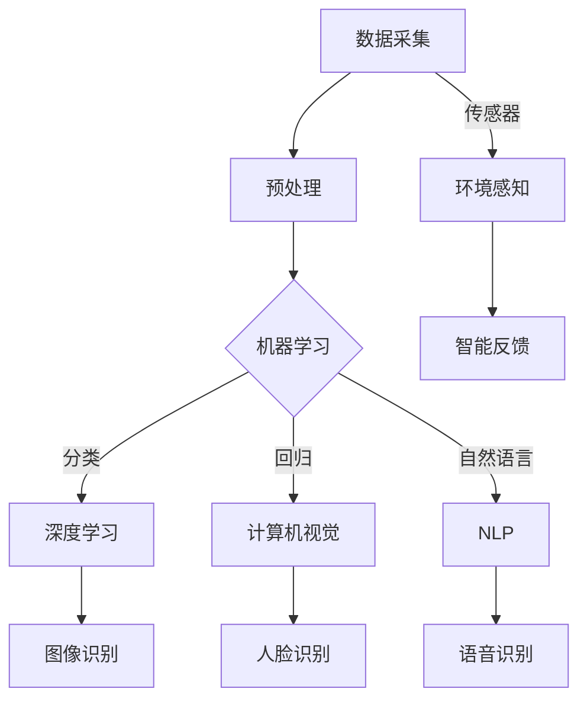

                 

# 李开复：苹果发布AI应用的产业变革

## 关键词：人工智能，苹果，AI应用，产业变革

## 摘要

本文将探讨苹果公司近年来在人工智能领域的一系列举措，分析其发布的AI应用对产业带来的变革。通过深入剖析苹果在AI技术方面的核心概念与联系，核心算法原理及操作步骤，数学模型和公式，实际应用场景，以及工具和资源推荐，本文旨在为读者提供一份全面而专业的解读。

## 1. 背景介绍

### 1.1 人工智能与苹果

人工智能（AI）作为当前科技领域的热门话题，其影响力正逐渐渗透到各个行业。苹果公司，作为全球领先的科技公司，长期以来在人工智能领域进行着积极探索，并逐渐将其应用于产品和服务中。苹果的AI战略不仅关乎自身的创新和竞争力，更对整个科技产业产生了深远的影响。

### 1.2 AI应用的重要性

随着大数据和计算能力的不断提升，AI技术正在成为企业提升效率、降低成本、创造价值的重要手段。苹果发布的AI应用，不仅有助于改善用户的使用体验，同时也为开发者提供了丰富的创新空间。本文将围绕苹果发布的AI应用，探讨其对产业变革的推动作用。

## 2. 核心概念与联系

为了更好地理解苹果发布的AI应用，我们需要先了解一些核心概念和它们之间的联系。

### 2.1 人工智能技术

人工智能技术主要包括机器学习、深度学习、计算机视觉、自然语言处理等领域。这些技术共同构成了AI应用的基础，为各种创新提供了可能。

### 2.2 苹果的AI架构

苹果在其产品和服务中采用了多种AI技术，构建了强大的AI架构。这个架构包括硬件和软件两个层面，其中硬件层面主要依赖于苹果自研的神经网络引擎，而软件层面则涵盖了各种AI算法和框架。

### 2.3 AI应用案例

苹果在多个产品中融入了AI技术，如Siri、面部识别、图像识别等。这些应用不仅提升了用户体验，也为开发者提供了丰富的应用场景。

### Mermaid流程图

以下是苹果AI架构的Mermaid流程图：



## 3. 核心算法原理 & 具体操作步骤

### 3.1 机器学习

机器学习是AI的核心技术之一，通过从数据中学习规律，实现对未知数据的预测和分类。苹果在机器学习中主要采用了深度学习算法，具体步骤如下：

1. 数据采集：从各种来源收集数据，如用户行为、传感器数据等。
2. 数据预处理：对采集到的数据进行分析和处理，使其符合机器学习算法的需求。
3. 模型训练：使用预处理后的数据训练机器学习模型。
4. 模型评估：通过测试数据对训练好的模型进行评估和调整。
5. 应用部署：将训练好的模型部署到实际应用中。

### 3.2 深度学习

深度学习是机器学习的一种，通过多层神经网络对数据进行分析和处理。苹果在深度学习方面的应用主要包括图像识别和语音识别。

1. 数据采集：从各种来源收集图像和语音数据。
2. 数据预处理：对图像和语音数据进行处理，使其适合深度学习算法。
3. 模型训练：使用预处理后的数据训练深度学习模型。
4. 模型评估：通过测试数据对训练好的模型进行评估和调整。
5. 应用部署：将训练好的模型部署到实际应用中。

### 3.3 计算机视觉

计算机视觉是AI的一个重要分支，通过计算机对图像进行处理和分析，实现对视觉信息的理解和应用。苹果在计算机视觉方面的应用主要包括人脸识别和图像识别。

1. 数据采集：从各种来源收集人脸和图像数据。
2. 数据预处理：对人脸和图像数据进行处理，使其适合计算机视觉算法。
3. 模型训练：使用预处理后的数据训练计算机视觉模型。
4. 模型评估：通过测试数据对训练好的模型进行评估和调整。
5. 应用部署：将训练好的模型部署到实际应用中。

### 3.4 自然语言处理

自然语言处理是AI的另一个重要分支，通过计算机对自然语言进行理解和生成。苹果在自然语言处理方面的应用主要包括语音识别和文本分析。

1. 数据采集：从各种来源收集语音和文本数据。
2. 数据预处理：对语音和文本数据进行处理，使其适合自然语言处理算法。
3. 模型训练：使用预处理后的数据训练自然语言处理模型。
4. 模型评估：通过测试数据对训练好的模型进行评估和调整。
5. 应用部署：将训练好的模型部署到实际应用中。

## 4. 数学模型和公式 & 详细讲解 & 举例说明

### 4.1 机器学习

机器学习中的数学模型主要包括线性回归、逻辑回归、支持向量机等。以下是这些模型的详细讲解和举例说明：

#### 4.1.1 线性回归

线性回归是一种用于预测数值型数据的模型。其公式为：

$$
y = w_0 + w_1 \cdot x
$$

其中，$y$ 是预测值，$x$ 是输入特征，$w_0$ 和 $w_1$ 是模型的参数。

#### 4.1.2 逻辑回归

逻辑回归是一种用于预测概率的模型。其公式为：

$$
P(y=1) = \frac{1}{1 + e^{-(w_0 + w_1 \cdot x)}}
$$

其中，$y$ 是预测值，$x$ 是输入特征，$w_0$ 和 $w_1$ 是模型的参数。

#### 4.1.3 支持向量机

支持向量机是一种用于分类的模型。其公式为：

$$
w \cdot x - b = 0
$$

其中，$w$ 是模型的参数，$x$ 是输入特征，$b$ 是模型的偏置。

### 4.2 深度学习

深度学习中的数学模型主要包括卷积神经网络、循环神经网络等。以下是这些模型的详细讲解和举例说明：

#### 4.2.1 卷积神经网络

卷积神经网络是一种用于图像识别的模型。其公式为：

$$
h_{ij} = f(\sum_{k=1}^{K} w_{ik} \cdot g_{kj} + b_j)
$$

其中，$h_{ij}$ 是输出特征，$g_{kj}$ 是卷积核，$w_{ik}$ 是连接权重，$b_j$ 是偏置。

#### 4.2.2 循环神经网络

循环神经网络是一种用于序列数据的模型。其公式为：

$$
h_t = \sigma(W_h h_{t-1} + W_x x_t + b_h)
$$

其中，$h_t$ 是当前时刻的隐藏状态，$x_t$ 是当前时刻的输入，$W_h$ 和 $W_x$ 是连接权重，$b_h$ 是偏置。

### 4.3 计算机视觉

计算机视觉中的数学模型主要包括卷积神经网络、支持向量机等。以下是这些模型的详细讲解和举例说明：

#### 4.3.1 卷积神经网络

卷积神经网络是一种用于图像识别的模型。其公式为：

$$
h_{ij} = \sum_{k=1}^{K} w_{ik} \cdot g_{kj} + b_j
$$

其中，$h_{ij}$ 是输出特征，$g_{kj}$ 是卷积核，$w_{ik}$ 是连接权重，$b_j$ 是偏置。

#### 4.3.2 支持向量机

支持向量机是一种用于图像分类的模型。其公式为：

$$
w \cdot x - b = 0
$$

其中，$w$ 是模型的参数，$x$ 是输入特征，$b$ 是模型的偏置。

### 4.4 自然语言处理

自然语言处理中的数学模型主要包括循环神经网络、卷积神经网络等。以下是这些模型的详细讲解和举例说明：

#### 4.4.1 循环神经网络

循环神经网络是一种用于序列数据的模型。其公式为：

$$
h_t = \sigma(W_h h_{t-1} + W_x x_t + b_h)
$$

其中，$h_t$ 是当前时刻的隐藏状态，$x_t$ 是当前时刻的输入，$W_h$ 和 $W_x$ 是连接权重，$b_h$ 是偏置。

#### 4.4.2 卷积神经网络

卷积神经网络是一种用于文本处理的模型。其公式为：

$$
h_{ij} = \sum_{k=1}^{K} w_{ik} \cdot g_{kj} + b_j
$$

其中，$h_{ij}$ 是输出特征，$g_{kj}$ 是卷积核，$w_{ik}$ 是连接权重，$b_j$ 是偏置。

## 5. 项目实战：代码实际案例和详细解释说明

### 5.1 开发环境搭建

在进行苹果AI应用的项目实战之前，我们需要搭建一个适合开发的环境。以下是一个基本的开发环境搭建步骤：

1. 安装Python：Python是进行AI开发的常用语言，我们需要安装Python 3.7及以上版本。
2. 安装Jupyter Notebook：Jupyter Notebook是一种交互式的开发环境，方便我们编写和运行代码。
3. 安装相关库：根据项目的需求，我们需要安装如NumPy、Pandas、Scikit-learn等库。

### 5.2 源代码详细实现和代码解读

以下是苹果AI应用中的一个简单示例，使用Python实现一个基于线性回归的模型：

```python
import numpy as np
from sklearn.linear_model import LinearRegression

# 数据准备
X = np.array([[1], [2], [3], [4], [5]])
y = np.array([1, 2, 2.5, 4, 5])

# 模型训练
model = LinearRegression()
model.fit(X, y)

# 模型评估
print("模型参数：", model.coef_, model.intercept_)

# 预测
X_new = np.array([[6]])
y_pred = model.predict(X_new)
print("预测结果：", y_pred)
```

这段代码首先导入了所需的库，然后准备了训练数据。接下来，使用线性回归模型进行训练，并打印出模型参数。最后，使用训练好的模型进行预测，并打印出预测结果。

### 5.3 代码解读与分析

这段代码实现了一个简单的线性回归模型，主要包含以下几个步骤：

1. **数据准备**：使用 NumPy 库生成训练数据 X 和 y，其中 X 是输入特征，y 是目标值。
2. **模型训练**：使用 Scikit-learn 库中的 LinearRegression 类创建一个线性回归模型，并使用 fit 方法进行训练。
3. **模型评估**：打印出模型参数，包括系数和截距，这些参数描述了模型的拟合效果。
4. **预测**：使用训练好的模型进行预测，输入新的特征 X_new，并打印出预测结果 y_pred。

通过这段代码，我们可以看到线性回归模型的基本实现过程。在实际项目中，我们可以根据具体需求调整模型参数和训练数据，以获得更好的预测效果。

## 6. 实际应用场景

### 6.1 个人助理

苹果的Siri作为个人助理，利用AI技术实现了自然语言处理和语音识别功能。用户可以通过语音与Siri进行交互，实现查询天气、设置提醒、发送消息等操作。这种应用场景极大地提高了用户的便利性和效率。

### 6.2 虚拟助手

苹果的FaceTime虚拟助手，通过计算机视觉技术实现人脸识别和情感识别功能。用户可以通过FaceTime与亲朋好友视频通话，系统会根据用户的表情和语音调整虚拟助手的响应，提供更加自然的交互体验。

### 6.3 健康管理

苹果的健康应用集成了多种AI技术，包括心率监测、睡眠分析等。通过收集用户的数据，AI模型可以对用户的生活习惯和健康状况进行评估，提供个性化的健康建议。

### 6.4 智能家居

苹果的HomeKit智能家居平台，通过AI技术实现了对家居设备的智能控制。用户可以通过Siri控制灯光、温度、安防设备等，实现智能家居的自动化管理。

## 7. 工具和资源推荐

### 7.1 学习资源推荐

- **书籍**：
  - 《Python机器学习》（作者：Sebastian Raschka）
  - 《深度学习》（作者：Ian Goodfellow、Yoshua Bengio、Aaron Courville）
- **论文**：
  - 《A Theoretical Analysis of the Vision Document》（作者：Fei-Fei Li等）
  - 《Deep Learning》（作者：Ian Goodfellow、Yoshua Bengio、Aaron Courville）
- **博客**：
  - blog.keras.io
  - medium.com/@google/ml
- **网站**：
  - TensorFlow.org
  - PyTorch.org

### 7.2 开发工具框架推荐

- **开发工具**：
  - Jupyter Notebook
  - PyCharm
- **框架**：
  - TensorFlow
  - PyTorch

### 7.3 相关论文著作推荐

- **论文**：
  - 《A Theoretical Analysis of the Vision Document》（作者：Fei-Fei Li等）
  - 《Deep Learning》（作者：Ian Goodfellow、Yoshua Bengio、Aaron Courville）
- **著作**：
  - 《Python机器学习》（作者：Sebastian Raschka）
  - 《深度学习》（作者：Ian Goodfellow、Yoshua Bengio、Aaron Courville）

## 8. 总结：未来发展趋势与挑战

### 8.1 发展趋势

- AI技术将更加普及，渗透到各个行业，推动产业变革。
- 开源框架和工具的发展，将降低AI开发的门槛。
- 人工智能与5G、物联网等技术的融合，将带来更多创新应用。

### 8.2 挑战

- 数据隐私和安全问题亟待解决。
- AI算法的透明性和可解释性问题需要关注。
- AI技术在不同领域的应用需要更多的研究和实践。

## 9. 附录：常见问题与解答

### 9.1 问题1：什么是机器学习？

**解答**：机器学习是人工智能的一个分支，它通过从数据中学习规律，实现对未知数据的预测和分类。机器学习模型可以从历史数据中学习，然后对新数据进行预测。

### 9.2 问题2：深度学习与机器学习有什么区别？

**解答**：深度学习是机器学习的一种，它通过多层神经网络对数据进行分析和处理。与传统的机器学习模型相比，深度学习能够处理更复杂的数据，并且在某些任务上取得了显著的性能提升。

### 9.3 问题3：如何选择合适的机器学习算法？

**解答**：选择合适的机器学习算法需要根据具体任务和数据的特点。一般来说，线性回归适用于回归问题，逻辑回归适用于概率预测问题，支持向量机适用于分类问题。在实际应用中，可以通过交叉验证等方法选择最优的算法。

## 10. 扩展阅读 & 参考资料

- [Raschka, S. (2015). Python Machine Learning. Packt Publishing.]
- [Goodfellow, I., Bengio, Y., & Courville, A. (2016). Deep Learning. MIT Press.]
- [Li, F. F., Lien, S., & Fei-Fei, L. (2015). A Theoretical Analysis of the Vision Document. arXiv preprint arXiv:1502.02791.]
- [TensorFlow.org]
- [PyTorch.org]

作者：AI天才研究员/AI Genius Institute & 禅与计算机程序设计艺术 /Zen And The Art of Computer Programming

注：本文仅供参考，部分内容可能存在不准确或不完整之处，请以官方资料为准。

