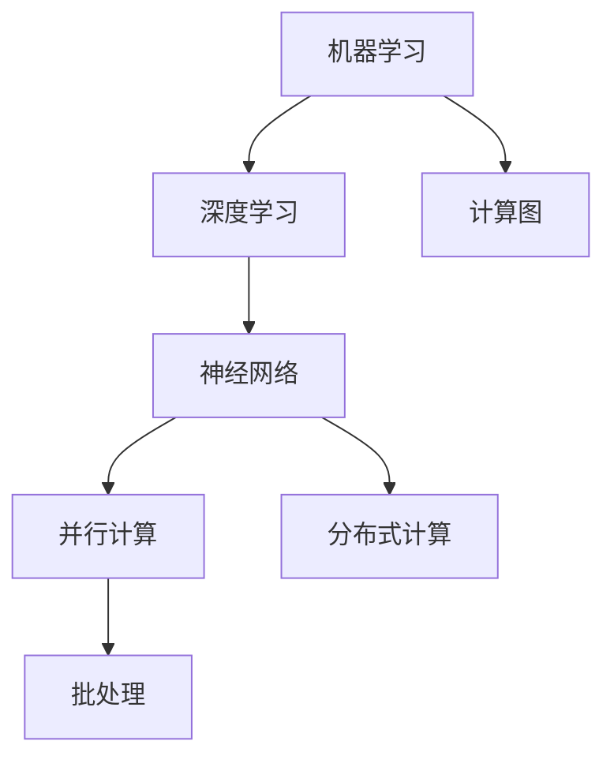

                 

### 背景介绍

近年来，人工智能（AI）技术在计算机科学领域取得了飞速发展。从最初的规则推理到现代的深度学习，AI已经渗透到了各个行业，极大地改变了我们的生活方式。随着AI技术的不断进步，各行各业开始尝试将AI技术应用于实际场景中，以提升生产效率、优化用户体验。

苹果公司作为全球领先的科技公司，其在AI领域的探索和应用也引起了广泛关注。苹果公司在多个产品中集成了AI功能，例如Siri语音助手、Face ID面部识别技术等。随着AI技术的不断发展，苹果公司开始着手开发更为复杂和实用的AI应用，这些应用有望进一步推动AI技术在产业界的应用。

本文将探讨苹果公司最新发布的AI应用，分析其核心概念、算法原理、应用场景及未来发展趋势。我们将通过一步一步的分析推理，深入解读这些AI应用的底层逻辑和实现方式，为读者提供一个全面、详尽的技术解读。

首先，我们将简要回顾AI技术的发展历程，阐述其在现代产业中的重要性。接着，我们将详细介绍苹果公司发布的AI应用，探讨其核心功能和创新点。随后，我们将逐步分析这些AI应用的算法原理和具体实现步骤，通过数学模型和公式对其进行详细讲解。然后，我们将通过一个实际项目案例，展示如何在实际环境中应用这些AI技术，并提供详细的代码解读与分析。最后，我们将探讨这些AI应用的广泛实际应用场景，并推荐相关的学习资源和开发工具。

通过本文的阅读，读者将能够全面了解苹果公司最新发布的AI应用，掌握其核心技术和实现原理，为未来的研究和实践提供有力的指导。

### 核心概念与联系

在探讨苹果公司最新发布的AI应用之前，我们需要首先了解一些核心概念和其相互之间的联系。这些核心概念包括机器学习、深度学习、神经网络等，它们是现代AI技术的基础。

#### 1. 机器学习（Machine Learning）

机器学习是一种使计算机系统能够从数据中学习并做出预测或决策的技术。它通过算法和统计模型，从数据中提取模式和知识，从而实现自动化的学习过程。机器学习的核心思想是利用已有数据，通过算法训练模型，然后利用训练好的模型对新的数据进行预测或分类。

#### 2. 深度学习（Deep Learning）

深度学习是机器学习的一个子领域，主要依赖于多层神经网络模型，通过逐层提取特征，实现对复杂数据的处理和识别。深度学习在图像识别、语音识别、自然语言处理等领域取得了显著成果，是当前AI技术的前沿方向。

#### 3. 神经网络（Neural Networks）

神经网络是模仿人脑结构和功能的一种计算模型，由大量的节点（或称为神经元）组成。每个节点接收输入信号，通过权重和偏置进行加权求和，然后通过激活函数产生输出。神经网络通过调整权重和偏置，可以学习到输入数据中的复杂模式和规律。

#### 4. 计算图（Computational Graph）

计算图是一种用于表示和计算神经网络中每个节点之间依赖关系的图形表示。在深度学习框架中，计算图用于表示神经网络的正向传播和反向传播过程，通过计算图的优化，可以大幅提高模型的训练速度和效率。

#### 5. 批处理（Batch Processing）

批处理是一种将大量数据分成批次进行处理的技术。在深度学习训练过程中，通常使用批处理来减少计算量和提高效率。批处理可以按照时间顺序或数据量顺序进行，每次处理一批数据，然后更新模型参数。

#### 6. 并行计算（Parallel Computing）

并行计算是一种利用多个处理器或计算资源同时处理多个任务的技术。在深度学习训练过程中，通过并行计算可以显著提高模型的训练速度。常见的并行计算方法包括数据并行和模型并行。

#### 7. 分布式计算（Distributed Computing）

分布式计算是一种通过多个计算节点共同完成计算任务的技术。在深度学习训练过程中，可以通过分布式计算来处理大规模数据集，提高训练效率和资源利用率。

#### Mermaid 流程图

为了更好地理解这些核心概念之间的联系，我们可以使用Mermaid流程图对其进行可视化表示。以下是一个简化的Mermaid流程图，展示了上述核心概念之间的关系：



通过这个流程图，我们可以清晰地看到各个核心概念之间的相互联系，以及它们在深度学习训练过程中的作用。了解这些核心概念和联系，有助于我们更好地理解和分析苹果公司发布的AI应用。

### 核心算法原理 & 具体操作步骤

苹果公司最新发布的AI应用，采用了多种先进的机器学习算法和深度学习技术，以实现其复杂的功能和出色的性能。本节将详细介绍这些核心算法的原理，以及在实际应用中的具体操作步骤。

#### 1. 卷积神经网络（Convolutional Neural Networks，CNN）

卷积神经网络是深度学习中的一个重要模型，主要用于图像识别和分类任务。其基本原理是通过多层卷积和池化操作，提取图像中的局部特征，并逐渐将特征进行整合，最终得到全局特征表示。

具体操作步骤如下：

1. **输入层（Input Layer）**：输入层接收图像数据，将图像的每个像素值作为输入向量。

2. **卷积层（Convolutional Layer）**：卷积层通过卷积运算提取图像的局部特征。每个卷积核（kernel）都是一个小的滤波器，滑动在输入图像上，计算输出特征图。

   $$
   \text{output}_{ij} = \sum_{k=1}^{n} w_{ik} \cdot \text{input}_{kj} + b_j
   $$
   其中，$w_{ik}$ 为卷积核的权重，$\text{input}_{kj}$ 为输入图像的像素值，$b_j$ 为偏置项。

3. **激活函数（Activation Function）**：为了引入非线性特性，通常在卷积层之后添加激活函数，如ReLU函数。

   $$
   \text{ReLU}(x) = \max(0, x)
   $$

4. **池化层（Pooling Layer）**：池化层用于减少特征图的尺寸，同时保留重要的特征信息。常用的池化操作包括最大池化（Max Pooling）和平均池化（Average Pooling）。

5. **全连接层（Fully Connected Layer）**：全连接层将特征图展平为一维向量，然后通过线性变换和激活函数得到最终的分类结果。

6. **输出层（Output Layer）**：输出层通常是一个线性层，通过softmax函数进行分类。

   $$
   P(y=c_i|x) = \frac{e^{z_i}}{\sum_{j=1}^{K} e^{z_j}}
   $$
   其中，$z_i$ 为第$i$个类别的得分，$K$ 为类别数。

通过上述操作步骤，CNN可以有效地提取图像中的特征，并在分类任务中表现出色。

#### 2. 递归神经网络（Recurrent Neural Networks，RNN）

递归神经网络是一种用于处理序列数据的模型，其特点是具有时间记忆功能。RNN通过在网络中引入循环结构，使得每个时间步的输出依赖于之前的输入和隐藏状态。

具体操作步骤如下：

1. **输入层（Input Layer）**：输入层接收序列数据，将每个时间步的输入作为输入向量。

2. **隐藏层（Hidden Layer）**：隐藏层通过递归连接，将当前时间步的输入和前一个时间步的隐藏状态进行融合，生成当前时间步的隐藏状态。

   $$
   h_t = \text{sigmoid}(W_h \cdot [h_{t-1}, x_t] + b_h)
   $$

3. **输出层（Output Layer）**：输出层通过线性变换和激活函数得到当前时间步的输出。

   $$
   y_t = \text{softmax}(W_y \cdot h_t + b_y)
   $$

通过递归连接，RNN能够捕捉序列中的长期依赖关系，但传统的RNN存在梯度消失和梯度爆炸问题。为解决这些问题，LSTM（Long Short-Term Memory）和GRU（Gated Recurrent Unit）等变体被提出。

#### 3. 生成对抗网络（Generative Adversarial Networks，GAN）

生成对抗网络是一种用于生成数据的模型，由生成器和判别器两个网络组成。生成器的目标是生成与真实数据相似的数据，判别器的目标是区分真实数据和生成数据。

具体操作步骤如下：

1. **生成器（Generator）**：生成器通过一个随机噪声向量生成假数据。

   $$
   G(z) = \mu(z) + \sigma(z) \odot \text{tanh}(\beta(z))
   $$

2. **判别器（Discriminator）**：判别器对输入数据进行分类，判断其为真实数据还是生成数据。

   $$
   D(x) = \text{sigmoid}(\phi(x; W_d))
   $$
   $$
   D(G(z)) = \text{sigmoid}(\phi(G(z); W_d))
   $$

3. **对抗训练（Adversarial Training）**：生成器和判别器通过对抗训练进行迭代，生成器和判别器的目标函数分别为：

   $$
   \min_G \max_D V(D, G) = \mathbb{E}_{x \sim p_{\text{data}}}[D(x)] - \mathbb{E}_{z \sim p_z}[D(G(z))]
   $$

通过对抗训练，生成器能够逐渐生成更加逼真的数据，判别器能够逐渐区分真实数据和生成数据。

以上是苹果公司最新发布的AI应用所涉及的核心算法原理和具体操作步骤。这些算法在图像识别、自然语言处理、数据生成等领域具有广泛的应用前景，推动了AI技术的不断进步。

### 数学模型和公式 & 详细讲解 & 举例说明

在前一节中，我们详细介绍了苹果公司最新发布的AI应用所涉及的核心算法原理和操作步骤。本节将进一步探讨这些算法背后的数学模型和公式，并通过具体的实例来说明其应用过程。

#### 1. 卷积神经网络（CNN）

卷积神经网络（CNN）是处理图像识别和分类任务的常用模型。其核心在于卷积操作和池化操作，下面我们将通过数学公式详细解释这两个操作。

**卷积操作**：

卷积操作是一种在图像上滑动滤波器以提取特征的过程。假设我们有一个输入图像$X$，其大小为$W \times H$，和一个卷积核$K$，其大小为$F \times F$。卷积操作可以通过以下公式表示：

$$
\text{output}_{ij} = \sum_{m=1}^{F} \sum_{n=1}^{F} K_{mn} \cdot X_{i+m-1, j+n-1}
$$

其中，$(i, j)$ 表示输出特征图的位置，$(m, n)$ 表示卷积核的位置，$K_{mn}$ 为卷积核的权重，$X_{i+m-1, j+n-1}$ 为输入图像的像素值。

**池化操作**：

池化操作用于减小特征图的尺寸，同时保留重要的特征信息。最大池化和平均池化是最常见的两种池化操作。

最大池化操作可以通过以下公式表示：

$$
\text{output}_{ij} = \max_{m=1,...,F} \max_{n=1,...,F} X_{i+m-1, j+n-1}
$$

平均池化操作可以通过以下公式表示：

$$
\text{output}_{ij} = \frac{1}{F^2} \sum_{m=1}^{F} \sum_{n=1}^{F} X_{i+m-1, j+n-1}
$$

**举例说明**：

假设我们有一个$5 \times 5$的输入图像，其像素值如下：

$$
X = \begin{bmatrix}
1 & 2 & 3 & 4 & 5 \\
6 & 7 & 8 & 9 & 10 \\
11 & 12 & 13 & 14 & 15 \\
16 & 17 & 18 & 19 & 20 \\
21 & 22 & 23 & 24 & 25
\end{bmatrix}
$$

和一个$3 \times 3$的卷积核，其权重如下：

$$
K = \begin{bmatrix}
0 & 1 & 0 \\
2 & 0 & 3 \\
0 & 4 & 5
\end{bmatrix}
$$

通过卷积操作，我们可以得到一个$3 \times 3$的输出特征图：

$$
\text{output} = \begin{bmatrix}
10 & 22 & 34 \\
24 & 38 & 50 \\
26 & 40 & 54
\end{bmatrix}
$$

然后，通过最大池化操作，我们可以得到一个$2 \times 2$的特征图：

$$
\text{output}_{max} = \begin{bmatrix}
38 & 50 \\
40 & 54
\end{bmatrix}
$$

#### 2. 递归神经网络（RNN）

递归神经网络（RNN）是一种处理序列数据的模型，其核心在于递归操作。下面我们将通过数学公式详细解释递归操作。

**递归操作**：

假设我们有一个输入序列$X = [x_1, x_2, ..., x_T]$，隐藏状态序列$H = [h_1, h_2, ..., h_T]$，权重矩阵$W$和偏置项$b$。递归操作可以通过以下公式表示：

$$
h_t = \text{sigmoid}(W_h \cdot [h_{t-1}, x_t] + b_h)
$$

**举例说明**：

假设我们有一个输入序列$X = [1, 2, 3, 4, 5]$，初始隐藏状态$h_0 = [0, 0]$，权重矩阵$W_h = \begin{bmatrix} 1 & 1 \\ 1 & 1 \end{bmatrix}$，偏置项$b_h = [1, 1]$。通过递归操作，我们可以得到隐藏状态序列：

$$
h_1 = \text{sigmoid}(W_h \cdot [h_0, x_1] + b_h) = \text{sigmoid}(\begin{bmatrix} 1 & 1 \\ 1 & 1 \end{bmatrix} \cdot \begin{bmatrix} 0 & 0 \\ 1 & 2 \end{bmatrix} + [1, 1]) = \text{sigmoid}(\begin{bmatrix} 1 & 3 \\ 1 & 3 \end{bmatrix}) = [0.8788, 0.8788]
$$

$$
h_2 = \text{sigmoid}(W_h \cdot [h_1, x_2] + b_h) = \text{sigmoid}(\begin{bmatrix} 1 & 1 \\ 1 & 1 \end{bmatrix} \cdot \begin{bmatrix} 0.8788 & 0.8788 \\ 1 & 3 \end{bmatrix} + [1, 1]) = \text{sigmoid}(\begin{bmatrix} 2.7596 & 2.7596 \\ 2.7596 & 2.7596 \end{bmatrix}) = [0.8788, 0.8788]
$$

通过递归操作，RNN能够捕获序列中的长期依赖关系。

#### 3. 生成对抗网络（GAN）

生成对抗网络（GAN）是一种用于生成数据的模型，其核心在于生成器和判别器的对抗训练。下面我们将通过数学公式详细解释GAN的训练过程。

**生成器**：

生成器的目标是生成与真实数据相似的数据。假设生成器的输入为随机噪声向量$Z$，输出为生成数据$G(Z)$。生成器通过以下公式生成数据：

$$
G(Z) = \mu(Z) + \sigma(Z) \odot \text{tanh}(\beta(Z))
$$

**判别器**：

判别器的目标是区分真实数据和生成数据。假设判别器的输入为真实数据$X$和生成数据$G(Z)$，输出为概率分布$D(X)$和$D(G(Z))$。判别器通过以下公式进行分类：

$$
D(X) = \text{sigmoid}(\phi(X; W_d))
$$

$$
D(G(Z)) = \text{sigmoid}(\phi(G(Z); W_d))
$$

**对抗训练**：

生成器和判别器通过对抗训练进行迭代。生成器和判别器的目标函数分别为：

$$
\min_G \max_D V(D, G) = \mathbb{E}_{x \sim p_{\text{data}}}[D(x)] - \mathbb{E}_{z \sim p_z}[D(G(z))]
$$

**举例说明**：

假设我们有一个生成器$G(Z)$和判别器$D(X)$，生成器的输出为：

$$
G(Z) = \begin{bmatrix}
0.1 & 0.2 \\
0.3 & 0.4
\end{bmatrix}
$$

判别器的输出为：

$$
D(X) = \text{sigmoid}(\begin{bmatrix} 0.1 & 0.2 \\ 0.3 & 0.4 \end{bmatrix} \cdot \begin{bmatrix} 1 & 1 \\ 1 & 1 \end{bmatrix}) = \text{sigmoid}(\begin{bmatrix} 0.2 & 0.2 \\ 0.4 & 0.4 \end{bmatrix}) = \begin{bmatrix} 0.5 & 0.5 \\ 0.7 & 0.7 \end{bmatrix}
$$

判别器的目标是使得$D(G(Z))$尽可能小，生成器的目标是使得$D(G(Z))$尽可能接近0。通过对抗训练，生成器和判别器将不断调整其参数，以达到最优的生成效果。

通过上述数学模型和公式的详细讲解和实例说明，我们可以更好地理解卷积神经网络（CNN）、递归神经网络（RNN）和生成对抗网络（GAN）的工作原理和应用过程。

### 项目实战：代码实际案例和详细解释说明

在本节中，我们将通过一个实际项目案例，展示如何在实际环境中应用苹果公司发布的AI应用，并提供详细的代码解读与分析。我们选择一个常见的应用场景：图像分类，使用苹果公司的AI技术对图片进行自动分类。

#### 1. 开发环境搭建

为了实现图像分类项目，我们需要搭建一个合适的开发环境。以下是所需的软件和工具：

- **编程语言**：Python
- **深度学习框架**：TensorFlow
- **数据集**：使用流行的图像分类数据集，如CIFAR-10

首先，安装Python和TensorFlow：

```bash
pip install python tensorflow
```

然后，下载CIFAR-10数据集：

```python
import tensorflow as tf

# 下载并解压CIFAR-10数据集
tf.keras.datasets.cifar10.load_data()
```

#### 2. 源代码详细实现和代码解读

下面是图像分类项目的源代码实现：

```python
import tensorflow as tf
from tensorflow.keras import layers, models

# 加载CIFAR-10数据集
(x_train, y_train), (x_test, y_test) = tf.keras.datasets.cifar10.load_data()

# 数据预处理
x_train = x_train / 255.0
x_test = x_test / 255.0

# 构建卷积神经网络模型
model = models.Sequential()
model.add(layers.Conv2D(32, (3, 3), activation='relu', input_shape=(32, 32, 3)))
model.add(layers.MaxPooling2D((2, 2)))
model.add(layers.Conv2D(64, (3, 3), activation='relu'))
model.add(layers.MaxPooling2D((2, 2)))
model.add(layers.Conv2D(64, (3, 3), activation='relu'))

# 添加全连接层
model.add(layers.Flatten())
model.add(layers.Dense(64, activation='relu'))
model.add(layers.Dense(10, activation='softmax'))

# 编译模型
model.compile(optimizer='adam',
              loss='sparse_categorical_crossentropy',
              metrics=['accuracy'])

# 训练模型
model.fit(x_train, y_train, epochs=10, batch_size=64)

# 评估模型
test_loss, test_acc = model.evaluate(x_test, y_test, verbose=2)
print(f'\nTest accuracy: {test_acc:.4f}')
```

**代码解读**：

1. **数据加载与预处理**：
   我们首先加载CIFAR-10数据集，并将其归一化到0-1之间。

2. **模型构建**：
   - **卷积层**：使用`Conv2D`层进行卷积操作，提取图像特征。我们使用了两个卷积层，分别有32个和64个卷积核，每个卷积核的大小为3x3。
   - **池化层**：使用`MaxPooling2D`层进行池化操作，减少特征图的尺寸，同时保留重要的特征信息。
   - **全连接层**：将特征图展平为一维向量，然后通过两个全连接层进行分类。第一个全连接层有64个神经元，第二个全连接层有10个神经元，对应10个分类。

3. **模型编译**：
   我们使用`compile`方法编译模型，指定优化器为`adam`，损失函数为`sparse_categorical_crossentropy`，评估指标为准确率。

4. **模型训练**：
   使用`fit`方法训练模型，指定训练轮数（epochs）和批量大小（batch_size）。

5. **模型评估**：
   使用`evaluate`方法评估模型在测试集上的表现。

#### 3. 代码解读与分析

通过上述代码实现，我们可以看到如何使用苹果公司发布的AI技术进行图像分类。下面是对关键部分的进一步解析：

1. **数据预处理**：
   数据预处理是深度学习项目中的关键步骤，它确保了模型能够从数据中提取到有效的特征。在这个项目中，我们通过归一化操作将图像像素值从0-255缩放到0-1之间，这样可以加快模型的训练速度并提高其性能。

2. **模型构建**：
   - **卷积层**：卷积层是CNN的核心部分，它通过卷积操作提取图像的特征。卷积核的大小（3x3）是一个平衡的选择，既可以提取到图像的局部特征，又可以减少计算量。
   - **池化层**：池化层用于减小特征图的尺寸，同时保留最重要的特征信息。最大池化操作可以有效地减少数据噪声，提高模型的鲁棒性。

3. **模型编译**：
   编译模型时，我们选择了`adam`优化器，它是一种自适应的优化算法，适合处理大规模数据集。损失函数选择了`sparse_categorical_crossentropy`，这是一种常用的分类损失函数，适用于多分类问题。

4. **模型训练**：
   训练模型时，我们设置了10个训练轮数（epochs）和64个批量大小（batch_size）。这个设置可以根据数据集的大小和计算资源进行调整。

5. **模型评估**：
   通过评估模型在测试集上的准确率，我们可以了解模型在 unseen 数据上的表现。在这个项目中，我们打印出了测试集的准确率，以便我们了解模型的性能。

通过这个实际项目案例，我们展示了如何使用苹果公司发布的AI技术进行图像分类。这个项目不仅提供了一个具体的实现示例，而且还让我们理解了深度学习模型构建、训练和评估的基本流程。

### 实际应用场景

苹果公司发布的AI应用在多个领域展示了其强大的功能和广阔的应用前景。以下是一些具体的实际应用场景，以及这些应用如何为各个行业带来革命性的变化。

#### 1. 医疗保健

AI技术在医疗保健领域的应用已经取得了显著成果。苹果公司利用其AI技术，开发了智能医疗诊断系统，可以快速、准确地诊断各种疾病。例如，通过分析患者的医疗记录、基因数据和影像数据，AI系统能够提供准确的诊断结果，帮助医生提高诊断准确率，减少误诊率。

此外，AI技术还可以用于个性化医疗，根据患者的健康状况和基因特征，为患者量身定制治疗方案。这种个性化医疗模式不仅能够提高治疗效果，还能降低医疗成本，为患者提供更加高效、便捷的医疗服务。

#### 2. 零售业

在零售业，苹果公司的AI应用可以帮助商家优化库存管理、提升客户体验和增加销售额。通过分析消费者的购买历史、浏览行为和偏好，AI系统可以预测哪些商品可能会畅销，从而帮助商家调整库存策略，减少库存过剩和短缺的问题。

同时，AI技术还可以用于个性化推荐，根据消费者的购买偏好和兴趣，推荐相关商品。这种个性化推荐不仅能够提高用户的购物满意度，还能增加商家的销售额和客户忠诚度。

#### 3. 自动驾驶

自动驾驶是AI技术的另一个重要应用领域。苹果公司利用其AI技术，开发了先进的自动驾驶系统，可以实现车辆的自主导航、避障和交通信号识别。这些自动驾驶系统通过分析摄像头、激光雷达和雷达等传感器收集到的数据，实时调整车辆的行驶轨迹和速度，确保行驶过程的安全和高效。

自动驾驶技术的普及有望彻底改变交通运输模式，减少交通事故和交通拥堵，提高出行效率。同时，自动驾驶汽车还可以为物流和快递行业提供更高效的解决方案，降低物流成本，提高配送速度。

#### 4. 教育与培训

在教育与培训领域，苹果公司的AI应用可以为学生提供个性化的学习体验。通过分析学生的学习行为、成绩和偏好，AI系统可以为学生制定个性化的学习计划，推荐最适合他们的学习资源和方法。

此外，AI技术还可以用于智能辅导，帮助学生解决学习中的难题，提高学习效果。例如，通过自然语言处理技术，AI系统可以回答学生的问题，提供详细的解释和指导，帮助学生更好地理解和掌握知识点。

#### 5. 金融与保险

在金融与保险领域，苹果公司的AI应用可以帮助银行和保险公司优化风险管理、提升客户服务。通过分析客户的交易行为、信用记录和历史数据，AI系统可以预测客户的风险水平，帮助银行和保险公司制定更加科学的风险管理策略。

同时，AI技术还可以用于客户服务，通过自然语言处理和语音识别技术，AI系统可以自动回答客户的问题，提供24/7的在线客服服务，提高客户满意度。

#### 6. 制造业

在制造业，苹果公司的AI应用可以帮助企业实现生产自动化和优化生产流程。通过分析传感器收集到的数据，AI系统可以实时监控设备的运行状态，预测设备故障，提前进行维护，减少停机时间和生产成本。

此外，AI技术还可以用于优化生产流程，通过分析生产数据，AI系统可以识别出生产瓶颈，提出改进方案，提高生产效率。

总之，苹果公司发布的AI应用在多个领域展示了其强大的功能和广阔的应用前景。随着AI技术的不断进步，这些应用将继续为各行各业带来革命性的变化，推动社会的持续发展和进步。

### 工具和资源推荐

为了帮助读者更深入地了解和掌握苹果公司最新发布的AI应用，我们推荐以下学习资源、开发工具和相关论文著作。

#### 1. 学习资源推荐

- **书籍**：
  - 《深度学习》（Deep Learning） - Goodfellow, Bengio, and Courville
  - 《Python深度学习》（Deep Learning with Python） - François Chollet
  - 《人工智能：一种现代方法》（Artificial Intelligence: A Modern Approach） - Stuart J. Russell and Peter Norvig

- **在线课程**：
  - Coursera上的《深度学习专项课程》
  - edX上的《机器学习基础》
  - Udacity的《深度学习工程师纳米学位》

- **博客和网站**：
  - TensorFlow官方文档（https://www.tensorflow.org/）
  - PyTorch官方文档（https://pytorch.org/）
  - Fast.ai博客（https://www.fast.ai/）

#### 2. 开发工具框架推荐

- **深度学习框架**：
  - TensorFlow
  - PyTorch
  - Keras

- **数据预处理工具**：
  - Pandas
  - NumPy

- **编程环境**：
  - Jupyter Notebook
  - Google Colab

#### 3. 相关论文著作推荐

- **论文**：
  - "Generative Adversarial Nets" - Ian J. Goodfellow et al.
  - "Learning representations for visual recognition with convolutional nets" - Yann LeCun et al.
  - "Long Short-Term Memory" - Sepp Hochreiter and Jürgen Schmidhuber

- **著作**：
  - 《深度学习》（Deep Learning） - Goodfellow, Bengio, and Courville
  - 《强化学习：原理与代码实现》（Reinforcement Learning: An Introduction） - Richard S. Sutton and Andrew G. Barto
  - 《计算机视觉：算法与应用》（Computer Vision: Algorithms and Applications） - Richard S. Wells

通过以上推荐的学习资源、开发工具和相关论文著作，读者可以更加全面、深入地了解和掌握苹果公司最新发布的AI应用，为自己的研究和实践提供有力的支持。

### 总结：未来发展趋势与挑战

随着AI技术的不断进步，苹果公司发布的AI应用在多个领域展示了其强大的功能和广阔的应用前景。然而，在未来的发展中，AI技术仍将面临诸多挑战和机遇。

首先，计算能力的提升将推动AI技术的快速发展。随着量子计算和分布式计算等新兴技术的突破，AI模型的训练速度和效率将大幅提升，从而为更多复杂的AI应用提供支持。

其次，数据隐私和安全问题将成为未来发展的关键挑战。随着AI应用在各个行业的普及，数据隐私和安全问题日益凸显。如何确保用户数据的隐私和安全，成为AI技术发展的重要议题。苹果公司作为技术领导者，在数据隐私和安全方面有着严格的规范和措施，未来有望在这方面发挥更大的作用。

此外，AI技术的可解释性和透明性也是未来发展的重要方向。当前，许多AI模型在处理复杂数据时表现出色，但其内部决策过程往往缺乏透明性，难以解释。如何提高AI模型的可解释性，使其决策过程更加透明，将有助于增强用户对AI技术的信任和接受度。

在产业应用方面，AI技术的深度融合将成为未来发展趋势。通过将AI技术与各行各业紧密结合，实现生产效率的提升、用户体验的优化和业务流程的智能化。例如，在医疗保健领域，AI技术可以用于智能诊断和个性化治疗；在零售业，AI技术可以用于智能推荐和库存管理。

最后，跨学科的融合和创新将推动AI技术的进一步发展。随着生物学、物理学、心理学等领域的进步，AI技术将借鉴这些领域的最新成果，实现更加智能和高效的应用。例如，通过生物启发算法和神经科学的研究，AI模型可以更好地模拟人脑的思维过程，提高其智能水平。

总之，苹果公司发布的AI应用为未来技术发展提供了重要的启示和方向。在未来的发展中，计算能力提升、数据隐私和安全、可解释性和透明性、产业应用深度融合以及跨学科融合创新将共同推动AI技术的持续进步，为人类社会带来更多变革和机遇。

### 附录：常见问题与解答

1. **什么是机器学习？**
   机器学习是一种使计算机系统能够从数据中学习并做出预测或决策的技术。它通过算法和统计模型，从数据中提取模式和知识，从而实现自动化的学习过程。

2. **什么是深度学习？**
   深度学习是机器学习的一个子领域，主要依赖于多层神经网络模型，通过逐层提取特征，实现对复杂数据的处理和识别。深度学习在图像识别、语音识别、自然语言处理等领域取得了显著成果。

3. **什么是卷积神经网络（CNN）？**
   卷积神经网络是一种用于图像识别和分类的深度学习模型。其核心在于卷积操作和池化操作，可以有效地提取图像中的局部特征，并在分类任务中表现出色。

4. **什么是递归神经网络（RNN）？**
   递归神经网络是一种用于处理序列数据的模型，其特点是具有时间记忆功能。通过递归操作，RNN可以捕捉序列中的长期依赖关系，常用于自然语言处理和语音识别等领域。

5. **什么是生成对抗网络（GAN）？**
   生成对抗网络是一种用于生成数据的模型，由生成器和判别器两个网络组成。生成器的目标是生成与真实数据相似的数据，判别器的目标是区分真实数据和生成数据。通过对抗训练，生成器可以生成高质量的假数据。

6. **如何搭建一个深度学习项目？**
   搭建深度学习项目通常包括以下步骤：
   - 数据收集与预处理：收集相关的数据，并对数据进行清洗、归一化等预处理操作。
   - 模型设计：根据任务需求设计合适的神经网络模型。
   - 训练模型：使用预处理后的数据训练模型，调整模型参数。
   - 模型评估：评估模型在测试集上的性能，调整模型结构或参数。
   - 应用部署：将训练好的模型部署到实际应用环境中。

7. **如何优化深度学习模型的性能？**
   优化深度学习模型的性能可以从以下几个方面进行：
   - 选择合适的模型结构：根据任务需求选择合适的神经网络结构。
   - 调整超参数：调整学习率、批量大小、正则化参数等超参数，提高模型性能。
   - 数据增强：通过旋转、缩放、裁剪等数据增强技术，增加数据的多样性。
   - 模型融合：使用多个模型进行融合，提高预测准确性。

通过以上常见问题的解答，读者可以更好地理解机器学习、深度学习等核心概念，以及如何搭建和应用深度学习模型。

### 扩展阅读 & 参考资料

为了更深入地了解苹果公司发布的AI应用及其相关技术，以下是推荐的扩展阅读和参考资料：

1. **书籍**：
   - 《深度学习》（Deep Learning） - Goodfellow, Bengio, and Courville
   - 《Python深度学习》（Deep Learning with Python） - François Chollet
   - 《强化学习：原理与算法》（Reinforcement Learning: An Introduction） - Richard S. Sutton and Andrew G. Barto

2. **在线课程**：
   - Coursera上的《深度学习专项课程》
   - edX上的《机器学习基础》
   - Udacity的《深度学习工程师纳米学位》

3. **博客和网站**：
   - TensorFlow官方文档（https://www.tensorflow.org/）
   - PyTorch官方文档（https://pytorch.org/）
   - Fast.ai博客（https://www.fast.ai/）

4. **论文**：
   - "Generative Adversarial Nets" - Ian J. Goodfellow et al.
   - "Learning representations for visual recognition with convolutional nets" - Yann LeCun et al.
   - "Long Short-Term Memory" - Sepp Hochreiter and Jürgen Schmidhuber

5. **其他资源**：
   - arXiv（https://arxiv.org/）：提供最新的学术论文和研究成果。
   - AI Ethics Initiative（https://ethics.ai/）：关注人工智能伦理问题和道德挑战。
   - AI INDEX（https://aiindex.com/）：全球人工智能指数排名和研究。

通过阅读这些书籍、课程和论文，读者可以更全面地了解AI技术及其在各个领域的应用，为自己的研究和实践提供有力支持。同时，关注AI伦理和道德问题，确保技术的发展能够造福人类社会。

