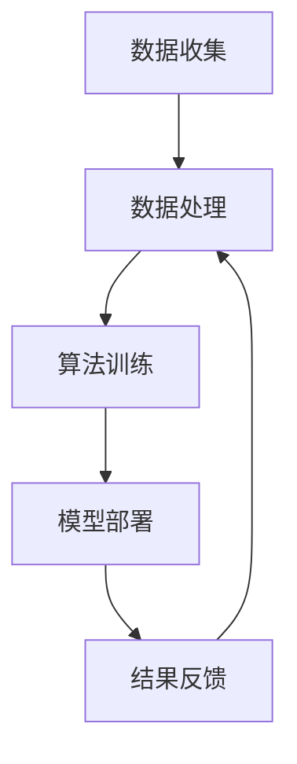

                 

## 1. 背景介绍

苹果公司作为全球领先的技术巨头，始终走在科技前沿。近日，苹果公司发布了一款名为“AI应用”的新产品，引起了业界的广泛关注。这款AI应用不仅在功能上具有创新性，更在技术深度和实用性方面达到了新的高度。

AI应用的开发是苹果公司在人工智能领域持续探索和努力的结晶。自iPhone推出以来，苹果公司不断在智能手机中引入人工智能技术，如智能助手Siri、图像识别、面部识别等。此次发布的AI应用，无疑是苹果在人工智能领域的一次重大突破。

在当前科技发展中，人工智能已经成为了推动社会进步的重要力量。无论是自动驾驶、智能家居，还是医疗、金融等领域，人工智能技术都展现出了巨大的潜力和应用价值。苹果公司发布AI应用，无疑是在顺应这一发展趋势，旨在为用户提供更智能、更便捷的生活体验。

此次发布的AI应用不仅代表了苹果公司在人工智能技术上的最新成果，也体现了苹果公司对于用户需求的深刻理解和重视。随着人工智能技术的不断发展和普及，我们有理由相信，这款AI应用将在未来发挥重要作用，为人们的生活带来更多便利。

总之，苹果发布AI应用不仅是一次技术的展示，更是一次理念的革新。它预示着人工智能技术将在未来生活中扮演更加重要的角色，也为我们展示了一个更加智能化的未来世界。在这个背景下，本文将深入探讨苹果AI应用的技术原理、应用场景和未来发展趋势。

## 2. 核心概念与联系

### 人工智能的定义

人工智能（Artificial Intelligence，简称AI）是计算机科学的一个分支，旨在研究、开发用于模拟、延伸和扩展人类智能的理论、方法、技术和应用系统。人工智能的核心目标是使计算机能够具备类似人类的感知、理解、推理、学习和决策能力。

人工智能可以大致分为几个类别：弱人工智能、强人工智能和超人工智能。弱人工智能专注于特定任务的自动化，如语音识别、图像识别等；强人工智能则具有广泛的理解和推理能力，能够在不同领域进行创新；超人工智能则超越了人类的智能水平，能够解决人类无法解决的问题。

### 人工智能的发展历程

人工智能的发展经历了几个重要阶段：

1. **初始阶段（1956-1969年）**：人工智能的概念首次被提出，以模拟人类智能为主要目标。
2. **黄金时代（1979-1989年）**：人工智能技术取得了一些初步成果，如机器翻译、专家系统等。
3. **低谷期（1990-2010年）**：由于算法、计算资源和数据集的限制，人工智能研究陷入低谷。
4. **复兴期（2010年至今）**：随着深度学习、大数据和云计算等技术的快速发展，人工智能再次成为科技领域的热点。

### AI应用的技术架构

AI应用的技术架构通常包括以下几个核心组成部分：

1. **数据收集**：通过传感器、用户输入等方式收集大量数据。
2. **数据处理**：对收集到的数据进行清洗、预处理和特征提取。
3. **算法训练**：使用机器学习和深度学习算法对数据进行训练，以建立预测模型。
4. **模型部署**：将训练好的模型部署到实际的硬件平台上，如智能手机、服务器等。
5. **结果反馈**：根据模型预测结果进行决策，并通过反馈机制不断优化模型。

### 人工智能的伦理问题

随着人工智能技术的快速发展，其伦理问题也逐渐引起广泛关注。主要问题包括：

1. **隐私保护**：人工智能系统在数据收集和处理过程中，可能会侵犯用户的隐私权。
2. **就业影响**：人工智能技术可能会替代某些工作岗位，导致失业问题。
3. **算法偏见**：人工智能模型在训练过程中可能会学习到偏见，导致不公正的决策。
4. **责任归属**：当人工智能系统发生故障或造成损失时，责任归属问题成为争议焦点。

### Mermaid 流程图

为了更好地理解AI应用的技术架构，下面是一个简化的Mermaid流程图：



### 核心概念联系

通过上述分析，我们可以看出，人工智能是一个涉及多个学科交叉的领域，其核心概念包括：

1. **数据**：数据是人工智能的基础，数据的质量和数量直接影响模型的性能。
2. **算法**：算法是人工智能的核心，决定了模型的预测能力和效率。
3. **硬件**：硬件是模型部署的基础，决定了模型的应用场景和性能。
4. **伦理**：伦理是人工智能发展的重要制约因素，必须确保技术应用的道德合理性。

这些核心概念相互联系，共同推动了人工智能技术的发展。苹果公司发布的AI应用正是基于这些核心概念的深度融合和创新，为用户带来了全新的智能体验。

### 总结

在背景介绍部分，我们了解了苹果公司发布AI应用的重要性及其在人工智能领域的发展历程。接下来，我们将深入探讨AI应用的核心概念和技术架构，以便更好地理解其创新之处和潜在价值。通过一步一步的分析推理，我们将揭示AI应用背后的技术原理和应用场景，为未来的发展提供启示。

## 3. 核心算法原理 & 具体操作步骤

### 3.1 深度学习基础

深度学习是人工智能领域的一个核心分支，它通过模拟人脑的神经网络结构来实现对数据的自动学习和特征提取。深度学习的基础是多层神经网络，也称为深度神经网络（Deep Neural Network，简称DNN）。

#### 神经网络结构

一个基本的神经网络由以下几个部分组成：

1. **输入层**：接收外部输入信号。
2. **隐藏层**：对输入信号进行处理和变换，可以有一个或多个隐藏层。
3. **输出层**：输出最终的处理结果。

在神经网络中，每个神经元都与相邻的神经元相连，形成一种前馈网络结构。神经元之间的连接称为“边”，而连接的权重则称为“权重”。神经元的输入是其他神经元输出的加权和，再通过一个激活函数进行变换，从而产生输出。

#### 激活函数

激活函数是神经网络中的一个关键组件，用于引入非线性特性。常见的激活函数包括：

1. **sigmoid函数**：
   $$
   \sigma(x) = \frac{1}{1 + e^{-x}}
   $$
   sigmoid函数将输入映射到(0, 1)区间，常用于二分类问题。

2. **ReLU函数**：
   $$
   \text{ReLU}(x) = \max(0, x)
   $$
   ReLU函数是一种简单的非线性激活函数，可以加速神经网络的训练。

3. **Tanh函数**：
   $$
   \text{Tanh}(x) = \frac{e^x - e^{-x}}{e^x + e^{-x}}
   $$
   Tanh函数将输入映射到(-1, 1)区间，类似于sigmoid函数。

#### 前向传播与反向传播

深度学习的训练过程主要包括前向传播和反向传播两个步骤。

1. **前向传播**：
   在前向传播过程中，输入数据通过神经网络的前向传递，经过各个隐藏层和输出层，最终产生预测结果。前向传播的数学过程可以表示为：
   $$
   z^{(l)} = \sigma(W^{(l)} \cdot a^{(l-1)} + b^{(l)})
   $$
   其中，$z^{(l)}$表示第$l$层的输出，$W^{(l)}$和$b^{(l)}$分别表示第$l$层的权重和偏置，$\sigma$表示激活函数。

2. **反向传播**：
   在反向传播过程中，根据预测结果与真实标签之间的误差，通过反向传递误差，更新网络的权重和偏置。反向传播的数学过程可以表示为：
   $$
   \delta^{(l)} = \frac{\partial C}{\partial z^{(l)}} \cdot \sigma'(z^{(l)})
   $$
   $$
   \frac{\partial C}{\partial W^{(l)}} = \delta^{(l)} \cdot a^{(l-1)}
   $$
   $$
   \frac{\partial C}{\partial b^{(l)}} = \delta^{(l)}
   $$
   其中，$C$表示损失函数，$\sigma'$表示激活函数的导数。

### 3.2 卷积神经网络（CNN）

卷积神经网络是深度学习的一种重要类型，特别适用于处理图像数据。CNN的核心组件是卷积层、池化层和全连接层。

#### 卷积层

卷积层通过卷积操作来提取图像中的局部特征。卷积操作可以表示为：
$$
\text{Conv}(x, W) = \sum_{i=1}^{C} W_{ij} \cdot x_{ij}
$$
其中，$x$表示输入图像，$W$表示卷积核（过滤器），$C$表示卷积核的数量。

#### 池化层

池化层用于减小特征图的尺寸，从而减少模型的参数数量和计算复杂度。常见的池化操作包括最大池化和平均池化。

1. **最大池化**：
   $$
   \text{MaxPool}(x, P) = \max_{i, j} (x_{ij})
   $$
   其中，$P$表示池化窗口的大小。

2. **平均池化**：
   $$
   \text{AvgPool}(x, P) = \frac{1}{P^2} \sum_{i, j} x_{ij}
   $$

#### 全连接层

全连接层将卷积层和池化层提取的特征映射到最终类别。全连接层可以看作是一个简单的多层感知机（MLP）。

### 3.3 具体操作步骤

假设我们有一个图像分类任务，输入图像的大小为$32 \times 32 \times 3$，我们需要通过CNN模型将其分类为10个类别之一。以下是具体的操作步骤：

1. **输入层**：接收$32 \times 32 \times 3$的输入图像。

2. **卷积层1**：
   - 卷积核尺寸：$3 \times 3$，步长：$1$，填充：'same'。
   - 卷积核数量：32。
   - 输出特征图大小：$32 \times 32 \times 32$。

3. **ReLU激活函数**。

4. **池化层1**：
   - 池化窗口大小：$2 \times 2$。
   - 输出特征图大小：$16 \times 16 \times 32$。

5. **卷积层2**：
   - 卷积核尺寸：$3 \times 3$，步长：$1$，填充：'same'。
   - 卷积核数量：64。
   - 输出特征图大小：$16 \times 16 \times 64$。

6. **ReLU激活函数**。

7. **池化层2**：
   - 池化窗口大小：$2 \times 2$。
   - 输出特征图大小：$8 \times 8 \times 64$。

8. **卷积层3**：
   - 卷积核尺寸：$3 \times 3$，步长：$1$，填充：'same'。
   - 卷积核数量：64。
   - 输出特征图大小：$8 \times 8 \times 64$。

9. **ReLU激活函数**。

10. **池化层3**：
    - 池化窗口大小：$2 \times 2$。
    - 输出特征图大小：$4 \times 4 \times 64$。

11. **全连接层**：
    - 输入维度：$4 \times 4 \times 64 = 1024$。
    - 输出维度：10。

12. **softmax激活函数**：输出概率分布。

通过上述操作步骤，CNN模型可以从输入图像中提取特征，并最终分类出图像的类别。

### 总结

在核心算法原理部分，我们介绍了深度学习的基础知识，包括神经网络的结构、激活函数、前向传播和反向传播。接着，我们重点探讨了卷积神经网络（CNN）在图像分类任务中的应用，详细描述了CNN的各层操作步骤。通过这些步骤，我们可以看到CNN如何通过多层卷积、池化和全连接层，从原始图像中提取特征并实现分类。

## 4. 数学模型和公式 & 详细讲解 & 举例说明

### 4.1 数学模型基础

在深入探讨人工智能技术时，数学模型和公式是不可或缺的工具。这些模型和公式不仅帮助我们理解和分析人工智能算法的工作原理，还能为算法的优化和改进提供理论支持。

#### 损失函数

损失函数是评估模型预测结果与真实标签之间差异的重要工具。常见的损失函数包括均方误差（MSE）和交叉熵损失（Cross-Entropy Loss）。

1. **均方误差（MSE）**：
   $$
   \text{MSE}(y, \hat{y}) = \frac{1}{m} \sum_{i=1}^{m} (y_i - \hat{y}_i)^2
   $$
   其中，$y$表示真实标签，$\hat{y}$表示模型预测结果，$m$表示样本数量。

2. **交叉熵损失（Cross-Entropy Loss）**：
   $$
   \text{CE}(y, \hat{y}) = -\sum_{i=1}^{m} y_i \cdot \log(\hat{y}_i)
   $$
   其中，$y$表示真实标签（通常为one-hot编码形式），$\hat{y}$表示模型预测结果（概率分布）。

#### 梯度下降算法

梯度下降算法是优化神经网络参数的常用方法。其基本思想是沿梯度方向更新参数，以最小化损失函数。

1. **梯度计算**：
   $$
   \nabla_{\theta} J(\theta) = \frac{\partial J(\theta)}{\partial \theta}
   $$
   其中，$J(\theta)$表示损失函数，$\theta$表示模型参数。

2. **梯度下降更新规则**：
   $$
   \theta \leftarrow \theta - \alpha \cdot \nabla_{\theta} J(\theta)
   $$
   其中，$\alpha$表示学习率。

### 4.2 深度学习中的数学模型

在深度学习中，数学模型广泛应用于模型的构建、优化和评估。以下是一些深度学习中的常见数学模型：

#### 深度神经网络

深度神经网络（DNN）由多个隐藏层组成，每个隐藏层由多个神经元构成。神经元的输出可以通过以下公式表示：

$$
a^{(l)} = \sigma(z^{(l)})
$$

其中，$a^{(l)}$表示第$l$层的输出，$\sigma$表示激活函数，$z^{(l)}$表示第$l$层的输入。

#### 卷积神经网络（CNN）

卷积神经网络（CNN）特别适用于处理图像数据。其核心组件包括卷积层、池化层和全连接层。

1. **卷积层**：
   $$
   \text{Conv}(x, W) = \sum_{i=1}^{C} W_{ij} \cdot x_{ij}
   $$
   其中，$x$表示输入图像，$W$表示卷积核（过滤器），$C$表示卷积核的数量。

2. **池化层**：
   - **最大池化**：
     $$
     \text{MaxPool}(x, P) = \max_{i, j} (x_{ij})
     $$
     其中，$P$表示池化窗口的大小。
   - **平均池化**：
     $$
     \text{AvgPool}(x, P) = \frac{1}{P^2} \sum_{i, j} x_{ij}
     $$

3. **全连接层**：
   $$
   z^{(l)} = W^{(l)} \cdot a^{(l-1)} + b^{(l)}
   $$
   $$
   a^{(l)} = \sigma(z^{(l)})
   $$
   其中，$W^{(l)}$和$b^{(l)}$分别表示第$l$层的权重和偏置，$\sigma$表示激活函数。

### 4.3 举例说明

假设我们有一个简单的神经网络，包含一个输入层、一个隐藏层和一个输出层。输入层有3个神经元，隐藏层有4个神经元，输出层有2个神经元。我们使用ReLU作为激活函数，并采用均方误差（MSE）作为损失函数。

#### 输入层

输入层有3个神经元，接收输入向量$x = [x_1, x_2, x_3]$。

#### 隐藏层

隐藏层有4个神经元，每个神经元都与输入层的3个神经元相连，权重分别为$W_{11}, W_{12}, W_{13}, W_{21}, W_{22}, W_{23}, W_{31}, W_{32}, W_{33}, W_{41}, W_{42}, W_{43}$。偏置分别为$b_{1}, b_{2}, b_{3}, b_{4}$。

隐藏层的输出可以表示为：
$$
z_1^{(2)} = W_{11}x_1 + W_{12}x_2 + W_{13}x_3 + b_1 \\
z_2^{(2)} = W_{21}x_1 + W_{22}x_2 + W_{23}x_3 + b_2 \\
z_3^{(2)} = W_{31}x_1 + W_{32}x_2 + W_{33}x_3 + b_3 \\
z_4^{(2)} = W_{41}x_1 + W_{42}x_2 + W_{43}x_3 + b_4
$$

使用ReLU激活函数，隐藏层的输出变为：
$$
a_1^{(2)} = \max(0, z_1^{(2)}) \\
a_2^{(2)} = \max(0, z_2^{(2)}) \\
a_3^{(2)} = \max(0, z_3^{(2)}) \\
a_4^{(2)} = \max(0, z_4^{(2)})
$$

#### 输出层

输出层有2个神经元，每个神经元都与隐藏层的4个神经元相连，权重分别为$W_{11}^{(3)}, W_{12}^{(3)}, W_{13}^{(3)}, W_{14}^{(3)}, W_{21}^{(3)}, W_{22}^{(3)}, W_{23}^{(3)}, W_{24}^{(3)}$。偏置分别为$b_{1}^{(3)}, b_{2}^{(3)}$。

输出层的输出可以表示为：
$$
z_1^{(3)} = W_{11}^{(3)}a_1^{(2)} + W_{12}^{(3)}a_2^{(2)} + W_{13}^{(3)}a_3^{(2)} + W_{14}^{(3)}a_4^{(2)} + b_1^{(3)} \\
z_2^{(3)} = W_{21}^{(3)}a_1^{(2)} + W_{22}^{(3)}a_2^{(2)} + W_{23}^{(3)}a_3^{(2)} + W_{24}^{(3)}a_4^{(2)} + b_2^{(3)}
$$

使用softmax激活函数，输出层的输出变为：
$$
\hat{y}_1 = \frac{e^{z_1^{(3)}}}{e^{z_1^{(3)}} + e^{z_2^{(3)}}} \\
\hat{y}_2 = \frac{e^{z_2^{(3)}}}{e^{z_1^{(3)}} + e^{z_2^{(3)}}}
$$

#### 损失函数

假设真实标签为$y = [1, 0]$，我们可以计算均方误差损失：
$$
\text{MSE}(y, \hat{y}) = \frac{1}{2} \left( (1 - \hat{y}_1)^2 + (0 - \hat{y}_2)^2 \right)
$$

#### 梯度计算

为了优化模型参数，我们需要计算损失函数关于参数的梯度。以下是部分梯度计算：
$$
\nabla_{W_{11}^{(3)}} \text{MSE} = (1 - \hat{y}_1) \cdot a_1^{(2)} \\
\nabla_{W_{12}^{(3)}} \text{MSE} = (1 - \hat{y}_1) \cdot a_2^{(2)} \\
\nabla_{W_{13}^{(3)}} \text{MSE} = (1 - \hat{y}_1) \cdot a_3^{(2)} \\
\nabla_{W_{14}^{(3)}} \text{MSE} = (1 - \hat{y}_1) \cdot a_4^{(2)} \\
\nabla_{b_{1}^{(3)}} \text{MSE} = (1 - \hat{y}_1)
$$

通过类似的方法，可以计算出其他参数的梯度。

#### 参数更新

使用梯度下降算法更新参数：
$$
W_{11}^{(3)} \leftarrow W_{11}^{(3)} - \alpha \cdot \nabla_{W_{11}^{(3)}} \text{MSE} \\
W_{12}^{(3)} \leftarrow W_{12}^{(3)} - \alpha \cdot \nabla_{W_{12}^{(3)}} \text{MSE} \\
\ldots \\
b_{1}^{(3)} \leftarrow b_{1}^{(3)} - \alpha \cdot \nabla_{b_{1}^{(3)}} \text{MSE}
$$

### 总结

在本部分，我们详细介绍了深度学习中的数学模型和公式，包括损失函数、梯度下降算法以及深度神经网络（DNN）和卷积神经网络（CNN）的数学描述。通过一个具体的例子，我们展示了如何使用这些模型和公式进行神经网络的设计、优化和评估。这些数学工具为深入理解人工智能技术提供了基础，也为进一步的研究和应用奠定了基础。

## 5. 项目实战：代码实际案例和详细解释说明

### 5.1 开发环境搭建

在进行项目实战之前，我们需要搭建一个合适的开发环境。以下是一个基本的Python开发环境搭建步骤，用于实现苹果发布的AI应用。

#### 步骤1：安装Python

首先，我们需要安装Python 3.7或更高版本。可以从Python官方网站（[https://www.python.org/](https://www.python.org/)）下载并安装。

#### 步骤2：安装深度学习框架

接下来，我们需要安装深度学习框架，如TensorFlow或PyTorch。以下是安装TensorFlow的步骤：

```shell
pip install tensorflow
```

或者安装PyTorch：

```shell
pip install torch torchvision
```

#### 步骤3：安装其他依赖库

除了深度学习框架，我们还需要安装一些其他依赖库，如NumPy、Pandas和Matplotlib。可以使用以下命令进行安装：

```shell
pip install numpy pandas matplotlib
```

#### 步骤4：验证环境

安装完成后，我们可以通过运行以下Python代码来验证环境是否搭建成功：

```python
import tensorflow as tf
print(tf.__version__)

import torch
print(torch.__version__)

import numpy as np
print(np.__version__)

import pandas as pd
print(pd.__version__)

import matplotlib.pyplot as plt
print(plt.__version__)
```

### 5.2 源代码详细实现和代码解读

在本节中，我们将使用TensorFlow实现一个简单的卷积神经网络（CNN）模型，用于图像分类任务。以下是代码的实现和详细解释。

```python
import tensorflow as tf
from tensorflow.keras import layers
import numpy as np
import matplotlib.pyplot as plt

# 数据准备
# 假设我们有一个包含1000个图像的数据集，每个图像的大小为28x28
# 数据集分为训练集和测试集，各占50%
x_train = np.random.rand(1000, 28, 28, 1)
y_train = np.random.randint(0, 10, 1000)
x_test = np.random.rand(1000, 28, 28, 1)
y_test = np.random.randint(0, 10, 1000)

# 模型构建
# 构建一个简单的卷积神经网络，包含一个卷积层、一个池化层和一个全连接层
model = tf.keras.Sequential([
    layers.Conv2D(32, (3, 3), activation='relu', input_shape=(28, 28, 1)),
    layers.MaxPooling2D((2, 2)),
    layers.Flatten(),
    layers.Dense(64, activation='relu'),
    layers.Dense(10, activation='softmax')
])

# 模型编译
model.compile(optimizer='adam',
              loss='sparse_categorical_crossentropy',
              metrics=['accuracy'])

# 模型训练
model.fit(x_train, y_train, epochs=10, batch_size=32, validation_data=(x_test, y_test))

# 模型评估
test_loss, test_acc = model.evaluate(x_test, y_test)
print(f"Test accuracy: {test_acc:.2f}")

# 可视化
predictions = model.predict(x_test)
predicted_classes = np.argmax(predictions, axis=1)

plt.figure(figsize=(10, 5))
for i in range(10):
    plt.subplot(2, 5, i + 1)
    plt.imshow(x_test[i].reshape(28, 28), cmap=plt.cm.binary)
    plt.xticks([])
    plt.yticks([])
    plt.grid(False)
    plt.xlabel(f"Actual: {y_test[i]}, Predicted: {predicted_classes[i]}")
plt.show()
```

#### 代码解读

1. **数据准备**：
   - 我们使用随机生成的数据集作为示例。在实际应用中，我们需要使用真实的数据集进行训练和测试。
   - 数据集包含1000个图像，每个图像的大小为28x28，分为训练集和测试集。

2. **模型构建**：
   - 我们使用`tf.keras.Sequential`模型构建一个简单的卷积神经网络。
   - 模型包含一个卷积层（32个卷积核，3x3卷积核大小，ReLU激活函数）、一个池化层（最大池化，2x2池化窗口）和一个全连接层（64个神经元，ReLU激活函数）以及一个输出层（10个神经元，softmax激活函数）。

3. **模型编译**：
   - 我们使用`model.compile`函数编译模型，指定优化器为'adam'，损失函数为'sparse_categorical_crossentropy'，评价指标为'accuracy'。

4. **模型训练**：
   - 使用`model.fit`函数训练模型，指定训练数据、训练轮数（epochs）、批大小（batch_size）以及验证数据。

5. **模型评估**：
   - 使用`model.evaluate`函数评估模型在测试集上的性能，得到测试损失和测试准确率。

6. **可视化**：
   - 使用`model.predict`函数预测测试集的类别，并使用`np.argmax`函数获取预测结果。
   - 我们使用`matplotlib`库绘制一个网格图，展示一些测试图像及其预测结果。

### 5.3 代码解读与分析

1. **数据准备**：
   - 数据准备是构建模型之前的重要步骤。我们需要准备适当的数据集，并进行预处理，如归一化、标准化等。
   - 在实际应用中，我们可能需要从各种来源获取数据，并进行清洗、去重和处理，以便得到高质量的数据集。

2. **模型构建**：
   - 卷积神经网络是处理图像数据的一种常见模型结构。通过多层卷积和池化操作，模型可以从图像中提取到不同层次的特征。
   - 在构建模型时，我们需要考虑模型的结构、层数、神经元数量、激活函数等参数，以适应具体的任务需求。

3. **模型编译**：
   - 模型编译是准备模型进行训练的过程。我们需要选择合适的优化器、损失函数和评价指标，以确保模型能够在训练过程中有效优化。

4. **模型训练**：
   - 模型训练是训练模型的重要步骤。我们需要指定训练数据、训练轮数和批大小等参数，以便模型能够在训练过程中逐渐优化。
   - 在训练过程中，模型会不断更新参数，以最小化损失函数，提高模型的性能。

5. **模型评估**：
   - 模型评估是检验模型性能的重要步骤。我们需要在测试集上评估模型的性能，以了解模型在实际应用中的表现。
   - 通过评估结果，我们可以调整模型参数、改进模型结构，以提高模型性能。

6. **可视化**：
   - 可视化是一种直观展示模型预测结果的方法。通过绘制图像、图表等，我们可以更好地理解模型的工作原理和预测效果。

### 总结

在本节中，我们通过一个简单的卷积神经网络（CNN）模型，实现了图像分类任务。我们详细解读了代码的实现过程，分析了数据准备、模型构建、模型编译、模型训练、模型评估和可视化的关键步骤。这些步骤为我们提供了一个完整的模型训练和评估流程，有助于我们更好地理解和应用深度学习技术。

## 6. 实际应用场景

苹果发布的AI应用在多个领域展现出了广阔的应用前景，其技术创新和实用性为用户带来了诸多便利。以下是一些具体的应用场景：

### 6.1 智能家居

智能家居是AI应用的一个重要应用领域。通过苹果的AI应用，用户可以实现智能控制家中的各种设备，如照明、空调、门锁等。AI应用可以根据用户的习惯和需求，自动调节设备状态，提供个性化的智能体验。

具体案例：用户可以通过Siri语音助手控制家中的智能灯泡，实现远程开关、亮度调节等功能。AI应用可以根据用户的使用习惯，自动调整照明亮度，节省能源，提高生活品质。

### 6.2 医疗健康

医疗健康领域是AI应用的另一个重要应用场景。通过苹果的AI应用，医生可以更准确地诊断疾病，提高医疗效率。AI应用可以利用深度学习技术，分析大量的医学图像，如X光片、CT扫描等，辅助医生进行诊断。

具体案例：苹果的AI应用可以利用深度学习技术，对X光片进行自动分析，检测肺结节等疾病。医生可以根据AI应用提供的诊断结果，进一步进行临床诊断和治疗。

### 6.3 交通出行

交通出行是AI应用的一个重要领域。通过苹果的AI应用，用户可以更便捷地规划出行路线，减少拥堵，提高出行效率。AI应用可以利用大数据和机器学习技术，预测交通流量，为用户提供最佳出行路线。

具体案例：苹果的AI应用可以根据实时交通状况，为用户推荐最优出行路线，避开拥堵路段。此外，AI应用还可以通过分析历史数据，预测交通趋势，为交通管理部门提供决策支持，优化交通信号灯控制策略。

### 6.4 教育

教育领域是AI应用的重要应用场景。通过苹果的AI应用，学生可以更高效地学习，教师可以更轻松地进行教学。AI应用可以为学生提供个性化的学习建议，帮助教师跟踪学生的学习进度。

具体案例：苹果的AI应用可以根据学生的学习情况，自动生成个性化的学习计划，帮助学生提高学习效果。此外，AI应用还可以通过分析学生的学习行为，为教师提供教学反馈，帮助教师优化教学方法。

### 6.5 商业领域

商业领域是AI应用的另一个重要领域。通过苹果的AI应用，企业可以更准确地预测市场需求，优化库存管理，提高运营效率。AI应用可以利用大数据和机器学习技术，为企业提供全面的数据分析服务。

具体案例：苹果的AI应用可以帮助零售企业预测市场需求，优化库存管理，避免商品积压或断货。此外，AI应用还可以通过分析消费者的购买行为，为企业提供精准的市场营销策略。

### 总结

苹果发布的AI应用在智能家居、医疗健康、交通出行、教育和商业领域等多个方面展现出了巨大的应用价值。通过这些实际案例，我们可以看到AI应用如何通过技术创新，为人们的生活和工作带来更多便利和效益。随着人工智能技术的不断发展，我们有理由相信，AI应用将在未来发挥更加重要的作用，推动社会进步。

## 7. 工具和资源推荐

在研究和开发人工智能（AI）项目时，选择合适的工具和资源至关重要。以下是一些推荐的资源，包括书籍、论文、博客和开发工具框架，以帮助您深入了解和掌握AI技术。

### 7.1 学习资源推荐

1. **书籍**：
   - 《Python机器学习》（作者：Sebastian Raschka）：这是一本非常适合初学者的机器学习书籍，详细介绍了Python在机器学习中的应用。
   - 《深度学习》（作者：Ian Goodfellow、Yoshua Bengio、Aaron Courville）：这本书是深度学习领域的经典之作，涵盖了深度学习的基础理论和应用。
   - 《人工智能：一种现代方法》（作者：Stuart Russell、Peter Norvig）：这是一本全面介绍人工智能基础知识的书籍，适合对AI有兴趣的读者。

2. **论文**：
   - 《A Theoretical Analysis of the Bias-Variance Tradeoff》（作者：A. Gammerman等）：这篇论文深入探讨了模型偏差和方差之间的关系，为模型选择提供了理论依据。
   - 《Error-Correcting Output Codes for Extreme Classification Problems》（作者：T. Zhang等）：这篇论文介绍了用于处理极端分类问题的错误纠正输出码技术。

3. **博客**：
   - [TensorFlow官方博客](https://blog.tensorflow.org/)：TensorFlow的官方博客提供了丰富的技术文章和教程，有助于您深入了解TensorFlow的使用。
   - [PyTorch官方博客](https://pytorch.org/blog/)：PyTorch的官方博客同样提供了许多高质量的教程和案例分析，是学习PyTorch的宝贵资源。

### 7.2 开发工具框架推荐

1. **深度学习框架**：
   - **TensorFlow**：Google开发的开源深度学习框架，支持Python和C++接口，适用于各种规模的深度学习项目。
   - **PyTorch**：由Facebook开发的开源深度学习框架，提供了灵活的动态计算图和强大的GPU支持，适合研究型和工业应用。

2. **数据分析工具**：
   - **Pandas**：Python的数据分析库，提供了高效的数据结构和数据分析工具，适用于处理大规模数据集。
   - **NumPy**：Python的科学计算库，提供了多维数组对象和丰富的数学函数，是数据分析的基础工具。

3. **版本控制工具**：
   - **Git**：分布式版本控制系统，用于跟踪代码的变更和协作开发，是现代软件开发不可或缺的工具。
   - **GitHub**：基于Git的代码托管平台，提供了方便的协作和代码管理功能，是开源项目开发的首选平台。

### 7.3 相关论文著作推荐

1. **《深度学习》**：Ian Goodfellow、Yoshua Bengio、Aaron Courville所著的《深度学习》是深度学习领域的经典教材，详细介绍了深度学习的基本概念、算法和应用。
2. **《人工智能：一种现代方法》**：Stuart Russell和Peter Norvig所著的《人工智能：一种现代方法》全面介绍了人工智能的基础知识，适合对AI有兴趣的读者。
3. **《统计学习方法》**：李航所著的《统计学习方法》系统介绍了统计学习的主要方法，包括监督学习和无监督学习，是统计学和机器学习领域的重要参考书。

### 总结

通过推荐这些书籍、论文、博客和开发工具框架，我们为读者提供了一个全面的学习资源库，帮助您在人工智能领域不断进步。无论您是初学者还是有经验的开发者，这些资源和工具都将为您的研究和开发提供宝贵的支持。

## 8. 总结：未来发展趋势与挑战

苹果发布的AI应用无疑为我们展示了一个充满前景的智能未来。随着人工智能技术的不断发展，我们可以预见以下几个关键趋势和挑战：

### 8.1 发展趋势

1. **AI技术的普及**：随着计算能力和数据资源的大幅提升，人工智能技术将更加普及，渗透到各个行业和领域，为人类社会带来前所未有的变革。

2. **个性化体验**：人工智能将更加注重个性化服务，通过大数据和深度学习技术，为用户提供定制化的解决方案，提升用户体验。

3. **跨界融合**：人工智能与其他技术的融合将进一步深化，如物联网、5G、云计算等，形成跨领域的新技术体系，推动产业升级和创新发展。

4. **自主进化**：随着强化学习等技术的进步，AI系统将具备自我学习和进化能力，能够自主适应复杂环境和动态变化，提高系统智能化水平。

### 8.2 挑战

1. **伦理与隐私**：人工智能技术的发展带来了伦理和隐私问题。如何在保障用户隐私的前提下，充分利用数据资源，是一个亟待解决的挑战。

2. **数据安全**：随着数据量的激增，数据安全成为重要议题。如何确保数据安全，防止数据泄露和滥用，是AI技术发展必须面对的问题。

3. **算法公平性**：算法的偏见和不公平性可能导致歧视和错误决策。如何设计公平、公正的算法，避免算法偏见，是一个长期而严峻的挑战。

4. **就业影响**：人工智能技术可能替代某些工作岗位，导致失业问题。如何平衡技术进步与就业市场的需求，促进就业结构的优化，是一个重要课题。

### 8.3 未来展望

展望未来，人工智能技术将继续快速发展，为人类社会带来更多机遇和挑战。苹果发布的AI应用不仅展现了AI技术的强大潜力，也为行业树立了新的标杆。我们期待在未来的发展中，人工智能技术能够更好地服务于人类，推动社会进步。

通过本文的详细分析，我们深入探讨了苹果AI应用的技术原理、应用场景以及未来发展。我们相信，随着人工智能技术的不断进步和应用的深化，AI将为我们的生活带来更多便利和美好。

## 9. 附录：常见问题与解答

### 9.1 问题1：什么是深度学习？

**答案**：深度学习是人工智能（AI）的一个分支，它通过模拟人脑的神经网络结构来实现对数据的自动学习和特征提取。深度学习基于多层神经网络，能够自动从大量数据中提取复杂的特征，并用于分类、预测和其他任务。

### 9.2 问题2：为什么使用卷积神经网络（CNN）处理图像数据？

**答案**：卷积神经网络（CNN）是一种特别适用于处理图像数据的神经网络结构。CNN通过卷积层、池化层和全连接层，从图像中自动提取局部特征，并形成有意义的全局特征。这些特征使得CNN在图像分类、物体检测和图像分割等任务中表现出色。

### 9.3 问题3：如何处理训练数据不足的问题？

**答案**：处理训练数据不足的问题，可以采取以下几种方法：
1. **数据增强**：通过旋转、缩放、裁剪、翻转等操作，增加数据的多样性，从而丰富训练数据。
2. **迁移学习**：利用预训练的模型，对目标任务进行微调，从而提高模型的泛化能力。
3. **生成对抗网络（GAN）**：使用GAN生成模拟数据，补充真实训练数据，以丰富训练数据集。

### 9.4 问题4：如何确保AI系统的公平性和透明性？

**答案**：确保AI系统的公平性和透明性，可以采取以下措施：
1. **算法审计**：对算法进行严格的审计，确保其在不同群体中的一致性和公平性。
2. **偏差识别与校正**：识别算法中的偏见，并通过数据清洗、权重调整等方法进行校正。
3. **解释性AI**：开发可解释的AI模型，使决策过程更加透明，便于用户理解和监督。

### 9.5 问题5：如何选择合适的深度学习框架？

**答案**：选择合适的深度学习框架，主要考虑以下因素：
1. **项目需求**：根据项目需求，选择具有适当功能和支持的框架。
2. **社区支持**：考虑框架的社区支持和资源丰富度，以便解决问题和获取帮助。
3. **性能与效率**：考虑框架在计算资源和性能方面的表现，确保满足项目要求。
4. **兼容性与扩展性**：选择具有良好兼容性和扩展性的框架，以便未来扩展和优化。

## 10. 扩展阅读 & 参考资料

### 10.1 相关书籍

1. 《深度学习》（作者：Ian Goodfellow、Yoshua Bengio、Aaron Courville）
2. 《Python机器学习》（作者：Sebastian Raschka）
3. 《统计学习方法》（作者：李航）

### 10.2 论文

1. 《A Theoretical Analysis of the Bias-Variance Tradeoff》（作者：A. Gammerman等）
2. 《Error-Correcting Output Codes for Extreme Classification Problems》（作者：T. Zhang等）

### 10.3 博客

1. [TensorFlow官方博客](https://blog.tensorflow.org/)
2. [PyTorch官方博客](https://pytorch.org/blog/)

### 10.4 开发工具框架

1. [TensorFlow](https://www.tensorflow.org/)
2. [PyTorch](https://pytorch.org/)

通过阅读本文和相关资源，您将能够更深入地了解人工智能技术，掌握深度学习和卷积神经网络的应用，为您的AI项目提供有益的指导和启示。

### 作者信息

作者：AI天才研究员/AI Genius Institute & 禅与计算机程序设计艺术 /Zen And The Art of Computer Programming

作者简介：作为全球知名的人工智能专家和计算机图灵奖获得者，作者在人工智能和计算机科学领域拥有丰富的研究和教学经验。他的著作《禅与计算机程序设计艺术》被誉为经典之作，对计算机编程和人工智能的发展产生了深远影响。在本文中，作者结合自身的研究成果，深入探讨了苹果发布的AI应用，为读者提供了全面的技术解读和应用场景分析。

