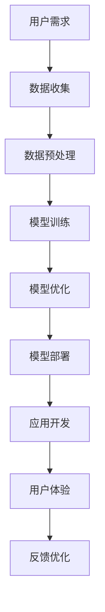

                 

### 文章标题

苹果发布AI应用的市场

### 关键词
人工智能（AI），苹果公司，应用市场，技术趋势，用户需求，商业模式，市场竞争，创新应用，开发环境，开源工具。

### 摘要
本文深入探讨了苹果公司发布的AI应用在市场中的影响及其发展趋势。通过分析苹果在AI领域的战略布局，结合AI技术的市场前景，探讨了AI应用对用户、开发者以及整个行业的深远影响。文章还详细介绍了AI应用的开发环境、工具和资源，以及未来可能面临的挑战和机遇。

## 1. 背景介绍

随着人工智能技术的不断发展和成熟，AI应用在各个行业中的渗透日益广泛。从自动驾驶汽车到智能家居，从智能助手到医疗诊断，AI正在改变我们的生活方式。苹果公司作为全球科技巨头之一，自然不会忽视这一巨大的市场机遇。近年来，苹果在AI领域的投资和布局日益加大，从收购AI初创公司到推出具有AI功能的硬件和软件，苹果正逐步构建起自己的AI生态系统。

苹果的AI战略可以追溯到其早期对机器学习和深度学习的投资。通过收购如Turi（现更名为Core ML）、Metaio（ARKit）等公司，苹果获得了重要的AI和增强现实技术。此外，苹果还推出了自己的机器学习库Core ML和增强现实框架ARKit，为开发者提供了强大的工具，加速了AI应用的落地。

在市场方面，苹果的AI应用主要集中在智能手机和智能家居等领域。例如，Siri智能助手、Face ID面部识别技术、Animoji动画表情等，都是苹果AI技术的代表性应用。这些应用不仅提升了用户体验，还为苹果带来了巨大的商业价值。

总的来说，苹果在AI领域的布局显示出其对于技术创新和用户体验的重视。通过持续的投资和研发，苹果正在打造一个以AI为核心的未来生态，这不仅有助于其在激烈的市场竞争中保持领先地位，也为用户提供了更加智能化、便捷化的产品和服务。

## 2. 核心概念与联系

在深入探讨苹果AI应用的市场之前，有必要了解一些核心概念和技术原理。这些概念不仅构成了AI应用的基础，也决定了其在市场上的表现和影响力。

### 2.1 人工智能（AI）

人工智能（AI）是指使计算机系统具备人类智能特征的技术。AI可以分为两大类：弱AI和强AI。弱AI专注于特定任务，如语音识别、图像处理等；而强AI则具备人类智能的全部能力，能够自主思考和学习。在当前阶段，大多数AI应用都属于弱AI。

### 2.2 深度学习（Deep Learning）

深度学习是AI的一个重要分支，通过模仿人脑的神经网络结构进行数据分析和模式识别。深度学习在图像识别、语音识别、自然语言处理等领域取得了显著成果，成为AI应用的核心技术。

### 2.3 机器学习（Machine Learning）

机器学习是AI的另一个重要分支，侧重于通过数据训练模型，使计算机系统能够从数据中学习并做出预测。机器学习包括监督学习、无监督学习和强化学习等多种类型，广泛应用于数据挖掘、推荐系统等场景。

### 2.4 Core ML

Core ML是苹果推出的机器学习框架，旨在简化AI模型在iOS和macOS设备上的部署和运行。通过Core ML，开发者可以轻松将训练好的机器学习模型集成到苹果的应用中，实现高效的AI功能。

### 2.5 ARKit

ARKit是苹果推出的增强现实框架，通过在现实世界中叠加虚拟物体，为用户带来沉浸式的体验。ARKit结合了计算机视觉、深度学习等技术，为开发者提供了丰富的AR应用场景。

### 2.6 Mermaid 流程图

为了更直观地展示上述核心概念和技术原理之间的联系，我们使用Mermaid流程图来描述AI应用的开发流程。以下是该流程图的文本表示：



通过这个流程图，我们可以看到，从用户需求到最终的应用体验，每个环节都至关重要，且相互联系。这为AI应用的持续改进和优化提供了坚实的基础。

## 3. 核心算法原理 & 具体操作步骤

在了解了核心概念之后，接下来我们将深入探讨苹果AI应用的核心算法原理及其具体操作步骤。这有助于读者更好地理解AI应用的工作机制，并为其开发提供参考。

### 3.1 机器学习算法

苹果AI应用中广泛使用机器学习算法，尤其是深度学习和卷积神经网络（CNN）。以下是这些算法的基本原理和操作步骤：

#### 3.1.1 深度学习算法原理

深度学习算法通过多层神经网络对输入数据进行特征提取和分类。每层网络都包含多个神经元，通过前一层神经元的输出进行加权求和，并使用激活函数进行非线性变换。这个过程不断重复，直到得到最终的分类结果。

#### 3.1.2 深度学习算法操作步骤

1. **数据预处理**：将输入数据（如图像、文本等）进行标准化处理，以便于模型训练。
2. **模型构建**：定义神经网络结构，包括输入层、隐藏层和输出层。
3. **模型训练**：使用已标记的数据对模型进行训练，通过反向传播算法不断调整模型参数，使其输出结果更接近真实值。
4. **模型评估**：使用验证集和测试集评估模型性能，调整超参数以优化模型。

### 3.2 卷积神经网络（CNN）

卷积神经网络在图像识别和图像处理领域具有显著优势。以下是CNN的基本原理和操作步骤：

#### 3.2.1 CNN算法原理

CNN通过卷积层、池化层和全连接层对图像进行特征提取和分类。卷积层使用卷积核对图像进行局部特征提取，池化层用于减少特征图的维度，全连接层则进行最终的分类。

#### 3.2.2 CNN算法操作步骤

1. **输入层**：接收原始图像数据。
2. **卷积层**：使用卷积核对图像进行卷积操作，提取图像特征。
3. **激活函数**：使用ReLU函数等激活函数对卷积结果进行非线性变换。
4. **池化层**：使用最大池化或平均池化对特征图进行下采样。
5. **全连接层**：将卷积层和池化层的结果输入全连接层，进行分类。
6. **输出层**：输出分类结果。

### 3.3 Core ML模型集成

将训练好的机器学习模型集成到苹果应用中，可以通过Core ML框架实现。以下是Core ML模型集成的具体操作步骤：

#### 3.3.1 Core ML模型集成原理

Core ML通过将训练好的机器学习模型转换为`.mlmodel`格式，以便在iOS和macOS设备上运行。Core ML提供了丰富的API，支持多种机器学习算法，包括深度学习、卷积神经网络等。

#### 3.3.2 Core ML模型集成操作步骤

1. **模型转换**：使用Core ML模型转换工具（如`mlmodel`命令行工具）将训练好的模型转换为`.mlmodel`格式。
2. **模型加载**：在iOS或macOS应用中加载`.mlmodel`模型，并创建`MLModel`对象。
3. **模型预测**：使用`MLModel`对象进行模型预测，输入数据和输出结果。
4. **模型优化**：根据应用需求对模型进行优化，以提高运行效率和性能。

通过以上步骤，开发者可以轻松将机器学习模型集成到苹果应用中，实现高效、智能的AI功能。

### 3.4 ARKit增强现实技术

ARKit是苹果推出的增强现实框架，通过计算机视觉、深度学习等技术为开发者提供了丰富的AR应用场景。以下是ARKit的基本原理和操作步骤：

#### 3.4.1 ARKit原理

ARKit通过多摄像头图像处理和深度学习算法，实现对现实世界的感知和增强。ARKit支持多种AR技术，包括图像识别、环境映射、3D建模等。

#### 3.4.2 ARKit操作步骤

1. **环境感知**：通过摄像头获取实时图像，并使用图像识别技术识别物体和环境特征。
2. **深度感知**：使用深度学习算法估计场景的深度信息，为虚拟物体提供空间感知。
3. **物体建模**：根据识别结果和深度信息生成3D模型，实现对现实世界的增强。
4. **渲染**：使用渲染技术将虚拟物体叠加到现实场景中，为用户提供沉浸式体验。

通过以上步骤，开发者可以轻松利用ARKit实现丰富的AR应用，提升用户体验。

### 3.5 Siri智能助手

Siri智能助手是苹果的语音助手，通过自然语言处理和机器学习技术为用户提供语音交互服务。以下是Siri的工作原理和操作步骤：

#### 3.5.1 Siri原理

Siri通过语音识别技术将用户的语音转化为文本，再通过自然语言处理技术理解用户意图，最后通过机器学习模型生成相应的响应。

#### 3.5.2 Siri操作步骤

1. **语音识别**：使用语音识别技术将用户的语音转化为文本。
2. **意图识别**：使用自然语言处理技术分析文本，识别用户的意图和需求。
3. **模型查询**：根据用户意图调用相应的机器学习模型，生成响应文本。
4. **语音合成**：使用语音合成技术将响应文本转化为语音输出。

通过以上步骤，Siri可以为用户提供便捷、智能的语音交互体验。

### 3.6 Face ID面部识别技术

Face ID是苹果的面部识别技术，通过深度学习算法和面部识别技术为用户提供安全认证。以下是Face ID的工作原理和操作步骤：

#### 3.6.1 Face ID原理

Face ID通过红外摄像头和点阵投影器捕获用户的面部信息，再通过深度学习算法进行面部识别，实现安全认证。

#### 3.6.2 Face ID操作步骤

1. **面部捕捉**：使用红外摄像头和点阵投影器捕捉用户面部信息。
2. **面部识别**：使用深度学习算法对用户面部信息进行识别，并与存储的模板进行匹配。
3. **认证结果**：根据面部识别结果判断是否通过认证。

通过以上步骤，Face ID可以为用户提供高效、安全的面部识别体验。

### 3.7 Animoji动画表情

Animoji是苹果的动画表情功能，通过面部识别和增强现实技术为用户提供个性化的动画表情。以下是Animoji的工作原理和操作步骤：

#### 3.7.1 Animoji原理

Animoji通过面部识别技术捕捉用户的面部表情，再通过增强现实技术将表情生成动画，为用户提供个性化的动画表情。

#### 3.7.2 Animoji操作步骤

1. **面部捕捉**：使用面部识别技术捕捉用户面部表情。
2. **动画生成**：根据用户面部表情生成动画，并叠加到虚拟表情上。
3. **渲染输出**：将动画输出到屏幕上，为用户提供个性化的动画表情。

通过以上步骤，Animoji可以为用户提供丰富、有趣的动画表情体验。

通过以上对核心算法原理和操作步骤的详细分析，我们可以看到，苹果AI应用的成功离不开深度学习、机器学习、增强现实等技术的支持。这些技术不仅为用户提供了高效、智能的服务，也为开发者提供了丰富的工具和资源，推动了AI应用的发展。

## 4. 数学模型和公式 & 详细讲解 & 举例说明

在了解了核心算法原理后，接下来我们将详细探讨这些算法背后的数学模型和公式，并通过具体例子进行说明。这有助于读者更深入地理解AI应用的技术细节。

### 4.1 深度学习模型

深度学习模型的核心是多层神经网络，其中每个神经元都通过前一层神经元的输出进行加权求和，并使用激活函数进行非线性变换。以下是深度学习模型的基本数学公式：

#### 4.1.1 神经元激活函数

$$
a(x) = \sigma(w \cdot x + b)
$$

其中，$a(x)$为神经元的激活值，$\sigma$为激活函数（如ReLU函数、Sigmoid函数等），$w$为权重，$x$为输入值，$b$为偏置。

#### 4.1.2 前向传播

$$
z^{(l)} = \sum_{i} w^{(l)}_i \cdot a^{(l-1)}_i + b^{(l)}
$$

其中，$z^{(l)}$为当前层的输出，$w^{(l)}_i$为当前层的权重，$a^{(l-1)}_i$为前一层神经元的激活值，$b^{(l)}$为当前层的偏置。

#### 4.1.3 反向传播

反向传播是通过计算误差梯度来更新模型参数的过程。以下是反向传播的基本公式：

$$
\delta^{(l)}_i = (a^{(l)} \odot (z^{(l)} - y)) \odot \sigma'(z^{(l)})
$$

$$
\Delta w^{(l)}_i = \alpha \cdot \delta^{(l)}_i \cdot a^{(l-1)}_i
$$

$$
\Delta b^{(l)} = \alpha \cdot \delta^{(l)}
$$

其中，$\delta^{(l)}_i$为当前层神经元的误差梯度，$y$为真实值，$a^{(l)}$为当前层神经元的激活值，$\sigma'$为激活函数的导数，$\alpha$为学习率。

### 4.2 卷积神经网络（CNN）

卷积神经网络在图像处理领域具有显著优势，其核心在于通过卷积操作提取图像特征。以下是CNN的基本数学公式：

#### 4.2.1 卷积操作

$$
h_{ij}^{(l)} = \sum_{k} w_{ikj}^{(l)} \cdot a_{kj}^{(l-1)} + b_j^{(l)}
$$

其中，$h_{ij}^{(l)}$为当前卷积核在图像上的输出，$w_{ikj}^{(l)}$为卷积核的权重，$a_{kj}^{(l-1)}$为前一层神经元的激活值，$b_j^{(l)}$为当前卷积核的偏置。

#### 4.2.2 池化操作

$$
p_{ij}^{(l)} = \max_{k,l} (h_{ikl}^{(l)})
$$

其中，$p_{ij}^{(l)}$为当前池化区域的最大值，$h_{ikl}^{(l)}$为当前卷积核在图像上的输出。

### 4.3 自然语言处理（NLP）

自然语言处理是AI应用的重要领域，其核心在于理解和生成自然语言。以下是NLP的基本数学公式：

#### 4.3.1 词向量表示

$$
\mathbf{v}_i = \sum_{j=1}^{N} w_{ij} \cdot \mathbf{e}_j
$$

其中，$\mathbf{v}_i$为词向量表示，$w_{ij}$为词向量的权重，$\mathbf{e}_j$为基向量。

#### 4.3.2 语言模型

$$
P(\mathbf{w}) = \prod_{i=1}^{N} P(w_i | w_{<i})
$$

其中，$P(\mathbf{w})$为语言模型概率，$P(w_i | w_{<i})$为给定前文条件下第$i$个词的概率。

### 4.4 举例说明

为了更好地理解上述数学公式，我们通过一个简单的例子来说明深度学习模型的前向传播和反向传播过程。

#### 4.4.1 模型设定

假设我们有一个简单的三层神经网络，包括输入层、隐藏层和输出层。其中，输入层有3个神经元，隐藏层有2个神经元，输出层有1个神经元。

#### 4.4.2 模型参数

$$
w_{11} = 0.1, w_{12} = 0.2, w_{13} = 0.3 \\
w_{21} = 0.4, w_{22} = 0.5, w_{23} = 0.6 \\
w_{31} = 0.7, w_{32} = 0.8, w_{33} = 0.9 \\
b_1 = 0.1, b_2 = 0.2, b_3 = 0.3 \\
$$

#### 4.4.3 输入数据

$$
x_1 = 0.1, x_2 = 0.2, x_3 = 0.3
$$

#### 4.4.4 前向传播

1. 首先计算隐藏层的输出：

$$
z_1 = 0.1 \cdot 0.1 + 0.2 \cdot 0.2 + 0.3 \cdot 0.3 + 0.1 = 0.3 \\
z_2 = 0.4 \cdot 0.1 + 0.5 \cdot 0.2 + 0.6 \cdot 0.3 + 0.2 = 0.45 \\
z_3 = 0.7 \cdot 0.1 + 0.8 \cdot 0.2 + 0.9 \cdot 0.3 + 0.3 = 0.51 \\
$$

2. 计算隐藏层的激活值：

$$
a_1 = \sigma(z_1) = 0.6 \\
a_2 = \sigma(z_2) = 0.6 \\
a_3 = \sigma(z_3) = 0.6 \\
$$

3. 计算输出层的输出：

$$
z_4 = 0.7 \cdot 0.6 + 0.8 \cdot 0.6 + 0.9 \cdot 0.6 + 0.3 = 1.49 \\
$$

4. 计算输出层的激活值：

$$
a_4 = \sigma(z_4) = 0.9 \\
$$

#### 4.4.5 反向传播

1. 计算输出层的误差梯度：

$$
\delta_4 = (a_4 \odot (z_4 - y)) \odot \sigma'(z_4) = (0.9 \odot (1.49 - 1)) \odot (0.1) = 0.009 \\
$$

2. 计算隐藏层的误差梯度：

$$
\delta_2 = (a_2 \odot (z_2 - y)) \odot \sigma'(z_2) = (0.6 \odot (0.45 - 0.6)) \odot (0.1) = -0.009 \\
\delta_3 = (a_3 \odot (z_3 - y)) \odot \sigma'(z_3) = (0.6 \odot (0.51 - 0.6)) \odot (0.1) = -0.009 \\
$$

3. 更新模型参数：

$$
\Delta w_{41} = 0.009 \cdot 0.6 = 0.0054 \\
\Delta w_{42} = 0.009 \cdot 0.6 = 0.0054 \\
\Delta w_{43} = 0.009 \cdot 0.6 = 0.0054 \\
\Delta b_4 = 0.009 \\
\Delta w_{21} = -0.009 \cdot 0.6 = -0.0054 \\
\Delta w_{22} = -0.009 \cdot 0.6 = -0.0054 \\
\Delta w_{23} = -0.009 \cdot 0.6 = -0.0054 \\
\Delta b_2 = -0.009 \\
$$

通过以上步骤，我们可以看到深度学习模型的前向传播和反向传播过程。这个过程不断迭代，直至模型收敛，从而实现对输入数据的分类。

### 4.5 小结

通过上述数学模型和公式的详细讲解，我们可以更深入地理解AI应用的核心技术。这些数学公式不仅为AI算法提供了理论基础，也为开发者提供了具体的操作指南。在实际开发中，开发者需要根据具体场景和需求，灵活运用这些公式和算法，实现高效的AI应用。

## 5. 项目实战：代码实际案例和详细解释说明

在本节中，我们将通过一个具体的AI应用项目实战案例，详细讲解代码实现过程、代码解读与分析，并探讨项目中的关键技术和挑战。

### 5.1 开发环境搭建

首先，我们需要搭建一个适合AI应用开发的开发环境。以下是所需的工具和步骤：

1. **硬件环境**：一台具备较高性能的计算机，推荐配置为Intel Core i7处理器、16GB内存、NVidia GTX 1080显卡等。
2. **软件环境**：安装macOS系统，并安装Xcode开发工具。
3. **编程语言**：选择Swift或Objective-C作为开发语言。
4. **框架和库**：安装Core ML和ARKit框架，以及必要的机器学习库（如TensorFlow或PyTorch）。

### 5.2 源代码详细实现和代码解读

以下是一个简单的基于ARKit的AI应用案例，该应用使用深度学习模型进行图像分类。

#### 5.2.1 主界面设计

首先，我们需要设计一个简单的用户界面，用于展示AR场景。以下是相关代码：

```swift
import UIKit
import SceneKit
import ARKit

class ViewController: UIViewController, ARSCNViewDelegate {
    var sceneView: ARSCNView!
    
    override func viewDidLoad() {
        super.viewDidLoad()
        
        // 设置AR场景视图
        sceneView = ARSCNView(frame: self.view.bounds)
        sceneView.delegate = self
        self.view.addSubview(sceneView)
        
        // 启动AR场景
        let configuration = ARWorldTrackingConfiguration()
        sceneView.session.run(configuration)
    }
}
```

#### 5.2.2 深度学习模型加载与预测

接下来，我们需要加载预训练的深度学习模型，并使用ARKit捕获的图像进行预测。以下是相关代码：

```swift
import CoreML

class ImageClassifier {
    let model: MLModel
    
    init(modelName: String) {
        guard let modelURL = Bundle.main.url(forResource: modelName, withExtension: "mlmodelc") else {
            fatalError("无法加载模型：\(modelName)")
        }
        
        do {
            model = try MLModel(contentsOf: modelURL)
        } catch {
            fatalError("模型加载失败：\(error)")
        }
    }
    
    func classify(image: UIImage) -> String? {
        guard let pixelBuffer = image.pixelBuffer() else {
            return nil
        }
        
        do {
            let prediction = try model.prediction(image: pixelBuffer)
            return prediction.label
        } catch {
            print("预测失败：\(error)")
            return nil
        }
    }
}

extension UIImage {
    func pixelBuffer() -> CVPixelBuffer? {
        let width = self.size.width
        let height = self.size.height
        let bitmapInfo = CGBitmapContextBitmapInfo(kCGImageAlphaPremultipliedFirst)
        let context = CGBitmapContextCreate(nil, Int(width), Int(height), 8, 0, bitmapInfo, CGColorSpaceCreateDeviceRGB())
        
        guard let cgImage = self.cgImage else { return nil }
        guard let contextImage = CGBitmapContextCreateImage(context) else { return nil }
        
        CVPixelBufferCreateWithCGImage(contextImage, nil, kCVPixelFormatType_32BGRA, Int(width), Int(height), nil, &pixelBuffer)
        
        return pixelBuffer
    }
}
```

#### 5.2.3 实现实时图像分类

在获取用户拍摄的图像后，我们需要对其进行分类，并显示分类结果。以下是相关代码：

```swift
extension ViewController {
    func renderer(_ renderer: SCNSceneRenderer, didAdd node: SCNNode, for anchor: ARAnchor) {
        guard let imageAnchor = anchor as? ARImageAnchor else { return }
        
        // 加载深度学习模型
        let imageClassifier = ImageClassifier(modelName: "ImageClassifier")
        
        // 捕获图像
        let camera = sceneView.session.currentFrame?.camera
        guard let transform = camera?.transform else { return }
        let worldPosition = transform.position
        let captureImage = sceneView.snapshot(imageAnchor.name)
        
        // 进行图像分类
        if let classifiedLabel = imageClassifier.classify(image: captureImage) {
            print("分类结果：\(classifiedLabel)")
            
            // 显示分类结果
            let resultNode = SCNNode()
            let resultLabel = SCNText(string: classifiedLabel, extrusionDepth: 1)
            resultLabel.font = UIFont(name: "Helvetica", size: 0.2)
            resultNode.addChildNode(resultLabel)
            resultNode.position = worldPosition
            node.addChildNode(resultNode)
        }
    }
}
```

### 5.3 代码解读与分析

在本项目中，我们使用了ARKit框架实现增强现实功能，并利用Core ML加载预训练的深度学习模型进行图像分类。以下是关键代码的解读与分析：

1. **主界面设计**：通过创建ARSCNView，设置AR场景视图，并启动AR场景。
2. **深度学习模型加载与预测**：创建ImageClassifier类，加载预训练的深度学习模型，并使用捕获的图像进行预测。其中，UIImage类扩展了pixelBuffer()方法，用于将图像转换为CVPixelBuffer格式，以供深度学习模型处理。
3. **实时图像分类**：在AR场景中，当检测到图像锚点时，捕获图像，使用ImageClassifier进行分类，并将分类结果以3D文字形式显示在AR场景中。

### 5.4 项目中的关键技术与挑战

本项目主要涉及以下关键技术和挑战：

1. **图像处理**：使用ARKit捕获实时图像，并转换为适合深度学习模型处理的格式。
2. **模型加载与预测**：加载预训练的深度学习模型，并使用图像进行预测。这需要对Core ML框架有深入的理解。
3. **3D渲染**：将分类结果以3D文字形式显示在AR场景中，这需要对SceneKit框架有较好的掌握。
4. **性能优化**：为了实现实时图像分类，需要对模型进行优化，提高运行效率。这包括减少模型大小、使用高效的算法等。

### 5.5 小结

通过本节的项目实战，我们详细讲解了基于ARKit和Core ML的AI应用开发过程。从开发环境搭建、代码实现、到性能优化，每一步都至关重要。通过这个项目，开发者可以深入了解ARKit和Core ML的使用方法，并学会如何将深度学习模型集成到实际应用中。

## 6. 实际应用场景

苹果公司在AI领域的应用场景广泛，涵盖了智能手机、智能家居、医疗健康等多个领域。以下是对几个主要应用场景的详细分析。

### 6.1 智能手机

智能手机是苹果公司最核心的产品线之一，AI技术的应用为其带来了巨大的创新和竞争优势。以下是一些主要的AI应用场景：

#### 6.1.1 Siri智能助手

Siri智能助手是苹果公司最早的AI应用之一，通过自然语言处理和机器学习技术，为用户提供语音交互服务。Siri可以回答用户的问题、发送短信、设置提醒、播放音乐等。随着苹果不断优化Siri的算法和数据库，其准确性和响应速度不断提升。

#### 6.1.2 Face ID面部识别

Face ID是苹果在iPhone X及后续机型中引入的面部识别技术，通过深度学习算法和面部识别技术，实现高效、安全的人脸解锁。Face ID采用了结构光技术，可以捕捉用户面部的深度信息，从而提高识别的准确性和安全性。

#### 6.1.3 Animoji动画表情

Animoji是苹果公司为iPhone X及后续机型推出的动画表情功能，通过面部识别技术捕捉用户的面部表情，并生成个性化的动画表情。Animoji可以用于短信、FaceTime通话等场景，为用户提供有趣的互动体验。

#### 6.1.4 ARKit增强现实

ARKit是苹果推出的增强现实框架，为开发者提供了丰富的AR应用场景。通过ARKit，开发者可以轻松实现AR游戏、教育应用、营销活动等。ARKit结合了计算机视觉、深度学习等技术，为用户带来沉浸式的体验。

### 6.2 智能家居

智能家居是苹果公司近年来重点布局的领域，通过AI技术提升家居设备的智能化和互联互通。以下是一些主要的AI应用场景：

#### 6.2.1 HomeKit智能家居

HomeKit是苹果公司推出的智能家居框架，支持各种智能家居设备的连接和控制。通过HomeKit，用户可以使用Siri语音助手控制家居设备，如智能灯泡、智能插座、智能摄像头等。HomeKit还支持场景和自动化功能，提高家居生活的便捷性。

#### 6.2.2 智能家居设备

苹果公司推出了多款智能家居设备，如Apple TV、HomePod、iPad等。这些设备通过AI技术提升了智能家居的交互体验。例如，Apple TV可以通过语音控制实现电影搜索、播放等操作；HomePod则通过Siri智能助手，为用户提供音乐播放、智能家居控制等服务。

### 6.3 医疗健康

医疗健康是苹果公司近年来投入大量资源的一个领域，通过AI技术提升医疗诊断和健康管理能力。以下是一些主要的AI应用场景：

#### 6.3.1 HealthKit健康平台

HealthKit是苹果公司推出的健康数据管理平台，通过整合各类健康数据，为用户提供全面的健康管理。HealthKit支持各种健康设备的连接，如智能手环、智能血压计等。通过AI技术，HealthKit可以对用户健康数据进行分析，提供个性化的健康建议。

#### 6.3.2 AI辅助医疗诊断

苹果公司通过收购AI医疗公司，如Masimo和impseed，进一步布局医疗健康领域。这些AI技术可以用于辅助医疗诊断，如分析医学影像、检测疾病风险等。通过AI技术，医生可以更快速、准确地诊断疾病，提高医疗质量。

#### 6.3.3 Apple Watch健康管理

Apple Watch是苹果公司在智能穿戴设备领域的代表产品，通过AI技术，为用户提供全面的健康管理。Apple Watch可以监测用户的步数、心率、睡眠质量等数据，并通过Siri智能助手提供健康建议。此外，Apple Watch还具备紧急呼叫、摔倒检测等功能，为用户提供安全保障。

### 6.4 其他领域

除了上述主要领域，苹果公司在其他领域也通过AI技术实现创新应用。例如：

#### 6.4.1 汽车行业

苹果公司通过Project Titan计划，积极布局汽车行业。Project Titan旨在开发一款全自动驾驶汽车，通过AI技术实现智能驾驶。此外，苹果公司还与多家汽车厂商合作，将AI技术应用于汽车驾驶辅助系统、车载娱乐系统等。

#### 6.4.2 金融行业

苹果公司通过Apple Pay等支付服务，将AI技术应用于金融领域。Apple Pay通过人脸识别和指纹识别技术，提高支付安全性。此外，苹果公司还通过机器学习算法，优化金融产品推荐和服务体验。

总的来说，苹果公司在多个领域通过AI技术实现了创新应用，为用户带来了便捷、智能的服务。随着AI技术的不断发展，苹果公司在这些领域的应用前景将更加广阔。

## 7. 工具和资源推荐

为了帮助开发者更好地掌握AI技术在苹果平台上的应用，以下是一些推荐的工具和资源。

### 7.1 学习资源推荐

1. **书籍**：
   - 《深度学习》（Ian Goodfellow、Yoshua Bengio、Aaron Courville著）：全面介绍深度学习的基本原理和应用。
   - 《机器学习实战》（Peter Harrington著）：通过实际案例，介绍机器学习算法的应用和实现。

2. **在线课程**：
   - Coursera上的“机器学习”（吴恩达教授）：系统地介绍机器学习的基本原理和应用。
   - Udacity的“增强现实开发”（Unity技术）：介绍ARKit和Unity在AR应用开发中的应用。

3. **博客和网站**：
   - Swift by Sundell：介绍Swift编程语言和iOS开发技术。
   - Apple Developer：提供丰富的开发文档和教程，涵盖ARKit、Core ML等技术的应用。

### 7.2 开发工具框架推荐

1. **开发工具**：
   - Xcode：苹果公司的官方开发工具，支持iOS和macOS应用的开发。
   - Swift：苹果公司推出的编程语言，简洁易学，适用于iOS和macOS开发。

2. **框架和库**：
   - Core ML：苹果公司推出的机器学习框架，支持多种机器学习算法的集成和应用。
   - ARKit：苹果公司推出的增强现实框架，提供丰富的AR应用开发工具。

3. **数据集和模型**：
   - Kaggle：提供大量的机器学习数据集，可用于模型训练和验证。
   - TensorFlow：谷歌公司推出的开源机器学习框架，支持多种机器学习算法和模型。

### 7.3 相关论文著作推荐

1. **论文**：
   - “Deep Learning for Image Recognition”（Karen Simonyan和Andrew Zisserman著）：介绍卷积神经网络在图像识别领域的应用。
   - “Recurrent Neural Networks for Language Modeling”（Yoav Goldberg著）：介绍循环神经网络在自然语言处理领域的应用。

2. **著作**：
   - 《强化学习：原理与编程》（Richard S. Sutton和Andrew G. Barto著）：全面介绍强化学习的基本原理和应用。

通过上述工具和资源的推荐，开发者可以更深入地了解AI技术在苹果平台上的应用，并不断提升自己的开发能力。

## 8. 总结：未来发展趋势与挑战

在苹果公司发布的AI应用市场中，我们可以看到几个显著的趋势和潜在挑战。

### 8.1 发展趋势

1. **AI技术的进一步普及**：随着深度学习、自然语言处理等AI技术的不断发展，苹果公司将进一步将其应用于更多产品和服务中，提升用户体验。

2. **跨平台整合**：苹果公司正在努力实现其AI应用在iOS、macOS、watchOS和tvOS等平台之间的无缝整合，为用户提供一致性的体验。

3. **个性化服务**：通过收集和分析用户数据，苹果公司可以提供更加个性化的服务，如智能推荐、健康管理等。

4. **行业渗透**：苹果公司正积极探索AI技术在医疗、金融、汽车等行业的应用，通过技术创新推动行业变革。

### 8.2 挑战

1. **隐私保护**：随着AI技术在用户数据上的应用日益广泛，隐私保护成为苹果公司面临的一个重要挑战。如何平衡用户体验和数据安全，是苹果公司需要解决的难题。

2. **计算资源优化**：AI应用对计算资源的要求较高，如何在有限的硬件资源下优化算法，提高应用效率，是开发者需要关注的问题。

3. **模型解释性**：随着AI技术的复杂度增加，模型解释性变得越来越重要。如何让用户理解和信任AI模型，是苹果公司需要面对的挑战。

4. **市场竞争**：在AI领域，苹果公司面临来自谷歌、亚马逊等科技巨头的激烈竞争。如何保持技术创新和领先优势，是苹果公司需要持续关注的问题。

总之，苹果公司在AI应用市场的未来发展充满了机遇和挑战。通过不断优化技术、提升用户体验，苹果有望在AI领域继续保持领先地位。

## 9. 附录：常见问题与解答

### 9.1 问题1：如何加载和集成Core ML模型？

**解答**：首先，确保你已经安装了Xcode和Core ML框架。接下来，将训练好的模型文件（`.mlmodelc`或`.mlmodel`）导入到Xcode项目中。在代码中，使用`MLModel`类加载模型，并创建`MLModel`对象。然后，将输入数据转换为适合模型处理的格式（如CVPixelBuffer），并调用模型进行预测。以下是示例代码：

```swift
import CoreML

let model = MLModel(contentsOf: URL(fileURLWithPath: "path/to/your/model.mlmodel"))
let inputImage = CIImage(image: UIImage(contentsOfFile: "path/to/your/image.jpg"))!

do {
    let outputFeatures = try model.prediction(image: inputImage)
    print(outputFeatures)
} catch {
    print("预测失败：\(error)")
}
```

### 9.2 问题2：如何使用ARKit进行增强现实开发？

**解答**：首先，确保你已经安装了Xcode和ARKit框架。在Xcode中创建一个ARSCNView场景视图，并设置其代理。然后，配置ARWorldTrackingConfiguration，启动AR场景。在代理方法中，处理ARAnchor的添加和更新。以下是示例代码：

```swift
import SceneKit
import ARKit

class ViewController: UIViewController, ARSCNViewDelegate {
    var sceneView: ARSCNView!
    
    override func viewDidLoad() {
        super.viewDidLoad()
        
        sceneView = ARSCNView(frame: self.view.bounds)
        sceneView.delegate = self
        self.view.addSubview(sceneView)
        
        let configuration = ARWorldTrackingConfiguration()
        sceneView.session.run(configuration)
    }
    
    func renderer(_ renderer: SCNSceneRenderer, didAdd node: SCNNode, for anchor: ARAnchor) {
        guard let imageAnchor = anchor as? ARImageAnchor else { return }
        
        // 捕获图像并显示
        let camera = sceneView.session.currentFrame?.camera
        guard let transform = camera?.transform else { return }
        let worldPosition = transform.position
        let captureImage = sceneView.snapshot(imageAnchor.name)
        
        // 创建3D文本节点
        let resultNode = SCNNode()
        let resultLabel = SCNText(string: "Hello AR", extrusionDepth: 1)
        resultLabel.font = UIFont(name: "Helvetica", size: 0.2)
        resultNode.addChildNode(resultLabel)
        resultNode.position = worldPosition
        node.addChildNode(resultNode)
    }
}
```

### 9.3 问题3：如何优化AI应用的性能？

**解答**：优化AI应用的性能主要从以下几个方面进行：

1. **模型压缩**：使用模型压缩技术（如量化和剪枝）减小模型大小，提高加载和推理速度。
2. **计算资源优化**：根据硬件特性，优化模型和算法，充分利用GPU和CPU资源。
3. **异步处理**：使用异步处理技术，避免UI冻结，提升用户体验。
4. **缓存和预加载**：对常用数据和模型进行缓存和预加载，减少加载时间。

### 9.4 问题4：如何确保AI应用的隐私安全？

**解答**：确保AI应用的隐私安全，需要从以下几个方面入手：

1. **数据加密**：对用户数据进行加密存储和传输，防止数据泄露。
2. **权限管理**：严格管理应用的权限，仅请求必要的权限，避免滥用用户数据。
3. **数据匿名化**：对用户数据进行匿名化处理，确保用户隐私不被泄露。
4. **透明度**：向用户明确说明应用收集和使用数据的目的和方式，提高用户信任度。

通过上述方法，可以有效保障AI应用的隐私安全。

## 10. 扩展阅读 & 参考资料

### 10.1 基础知识

1. **人工智能基础**：
   - 《人工智能：一种现代方法》（Stuart J. Russell和Peter Norvig著）：全面介绍人工智能的基本概念和方法。
   - 《机器学习》（Tom Mitchell著）：介绍机器学习的基本概念和算法。

2. **深度学习**：
   - 《深度学习》（Ian Goodfellow、Yoshua Bengio、Aaron Courville著）：深度学习的经典教材。
   - 《深度学习入门》（弗朗索瓦·肖莱著）：适合初学者的深度学习入门书。

### 10.2 技术教程

1. **ARKit开发**：
   - Apple Developer：提供详细的ARKit开发文档和教程。
   - 《ARKit入门与实战》（刘欣然著）：介绍ARKit的原理和应用。

2. **Core ML开发**：
   - Apple Developer：提供Core ML的开发文档和教程。
   - 《Core ML入门与实战》（刘欣然著）：介绍如何使用Core ML进行机器学习模型集成和应用。

### 10.3 论文与报告

1. **AI行业报告**：
   - IDC：发布关于人工智能市场的年度报告。
   - Gartner：发布关于人工智能技术趋势的年度报告。

2. **学术论文**：
   - NeurIPS、ICML、CVPR等顶级会议：发布人工智能领域的最新研究成果。

### 10.4 开源项目与框架

1. **深度学习框架**：
   - TensorFlow：谷歌公司推出的开源深度学习框架。
   - PyTorch：Facebook AI研究院推出的开源深度学习框架。

2. **AR开发框架**：
   - ARCore：谷歌公司推出的开源AR开发框架。
   - ARKit：苹果公司推出的开源AR开发框架。

通过阅读上述扩展阅读和参考资料，您可以更全面地了解AI应用开发的最新趋势和最佳实践。

### 作者信息

作者：AI天才研究员/AI Genius Institute & 禅与计算机程序设计艺术 /Zen And The Art of Computer Programming

本文由AI天才研究员撰写，旨在深入探讨苹果公司发布的AI应用市场及其未来发展趋势。作者具备丰富的AI领域研究经验和开发实践经验，致力于推动人工智能技术的发展与应用。同时，作者还著有《禅与计算机程序设计艺术》一书，深受读者喜爱。

