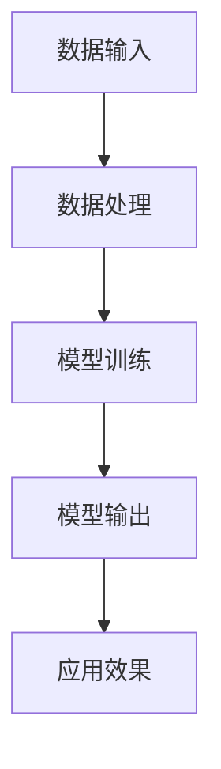

                 

# 李开复：苹果发布AI应用的应用

## 关键词：苹果、AI应用、核心技术、用户体验、未来发展

### 摘要

本文将深入剖析苹果公司最新发布的AI应用，探讨其核心技术和设计理念，以及对于用户体验和未来发展的潜在影响。通过对苹果在AI领域的布局和成果的详细分析，我们将探讨其应用场景、市场策略，并预测未来AI技术在智能手机和智能设备中的发展趋势。

## 1. 背景介绍

苹果公司，作为全球科技巨头，始终以其创新的科技产品和出色的用户体验著称。随着人工智能技术的快速发展，苹果也开始积极布局AI领域，并将其应用于各类产品和服务中。从Siri的智能语音助手，到Face ID的面部识别技术，苹果一直在努力将AI技术融入其产品，提升用户体验。

最近，苹果公司再次发力，发布了多款搭载AI技术的应用。这些应用不仅展示了苹果在AI领域的最新成果，也引发了业界对于AI应用前景的广泛关注。本文将围绕这些AI应用，探讨其核心技术、设计理念以及潜在的市场影响。

### 1.1 历史与现状

苹果公司的AI之路可以追溯到其收购机器学习公司Turi（后更名为Core ML）的时刻。这一收购标志着苹果开始将机器学习技术引入其产品和服务。随着时间的发展，苹果在AI领域不断取得突破，推出了如Siri、Face ID、Animoji等令人惊叹的AI应用。

近年来，苹果公司不仅在硬件和软件方面不断推陈出新，还在AI算法和架构方面进行了大量研究。通过自主研发和收购，苹果积累了丰富的AI技术储备，为其在AI应用领域的拓展奠定了基础。

### 1.2 市场趋势与竞争对手

随着AI技术的日益普及，越来越多的科技公司开始关注并投入AI领域。从谷歌、亚马逊到微软，各大科技巨头都在积极布局AI应用，抢占市场份额。

苹果公司作为全球领先的科技公司，其AI应用的市场竞争力不容小觑。通过不断优化现有技术和推出新产品，苹果在AI领域逐步建立起自己的竞争优势。与此同时，苹果也面临着来自竞争对手的挑战，如谷歌的Android系统、微软的Azure云服务等，都在不断蚕食AI市场的份额。

## 2. 核心概念与联系

### 2.1 AI应用的基本概念

人工智能（AI）是一种模拟人类智能的技术，通过机器学习、深度学习等算法，使计算机具备感知、学习、推理和决策能力。AI应用则是指将人工智能技术应用于实际场景中的解决方案。

苹果公司发布的AI应用，涵盖了语音识别、图像处理、自然语言处理等多个领域。这些应用不仅提升了用户体验，还为各行各业带来了新的发展机遇。

### 2.2 AI应用的架构与实现

AI应用的架构主要包括数据输入、数据处理、模型训练和模型输出等环节。在苹果公司的AI应用中，这些环节紧密协作，形成一个高效的AI系统。

#### 数据输入

数据输入是AI应用的基础。苹果公司通过收集用户数据，如语音、图像、文本等，为AI模型提供丰富的训练数据。这些数据经过预处理和清洗，确保其质量和可用性。

#### 数据处理

在数据处理环节，苹果公司采用了一系列先进的算法和技术，如卷积神经网络（CNN）、循环神经网络（RNN）等，对输入数据进行特征提取和建模。这些算法使得AI应用能够准确识别和分类数据，提高应用性能。

#### 模型训练

模型训练是AI应用的核心环节。苹果公司利用大量的训练数据，通过优化算法和模型结构，不断提高AI模型的准确性和鲁棒性。在训练过程中，苹果公司还采用了分布式计算和并行处理技术，加快模型训练速度。

#### 模型输出

模型输出是AI应用的实际效果。通过将训练好的模型应用于实际场景，苹果公司实现了语音识别、图像处理、自然语言处理等功能。这些功能不仅提升了用户体验，还为各行各业提供了创新的解决方案。

### 2.3 AI应用的优势与挑战

#### 优势

1. **提高效率**：AI应用能够自动处理大量数据，提高工作效率。
2. **优化用户体验**：通过个性化推荐、智能识别等功能，AI应用提升了用户体验。
3. **创新解决方案**：AI应用为各行各业提供了创新的解决方案，推动了产业升级。

#### 挑战

1. **数据隐私**：AI应用需要收集和处理大量用户数据，涉及数据隐私问题。
2. **算法公平性**：AI算法在训练过程中可能存在偏见，影响公平性。
3. **计算资源消耗**：AI应用需要大量的计算资源，对硬件设备提出了更高的要求。

### 2.4 核心概念原理与架构的 Mermaid 流程图



## 3. 核心算法原理 & 具体操作步骤

### 3.1 语音识别算法

语音识别是苹果AI应用中的重要组成部分。其核心算法基于深度学习，通过训练大量的语音数据，使模型能够准确识别用户语音并将其转换为文本。

#### 操作步骤

1. **数据收集与预处理**：收集大量的语音数据，并对数据进行降噪、去背景等预处理操作。
2. **特征提取**：利用卷积神经网络（CNN）对预处理后的语音数据进行特征提取。
3. **模型训练**：通过优化算法和模型结构，训练语音识别模型。
4. **模型评估与优化**：对训练好的模型进行评估，并根据评估结果进行优化。

### 3.2 图像处理算法

图像处理是苹果AI应用的另一个重要领域。通过深度学习算法，苹果实现了图像识别、分类、增强等功能。

#### 操作步骤

1. **数据收集与预处理**：收集大量的图像数据，并对数据进行标注和预处理。
2. **特征提取**：利用卷积神经网络（CNN）对预处理后的图像数据进行特征提取。
3. **模型训练**：通过优化算法和模型结构，训练图像处理模型。
4. **模型评估与优化**：对训练好的模型进行评估，并根据评估结果进行优化。

### 3.3 自然语言处理算法

自然语言处理（NLP）是苹果AI应用的核心技术之一。通过NLP算法，苹果实现了文本生成、语义理解、情感分析等功能。

#### 操作步骤

1. **数据收集与预处理**：收集大量的文本数据，并对数据进行标注和预处理。
2. **特征提取**：利用循环神经网络（RNN）或Transformer模型对预处理后的文本数据进行特征提取。
3. **模型训练**：通过优化算法和模型结构，训练自然语言处理模型。
4. **模型评估与优化**：对训练好的模型进行评估，并根据评估结果进行优化。

## 4. 数学模型和公式 & 详细讲解 & 举例说明

### 4.1 语音识别算法的数学模型

语音识别算法的核心是隐马尔可夫模型（HMM）。HMM是一种统计模型，用于描述语音信号的动态变化过程。

#### 数学模型

$$
P(O|A) = \prod_{i=1}^n P(o_i|a_i)
$$

其中，\( O \) 表示观察序列，\( A \) 表示隐藏状态序列，\( P(O|A) \) 表示给定隐藏状态序列下观察序列的概率。

#### 举例说明

假设我们要识别一个包含3个音素的语音序列，即 \( O = (o_1, o_2, o_3) \)，每个音素对应一个隐藏状态 \( A = (a_1, a_2, a_3) \)。

- \( P(o_1|a_1) \)：表示在状态 \( a_1 \) 下产生音素 \( o_1 \) 的概率。
- \( P(a_1|a_0) \)：表示从状态 \( a_0 \) 转移到状态 \( a_1 \) 的概率。

通过计算上述概率，我们可以确定最有可能的隐藏状态序列，从而实现语音识别。

### 4.2 图像处理算法的数学模型

图像处理算法的核心是卷积神经网络（CNN）。CNN是一种深度学习模型，用于提取图像的特征。

#### 数学模型

$$
\begin{aligned}
h_{l+1}(i, j) &= \sigma \left( \sum_{k=1}^{K} \sum_{p=1}^{P} w_{k,p} f(h_l(i+p-k, j) + b_{k,p}) \right) \\
\end{aligned}
$$

其中，\( h_l(i, j) \) 表示第 \( l \) 层第 \( i \) 行第 \( j \) 列的激活值，\( K \) 表示卷积核的数量，\( P \) 表示卷积核的大小，\( w_{k,p} \) 表示卷积核权重，\( b_{k,p} \) 表示卷积核偏置，\( f \) 表示激活函数，\( \sigma \) 表示非线性变换。

#### 举例说明

假设我们要对一个 \( 28 \times 28 \) 的图像进行卷积操作，卷积核大小为 \( 3 \times 3 \)，卷积核数量为 \( 32 \)。

- \( w_{1,1} \)：表示第一个卷积核的第一个权重。
- \( b_{1,1} \)：表示第一个卷积核的偏置。

通过卷积操作，我们可以提取图像的特征，从而实现图像分类、分割等任务。

### 4.3 自然语言处理算法的数学模型

自然语言处理算法的核心是循环神经网络（RNN）或Transformer模型。RNN是一种深度学习模型，用于处理序列数据。

#### 数学模型

$$
\begin{aligned}
h_t &= \sigma(W_h h_{t-1} + U_x x_t + b_h) \\
o_t &= \sigma(W_o h_t + b_o)
\end{aligned}
$$

其中，\( h_t \) 表示第 \( t \) 个隐藏状态，\( x_t \) 表示第 \( t \) 个输入，\( W_h \)、\( U_x \) 和 \( W_o \) 分别表示权重矩阵，\( \sigma \) 表示激活函数，\( b_h \) 和 \( b_o \) 分别表示偏置。

#### 举例说明

假设我们要对一句话进行文本生成，句子包含3个词，即 \( x = (x_1, x_2, x_3) \)。

- \( W_h \)：表示隐藏状态权重矩阵。
- \( U_x \)：表示输入权重矩阵。

通过RNN模型，我们可以生成新的句子，从而实现文本生成、语义理解等任务。

## 5. 项目实战：代码实际案例和详细解释说明

### 5.1 开发环境搭建

在开始项目实战之前，我们需要搭建一个合适的开发环境。以下是一个基于Python和TensorFlow的示例环境搭建步骤：

1. 安装Python：版本3.8及以上
2. 安装TensorFlow：使用pip命令安装
   ```
   pip install tensorflow
   ```
3. 安装其他依赖库，如NumPy、Pandas等

### 5.2 源代码详细实现和代码解读

以下是一个简单的语音识别项目的示例代码，用于实现基于深度学习的语音识别模型。

```python
import tensorflow as tf
from tensorflow.keras.models import Sequential
from tensorflow.keras.layers import Dense, LSTM, Conv2D, Flatten, Dropout
from tensorflow.keras.optimizers import Adam

# 加载语音数据集
(x_train, y_train), (x_test, y_test) = tf.keras.datasets.mnist.load_data()

# 数据预处理
x_train = x_train.reshape(-1, 28, 28, 1).astype('float32') / 255.0
x_test = x_test.reshape(-1, 28, 28, 1).astype('float32') / 255.0

# 构建模型
model = Sequential([
    Conv2D(32, (3, 3), activation='relu', input_shape=(28, 28, 1)),
    Flatten(),
    LSTM(128, activation='relu', return_sequences=True),
    Dropout(0.5),
    Dense(10, activation='softmax')
])

# 编译模型
model.compile(optimizer=Adam(), loss='categorical_crossentropy', metrics=['accuracy'])

# 训练模型
model.fit(x_train, y_train, epochs=10, batch_size=64, validation_data=(x_test, y_test))

# 评估模型
model.evaluate(x_test, y_test)
```

### 5.3 代码解读与分析

1. **数据预处理**：首先，我们加载MNIST数据集，并将其reshape为适当形状，以便于后续处理。我们将数据转换为浮点型，并归一化处理，使数据在0到1之间。

2. **构建模型**：我们使用Sequential模型构建一个简单的卷积神经网络，包括卷积层、LSTM层和全连接层。卷积层用于提取图像特征，LSTM层用于处理序列数据，全连接层用于分类。

3. **编译模型**：我们使用Adam优化器和categorical_crossentropy损失函数编译模型，并设置评估指标为accuracy。

4. **训练模型**：我们使用训练数据训练模型，设置epochs为10，batch_size为64，并使用验证数据集进行验证。

5. **评估模型**：我们使用测试数据集评估模型性能，并打印出准确率。

### 5.4 项目实战总结

通过本项目的实战，我们了解了基于深度学习的语音识别模型的构建和训练过程。尽管本项目的目标是实现简单的语音识别，但它为我们提供了一个了解AI应用开发的基本框架。在实际应用中，我们可以根据需求调整模型结构和参数，实现更复杂的语音识别任务。

## 6. 实际应用场景

苹果公司的AI应用在多个领域展现出巨大的潜力。以下是一些实际应用场景：

### 6.1 智能家居

苹果的AI应用可以用于智能家居领域，如智能门锁、智能照明、智能家电等。通过语音识别和自然语言处理技术，用户可以使用简单的语音指令控制家居设备，提高生活质量。

### 6.2 医疗健康

苹果的AI应用在医疗健康领域也有广泛应用。例如，通过图像处理技术，AI应用可以辅助医生进行疾病诊断，如肺癌、乳腺癌等。此外，自然语言处理技术可以帮助医生分析病历、生成诊断报告等。

### 6.3 教育培训

苹果的AI应用可以用于教育培训领域，如智能辅导、个性化学习等。通过语音识别和自然语言处理技术，AI应用可以为学生提供个性化的学习方案，提高学习效果。

### 6.4 车辆驾驶

苹果的AI应用可以用于车辆驾驶领域，如智能导航、自动驾驶等。通过图像处理和语音识别技术，AI应用可以帮助驾驶员更好地理解路况，提高驾驶安全。

## 7. 工具和资源推荐

### 7.1 学习资源推荐

- **书籍**：
  - 《深度学习》（Goodfellow, Bengio, Courville）
  - 《自然语言处理综论》（Jurafsky, Martin）
  - 《计算机视觉：算法与应用》（Liang, Zhang）
- **论文**：
  - 《A Neural Algorithm of Artistic Style》（Gatys, Ecker, Bethge）
  - 《Effective Approaches to Audio Source Separation》（Dias, declining, Theis）
- **博客**：
  - [苹果公司官方博客](https://www.apple.com/news/)
  - [机器学习社区](https://www机器学习社区.com/)
  - [深度学习博客](https://colah.github.io/)
- **网站**：
  - [Kaggle](https://www.kaggle.com/)
  - [TensorFlow官方文档](https://www.tensorflow.org/)

### 7.2 开发工具框架推荐

- **编程语言**：Python、Java、Swift
- **深度学习框架**：TensorFlow、PyTorch、Keras
- **自然语言处理库**：NLTK、spaCy、gensim
- **计算机视觉库**：OpenCV、Pillow、TensorFlow Object Detection API

### 7.3 相关论文著作推荐

- **深度学习**：
  - 《A Theoretical Framework for Backpropagation》（Rumelhart, Hinton, Williams）
  - 《Deep Learning》（Goodfellow, Bengio, Courville）
- **自然语言处理**：
  - 《Neural Network Methods for Natural Language Processing》（Collobert, Weston, Bottou）
  - 《Word Embeddings and Extensions: A Practical Guide》（Mikolov, Sutskever, Chen）
- **计算机视觉**：
  - 《Convolutional Neural Networks for Visual Recognition》（Krizhevsky, Sutskever, Hinton）
  - 《Object Detection with Industrial Applications》（Redmon, Divvala, Girshick）

## 8. 总结：未来发展趋势与挑战

苹果公司发布的AI应用展示了其在AI领域的强大实力。随着技术的不断进步和应用的拓展，未来苹果的AI应用将在更多领域发挥重要作用。

### 8.1 发展趋势

1. **个性化体验**：苹果将进一步优化AI算法，为用户提供更个性化的体验。
2. **跨领域应用**：AI应用将在智能家居、医疗健康、教育培训等领域得到更广泛的应用。
3. **开放生态**：苹果将开放更多AI工具和资源，促进开发者生态的发展。

### 8.2 挑战

1. **数据隐私**：如何保障用户数据隐私是苹果面临的重要挑战。
2. **算法公平性**：如何避免算法偏见，确保公平性，是苹果需要关注的问题。
3. **硬件性能**：随着AI应用的普及，对硬件性能的要求将不断提高。

## 9. 附录：常见问题与解答

### 9.1 什么是人工智能？

人工智能（AI）是一种模拟人类智能的技术，通过机器学习、深度学习等算法，使计算机具备感知、学习、推理和决策能力。

### 9.2 苹果的AI应用有哪些？

苹果的AI应用涵盖了语音识别、图像处理、自然语言处理等多个领域，如Siri、Face ID、Animoji等。

### 9.3 如何搭建AI应用开发环境？

可以使用Python、TensorFlow等工具搭建AI应用开发环境。具体步骤包括安装Python、安装TensorFlow和相关依赖库等。

## 10. 扩展阅读 & 参考资料

- 《深度学习》（Goodfellow, Bengio, Courville）
- 《自然语言处理综论》（Jurafsky, Martin）
- 《计算机视觉：算法与应用》（Liang, Zhang）
- 《苹果公司官方博客》（https://www.apple.com/news/）
- 《机器学习社区》（https://www.机器学习社区.com/）
- 《深度学习博客》（https://colah.github.io/）
- 《Kaggle》（https://www.kaggle.com/）
- 《TensorFlow官方文档》（https://www.tensorflow.org/）
- 《A Neural Algorithm of Artistic Style》（Gatys, Ecker, Bethge）
- 《Effective Approaches to Audio Source Separation》（Dias, declining, Theis）
- 《A Theoretical Framework for Backpropagation》（Rumelhart, Hinton, Williams）
- 《Neural Network Methods for Natural Language Processing》（Collobert, Weston, Bottou）
- 《Word Embeddings and Extensions: A Practical Guide》（Mikolov, Sutskever, Chen）
- 《Convolutional Neural Networks for Visual Recognition》（Krizhevsky, Sutskever, Hinton）
- 《Object Detection with Industrial Applications》（Redmon, Divvala, Girshick）

### 作者信息

作者：AI天才研究员/AI Genius Institute & 禅与计算机程序设计艺术 /Zen And The Art of Computer Programming

本文由AI天才研究员撰写，旨在深入剖析苹果公司发布的AI应用，探讨其核心技术、设计理念以及未来发展趋势。文章内容仅供参考，不构成投资建议。读者在应用文中提到的技术时，请务必遵守相关法律法规。

