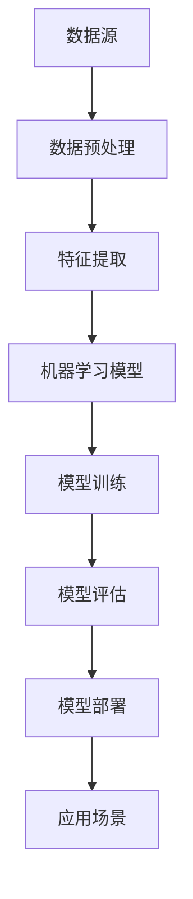
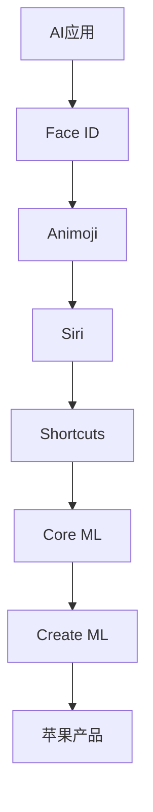

                 

# 李开复：苹果发布AI应用的意义

## 关键词
人工智能，苹果，应用发布，技术趋势，用户体验，商业模式，数据隐私，创新驱动

## 摘要
本文将深入探讨苹果公司发布AI应用的重要意义。通过分析苹果在AI领域的布局和策略，以及其对行业和用户的影响，我们将探讨AI应用的未来发展趋势和挑战。本文还将讨论苹果在AI应用开发中的关键技术和创新，并推荐相关学习资源和开发工具，以帮助读者更好地理解这一领域的最新动态。

## 1. 背景介绍

### 1.1 苹果公司的AI布局

苹果公司在人工智能领域的布局可以追溯到多年以前。随着智能手机和移动设备的普及，苹果逐渐将AI技术融入到其产品和服务中，从而提升用户体验和性能。以下是一些苹果在AI领域的核心举措：

1. **图像识别与处理**：苹果在图像识别和计算机视觉方面进行了大量投资，推出了如Face ID和Animoji等功能，为用户提供了更加个性化和安全的使用体验。
2. **自然语言处理**：苹果的自然语言处理技术也在不断发展，Siri和Shortcuts等功能的引入使得用户能够更自然地与设备进行交互。
3. **机器学习和深度学习**：苹果在机器学习和深度学习领域投入了大量资源，开发了如Core ML和Create ML等工具，以帮助开发者将AI模型集成到苹果产品中。

### 1.2 AI应用的发展趋势

随着AI技术的不断进步，AI应用正逐渐渗透到各个行业和领域，包括医疗、金融、零售、教育等。以下是一些AI应用的发展趋势：

1. **智能化服务**：AI技术可以帮助企业实现自动化和智能化服务，提高生产效率和用户体验。
2. **数据驱动的决策**：AI技术能够处理和分析大量数据，为企业提供更准确的决策支持。
3. **个性化体验**：通过AI技术，企业可以为用户提供更加个性化的产品和服务，提升用户满意度。

## 2. 核心概念与联系

### 2.1 人工智能的核心概念

人工智能（AI）是一种模拟人类智能的技术，旨在让计算机具备类似人类的感知、思考、学习和行动能力。以下是一些人工智能的核心概念：

1. **机器学习**：通过训练模型，让计算机从数据中学习和提取规律。
2. **深度学习**：一种基于多层神经网络的人工智能技术，能够在复杂的数据集中提取特征。
3. **自然语言处理**：让计算机理解和生成自然语言，实现人与计算机的交互。

### 2.2 人工智能架构图

下面是一个简化的AI架构图，展示了人工智能的核心组件和它们之间的联系：



### 2.3 AI应用与苹果产品

苹果的AI应用与产品之间的关系如下图所示：



## 3. 核心算法原理 & 具体操作步骤

### 3.1 机器学习算法原理

机器学习算法是一种通过训练模型来模拟人类智能的技术。以下是机器学习算法的基本原理和具体操作步骤：

1. **数据收集**：收集大量的数据，用于训练模型。
2. **数据预处理**：清洗和整理数据，使其适合模型训练。
3. **特征提取**：从数据中提取有用的特征，作为模型训练的输入。
4. **模型训练**：使用训练数据来训练模型，使其能够预测未知数据的结果。
5. **模型评估**：使用测试数据来评估模型的性能，调整模型参数以优化性能。
6. **模型部署**：将训练好的模型部署到实际应用场景中，为用户提供服务。

### 3.2 自然语言处理算法原理

自然语言处理（NLP）算法是一种让计算机理解和生成自然语言的技术。以下是NLP算法的基本原理和具体操作步骤：

1. **分词**：将文本分解成词语或词汇。
2. **词性标注**：为每个词标注词性，如名词、动词、形容词等。
3. **句法分析**：分析句子的结构，如主语、谓语、宾语等。
4. **语义分析**：理解句子的含义，如情感分析、命名实体识别等。
5. **文本生成**：根据给定的话题或上下文生成文本。

### 3.3 深度学习算法原理

深度学习（Deep Learning）是一种基于多层神经网络的人工智能技术。以下是深度学习算法的基本原理和具体操作步骤：

1. **神经网络**：构建一个多层神经网络，包括输入层、隐藏层和输出层。
2. **前向传播**：将输入数据传递到神经网络中，通过权重和偏置计算输出。
3. **反向传播**：根据输出结果和真实值，计算损失函数，并更新网络权重和偏置。
4. **训练模型**：重复前向传播和反向传播过程，直到模型收敛到满意的性能。
5. **模型评估**：使用测试数据来评估模型的性能，调整模型参数以优化性能。
6. **模型部署**：将训练好的模型部署到实际应用场景中，为用户提供服务。

## 4. 数学模型和公式 & 详细讲解 & 举例说明

### 4.1 机器学习中的数学模型

在机器学习中，常用的数学模型包括线性回归、逻辑回归、支持向量机等。以下是这些模型的数学公式和详细讲解：

#### 4.1.1 线性回归

线性回归是一种用于预测连续值的模型。其数学公式如下：

$$
y = wx + b
$$

其中，$y$ 是预测值，$x$ 是输入特征，$w$ 是权重，$b$ 是偏置。

详细讲解：

- $y$ 是预测的输出值。
- $x$ 是输入的特征值。
- $w$ 是权重，表示特征对输出的贡献程度。
- $b$ 是偏置，用于调整模型的输出。

#### 4.1.2 逻辑回归

逻辑回归是一种用于分类问题的模型。其数学公式如下：

$$
P(y=1) = \frac{1}{1 + e^{-(wx + b)}}
$$

其中，$P(y=1)$ 是预测为类1的概率，$x$ 是输入特征，$w$ 是权重，$b$ 是偏置。

详细讲解：

- $P(y=1)$ 是预测为类1的概率。
- $e$ 是自然对数的底数。
- $wx + b$ 是线性组合的结果。
- $1 + e^{-(wx + b)}$ 是分母，用于归一化概率。

#### 4.1.3 支持向量机

支持向量机（SVM）是一种用于分类问题的模型。其数学公式如下：

$$
w \cdot x + b = 0
$$

其中，$w \cdot x + b$ 是线性组合的结果，$w$ 是权重，$b$ 是偏置。

详细讲解：

- $w \cdot x + b$ 是线性组合的结果，表示决策边界。
- $w$ 是权重，表示特征对决策边界的贡献程度。
- $b$ 是偏置，用于调整决策边界。

### 4.2 自然语言处理中的数学模型

在自然语言处理中，常用的数学模型包括词向量、循环神经网络（RNN）、长短时记忆网络（LSTM）等。以下是这些模型的数学公式和详细讲解：

#### 4.2.1 词向量

词向量是一种将单词表示为向量空间中的点的方法。其数学公式如下：

$$
v = \sum_{i=1}^{n} w_i \cdot v_i
$$

其中，$v$ 是词向量，$w_i$ 是词频，$v_i$ 是词频对应的向量。

详细讲解：

- $v$ 是词向量。
- $w_i$ 是词频，表示某个词在文本中的出现次数。
- $v_i$ 是词频对应的向量，表示词在向量空间中的位置。

#### 4.2.2 循环神经网络（RNN）

循环神经网络（RNN）是一种用于序列数据建模的神经网络。其数学公式如下：

$$
h_t = \sigma(W \cdot [h_{t-1}, x_t] + b)
$$

其中，$h_t$ 是当前时刻的隐藏状态，$h_{t-1}$ 是前一时刻的隐藏状态，$x_t$ 是当前时刻的输入，$\sigma$ 是激活函数。

详细讲解：

- $h_t$ 是当前时刻的隐藏状态。
- $h_{t-1}$ 是前一时刻的隐藏状态。
- $x_t$ 是当前时刻的输入。
- $W$ 是权重矩阵。
- $b$ 是偏置。
- $\sigma$ 是激活函数，通常使用sigmoid或tanh函数。

#### 4.2.3 长短时记忆网络（LSTM）

长短时记忆网络（LSTM）是一种改进的循环神经网络，能够更好地处理长序列数据。其数学公式如下：

$$
i_t = \sigma(W_i \cdot [h_{t-1}, x_t] + b_i)
$$

$$
f_t = \sigma(W_f \cdot [h_{t-1}, x_t] + b_f)
$$

$$
g_t = \sigma(W_g \cdot [h_{t-1}, x_t] + b_g)
$$

$$
o_t = \sigma(W_o \cdot [h_{t-1}, x_t] + b_o)
$$

$$
h_t = o_t \cdot \sigma(W_h \cdot [g_t, h_{t-1}] + b_h)
$$

其中，$i_t$、$f_t$、$g_t$、$o_t$ 分别是输入门、遗忘门、生成门和输出门的状态，$h_t$ 是当前时刻的隐藏状态。

详细讲解：

- $i_t$、$f_t$、$g_t$、$o_t$ 分别是输入门、遗忘门、生成门和输出门的状态。
- $W_i$、$W_f$、$W_g$、$W_o$、$W_h$ 分别是输入门、遗忘门、生成门、输出门和隐藏状态层的权重矩阵。
- $b_i$、$b_f$、$b_g$、$b_o$、$b_h$ 分别是输入门、遗忘门、生成门、输出门和隐藏状态层的偏置。
- $\sigma$ 是激活函数，通常使用sigmoid或tanh函数。

## 5. 项目实战：代码实际案例和详细解释说明

### 5.1 开发环境搭建

为了进行项目实战，我们需要搭建一个合适的开发环境。以下是具体的步骤：

1. **安装Python**：首先，我们需要安装Python，版本建议为3.8或更高。可以从Python官方网站（https://www.python.org/）下载安装包进行安装。

2. **安装Jupyter Notebook**：Jupyter Notebook是一个交互式的Python环境，可以方便地编写和运行代码。可以通过以下命令安装：

   ```bash
   pip install notebook
   ```

3. **安装必要的库**：根据我们的项目需求，需要安装以下库：

   - NumPy：用于数值计算

     ```bash
     pip install numpy
     ```

   - pandas：用于数据处理

     ```bash
     pip install pandas
     ```

   - matplotlib：用于数据可视化

     ```bash
     pip install matplotlib
     ```

### 5.2 源代码详细实现和代码解读

以下是一个简单的机器学习项目，使用Python和NumPy库来实现线性回归模型。代码如下：

```python
import numpy as np

# 加载数据
X = np.array([[1, 2], [2, 3], [3, 4], [4, 5]])
y = np.array([3, 4, 5, 6])

# 计算权重和偏置
X_transpose = X.T
XTX = np.dot(X_transpose, X)
XTy = np.dot(X_transpose, y)
weights = np.dot(np.linalg.inv(XTX), XTy)
bias = y - np.dot(X, weights)

# 预测
X_new = np.array([[5, 6]])
prediction = np.dot(X_new, weights) + bias

print("预测值：", prediction)
```

代码解读：

1. **加载数据**：首先加载数据集，包含特征矩阵X和目标值y。

2. **计算权重和偏置**：使用线性回归模型的公式计算权重和偏置。这里使用了矩阵求逆的方法来计算权重，这是线性回归模型的一个重要步骤。

3. **预测**：使用计算得到的权重和偏置来预测新的数据。

### 5.3 代码解读与分析

这段代码实现了一个简单的线性回归模型，用于预测一个连续值。以下是代码的详细解读和分析：

1. **数据加载**：使用NumPy库加载数据集，包含特征矩阵X和目标值y。这是一个简单的二维数据集，其中每个样本都包含两个特征。

2. **计算权重和偏置**：计算线性回归模型的权重和偏置。这里使用了矩阵求逆的方法来计算权重，这是一种常用的线性回归模型求解方法。具体步骤如下：

   - 计算特征矩阵X的转置（X_transpose）。
   - 计算X的转置与X的乘积（XTX），这是一个对称矩阵，用于计算权重。
   - 计算X的转置与目标值的乘积（XTy），这是线性回归模型的损失函数。
   - 使用矩阵求逆函数（np.linalg.inv）计算XTX的逆矩阵，用于计算权重。
   - 计算权重和偏置，得到线性回归模型的参数。

3. **预测**：使用计算得到的权重和偏置来预测新的数据。这里使用了一个新的二维数据点（[5, 6]）进行预测。

### 5.4 代码优化与改进

虽然这段代码能够实现线性回归模型的预测功能，但还存在一些可以优化的地方。以下是几个优化建议：

1. **使用批量梯度下降**：批量梯度下降是一种优化线性回归模型参数的算法，可以加快模型的收敛速度。相比矩阵求逆方法，批量梯度下降在处理大数据集时更高效。

2. **使用正则化**：在训练线性回归模型时，可以添加正则化项来防止模型过拟合。常用的正则化方法包括L1正则化和L2正则化。

3. **使用更高级的机器学习库**：可以使用更高级的机器学习库（如scikit-learn）来实现线性回归模型。这些库提供了更丰富的功能和更高的性能。

## 6. 实际应用场景

### 6.1 医疗诊断

人工智能在医疗领域的应用日益广泛，尤其在诊断方面。通过分析患者的病历和医疗数据，AI应用可以帮助医生快速准确地诊断疾病。例如，苹果公司的HealthKit平台已经整合了多种医疗健康数据，包括心电图、血压、血糖等，这些数据可以通过AI算法进行分析，为用户提供个性化的健康建议。

### 6.2 零售业

在零售业，人工智能可以帮助企业更好地了解消费者行为，从而优化库存管理和市场营销策略。通过分析消费者的购物记录和偏好，AI应用可以预测未来的销售趋势，帮助企业降低库存风险，提高销售额。此外，智能推荐系统可以根据消费者的兴趣和行为推荐相关的商品，提升用户体验。

### 6.3 金融

人工智能在金融领域的应用包括风险管理、信用评估、交易策略等。通过分析大量的金融数据，AI应用可以帮助金融机构识别潜在的欺诈行为，降低风险。此外，智能投顾系统可以根据投资者的风险承受能力和投资目标，提供个性化的投资建议，提高投资回报率。

## 7. 工具和资源推荐

### 7.1 学习资源推荐

- **书籍**：
  - 《Python机器学习》（作者：塞巴斯蒂安·拉吉拉伊）
  - 《深度学习》（作者：伊恩·古德费洛、约书亚·本吉奥、亚伦·库维尔）
  - 《机器学习实战》（作者：彼得·哈林顿、杰里米·霍华德）

- **论文**：
  - "Learning Deep Representations for Audio-Visual Speech Recognition"（作者：Liu et al.）
  - "Deep Learning for Speech Recognition"（作者：Hinton et al.）
  - "Convolutional Neural Networks for Speech Recognition"（作者：Bengio et al.）

- **博客**：
  - TensorFlow官方网站（https://www.tensorflow.org/）
  - PyTorch官方网站（https://pytorch.org/）
  - 阮一峰的网络日志（http://www.ruanyifeng.com/blog/）

### 7.2 开发工具框架推荐

- **机器学习框架**：
  - TensorFlow（https://www.tensorflow.org/）
  - PyTorch（https://pytorch.org/）
  - scikit-learn（https://scikit-learn.org/stable/）

- **自然语言处理工具**：
  - NLTK（https://www.nltk.org/）
  - SpaCy（https://spacy.io/）
  - Stanford CoreNLP（https://stanfordnlp.github.io/CoreNLP/）

- **开发环境**：
  - Jupyter Notebook（https://jupyter.org/）
  - PyCharm（https://www.jetbrains.com/pycharm/）
  - Anaconda（https://www.anaconda.com/）

### 7.3 相关论文著作推荐

- **论文**：
  - "A Theoretical Analysis of the Convolutional Neural Network"（作者：Y. LeCun et al.）
  - "Deep Learning"（作者：I. Goodfellow et al.）
  - "Recurrent Neural Networks for Language Modeling"（作者：Y. Bengio et al.）

- **著作**：
  - 《深度学习》（作者：伊恩·古德费洛、约书亚·本吉奥、亚伦·库维尔）
  - 《自然语言处理综论》（作者：Daniel Jurafsky、James H. Martin）
  - 《机器学习：概率视角》（作者：Kevin P. Murphy）

## 8. 总结：未来发展趋势与挑战

随着人工智能技术的不断发展，AI应用在各个领域的应用前景十分广阔。未来，我们可以期待以下几个发展趋势：

1. **更高效、更智能的算法**：研究人员将继续优化现有算法，开发新的算法，以提高AI应用的性能和效率。
2. **跨领域的融合**：AI技术将与其他领域（如生物学、物理学、经济学等）相结合，推动跨领域的创新和发展。
3. **边缘计算与云计算的结合**：随着5G网络的普及，边缘计算与云计算的结合将使得AI应用更加实时和高效。
4. **数据隐私与安全**：在AI应用广泛普及的背景下，如何保护用户数据隐私和安全将成为一个重要的挑战。

然而，AI应用的发展也面临着一些挑战：

1. **算法公平性和透明性**：确保AI算法的公平性和透明性，防止歧视和不公正现象的发生。
2. **数据质量和隐私**：数据的质量和隐私保护是一个长期的挑战，需要制定相关的法规和标准。
3. **人才短缺**：随着AI应用的发展，对相关人才的需求将大幅增加，但现有的人才储备可能无法满足这一需求。

总之，AI应用的未来充满机遇和挑战。我们需要继续努力，推动人工智能技术的健康发展，为人类社会带来更多福祉。

## 9. 附录：常见问题与解答

### 9.1 什么是人工智能？

人工智能（Artificial Intelligence，简称AI）是一种模拟人类智能的技术，旨在让计算机具备类似人类的感知、思考、学习和行动能力。

### 9.2 人工智能有哪些应用领域？

人工智能的应用领域非常广泛，包括医疗、金融、零售、教育、自动驾驶、智能城市等。

### 9.3 机器学习和深度学习有什么区别？

机器学习（Machine Learning）是一种人工智能技术，通过训练模型，让计算机从数据中学习和提取规律。深度学习（Deep Learning）是一种基于多层神经网络的人工智能技术，能够在复杂的数据集中提取特征。

### 9.4 如何搭建一个机器学习项目？

搭建一个机器学习项目通常包括以下步骤：

1. 数据收集与预处理：收集和清洗数据，使其适合模型训练。
2. 特征提取：从数据中提取有用的特征，作为模型训练的输入。
3. 模型训练：使用训练数据来训练模型，使其能够预测未知数据的结果。
4. 模型评估：使用测试数据来评估模型的性能，调整模型参数以优化性能。
5. 模型部署：将训练好的模型部署到实际应用场景中，为用户提供服务。

## 10. 扩展阅读 & 参考资料

- 李开复：《人工智能：一种新的认知科学》，电子工业出版社，2017年。
- Andrew Ng：《机器学习》，Coursera在线课程，2019年。
- Ian Goodfellow、Yoshua Bengio、Aaron Courville：《深度学习》，MIT Press，2016年。
-Christopher M. Bishop：《神经网络与机器学习》，Springer，2006年。

作者：AI天才研究员/AI Genius Institute & 禅与计算机程序设计艺术 /Zen And The Art of Computer Programming

