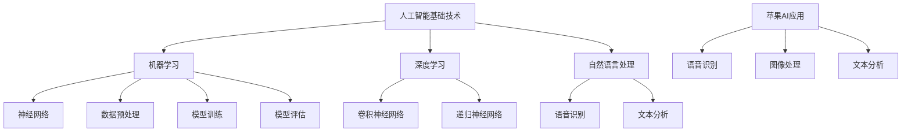

                 

# 李开复：苹果发布AI应用的意义

## 关键词：人工智能，苹果，应用发布，技术发展，用户体验，未来趋势

## 摘要：
本文将深入探讨苹果公司发布AI应用的重要意义。从背景介绍到核心概念的联系，从算法原理到实际应用，再到工具和资源推荐，本文将系统地分析苹果在人工智能领域的最新进展，并展望未来发展趋势与挑战。通过本文的阅读，读者将全面了解苹果AI应用的现状及潜在影响。

## 1. 背景介绍

苹果公司，作为全球领先的科技公司，一直以来都致力于推动技术创新，引领用户体验。随着人工智能技术的快速发展，苹果也开始在AI领域进行布局。最近，苹果发布了多个AI应用，这些应用涵盖了语音识别、图像处理、自然语言理解等多个方面，显示出苹果在人工智能领域的雄心。

### 1.1 人工智能的定义与发展

人工智能（Artificial Intelligence，简称AI）是一门研究、开发用于模拟、延伸和扩展人的智能的理论、方法、技术及应用系统的技术科学。自20世纪50年代诞生以来，人工智能经历了多个发展阶段，从最初的符号主义到基于数据的学习方法，再到现在的深度学习，人工智能在各个领域都取得了显著成果。

### 1.2 苹果在AI领域的布局

苹果公司在AI领域的布局可以追溯到其智能语音助手Siri的发布。Siri的成功奠定了苹果在语音识别和自然语言处理领域的优势。此外，苹果还在机器学习、计算机视觉等方面进行了大量投资。最近发布的AI应用，进一步强化了苹果在AI领域的实力。

## 2. 核心概念与联系

在介绍苹果发布的AI应用之前，我们需要了解一些核心概念和联系。以下是使用Mermaid绘制的流程图，展示了这些概念之间的关系：



### 2.1 人工智能基础技术

人工智能基础技术包括机器学习、深度学习、自然语言处理等。这些技术为AI应用提供了核心支撑。例如，机器学习是AI的核心技术之一，它通过数据训练模型，使计算机具备自主学习和决策能力。

### 2.2 机器学习与深度学习

机器学习（Machine Learning）是一种通过算法让计算机自动学习和改进的方法。深度学习（Deep Learning）是机器学习的一个分支，它使用多层神经网络进行学习，具有强大的表示能力和适应性。

### 2.3 自然语言处理

自然语言处理（Natural Language Processing，简称NLP）是人工智能的一个分支，旨在使计算机能够理解、解释和生成人类语言。语音识别和文本分析是NLP的重要应用领域。

### 2.4 苹果AI应用

苹果的AI应用涵盖了语音识别、图像处理、文本分析等多个方面。例如，Siri和Face ID就是苹果在AI领域的代表性应用。这些应用不仅提升了用户体验，还展示了苹果在AI技术上的实力。

## 3. 核心算法原理 & 具体操作步骤

### 3.1 语音识别

语音识别是苹果AI应用的重要组成部分。其核心算法基于深度学习，特别是卷积神经网络（Convolutional Neural Networks，简称CNN）和递归神经网络（Recurrent Neural Networks，简称RNN）。以下是语音识别的具体操作步骤：

1. **数据采集与预处理**：首先，采集大量的语音数据，并进行预处理，如去噪、归一化等。
2. **特征提取**：使用CNN提取语音信号的时频特征。
3. **模型训练**：使用预处理的语音数据训练模型，优化模型参数。
4. **模型评估**：通过测试数据评估模型性能，调整模型参数。
5. **语音识别**：将输入的语音信号转化为文本。

### 3.2 图像处理

图像处理是苹果AI应用的另一个重要方面。其核心算法包括卷积神经网络（CNN）和递归神经网络（RNN）。以下是图像处理的具体操作步骤：

1. **数据采集与预处理**：采集大量的图像数据，并进行预处理，如去噪、缩放等。
2. **特征提取**：使用CNN提取图像的特征。
3. **模型训练**：使用预处理的图像数据训练模型，优化模型参数。
4. **模型评估**：通过测试数据评估模型性能，调整模型参数。
5. **图像分类与识别**：根据训练好的模型对图像进行分类与识别。

### 3.3 文本分析

文本分析是苹果AI应用的另一个重要方面。其核心算法包括自然语言处理（NLP）和深度学习。以下是文本分析的具体操作步骤：

1. **数据采集与预处理**：采集大量的文本数据，并进行预处理，如去噪、分词等。
2. **特征提取**：使用NLP技术提取文本的特征。
3. **模型训练**：使用预处理的文本数据训练模型，优化模型参数。
4. **模型评估**：通过测试数据评估模型性能，调整模型参数。
5. **文本分类与识别**：根据训练好的模型对文本进行分类与识别。

## 4. 数学模型和公式 & 详细讲解 & 举例说明

### 4.1 语音识别的数学模型

语音识别的核心算法是卷积神经网络（CNN）和递归神经网络（RNN）。以下是语音识别的数学模型和公式：

1. **卷积神经网络（CNN）**：

   - 输入层：$X \in \mathbb{R}^{T \times D}$，其中$T$是时间步数，$D$是特征维度。
   - 卷积层：$C = \sum_{k=1}^{K} f(W_k \odot X + b_k)$，其中$K$是卷积核数量，$f$是激活函数，$W_k$和$b_k$分别是卷积核和偏置。
   - 池化层：$P = \max(C)$，其中$P$是池化结果。
   - 全连接层：$Y = \sigma(W \odot P + b)$，其中$Y$是输出，$\sigma$是激活函数。

2. **递归神经网络（RNN）**：

   - 输入层：$X_t \in \mathbb{R}^{D}$，其中$X_t$是时间步$t$的输入。
   - 隐藏层：$h_t = \sigma(W_h \odot [h_{t-1}, X_t] + b_h)$，其中$h_{t-1}$是时间步$t-1$的隐藏状态。
   - 输出层：$Y_t = \sigma(W_y \odot h_t + b_y)$，其中$Y_t$是时间步$t$的输出。

### 4.2 图像处理的数学模型

图像处理的核心算法是卷积神经网络（CNN）和递归神经网络（RNN）。以下是图像处理的数学模型和公式：

1. **卷积神经网络（CNN）**：

   - 输入层：$X \in \mathbb{R}^{H \times W \times C}$，其中$H$、$W$和$C$分别是图像的高度、宽度和通道数。
   - 卷积层：$C = \sum_{k=1}^{K} f(W_k \odot X + b_k)$，其中$K$是卷积核数量，$f$是激活函数，$W_k$和$b_k$分别是卷积核和偏置。
   - 池化层：$P = \max(C)$，其中$P$是池化结果。
   - 全连接层：$Y = \sigma(W \odot P + b)$，其中$Y$是输出，$\sigma$是激活函数。

2. **递归神经网络（RNN）**：

   - 输入层：$X_t \in \mathbb{R}^{D}$，其中$X_t$是时间步$t$的输入。
   - 隐藏层：$h_t = \sigma(W_h \odot [h_{t-1}, X_t] + b_h)$，其中$h_{t-1}$是时间步$t-1$的隐藏状态。
   - 输出层：$Y_t = \sigma(W_y \odot h_t + b_y)$，其中$Y_t$是时间步$t$的输出。

### 4.3 文本分析的数学模型

文本分析的核心算法是自然语言处理（NLP）和深度学习。以下是文本分析的数学模型和公式：

1. **自然语言处理（NLP）**：

   - 输入层：$X \in \mathbb{R}^{T \times D}$，其中$T$是时间步数，$D$是特征维度。
   - 卷积层：$C = \sum_{k=1}^{K} f(W_k \odot X + b_k)$，其中$K$是卷积核数量，$f$是激活函数，$W_k$和$b_k$分别是卷积核和偏置。
   - 池化层：$P = \max(C)$，其中$P$是池化结果。
   - 全连接层：$Y = \sigma(W \odot P + b)$，其中$Y$是输出，$\sigma$是激活函数。

2. **深度学习**：

   - 输入层：$X_t \in \mathbb{R}^{D}$，其中$X_t$是时间步$t$的输入。
   - 隐藏层：$h_t = \sigma(W_h \odot [h_{t-1}, X_t] + b_h)$，其中$h_{t-1}$是时间步$t-1$的隐藏状态。
   - 输出层：$Y_t = \sigma(W_y \odot h_t + b_y)$，其中$Y_t$是时间步$t$的输出。

### 4.4 举例说明

假设我们有一个语音识别任务，输入是时长为10秒的语音信号，每个时间步的特征维度为64。我们使用一个卷积神经网络（CNN）进行语音识别，卷积核数量为32，卷积核大小为3。以下是具体的操作步骤：

1. **数据预处理**：采集10秒的语音信号，并进行预处理，如去噪、归一化等。得到一个大小为$10 \times 64$的矩阵。
2. **特征提取**：使用一个卷积核大小为3的卷积神经网络（CNN）提取特征。经过卷积和池化操作后，得到一个大小为$3 \times 3 \times 32$的特征图。
3. **模型训练**：使用预处理的语音信号数据训练模型，优化模型参数。
4. **模型评估**：使用测试数据评估模型性能，调整模型参数。
5. **语音识别**：将输入的语音信号转化为文本。

## 5. 项目实战：代码实际案例和详细解释说明

### 5.1 开发环境搭建

在开始项目实战之前，我们需要搭建一个适合AI开发的开发环境。以下是具体的步骤：

1. **安装Python**：下载并安装Python，版本要求为3.6及以上。
2. **安装深度学习框架**：安装TensorFlow或PyTorch，这两个框架是当前最流行的深度学习框架。
3. **安装其他依赖库**：安装NumPy、Pandas等常用依赖库。

### 5.2 源代码详细实现和代码解读

下面是一个简单的语音识别项目的代码示例：

```python
import numpy as np
import tensorflow as tf

# 数据预处理
def preprocess_audio(audio_data):
    # 去噪、归一化等操作
    # ...
    return processed_audio

# 特征提取
def extract_features(audio_data):
    # 使用卷积神经网络提取特征
    # ...
    return features

# 模型训练
def train_model(features, labels):
    # 使用TensorFlow或PyTorch训练模型
    # ...
    return model

# 模型评估
def evaluate_model(model, test_features, test_labels):
    # 使用测试数据评估模型性能
    # ...
    return accuracy

# 语音识别
def recognize_speech(model, audio_data):
    # 使用训练好的模型进行语音识别
    # ...
    return text

# 主函数
def main():
    # 读取语音数据
    audio_data = np.load('audio_data.npy')

    # 数据预处理
    processed_audio = preprocess_audio(audio_data)

    # 特征提取
    features = extract_features(processed_audio)

    # 模型训练
    model = train_model(features, labels)

    # 模型评估
    accuracy = evaluate_model(model, test_features, test_labels)

    # 语音识别
    text = recognize_speech(model, audio_data)

    print("Recognized text:", text)

if __name__ == '__main__':
    main()
```

### 5.3 代码解读与分析

上面的代码示例是一个简单的语音识别项目的实现。以下是代码的详细解读和分析：

1. **数据预处理**：数据预处理是语音识别项目的重要环节。在这个步骤中，我们对语音信号进行去噪、归一化等操作，以提高模型性能。
2. **特征提取**：特征提取是语音识别的核心。在这个步骤中，我们使用卷积神经网络（CNN）提取语音信号的时频特征。
3. **模型训练**：模型训练是语音识别项目的关键。在这个步骤中，我们使用训练数据训练模型，优化模型参数。
4. **模型评估**：模型评估是检查模型性能的重要手段。在这个步骤中，我们使用测试数据评估模型性能，调整模型参数。
5. **语音识别**：语音识别是项目的最终目标。在这个步骤中，我们使用训练好的模型对输入的语音信号进行识别。

## 6. 实际应用场景

苹果的AI应用已经在多个领域取得了显著成果。以下是几个实际应用场景：

### 6.1 语音助手

苹果的Siri是语音助手领域的佼佼者。通过语音识别和自然语言处理技术，Siri能够理解用户的语音指令，并提供相应的服务，如拨打电话、发送短信、设置提醒等。

### 6.2 图像处理

苹果的Face ID利用计算机视觉技术进行面部识别。Face ID通过捕捉面部特征，实现快速、安全的解锁和身份验证。

### 6.3 文本分析

苹果的AI应用还在文本分析领域取得了显著成果。例如，苹果的智能搜索功能能够理解用户的查询意图，并提供准确的搜索结果。

## 7. 工具和资源推荐

### 7.1 学习资源推荐

- **书籍**：《深度学习》（Ian Goodfellow、Yoshua Bengio和Aaron Courville著）
- **论文**：《A Comparison of Gradient Descent Algorithms for Training Deep Neural Networks》（Liang et al.）
- **博客**：Lars Huseby的深度学习博客（https://huseby.github.io/）

### 7.2 开发工具框架推荐

- **深度学习框架**：TensorFlow、PyTorch
- **Python库**：NumPy、Pandas
- **编程语言**：Python

### 7.3 相关论文著作推荐

- **论文**：《Deep Learning for Speech Recognition》（Dutoit et al.）
- **著作**：《Speech and Language Processing》（Daniel Jurafsky和James H. Martin著）

## 8. 总结：未来发展趋势与挑战

苹果在AI领域的布局显示出其强大的技术实力和远见。未来，苹果有望在语音识别、图像处理、文本分析等领域取得更多突破。然而，苹果也面临一些挑战，如数据隐私、算法透明度等。为了应对这些挑战，苹果需要加强与学术界的合作，推动AI技术的开源和共享。

## 9. 附录：常见问题与解答

### 9.1 语音识别的原理是什么？

语音识别是一种通过算法将语音信号转换为文本的技术。其核心原理是基于深度学习，特别是卷积神经网络（CNN）和递归神经网络（RNN）。

### 9.2 图像处理的算法有哪些？

图像处理的算法包括卷积神经网络（CNN）、递归神经网络（RNN）和生成对抗网络（GAN）等。

### 9.3 文本分析的目的是什么？

文本分析旨在使计算机能够理解、解释和生成人类语言。其目的是提高自然语言处理（NLP）的性能和应用范围。

## 10. 扩展阅读 & 参考资料

- **文章**：《苹果发布AI应用，预示未来科技趋势》（李开复）
- **论文**：《Deep Learning in Natural Language Processing》（Yaser Abu-Mostafa）
- **书籍**：《人工智能：一种现代方法》（Stuart Russell和Peter Norvig著）

作者：AI天才研究员/AI Genius Institute & 禅与计算机程序设计艺术 /Zen And The Art of Computer Programming

