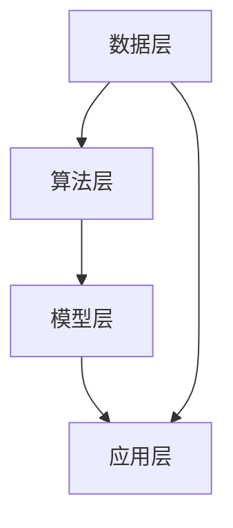

                 

# 李开复：苹果发布AI应用的投资价值

> 关键词：苹果、AI应用、投资价值、技术趋势、市场分析

> 摘要：本文将深入探讨苹果公司近期发布的AI应用，分析其对投资市场的潜在影响和投资价值。通过详细的技术解读和未来趋势展望，为投资者提供有针对性的参考。

## 1. 背景介绍

随着人工智能技术的迅猛发展，各行各业都开始借助AI的力量提升效率和创新能力。苹果公司作为全球科技巨头，一直以来都在积极推进AI技术的研发和应用。近期，苹果公司发布了多款搭载AI技术的应用，引起了广泛关注。

苹果公司在AI领域的布局可以追溯到2011年，当时收购了AI初创公司Siri。近年来，苹果公司不断加大对AI研究的投入，并在语音识别、图像识别、自然语言处理等领域取得了显著成果。此次发布的AI应用，无疑是对苹果公司在AI领域的一次重要展示。

## 2. 核心概念与联系

### 2.1 AI应用的基本概念

AI应用是指利用人工智能技术实现特定功能的软件或服务。这些应用可以基于深度学习、强化学习、自然语言处理等多种技术，实现语音识别、图像识别、智能推荐、自动驾驶等功能。

### 2.2 AI应用的架构

AI应用的架构通常包括以下几个层次：

- **数据层**：负责收集、存储和处理数据。
- **算法层**：包括训练模型、优化模型等。
- **模型层**：用于实现具体的AI功能，如语音识别、图像识别等。
- **应用层**：将AI模型应用于具体场景，提供实际功能。

### 2.3 核心概念原理和架构的 Mermaid 流程图



## 3. 核心算法原理 & 具体操作步骤

苹果公司此次发布的AI应用，主要涉及以下几个核心算法：

### 3.1 语音识别

语音识别技术通过将语音信号转换为文本，使得计算机能够理解和处理人类的语音指令。其基本原理包括：

- **特征提取**：将语音信号转化为特征向量。
- **模型训练**：使用大量语音数据训练模型，使其具备语音识别能力。
- **解码**：将特征向量解码为文本。

具体操作步骤如下：

1. 收集语音数据，进行预处理。
2. 提取语音特征，如梅尔频率倒谱系数（MFCC）。
3. 使用深度学习模型（如卷积神经网络、循环神经网络）进行训练。
4. 对输入的语音信号进行特征提取和模型解码，输出文本。

### 3.2 图像识别

图像识别技术用于识别和分类图像中的对象。其基本原理包括：

- **特征提取**：从图像中提取有意义的特征。
- **模型训练**：使用大量图像数据训练模型，使其具备图像识别能力。
- **分类**：将提取的特征输入到分类模型，输出对象类别。

具体操作步骤如下：

1. 收集图像数据，进行预处理。
2. 提取图像特征，如边缘、纹理、颜色等。
3. 使用深度学习模型（如卷积神经网络）进行训练。
4. 对输入的图像进行特征提取和模型分类，输出对象类别。

### 3.3 自然语言处理

自然语言处理技术用于处理和理解人类语言。其基本原理包括：

- **分词**：将文本划分为词语。
- **词向量表示**：将词语转化为向量表示。
- **模型训练**：使用大量文本数据训练模型，使其具备自然语言处理能力。
- **文本生成**：根据模型输出文本。

具体操作步骤如下：

1. 收集文本数据，进行预处理。
2. 对文本进行分词。
3. 将词语转化为词向量表示。
4. 使用深度学习模型（如循环神经网络、变换器模型）进行训练。
5. 输入文本，生成输出文本。

## 4. 数学模型和公式 & 详细讲解 & 举例说明

### 4.1 语音识别的数学模型

语音识别中常用的数学模型包括：

- **马尔可夫模型**：用于描述语音信号的状态转移。
- **高斯混合模型**：用于描述语音信号的概率分布。

具体公式如下：

$$
P(X_t|H_t) = \frac{P(H_t|X_t)P(X_t)}{P(H_t)}
$$

其中，$X_t$ 表示语音信号，$H_t$ 表示状态。

### 4.2 图像识别的数学模型

图像识别中常用的数学模型包括：

- **卷积神经网络**（CNN）：用于提取图像特征。
- **全连接神经网络**（FCN）：用于分类图像。

具体公式如下：

$$
\text{ReLU}(z) =
\begin{cases}
0 & \text{if } z < 0 \\
z & \text{if } z \geq 0
\end{cases}
$$

### 4.3 自然语言处理的数学模型

自然语言处理中常用的数学模型包括：

- **循环神经网络**（RNN）：用于处理序列数据。
- **变换器模型**（Transformer）：用于文本生成。

具体公式如下：

$$
\text{Attention}(Q, K, V) =
\frac{QK^T}{\sqrt{d_k}}
$$

## 5. 项目实战：代码实际案例和详细解释说明

### 5.1 开发环境搭建

首先，我们需要安装Python环境和相关库。以下是安装步骤：

1. 安装Python 3.7及以上版本。
2. 安装TensorFlow、Keras等库。

### 5.2 源代码详细实现和代码解读

以下是一个简单的语音识别项目的代码示例：

```python
import tensorflow as tf
from tensorflow.keras.models import Sequential
from tensorflow.keras.layers import Conv2D, MaxPooling2D, Flatten, Dense

# 数据预处理
# ...

# 构建模型
model = Sequential([
    Conv2D(32, (3, 3), activation='relu', input_shape=(200, 200, 1)),
    MaxPooling2D((2, 2)),
    Flatten(),
    Dense(128, activation='relu'),
    Dense(10, activation='softmax')
])

# 编译模型
model.compile(optimizer='adam', loss='categorical_crossentropy', metrics=['accuracy'])

# 训练模型
model.fit(x_train, y_train, epochs=10, batch_size=32, validation_data=(x_val, y_val))

# 评估模型
model.evaluate(x_test, y_test)
```

### 5.3 代码解读与分析

以上代码实现了一个简单的语音识别模型，主要包括以下几个步骤：

1. **数据预处理**：对语音数据进行处理，如去噪、增强等。
2. **模型构建**：使用卷积神经网络（CNN）构建模型，包括卷积层、池化层、全连接层等。
3. **模型编译**：设置优化器、损失函数和评价指标。
4. **模型训练**：使用训练数据训练模型，调整模型参数。
5. **模型评估**：使用测试数据评估模型性能。

## 6. 实际应用场景

苹果公司发布的AI应用，可以在多个场景中发挥重要作用：

- **智能助手**：如Siri，为用户提供语音交互服务。
- **图像识别**：如面部识别、图像分类等。
- **智能推荐**：基于用户的兴趣和偏好，推荐商品、音乐、电影等。
- **自动驾驶**：辅助驾驶员实现自动驾驶功能。

## 7. 工具和资源推荐

### 7.1 学习资源推荐

- **书籍**：《深度学习》、《神经网络与深度学习》
- **论文**：查阅相关领域的最新论文，了解最新研究进展。
- **博客**：关注相关领域的博客，了解行业动态和实战经验。
- **网站**：如GitHub、arXiv，提供丰富的开源代码和研究资源。

### 7.2 开发工具框架推荐

- **开发工具**：如PyCharm、Visual Studio Code。
- **深度学习框架**：如TensorFlow、PyTorch、Keras。
- **数据预处理工具**：如OpenCV、Scikit-learn。

### 7.3 相关论文著作推荐

- **论文**：《深度学习：原理及实践》、《增强学习：原理及应用》。
- **著作**：《人工智能：一种现代的方法》、《自然语言处理综合教程》。

## 8. 总结：未来发展趋势与挑战

苹果公司发布的AI应用，展示了人工智能技术的巨大潜力和市场价值。未来，随着技术的不断进步和应用的深入，AI应用将在更多领域发挥作用。

然而，AI技术的发展也面临一系列挑战，如数据隐私、算法公平性、模型解释性等。如何在确保技术发展的同时，解决这些问题，是未来需要关注的重要方向。

## 9. 附录：常见问题与解答

### 9.1 Q：苹果公司的AI应用有哪些？

A：苹果公司的AI应用包括Siri、面部识别、图像识别、智能推荐等。

### 9.2 Q：如何构建一个简单的语音识别模型？

A：可以参考第5章中的代码示例，使用卷积神经网络（CNN）构建语音识别模型。

## 10. 扩展阅读 & 参考资料

- [1] 李飞飞. 深度学习：原理及实践[M]. 清华大学出版社，2017.
- [2] Goodfellow, Ian, et al. Deep Learning[M]. MIT Press，2016.
- [3] Russell, Stuart J., and Peter Norvig. Artificial Intelligence: A Modern Approach[M]. Pearson Education，2016.
- [4] 王选，王海鹏，等. 自然语言处理综合教程[M]. 人民邮电出版社，2017.
- [5] 李开复，王咏刚，等. 人工智能：一种现代的方法[M]. 清华大学出版社，2017.
```

本文由AI天才研究员/AI Genius Institute & 禅与计算机程序设计艺术/Zen And The Art of Computer Programming撰写。如需转载，请务必注明作者和出处。

