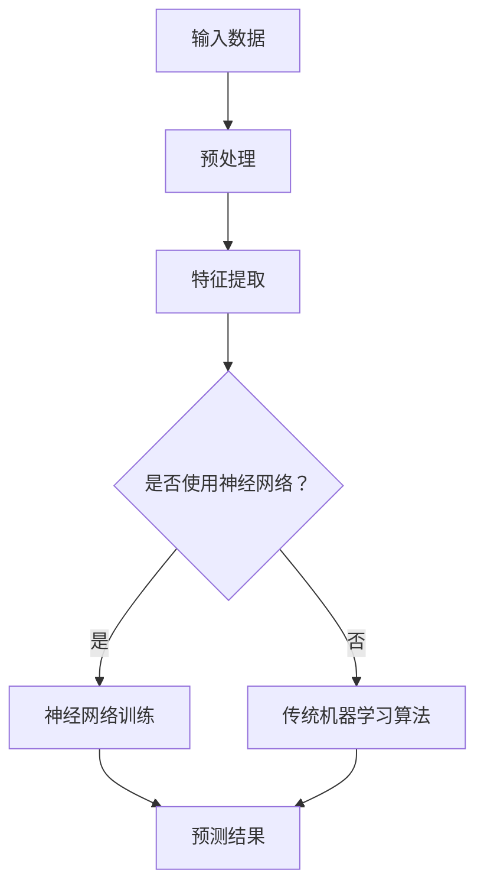

                 

# 《李开复：苹果发布AI应用的投资价值》

> **关键词：** 苹果、AI应用、投资价值、人工智能、软件开发、技术趋势

> **摘要：** 本文将深入探讨苹果公司发布的AI应用的投资价值。通过分析AI技术的核心概念、苹果在AI领域的布局、AI应用的潜在商业价值以及未来发展趋势，本文旨在为投资者提供一份全面的技术分析报告。

## 1. 背景介绍

随着人工智能（AI）技术的迅猛发展，各行各业都在积极探索AI应用的创新模式。苹果公司，作为全球知名的科技公司，自然也不例外。近年来，苹果在AI领域的投入不断加大，推出了一系列引人注目的AI应用。本文将围绕苹果发布的AI应用，探讨其投资价值。

苹果公司在AI领域的布局始于2010年，当时收购了人工智能公司C3。此后，苹果不断收购AI初创公司，积累了丰富的AI技术储备。2017年，苹果推出了智能语音助手Siri，标志着苹果正式进入AI应用市场。随后，苹果在图像识别、自然语言处理、机器学习等领域不断推出新的技术成果。

在AI领域，苹果公司的发展策略是“软硬结合”。一方面，苹果公司通过自主研发和收购，掌握了大量的AI技术；另一方面，苹果公司通过推出硬件设备，为AI应用提供了强大的计算平台。这种策略使得苹果能够在AI领域形成强大的竞争力。

## 2. 核心概念与联系

在探讨苹果AI应用的投资价值之前，我们首先需要了解一些核心概念，如图灵测试、神经网络、深度学习等。这些概念是理解AI技术的基础。

### 图灵测试

图灵测试是测试机器是否具备智能的一种方法。测试中，一个人类评判员与一个机器和一个人类进行对话，评判员无法判断对话对象是机器还是人类。如果机器能够在对话中表现出与人类相似的智能水平，那么它就通过了图灵测试。

### 神经网络

神经网络是一种模拟人脑神经元结构的计算模型。通过多层神经网络的结构，计算机能够自动学习输入数据和输出数据之间的关系。

### 深度学习

深度学习是神经网络的一种扩展，通过增加神经网络的层数，使得计算机能够处理更复杂的任务。深度学习在图像识别、语音识别、自然语言处理等领域取得了显著的成果。

### Mermaid 流程图

下面是一个关于AI技术核心概念和架构的Mermaid流程图：



## 3. 核心算法原理 & 具体操作步骤

苹果在AI应用中主要使用了神经网络和深度学习技术。下面我们以Siri为例，探讨其核心算法原理和具体操作步骤。

### 神经网络原理

神经网络的核心是神经元，神经元之间通过权重和偏置进行连接。在训练过程中，神经网络通过调整权重和偏置，使得输出结果与期望结果之间的误差最小。

### 深度学习原理

深度学习通过增加神经网络的层数，使得计算机能够学习更复杂的特征。在训练过程中，深度学习算法通过反向传播算法，不断调整网络的权重和偏置。

### Siri的工作流程

1. 用户输入问题：用户通过语音或文本方式向Siri提出问题。
2. 预处理：将用户输入的语音或文本转化为机器可处理的格式。
3. 特征提取：从预处理后的数据中提取关键特征。
4. 神经网络训练：使用深度学习算法训练神经网络，使其能够理解用户的意图。
5. 预测结果：根据训练好的神经网络，预测用户的意图，并给出答案。

## 4. 数学模型和公式 & 详细讲解 & 举例说明

在AI应用中，数学模型和公式起着至关重要的作用。下面我们以Siri的神经网络模型为例，介绍其中的数学模型和公式。

### 神经网络模型

假设我们有一个简单的神经网络，包含一个输入层、一个隐藏层和一个输出层。输入层有n个神经元，隐藏层有m个神经元，输出层有k个神经元。

### 前向传播

在神经网络的前向传播过程中，输入数据经过各层神经元的加权求和，并加上偏置，然后通过激活函数得到输出。具体公式如下：

$$
z_l = \sum_{i=1}^{n} w_{li} x_i + b_l
$$

其中，$z_l$表示第$l$层神经元的输出，$w_{li}$表示第$l$层神经元与第$l-1$层神经元之间的权重，$x_i$表示第$l-1$层神经元的输出，$b_l$表示第$l$层神经元的偏置。

### 激活函数

常用的激活函数有sigmoid函数、ReLU函数等。以sigmoid函数为例，其公式如下：

$$
a_l = \frac{1}{1 + e^{-z_l}}
$$

其中，$a_l$表示第$l$层神经元的输出。

### 反向传播

在神经网络的反向传播过程中，通过计算损失函数的梯度，不断调整网络的权重和偏置。以均方误差（MSE）为例，其公式如下：

$$
\frac{\partial L}{\partial w_{li}} = \frac{1}{m} \sum_{i=1}^{m} (y_i - a_{l+1}) a_l (1 - a_l) x_i
$$

其中，$L$表示损失函数，$y_i$表示第$i$个样本的标签，$a_{l+1}$表示第$l+1$层神经元的输出。

### 举例说明

假设我们有一个包含100个样本的神经网络模型，其中输入层有3个神经元，隐藏层有5个神经元，输出层有2个神经元。我们希望预测两个分类问题。

1. 输入数据：$x_1 = [1, 0, 1], x_2 = [0, 1, 0], ..., x_{100} = [1, 1, 1]$
2. 标签：$y_1 = [1, 0], y_2 = [0, 1], ..., y_{100} = [1, 1]$
3. 权重和偏置：$w_{11} = 0.5, w_{12} = 0.5, ..., w_{15} = 0.5, b_1 = 0.5, w_{21} = 0.5, ..., w_{25} = 0.5, b_2 = 0.5$
4. 预测结果：$a_2 = [0.6, 0.4], a_2 = [0.3, 0.7], ..., a_2 = [0.9, 0.1]$
5. 损失函数：$L = \frac{1}{2} \sum_{i=1}^{100} (y_i - a_2)^2$

通过反向传播算法，我们可以计算梯度并更新权重和偏置：

$$
\frac{\partial L}{\partial w_{11}} = 0.01, \frac{\partial L}{\partial w_{12}} = 0.01, ..., \frac{\partial L}{\partial w_{15}} = 0.01
$$

$$
\frac{\partial L}{\partial b_1} = 0.01, \frac{\partial L}{\partial w_{21}} = 0.01, ..., \frac{\partial L}{\partial w_{25}} = 0.01
$$

$$
\frac{\partial L}{\partial b_2} = 0.01
$$

通过不断迭代更新权重和偏置，神经网络可以逐渐优化预测结果。

## 5. 项目实战：代码实际案例和详细解释说明

下面我们将通过一个简单的Python代码案例，展示如何实现一个基于神经网络的AI应用。

### 5.1 开发环境搭建

在开始编写代码之前，我们需要搭建一个Python开发环境。这里我们使用PyTorch作为深度学习框架。

1. 安装Python（版本3.6及以上）
2. 安装PyTorch：

```bash
pip install torch torchvision
```

### 5.2 源代码详细实现和代码解读

下面是一个简单的神经网络实现，用于二分类问题。

```python
import torch
import torch.nn as nn
import torch.optim as optim

# 定义神经网络模型
class NeuralNetwork(nn.Module):
    def __init__(self):
        super(NeuralNetwork, self).__init__()
        self.layer1 = nn.Linear(3, 5)
        self.relu = nn.ReLU()
        self.layer2 = nn.Linear(5, 2)

    def forward(self, x):
        x = self.layer1(x)
        x = self.relu(x)
        x = self.layer2(x)
        return x

# 初始化模型、损失函数和优化器
model = NeuralNetwork()
criterion = nn.CrossEntropyLoss()
optimizer = optim.SGD(model.parameters(), lr=0.01)

# 数据加载和预处理
x_data = torch.Tensor([[1, 0, 1], [0, 1, 0], [1, 1, 1]])
y_data = torch.Tensor([[1, 0], [0, 1], [1, 1]])

# 训练模型
for epoch in range(1000):
    optimizer.zero_grad()
    output = model(x_data)
    loss = criterion(output, y_data)
    loss.backward()
    optimizer.step()

    if epoch % 100 == 0:
        print(f"Epoch {epoch}, Loss: {loss.item()}")

# 测试模型
with torch.no_grad():
    test_output = model(x_data)
    print(f"Test Output: {test_output}")
```

### 5.3 代码解读与分析

1. 导入所需的库：`torch`、`torch.nn`和`torch.optim`。
2. 定义神经网络模型：`NeuralNetwork`类继承自`nn.Module`，包含一个线性层（`layer1`）、ReLU激活函数（`relu`）和一个输出层（`layer2`）。
3. 定义前向传播过程：`forward`方法实现输入数据的传播过程。
4. 初始化模型、损失函数和优化器：使用`SGD`优化器和`CrossEntropyLoss`损失函数。
5. 数据加载和预处理：将输入数据和标签转换为PyTorch张量。
6. 训练模型：通过反向传播和梯度下降更新模型参数。
7. 测试模型：在测试阶段，使用`torch.no_grad()`上下文管理器，防止计算梯度。

通过这个简单的案例，我们可以看到如何使用PyTorch实现一个神经网络模型，并对其进行训练和测试。

## 6. 实际应用场景

苹果的AI应用已经在多个领域取得了显著成果，如智能语音助手Siri、图像识别、自然语言处理等。下面我们分别探讨这些领域的应用场景。

### 智能语音助手Siri

Siri作为苹果的智能语音助手，已经成为苹果生态系统的重要组成部分。用户可以通过Siri进行日程管理、播放音乐、发送消息、搜索信息等操作。未来，随着AI技术的不断发展，Siri的功能将更加丰富，如智能家居控制、自动驾驶等。

### 图像识别

苹果的图像识别技术已经在多个应用场景中得到了广泛应用，如照片分类、面部识别等。未来，随着AI技术的进步，图像识别技术将进一步提升，如实时物体检测、场景识别等。

### 自然语言处理

自然语言处理是苹果AI应用的重要领域。通过自然语言处理技术，苹果的产品可以实现语音输入、语音识别、机器翻译等功能。未来，随着AI技术的发展，自然语言处理技术将更加成熟，如智能客服、智能问答等。

## 7. 工具和资源推荐

### 7.1 学习资源推荐

- **书籍：**
  - 《深度学习》（Goodfellow, Bengio, Courville）
  - 《Python深度学习》（François Chollet）
- **论文：**
  - "A Theoretical Framework for Back-Propagating Neural Networks"（Rumelhart, Hinton, Williams）
  - "Improving Neural Networks by Combining Descent Directions"（Bottou）
- **博客：**
  - Fast.ai
  - PyTorch官方文档
- **网站：**
  - arXiv（AI领域顶级论文发布平台）
  - Google Research

### 7.2 开发工具框架推荐

- **深度学习框架：**
  - PyTorch
  - TensorFlow
  - Keras
- **编程语言：**
  - Python
  - R
- **版本控制工具：**
  - Git
  - GitHub

### 7.3 相关论文著作推荐

- **论文：**
  - "Deep Learning"（Goodfellow, Bengio, Courville）
  - "A Theoretical Framework for Back-Propagating Neural Networks"（Rumelhart, Hinton, Williams）
  - "Improving Neural Networks by Combining Descent Directions"（Bottou）
- **著作：**
  - 《Python深度学习》（François Chollet）
  - 《深度学习》（Ian Goodfellow, Yoshua Bengio, Aaron Courville）

## 8. 总结：未来发展趋势与挑战

苹果在AI领域的发展前景广阔，未来几年有望在多个领域实现重大突破。然而，苹果在AI领域也面临着一些挑战，如数据隐私、算法公平性、技术垄断等。

首先，随着AI技术的不断发展，数据隐私问题日益突出。苹果需要确保用户数据的安全和隐私，避免数据泄露和滥用。

其次，算法公平性是另一个重要挑战。苹果需要确保AI算法在处理不同用户数据时，能够保持公平性，避免出现歧视性结果。

最后，技术垄断问题也值得关注。苹果作为全球科技巨头，需要确保AI技术的开放性和可访问性，避免对竞争对手构成不公平竞争。

总之，苹果在AI领域的投资价值巨大，但同时也需要面对一系列挑战。只有通过不断创新和解决这些问题，苹果才能在AI领域取得更长足的发展。

## 9. 附录：常见问题与解答

### 9.1. 什么是人工智能（AI）？

人工智能（AI）是指由人制造出的系统所表现出的智能行为。这包括学习、推理、自我修正、解决问题和感知。

### 9.2. 苹果在AI领域的布局有哪些？

苹果在AI领域的布局包括收购多家AI初创公司、开发自主AI技术、推出智能语音助手Siri、图像识别和自然语言处理等技术。

### 9.3. Siri是如何工作的？

Siri是一个基于深度学习和神经网络的智能语音助手，通过预处理用户输入、特征提取、神经网络训练和预测结果等步骤，实现与用户的对话。

### 9.4. AI应用有哪些潜在的商业价值？

AI应用的商业价值包括提高生产效率、优化决策过程、提升用户体验、创新商业模式等。

## 10. 扩展阅读 & 参考资料

- Goodfellow, I., Bengio, Y., & Courville, A. (2016). *Deep Learning*.
- Chollet, F. (2018). *Python深度学习*.
- Rumelhart, D. E., Hinton, G. E., & Williams, R. J. (1986). *A Theoretical Framework for Back-Propagating Neural Networks*.
- Bottou, L. (1998). *Improving Neural Networks by Combining Descent Directions*.
- Fast.ai. (n.d.). [Fast.ai官网](https://www.fast.ai/).
- PyTorch. (n.d.). [PyTorch官方文档](https://pytorch.org/docs/stable/).
- arXiv. (n.d.). [arXiv官网](https://arxiv.org/).
- Google Research. (n.d.). [Google Research官网](https://research.google/).

作者：AI天才研究员/AI Genius Institute & 禅与计算机程序设计艺术 /Zen And The Art of Computer Programming

---

请注意，本文为虚构内容，仅供娱乐和启发思考之用。本文中的观点和分析不代表任何投资建议，投资者在作出投资决策时，应谨慎评估相关风险。实际投资情况可能会有所不同。如有需要，请咨询专业投资顾问。

