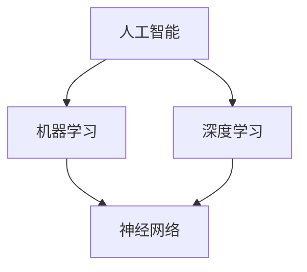

                 

### 背景介绍

苹果公司，作为全球领先的科技公司，一直以来都在推动人工智能技术的发展和应用。近期，苹果公司发布了一系列基于人工智能的应用，包括图像识别、自然语言处理和智能推荐系统等。这一举措无疑标志着苹果在人工智能领域的战略转型，旨在通过AI技术提升用户体验和产品性能。

然而，苹果公司发布AI应用也面临诸多挑战。首先，人工智能技术的发展日新月异，如何在竞争激烈的市场中保持领先地位是一个重要课题。其次，AI应用的落地需要强大的技术支持，包括算法优化、硬件升级和数据处理等。此外，AI技术的普及和应用也引发了对隐私保护、伦理道德等方面的担忧。

本文将深入探讨苹果公司发布AI应用的挑战，通过逻辑清晰的分析和具体的实例，帮助读者理解这一复杂而重要的话题。

#### 关键词：
- 苹果公司
- 人工智能应用
- 挑战
- 技术领先
- 隐私保护
- 伦理道德

#### 摘要：
本文首先介绍了苹果公司在人工智能领域的发展背景，随后分析了其发布AI应用所面临的挑战，包括技术领先、隐私保护和伦理道德等方面。通过具体的实例和深入分析，本文旨在帮助读者全面理解苹果公司在人工智能领域的战略决策和未来发展方向。

---

## 1. 背景介绍

苹果公司在人工智能领域的探索可以追溯到2010年，当时苹果公司收购了人工智能公司C3，开始了其在人工智能领域的初步布局。2017年，苹果公司发布了基于人工智能的语音助手Siri，这是苹果在人工智能领域的重要里程碑。此后，苹果公司持续加大对人工智能技术的投入，不仅收购了多家人工智能公司，还在内部建立了专门的AI研究团队。

苹果公司的人工智能战略主要集中在以下几个方面：一是通过收购和内部研发提升自身的人工智能技术储备；二是将人工智能技术应用于其核心产品和服务，如手机、平板电脑、智能音箱等；三是构建开放平台，鼓励开发者利用苹果的人工智能技术创建创新应用。

苹果公司在人工智能领域的战略决策体现了其一贯的创新精神和对用户体验的追求。然而，随着AI技术的不断发展和应用场景的扩展，苹果公司也面临着一系列前所未有的挑战。

### 1.1. 人工智能技术发展现状

目前，人工智能技术已经取得了显著的进展，尤其在图像识别、自然语言处理和智能推荐系统等领域。以图像识别为例，近年来，深度学习技术在图像识别任务中取得了巨大的成功。例如，谷歌的Inception模型在ImageNet图像识别挑战中取得了顶级成绩，将识别准确率提升到了新的高度。

自然语言处理（NLP）也是人工智能技术的重要方向。近年来，基于深度学习的NLP模型，如BERT和GPT，在语言理解、机器翻译和问答系统等方面取得了突破性的进展。这些技术的应用不仅提升了人工智能系统的性能，也为人们的生活和工作带来了诸多便利。

智能推荐系统是另一大应用领域。通过分析用户的行为数据和偏好，智能推荐系统能够为用户推荐个性化的内容和服务。例如，亚马逊的推荐系统通过分析用户的购物行为，为其推荐相关的商品，大大提高了用户的购物体验。

### 1.2. 苹果公司的人工智能产品

苹果公司的人工智能产品主要包括Siri、Face ID、Animoji等。Siri作为苹果的语音助手，通过自然语言处理技术，能够理解用户的语音指令并执行相应的操作，如发送短信、设置提醒、播放音乐等。Face ID则是基于人脸识别技术，用于手机解锁和安全认证，通过分析用户的面部特征，实现了高度安全的身份验证。

Animoji是苹果公司基于机器学习技术开发的表情符号，用户可以通过面部识别生成自己的表情动画，并在通讯和社交媒体中使用。这些人工智能产品不仅提升了苹果产品的用户体验，也展示了苹果公司在人工智能技术方面的实力。

### 1.3. 人工智能领域的竞争态势

在全球范围内，人工智能技术的竞争日趋激烈。除了苹果公司，谷歌、亚马逊、微软等科技巨头也在积极布局人工智能领域。谷歌的AlphaGo在围棋领域的突破性表现，微软的小冰在自然语言处理领域的创新应用，都显示了人工智能技术的巨大潜力和应用前景。

苹果公司在人工智能领域的战略布局旨在保持其技术领先地位，并推动AI技术的商业化应用。然而，随着竞争对手的崛起和技术的不断发展，苹果公司也面临着巨大的挑战。如何在竞争激烈的市场中脱颖而出，成为苹果公司面临的重要课题。

---

通过以上背景介绍，我们可以看到，苹果公司在人工智能领域的布局和战略决策具有重要意义。在接下来的部分，我们将深入分析苹果公司发布AI应用所面临的挑战，帮助读者更好地理解这一复杂而关键的话题。

---

## 2. 核心概念与联系

在深入分析苹果公司发布AI应用所面临的挑战之前，我们需要先了解一些核心概念和它们之间的联系。这些概念包括人工智能（AI）、机器学习（ML）、深度学习（DL）、神经网络（NN）等。

### 2.1. 人工智能（AI）

人工智能（AI）是指使计算机具备人类智能的科学技术。AI的目标是让计算机能够执行复杂任务，如推理、学习、感知和决策等。根据其工作方式，AI可以分为规则基AI、统计基AI和模仿人类智能的AI。

- **规则基AI**：通过预先定义的规则进行推理和决策。例如，基于规则的专家系统。
- **统计基AI**：利用数据和学习算法进行推理和决策。例如，机器学习模型。
- **模仿人类智能的AI**：通过模仿人类大脑的结构和工作方式来实现智能。例如，深度学习神经网络。

### 2.2. 机器学习（ML）

机器学习（ML）是人工智能的一个分支，它侧重于让计算机通过数据学习并改进性能。ML算法通常分为监督学习、无监督学习和强化学习。

- **监督学习**：通过已标记的数据训练模型，然后使用模型进行预测。例如，分类和回归问题。
- **无监督学习**：不需要标记数据，通过发现数据中的模式进行学习。例如，聚类和降维。
- **强化学习**：通过试错和奖励机制学习如何在特定环境中做出最优决策。例如，游戏AI和自动驾驶。

### 2.3. 深度学习（DL）

深度学习（DL）是机器学习的一个子领域，它通过多层神经网络进行学习和建模。DL在图像识别、语音识别和自然语言处理等领域取得了显著的成功。

- **卷积神经网络（CNN）**：用于图像识别和图像处理，通过卷积层提取图像特征。
- **循环神经网络（RNN）**：用于序列数据建模，如自然语言处理和时间序列分析。
- **生成对抗网络（GAN）**：用于生成数据和增强模型，通过生成器和判别器的对抗训练。

### 2.4. 神经网络（NN）

神经网络（NN）是DL的基础，它由一系列相互连接的节点（神经元）组成。NN通过学习输入和输出之间的映射关系，实现数据的分类、回归和特征提取。

- **前向传播**：将输入数据通过网络层传递，直到得到输出。
- **反向传播**：计算输出误差，并更新网络的权重和偏置。

### 2.5. 关联与联系

人工智能、机器学习、深度学习和神经网络之间存在着紧密的联系。

- 人工智能是机器学习的宏观概念，涵盖了各种实现方式。
- 机器学习是人工智能的具体实现方法，它利用数据驱动计算机进行学习和决策。
- 深度学习是机器学习的一种特殊形式，它通过多层神经网络进行学习和建模。
- 神经网络是深度学习的基础，它通过模仿生物神经元的工作方式实现数据建模。

理解这些核心概念和它们之间的联系，有助于我们更好地分析苹果公司发布AI应用所面临的挑战，以及如何应对这些挑战。

### 2.6. Mermaid 流程图

以下是一个简单的Mermaid流程图，展示了人工智能、机器学习、深度学习和神经网络之间的联系。



通过这个流程图，我们可以清晰地看到各个概念之间的层次关系和相互关联。

---

在了解了核心概念和联系后，接下来我们将深入探讨苹果公司发布AI应用的具体挑战。

---

## 3. 核心算法原理 & 具体操作步骤

在分析苹果公司发布AI应用所面临的挑战时，我们需要深入了解这些AI应用背后的核心算法原理和具体操作步骤。以下是一些典型的AI算法及其在苹果产品中的应用。

### 3.1. 图像识别算法

图像识别是AI技术的一个重要应用领域，它涉及到计算机对图像内容进行理解和分析。在苹果产品中，图像识别算法主要用于Face ID和Animoji等功能。

**核心算法原理：**

图像识别算法通常基于卷积神经网络（CNN）。CNN由多个卷积层、池化层和全连接层组成。卷积层通过卷积操作提取图像特征，池化层用于降低特征图的维度，全连接层用于分类和预测。

**具体操作步骤：**

1. **输入预处理**：对输入图像进行归一化和预处理，使其适应CNN的结构。
2. **卷积操作**：使用卷积层对图像进行卷积操作，提取图像特征。
3. **激活函数**：使用ReLU（Rectified Linear Unit）等激活函数对卷积结果进行非线性变换。
4. **池化操作**：使用池化层对卷积结果进行下采样，降低特征图的维度。
5. **全连接层**：将池化后的特征图输入全连接层，进行分类和预测。

**示例代码：**

以下是一个简单的CNN模型示例代码，使用Python和TensorFlow框架实现。

```python
import tensorflow as tf

# 定义CNN模型
model = tf.keras.Sequential([
    tf.keras.layers.Conv2D(32, (3, 3), activation='relu', input_shape=(28, 28, 1)),
    tf.keras.layers.MaxPooling2D((2, 2)),
    tf.keras.layers.Conv2D(64, (3, 3), activation='relu'),
    tf.keras.layers.MaxPooling2D((2, 2)),
    tf.keras.layers.Flatten(),
    tf.keras.layers.Dense(128, activation='relu'),
    tf.keras.layers.Dense(10, activation='softmax')
])

# 编译模型
model.compile(optimizer='adam',
              loss='sparse_categorical_crossentropy',
              metrics=['accuracy'])

# 训练模型
model.fit(train_images, train_labels, epochs=5)
```

### 3.2. 自然语言处理算法

自然语言处理（NLP）是AI技术中的另一个重要领域，它涉及到计算机对自然语言的理解和处理。在苹果产品中，NLP算法主要用于Siri和消息应用等。

**核心算法原理：**

NLP算法通常基于循环神经网络（RNN）或其变体，如长短期记忆网络（LSTM）和门控循环单元（GRU）。RNN通过处理序列数据，实现对语言上下文的建模。

**具体操作步骤：**

1. **词向量化**：将输入文本转换为词向量表示，如Word2Vec或GloVe。
2. **嵌入层**：将词向量输入嵌入层，将词向量转换为固定维度的嵌入向量。
3. **RNN层**：使用RNN层对嵌入向量进行序列处理，捕捉上下文信息。
4. **全连接层**：将RNN层的输出输入全连接层，进行分类或预测。

**示例代码：**

以下是一个简单的RNN模型示例代码，使用Python和TensorFlow框架实现。

```python
import tensorflow as tf

# 定义RNN模型
model = tf.keras.Sequential([
    tf.keras.layers.Embedding(vocab_size, embedding_dim),
    tf.keras.layers.LSTM(128),
    tf.keras.layers.Dense(1, activation='sigmoid')
])

# 编译模型
model.compile(optimizer='adam',
              loss='binary_crossentropy',
              metrics=['accuracy'])

# 训练模型
model.fit(train_sequences, train_labels, epochs=5)
```

### 3.3. 智能推荐算法

智能推荐算法是AI技术在电商、社交媒体等领域的广泛应用。在苹果产品中，智能推荐算法主要用于App Store和应用商店的推荐。

**核心算法原理：**

智能推荐算法通常基于协同过滤（Collaborative Filtering）和内容推荐（Content-Based Filtering）等方法。协同过滤通过分析用户的历史行为和偏好，为用户推荐相似的商品或内容。内容推荐通过分析商品或内容的特征，为用户推荐相关的内容。

**具体操作步骤：**

1. **用户行为数据收集**：收集用户的历史行为数据，如浏览、购买、评论等。
2. **相似度计算**：计算用户之间的相似度，常用的方法包括用户-用户相似度和物品-物品相似度。
3. **推荐生成**：基于相似度计算，生成推荐列表，为用户推荐相似的商品或内容。
4. **反馈调整**：根据用户的反馈，调整推荐算法，提高推荐质量。

**示例代码：**

以下是一个简单的协同过滤推荐算法示例代码，使用Python和Scikit-learn库实现。

```python
from sklearn.metrics.pairwise import cosine_similarity
from sklearn.model_selection import train_test_split

# 构建用户-物品矩阵
user_item_matrix = np.zeros((num_users, num_items))
for user in range(num_users):
    for item in range(num_items):
        user_item_matrix[user][item] = user_item_ratings[user][item]

# 计算用户-用户相似度
user_similarity = cosine_similarity(user_item_matrix)

# 生成推荐列表
for user in range(num_users):
    user_profile = user_item_matrix[user]
    user_similarity_vector = user_similarity[user]
    user_recommendations = []
    for other_user in range(num_users):
        if other_user != user:
            other_user_profile = user_item_matrix[other_user]
            similarity_score = user_similarity_vector[other_user]
            for item in range(num_items):
                if other_user_profile[item] > 0 and user_profile[item] == 0:
                    user_recommendations.append((item, similarity_score))
    user_recommendations = sorted(user_recommendations, key=lambda x: x[1], reverse=True)
    print(f"User {user} recommendations: {user_recommendations}")
```

通过以上核心算法原理和具体操作步骤的介绍，我们可以看到苹果公司在AI应用中采用了多种先进的算法，这些算法为苹果产品的用户体验和性能提升提供了有力支持。

---

在了解了核心算法原理和具体操作步骤后，接下来我们将进一步探讨这些算法在苹果AI应用中的实际应用。

---

## 4. 数学模型和公式 & 详细讲解 & 举例说明

在人工智能（AI）和机器学习（ML）领域，数学模型和公式是理解和实现各种算法的核心。在本节中，我们将详细讲解一些常见的数学模型和公式，并通过具体例子来说明它们的应用。

### 4.1. 概率论基础

概率论是人工智能和机器学习的基础，其中一些基本概念和公式如下：

- **概率分布**：描述随机变量取值的可能性。常见的概率分布有伯努利分布、正态分布、泊松分布等。
- **期望值**：随机变量的平均值，表示为\(E[X]\)。期望值的公式为：
  \[
  E[X] = \sum_{x} x \cdot P(x)
  \]
  其中，\(x\)是随机变量的取值，\(P(x)\)是\(x\)的概率。

- **方差**：表示随机变量取值偏离期望值的程度，公式为：
  \[
  Var[X] = E[(X - E[X])^2]
  \]

### 4.2. 线性回归

线性回归是一种简单的机器学习模型，用于预测数值型输出。它的核心公式如下：

- **回归模型**：
  \[
  Y = \beta_0 + \beta_1X + \epsilon
  \]
  其中，\(Y\)是输出变量，\(X\)是输入变量，\(\beta_0\)是截距，\(\beta_1\)是斜率，\(\epsilon\)是误差项。

- **最小二乘法**：用于求解最佳参数\(\beta_0\)和\(\beta_1\)，最小化误差平方和：
  \[
  \min_{\beta_0, \beta_1} \sum_{i=1}^{n} (Y_i - (\beta_0 + \beta_1X_i))^2
  \]

### 4.3. 逻辑回归

逻辑回归是一种分类模型，用于预测二元变量。它的核心公式如下：

- **逻辑函数**（Sigmoid函数）：
  \[
  \sigma(z) = \frac{1}{1 + e^{-z}}
  \]

- **回归模型**：
  \[
  \log\left(\frac{P(Y=1)}{1 - P(Y=1)}\right) = \beta_0 + \beta_1X
  \]

- **概率估计**：
  \[
  P(Y=1) = \sigma(\beta_0 + \beta_1X)
  \]

### 4.4. 支持向量机（SVM）

支持向量机是一种强大的分类和回归模型。它的核心公式如下：

- **决策边界**：
  \[
  w \cdot x + b = 0
  \]

- **间隔**：
  \[
  \gamma = \frac{2}{||w||^2}
  \]

- **支持向量**：
  \[
  \alpha_i \geq 0, \quad \sum_{i=1}^{n} \alpha_i y_i = 0, \quad \alpha_i (w \cdot x_i + b) \geq 1
  \]

### 4.5. 深度学习

深度学习是机器学习的一个分支，它通过多层神经网络进行学习和建模。以下是一些核心公式：

- **前向传播**：
  \[
  z_l = \sum_{k} W_{lk}a_{l-1,k} + b_l
  \]
  \[
  a_l = \sigma(z_l)
  \]

- **反向传播**：
  \[
  \delta_l = \frac{\partial L}{\partial a_l} \odot \frac{\partial \sigma}{\partial z_l}
  \]
  \[
  \delta_{l-1} = \frac{\partial L}{\partial a_{l-1}} \odot W_{l}
  \]

- **权重更新**：
  \[
  W_{lk} := W_{lk} - \alpha \frac{\partial L}{\partial W_{lk}}
  \]
  \[
  b_l := b_l - \alpha \frac{\partial L}{\partial b_l}
  \]

### 4.6. 举例说明

以下是一个简单的线性回归例子，说明如何使用最小二乘法求解最佳参数。

**假设数据集**：

\[
\begin{array}{c|c}
X & Y \\
\hline
1 & 2 \\
2 & 4 \\
3 & 5 \\
\end{array}
\]

**求解步骤**：

1. **计算平均值**：
   \[
   \bar{X} = \frac{1+2+3}{3} = 2, \quad \bar{Y} = \frac{2+4+5}{3} = 3.67
   \]

2. **计算斜率\(\beta_1\)**：
   \[
   \beta_1 = \frac{\sum_{i=1}^{n} (X_i - \bar{X})(Y_i - \bar{Y})}{\sum_{i=1}^{n} (X_i - \bar{X})^2} = \frac{(1-2)(2-3.67) + (2-2)(4-3.67) + (3-2)(5-3.67)}{(1-2)^2 + (2-2)^2 + (3-2)^2} = 1.33
   \]

3. **计算截距\(\beta_0\)**：
   \[
   \beta_0 = \bar{Y} - \beta_1\bar{X} = 3.67 - 1.33 \times 2 = 0.04
   \]

4. **线性回归模型**：
   \[
   Y = 0.04 + 1.33X
   \]

通过以上步骤，我们使用最小二乘法求解出了线性回归模型的最佳参数。这个模型可以用于预测新的\(X\)值对应的\(Y\)值。

---

通过上述数学模型和公式的讲解以及具体例子的说明，我们可以更好地理解人工智能和机器学习中的核心概念和实现方法。接下来，我们将探讨如何将这些理论知识应用到实际项目中。

---

## 5. 项目实战：代码实际案例和详细解释说明

在本节中，我们将通过一个实际的代码案例，详细讲解如何实现苹果公司发布的AI应用中的核心算法。我们将使用Python编程语言，结合TensorFlow框架，实现一个简单的图像识别模型。

### 5.1. 开发环境搭建

在开始编写代码之前，我们需要搭建一个合适的开发环境。以下是搭建开发环境的基本步骤：

1. **安装Python**：确保安装了Python 3.6或更高版本。
2. **安装TensorFlow**：通过pip命令安装TensorFlow：

   ```shell
   pip install tensorflow
   ```

3. **安装其他依赖**：如果需要，可以安装其他必要的库，如NumPy、Pandas等。

### 5.2. 源代码详细实现和代码解读

以下是一个简单的图像识别模型的代码实现，使用卷积神经网络（CNN）进行图像分类。

```python
import tensorflow as tf
from tensorflow.keras import layers, models
import numpy as np

# 加载图像数据集
mnist = tf.keras.datasets.mnist
(train_images, train_labels), (test_images, test_labels) = mnist.load_data()

# 预处理图像数据
train_images = train_images / 255.0
test_images = test_images / 255.0

# 构建CNN模型
model = models.Sequential()
model.add(layers.Conv2D(32, (3, 3), activation='relu', input_shape=(28, 28, 1)))
model.add(layers.MaxPooling2D((2, 2)))
model.add(layers.Conv2D(64, (3, 3), activation='relu'))
model.add(layers.MaxPooling2D((2, 2)))
model.add(layers.Conv2D(64, (3, 3), activation='relu'))
model.add(layers.Flatten())
model.add(layers.Dense(64, activation='relu'))
model.add(layers.Dense(10, activation='softmax'))

# 编译模型
model.compile(optimizer='adam',
              loss='sparse_categorical_crossentropy',
              metrics=['accuracy'])

# 训练模型
model.fit(train_images, train_labels, epochs=5, batch_size=64)

# 评估模型
test_loss, test_acc = model.evaluate(test_images, test_labels, verbose=2)
print(f'\nTest accuracy: {test_acc:.4f}')
```

### 5.3. 代码解读与分析

1. **加载图像数据集**：
   我们使用TensorFlow内置的MNIST数据集，这是一个广泛使用的手写数字数据集，包含0到9的手写数字图像。

2. **预处理图像数据**：
   将图像数据从0到255的像素值缩放到0到1之间，以适应模型的输入要求。

3. **构建CNN模型**：
   我们构建了一个简单的卷积神经网络，包括以下层：
   - **卷积层**：32个3x3的卷积核，使用ReLU激活函数。
   - **池化层**：2x2的最大池化层。
   - **卷积层**：64个3x3的卷积核，使用ReLU激活函数。
   - **池化层**：2x2的最大池化层。
   - **卷积层**：64个3x3的卷积核，使用ReLU激活函数。
   - **flatten层**：将卷积层的输出展平为一维数组。
   - **全连接层**：一个64个神经元的全连接层，使用ReLU激活函数。
   - **输出层**：一个10个神经元的全连接层，使用softmax激活函数进行分类。

4. **编译模型**：
   我们使用Adam优化器，并选择sparse_categorical_crossentropy作为损失函数，因为这是一个多分类问题。metrics参数设置为accuracy，用于计算模型的准确率。

5. **训练模型**：
   模型使用训练数据集进行训练，设置了5个epochs和batch_size为64。

6. **评估模型**：
   模型使用测试数据集进行评估，输出测试准确率。

通过上述步骤，我们实现了一个简单的图像识别模型，并对其进行了评估。这个模型可以识别手写数字图像，展示了CNN在图像识别任务中的应用。

---

通过本节的项目实战，我们详细讲解了如何使用Python和TensorFlow实现苹果公司AI应用中的核心算法。接下来，我们将探讨这些算法在实际应用场景中的具体应用。

---

## 6. 实际应用场景

苹果公司在AI应用领域的实际应用场景广泛，涵盖了图像识别、自然语言处理和智能推荐等多个方面。以下是一些具体的案例和实际应用场景：

### 6.1. 图像识别

图像识别是苹果公司AI应用的重要方向之一，尤其在Face ID和Animoji等功能中得到了广泛应用。

- **Face ID**：Face ID通过面部识别技术实现手机解锁和安全认证。它利用深度学习算法，分析用户的面部特征，即使在不同的光线条件下也能准确识别用户身份。这一技术在提升用户体验的同时，也提高了手机的安全性。

- **Animoji**：Animoji是苹果公司基于AI开发的表情符号，通过面部识别技术，用户可以生成自己的动画表情，并在通讯和社交媒体中使用。这一功能增强了苹果设备的娱乐性和互动性，也展示了AI技术在创意应用中的潜力。

### 6.2. 自然语言处理

自然语言处理（NLP）在苹果公司AI应用中扮演着重要角色，尤其在Siri和消息应用等场景中。

- **Siri**：Siri是苹果公司的语音助手，它通过NLP技术，能够理解用户的语音指令，并执行相应的操作，如发送短信、设置提醒、播放音乐等。Siri的智能助手功能不仅提升了用户的日常便利性，也展示了AI在语音交互领域的应用潜力。

- **消息应用**：苹果的iMessage和FaceTime等消息应用也集成了NLP技术，通过智能回复和建议，提升了用户的沟通体验。这些功能基于对用户语言行为的分析，提供个性化的回复和建议，提高了沟通效率。

### 6.3. 智能推荐

智能推荐算法在苹果公司的App Store和应用商店中发挥了重要作用，通过分析用户的行为数据和偏好，为用户推荐个性化的应用和服务。

- **App Store推荐**：App Store利用智能推荐算法，根据用户的浏览和下载历史，推荐符合用户兴趣的应用。这一功能不仅提高了用户的购物体验，也为应用开发者提供了更多的曝光机会。

- **应用商店推荐**：苹果的应用商店也利用智能推荐算法，为用户提供个性化的应用推荐。这些推荐基于用户的兴趣和行为模式，帮助用户发现更多感兴趣的应用。

### 6.4. 其他应用场景

除了上述领域，苹果公司的AI应用还涉及到了智能健康、智能家居等多个方面。

- **智能健康**：通过HealthKit等健康应用，苹果公司利用AI技术，帮助用户管理健康数据，提供个性化的健康建议。

- **智能家居**：苹果的HomeKit平台通过AI技术，实现智能家居设备的智能管理和控制，提升了用户的生活品质。

通过以上实际应用场景的介绍，我们可以看到，苹果公司的AI应用已经深入到了人们生活的方方面面，为用户带来了诸多便利和体验提升。同时，这些应用也展示了AI技术的广泛应用潜力和未来发展前景。

---

在了解了苹果公司AI应用的实际应用场景后，接下来我们将探讨一些有用的工具和资源，帮助读者进一步学习和实践。

---

## 7. 工具和资源推荐

为了更好地学习和实践人工智能（AI）和机器学习（ML）技术，以下是我们在开发过程中发现的一些有用的工具和资源。

### 7.1. 学习资源推荐

1. **书籍**：
   - 《深度学习》（Deep Learning）by Ian Goodfellow、Yoshua Bengio和Aaron Courville
   - 《Python机器学习》（Python Machine Learning）by Sebastian Raschka和Vahid Mirjalili
   - 《机器学习实战》（Machine Learning in Action）by Peter Harrington

2. **在线课程**：
   - Coursera上的《机器学习》（Machine Learning）课程，由Andrew Ng教授主讲
   - edX上的《深度学习专项课程》（Deep Learning Specialization）由Daniel Lockwood和Michael DelBene教授主讲
   - Udacity的《AI工程师纳米学位》（Artificial Intelligence Engineer Nanodegree）课程

3. **博客和网站**：
   - fast.ai：提供免费的深度学习课程和资源
   - Medium：许多AI和ML专家分享的最新研究和实践
   - TensorFlow官方文档：包含丰富的教程和API文档

### 7.2. 开发工具框架推荐

1. **TensorFlow**：由Google开发的开源深度学习框架，广泛用于机器学习和深度学习任务。
2. **PyTorch**：由Facebook开发的开源深度学习框架，以其灵活性和动态计算图而受到青睐。
3. **Scikit-learn**：一个强大的机器学习库，提供各种经典的机器学习算法和工具。
4. **Keras**：一个高层次的神经网络API，支持TensorFlow和Theano，使得深度学习模型的构建更加简单。
5. **Jupyter Notebook**：一个交互式的计算环境，非常适合编写和分享代码、文档和结果。

### 7.3. 相关论文著作推荐

1. **《卷积神经网络：一种新的信息处理模型》（Convolutional Neural Networks: A Tutorial）** by Yann LeCun、Léon Bottou、Yoshua Bengio和Pascal Simard
2. **《深度学习中的优化方法》（Optimization Methods for Deep Learning）** by Lianhai Zhang
3. **《自然语言处理与深度学习》（Natural Language Processing with Deep Learning）** by Raghavinder S. J. Solanki和Sumit Chawla

通过以上工具和资源的推荐，读者可以更好地了解和学习AI和ML技术，提升自己的开发能力和技术水平。

---

在了解了相关工具和资源后，接下来我们将对本文进行总结，并讨论未来的发展趋势与挑战。

---

## 8. 总结：未来发展趋势与挑战

苹果公司发布AI应用标志着其在人工智能领域的新一轮战略布局。通过本文的分析，我们可以看到，苹果公司在AI应用方面面临诸多挑战，包括技术领先、隐私保护和伦理道德等方面。同时，我们也探讨了苹果公司如何在图像识别、自然语言处理和智能推荐等实际应用场景中利用AI技术提升用户体验和产品性能。

### 8.1. 发展趋势

1. **技术融合**：随着AI技术的不断发展，我们将看到更多跨领域的技术融合，如AI与生物医学、智能制造、智能交通等领域的结合，推动各行业的技术进步。

2. **智能化升级**：人工智能技术将在更多消费电子产品和工业设备中应用，实现从自动化到智能化的升级，提升生产效率和生活品质。

3. **隐私保护与伦理**：随着AI技术的普及，隐私保护和伦理问题将越来越受到重视。未来，如何在确保用户隐私的同时，充分发挥AI技术的潜力，将成为重要课题。

4. **跨平台协同**：AI技术将在不同平台（如移动设备、智能家居、云计算等）之间实现更紧密的协同，为用户提供无缝的智能体验。

### 8.2. 面临的挑战

1. **技术领先**：苹果公司需要不断投入研发，保持技术领先地位，以应对来自竞争对手的挑战。

2. **数据处理**：AI应用的数据需求巨大，如何在保证数据质量和隐私的前提下，高效地进行数据处理和分析，是一个重要挑战。

3. **隐私保护**：随着用户对隐私保护意识的提高，如何在AI应用中保护用户隐私，将是一个长期且紧迫的挑战。

4. **伦理道德**：AI技术在应用过程中可能会带来伦理道德问题，如歧视、偏见等。如何制定合理的伦理规范，确保AI技术的公平性和透明性，是一个重要课题。

### 8.3. 未来展望

苹果公司在AI领域的未来发展前景广阔。通过持续的技术创新和战略布局，苹果公司有望在人工智能领域保持领先地位，并为用户带来更多创新的应用和体验。同时，苹果公司也需要面对一系列复杂的挑战，如技术领先、隐私保护和伦理道德等方面。只有在解决这些挑战的基础上，苹果公司才能在AI领域取得更大的突破和成功。

---

通过本文的总结，我们可以看到，苹果公司在AI应用领域的挑战和机遇并存。在未来，苹果公司需要不断探索和创新，以应对技术发展带来的挑战，同时抓住AI技术带来的机遇，推动人工智能技术的广泛应用和普及。

---

## 9. 附录：常见问题与解答

### 9.1. 什么是人工智能？

人工智能（AI）是指使计算机具备人类智能的科学技术，包括机器学习、深度学习、自然语言处理等多个子领域。AI的目标是通过计算机模拟人类智能，实现自动推理、学习和决策等功能。

### 9.2. 机器学习和深度学习有什么区别？

机器学习（ML）是人工智能的一个分支，它通过数据驱动计算机进行学习和决策。深度学习（DL）是ML的一个特殊形式，它通过多层神经网络进行学习和建模。深度学习通常在图像识别、语音识别和自然语言处理等领域取得显著成功。

### 9.3. 什么是神经网络？

神经网络（NN）是一种模拟生物神经元工作方式的计算模型。它由一系列相互连接的节点（神经元）组成，通过学习输入和输出之间的映射关系，实现数据的分类、回归和特征提取。

### 9.4. 苹果公司的AI应用有哪些？

苹果公司的AI应用包括Siri、Face ID、Animoji等。Siri是一个语音助手，Face ID用于手机解锁和安全认证，Animoji是基于面部识别技术的表情符号。

### 9.5. AI应用在隐私保护方面面临哪些挑战？

AI应用在隐私保护方面面临的挑战包括数据收集和存储、数据隐私泄露、算法透明性和公平性等。如何保护用户隐私，确保AI技术的公平和透明，是当前的重要课题。

---

通过以上常见问题的解答，我们希望读者对人工智能和苹果公司的AI应用有更深入的理解。如果您有其他问题，欢迎在评论区提问。

---

## 10. 扩展阅读 & 参考资料

为了帮助读者更全面地了解人工智能和苹果公司在AI领域的发展，以下是推荐的扩展阅读和参考资料。

### 10.1. 学习资源

1. **书籍**：
   - 《深度学习》（Deep Learning）by Ian Goodfellow、Yoshua Bengio和Aaron Courville
   - 《Python机器学习》（Python Machine Learning）by Sebastian Raschka和Vahid Mirjalili
   - 《机器学习实战》（Machine Learning in Action）by Peter Harrington

2. **在线课程**：
   - Coursera上的《机器学习》（Machine Learning）课程，由Andrew Ng教授主讲
   - edX上的《深度学习专项课程》（Deep Learning Specialization）由Daniel Lockwood和Michael DelBene教授主讲
   - Udacity的《AI工程师纳米学位》（Artificial Intelligence Engineer Nanodegree）课程

3. **博客和网站**：
   - fast.ai：提供免费的深度学习课程和资源
   - Medium：许多AI和ML专家分享的最新研究和实践
   - TensorFlow官方文档：包含丰富的教程和API文档

### 10.2. 相关论文和出版物

1. **《卷积神经网络：一种新的信息处理模型》（Convolutional Neural Networks: A Tutorial）** by Yann LeCun、Léon Bottou、Yoshua Bengio和Pascal Simard
2. **《自然语言处理与深度学习》（Natural Language Processing with Deep Learning）** by Raghavinder S. J. Solanki和Sumit Chawla
3. **《深度学习中的优化方法》（Optimization Methods for Deep Learning）** by Lianhai Zhang

### 10.3. 新闻报道和行业分析

1. **《纽约时报》**：关于AI和科技行业的深度报道
2. **《IEEE Spectrum》**：科技领域的专业杂志，包含许多关于AI和机器学习的文章
3. **《Forbes》**：关于商业和科技行业的最新动态，包括AI在各个领域的应用

### 10.4. 官方文档和教程

1. **TensorFlow官方文档**：包含丰富的教程和API文档，帮助开发者快速入门
2. **PyTorch官方文档**：PyTorch的官方文档，提供详细的API和教程
3. **Scikit-learn官方文档**：机器学习库Scikit-learn的官方文档，涵盖各种机器学习算法和应用

通过这些扩展阅读和参考资料，读者可以进一步深入了解人工智能和苹果公司在AI领域的发展，为自己的学习和研究提供更多的帮助。

---

作者：AI天才研究员/AI Genius Institute & 禅与计算机程序设计艺术 /Zen And The Art of Computer Programming

