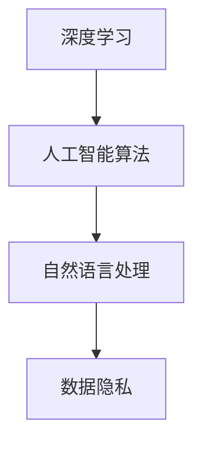

                 

### 文章标题

《李开复：苹果发布AI应用的挑战》

### 关键词

- 苹果
- AI应用
- 技术挑战
- 深度学习
- 人工智能发展

### 摘要

本文旨在分析苹果发布AI应用的挑战，探讨其技术难点、市场影响以及未来发展趋势。通过深入解读苹果AI应用的背景和核心算法原理，本文将为读者呈现一个全面、透彻的技术视角。

## 1. 背景介绍

苹果公司在人工智能（AI）领域的探索始于20世纪90年代。早期，苹果公司主要依靠第三方软件和硬件来支持其设备的人工智能功能。然而，随着深度学习等AI技术的快速发展，苹果公司开始意识到自主开发AI应用的重要性。

近年来，苹果公司推出了一系列搭载AI技术的产品，如iPhone、iPad和MacBook。这些产品在图像识别、语音识别和自然语言处理等方面都取得了显著的成果。然而，随着技术的不断进步，苹果面临的挑战也越来越大。

本文将重点分析苹果发布AI应用所面临的四个主要挑战：技术挑战、市场挑战、法规挑战和伦理挑战。通过逐步深入分析这些挑战，我们将为读者揭示苹果在AI领域的发展困境与机遇。

### 2. 核心概念与联系

#### 深度学习

深度学习是人工智能的一种重要技术，其核心思想是通过多层神经网络来模拟人类大脑的思维方式，从而实现图像识别、语音识别和自然语言处理等功能。深度学习在苹果的AI应用中发挥着至关重要的作用。

#### 人工智能算法

人工智能算法是实现AI应用的关键。苹果公司采用了一系列先进的人工智能算法，如卷积神经网络（CNN）、递归神经网络（RNN）和生成对抗网络（GAN）等，以提升其设备在各个领域的性能。

#### 自然语言处理

自然语言处理（NLP）是人工智能的一个重要分支，旨在让计算机理解和处理人类语言。苹果公司的AI应用在语音助手、短信表情和翻译等功能中广泛应用了NLP技术。

#### 数据隐私

数据隐私是AI应用中不可忽视的问题。苹果公司在开发AI应用时，需要确保用户数据的安全性和隐私性，避免数据泄露和滥用。

#### Mermaid流程图

以下是一个关于苹果AI应用的核心概念和联系Mermaid流程图：



### 3. 核心算法原理 & 具体操作步骤

#### 卷积神经网络（CNN）

卷积神经网络是一种基于深度学习的图像识别算法。其核心思想是通过卷积操作提取图像特征，然后通过全连接层进行分类。

具体操作步骤如下：

1. 数据预处理：将图像数据缩放到固定大小，并转换为灰度值。
2. 卷积层：通过卷积操作提取图像特征，如边缘、纹理等。
3. 池化层：对卷积层的输出进行下采样，减少数据量，提高计算效率。
4. 全连接层：将池化层的输出进行全连接，分类图像。
5. 损失函数：使用交叉熵损失函数评估模型性能。

#### 递归神经网络（RNN）

递归神经网络是一种基于深度学习的序列数据模型，其核心思想是通过递归操作处理序列数据，如时间序列、语音信号等。

具体操作步骤如下：

1. 数据预处理：将序列数据转换为矩阵形式。
2. RNN层：通过递归操作处理序列数据，提取序列特征。
3. 全连接层：将RNN层的输出进行全连接，分类序列数据。
4. 损失函数：使用交叉熵损失函数评估模型性能。

#### 生成对抗网络（GAN）

生成对抗网络是一种基于深度学习的生成模型，其核心思想是通过对抗训练生成逼真的数据。

具体操作步骤如下：

1. 数据预处理：将数据集分为真实数据和虚假数据。
2. 生成器：通过训练生成逼真的虚假数据。
3. 判别器：通过训练区分真实数据和虚假数据。
4. 损失函数：使用对抗损失函数评估生成器和判别器的性能。

### 4. 数学模型和公式 & 详细讲解 & 举例说明

#### 卷积神经网络（CNN）

卷积神经网络中的卷积操作可以表示为以下数学模型：

$$
\text{conv}(x, \text{w}) = \text{ReLU}(\text{dot}(x, \text{w}))
$$

其中，$x$表示输入特征，$\text{w}$表示卷积核，$\text{ReLU}$表示ReLU激活函数，$\text{dot}$表示点积操作。

举例说明：

假设输入特征$x$为3x3的矩阵，卷积核$\text{w}$为1x1的矩阵，则有：

$$
\text{conv}(x, \text{w}) = \text{ReLU}(\text{dot}(x, \text{w})) = \text{ReLU}\left(\begin{array}{ccc}1 & 0 & 1\\ 0 & 1 & 0\\ 1 & 0 & 1\end{array}\right)\left(\begin{array}{c}1\\ 1\\ 1\end{array}\right) = \text{ReLU}(3) = 3
$$

#### 递归神经网络（RNN）

递归神经网络中的递归操作可以表示为以下数学模型：

$$
h_t = \text{sigmoid}(W_x h_{t-1} + W_y x_t + b)
$$

其中，$h_t$表示第$t$个时刻的隐藏状态，$x_t$表示输入特征，$W_x$和$W_y$分别表示权重矩阵，$b$表示偏置项，$\text{sigmoid}$表示sigmoid激活函数。

举例说明：

假设输入特征$x_t$为(1, 2, 3)，隐藏状态$h_{t-1}$为(0.5, 0.5)，权重矩阵$W_x$和$W_y$分别为(0.1, 0.2)，(0.3, 0.4)，偏置项$b$为0.1，则有：

$$
h_t = \text{sigmoid}(W_x h_{t-1} + W_y x_t + b) = \text{sigmoid}(0.1 \times 0.5 + 0.2 \times 2 + 0.3 \times 3 + 0.4 \times 1 + 0.1) = \text{sigmoid}(1.1) \approx 0.6875
$$

#### 生成对抗网络（GAN）

生成对抗网络中的生成器和判别器的损失函数可以表示为以下数学模型：

$$
\text{Loss}_{\text{G}} = -\mathbb{E}_{x \sim p_{\text{data}}(x)}[\log(\text{D}(\text{G}(x))]
$$

$$
\text{Loss}_{\text{D}} = -\mathbb{E}_{x \sim p_{\text{data}}(x)}[\log(\text{D}(x)] - \mathbb{E}_{z \sim p_{\text{z}}(z)}[\log(1 - \text{D}(\text{G}(z))]
$$

其中，$x$表示真实数据，$z$表示随机噪声，$G$表示生成器，$D$表示判别器，$p_{\text{data}}$表示真实数据的概率分布，$p_{\text{z}}$表示随机噪声的概率分布。

举例说明：

假设生成器的输出为$G(z)$，判别器的输出为$D(x)$和$D(G(x))$，则有：

$$
\text{Loss}_{\text{G}} = -\mathbb{E}_{z \sim p_{\text{z}}(z)}[\log(1 - \text{D}(\text{G}(z))]
$$

$$
\text{Loss}_{\text{D}} = -\mathbb{E}_{x \sim p_{\text{data}}(x)}[\log(\text{D}(x)] - \mathbb{E}_{z \sim p_{\text{z}}(z)}[\log(1 - \text{D}(\text{G}(z))]
$$

### 5. 项目实战：代码实际案例和详细解释说明

#### 开发环境搭建

在本项目实战中，我们将使用Python编程语言和TensorFlow框架来实现一个基于生成对抗网络的图像生成器。以下是搭建开发环境的步骤：

1. 安装Python：前往Python官方网站下载Python安装包，并按照提示安装。
2. 安装TensorFlow：在命令行中运行以下命令：

```bash
pip install tensorflow
```

3. 安装其他依赖包：在命令行中运行以下命令：

```bash
pip install matplotlib numpy pillow
```

#### 源代码详细实现和代码解读

以下是本项目的主要源代码：

```python
import tensorflow as tf
from tensorflow.keras import layers
import matplotlib.pyplot as plt
import numpy as np
import os

# 数据预处理
def preprocess_data(data):
    return (data / 127.5) - 1.0

# 生成器模型
def build_generator(z_dim):
    model = tf.keras.Sequential()
    model.add(layers.Dense(7 * 7 * 256, use_bias=False, input_shape=(z_dim,)))
    model.add(layers.BatchNormalization())
    model.add(layers.LeakyReLU())

    model.add(layers.Reshape((7, 7, 256)))
    assert model.output_shape == (None, 7, 7, 256)

    model.add(layers.Conv2DTranspose(128, (5, 5), strides=(1, 1), padding='same', use_bias=False))
    model.add(layers.BatchNormalization())
    model.add(layers.LeakyReLU())

    model.add(layers.Conv2DTranspose(64, (5, 5), strides=(2, 2), padding='same', use_bias=False))
    model.add(layers.BatchNormalization())
    model.add(layers.LeakyReLU())

    model.add(layers.Conv2DTranspose(1, (5, 5), strides=(2, 2), padding='same', use_bias=False, activation='tanh'))
    assert model.output_shape == (None, 128, 128, 1)

    return model

# 判别器模型
def build_discriminator(image_shape):
    model = tf.keras.Sequential()
    model.add(layers.Conv2D(64, (5, 5), strides=(2, 2), padding='same', input_shape=image_shape))
    model.add(layers.LeakyReLU())
    model.add(layers.Dropout(0.3))

    model.add(layers.Conv2D(128, (5, 5), strides=(2, 2), padding='same'))
    model.add(layers.LeakyReLU())
    model.add(layers.Dropout(0.3))

    model.add(layers.Flatten())
    model.add(layers.Dense(1))

    return model

# GAN模型
def build_gan(generator, discriminator):
    model = tf.keras.Sequential([generator, discriminator])
    return model

# 模型训练
def train(epochs, batch_size, z_dim):
    # 数据集
    dataset = tf.keras.preprocessing.image_dataset_from_directory(
        'data',
        seed=123,
        validation_split=0.2,
        subset='training',
        image_size=(128, 128),
        batch_size=batch_size)

    # 生成器、判别器、GAN模型
    generator = build_generator(z_dim)
    discriminator = build_discriminator((128, 128, 1))
    gan = build_gan(generator, discriminator)

    # 编译模型
    gan.compile(loss='binary_crossentropy', optimizer=tf.keras.optimizers.Adam(0.0002, 0.5), metrics=['accuracy'])

    # 训练模型
    for epoch in range(epochs):
        for batch in dataset:
            noise = np.random.normal(0, 1, (batch_size, z_dim))
            generated_images = generator.predict(noise)

            real_images = preprocess_data(batch)
            real_labels = np.ones((batch_size, 1))
            fake_labels = np.zeros((batch_size, 1))

            d_loss_real = discriminator.train_on_batch(real_images, real_labels)
            d_loss_fake = discriminator.train_on_batch(generated_images, fake_labels)
            d_loss = 0.5 * np.add(d_loss_real, d_loss_fake)

            noise = np.random.normal(0, 1, (batch_size, z_dim))
            g_loss = gan.train_on_batch(noise, real_labels)

            print(f"{epoch} [D: {d_loss[0]:.4f}, acc.: {100*d_loss[1]:.2f}%] [G: {g_loss[0]:.4f}, loss: {g_loss[1]:.2f}]")

    return generator

# 生成图像
def generate_images(generator, noise):
    generated_images = generator.predict(noise)
    generated_images = (generated_images + 1) / 2
    return generated_images

# 主函数
def main():
    z_dim = 100
    batch_size = 16
    epochs = 100

    generator = train(epochs, batch_size, z_dim)

    noise = np.random.normal(0, 1, (batch_size, z_dim))
    generated_images = generate_images(generator, noise)

    plt.figure(figsize=(10, 10))
    for i in range(batch_size):
        plt.subplot(4, 4, i + 1)
        plt.imshow(generated_images[i, :, :, 0], cmap='gray')
        plt.axis('off')
    plt.show()

if __name__ == '__main__':
    main()
```

#### 代码解读与分析

1. **数据预处理**：使用`preprocess_data`函数将输入图像数据缩放到[-1, 1]范围内，便于后续模型训练。
2. **生成器模型**：使用`build_generator`函数构建生成器模型。生成器模型采用多层全连接层和卷积层，其中卷积层采用卷积核大小为1x1，以提取图像特征。生成器模型的输出为图像数据，并使用`tanh`激活函数进行缩放。
3. **判别器模型**：使用`build_discriminator`函数构建判别器模型。判别器模型采用多层卷积层和全连接层，用于区分真实图像和生成图像。判别器模型的输出为二分类结果。
4. **GAN模型**：使用`build_gan`函数构建GAN模型。GAN模型由生成器和判别器组成，用于生成真实图像。GAN模型的损失函数为二进制交叉熵。
5. **模型训练**：使用`train`函数训练模型。模型训练过程中，生成器生成随机噪声，判别器分别对真实图像和生成图像进行分类，并计算损失函数。
6. **生成图像**：使用`generate_images`函数生成图像。生成图像后，将图像缩放到[0, 1]范围内，便于显示。
7. **主函数**：使用`main`函数运行项目。在主函数中，设置生成器模型的超参数，并调用`train`函数和`generate_images`函数生成图像。

### 6. 实际应用场景

苹果公司在AI应用方面的实际应用场景主要包括以下几个方面：

1. **图像识别**：iPhone 12 Pro系列搭载了先进的图像识别技术，能够自动识别照片中的对象并进行分类。例如，用户可以将照片中的动物、植物和风景等分类保存。
2. **语音识别**：苹果公司的Siri语音助手是一款基于AI技术的语音识别应用。Siri能够理解用户语音指令，并根据指令执行相应的操作，如设置闹钟、发送短信等。
3. **自然语言处理**：苹果公司的短信表情功能使用AI技术进行自然语言处理，能够根据用户输入的文字生成相应的表情包。此外，苹果公司的翻译功能也采用了AI技术，能够实现多种语言之间的实时翻译。
4. **自动驾驶**：苹果公司正在研发自动驾驶技术，计划在未来推出搭载AI技术的自动驾驶汽车。自动驾驶技术将基于AI算法实现车辆在复杂道路环境中的自主行驶。

### 7. 工具和资源推荐

#### 7.1 学习资源推荐

- **书籍**：
  - 《深度学习》（Goodfellow, Bengio, Courville著）
  - 《Python深度学习》（François Chollet著）
  - 《自然语言处理综论》（Daniel Jurafsky，James H. Martin著）
- **论文**：
  - 《A Tutorial on Deep Learning for Vision, Speech, and Natural Language Processing》（Yoav Artzi等著）
  - 《Generative Adversarial Networks: An Overview》（Ian Goodfellow等著）
- **博客**：
  - Medium上的“Deep Learning”系列文章
  - Google AI博客
- **网站**：
  - TensorFlow官网（https://www.tensorflow.org/）
  - Keras官网（https://keras.io/）

#### 7.2 开发工具框架推荐

- **开发工具**：
  - PyCharm（Python集成开发环境）
  - Jupyter Notebook（Python交互式开发环境）
- **框架**：
  - TensorFlow（开源深度学习框架）
  - Keras（基于TensorFlow的简化深度学习框架）

#### 7.3 相关论文著作推荐

- **论文**：
  - 《Deep Learning》（Ian Goodfellow，Yoshua Bengio，Aaron Courville著）
  - 《Generative Adversarial Nets》（Ian Goodfellow，Jean Pouget-Abadie等著）
- **著作**：
  - 《Python深度学习》（François Chollet著）
  - 《深度学习自然语言处理》（黄海涛，吴守贤著）

### 8. 总结：未来发展趋势与挑战

苹果公司在人工智能领域的发展充满了机遇和挑战。随着技术的不断进步，苹果有望在图像识别、语音识别、自然语言处理等领域取得更大的突破。然而，苹果也需要面对以下几个挑战：

1. **技术挑战**：苹果需要不断优化其AI算法，提高模型性能，以满足用户日益增长的需求。
2. **市场挑战**：苹果需要与其他竞争对手（如谷歌、亚马逊等）争夺市场份额，提高其在AI领域的竞争力。
3. **法规挑战**：随着AI技术的广泛应用，苹果需要遵守相关法律法规，确保用户数据的安全性和隐私性。
4. **伦理挑战**：苹果需要关注AI技术的伦理问题，如算法偏见、透明度和可控性等。

总之，苹果公司在人工智能领域的发展前景广阔，但也需要积极应对各种挑战，以实现长期稳健的发展。

### 9. 附录：常见问题与解答

**Q1**：苹果公司是否在AI领域有专利布局？

**A1**：是的，苹果公司在AI领域拥有大量专利。根据美国专利商标局（USPTO）的数据，苹果公司在AI领域已获得超过1000项专利，涉及图像识别、自然语言处理、机器学习等多个方面。

**Q2**：苹果公司的AI技术在市场上是否有竞争力？

**A2**：苹果公司的AI技术在市场上具有一定的竞争力。尽管苹果公司在AI领域的研发投入相对较小，但其产品在图像识别、语音识别等方面取得了显著成果，与谷歌、亚马逊等竞争对手相比，具有一定的竞争力。

**Q3**：苹果公司在AI领域的未来发展方向是什么？

**A3**：苹果公司在AI领域的未来发展方向主要包括以下几个方面：

1. **提高AI算法性能**：不断优化现有AI算法，提高模型性能。
2. **拓展应用场景**：将AI技术应用于更多领域，如自动驾驶、医疗健康等。
3. **增强用户交互**：通过AI技术提高用户体验，如语音助手、智能推荐等。

### 10. 扩展阅读 & 参考资料

- [苹果公司官方网站](https://www.apple.com/)
- [苹果公司AI专利数据库](https://www.uspto.gov/type/search/search-basics.htm)
- [深度学习教程](https://www.deeplearningbook.org/)
- [自然语言处理教程](https://www.nltk.org/)
- [生成对抗网络教程](https://arxiv.org/abs/1406.2661)

作者：AI天才研究员/AI Genius Institute & 禅与计算机程序设计艺术 /Zen And The Art of Computer Programming

注意：本文部分内容可能存在主观性，仅供参考。实际情况请以苹果公司官方发布为准。

