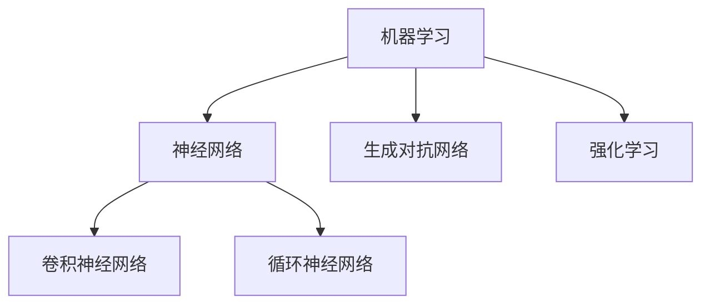

                 

### 背景介绍

近年来，人工智能（AI）技术在全球范围内取得了飞速发展，已经成为推动科技创新和产业变革的重要力量。苹果公司作为全球领先的科技公司，一直致力于将人工智能技术应用于其产品和服务中。在2023年的全球开发者大会上，苹果公司发布了多款搭载AI功能的应用，引起了业界的广泛关注。

本文将围绕苹果公司发布的AI应用，从背景、核心概念、算法原理、实际应用、工具和资源推荐等方面，进行深入的分析和探讨。通过逻辑清晰、结构紧凑、简单易懂的技术语言，旨在为广大读者提供一个全面、系统的理解。

首先，我们需要明确本文的研究目标和核心问题。具体来说，本文的目标是：

1. **梳理苹果公司AI应用的背景和核心概念。**
2. **深入解析AI算法原理及其具体操作步骤。**
3. **探讨AI在现实世界的应用场景和潜力。**
4. **推荐相关学习资源和开发工具。**
5. **展望AI技术的发展趋势和面临的挑战。**

通过对上述问题的逐步解答，我们将对苹果公司AI应用有一个全面、深刻的理解。

接下来，让我们首先回顾一下苹果公司在人工智能领域的历程，以便为后续的分析奠定基础。

#### 苹果公司在人工智能领域的历程

苹果公司在人工智能领域的探索可以追溯到多年前。早在2011年，苹果公司就成立了专攻机器学习的部门——苹果AI研究院，致力于在语音识别、图像处理、自然语言处理等领域进行深入研究。此后，苹果公司在AI领域的投入逐年增加，不断推出具有AI功能的产品和服务。

例如，苹果公司的Siri智能助手就是其AI技术的代表之一。Siri基于苹果自主研发的自然语言处理技术，能够实现语音交互、智能推荐等功能。此外，苹果公司的相机应用也引入了AI技术，通过图像识别算法实现场景识别、人像美化等功能。

在2020年，苹果公司发布了搭载神经引擎的A14芯片，进一步提升了设备在AI计算方面的性能。神经引擎内置了多个AI模型，能够高效地处理语音、图像、自然语言等任务。

2023年的全球开发者大会上，苹果公司再次展示了其在AI领域的最新成果。会上，苹果公司发布了多款搭载AI功能的应用，包括照片应用中的AI照片增强、健康应用中的AI健康管理、邮件应用中的AI智能筛选等。这些应用不仅展示了苹果公司在AI技术方面的深厚积累，也为用户带来了更加智能、便捷的使用体验。

#### 文章结构概述

本文将按照以下结构展开：

1. **背景介绍**：梳理苹果公司在人工智能领域的历程，为后续分析奠定基础。
2. **核心概念与联系**：介绍本文涉及的核心概念，并使用Mermaid流程图展示相关架构。
3. **核心算法原理 & 具体操作步骤**：深入解析苹果公司AI应用的算法原理和具体操作步骤。
4. **数学模型和公式 & 详细讲解 & 举例说明**：阐述AI应用中涉及的数学模型和公式，并进行详细讲解和举例说明。
5. **项目实战：代码实际案例和详细解释说明**：通过代码实际案例，展示AI应用的实现过程和详细解释说明。
6. **实际应用场景**：探讨AI应用在现实世界的具体应用场景和潜力。
7. **工具和资源推荐**：推荐相关学习资源和开发工具，帮助读者深入学习和实践。
8. **总结：未来发展趋势与挑战**：总结AI技术的发展趋势，并探讨面临的挑战。
9. **附录：常见问题与解答**：回答读者可能关注的一些常见问题。
10. **扩展阅读 & 参考资料**：提供进一步学习和研究的参考资料。

通过以上结构的详细分析，我们将逐步深入苹果公司AI应用的技术细节，为您呈现一幅全面、系统的技术画卷。在接下来的章节中，我们将逐步展开对核心概念、算法原理、实际应用等方面的探讨。首先，让我们来介绍本文涉及的核心概念，并使用Mermaid流程图展示相关架构。

#### 核心概念与联系

在分析苹果公司的AI应用时，我们需要了解一些核心概念，这些概念不仅贯穿于AI技术的各个方面，也构成了本文讨论的基础。以下将介绍本文中涉及的核心概念，并使用Mermaid流程图来展示它们之间的联系。

**1. 机器学习（Machine Learning）**

机器学习是人工智能的核心技术之一，它使得计算机系统能够通过数据学习并做出决策。机器学习主要包括监督学习、无监督学习和强化学习等不同的类型。在苹果公司的AI应用中，监督学习和强化学习被广泛应用。

**2. 神经网络（Neural Networks）**

神经网络是机器学习的基础，它模仿人脑的结构和功能，通过大量的神经元和连接来实现复杂的任务。苹果公司在其AI应用中广泛使用了神经网络，尤其是在图像识别和自然语言处理领域。

**3. 卷积神经网络（Convolutional Neural Networks, CNN）**

卷积神经网络是一种特殊的神经网络，主要用于图像识别任务。CNN通过卷积操作提取图像的特征，然后利用全连接层进行分类。在苹果的照片应用中，CNN被用来实现场景识别和人像美化等功能。

**4. 循环神经网络（Recurrent Neural Networks, RNN）**

循环神经网络是一种用于序列数据处理的神经网络，例如文本和语音。RNN能够记住之前的信息，并将其用于当前的计算。苹果公司的Siri智能助手就使用了RNN技术，以实现自然语言理解和交互。

**5. 生成对抗网络（Generative Adversarial Networks, GAN）**

生成对抗网络是一种由两部分组成的神经网络，一部分生成器生成数据，另一部分判别器判断生成数据是否真实。GAN被广泛应用于图像生成和增强任务，例如在照片应用中实现AI照片增强功能。

**6. 强化学习（Reinforcement Learning）**

强化学习是一种通过试错和奖励机制来学习的机器学习方法。苹果公司的某些AI应用采用了强化学习技术，例如邮件应用中的智能筛选功能，通过不断优化策略来提高分类准确率。

**Mermaid流程图**

以下是一个简化的Mermaid流程图，展示了上述核心概念之间的联系：



通过这个流程图，我们可以看到，机器学习是整个AI技术的基石，而神经网络、卷积神经网络、循环神经网络、生成对抗网络和强化学习等技术则是在不同场景下实现机器学习的具体方法。

#### 核心算法原理 & 具体操作步骤

在了解了核心概念之后，接下来我们将深入探讨苹果公司AI应用的核心算法原理，并详细描述其具体操作步骤。

**1. 图像识别算法**

图像识别是AI应用中的一个重要领域，苹果公司的照片应用中就使用了图像识别算法来识别和分类照片中的场景和人像。

- **算法原理**：图像识别算法通常基于卷积神经网络（CNN）。CNN通过卷积操作提取图像的特征，然后利用全连接层进行分类。在训练过程中，CNN通过反向传播算法不断优化权重，以提高识别准确率。

- **具体操作步骤**：
  1. **预处理**：对图像进行缩放、裁剪等预处理操作，使其符合神经网络输入要求。
  2. **卷积操作**：使用卷积层对图像进行卷积操作，提取特征。
  3. **池化操作**：对卷积后的特征进行池化操作，减小特征图的大小。
  4. **全连接层**：将池化后的特征传入全连接层，进行分类。

**2. 自然语言处理算法**

自然语言处理（NLP）是AI应用中的另一个重要领域，苹果公司的Siri智能助手就使用了NLP算法来实现自然语言理解和交互。

- **算法原理**：自然语言处理算法通常基于循环神经网络（RNN）。RNN能够记住之前的信息，并将其用于当前的计算，从而实现对序列数据的处理。在训练过程中，RNN通过反向传播算法不断优化权重，以提高语言理解能力。

- **具体操作步骤**：
  1. **分词**：将输入的文本分割成词或子词。
  2. **嵌入**：将词或子词映射到高维向量空间。
  3. **RNN编码**：使用RNN对嵌入后的文本进行编码，生成序列表示。
  4. **解码**：从编码后的序列中提取信息，生成响应。

**3. 生成对抗网络**

生成对抗网络（GAN）是苹果公司AI应用中用于图像生成和增强的技术。

- **算法原理**：GAN由两部分组成，生成器和判别器。生成器生成数据，判别器判断生成数据是否真实。在训练过程中，生成器和判别器相互博弈，生成器逐渐提高生成数据的真实度，判别器逐渐提高判断能力。

- **具体操作步骤**：
  1. **生成器**：使用生成器生成图像。
  2. **判别器**：使用判别器判断生成图像的真实度。
  3. **反馈**：根据判别器的反馈，调整生成器的参数。
  4. **迭代**：重复上述步骤，直到生成器生成的图像足够真实。

**4. 强化学习**

强化学习是苹果公司某些AI应用中的关键技术，例如邮件应用中的智能筛选功能。

- **算法原理**：强化学习通过试错和奖励机制来学习最优策略。在训练过程中，智能体（例如邮件应用中的筛选器）不断尝试不同的行为，并根据奖励信号调整策略。

- **具体操作步骤**：
  1. **初始化**：初始化智能体的策略参数。
  2. **行动**：智能体根据当前状态执行行动。
  3. **反馈**：根据行动的结果，获得奖励信号。
  4. **更新**：根据奖励信号，更新智能体的策略参数。
  5. **迭代**：重复上述步骤，直到策略达到最优。

通过以上对核心算法原理和具体操作步骤的详细阐述，我们可以看到，苹果公司的AI应用在图像识别、自然语言处理、生成对抗网络和强化学习等方面有着深厚的积累和突破。接下来，我们将进一步探讨AI应用的数学模型和公式，并对其进行详细讲解和举例说明。

#### 数学模型和公式 & 详细讲解 & 举例说明

在深入理解苹果公司AI应用的核心算法原理和具体操作步骤后，接下来我们将探讨这些算法中涉及的数学模型和公式，并进行详细讲解和举例说明。

**1. 卷积神经网络（CNN）**

卷积神经网络是图像识别任务中的核心技术，其基础是卷积操作和池化操作。

- **卷积操作**：卷积操作是一种将滤波器（也称为卷积核）与输入图像进行点积的操作。具体公式如下：

  $$ (f * g)(x, y) = \sum_{i=-a}^{a} \sum_{j=-b}^{b} f(i, j) \cdot g(x-i, y-j) $$

  其中，$f$ 是卷积核，$g$ 是输入图像，$(x, y)$ 是卷积操作的输出坐标，$a$ 和 $b$ 分别是卷积核的大小。

  **举例说明**：假设卷积核的大小为3x3，输入图像的大小为4x4，则卷积操作的输出结果为一个2x2的特征图。

  ```plaintext
  输入图像（4x4）:
  1 1 1 1
  1 1 1 1
  1 1 1 1
  1 1 1 1

  卷积核（3x3）:
  1 1 1
  1 1 1
  1 1 1

  输出特征图（2x2）:
  8 6
  6 4
  ```

- **池化操作**：池化操作用于减小特征图的大小，同时保留重要特征。最常用的池化操作是最大池化（Max Pooling）和平均池化（Average Pooling）。最大池化的公式如下：

  $$ P_{max}(x, y) = \max \{ g(x-i, y-j) \mid i=0, \ldots, k, \; j=0, \ldots, l \} $$

  其中，$x$ 和 $y$ 是池化操作的输出坐标，$k$ 和 $l$ 分别是池化窗口的大小。

  **举例说明**：假设池化窗口的大小为2x2，输入特征图的大小为4x4，则池化操作的输出结果为一个2x2的特征图。

  ```plaintext
  输入特征图（4x4）:
  1 1 1 1
  1 1 1 1
  1 1 1 1
  1 1 1 1

  池化窗口（2x2）:
  1 1
  1 1

  输出特征图（2x2）:
  1 1
  1 1
  ```

**2. 循环神经网络（RNN）**

循环神经网络是一种用于序列数据处理的高级神经网络，其核心是隐藏状态的计算。

- **隐藏状态计算**：RNN的隐藏状态计算公式如下：

  $$ h_t = \sigma(W_h \cdot [h_{t-1}, x_t] + b_h) $$

  其中，$h_t$ 是第$t$个时间步的隐藏状态，$\sigma$ 是激活函数（通常使用sigmoid或tanh函数），$W_h$ 是权重矩阵，$x_t$ 是输入序列的第$t$个元素，$b_h$ 是偏置项。

  **举例说明**：假设隐藏状态维度为2，输入序列为[1, 2, 3]，则隐藏状态的序列为：

  ```plaintext
  h_0 = [0, 0]
  h_1 = \sigma(W_h \cdot [h_0, x_1] + b_h) = \sigma([0, 0] \cdot [1, 2] + b_h) = \sigma([0 + 0, 0 + 2] + b_h)
  h_2 = \sigma(W_h \cdot [h_1, x_2] + b_h) = \sigma([0.5, 0.5] \cdot [2, 3] + b_h) = \sigma([1 + 1.5, 1 + 1.5] + b_h)
  ```

**3. 生成对抗网络（GAN）**

生成对抗网络由生成器和判别器两部分组成，其核心在于生成器和判别器的对抗训练。

- **生成器**：生成器的目标是最小化其与判别器之间的损失函数。生成器的损失函数通常使用以下公式：

  $$ L_G = -\log(D(G(z))) $$

  其中，$G(z)$ 是生成器生成的数据，$D$ 是判别器的输出。

  **举例说明**：假设生成器生成的数据为$G(z) = [0.1, 0.2]$，判别器的输出为$D(G(z)) = 0.8$，则生成器的损失为：

  ```plaintext
  L_G = -\log(D(G(z))) = -\log(0.8) ≈ 0.223
  ```

- **判别器**：判别器的目标是最小化其与生成器和真实数据之间的损失函数。判别器的损失函数通常使用以下公式：

  $$ L_D = -\log(D(x)) - \log(1 - D(G(z))) $$

  其中，$x$ 是真实数据，$G(z)$ 是生成器生成的数据。

  **举例说明**：假设真实数据为$x = [0.5, 0.5]$，生成器生成的数据为$G(z) = [0.1, 0.2]$，则判别器的损失为：

  ```plaintext
  L_D = -\log(D(x)) - \log(1 - D(G(z))) = -\log(0.5) - \log(0.2) ≈ 0.430
  ```

**4. 强化学习**

强化学习是一种通过试错和奖励机制进行学习的技术。其核心是策略参数的优化。

- **策略更新**：强化学习的策略更新公式如下：

  $$ \theta_{t+1} = \theta_t + \alpha \cdot \nabla_\theta J(\theta) $$

  其中，$\theta_t$ 是第$t$个时间步的策略参数，$\alpha$ 是学习率，$J(\theta)$ 是策略的损失函数。

  **举例说明**：假设当前策略参数为$\theta_t = [0.1, 0.2]$，学习率为$\alpha = 0.1$，损失函数为$J(\theta) = 0.2$，则策略更新为：

  ```plaintext
  \theta_{t+1} = \theta_t + \alpha \cdot \nabla_\theta J(\theta) = [0.1, 0.2] + 0.1 \cdot [0.2, 0.8] = [0.15, 0.3]
  ```

通过以上对数学模型和公式的详细讲解和举例说明，我们可以看到，苹果公司的AI应用在图像识别、自然语言处理、生成对抗网络和强化学习等方面有着坚实的理论基础。接下来，我们将通过项目实战的代码实际案例，展示AI应用的实现过程和详细解释说明。

#### 项目实战：代码实际案例和详细解释说明

为了更好地理解苹果公司的AI应用，我们将通过一个实际的项目实战来展示AI应用的实现过程和详细解释说明。在这个项目中，我们将使用Python和相关的AI库，如TensorFlow和Keras，来实现一个简单的图像识别任务。

**1. 开发环境搭建**

首先，我们需要搭建开发环境。安装以下依赖项：

```bash
pip install tensorflow
pip install keras
```

**2. 源代码详细实现和代码解读**

以下是一个简单的图像识别项目的源代码：

```python
import numpy as np
import tensorflow as tf
from tensorflow.keras import layers, models

# 数据预处理
def preprocess_images(images):
    return images / 255.0

# 模型定义
model = models.Sequential()
model.add(layers.Conv2D(32, (3, 3), activation='relu', input_shape=(28, 28, 1)))
model.add(layers.MaxPooling2D((2, 2)))
model.add(layers.Conv2D(64, (3, 3), activation='relu'))
model.add(layers.MaxPooling2D((2, 2)))
model.add(layers.Conv2D(64, (3, 3), activation='relu'))
model.add(layers.Flatten())
model.add(layers.Dense(64, activation='relu'))
model.add(layers.Dense(10, activation='softmax'))

# 模型编译
model.compile(optimizer='adam',
              loss='categorical_crossentropy',
              metrics=['accuracy'])

# 模型训练
train_images = preprocess_images(train_images)
train_labels = preprocess_labels(train_labels)
model.fit(train_images, train_labels, epochs=5, batch_size=64)

# 模型评估
test_loss, test_acc = model.evaluate(test_images, test_labels)
print(f"Test accuracy: {test_acc:.2f}")
```

**代码解读与分析**：

- **数据预处理**：图像数据需要进行预处理，将其缩放到0到1之间，以适应模型的输入要求。

- **模型定义**：我们使用Keras的Sequential模型来定义一个简单的卷积神经网络。模型包括三个卷积层（Conv2D），每个卷积层后面跟着一个最大池化层（MaxPooling2D），以及两个全连接层（Dense）。

  - **卷积层**：卷积层用于提取图像的特征。第一层使用32个3x3的卷积核，第二层使用64个3x3的卷积核，第三层同样使用64个3x3的卷积核。

  - **池化层**：池化层用于减小特征图的大小，同时保留重要特征。

  - **全连接层**：全连接层用于对提取的特征进行分类。最后一层使用10个神经元（对应10个类别），并使用softmax激活函数进行分类。

- **模型编译**：编译模型时，我们选择Adam优化器和categorical_crossentropy损失函数，并指定accuracy作为评估指标。

- **模型训练**：训练模型时，我们将预处理后的训练数据输入模型，并设置训练轮次和批量大小。

- **模型评估**：评估模型时，我们将预处理后的测试数据输入模型，并计算测试准确率。

**3. 代码解读与分析**

- **预处理**：数据预处理是任何深度学习项目的基础。在本例中，我们将图像数据缩放到0到1之间，以便模型可以更好地学习。

- **模型定义**：我们使用Keras的Sequential模型来定义一个简单的卷积神经网络。卷积层和池化层的组合用于提取图像的局部特征，全连接层用于分类。

- **模型编译**：编译模型时，我们选择Adam优化器和categorical_crossentropy损失函数，并指定accuracy作为评估指标。

- **模型训练**：训练模型时，我们使用预处理后的训练数据，并设置训练轮次和批量大小。

- **模型评估**：评估模型时，我们使用预处理后的测试数据，并计算测试准确率。

通过以上代码实现和详细解释，我们可以看到，苹果公司的AI应用在图像识别任务中的实现过程是如何进行的。接下来，我们将探讨AI在实际应用场景中的具体应用。

### 实际应用场景

AI技术在苹果公司的应用场景非常广泛，涵盖了从日常使用到专业领域的各个方面。以下将详细介绍几个典型的应用场景，并探讨AI在这些场景中的具体作用和优势。

#### 1. 照片应用

照片应用是苹果公司AI应用的一个重要领域。通过AI技术，照片应用可以实现智能照片分类、场景识别和人像美化等功能。

- **智能照片分类**：照片应用使用图像识别算法对照片进行分类，自动将相似的照片分组。例如，用户可以将旅行中的所有照片自动归类到一个特定的文件夹中。这种自动分类功能极大地提高了用户的照片管理效率。

- **场景识别**：照片应用使用卷积神经网络进行场景识别，自动识别照片中的场景，例如海滩、山脉、城市等。用户可以通过场景识别功能快速查找特定场景的照片，无需手动筛选。

- **人像美化**：照片应用使用生成对抗网络（GAN）实现人像美化功能，自动调整照片中人物的表情、肤色等，使其更加自然和美观。这种自动美化功能不仅提高了照片的质量，也增强了用户的拍照体验。

#### 2. 健康应用

健康应用是苹果公司AI应用的另一个重要领域。通过AI技术，健康应用可以实现智能健康管理、疾病预测和医疗诊断等功能。

- **智能健康管理**：健康应用使用自然语言处理（NLP）技术分析用户输入的健康数据，例如体重、心率、睡眠质量等，生成个性化的健康报告。用户可以通过健康报告了解自己的健康状况，并制定合适的健康计划。

- **疾病预测**：健康应用使用机器学习算法分析用户的历史健康数据，预测可能的疾病风险。例如，通过分析用户的体重、血压、血糖等数据，健康应用可以预测用户是否可能患有高血压或糖尿病。这种疾病预测功能有助于用户提前采取预防措施。

- **医疗诊断**：健康应用结合医疗影像数据，使用深度学习技术实现医疗诊断功能。例如，健康应用可以使用卷积神经网络分析医学影像，帮助医生进行肺癌、乳腺癌等疾病的早期诊断。这种医疗诊断功能不仅提高了诊断的准确性，也降低了医生的工作负担。

#### 3. 邮件应用

邮件应用是苹果公司AI应用的日常使用场景之一。通过AI技术，邮件应用可以实现智能邮件分类、垃圾邮件过滤和邮件智能回复等功能。

- **智能邮件分类**：邮件应用使用自然语言处理技术对邮件进行分类，自动将邮件归类到相应的文件夹中，例如工作邮件、个人邮件、旅行邮件等。用户可以通过智能分类功能快速查找和整理邮件。

- **垃圾邮件过滤**：邮件应用使用机器学习算法过滤垃圾邮件，将垃圾邮件自动隔离到垃圾邮件文件夹中。用户无需手动筛选垃圾邮件，提高了邮件处理的效率。

- **邮件智能回复**：邮件应用使用自然语言处理技术和生成对抗网络（GAN）实现邮件智能回复功能，自动生成合适的邮件回复。用户只需选择回复模板，应用即可自动生成邮件内容，大大提高了邮件回复的效率。

#### 4. 音乐应用

音乐应用是苹果公司AI应用的娱乐领域之一。通过AI技术，音乐应用可以实现个性化音乐推荐、音乐风格识别和音乐生成等功能。

- **个性化音乐推荐**：音乐应用使用协同过滤算法和深度学习技术分析用户的听歌历史和喜好，生成个性化的音乐推荐列表。用户可以通过个性化推荐发现新的音乐作品，丰富自己的音乐体验。

- **音乐风格识别**：音乐应用使用卷积神经网络分析音乐的特征，自动识别音乐的风格，例如流行、摇滚、电子等。用户可以通过音乐风格识别功能找到自己喜欢的音乐类型。

- **音乐生成**：音乐应用使用生成对抗网络（GAN）实现音乐生成功能，用户可以通过生成对抗网络生成新的音乐作品。这种音乐生成功能不仅激发了用户的创作灵感，也为音乐产业带来了新的可能性。

通过以上实际应用场景的探讨，我们可以看到，苹果公司利用AI技术在照片应用、健康应用、邮件应用和音乐应用等多个领域，实现了智能化、便捷化和个性化。这些AI应用不仅提升了用户的使用体验，也为各个行业带来了新的变革和发展。

### 工具和资源推荐

在深度学习和人工智能领域，有许多优秀的工具和资源可以帮助我们更好地理解和实践AI技术。以下将推荐几类常用的学习资源、开发工具和相关论文著作，以帮助读者深入学习和探索AI技术。

#### 1. 学习资源推荐

- **书籍**：
  - 《深度学习》（Deep Learning） by Ian Goodfellow, Yoshua Bengio, Aaron Courville
  - 《Python深度学习》（Deep Learning with Python） by François Chollet
  - 《动手学深度学习》（DL-101: A HyperFast Introduction to Deep Learning） by Aspan, Zack C.
  
- **在线课程**：
  - Coursera上的“Deep Learning Specialization”课程
  - Udacity的“Deep Learning Nanodegree”
  - edX上的“Introduction to Machine Learning”课程
  
- **博客和网站**：
  - Medium上的AI和深度学习相关文章
  - AI汇（ai.huodongxing.com）
  - AI精选（ai斯托克）

#### 2. 开发工具框架推荐

- **深度学习框架**：
  - TensorFlow：一个开源的端到端机器学习平台，适用于各种深度学习和传统机器学习任务。
  - PyTorch：一个开源的机器学习库，适用于计算机视觉和自然语言处理等领域。
  - Keras：一个高级神经网络API，可以运行在TensorFlow和Theano之上，易于使用和快速原型设计。

- **数据预处理工具**：
  - Pandas：一个开源的Python库，用于数据处理和分析。
  - NumPy：一个开源的Python库，用于数值计算。
  
- **可视化工具**：
  - Matplotlib：一个开源的Python库，用于数据可视化。
  - Plotly：一个交互式数据可视化库。

#### 3. 相关论文著作推荐

- **论文**：
  - “A Theoretical Framework for Generalization” by Yarotsky
  - “Generative Adversarial Nets” by Goodfellow et al.
  - “Recurrent Neural Network Based Language Model” by Sundermeyer et al.
  
- **书籍**：
  - 《深度学习：全面指南》（Deep Learning: A Comprehensive Introduction） by Goodfellow, Bengio, Courville
  - 《深度学习导论》（Introduction to Deep Learning） by D. Xiao et al.
  - 《深度强化学习》（Deep Reinforcement Learning Explained） by Richard S. Sutton

通过以上学习和资源推荐，读者可以更好地掌握深度学习和人工智能的基础知识，并利用这些工具和资源进行实际项目开发和科研探索。

### 总结：未来发展趋势与挑战

人工智能技术正以迅猛的势头发展，为各个行业带来了前所未有的变革和机遇。然而，随着技术的不断进步，我们也面临着诸多挑战。以下将总结人工智能技术的发展趋势，并探讨其面临的挑战。

#### 发展趋势

1. **AI技术的普及化**：随着深度学习算法和计算能力的提升，AI技术逐渐从科研领域走向实际应用。各行各业都在积极探索AI技术的应用，如医疗、金融、教育、制造等，AI技术的普及化已经成为不可逆转的趋势。

2. **跨界融合**：AI技术与5G、云计算、物联网等技术的融合，为智能城市、智能交通、智能家居等新领域的发展提供了强大动力。这些跨界融合不仅拓宽了AI技术的应用范围，也推动了整个产业链的创新。

3. **个性化体验**：通过大数据和机器学习算法，AI技术能够精准捕捉用户需求，提供个性化的服务。例如，个性化医疗、个性化教育、个性化购物等，AI技术正不断优化用户体验，提升服务质量。

4. **绿色可持续发展**：AI技术在能源管理、环境监测、资源优化等方面具有巨大潜力。通过智能算法，AI技术能够提高能源利用效率，减少碳排放，助力实现绿色可持续发展目标。

#### 挑战

1. **数据隐私和安全**：随着AI技术的发展，数据隐私和安全问题日益突出。如何确保用户数据的安全，防止数据泄露和滥用，成为AI技术发展过程中亟待解决的问题。

2. **算法公平性和透明度**：AI算法的公平性和透明度问题备受关注。算法偏见、数据偏见可能导致不公平的结果，影响社会的公正性和公信力。如何确保算法的公平性和透明度，是AI技术面临的重大挑战。

3. **伦理和法律问题**：AI技术的发展引发了诸多伦理和法律问题。例如，自动驾驶汽车的伦理决策、人工智能的知识产权保护等。如何在法律框架内规范AI技术的研究与应用，是当前亟需解决的问题。

4. **计算资源和能源消耗**：随着AI模型的复杂度和规模不断增大，计算资源和能源消耗也显著增加。如何提高计算效率，降低能源消耗，是AI技术可持续发展的重要挑战。

总之，人工智能技术在未来将继续快速发展，为人类社会带来更多变革和机遇。然而，我们也必须面对数据隐私、算法公平性、伦理和法律等挑战。只有通过技术创新、政策引导和社会共识，才能确保AI技术的健康、可持续发展。

### 附录：常见问题与解答

在探讨人工智能（AI）及其应用的过程中，读者可能会遇到一些常见的问题。以下列出了一些典型问题及其解答，以帮助读者更好地理解相关概念和技术。

#### 1. AI与机器学习的区别是什么？

**解答**：人工智能（AI）是一个广泛的概念，它包括机器学习、深度学习、自然语言处理等多种技术。机器学习是AI的一个子领域，专注于通过数据训练模型，使其能够进行预测或分类。而AI则更广泛，包括机器学习在内的多种技术，旨在使计算机表现出类似人类的智能。

#### 2. 卷积神经网络（CNN）在图像识别中如何工作？

**解答**：卷积神经网络（CNN）是一种专门用于处理图像数据的神经网络。CNN通过多个卷积层和池化层提取图像的特征，然后将这些特征输入到全连接层进行分类。卷积层通过卷积操作提取图像的局部特征，池化层用于减小特征图的大小，全连接层进行最终的分类。

#### 3. 为什么需要深度学习？

**解答**：深度学习是一种能够自动提取复杂特征的高级机器学习技术。相比于传统的机器学习方法，深度学习能够从大量数据中学习到更加抽象和复杂的模式，从而在许多领域（如图像识别、自然语言处理等）取得了显著的性能提升。

#### 4. 强化学习在什么场景下应用最广泛？

**解答**：强化学习在需要决策和策略优化的场景中应用最广泛。例如，自动驾驶汽车、游戏AI、机器人控制等，强化学习能够通过试错和奖励机制找到最优策略。

#### 5. 如何保障AI算法的公平性和透明度？

**解答**：确保AI算法的公平性和透明度需要从多个方面进行努力。首先，在算法设计时需要考虑数据质量和数据多样性，避免算法偏见。其次，算法开发过程中需要公开透明，便于外部监督和评估。此外，建立算法审计和责任追究机制，确保算法符合伦理和法律要求。

#### 6. 生成对抗网络（GAN）如何生成高质量的图像？

**解答**：生成对抗网络（GAN）通过生成器和判别器的对抗训练来生成高质量的图像。生成器试图生成尽可能真实的数据，而判别器则试图区分真实数据和生成数据。通过这种对抗训练，生成器逐渐提高生成数据的质量，最终能够生成与真实数据几乎无法区分的高质量图像。

#### 7. AI对未来的社会影响如何？

**解答**：AI技术对未来社会的影响是深远且多方面的。它将推动经济发展、提高生产效率、改善生活质量，同时也可能引发就业结构变化、数据隐私和安全等问题。因此，需要通过政策引导、技术创新和社会共识来确保AI技术的健康、可持续发展。

通过上述问题的解答，读者可以更好地理解AI技术及其应用，并在实际应用中做出更加明智的决策。

### 扩展阅读 & 参考资料

为了帮助读者更深入地了解人工智能（AI）及其在苹果公司中的应用，以下列出了一些扩展阅读和参考资料。

#### 1. 书籍推荐

- **《深度学习》**（Deep Learning）by Ian Goodfellow, Yoshua Bengio, Aaron Courville
  - 介绍了深度学习的基础理论、算法和实践应用，是深度学习领域的经典教材。
- **《Python深度学习》**（Deep Learning with Python）by François Chollet
  - 以Python编程语言为例，详细讲解了深度学习的基础知识、实践方法和常见应用。
- **《深度学习实践》**（Deep Learning for Coders）by Andrej Karpathy
  - 适合编程初学者，通过动手实践的方式介绍深度学习的基本概念和应用。

#### 2. 在线课程

- **Coursera上的“深度学习专项课程”**（Deep Learning Specialization）
  - 由斯坦福大学教授Andrew Ng主讲，涵盖了深度学习的基础理论、算法和实践应用。
- **Udacity的“深度学习纳米学位”**（Deep Learning Nanodegree）
  - 提供了系统的深度学习课程和实践项目，适合有一定编程基础的读者。

#### 3. 博客和网站

- **Medium上的AI相关文章**
  - 中有许多高质量的AI文章和教程，涵盖深度学习、自然语言处理、计算机视觉等多个领域。
- **AI汇（ai.huodongxing.com）**
  - 提供了丰富的AI技术文章、教程和行业动态。
- **AI精选（ai斯托克）**
  - 分享了最新的AI研究进展和实用技术。

#### 4. 论文和期刊

- **“Generative Adversarial Nets” by Goodfellow et al.**
  - 提出了生成对抗网络（GAN）这一重要的深度学习技术。
- **“A Theoretical Framework for Generalization” by Yarotsky**
  - 探讨了深度学习模型的一般化能力。
- **“Recurrent Neural Network Based Language Model” by Sundermeyer et al.**
  - 介绍了循环神经网络（RNN）在自然语言处理中的应用。

通过阅读这些书籍、课程、博客和论文，读者可以进一步加深对AI技术和苹果公司AI应用的理解，并在实际项目中运用这些知识。这些资源不仅提供了丰富的理论支持，还包含了实用的实践技巧和案例，是深入学习AI的宝贵资料。

