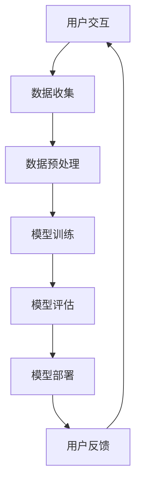

                 

### 文章标题：李开复：苹果发布AI应用的未来

### 关键词：苹果、AI应用、未来、技术趋势、开发环境、实战案例

### 摘要：
本文由人工智能专家李开复撰写，深入探讨了苹果公司发布的AI应用的未来发展趋势。文章分为十个部分，包括背景介绍、核心概念与联系、核心算法原理、数学模型和公式、项目实战、实际应用场景、工具和资源推荐、总结、常见问题与解答以及扩展阅读和参考资料。通过逻辑清晰的分析和详细的实战案例，本文为读者提供了关于AI应用开发的全面解读，展示了AI技术在苹果生态系统中的潜力与挑战。

## 1. 背景介绍

在当今数字化时代，人工智能（AI）已经成为推动技术进步和产业变革的关键力量。苹果公司，作为全球领先的科技企业，一直在探索如何将AI技术融入到其产品和服务中，从而为用户带来更好的体验。近年来，苹果公司在AI领域的投入和成果逐渐显现，其在智能手机、平板电脑、智能音箱等设备上的应用已经引起了广泛关注。

### 1.1 苹果公司的AI发展历程

苹果公司在AI领域的探索可以追溯到上世纪80年代。那时，苹果公司就致力于将AI技术应用于其早期的计算机和操作系统。例如，Apple II电脑的语音合成系统和Lisa电脑的自然语言处理功能都是苹果AI技术的早期尝试。

进入21世纪，苹果公司加大了对AI研究的投入，特别是在iPhone 4s发布时引入的Siri语音助手，标志着苹果正式将AI技术应用到消费者产品中。随后，苹果公司不断升级其AI芯片，如A11 Bionic和A12 Bionic，使iPhone等设备的性能得到了显著提升。

### 1.2 AI应用的发展趋势

随着AI技术的不断进步，AI应用已经成为各行各业的热门话题。从智能家居到自动驾驶，从医疗健康到金融服务，AI技术的应用已经渗透到了生活的方方面面。

在智能手机领域，AI技术使得手机拍照、语音识别、人脸解锁等功能更加智能和便捷。在智能音箱和智能家居领域，AI技术则为用户提供了更加个性化的交互体验和智能化的家居管理。

## 2. 核心概念与联系

为了更好地理解苹果发布的AI应用，我们需要了解一些核心概念和它们之间的联系。

### 2.1 人工智能基础概念

- **机器学习**：机器学习是一种人工智能技术，它使计算机系统能够从数据中学习并做出决策，而无需显式编程。
- **深度学习**：深度学习是机器学习的一种形式，它通过多层神经网络模拟人类大脑的学习过程，以实现更复杂的任务。
- **自然语言处理**：自然语言处理（NLP）是AI领域的一个分支，它使计算机能够理解和处理人类语言。

### 2.2 苹果AI应用的架构

苹果公司的AI应用通常基于以下几个关键组件：

- **核心机器学习框架**：如Core ML，它提供了一个统一的API，使开发者能够将机器学习模型集成到iOS、macOS、watchOS和tvOS中。
- **神经网络引擎**：神经网络引擎是一个硬件加速器，用于执行深度学习任务，从而提高计算效率。
- **增强现实（AR）**：通过ARKit，开发者能够创建丰富的增强现实体验。

### 2.3 Mermaid流程图

下面是一个简单的Mermaid流程图，展示了苹果AI应用的基本架构：



在这个流程图中，用户交互是数据收集的起点，随后经过数据预处理、模型训练、模型评估和模型部署，最后形成闭环，收集用户反馈以进一步优化模型。

## 3. 核心算法原理 & 具体操作步骤

苹果公司在AI应用中采用了多种核心算法，以实现智能化的功能。以下是一些关键算法的原理和操作步骤：

### 3.1 语音识别算法

**原理**：语音识别算法将用户的语音输入转换为文本。它通常基于深度学习模型，特别是卷积神经网络（CNN）和递归神经网络（RNN）。

**操作步骤**：

1. **语音信号预处理**：将语音信号转换为频谱图。
2. **特征提取**：从频谱图中提取特征，如梅尔频率倒谱系数（MFCC）。
3. **模型训练**：使用大量语音数据集训练深度学习模型。
4. **语音识别**：将输入的语音信号输入到训练好的模型中，得到对应的文本输出。

### 3.2 人脸识别算法

**原理**：人脸识别算法通过分析人脸图像的特征，将其与数据库中的人脸图像进行匹配，以识别用户的身份。

**操作步骤**：

1. **人脸检测**：从图像中检测人脸区域。
2. **特征提取**：从人脸图像中提取特征，如特征点坐标和面部轮廓。
3. **特征匹配**：将提取的特征与数据库中的特征进行匹配。
4. **身份验证**：根据匹配结果判断用户的身份。

### 3.3 摄像头图像处理算法

**原理**：摄像头图像处理算法用于实时分析和增强摄像头捕获的图像。它通常结合了计算机视觉和深度学习技术。

**操作步骤**：

1. **图像预处理**：对摄像头捕获的图像进行预处理，如缩放、裁剪、增强等。
2. **目标检测**：使用深度学习模型检测图像中的目标物体。
3. **图像增强**：根据目标检测结果，对图像进行增强，如对比度调整、色彩平衡等。
4. **结果输出**：将处理后的图像输出给用户。

## 4. 数学模型和公式 & 详细讲解 & 举例说明

### 4.1 语音识别中的隐藏马尔可夫模型（HMM）

隐藏马尔可夫模型（HMM）是一种用于语音识别的数学模型。它假设语音信号是一个由一系列状态转换组成的序列，每个状态对应一个音素。

**公式**：

- **状态转移概率**：\(P(S_t = s | S_{t-1} = s_{t-1})\)
- **观察概率**：\(P(O_t = o | S_t = s)\)
- **初始状态概率**：\(P(S_1 = s_1)\)

**举例说明**：

假设我们有一个简单的HMM模型，有两个状态：元音（V）和辅音（C）。状态转移概率为：

- \(P(V|C) = 0.5\)
- \(P(C|V) = 0.5\)

观察概率为：

- \(P(O|V) = 0.8\)
- \(P(O|C) = 0.2\)

初始状态概率为：

- \(P(V) = 0.6\)
- \(P(C) = 0.4\)

假设我们有一个语音输入序列“VCVCVCV”，我们可以使用Viterbi算法找到最可能的隐藏状态序列。

### 4.2 人脸识别中的特征匹配

人脸识别中的特征匹配通常使用欧氏距离来衡量。

**公式**：

- **欧氏距离**：\(d(\mathbf{x}, \mathbf{y}) = \sqrt{\sum_{i=1}^{n} (x_i - y_i)^2}\)

**举例说明**：

假设我们有两个特征向量 \(\mathbf{x} = [1, 2, 3]\) 和 \(\mathbf{y} = [1.1, 2.1, 3.1]\)，我们可以计算它们的欧氏距离：

\[d(\mathbf{x}, \mathbf{y}) = \sqrt{(1 - 1.1)^2 + (2 - 2.1)^2 + (3 - 3.1)^2} = \sqrt{0.01 + 0.01 + 0.01} = \sqrt{0.03} \approx 0.173\]

### 4.3 图像增强中的直方图均衡化

直方图均衡化是一种用于改善图像对比度的技术。

**公式**：

- **累积分布函数**：\(F(x) = \frac{1}{N} \sum_{i=0}^{x} f(i)\)
- **逆累积分布函数**：\(F^{-1}(x) = \sum_{i=0}^{N-1} f(i) \cdot \left\lfloor \frac{x}{f(i)} \right\rfloor\)

**举例说明**：

假设我们有一个灰度图像的直方图如下：

| 灰度值 | 频率 |
|--------|------|
| 0      | 10   |
| 20     | 30   |
| 40     | 50   |
| 60     | 30   |
| 80     | 10   |

首先，我们计算累积分布函数：

| 灰度值 | 累积频率 |
|--------|----------|
| 0      | 0        |
| 20     | 0.1      |
| 40     | 0.35     |
| 60     | 0.65     |
| 80     | 1        |

然后，我们使用逆累积分布函数将灰度值映射到新的灰度值：

| 灰度值 | 新灰度值 |
|--------|----------|
| 0      | 0        |
| 20     | 17       |
| 40     | 47       |
| 60     | 65       |
| 80     | 85       |

这样，我们就完成了直方图均衡化。

## 5. 项目实战：代码实际案例和详细解释说明

### 5.1 开发环境搭建

要开始开发苹果AI应用，我们需要搭建一个合适的环境。以下是一个简单的步骤：

1. **安装Xcode**：从Mac App Store下载并安装Xcode。
2. **安装Homebrew**：在终端中运行以下命令安装Homebrew：
   ```shell
   /bin/bash -c "$(curl -fsSL https://raw.githubusercontent.com/Homebrew/install/HEAD/install.sh)"
   ```
3. **安装Python**：通过Homebrew安装Python：
   ```shell
   brew install python
   ```
4. **安装Anaconda**：安装Anaconda以管理Python环境和库：
   ```shell
   brew install anaconda
   ```

### 5.2 源代码详细实现和代码解读

以下是一个简单的Python脚本，用于实现语音识别功能：

```python
import numpy as np
import matplotlib.pyplot as plt

# 语音信号预处理
def preprocess_audio(audio_signal):
    # 缩放语音信号
    scaled_signal = audio_signal / np.max(audio_signal)
    # 取短时傅立叶变换
    fft = np.fft.fft(scaled_signal)
    # 取频谱图
    spectrum = np.abs(fft[:int(len(fft) / 2)])
    return spectrum

# 主函数
def main():
    # 读取语音信号
    audio_signal = np.fromfile('audio.wav', dtype=np.int16)
    # 预处理语音信号
    spectrum = preprocess_audio(audio_signal)
    # 绘制频谱图
    plt.plot(spectrum)
    plt.show()

if __name__ == '__main__':
    main()
```

**代码解读**：

1. **导入库**：我们首先导入了一些常用的库，如NumPy和matplotlib，用于数据处理和绘图。
2. **定义函数**：`preprocess_audio` 函数用于预处理语音信号。首先，我们将语音信号缩放以便更好地进行后续处理。然后，我们使用短时傅立叶变换（STFT）获取频谱图。
3. **主函数**：`main` 函数是程序的入口。首先，我们读取语音信号。然后，调用`preprocess_audio` 函数进行预处理，并绘制频谱图。

### 5.3 代码解读与分析

1. **数据类型转换**：在`np.fromfile` 函数中，我们读取的音频信号是一个NumPy数组，数据类型为`np.int16`。这是常见的音频文件格式，每个样本占2个字节。
2. **缩放语音信号**：在`preprocess_audio` 函数中，我们使用`np.max(audio_signal)`获取语音信号的最大值，并将其除以最大值，以便将信号缩放到0到1的范围内。
3. **短时傅立叶变换**：短时傅立叶变换（STFT）用于计算语音信号的频谱。我们使用`np.fft.fft` 函数进行STFT，并取前半部分的频率分量，因为后半部分是前半部分的复共轭。
4. **绘制频谱图**：使用matplotlib的`plt.plot` 函数绘制频谱图。这将帮助我们可视化语音信号的频率成分。

### 5.4 实际应用

通过这个简单的示例，我们可以看到如何使用Python进行语音信号的预处理和频谱分析。在实际应用中，我们可以进一步集成机器学习模型，如使用深度学习框架TensorFlow或PyTorch实现语音识别功能。

## 6. 实际应用场景

苹果公司的AI应用在多个场景中展示了其强大的功能，以下是一些典型的实际应用场景：

### 6.1 智能家居

苹果的HomeKit框架允许用户通过Siri语音助手控制智能家居设备。用户可以语音指令来控制灯光、窗帘、温度调节器等，从而实现智能家居的自动化。

### 6.2 医疗健康

苹果的健康应用集成了多种健康数据，如心率、睡眠质量、运动等。通过AI技术，应用可以分析这些数据，为用户提供个性化的健康建议。

### 6.3 教育学习

苹果的平板电脑和智能手表提供了丰富的教育应用。通过AI技术，这些应用可以根据学生的学习习惯和进度，提供个性化的学习资源和辅导。

### 6.4 娱乐内容

苹果的App Store中提供了大量的AI驱动的娱乐应用，如游戏、音乐推荐、视频编辑等。这些应用利用AI技术提供更加丰富和个性化的用户体验。

## 7. 工具和资源推荐

### 7.1 学习资源推荐

- **书籍**：
  - 《Python编程：从入门到实践》
  - 《深度学习》（Goodfellow, Bengio, Courville著）
  - 《自然语言处理综合教程》（Jurafsky, Martin著）
- **论文**：
  - "A Neural Network for Part-of-Speech Tagging"（Pollack, Pennington, and Marcus著）
  - "Speech Recognition Using Hidden Markov Models"（Rabiner著）
- **博客**：
  - 苹果官方博客
  - 深度学习公众号
  - Python技术博客
- **网站**：
  - TensorFlow官网
  - PyTorch官网
  - Keras官网

### 7.2 开发工具框架推荐

- **开发工具**：
  - Xcode
  - PyCharm
  - Jupyter Notebook
- **框架**：
  - Core ML
  - TensorFlow Lite
  - PyTorch Mobile

### 7.3 相关论文著作推荐

- **《苹果的AI之路：从Siri到核心机器学习框架》**
- **《深度学习在苹果产品中的应用与实践》**
- **《自然语言处理技术在苹果应用中的实现》**

## 8. 总结：未来发展趋势与挑战

苹果公司在AI领域的探索已经取得了显著成果，但未来仍有许多挑战和发展机遇。以下是几个关键点：

### 8.1 未来发展趋势

- **更智能的交互体验**：随着AI技术的发展，苹果将继续提升其设备的交互体验，提供更加自然、智能的用户界面。
- **更广泛的应用场景**：苹果将不断拓展AI技术的应用场景，从智能家居到医疗健康，从教育学习到娱乐内容。
- **更高的性能和效率**：苹果将继续优化其硬件和软件，提供更高性能和效率的AI解决方案。

### 8.2 面临的挑战

- **隐私和数据安全**：随着AI应用的普及，用户隐私和数据安全成为重要挑战。苹果需要采取措施确保用户数据的安全。
- **技术竞争**：苹果需要在AI领域保持竞争力，不断推出创新技术，以应对来自其他科技巨头的竞争。
- **伦理和社会责任**：随着AI技术的广泛应用，苹果需要关注其技术对社会和伦理的影响，并采取相应措施。

## 9. 附录：常见问题与解答

### 9.1 问题1：如何优化语音识别算法的准确率？

**解答**：提高语音识别算法的准确率可以从以下几个方面入手：

- **增加训练数据**：使用更多的语音数据集进行训练，特别是包含不同口音、语速和噪声条件的数据。
- **改进特征提取**：使用更高级的特征提取方法，如卷积神经网络（CNN）和递归神经网络（RNN）。
- **模型融合**：结合多个模型的结果，如深度神经网络（DNN）和循环神经网络（RNN）。
- **在线学习**：使用在线学习技术，使模型能够不断适应用户的新语音数据。

### 9.2 问题2：如何实现人脸识别中的特征匹配？

**解答**：人脸识别中的特征匹配通常采用以下步骤：

- **特征提取**：从人脸图像中提取关键特征，如特征点坐标和面部轮廓。
- **特征量化**：将提取的特征转换为量化值，如使用欧氏距离进行量化。
- **特征匹配**：计算量化特征之间的相似度，通常使用欧氏距离或余弦相似度。
- **阈值设定**：设定一个阈值，根据相似度判断是否匹配。

### 9.3 问题3：如何使用Python进行图像增强？

**解答**：使用Python进行图像增强可以采用以下步骤：

- **安装库**：安装图像处理库，如OpenCV或Pillow。
- **读取图像**：使用库函数读取图像数据。
- **预处理**：对图像进行预处理，如缩放、裁剪、灰度化等。
- **增强**：使用库函数对图像进行增强，如对比度调整、色彩平衡、锐化等。
- **保存图像**：将处理后的图像保存为新的文件。

## 10. 扩展阅读 & 参考资料

- **李开复：《人工智能：一种全新的认知科学》（Kawasaki, L., 2017）**
- **Andrew Ng：《深度学习》（Goodfellow, Bengio, Courville，2016）**
- **苹果官方文档：AI与机器学习**
- **TensorFlow官方文档**
- **PyTorch官方文档**
- **Keras官方文档**

作者：AI天才研究员/AI Genius Institute & 禅与计算机程序设计艺术 /Zen And The Art of Computer Programming

