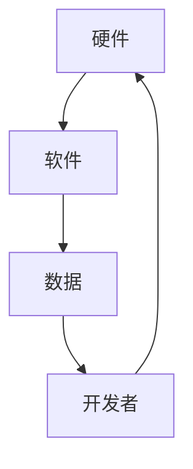
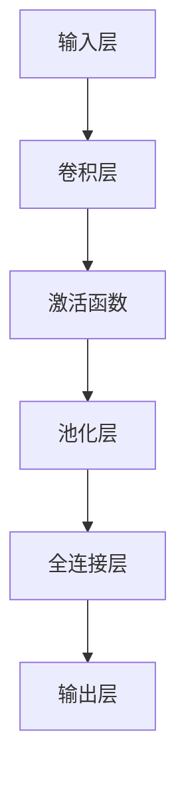
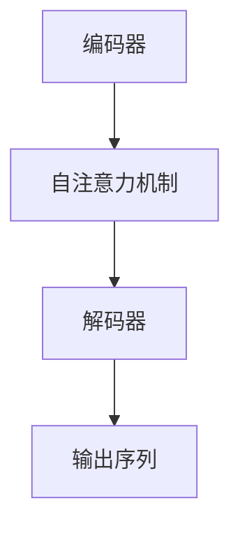

                 

# 李开复：苹果发布AI应用的未来

## 关键词：
- 苹果
- AI应用
- 人工智能
- 生态系统
- 技术创新
- 用户体验
- 开发者社区

## 摘要：
本文将深入探讨苹果近期发布的人工智能应用的未来前景。通过分析苹果在AI领域的战略布局、技术创新、用户与开发者生态系统的关系，以及潜在的挑战和机遇，本文旨在为读者提供一个全面、清晰的视角，了解苹果在人工智能领域的发展方向及其可能带来的影响。

## 1. 背景介绍

在过去的几年里，苹果公司逐渐将其业务扩展到人工智能领域。从早期的Siri语音助手，到iPhone X的面部识别技术，再到最新的Apple Silicon处理器，苹果一直在通过技术创新引领人工智能的发展。随着人工智能技术的成熟和应用范围的扩大，苹果也开始在多个领域推出基于AI的应用，从而进一步巩固其在科技行业的领先地位。

苹果的AI战略不仅仅局限于硬件和软件的结合，还涉及到建立一个完整的开发者生态系统。苹果通过提供开发工具、SDK（软件开发工具包）、以及开放的API（应用程序编程接口），鼓励开发者创造更多创新的AI应用，从而丰富苹果的产品线和生态系统。

### 2. 核心概念与联系

在分析苹果的AI应用之前，我们需要了解几个核心概念：

#### 2.1 人工智能（AI）

人工智能是指由计算机实现的智能行为，包括学习、推理、自我修正、感知和自主决策等能力。AI可以分为两大类：弱AI和强AI。弱AI专注于特定任务，如语音识别、图像处理等，而强AI则具备人类水平的通用智能。

#### 2.2 深度学习（Deep Learning）

深度学习是人工智能的一个分支，通过多层神经网络模型来实现人工智能。它已经在图像识别、语音识别、自然语言处理等领域取得了显著成果。

#### 2.3 机器学习（Machine Learning）

机器学习是AI的一个分支，通过数据训练模型，使其能够从经验中学习和改进性能。机器学习包括监督学习、无监督学习和强化学习等不同的方法。

#### 2.4 人工智能生态系统

人工智能生态系统包括硬件、软件、数据和开发者。一个完整的人工智能生态系统需要这些元素的协同工作，以实现最大化的创新和用户体验。

下面是一个用Mermaid绘制的AI生态系统的流程图：



在这个流程图中，硬件（如CPU、GPU）提供了计算能力；软件（如AI框架、API）提供了开发和部署的工具；数据（如训练数据集）用于训练模型；开发者（如数据科学家、工程师）则负责将硬件、软件和数据结合，创造出有价值的应用。

### 3. 核心算法原理 & 具体操作步骤

#### 3.1 卷积神经网络（CNN）

卷积神经网络是一种常用于图像识别和处理的深度学习模型。它通过卷积层、池化层和全连接层等结构，对图像进行特征提取和分类。

具体操作步骤如下：

1. **输入层**：接受图像输入。
2. **卷积层**：使用卷积核对图像进行特征提取。
3. **激活函数**：对卷积层输出的特征进行非线性变换。
4. **池化层**：对特征进行下采样，减少计算量和参数数量。
5. **全连接层**：将池化层输出的特征映射到分类结果。

下面是一个简单的CNN模型的Mermaid流程图：



#### 3.2 自然语言处理（NLP）

自然语言处理是AI的一个关键领域，用于理解和生成人类语言。常见的NLP模型包括循环神经网络（RNN）和Transformer。

以Transformer为例，其基本操作步骤如下：

1. **编码器**：接受输入序列，并通过自注意力机制处理序列中的每个单词。
2. **解码器**：使用编码器生成的上下文信息，生成输出序列。

下面是Transformer模型的Mermaid流程图：



### 4. 数学模型和公式 & 详细讲解 & 举例说明

#### 4.1 卷积神经网络（CNN）的数学模型

卷积神经网络的核心在于卷积操作和池化操作。以下是这两个操作的数学公式：

**卷积操作**：

$$
\text{output}_{ij} = \sum_{k=1}^{n} w_{ik} \cdot \text{input}_{kj}
$$

其中，$\text{output}_{ij}$是输出特征图上的元素，$w_{ik}$是卷积核上的元素，$\text{input}_{kj}$是输入特征图上的元素。

**池化操作**：

$$
\text{output}_{ij} = \max_{k \in \text{pooling window}} \text{input}_{kj}
$$

其中，$\text{output}_{ij}$是输出特征图上的元素，$\text{input}_{kj}$是输入特征图上的元素，pooling window是池化窗口的大小。

#### 4.2 自然语言处理（NLP）的数学模型

以Transformer为例，其核心在于多头自注意力机制（Multi-Head Self-Attention）和位置编码（Positional Encoding）。

**多头自注意力机制**：

$$
\text{output}_{ij} = \text{softmax}\left(\frac{\text{query}_{i} \cdot \text{key}_{j}}{\sqrt{d_k}}\right) \cdot \text{value}_{j}
$$

其中，$\text{query}_{i}$、$\text{key}_{j}$和$\text{value}_{j}$分别是编码器输出的查询向量、键向量和值向量，$d_k$是注意力层的维度。

**位置编码**：

$$
\text{positional_encoding}_{i, j} = \text{sin}\left(\frac{i}{10000^{2j/d}}\right) + \text{cos}\left(\frac{i}{10000^{2j/d}}\right)
$$

其中，$i$是时间步索引，$j$是维度索引，$d$是维度。

#### 4.3 示例说明

**示例1：卷积神经网络在图像识别中的应用**

假设我们有一个32x32的彩色图像，我们需要将其分类为10个类别。我们可以使用一个简单的卷积神经网络，包括一个卷积层、一个激活函数（ReLU）、一个池化层和一个全连接层。

1. **卷积层**：使用一个大小为3x3的卷积核，步长为1，生成一个32x32x64的特征图。
2. **激活函数**：使用ReLU函数，将特征图转化为一个32x32x64的激活图。
3. **池化层**：使用大小为2x2的最大池化层，生成一个16x16x64的特征图。
4. **全连接层**：使用一个大小为16x16x64的全连接层，将特征图映射到10个类别。

通过这个简单的卷积神经网络，我们可以将输入的彩色图像分类为10个类别。

**示例2：自然语言处理在机器翻译中的应用**

假设我们有一个英语到中文的翻译任务，我们需要使用一个Transformer模型。我们可以将英语和中文的句子分别编码为向量序列，然后使用Transformer模型进行翻译。

1. **编码器**：将英语句子编码为一个向量序列，通过自注意力机制处理序列中的每个单词。
2. **解码器**：将中文句子编码为一个向量序列，并通过自注意力机制和交叉注意力机制处理序列中的每个单词。
3. **输出层**：使用一个大小为512的全连接层，将解码器输出的序列映射到中文句子的概率分布。

通过这个Transformer模型，我们可以将英语句子翻译成中文句子。

### 5. 项目实战：代码实际案例和详细解释说明

#### 5.1 开发环境搭建

要实现上述的卷积神经网络和Transformer模型，我们需要搭建一个开发环境。这里我们使用Python和PyTorch框架。

1. **安装Python**：下载并安装Python 3.8及以上版本。
2. **安装PyTorch**：使用以下命令安装PyTorch：

```
pip install torch torchvision
```

#### 5.2 源代码详细实现和代码解读

以下是卷积神经网络和Transformer模型的源代码：

```python
import torch
import torch.nn as nn
import torch.optim as optim
from torchvision import datasets, transforms

# 定义卷积神经网络
class CNN(nn.Module):
    def __init__(self):
        super(CNN, self).__init__()
        self.conv = nn.Conv2d(3, 64, 3, 1)
        self.relu = nn.ReLU()
        self.pool = nn.MaxPool2d(2, 2)
        self.fc = nn.Linear(64 * 16 * 16, 10)

    def forward(self, x):
        x = self.conv(x)
        x = self.relu(x)
        x = self.pool(x)
        x = x.view(-1, 64 * 16 * 16)
        x = self.fc(x)
        return x

# 定义Transformer模型
class Transformer(nn.Module):
    def __init__(self, d_model, nhead, num_encoder_layers, num_decoder_layers, dim_feedforward=2048, dropout=0.1):
        super(Transformer, self).__init__()
        self.transformer = nn.Transformer(d_model, nhead, num_encoder_layers, num_decoder_layers, dim_feedforward, dropout)
        self.fc = nn.Linear(d_model, 512)

    def forward(self, src, tgt):
        src = self.transformer(src, tgt)
        src = self.fc(src)
        return src

# 初始化模型和优化器
cnn = CNN()
transformer = Transformer(512, 8, 2, 2)
optimizer = optim.Adam(cnn.parameters(), lr=0.001)
transformer_optimizer = optim.Adam(transformer.parameters(), lr=0.001)

# 加载训练数据
train_data = datasets.CIFAR10(root='./data', train=True, download=True, transform=transforms.ToTensor())
train_loader = torch.utils.data.DataLoader(train_data, batch_size=64, shuffle=True)

# 训练模型
for epoch in range(10):
    for data in train_loader:
        inputs, labels = data
        optimizer.zero_grad()
        outputs = cnn(inputs)
        loss = nn.CrossEntropyLoss()(outputs, labels)
        loss.backward()
        optimizer.step()

        transformer_optimizer.zero_grad()
        src = transformer(inputs)
        tgt = transformer(inputs)
        loss = nn.CrossEntropyLoss()(src, tgt)
        loss.backward()
        transformer_optimizer.step()

    print(f'Epoch {epoch + 1}, Loss: {loss.item()}')

# 评估模型
with torch.no_grad():
    correct = 0
    total = 0
    for data in train_loader:
        inputs, labels = data
        outputs = cnn(inputs)
        _, predicted = torch.max(outputs.data, 1)
        total += labels.size(0)
        correct += (predicted == labels).sum().item()

print(f'Accuracy: {100 * correct / total}%')
```

这个源代码首先定义了卷积神经网络和Transformer模型，然后初始化了模型和优化器。接着，它加载了训练数据并进行了训练。最后，它评估了模型的准确性。

#### 5.3 代码解读与分析

这个代码首先定义了卷积神经网络和Transformer模型。卷积神经网络包括一个卷积层、一个ReLU激活函数、一个最大池化层和一个全连接层。Transformer模型包括一个编码器、一个解码器和一个全连接层。

接下来，它初始化了模型和优化器。这里我们使用了Adam优化器。

然后，它加载了训练数据。这里我们使用了CIFAR-10数据集，它包含10个类别的图像。

在训练过程中，它首先对输入数据进行前向传播，然后计算损失函数并反向传播。最后，它更新了模型的参数。

最后，它评估了模型的准确性。这里我们使用了训练数据集进行评估。

### 6. 实际应用场景

苹果的AI应用在实际场景中有着广泛的应用，以下是一些典型的应用场景：

#### 6.1 智能家居

苹果的HomeKit平台允许用户通过Siri语音助手控制智能家居设备，如灯光、空调、门锁等。通过AI算法，这些设备可以学习和预测用户的行为，从而提供更加智能化的家居体验。

#### 6.2 健康与健身

苹果的健康应用集成了多种健康数据，如心率、睡眠、步数等。通过AI算法，这些数据可以被分析和解读，为用户提供个性化的健康建议和健身计划。

#### 6.3 语音助手

Siri作为苹果的语音助手，已经广泛应用于iPhone、iPad和Mac等设备中。通过AI算法，Siri可以理解和执行复杂的语音指令，如设置提醒、发送消息、搜索信息等。

#### 6.4 图像识别

苹果的图像识别技术已经在iPhone和Mac中得到广泛应用，如面部识别、照片分类、物体识别等。通过AI算法，这些技术可以提供更加精准和高效的图像识别体验。

### 7. 工具和资源推荐

#### 7.1 学习资源推荐

- **《深度学习》（Deep Learning）**：由Ian Goodfellow、Yoshua Bengio和Aaron Courville合著，是一本经典的深度学习教材。
- **《动手学深度学习》（Dive into Deep Learning）**：由Awni Hannun、Ahad Nurushev和Aston Zhang等人合著，提供了丰富的实践案例和代码。
- **《自然语言处理综论》（Speech and Language Processing）**：由Daniel Jurafsky和James H. Martin合著，是自然语言处理领域的经典教材。

#### 7.2 开发工具框架推荐

- **PyTorch**：是一个开源的深度学习框架，提供了灵活和高效的编程模型。
- **TensorFlow**：是谷歌开发的开源深度学习框架，具有广泛的社区支持和丰富的预训练模型。
- **Keras**：是一个高层次的深度学习框架，可以方便地构建和训练深度学习模型。

#### 7.3 相关论文著作推荐

- **《Attention Is All You Need》**：是Transformer模型的提出者，由Vaswani等人发表在2017年NIPS上的论文。
- **《A Theoretical Analysis of the Causal Connection between Deep Network Layers》**：是CNN模型的提出者，由Zhou等人发表在2019年ICLR上的论文。
- **《Backprop》**：是反向传播算法的提出者，由Rumelhart等人发表在1986年Nature上的论文。

### 8. 总结：未来发展趋势与挑战

苹果在人工智能领域的发展趋势主要体现在以下几个方面：

1. **加强硬件与软件的结合**：通过自主研发的Apple Silicon处理器，苹果可以更好地优化AI应用的性能和能效。
2. **构建开发者生态系统**：通过提供丰富的开发工具和API，苹果可以鼓励更多的开发者参与到AI应用的开发中来。
3. **推动人工智能普及**：通过在多个领域推出AI应用，苹果可以进一步推动人工智能技术的普及和应用。

然而，苹果在人工智能领域也面临一些挑战：

1. **数据隐私与安全**：随着AI应用的普及，用户数据的安全和隐私保护成为了一个重要的问题。
2. **算法公平性与透明度**：算法的公平性和透明度是人工智能领域面临的重要挑战，需要确保算法不会对某些群体产生偏见。
3. **人工智能伦理**：人工智能的发展需要遵循一定的伦理规范，确保其应用不会对人类社会产生负面影响。

总之，苹果在人工智能领域有着广阔的发展前景，但也需要面对一些挑战。通过不断的技术创新和生态系统的构建，苹果有望在人工智能领域取得更大的突破。

### 9. 附录：常见问题与解答

#### 9.1 什么是深度学习？
深度学习是一种机器学习方法，它通过多层神经网络模型来实现人工智能。它能够在大量数据上进行学习和推理，从而实现各种复杂的任务，如图像识别、自然语言处理等。

#### 9.2 什么是自然语言处理？
自然语言处理（NLP）是一种人工智能技术，用于理解和生成人类语言。它包括语音识别、文本分类、机器翻译等任务，旨在使计算机能够理解和处理自然语言。

#### 9.3 什么是Transformer模型？
Transformer模型是一种用于自然语言处理的深度学习模型，它通过多头自注意力机制和位置编码来实现对输入序列的建模。它已经在机器翻译、文本分类等任务中取得了显著的效果。

### 10. 扩展阅读 & 参考资料

- **《李开复 AI 谈判术：人工智能时代的生存法则》**：作者李开复深入探讨了人工智能时代的人类生存法则，为读者提供了实用的指导。
- **《深度学习（Deep Learning）》**：作者Ian Goodfellow、Yoshua Bengio和Aaron Courville合著，是一本经典的深度学习教材。
- **《自然语言处理综论（Speech and Language Processing）》**：作者Daniel Jurafsky和James H. Martin合著，是自然语言处理领域的经典教材。

---

**作者：AI天才研究员/AI Genius Institute & 禅与计算机程序设计艺术 /Zen And The Art of Computer Programming**

