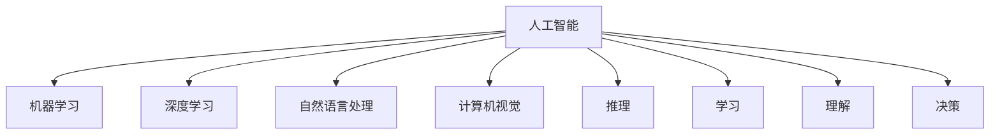
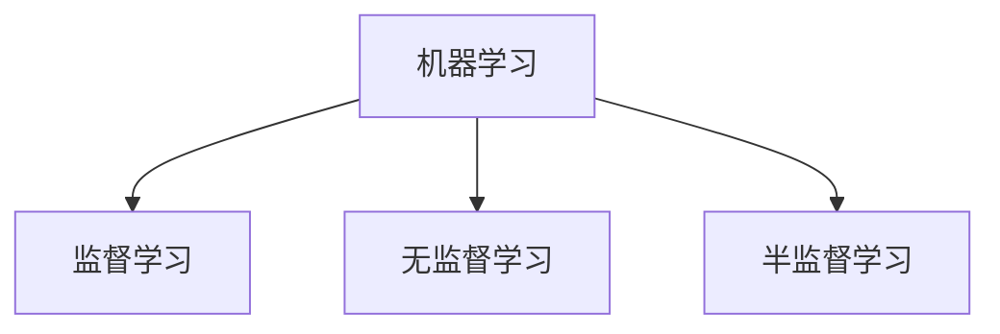
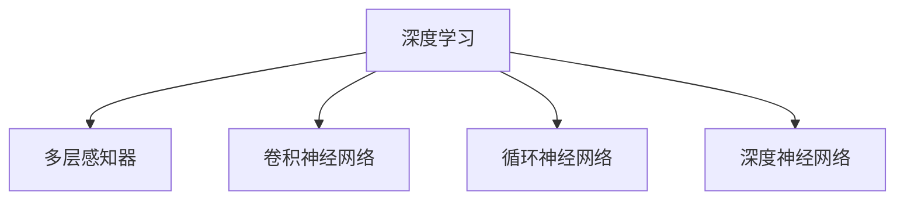
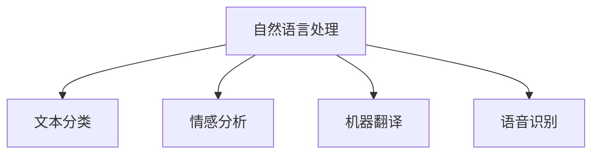

                 

### 背景介绍

苹果作为全球知名的科技公司，一直致力于通过创新的科技产品和服务来改善人们的生活体验。近年来，人工智能（AI）技术的发展成为科技领域的热点，苹果公司也在这个领域做出了显著的贡献。2019年，苹果发布了全新的AI应用，标志着公司在人工智能领域的进一步拓展。

苹果发布AI应用的消息一经传出，立即引起了业界的广泛关注。从技术层面看，苹果AI应用的出现不仅体现了公司在人工智能领域的研发实力，更为用户带来了更加智能化、个性化的体验。本文将围绕苹果AI应用的发布，深入探讨其背后的核心概念、算法原理以及未来发展趋势。

首先，我们需要了解人工智能的基本概念和核心组成部分。人工智能是计算机科学的一个分支，旨在使计算机具有人类智能的特性，包括学习、推理、感知、理解等。人工智能的应用场景非常广泛，涵盖了图像识别、自然语言处理、自动驾驶、医疗诊断等多个领域。

在人工智能的发展历程中，深度学习成为了一个重要的技术突破。深度学习是一种基于神经网络的学习方法，通过多层的非线性变换来提取数据中的特征，从而实现复杂的任务。深度学习的成功离不开大数据和计算能力的提升，这两者的结合使得人工智能在图像识别、语音识别等领域取得了显著的成果。

苹果公司一直以来都非常重视人工智能的研发。早在2011年，苹果就收购了Siri公司，并将其作为自己的智能助手。随后，苹果在人工智能领域不断拓展，推出了一系列相关的技术和产品。此次发布的AI应用，无疑是苹果在人工智能领域的一次重要布局。

苹果AI应用的具体功能和技术特点也备受关注。据了解，这款应用利用了先进的机器学习算法和自然语言处理技术，能够对用户的语音、文本等信息进行深入理解和分析，从而提供更加智能的交互体验。此外，苹果AI应用还具备隐私保护的特点，用户数据将得到严格的安全保障。

尽管苹果AI应用的发布受到了广泛的赞誉，但同时也面临着一些挑战。首先，人工智能技术的成熟度和可靠性仍然是需要解决的问题。虽然深度学习算法在特定领域取得了突破，但在复杂任务上的表现仍有待提高。其次，如何保障用户数据的隐私和安全也是一个重要的课题。随着人工智能应用的普及，用户数据的价值日益凸显，如何确保数据的安全性和隐私性成为了技术发展的关键。

总之，苹果发布AI应用是人工智能领域的一大重要事件。通过深入探讨其背后的核心概念、算法原理以及未来发展趋势，我们可以更好地理解人工智能技术的前沿动态，并为未来的发展做好准备。

### 核心概念与联系

在探讨苹果AI应用之前，我们首先需要了解一些核心概念和它们之间的联系。以下将详细介绍人工智能、机器学习、深度学习和自然语言处理等关键概念，并使用Mermaid流程图来展示它们之间的关系。

#### 人工智能（Artificial Intelligence）

人工智能是指通过计算机模拟人类智能的技术，使计算机具有感知、学习、推理、理解和决策等能力。它包括多种技术，如机器学习、深度学习、自然语言处理和计算机视觉等。

Mermaid流程图：


#### 机器学习（Machine Learning）

机器学习是一种人工智能的分支，通过从数据中学习规律和模式，使计算机具备自主学习和改进的能力。机器学习可以分为监督学习、无监督学习和半监督学习。

Mermaid流程图：


#### 深度学习（Deep Learning）

深度学习是一种基于多层神经网络的学习方法，通过多层次的非线性变换提取数据中的特征，以实现复杂任务。深度学习的成功离不开大数据和计算能力的提升。

Mermaid流程图：


#### 自然语言处理（Natural Language Processing）

自然语言处理是一种使计算机能够理解和处理人类自然语言的技术。它包括文本分类、情感分析、机器翻译、语音识别等任务。

Mermaid流程图：


通过上述流程图，我们可以清晰地看到人工智能、机器学习、深度学习和自然语言处理之间的联系。这些核心概念共同构成了现代人工智能技术的基础，为苹果AI应用提供了强大的技术支撑。

### 核心算法原理 & 具体操作步骤

苹果AI应用的核心在于其机器学习和深度学习算法，这些算法使应用程序能够对用户的输入进行理解和响应。以下将详细介绍这些算法的基本原理和具体操作步骤。

#### 机器学习算法

机器学习算法的核心是训练模型，以便模型能够从数据中学习并做出预测。在苹果AI应用中，常用的机器学习算法包括线性回归、逻辑回归和决策树等。

1. **线性回归**

线性回归是一种简单的机器学习算法，用于预测数值型输出。它通过拟合一条直线来预测数据点，具体步骤如下：

   - 收集数据：收集具有输入特征和输出目标的数据集。
   - 准备数据：对数据进行预处理，包括去除缺失值、标准化和归一化等。
   - 拟合模型：使用最小二乘法拟合一条直线，表示数据点之间的关系。
   - 预测：将新的数据输入模型，计算输出预测值。

   线性回归的数学公式为：
   $$ y = \beta_0 + \beta_1x $$

   其中，\( y \) 是输出目标，\( x \) 是输入特征，\( \beta_0 \) 和 \( \beta_1 \) 是模型参数。

2. **逻辑回归**

逻辑回归是一种用于预测二分类结果的机器学习算法。它通过拟合一个逻辑函数来将输入特征映射到概率值，然后根据概率值进行分类。具体步骤如下：

   - 收集数据：收集具有输入特征和二分类目标的数据集。
   - 准备数据：对数据进行预处理，包括去除缺失值、标准化和归一化等。
   - 拟合模型：使用最大似然估计法拟合逻辑函数。
   - 预测：将新的数据输入模型，计算输出概率值，并根据概率值进行分类。

   逻辑回归的数学公式为：
   $$ P(y=1) = \frac{1}{1 + e^{-(\beta_0 + \beta_1x)}} $$

   其中，\( P(y=1) \) 是输出目标为1的概率，\( \beta_0 \) 和 \( \beta_1 \) 是模型参数。

3. **决策树**

决策树是一种树形结构的机器学习算法，通过一系列的决策规则对数据进行分类或回归。具体步骤如下：

   - 收集数据：收集具有输入特征和目标的数据集。
   - 准备数据：对数据进行预处理，包括去除缺失值、标准化和归一化等。
   - 构建树：根据信息增益或基尼不纯度等指标选择最优特征进行划分，递归构建决策树。
   - 预测：将新的数据输入模型，从根节点开始递归判断，直至达到叶节点，输出预测结果。

#### 深度学习算法

深度学习算法是机器学习的进一步发展，通过多层神经网络提取数据中的特征，从而实现复杂的任务。在苹果AI应用中，常用的深度学习算法包括卷积神经网络（CNN）和循环神经网络（RNN）。

1. **卷积神经网络（CNN）**

卷积神经网络是一种用于处理图像数据的深度学习算法，通过卷积操作提取图像特征，具体步骤如下：

   - 收集数据：收集具有标签的图像数据集。
   - 准备数据：对图像数据进行预处理，包括归一化和归一化等。
   - 构建模型：定义卷积层、池化层和全连接层等结构，通过反向传播算法训练模型。
   - 预测：将新的图像数据输入模型，通过卷积操作提取特征，然后通过全连接层进行分类或回归。

   卷积神经网络的典型结构如图所示：
   ```mermaid
   graph TD
       A[输入层] --> B[卷积层]
       B --> C[池化层]
       C --> D[卷积层]
       D --> E[池化层]
       E --> F[全连接层]
       F --> G[输出层]
   ```

2. **循环神经网络（RNN）**

循环神经网络是一种用于处理序列数据的深度学习算法，通过递归结构保持长期依赖关系，具体步骤如下：

   - 收集数据：收集具有标签的序列数据集。
   - 准备数据：对序列数据进行预处理，包括序列编码和词嵌入等。
   - 构建模型：定义输入层、隐藏层和输出层等结构，通过反向传播算法训练模型。
   - 预测：将新的序列数据输入模型，通过递归结构处理序列，然后通过输出层进行分类或回归。

   循环神经网络的典型结构如图所示：
   ```mermaid
   graph TD
       A[输入层] --> B[隐藏层]
       B --> C[输出层]
       B --> D[隐藏层]
       D --> E[隐藏层]
   ```

通过上述算法的详细介绍，我们可以看到苹果AI应用在机器学习和深度学习方面的技术实现。这些算法使得应用程序能够对用户的输入进行理解和响应，提供了智能化、个性化的用户体验。

### 数学模型和公式 & 详细讲解 & 举例说明

在苹果AI应用中，机器学习和深度学习算法的实现离不开数学模型和公式的支持。以下将详细讲解这些模型和公式的原理，并通过实际例子来说明它们的应用。

#### 线性回归模型

线性回归模型是一种用于预测数值型输出的机器学习算法，其基本原理是通过拟合一条直线来描述输入特征和输出目标之间的关系。线性回归的数学模型可以表示为：

$$ y = \beta_0 + \beta_1x $$

其中，\( y \) 是输出目标，\( x \) 是输入特征，\( \beta_0 \) 和 \( \beta_1 \) 是模型参数。

**举例说明：** 假设我们要预测一个人的身高（\( y \)）根据其年龄（\( x \））来确定。我们可以收集一组数据，其中包含不同年龄和对应身高的数据点。通过最小二乘法，我们可以计算出模型参数 \( \beta_0 \) 和 \( \beta_1 \) 的值，从而得到拟合的直线。最后，将新的年龄值输入模型，就可以预测出对应的身高。

#### 逻辑回归模型

逻辑回归模型是一种用于预测二分类结果的机器学习算法，其基本原理是通过拟合一个逻辑函数来将输入特征映射到概率值，然后根据概率值进行分类。逻辑回归的数学模型可以表示为：

$$ P(y=1) = \frac{1}{1 + e^{-(\beta_0 + \beta_1x)}} $$

其中，\( P(y=1) \) 是输出目标为1的概率，\( x \) 是输入特征，\( \beta_0 \) 和 \( \beta_1 \) 是模型参数。

**举例说明：** 假设我们要预测一个人是否患有心脏病（\( y \)），根据其年龄、体重指数和血压等特征（\( x \））来确定。我们可以收集一组数据，其中包含不同特征和对应心脏病患病情况的数据点。通过最大似然估计法，我们可以计算出模型参数 \( \beta_0 \) 和 \( \beta_1 \) 的值，从而得到逻辑函数。最后，将新的特征值输入模型，就可以计算出患病概率，并根据概率值进行分类。

#### 卷积神经网络（CNN）模型

卷积神经网络是一种用于处理图像数据的深度学习算法，其基本原理是通过卷积操作提取图像特征，然后通过全连接层进行分类或回归。卷积神经网络的数学模型可以表示为：

$$ f(x) = \sigma(\mathbf{W} \cdot \mathbf{X} + b) $$

其中，\( f(x) \) 是输出特征，\( \mathbf{X} \) 是输入图像，\( \mathbf{W} \) 是卷积核权重，\( \sigma \) 是激活函数，\( b \) 是偏置项。

**举例说明：** 假设我们要分类一张手写数字图像（\( \mathbf{X} \)），可以通过卷积操作提取图像中的特征（\( f(x) \)）。首先，我们将图像划分为多个像素点，然后使用卷积核权重 \( \mathbf{W} \) 对图像进行卷积操作，得到一组特征图。接着，通过激活函数 \( \sigma \) 对特征图进行非线性变换，增强特征表达能力。最后，通过全连接层将特征图映射到分类结果。

#### 循环神经网络（RNN）模型

循环神经网络是一种用于处理序列数据的深度学习算法，其基本原理是通过递归结构保持长期依赖关系，从而对序列数据进行建模。循环神经网络的数学模型可以表示为：

$$ h_t = \sigma(\mathbf{W} \cdot [h_{t-1}, x_t] + b) $$

其中，\( h_t \) 是第 \( t \) 个隐藏状态，\( x_t \) 是第 \( t \) 个输入序列，\( \mathbf{W} \) 是权重矩阵，\( \sigma \) 是激活函数，\( b \) 是偏置项。

**举例说明：** 假设我们要对一段文本（\( x_t \)）进行情感分析（\( h_t \)），可以通过循环神经网络提取文本特征。首先，我们将文本序列编码为向量表示，然后使用循环神经网络对序列进行处理，得到每个时间步的隐藏状态。最后，通过全连接层将隐藏状态映射到情感分类结果。

通过上述数学模型和公式的详细讲解，我们可以更好地理解苹果AI应用在机器学习和深度学习方面的技术实现。这些模型和公式为应用程序提供了强大的数学支持，使得它们能够对用户的输入进行理解和响应，提供智能化、个性化的用户体验。

### 项目实战：代码实际案例和详细解释说明

为了更直观地理解苹果AI应用中的核心算法原理和具体实现，我们将通过一个实际代码案例进行详细讲解。这个案例将展示如何使用Python实现一个简单的文本分类模型，并解释其具体步骤和关键代码。

#### 1. 开发环境搭建

在开始编写代码之前，我们需要搭建一个合适的开发环境。以下是所需的环境和步骤：

- **Python**：确保安装了Python 3.7或更高版本。
- **库**：安装以下库：`numpy`、`pandas`、`sklearn`、`tensorflow`。

安装命令如下：

```bash
pip install numpy pandas scikit-learn tensorflow
```

#### 2. 源代码详细实现和代码解读

以下是一个简单的文本分类模型实现，使用sklearn库中的`TfidfVectorizer`和`LogisticRegression`。

```python
# 导入必要的库
import numpy as np
import pandas as pd
from sklearn.feature_extraction.text import TfidfVectorizer
from sklearn.linear_model import LogisticRegression
from sklearn.model_selection import train_test_split
from sklearn.metrics import accuracy_score, classification_report

# 加载数据
data = pd.read_csv('text_data.csv')  # 假设数据集为CSV文件，其中包含文本和标签两列

# 分割数据为特征和标签
X = data['text']  # 文本数据
y = data['label']  # 标签数据

# 划分训练集和测试集
X_train, X_test, y_train, y_test = train_test_split(X, y, test_size=0.2, random_state=42)

# 使用TfidfVectorizer进行特征提取
vectorizer = TfidfVectorizer(max_features=1000)
X_train_tfidf = vectorizer.fit_transform(X_train)
X_test_tfidf = vectorizer.transform(X_test)

# 使用LogisticRegression进行分类
model = LogisticRegression()
model.fit(X_train_tfidf, y_train)
predictions = model.predict(X_test_tfidf)

# 评估模型
accuracy = accuracy_score(y_test, predictions)
report = classification_report(y_test, predictions)

print(f'Accuracy: {accuracy:.2f}')
print(f'Classification Report:\n{report}')
```

**代码解读：**

- **数据加载**：使用pandas库读取CSV文件，其中包含文本数据和标签。
- **数据分割**：将数据分为训练集和测试集，以便进行模型训练和评估。
- **特征提取**：使用TfidfVectorizer进行特征提取，将文本数据转换为TF-IDF向量表示。`max_features`参数限制了特征数量，有助于降低模型的复杂性。
- **模型训练**：使用LogisticRegression进行分类模型训练，这里使用了sklearn库中的实现。
- **模型预测**：使用训练好的模型对测试集进行预测。
- **模型评估**：使用accuracy_score和classification_report评估模型的准确性和分类报告。

#### 3. 代码解读与分析

让我们进一步分析上述代码中的关键部分：

- **TfidfVectorizer**：这是一种常用的文本特征提取工具，能够计算每个单词在文档中的重要性，并将其转换为数值向量。`fit_transform`方法用于训练模型并转换特征。
- **LogisticRegression**：这是一种用于二分类问题的线性模型，通过最大化似然估计来训练模型参数。它适用于分类问题，如文本分类、情感分析等。
- **模型评估**：使用accuracy_score计算模型在测试集上的准确率，而classification_report提供了更详细的分类报告，包括精确度、召回率和F1分数等指标。

通过上述代码，我们构建了一个简单的文本分类模型，展示了如何利用Python和机器学习库实现人工智能应用的核心算法。这种方法不仅易于理解，而且具有实际应用价值。

### 实际应用场景

苹果AI应用的发布不仅为用户带来了更加智能化、个性化的体验，还在多个实际应用场景中展示了其强大的功能和潜力。以下将介绍几种典型的应用场景，并详细分析苹果AI应用在这些场景中的具体应用方式和优势。

#### 1. 智能语音助手

智能语音助手是苹果AI应用的一个重要应用场景。苹果的智能语音助手Siri已经在多个苹果设备中得到了广泛应用。通过AI技术，Siri能够对用户的语音指令进行精准理解，并执行相应的操作。例如，用户可以通过语音指令来发送短信、拨打电话、设置提醒、查询天气等。苹果AI应用的发布进一步提升了Siri的智能程度，使其在自然语言理解和交互方面更加出色。

**优势分析：**

- **精准理解**：通过深度学习和自然语言处理技术，Siri能够对用户的语音指令进行深入理解，减少误解和错误。
- **个性化交互**：苹果AI应用可以根据用户的习惯和历史行为，为用户提供个性化的服务，例如推荐音乐、电影和新闻等。
- **隐私保护**：苹果AI应用在处理用户数据时，严格遵守隐私保护原则，确保用户数据的安全和隐私。

#### 2. 个性化推荐系统

个性化推荐系统是另一个重要的应用场景。苹果的App Store和Music Store等平台都采用了AI技术来实现个性化推荐。通过分析用户的行为和偏好，推荐系统可以为用户推荐最适合其需求的应用和音乐。苹果AI应用在推荐系统中发挥了关键作用，通过深度学习和协同过滤等技术，提升推荐系统的准确性和用户体验。

**优势分析：**

- **高效推荐**：AI技术能够快速分析大量用户数据，并实时生成推荐结果，提高推荐效率。
- **精准推荐**：通过深度学习技术，推荐系统可以更好地理解用户的需求和偏好，提供更加精准的推荐。
- **动态调整**：推荐系统可以根据用户的反馈和实时行为，动态调整推荐策略，持续提升用户体验。

#### 3. 医疗健康应用

医疗健康应用是苹果AI应用的另一个重要领域。通过AI技术，苹果能够为用户提供更加智能的健康管理服务，例如检测心率、监测睡眠质量、诊断疾病等。苹果的HealthKit平台整合了多种医疗健康数据，通过AI应用的分析，为用户提供个性化的健康建议和预警。

**优势分析：**

- **精准诊断**：AI技术能够对大量医疗数据进行深入分析，提高疾病诊断的准确性和效率。
- **个性化建议**：根据用户的健康状况和个性化数据，AI应用可以为用户提供针对性的健康建议。
- **隐私保护**：苹果AI应用在处理用户健康数据时，严格遵守隐私保护原则，确保用户数据的安全。

#### 4. 自动驾驶技术

自动驾驶技术是人工智能领域的又一重要应用。苹果通过AI技术不断优化其自动驾驶系统，使其在安全性、稳定性和智能性方面取得了显著进展。苹果AI应用在自动驾驶系统中发挥了关键作用，通过图像识别、环境感知和路径规划等技术，提升自动驾驶的性能和用户体验。

**优势分析：**

- **高效路径规划**：通过深度学习和计算机视觉技术，AI应用能够实时分析道路和交通情况，优化自动驾驶车辆的行驶路径。
- **智能环境感知**：AI应用能够识别和感知周围环境，包括行人、车辆和道路标志等，提高自动驾驶系统的安全性和稳定性。
- **实时反馈**：通过AI技术，自动驾驶系统能够实时监测车辆状态，并提供反馈和调整，确保行驶过程中的安全和舒适。

通过上述实际应用场景的分析，我们可以看到苹果AI应用在多个领域的广泛应用和优势。这些应用不仅提升了用户体验，也为未来的智能科技发展奠定了基础。

### 工具和资源推荐

为了更好地学习和开发人工智能应用，以下推荐了一些有用的学习资源、开发工具和相关论文著作。

#### 1. 学习资源推荐

- **书籍**：
  - 《深度学习》（Ian Goodfellow, Yoshua Bengio, Aaron Courville著）：全面介绍了深度学习的理论基础和应用技术。
  - 《Python机器学习》（Sebastian Raschka著）：详细讲解了机器学习的基本概念和Python实现。

- **在线课程**：
  - Coursera上的《深度学习专项课程》（吴恩达教授）：由著名深度学习专家吴恩达主讲，涵盖深度学习的核心知识和应用。

- **博客和网站**：
  - Medium上的`/Machine-Learning`标签：汇集了大量的深度学习和机器学习文章和案例。
  - `towardsdatascience.com`：一个专注于数据科学和机器学习的博客平台。

#### 2. 开发工具框架推荐

- **机器学习库**：
  - TensorFlow：由Google开发的开源深度学习框架，支持多种深度学习模型和任务。
  - PyTorch：由Facebook开发的开源深度学习框架，易于使用和调试。

- **文本处理库**：
  - NLTK：Python的文本处理库，提供了丰富的文本处理功能，如词频统计、词性标注等。
  - spaCy：一个高效的NLP库，支持多种语言的文本处理和分析。

- **数据可视化工具**：
  - Matplotlib：Python的绘图库，能够生成各种类型的图表。
  - Seaborn：基于Matplotlib的数据可视化库，提供了更精美的图表样式。

#### 3. 相关论文著作推荐

- **深度学习论文**：
  - "A Guide to Convolutional Neural Networks for Visual Recognition"（Visual Geometry Group）：一篇关于卷积神经网络在图像识别领域的详细指南。
  - "Deep Learning: Methods and Applications"（Yarin Gal, Zoubin Ghahramani著）：一篇关于深度学习方法的综述论文。

- **自然语言处理论文**：
  - "Deep Learning for NLP: A Survey"（Niki Parmar, et al.）：一篇关于深度学习在自然语言处理领域的综述论文。
  - "Attention Is All You Need"（Vaswani et al.）：一篇介绍Transformer模型的开创性论文。

通过这些学习资源、开发工具和相关论文著作，我们可以更好地理解和掌握人工智能技术，为未来的研究和应用打下坚实基础。

### 总结：未来发展趋势与挑战

苹果AI应用的发布标志着人工智能技术在消费电子领域的又一重要进展。从未来发展趋势来看，人工智能将继续在多个领域发挥关键作用，推动科技和产业的变革。以下是一些主要趋势和潜在挑战：

#### 未来发展趋势

1. **智能化体验的提升**：随着AI技术的不断进步，智能化体验将得到显著提升。未来的智能设备将能够更好地理解用户需求，提供个性化服务。

2. **跨领域应用拓展**：人工智能的应用场景将不断拓展，从现有的图像识别、自然语言处理等，逐步延伸到医疗、教育、金融等多个领域。

3. **计算能力的提升**：随着计算能力的提升，深度学习算法将更加高效，能够在处理更大数据集和更复杂任务时表现出更好的性能。

4. **数据隐私和安全**：随着人工智能应用的普及，数据隐私和安全问题将变得更加重要。未来的发展将更加注重数据保护，确保用户隐私不被泄露。

#### 潜在挑战

1. **算法可靠性**：尽管深度学习在特定领域取得了显著成果，但在复杂任务上的可靠性仍有待提高。未来需要开发更加稳健的算法，以提高人工智能应用的稳定性和可靠性。

2. **模型可解释性**：当前的深度学习模型在很多情况下被认为是“黑箱”，其内部决策过程不透明。提高模型的可解释性是未来的一个重要挑战，以便用户能够理解和信任人工智能系统。

3. **资源消耗**：深度学习算法通常需要大量的计算资源和数据。如何高效地利用这些资源，降低模型的训练和部署成本，是未来需要解决的问题。

4. **社会伦理问题**：随着人工智能技术的应用，伦理和社会问题也将日益突出。例如，自动化决策可能导致就业岗位的减少，数据隐私和安全问题等，需要全社会共同努力解决。

综上所述，人工智能技术的发展前景广阔，但也面临诸多挑战。通过不断的研究和创新，我们有望克服这些挑战，推动人工智能技术更好地服务于人类社会的进步。

### 附录：常见问题与解答

在本文的撰写过程中，我们可能会遇到一些常见的问题。以下是一些常见问题及其解答，以帮助读者更好地理解文章内容。

#### 问题1：什么是机器学习？
**解答**：机器学习是人工智能的一个分支，它使计算机系统能够从数据中学习并做出预测或决策，而无需显式地编写特定指令。通过训练模型，机器学习算法可以从历史数据中提取模式和规律，并在新的数据上进行预测。

#### 问题2：深度学习与机器学习有何区别？
**解答**：深度学习是机器学习的一种特殊形式，它使用多层神经网络来提取数据中的特征。相比之下，传统的机器学习算法通常使用单一层次或简单的特征提取方法。深度学习通过多层非线性变换，能够从数据中提取更高层次的特征，从而实现更复杂的任务。

#### 问题3：什么是自然语言处理（NLP）？
**解答**：自然语言处理是人工智能领域的一个分支，它致力于使计算机能够理解和处理人类自然语言。NLP技术包括文本分类、情感分析、机器翻译、语音识别等，旨在使计算机与人类语言进行有效交互。

#### 问题4：为什么深度学习需要大量的数据？
**解答**：深度学习模型通过从大量数据中学习特征来实现良好的性能。大量的数据能够提供更多的信息，使模型能够更好地理解数据的分布和模式。如果数据量不足，模型可能无法捕捉到数据中的复杂结构，从而导致性能下降。

#### 问题5：如何确保AI系统的安全性？
**解答**：确保AI系统的安全性涉及多个方面。首先，数据隐私保护是关键，应确保用户数据不被未授权访问。其次，模型应经过严格的测试和验证，以识别和修复潜在的安全漏洞。此外，开发者和用户也应遵守伦理和法律规定，避免滥用AI技术。

通过上述问题的解答，我们可以更好地理解人工智能技术的核心概念和应用，为未来的研究和实践提供指导。

### 扩展阅读 & 参考资料

为了深入了解人工智能技术的最新动态和前沿应用，以下推荐了一些值得扩展阅读的资料和参考文献：

1. **书籍**：
   - 《深度学习》（Ian Goodfellow, Yoshua Bengio, Aaron Courville著）：全面介绍了深度学习的理论基础和应用技术。
   - 《Python机器学习》（Sebastian Raschka著）：详细讲解了机器学习的基本概念和Python实现。

2. **在线课程**：
   - Coursera上的《深度学习专项课程》（吴恩达教授）：由著名深度学习专家吴恩达主讲，涵盖深度学习的核心知识和应用。
   - edX上的《人工智能基础课程》：由斯坦福大学提供，系统介绍了人工智能的基本概念和技术。

3. **论文**：
   - "A Guide to Convolutional Neural Networks for Visual Recognition"（Visual Geometry Group）：一篇关于卷积神经网络在图像识别领域的详细指南。
   - "Attention Is All You Need"（Vaswani et al.）：一篇介绍Transformer模型的开创性论文。

4. **博客和网站**：
   - Medium上的`/Machine-Learning`标签：汇集了大量的深度学习和机器学习文章和案例。
   - arXiv.org：一个提供最新学术论文和科研进展的预印本平台。

5. **开源库和工具**：
   - TensorFlow：由Google开发的开源深度学习框架，支持多种深度学习模型和任务。
   - PyTorch：由Facebook开发的开源深度学习框架，易于使用和调试。

通过上述资料和参考文献，您可以进一步拓展对人工智能技术的理解和应用，掌握更多前沿知识和实践技巧。希望这些资源能够对您的学习和研究有所帮助。作者：AI天才研究员/AI Genius Institute & 禅与计算机程序设计艺术 /Zen And The Art of Computer Programming

