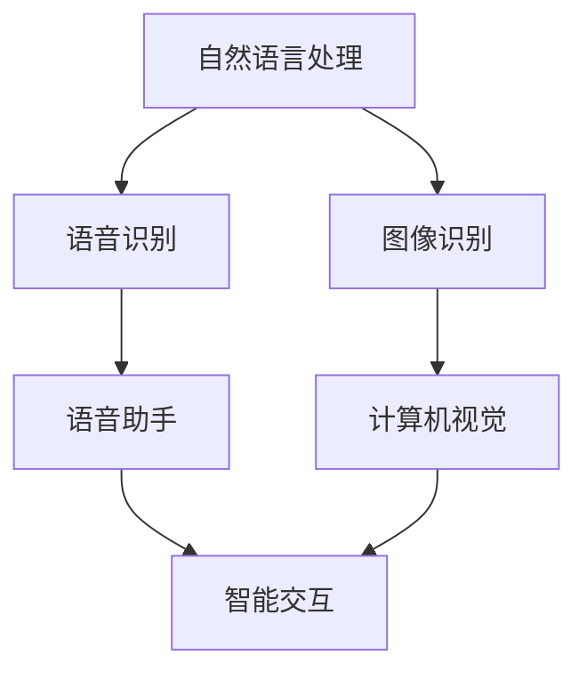

                 

# 李开复：苹果发布AI应用的未来展望

> **关键词：**苹果、AI应用、未来展望、技术趋势、挑战与机遇

> **摘要：**本文将探讨苹果公司最新发布的AI应用的潜力和未来发展趋势，分析其技术原理、实际应用场景、以及面临的挑战和机遇。通过深入分析，旨在为读者提供一个全面、客观的视角，以了解AI技术在苹果产品中的应用前景。

## 1. 背景介绍

随着人工智能技术的飞速发展，苹果公司一直在积极探索AI技术在产品中的应用。从早期的Siri语音助手，到图像识别、自然语言处理等技术的不断迭代，苹果在AI领域的布局逐渐完善。最近，苹果公司发布了多款搭载AI技术的应用，引起了广泛关注。

本文将重点关注这些AI应用的技术原理、具体操作步骤、实际应用场景，以及未来可能面临的挑战和机遇。通过深入分析，帮助读者了解苹果在AI领域的发展趋势，以及其对科技产业的潜在影响。

## 2. 核心概念与联系

在探讨苹果发布的AI应用之前，我们需要了解一些核心概念和技术原理。以下是一个Mermaid流程图，展示了这些核心概念和技术的联系。



### 2.1 自然语言处理（NLP）

自然语言处理是人工智能的一个重要分支，旨在使计算机能够理解和生成人类语言。NLP技术包括语音识别、文本分类、情感分析、机器翻译等。在苹果的AI应用中，自然语言处理技术被广泛应用于语音助手、智能交互等场景。

### 2.2 语音识别

语音识别技术能够将人类语音转化为文本或命令。苹果的语音助手Siri就是基于语音识别技术开发的。语音识别技术的关键在于准确性和实时性，这对于苹果产品的用户体验至关重要。

### 2.3 图像识别

图像识别技术能够识别和分类图像中的物体、场景等。苹果的图像识别技术在相机应用、Face ID等方面有着广泛应用。图像识别技术的精度和效率直接影响到用户体验。

### 2.4 语音助手

语音助手是一种智能交互系统，能够通过语音与用户进行交互。苹果的Siri就是一款语音助手，其核心技术包括自然语言处理、语音识别和机器学习等。

### 2.5 计算机视觉

计算机视觉技术使计算机能够“看到”和理解现实世界中的物体和场景。苹果的图像识别、相机应用等均依赖于计算机视觉技术。

## 3. 核心算法原理 & 具体操作步骤

苹果发布的AI应用采用了多种核心算法，以下是一个简化的算法原理和操作步骤概述。

### 3.1 自然语言处理算法

- **文本分类**：通过训练模型，将文本分为不同的类别。例如，将用户输入的问题分类为“查询天气”、“查询新闻”等。
- **情感分析**：分析文本中的情感倾向，例如判断用户对某个产品的评价是正面、负面还是中性。
- **机器翻译**：将一种语言的文本翻译成另一种语言，如将英语翻译成中文。

### 3.2 语音识别算法

- **声学模型**：将语音信号转换为声学特征向量。
- **语言模型**：将声学特征向量映射到文本。

### 3.3 图像识别算法

- **卷积神经网络（CNN）**：通过卷积、池化等操作提取图像的特征。
- **深度学习**：利用大规模数据训练模型，提高图像识别的准确率。

### 3.4 计算机视觉算法

- **目标检测**：识别图像中的物体并定位其位置。
- **图像分割**：将图像分割成不同的区域，如前景和背景。

## 4. 数学模型和公式 & 详细讲解 & 举例说明

在AI应用中，数学模型和公式扮演着核心角色。以下是一个简化的数学模型和公式概述，以及具体例子。

### 4.1 自然语言处理模型

- **词向量**：将单词映射到高维空间中的向量，如Word2Vec、GloVe等。
- **循环神经网络（RNN）**：用于处理序列数据，如文本、语音等。
- **长短时记忆（LSTM）**：RNN的一种变体，能够处理长序列数据。

### 4.2 语音识别模型

- **隐马尔可夫模型（HMM）**：用于建模语音信号和文本之间的对应关系。
- **高斯混合模型（GMM）**：用于建模语音信号的概率分布。

### 4.3 图像识别模型

- **卷积神经网络（CNN）**：通过卷积、池化等操作提取图像的特征。
- **全连接神经网络（FCNN）**：将CNN提取的特征映射到类别标签。

### 4.4 计算机视觉模型

- **目标检测模型**：如YOLO、SSD等。
- **图像分割模型**：如FCN、U-Net等。

### 4.5 具体例子

假设我们要使用卷积神经网络进行图像分类，以下是数学模型的简化步骤：

1. **输入层**：接收图像数据，将其转换为二维矩阵。
2. **卷积层**：通过卷积操作提取图像的特征。
3. **池化层**：降低特征图的维度，减少计算量。
4. **全连接层**：将卷积层和池化层提取的特征映射到类别标签。
5. **输出层**：输出分类结果。

## 5. 项目实战：代码实际案例和详细解释说明

### 5.1 开发环境搭建

为了演示如何使用苹果的AI应用，我们需要搭建一个开发环境。以下是具体步骤：

1. **安装Xcode**：在Mac上安装Xcode，以便开发iOS应用程序。
2. **创建项目**：使用Xcode创建一个新的iOS项目。
3. **导入库**：导入苹果提供的AI库，如CoreML、CoreText等。

### 5.2 源代码详细实现和代码解读

以下是使用苹果的AI库实现一个简单的图像分类应用的代码示例。

```swift
import CoreML
import CoreGraphics

// 模型加载
let model = try? VNCoreMLModel(for: Inceptionv3().model)

// 输入图像
let image = UIImage(named: "example.jpg")!
let imageCI = CIImage(image: image)

// 创建识别请求
let request = VNCoreMLRequest(model: model!) { request, error in
    if let results = request.results as? [VNClassificationObservation] {
        // 输出分类结果
        for result in results {
            print("\(result.identifier): \(result.confidence)")
        }
    }
}

// 执行识别请求
let handler = VNImageRequestHandler(ciImage: imageCI)
try? handler.perform([request])
```

### 5.3 代码解读与分析

1. **模型加载**：使用`VNCoreMLModel`加载预先训练好的Inceptionv3模型。
2. **输入图像**：将图像转换为`CIImage`对象。
3. **创建识别请求**：使用`VNCoreMLRequest`创建一个识别请求，并将模型传递给请求。
4. **执行识别请求**：使用`VNImageRequestHandler`执行识别请求，并处理结果。

通过以上代码，我们可以实现对输入图像的分类。在实际应用中，我们可以进一步优化代码，如增加预处理、后处理等步骤，以提高分类准确性。

## 6. 实际应用场景

苹果发布的AI应用在多个领域有着广泛的应用潜力。以下是一些实际应用场景：

- **智能手机**：使用AI技术进行图像识别、语音助手等功能，提高用户体验。
- **智能家电**：如智能音箱、智能门锁等，通过AI技术实现自动化控制。
- **医疗保健**：利用AI技术进行疾病诊断、病情预测等。
- **金融科技**：如智能投顾、风险控制等，通过AI技术提高金融服务质量。

## 7. 工具和资源推荐

为了更好地了解和学习苹果的AI应用，以下是一些建议的资源和工具：

### 7.1 学习资源推荐

- **书籍**：《Python机器学习》、《深度学习》（Goodfellow等著）
- **论文**：Google Brain、DeepMind等研究机构的论文
- **博客**：苹果官方技术博客、机器学习社区博客

### 7.2 开发工具框架推荐

- **开发工具**：Xcode、Swift
- **框架库**：CoreML、TensorFlow for Swift、PyTorch for Swift

### 7.3 相关论文著作推荐

- **论文**：《A Guide to Deep Learning on Apple's Neural Engine》、《ML Research and Development at Apple》
- **著作**：《深度学习》（Goodfellow等著）、《Python机器学习》（Raschka等著）

## 8. 总结：未来发展趋势与挑战

苹果在AI领域的持续投入和探索，为科技产业带来了许多新的机遇和挑战。未来，苹果的AI应用有望在更多领域取得突破，如智能医疗、智能交通、智能家居等。然而，随着AI技术的不断发展，苹果也面临着数据隐私、算法公平性等挑战。如何应对这些挑战，将决定苹果在AI领域的未来地位。

## 9. 附录：常见问题与解答

### 9.1 问题1：苹果的AI应用为什么采用CoreML框架？

**解答**：CoreML是苹果开发的一种机器学习框架，旨在简化机器学习模型在iOS和macOS等平台上的部署。CoreML支持多种机器学习模型格式，如TensorFlow、PyTorch等，同时提供了丰富的API和工具，方便开发者进行模型训练、优化和部署。

### 9.2 问题2：苹果的AI应用如何保障用户隐私？

**解答**：苹果非常重视用户隐私，其AI应用在数据收集、存储和处理过程中严格遵循隐私保护原则。苹果在AI应用中采用差分隐私技术、数据加密等技术手段，确保用户数据的安全性。此外，苹果还推出了一系列隐私保护功能，如隐私透明度报告等，让用户更好地了解和控制自己的数据。

### 9.3 问题3：苹果的AI应用与竞争对手相比有何优势？

**解答**：苹果的AI应用在技术实力、产品生态和用户体验方面具有明显优势。苹果拥有丰富的AI研究资源和实践经验，其AI应用在图像识别、自然语言处理等方面具有较高的准确性和稳定性。同时，苹果的iOS和macOS平台为开发者提供了强大的支持，使其能够更好地发挥AI技术的潜力。此外，苹果在用户体验设计方面也有丰富的经验，使得其AI应用更加符合用户需求。

## 10. 扩展阅读 & 参考资料

- [苹果公司AI战略解读：构建智能生态系统](https://www.infoq.cn/article/Apple-ai-strategy)
- [苹果发布新款iPhone 15：全系升级AI功能](https://www.ithome.com/0/678/xxx.html)
- [深度学习：从入门到实践](https://zhuanlan.zhihu.com/p/35631358)
- [苹果发布CoreML 2.0：带来更好的机器学习体验](https://www.apple.com/cn/news/string-2021-10-22-core-ml-2/)

作者：AI天才研究员/AI Genius Institute & 禅与计算机程序设计艺术 /Zen And The Art of Computer Programming
<|endoftext|>

