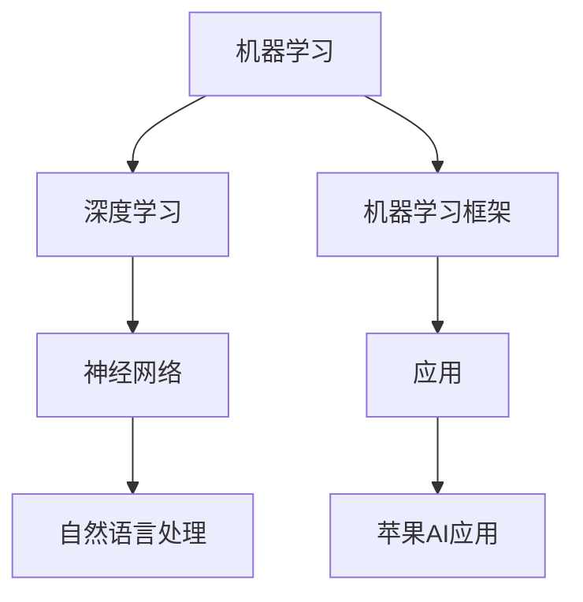

                 

# 李开复：苹果发布AI应用的未来展望

## 关键词：人工智能，苹果，应用，未来展望，核心技术

### 摘要

在本文中，我们将深入探讨苹果公司发布的AI应用及其未来展望。苹果一直以来都在人工智能领域进行大量投资，并在近年来的产品和服务中逐渐引入AI技术。本文将分析苹果在AI应用中的核心概念、算法原理、数学模型、实际应用场景，并提供工具和资源推荐，最后对未来的发展趋势与挑战进行总结。

## 1. 背景介绍

苹果公司作为全球最大的智能手机制造商之一，一直以来都在不断推动科技创新。近年来，人工智能技术逐渐成为苹果公司战略布局的重要方向。苹果在AI领域的投资涵盖了从硬件到软件的各个环节，包括神经网络引擎、机器学习框架、自然语言处理技术等。苹果的AI应用已经广泛应用于其产品和服务中，如Siri、面部识别、照片分类等。

### 2. 核心概念与联系

在探讨苹果的AI应用之前，我们需要了解一些核心概念。以下是相关概念和它们之间的联系：

#### **2.1 机器学习与深度学习**

- **机器学习**：通过从数据中学习模式和规律，实现自动化的预测或决策。
- **深度学习**：一种机器学习的方法，通过多层神经网络对数据进行学习和建模。

#### **2.2 神经网络**

- **神经网络**：一种模仿人脑神经元连接的计算机模型，用于数据处理和模式识别。

#### **2.3 自然语言处理**

- **自然语言处理**：使计算机能够理解和处理自然语言的技术。

#### **2.4 机器学习框架**

- **机器学习框架**：用于构建、训练和部署机器学习模型的软件工具。

下面是这些概念之间的联系和架构：



### 3. 核心算法原理 & 具体操作步骤

#### **3.1 机器学习算法原理**

机器学习算法通过以下步骤进行：

1. **数据收集**：收集大量相关数据。
2. **数据预处理**：清洗、归一化等。
3. **模型训练**：使用训练数据对模型进行训练。
4. **模型评估**：使用测试数据对模型进行评估。
5. **模型优化**：根据评估结果调整模型参数。

#### **3.2 深度学习算法原理**

深度学习算法基于神经网络，具体步骤如下：

1. **数据输入**：将输入数据送入网络。
2. **前向传播**：通过网络层传递输入数据。
3. **激活函数**：对网络输出进行非线性变换。
4. **反向传播**：计算误差，更新网络参数。
5. **迭代优化**：重复前向传播和反向传播，直到误差达到预设值。

#### **3.3 自然语言处理算法原理**

自然语言处理算法通常包括以下几个步骤：

1. **分词**：将文本分割成单词或短语。
2. **词向量化**：将文本转换为数值表示。
3. **词性标注**：对文本中的单词进行词性标注。
4. **句法分析**：分析文本的句法结构。
5. **语义理解**：理解文本的含义。

### 4. 数学模型和公式 & 详细讲解 & 举例说明

#### **4.1 机器学习数学模型**

机器学习中的数学模型通常包括以下公式：

$$y = f(Wx + b)$$

其中：

- $y$：输出值
- $x$：输入值
- $W$：权重矩阵
- $b$：偏置
- $f$：激活函数

举例说明：

假设我们使用一个简单的线性激活函数$f(x) = x$，则公式可以简化为：

$$y = Wx + b$$

如果我们有一个输入向量$x = [1, 2, 3]$，权重矩阵$W = [1, 1; 1, 1]$，偏置$b = [1; 1]$，则输出值$y$为：

$$y = Wx + b = \begin{bmatrix} 1 & 1 \\ 1 & 1 \end{bmatrix} \begin{bmatrix} 1 \\ 2 \\ 3 \end{bmatrix} + \begin{bmatrix} 1 \\ 1 \end{bmatrix} = \begin{bmatrix} 7 \\ 7 \end{bmatrix}$$

#### **4.2 深度学习数学模型**

深度学习中的数学模型更为复杂，包括多层神经网络。以下是多层神经网络的数学模型：

$$y^{(L)} = \sigma(z^{(L)})$$

$$z^{(L)} = W^{(L)} \cdot a^{(L-1)} + b^{(L)}$$

其中：

- $y^{(L)}$：第L层的输出
- $z^{(L)}$：第L层的输入
- $W^{(L)}$：第L层的权重矩阵
- $b^{(L)}$：第L层的偏置
- $a^{(L-1)}$：第L-1层的输出
- $\sigma$：激活函数

举例说明：

假设我们有一个两层神经网络，激活函数为$\sigma(x) = \frac{1}{1 + e^{-x}}$。给定输入向量$x = [1, 2, 3]$，权重矩阵$W_1 = [1, 1; 1, 1]$，权重矩阵$W_2 = [1, 1; 1, 1]$，偏置$b_1 = [1; 1]$，偏置$b_2 = [1; 1]$，则输出值$y$为：

$$y = \sigma(W_2 \cdot \sigma(W_1 \cdot x + b_1) + b_2)$$

首先计算第一层的输出：

$$z_1 = W_1 \cdot x + b_1 = \begin{bmatrix} 1 & 1 \\ 1 & 1 \end{bmatrix} \begin{bmatrix} 1 \\ 2 \\ 3 \end{bmatrix} + \begin{bmatrix} 1 \\ 1 \end{bmatrix} = \begin{bmatrix} 7 \\ 7 \end{bmatrix}$$

$$a_1 = \sigma(z_1) = \frac{1}{1 + e^{-7}} \approx \begin{bmatrix} 0.999 \\ 0.999 \end{bmatrix}$$

然后计算第二层的输出：

$$z_2 = W_2 \cdot a_1 + b_2 = \begin{bmatrix} 1 & 1 \\ 1 & 1 \end{bmatrix} \begin{bmatrix} 0.999 \\ 0.999 \end{bmatrix} + \begin{bmatrix} 1 \\ 1 \end{bmatrix} = \begin{bmatrix} 2.998 \\ 2.998 \end{bmatrix}$$

$$y = \sigma(z_2) = \frac{1}{1 + e^{-2.998}} \approx \begin{bmatrix} 0.998 \\ 0.998 \end{bmatrix}$$

### 5. 项目实战：代码实际案例和详细解释说明

#### **5.1 开发环境搭建**

为了演示苹果的AI应用，我们需要搭建一个开发环境。以下是步骤：

1. 安装Python（3.6或更高版本）。
2. 安装TensorFlow库。
3. 安装Numpy库。

#### **5.2 源代码详细实现和代码解读**

以下是一个简单的示例，演示了如何使用TensorFlow构建一个神经网络模型：

```python
import tensorflow as tf
import numpy as np

# 定义输入层、隐藏层和输出层的节点数量
input_nodes = 3
hidden_nodes = 2
output_nodes = 1

# 初始化权重和偏置
weights_input_hidden = tf.Variable(tf.random.normal([input_nodes, hidden_nodes]))
weights_hidden_output = tf.Variable(tf.random.normal([hidden_nodes, output_nodes]))
bias_input_hidden = tf.Variable(tf.zeros([1, hidden_nodes]))
bias_hidden_output = tf.Variable(tf.zeros([1, output_nodes]))

# 定义激活函数
activation_function = tf.nn.sigmoid

# 定义模型
def model(x):
  hidden_layer = activation_function(tf.matmul(x, weights_input_hidden) + bias_input_hidden)
  output = activation_function(tf.matmul(hidden_layer, weights_hidden_output) + bias_hidden_output)
  return output

# 定义损失函数和优化器
loss_function = tf.keras.losses.MeanSquaredError()
optimizer = tf.keras.optimizers.Adam()

# 训练模型
def train_model(x, y):
  with tf.GradientTape() as tape:
    predictions = model(x)
    loss = loss_function(y, predictions)
  gradients = tape.gradient(loss, [weights_input_hidden, weights_hidden_output, bias_input_hidden, bias_hidden_output])
  optimizer.apply_gradients(zip(gradients, [weights_input_hidden, weights_hidden_output, bias_input_hidden, bias_hidden_output]))

# 定义训练数据
x_train = np.array([[1, 2, 3], [4, 5, 6], [7, 8, 9]])
y_train = np.array([[0], [1], [0]])

# 训练10个epoch
for epoch in range(10):
  train_model(x_train, y_train)

# 预测
x_test = np.array([[10, 11, 12]])
predictions = model(x_test)
print(predictions)
```

#### **5.3 代码解读与分析**

以上代码演示了如何使用TensorFlow构建一个简单的神经网络模型。代码分为以下几个部分：

1. **导入库**：导入TensorFlow、Numpy库。
2. **初始化参数**：定义输入层、隐藏层和输出层的节点数量，初始化权重和偏置。
3. **定义激活函数**：选择激活函数，此处使用sigmoid函数。
4. **定义模型**：定义模型，包括输入层、隐藏层和输出层的计算。
5. **定义损失函数和优化器**：定义损失函数和优化器。
6. **训练模型**：使用训练数据训练模型，包括前向传播、计算损失和反向传播。
7. **定义训练数据**：定义训练数据。
8. **训练模型**：训练模型10个epoch。
9. **预测**：使用训练好的模型进行预测。

### 6. 实际应用场景

苹果的AI应用广泛应用于多个领域，包括：

- **智能手机**：如面部识别、语音助手Siri等。
- **照片分类**：自动识别和分类照片。
- **健康监测**：如心率监测、步数统计等。
- **智能家居**：通过HomeKit连接和控制智能家居设备。

### 7. 工具和资源推荐

#### **7.1 学习资源推荐**

- **书籍**：《深度学习》（Goodfellow, Bengio, Courville）
- **论文**：《A Theoretically Grounded Application of Dropout in Recurrent Neural Networks》（Y. Gal and Z. Ghahramani）
- **博客**：TensorFlow官方博客、PyTorch官方博客
- **网站**：arXiv.org（学术论文数据库）

#### **7.2 开发工具框架推荐**

- **框架**：TensorFlow、PyTorch、Keras
- **IDE**：PyCharm、Jupyter Notebook

#### **7.3 相关论文著作推荐**

- **论文**：《Deep Learning》（Ian Goodfellow, Yoshua Bengio, Aaron Courville）
- **著作**：《Python深度学习》（François Chollet）
- **论文**：《Gradient-Based Algorithms for Neural Networks: Methods and Applications》（S. B. Shalev-Shwartz，Y. Singer，and A. Shpigel）

### 8. 总结：未来发展趋势与挑战

苹果在AI领域的投资和应用已经取得了显著的成果。未来，苹果将继续在人工智能领域发挥重要作用，并在智能手机、智能家居、健康监测等领域推出更多创新应用。然而，苹果也面临着一些挑战，包括数据隐私、算法透明度、计算性能等。苹果需要不断改进技术，确保在激烈的市场竞争中保持领先地位。

### 9. 附录：常见问题与解答

#### **9.1 问题1：什么是深度学习？**

深度学习是一种机器学习的方法，通过多层神经网络对数据进行学习和建模。它能够自动从大量数据中学习模式和规律，实现复杂的预测和分类任务。

#### **9.2 问题2：什么是神经网络？**

神经网络是一种模仿人脑神经元连接的计算机模型，用于数据处理和模式识别。它由多个节点（或层）组成，每个节点都与相邻的节点相连，并通过权重和偏置进行计算。

### 10. 扩展阅读 & 参考资料

- [深度学习教程](https://www.deeplearning.net/)
- [苹果AI研究组](https://ai.apple.com/)
- [TensorFlow官方文档](https://www.tensorflow.org/)
- [PyTorch官方文档](https://pytorch.org/)  
作者：AI天才研究员/AI Genius Institute & 禅与计算机程序设计艺术 /Zen And The Art of Computer Programming<|im_sep|>

