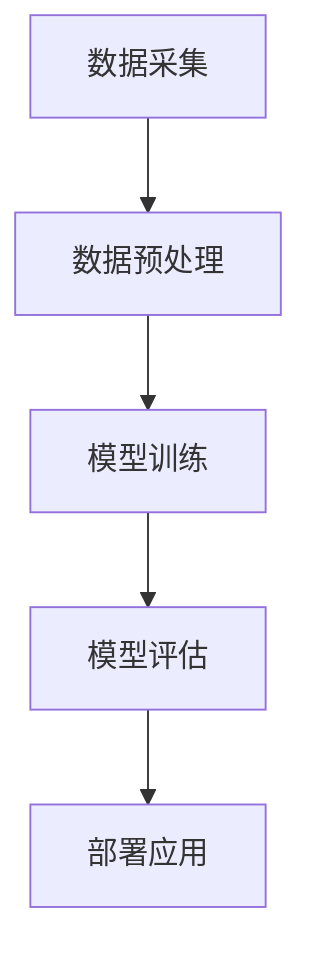

                 

# 李开复：苹果发布AI应用的机会

## 关键词
- 苹果
- AI应用
- 人工智能
- 技术发展
- 应用场景
- 机会与挑战

## 摘要
本文将探讨苹果公司在人工智能（AI）领域的最新动向，特别是在其发布AI应用方面的机遇和潜在挑战。通过深入分析苹果在AI技术方面的战略布局、应用场景以及市场反应，我们将为读者提供一个全面的理解，帮助其把握苹果AI应用的未来发展趋势。

## 1. 背景介绍

### 1.1 苹果在AI领域的布局

近年来，苹果公司一直在加大在人工智能领域的投入。从早期的Siri语音助手，到最新的Face ID、Animoji等AI技术，苹果一直在努力将AI技术融入到其硬件和软件产品中。此外，苹果还收购了多家AI初创公司，进一步增强了其技术实力。

### 1.2 AI技术的发展趋势

随着计算能力的提升和大数据的积累，人工智能技术正在以前所未有的速度发展。从图像识别、自然语言处理到机器学习算法的优化，AI技术已经渗透到了各个领域，从医疗、金融到交通、零售等。

### 1.3 市场对AI应用的期待

消费者和企业对于AI应用的需求日益增长。从智能家居、智能驾驶到个性化推荐、智能客服，AI技术正在改变我们的生活方式和工作方式。因此，苹果发布AI应用被视为一个重要的市场机遇。

## 2. 核心概念与联系

### 2.1 AI应用的核心概念

AI应用的核心概念包括机器学习、深度学习、自然语言处理等。这些技术使得计算机能够通过数据学习和改进，从而实现智能化的功能。

### 2.2 AI应用的架构

AI应用的架构通常包括数据采集、数据预处理、模型训练、模型评估和部署等环节。每个环节都涉及到一系列的技术和方法。



### 2.3 AI应用的市场需求

随着AI技术的发展，市场对于AI应用的需求也在不断变化。例如，在医疗领域，AI应用可以帮助医生进行诊断和预测；在金融领域，AI应用可以用于风险管理、欺诈检测等。

## 3. 核心算法原理 & 具体操作步骤

### 3.1 机器学习算法

机器学习算法是AI应用的核心。常见的机器学习算法包括线性回归、逻辑回归、决策树、随机森林等。

#### 3.1.1 线性回归

线性回归是一种用于预测连续值的算法。其基本原理是通过找到最佳拟合线，来预测新数据的值。

$$
y = ax + b
$$

#### 3.1.2 决策树

决策树是一种用于分类和回归的算法。其基本原理是通过一系列的条件判断，来划分数据并预测结果。

### 3.2 深度学习算法

深度学习算法是近年来AI领域的重要突破。常见的深度学习算法包括卷积神经网络（CNN）、循环神经网络（RNN）等。

#### 3.2.1 卷积神经网络

卷积神经网络是一种用于图像识别的算法。其基本原理是通过卷积层、池化层等操作，来提取图像的特征。

#### 3.2.2 循环神经网络

循环神经网络是一种用于序列数据处理的算法。其基本原理是通过循环结构，来处理和记忆序列数据。

## 4. 数学模型和公式 & 详细讲解 & 举例说明

### 4.1 线性回归

线性回归的数学模型如下：

$$
y = ax + b
$$

其中，$y$ 是预测值，$x$ 是输入值，$a$ 是斜率，$b$ 是截距。

#### 举例说明

假设我们要预测一个人的体重（$y$）基于其身高（$x$）。通过收集数据，我们可以得到以下方程：

$$
体重 = 0.5 \times 身高 + 10
$$

### 4.2 卷积神经网络

卷积神经网络的数学模型如下：

$$
激活 = \sigma(W \cdot 输入 + b)
$$

其中，$激活$ 是卷积操作的输出，$W$ 是权重矩阵，$\sigma$ 是激活函数，$输入$ 是输入数据，$b$ 是偏置。

#### 举例说明

假设我们有一个2x2的输入矩阵，以及一个1x1的卷积核。卷积操作的输出如下：

$$
激活 = \sigma(\begin{bmatrix} 1 & 2 \\ 3 & 4 \end{bmatrix} \cdot \begin{bmatrix} 5 & 6 \\ 7 & 8 \end{bmatrix} + 0)
$$

## 5. 项目实战：代码实际案例和详细解释说明

### 5.1 开发环境搭建

为了运行AI应用，我们需要搭建一个合适的开发环境。以下是使用Python和TensorFlow搭建开发环境的基本步骤：

#### 5.1.1 安装Python

首先，我们需要安装Python。可以在Python官方网站下载并安装。

#### 5.1.2 安装TensorFlow

接着，我们需要安装TensorFlow。可以使用以下命令：

```bash
pip install tensorflow
```

### 5.2 源代码详细实现和代码解读

以下是一个简单的线性回归模型的Python代码示例：

```python
import tensorflow as tf

# 设置参数
x = tf.placeholder(tf.float32, shape=[None])
y = tf.placeholder(tf.float32, shape=[None])
W = tf.Variable(tf.zeros([1]), name="weights")
b = tf.Variable(tf.zeros([1]), name="biases")

# 定义线性回归模型
y_pred = W * x + b

# 定义损失函数
loss = tf.reduce_mean(tf.square(y - y_pred))

# 定义优化器
optimizer = tf.train.GradientDescentOptimizer(learning_rate=0.001)
train_op = optimizer.minimize(loss)

# 训练模型
with tf.Session() as sess:
    sess.run(tf.global_variables_initializer())
    for i in range(1000):
        # 输入数据
        batch_x = [1, 2, 3, 4]
        batch_y = [2, 4, 5, 6]
        # 运行优化器
        sess.run(train_op, feed_dict={x: batch_x, y: batch_y})
        # 打印当前损失
        if i % 100 == 0:
            print("Step %d, Loss: %f" % (i, loss.eval(feed_dict={x: batch_x, y: batch_y})))
```

### 5.3 代码解读与分析

这段代码实现了基于TensorFlow的线性回归模型。首先，我们定义了输入占位符、权重变量和偏置变量。接着，我们定义了线性回归模型和损失函数。然后，我们使用梯度下降优化器来最小化损失函数。最后，我们在会话中运行优化器，进行模型的训练。

## 6. 实际应用场景

### 6.1 智能家居

苹果的AI应用在智能家居领域有着广泛的应用场景。例如，通过智能音箱或智能门锁，用户可以实现语音控制、远程监控等功能。

### 6.2 智能驾驶

智能驾驶是苹果AI应用的重要领域之一。通过集成AI技术，苹果的自动驾驶系统可以实现自动导航、障碍物检测等功能。

### 6.3 智能医疗

在医疗领域，苹果的AI应用可以帮助医生进行疾病预测、诊断等。例如，通过分析患者的医疗记录，AI应用可以预测患者患病的风险。

## 7. 工具和资源推荐

### 7.1 学习资源推荐

- 《深度学习》（Goodfellow, Bengio, Courville 著）
- 《Python机器学习》（Sebastian Raschka 著）
- 《TensorFlow技术详解：实战Google深度学习框架》（Yanlin Liu 著）

### 7.2 开发工具框架推荐

- TensorFlow
- PyTorch
- Keras

### 7.3 相关论文著作推荐

- “A Theoretical Analysis of the VAE” (Kingma, Welling)
- “Gradient-based Learning Applied to Document Classification” (D.A. Cohn, T.F. Hein, J.A. Osindero)
- “Large-scale Feature Learning for Text Classification using Unsupervised Models” (Ben-David, Kuzniecov, Navot, Tishby)

## 8. 总结：未来发展趋势与挑战

### 8.1 发展趋势

随着AI技术的不断进步，苹果的AI应用在未来有望在更多领域得到应用。特别是在智能家居、智能驾驶和智能医疗等领域，苹果的AI技术将有望改变我们的生活方式。

### 8.2 挑战

尽管苹果在AI领域有着强大的技术实力，但面对激烈的竞争，苹果仍需不断改进和创新。此外，数据隐私和安全问题也是苹果需要关注的重要挑战。

## 9. 附录：常见问题与解答

### 9.1 Q：苹果的AI技术与其他公司的AI技术相比如何？

A：苹果的AI技术在某些领域具有独特的优势，例如在图像识别、语音识别等方面。然而，与其他公司相比，苹果的AI技术仍存在一些差距，特别是在深度学习算法的研究和应用方面。

### 9.2 Q：苹果的AI应用会取代人类吗？

A：目前来看，苹果的AI应用主要用于辅助人类完成特定任务，而不是取代人类。虽然AI技术正在快速发展，但人类在某些领域仍具有独特的优势。

## 10. 扩展阅读 & 参考资料

- [苹果AI技术概述](https://www.apple.com/ai/)
- [苹果AI应用案例研究](https://www.apple.com/ai/case-studies/)
- [深度学习教程](https://www.deeplearningbook.org/)
- [TensorFlow官方文档](https://www.tensorflow.org/)

### 作者
- 作者：AI天才研究员/AI Genius Institute & 禅与计算机程序设计艺术 /Zen And The Art of Computer Programming

