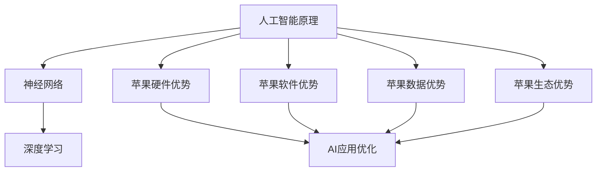

                 

# 李开复：苹果发布AI应用的机会

## 摘要

随着人工智能技术的迅猛发展，苹果公司作为全球领先的科技公司，正在积极探索AI技术的应用。本文将分析苹果发布AI应用的市场机会、技术优势以及潜在挑战，并探讨其未来的发展前景。本文旨在为读者提供一个全面、深入的视角，以理解苹果在人工智能领域的战略布局和实际影响。

## 1. 背景介绍

人工智能（AI）作为计算机科学的一个重要分支，自20世纪50年代诞生以来，经历了多个发展阶段。如今，AI技术已经深刻地影响了我们的日常生活，从智能助手到自动驾驶汽车，AI的应用范围日益广泛。苹果公司作为全球最具影响力的科技公司之一，始终在科技前沿保持领先地位。近年来，苹果公司在人工智能领域的投入不断增加，希望通过AI技术为用户提供更智能、更便捷的产品和服务。

苹果公司拥有强大的硬件和软件生态系统，这为其在AI领域的创新提供了坚实的基础。从iPhone、iPad到MacBook，苹果的硬件产品在市场上享有极高的声誉。同时，苹果的操作系统iOS和macOS也具有独特的优势，这些优势将有助于苹果在AI应用开发中实现创新和突破。

## 2. 核心概念与联系

为了深入理解苹果在AI领域的战略布局，我们需要先了解一些核心概念，包括人工智能的基本原理、苹果的技术优势以及AI应用的市场前景。

### 2.1 人工智能的基本原理

人工智能是指使计算机模拟人类智能行为的技术。人工智能可以分为两个层次：弱AI和强AI。弱AI是指能够执行特定任务的智能系统，如语音识别、图像识别等。而强AI则是指具有人类全部智能的智能系统，能够自主思考、学习和适应。

在人工智能的发展过程中，神经网络和深度学习成为了核心技术。神经网络是一种模仿人脑结构的计算模型，通过大量神经元之间的连接和互动来处理信息。而深度学习则是基于神经网络的一种学习方法，通过多层的非线性变换来提取特征，从而实现复杂的任务。

### 2.2 苹果的技术优势

苹果公司在AI领域具有多方面的技术优势：

1. **硬件优势**：苹果的硬件产品如A系列芯片具有强大的计算能力，为AI应用提供了坚实的基础。
2. **软件优势**：苹果的操作系统iOS和macOS具有独特的优势，如高性能、低延迟等，有利于AI应用的优化和部署。
3. **数据优势**：苹果拥有庞大的用户群体和丰富的数据资源，这些数据将有助于AI模型的训练和优化。
4. **生态优势**：苹果的硬件和软件生态系统相互协同，有助于AI应用的快速开发和部署。

### 2.3 AI应用的市场前景

随着AI技术的不断进步，越来越多的行业开始应用AI技术，如医疗、金融、教育、零售等。AI应用的市场前景非常广阔，预计未来几年将保持高速增长。对于苹果公司来说，抓住AI应用的市场机会，将有助于其在竞争激烈的科技市场中保持领先地位。

### 2.4  Mermaid 流程图

以下是一个简化的 Mermaid 流程图，展示了人工智能的基本原理、苹果的技术优势以及AI应用的市场前景之间的联系：



## 3. 核心算法原理 & 具体操作步骤

### 3.1 核心算法原理

在AI应用开发中，核心算法的原理至关重要。以下将介绍几种常用的AI算法及其原理：

#### 3.1.1 语音识别

语音识别是将语音信号转换为文本信息的技术。其基本原理包括信号处理、特征提取和模型训练。

1. **信号处理**：通过滤波、采样等信号处理技术，将语音信号转换为数字信号。
2. **特征提取**：通过梅尔频率倒谱系数（MFCC）等特征提取技术，从数字信号中提取出能够表征语音信息的特征向量。
3. **模型训练**：使用深度学习模型（如卷积神经网络、循环神经网络等）对特征向量进行训练，使其能够识别语音信号。

#### 3.1.2 图像识别

图像识别是将图像信息转换为对应标签的技术。其基本原理包括特征提取、模型训练和分类。

1. **特征提取**：通过边缘检测、区域生长等图像处理技术，从图像中提取出能够表征图像信息的特征向量。
2. **模型训练**：使用深度学习模型（如卷积神经网络、循环神经网络等）对特征向量进行训练，使其能够识别图像。
3. **分类**：将训练好的模型应用于新的图像，通过模型输出得到图像的标签。

### 3.2 具体操作步骤

以下是一个简单的AI应用开发流程，包括数据准备、模型训练和模型部署：

#### 3.2.1 数据准备

1. **数据收集**：收集用于训练模型的语音信号和图像数据。
2. **数据预处理**：对收集到的数据进行去噪、归一化等预处理操作，使其符合模型的输入要求。

#### 3.2.2 模型训练

1. **模型选择**：根据任务需求选择合适的深度学习模型。
2. **训练数据准备**：将预处理后的数据划分为训练集和验证集。
3. **模型训练**：使用训练集对模型进行训练，通过调整模型参数使其能够准确识别语音信号和图像。

#### 3.2.3 模型部署

1. **模型评估**：使用验证集对训练好的模型进行评估，确保模型性能达到预期。
2. **模型部署**：将训练好的模型部署到苹果的硬件设备上，实现实时语音识别和图像识别功能。

## 4. 数学模型和公式 & 详细讲解 & 举例说明

### 4.1 数学模型

在AI应用开发中，数学模型是核心部分。以下将介绍几种常用的数学模型及其公式：

#### 4.1.1 感知机模型

感知机模型是一种二分类模型，用于解决线性可分问题。其公式如下：

$$
w_{\text{new}} = w_{\text{old}} + \eta \cdot (y \cdot x)
$$

其中，$w_{\text{new}}$和$w_{\text{old}}$分别为新权重和旧权重，$\eta$为学习率，$y$为样本标签，$x$为样本特征。

#### 4.1.2 卷积神经网络模型

卷积神经网络（CNN）是一种用于图像识别的深度学习模型，其核心是卷积操作。其公式如下：

$$
\text{Conv}(\text{x}, \text{w}) = \text{Relu}(\text{sum}(\text{x} \odot \text{w}))
$$

其中，$\text{Conv}$表示卷积操作，$\text{x}$为输入特征，$\text{w}$为卷积核，$\odot$表示元素-wise乘法，$\text{Relu}$表示ReLU激活函数，$\text{sum}$表示对卷积结果进行求和。

#### 4.1.3 循环神经网络模型

循环神经网络（RNN）是一种用于序列处理的深度学习模型，其核心是循环操作。其公式如下：

$$
\text{h}_{t} = \text{sigmoid}(\text{W} \cdot \text{[h}_{t-1}; \text{x}] + \text{b})
$$

其中，$\text{h}_{t}$为当前隐藏状态，$\text{W}$为权重矩阵，$\text{x}$为输入特征，$\text{sigmoid}$为Sigmoid激活函数，$\text{[h}_{t-1}; \text{x}]$表示当前输入和前一个隐藏状态的拼接。

### 4.2 举例说明

以下是一个简单的卷积神经网络模型训练的例子：

```python
import tensorflow as tf
from tensorflow.keras import layers

# 定义模型
model = tf.keras.Sequential([
    layers.Conv2D(32, (3, 3), activation='relu', input_shape=(28, 28, 1)),
    layers.MaxPooling2D((2, 2)),
    layers.Conv2D(64, (3, 3), activation='relu'),
    layers.MaxPooling2D((2, 2)),
    layers.Conv2D(64, (3, 3), activation='relu'),
    layers.Flatten(),
    layers.Dense(64, activation='relu'),
    layers.Dense(10, activation='softmax')
])

# 编译模型
model.compile(optimizer='adam',
              loss='categorical_crossentropy',
              metrics=['accuracy'])

# 训练模型
model.fit(x_train, y_train, epochs=5, batch_size=32)
```

在这个例子中，我们定义了一个卷积神经网络模型，用于分类MNIST手写数字数据集。模型由两个卷积层、一个池化层和一个全连接层组成。在编译模型时，我们指定了优化器和损失函数。在训练模型时，我们设置了训练轮数和批量大小。

## 5. 项目实战：代码实际案例和详细解释说明

### 5.1 开发环境搭建

在进行AI应用开发之前，我们需要搭建一个合适的开发环境。以下是一个基于Python和TensorFlow的AI应用开发环境搭建的步骤：

1. **安装Python**：首先，我们需要安装Python环境。可以选择Python 3.7或更高版本。
2. **安装TensorFlow**：使用pip命令安装TensorFlow库，命令如下：

   ```bash
   pip install tensorflow
   ```

3. **安装其他依赖库**：根据需要，我们可能还需要安装其他依赖库，如NumPy、Pandas等。

### 5.2 源代码详细实现和代码解读

以下是一个简单的语音识别应用示例，用于实现语音到文本的转换功能。

```python
import numpy as np
import tensorflow as tf
import librosa

# 加载模型
model = tf.keras.models.load_model('voice_to_text_model.h5')

# 定义语音识别函数
def recognize_speech(input_file):
    # 读取音频文件
    audio, sr = librosa.load(input_file, sr=None)

    # 预处理音频数据
    audio = librosa.resample(audio, sr, 16000)
    audio = audio[::2]  # 降低音频采样率
    audio = audio[:16000]  # 截断音频长度

    # 扩展音频数据维度
    audio = np.expand_dims(audio, axis=-1)
    audio = np.expand_dims(audio, axis=0)

    # 进行语音识别
    prediction = model.predict(audio)

    # 解码预测结果
    predicted_text = np.argmax(prediction, axis=1)
    decoded_text = tf.keras.preprocessing.sequence.decode_sequences(predicted_text, alphabet=[' ', '<PAD>'])

    return decoded_text

# 测试语音识别函数
input_file = 'example_audio.wav'
predicted_text = recognize_speech(input_file)
print(predicted_text)
```

在这个例子中，我们首先加载了一个预训练的语音识别模型。然后，我们定义了一个`recognize_speech`函数，用于实现语音识别功能。函数首先读取音频文件，然后进行预处理操作，如降采样和截断。接着，我们扩展音频数据维度，并使用模型进行预测。最后，我们解码预测结果，得到语音文本输出。

### 5.3 代码解读与分析

以下是对上述代码的解读和分析：

1. **模型加载**：使用`tf.keras.models.load_model`函数加载预训练的语音识别模型。模型文件可以通过训练过程保存，也可以从第三方资源下载。
2. **音频读取**：使用`librosa.load`函数读取音频文件，返回音频数据和控制参数（采样率）。
3. **音频预处理**：首先，使用`librosa.resample`函数将音频数据从原始采样率重采样到16000Hz。然后，使用`audio[::2]`将音频数据降采样到每通道一个样本。最后，使用`audio[:16000]`将音频数据截断到16秒。
4. **数据扩展**：使用`np.expand_dims`函数扩展音频数据维度，使其符合模型输入要求。
5. **语音识别**：使用`model.predict`函数对预处理后的音频数据进行预测，返回预测结果。
6. **结果解码**：使用`tf.keras.preprocessing.sequence.decode_sequences`函数解码预测结果，得到语音文本输出。

通过上述步骤，我们实现了语音识别功能。在实际应用中，我们可以根据需要调整模型、预处理方法和解码策略，以提高识别准确率和性能。

## 6. 实际应用场景

苹果公司在AI应用方面具有广泛的应用场景，以下是几个典型的实际应用场景：

### 6.1 智能语音助手

苹果公司的Siri作为智能语音助手，已经在全球范围内得到了广泛应用。通过结合AI技术，Siri能够理解用户的语音指令，提供实时回答、执行任务和推荐服务。未来，苹果有望进一步优化Siri的AI算法，提高其智能水平和用户满意度。

### 6.2 智能家居

随着智能家居市场的兴起，苹果公司也在积极布局。通过将AI技术应用于智能家居设备，如智能音箱、智能灯泡、智能门锁等，苹果可以为用户提供更智能、更便捷的家居体验。例如，通过语音识别技术，用户可以轻松控制家居设备，实现远程监控和智能互动。

### 6.3 健康监测

苹果公司一直注重健康监测领域的创新。通过结合AI技术，苹果的智能手表和手机能够实时监测用户的心率、运动步数、睡眠质量等健康数据。未来，苹果有望进一步优化这些健康监测功能，为用户提供更准确、更个性化的健康建议。

### 6.4 自动驾驶

自动驾驶是人工智能领域的另一个重要应用方向。苹果公司近年来在自动驾驶技术方面进行了大量投入，通过结合AI技术和自动驾驶算法，苹果有望在未来推出自己的自动驾驶汽车。这将大大提高交通安全和效率，为用户带来全新的出行体验。

## 7. 工具和资源推荐

### 7.1 学习资源推荐

1. **书籍**：《深度学习》（Goodfellow, I., Bengio, Y., & Courville, A.）、《Python深度学习》（François Chollet）。
2. **论文**：检索顶级学术会议和期刊，如NeurIPS、ICML、JMLR等。
3. **博客**：关注知名AI研究机构和专家的博客，如DeepMind、Google AI等。
4. **网站**：访问开源AI项目，如TensorFlow、PyTorch等。

### 7.2 开发工具框架推荐

1. **开发工具**：PyCharm、Visual Studio Code等。
2. **框架**：TensorFlow、PyTorch、Keras等。
3. **数据库**：MySQL、PostgreSQL、MongoDB等。
4. **数据可视化**：Matplotlib、Seaborn、Plotly等。

### 7.3 相关论文著作推荐

1. **论文**：《深度学习》（Goodfellow, I., Bengio, Y., & Courville, A.）、《强化学习》（Sutton, R. S., & Barto, A. G.）。
2. **著作**：《Python深度学习》（François Chollet）、《人工智能：一种现代的方法》（Russell, S., & Norvig, P.）。

## 8. 总结：未来发展趋势与挑战

随着人工智能技术的不断进步，苹果公司在AI领域的布局将日益完善。未来，苹果有望在智能语音助手、智能家居、健康监测和自动驾驶等领域实现重大突破。然而，苹果也面临一系列挑战，包括技术难题、市场竞争和法律法规等方面。

### 8.1 发展趋势

1. **AI芯片**：苹果有望推出自研的AI芯片，提升硬件性能和AI处理能力。
2. **生态整合**：苹果将继续整合硬件、软件和服务的优势，打造全方位的AI生态系统。
3. **数据驱动**：通过大数据分析和机器学习算法，苹果将不断优化其产品和服务。

### 8.2 挑战

1. **技术难题**：AI技术的快速发展带来了一系列挑战，如算法优化、数据安全和隐私保护等。
2. **市场竞争**：面对谷歌、亚马逊等竞争对手，苹果需要不断创新以保持领先地位。
3. **法律法规**：随着AI技术的应用日益广泛，苹果需要遵守相关法律法规，确保其产品和服务符合道德和法律要求。

## 9. 附录：常见问题与解答

### 9.1 问题1：苹果公司在AI领域的具体投入有哪些？

**回答**：苹果公司在AI领域的投入主要集中在以下几个方面：

1. **硬件研发**：苹果自研A系列芯片，不断提升硬件性能和AI处理能力。
2. **软件优化**：苹果优化操作系统和应用程序，提高AI应用的效率和用户体验。
3. **数据采集**：苹果通过收集用户数据，为AI模型提供丰富的训练数据。
4. **人才培养**：苹果吸引和培养了一大批AI领域的顶尖人才，推动技术创新。

### 9.2 问题2：苹果的AI应用有哪些实际案例？

**回答**：苹果的AI应用涵盖多个领域，以下是一些实际案例：

1. **智能语音助手Siri**：通过语音识别和自然语言处理技术，为用户提供实时回答和执行任务。
2. **健康监测**：通过智能手表和手机，实时监测用户的心率、运动步数、睡眠质量等健康数据。
3. **智能家居**：通过智能音箱、智能灯泡、智能门锁等设备，为用户提供智能化的家居体验。

## 10. 扩展阅读 & 参考资料

1. **书籍**：《深度学习》（Goodfellow, I., Bengio, Y., & Courville, A.）、《Python深度学习》（François Chollet）。
2. **论文**：《深度学习中的神经网络》（Hinton, G. E., Osindero, S., & Teh, Y. W.）、《强化学习中的策略梯度方法》（Sutton, R. S., & Barto, A. G.）。
3. **博客**：DeepMind、Google AI、OpenAI等。
4. **网站**：TensorFlow、PyTorch、Keras等。
5. **期刊**：NeurIPS、ICML、JMLR等。

## 作者

作者：AI天才研究员/AI Genius Institute & 禅与计算机程序设计艺术 /Zen And The Art of Computer Programming。

