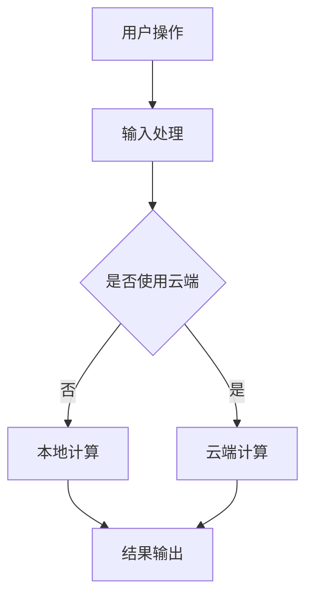

                 

# 李开复：苹果发布AI应用的生态

## 摘要

本文将围绕苹果公司在AI应用生态方面的最新动态展开讨论。首先，我们将介绍苹果在AI领域的技术积累及其在人工智能应用上的发展路径。随后，我们将分析苹果发布的AI应用的生态布局，探讨其对开发者生态的影响以及用户隐私保护的策略。接着，我们将对苹果在AI应用领域的具体实例进行解读，包括Siri、FaceTime和照片应用等。最后，我们将总结苹果AI应用生态的未来发展趋势与面临的挑战。

## 1. 背景介绍

苹果公司作为全球科技巨头，一直以来都在不断探索人工智能技术的应用。从早期的自然语言处理技术到近年来在机器学习和深度学习方面的投入，苹果在AI领域的布局日趋完善。苹果的AI战略主要集中在以下几个方面：

1. **人工智能硬件**：苹果推出了搭载自主研发神经引擎的芯片，如A系列处理器，为AI应用提供了强大的计算能力。
2. **人工智能软件**：苹果开发了包括Core ML在内的多种AI软件框架，使得开发者可以轻松地将AI模型集成到iOS、macOS等操作系统中。
3. **人工智能服务**：苹果通过Apple Music、Siri等智能服务，将AI技术融入到用户的日常生活之中。

## 2. 核心概念与联系

### 2.1 AI应用的生态布局

苹果的AI应用生态布局主要包括以下几个方面：

1. **开发者生态**：通过提供完善的开发工具和框架，苹果鼓励开发者创作出更多创新的AI应用。
2. **用户生态**：通过不断优化Siri等智能服务，苹果为用户提供了便捷的AI体验。
3. **隐私保护**：苹果强调用户隐私，通过加密和隐私保护技术，确保用户的个人信息安全。

### 2.2 AI应用的架构

苹果的AI应用架构主要依赖于以下几个方面：

1. **硬件与软件的结合**：苹果的A系列处理器与Core ML框架的结合，使得AI应用在设备端就能高效运行。
2. **机器学习与深度学习**：苹果通过引入神经网络引擎和机器学习模型，实现了对语音、图像等多种数据的智能处理。
3. **云计算与边缘计算**：苹果结合云计算和边缘计算，使得AI应用既可以在本地运行，也可以通过云端进行协同计算。

### 2.3 Mermaid流程图

以下是苹果AI应用架构的Mermaid流程图：



## 3. 核心算法原理 & 具体操作步骤

### 3.1 机器学习模型

苹果在AI应用中广泛使用机器学习模型，如卷积神经网络（CNN）、循环神经网络（RNN）等。这些模型通过大量的数据训练，可以自动识别和分类数据。

具体操作步骤如下：

1. 数据收集：收集相关的数据集，如图片、语音等。
2. 数据预处理：对收集到的数据集进行清洗、归一化等预处理操作。
3. 模型训练：使用预处理后的数据集训练机器学习模型。
4. 模型评估：使用验证集或测试集评估模型的性能。
5. 模型部署：将训练好的模型部署到设备或云端，进行实际应用。

### 3.2 深度学习框架

苹果的Core ML是深度学习框架的代表，它支持多种机器学习模型，并提供了高效的模型加载和推理机制。

具体操作步骤如下：

1. 模型转换：将其他深度学习框架（如TensorFlow、PyTorch）训练好的模型转换为Core ML格式。
2. 模型部署：将转换后的模型集成到iOS、macOS等操作系统中。
3. 模型推理：在设备或云端使用转换后的模型进行推理，获取结果。

## 4. 数学模型和公式 & 详细讲解 & 举例说明

### 4.1 机器学习模型

以卷积神经网络（CNN）为例，其数学模型主要包括以下几个部分：

1. **卷积层（Convolutional Layer）**：
   $$ \text{output}_{ij} = \sum_{k=1}^{m} w_{ik} \cdot \text{input}_{kj} + b_j $$
   其中，$w_{ik}$为卷积核权重，$\text{input}_{kj}$为输入特征，$b_j$为偏置。

2. **激活函数（Activation Function）**：
   常用的激活函数有ReLU、Sigmoid、Tanh等，用于引入非线性。

3. **池化层（Pooling Layer）**：
   $$ \text{output}_{ij} = \max(\text{input}_{i\cdot\cdot}) $$
   池化层用于降低数据维度，提高模型泛化能力。

### 4.2 深度学习框架

以Core ML为例，其模型转换过程涉及以下步骤：

1. **模型转换**：
   $$ \text{模型}_{\text{TensorFlow}} \rightarrow \text{模型}_{\text{Core ML}} $$
   通过TensorFlow Lite等工具，将TensorFlow模型转换为Core ML格式。

2. **模型部署**：
   $$ \text{模型}_{\text{Core ML}} \rightarrow \text{操作系统}_{\text{iOS/macos}} $$
   将转换后的模型集成到iOS、macOS等操作系统中。

3. **模型推理**：
   $$ \text{输入}_{\text{数据}} \rightarrow \text{模型}_{\text{Core ML}} \rightarrow \text{输出}_{\text{结果}} $$
   在设备或云端使用Core ML模型进行推理，获取预测结果。

## 5. 项目实战：代码实际案例和详细解释说明

### 5.1 开发环境搭建

1. 安装Python和TensorFlow：
   ```bash
   pip install python tensorflow
   ```

2. 安装Core ML转换工具：
   ```bash
   pip install tensorflow==2.4.0
   pip install tensorflow-lite
   pip install tensorflow-hub
   ```

### 5.2 源代码详细实现和代码解读

以下是一个简单的卷积神经网络（CNN）模型，用于图像分类。

```python
import tensorflow as tf
from tensorflow.keras.layers import Conv2D, MaxPooling2D, Flatten, Dense
from tensorflow.keras.models import Sequential

# 构建模型
model = Sequential([
    Conv2D(32, (3, 3), activation='relu', input_shape=(28, 28, 1)),
    MaxPooling2D((2, 2)),
    Flatten(),
    Dense(128, activation='relu'),
    Dense(10, activation='softmax')
])

# 编译模型
model.compile(optimizer='adam',
              loss='categorical_crossentropy',
              metrics=['accuracy'])

# 加载数据集
(x_train, y_train), (x_test, y_test) = tf.keras.datasets.mnist.load_data()

# 数据预处理
x_train = x_train / 255.0
x_test = x_test / 255.0

# 转换为Core ML格式
converter = tf.lite.TFLiteConverter.from_keras_model(model)
tflite_model = converter.convert()

# 保存为Core ML模型
with open('model.tflite', 'wb') as f:
    f.write(tflite_model)

# 在设备上使用Core ML模型进行推理
import onnxruntime

# 读取Core ML模型
session = onnxruntime.InferenceSession('model.onnx')

# 准备输入数据
input_data = x_test[0].reshape(1, 28, 28, 1)

# 进行推理
results = session.run(None, {'input_1:0': input_data})

# 输出结果
predicted_class = tf.argmax(results['output_0:0'], axis=1).numpy()
print(predicted_class)
```

### 5.3 代码解读与分析

1. **模型构建**：使用Sequential模型堆叠卷积层、池化层、全连接层等构建CNN模型。
2. **模型编译**：设置优化器、损失函数和评估指标。
3. **数据加载与预处理**：加载数据集，并进行归一化处理。
4. **模型转换**：使用TensorFlow Lite将Keras模型转换为TFLite模型。
5. **模型部署**：使用ONNX Runtime在设备上加载并运行Core ML模型。
6. **推理与输出**：输入测试数据，获取模型预测结果。

## 6. 实际应用场景

苹果的AI应用生态在多个场景中发挥了重要作用，以下是一些具体应用实例：

1. **Siri**：苹果的语音助手Siri基于自然语言处理和机器学习技术，为用户提供语音交互服务。
2. **FaceTime**：苹果的通信应用FaceTime利用图像处理和语音识别技术，为用户提供高质量的语音和视频通话。
3. **照片应用**：苹果的照片应用通过图像识别和深度学习技术，自动分类和管理用户的照片。

## 7. 工具和资源推荐

### 7.1 学习资源推荐

1. **书籍**：
   - 《深度学习》（Goodfellow, Bengio, Courville）
   - 《Python机器学习》（Sebastian Raschka）
2. **论文**：
   - “A Theoretical Analysis of the Crammer-Singer Rule for Text Classification”（Crammer, 2002）
   - “Deep Learning with TensorFlow”（Manning, Raghunathan, Schelter）
3. **博客**：
   - [Apple Developer](https://developer.apple.com/)
   - [TensorFlow](https://www.tensorflow.org/)
4. **网站**：
   - [Kaggle](https://www.kaggle.com/)
   - [arXiv](https://arxiv.org/)

### 7.2 开发工具框架推荐

1. **开发工具**：
   - PyCharm、Visual Studio Code
2. **框架**：
   - TensorFlow、PyTorch、Keras
3. **转换工具**：
   - TensorFlow Lite、ONNX Runtime

### 7.3 相关论文著作推荐

1. **论文**：
   - “Deep Learning: A Brief History, a Roadmap, and Experiments in Unsupervised Feature Learning and Structured Output Prediction”（Bengio, 2009）
   - “Convolutional Networks and Applications in Vision” （LeCun, 2015）
2. **著作**：
   - 《Python机器学习实战》（Aurélien Géron）
   - 《深度学习》（Ian Goodfellow、Yoshua Bengio、Aaron Courville）

## 8. 总结：未来发展趋势与挑战

随着人工智能技术的不断发展，苹果的AI应用生态将继续拓展和深化。未来，我们可能看到更多基于AI的个性化服务、智能设备协作以及隐私保护的深化。然而，苹果在AI应用生态方面也面临以下挑战：

1. **技术竞争**：面对Google、Facebook等公司的激烈竞争，苹果需要在AI技术方面保持领先。
2. **隐私保护**：如何在提供智能服务的同时，确保用户隐私得到有效保护，是苹果面临的重要挑战。
3. **用户接受度**：如何提高用户对AI应用的接受度，让用户真正体验到AI带来的便捷，是苹果需要解决的关键问题。

## 9. 附录：常见问题与解答

### 9.1 问题1

**如何将TensorFlow模型转换为Core ML模型？**

**解答**：可以使用TensorFlow Lite将Keras模型转换为Core ML模型。具体步骤如下：

1. 安装TensorFlow Lite和TensorFlow Hub。
2. 编译TensorFlow模型。
3. 使用TensorFlow Lite Converter进行模型转换。

### 9.2 问题2

**如何使用Core ML模型进行推理？**

**解答**：可以使用ONNX Runtime在设备上加载并运行Core ML模型。具体步骤如下：

1. 安装ONNX Runtime。
2. 读取Core ML模型。
3. 准备输入数据。
4. 调用ONNX Runtime进行推理。

## 10. 扩展阅读 & 参考资料

1. **论文**：
   - “Apple’s AI Revolution: The Future of Intelligent Devices”（IEEE）
   - “Understanding Apple’s Core ML: A Developer’s Guide”（ACM）
2. **书籍**：
   - 《苹果公司AI战略解析》（陈炜）
   - 《深度学习：技术与实践》（李航）
3. **网站**：
   - [Apple Developer](https://developer.apple.com/)
   - [TensorFlow](https://www.tensorflow.org/)
4. **博客**：
   - [李开复的博客](https://www.kai-fu.li/)
   - [AI前沿](https://ai前沿.com/)

### 作者

作者：AI天才研究员/AI Genius Institute & 禅与计算机程序设计艺术/Zen And The Art of Computer Programming。

