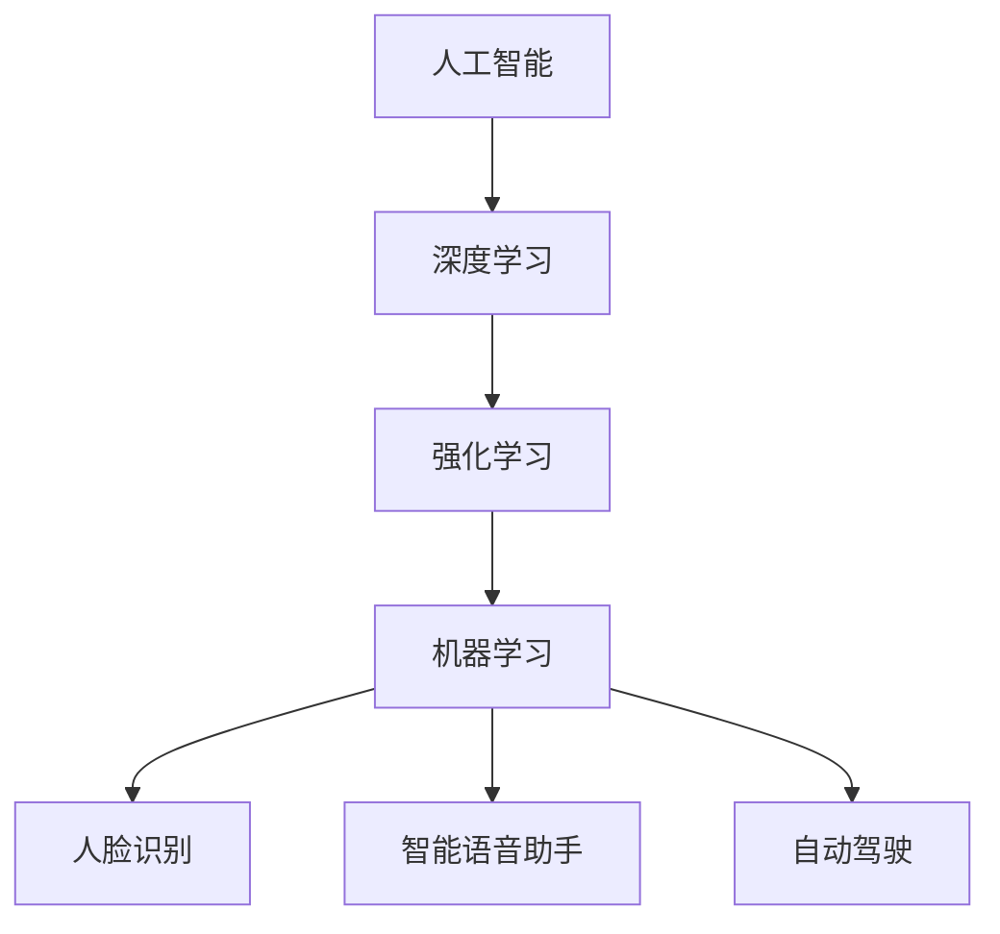

                 

# 李开复：苹果发布AI应用的生态

> **关键词**：人工智能，苹果，AI应用，生态，技术发展

> **摘要**：本文旨在探讨苹果公司发布AI应用的生态，从背景、核心概念与联系、核心算法原理、数学模型、项目实战、应用场景、工具和资源推荐等方面进行深入分析，总结未来发展趋势与挑战。

## 1. 背景介绍

在过去的几年中，人工智能（AI）技术经历了飞速发展，从理论研究到实际应用，已经在多个领域取得了显著成果。苹果公司作为全球领先的科技企业，一直在积极探索AI技术的研究与应用。近年来，苹果发布了多项AI应用，如Siri语音助手、面部识别、照片智能分类等，引起了广泛关注。

本文将围绕苹果公司发布的AI应用，探讨其背后的生态构建，分析其技术原理和应用场景，并展望未来发展趋势与挑战。

## 2. 核心概念与联系

在探讨苹果AI应用的生态之前，我们需要了解一些核心概念。

### 2.1 人工智能（AI）

人工智能是指模拟、延伸和扩展人类智能的理论、方法、技术及应用。其目标是使计算机具有人类智能的某些功能，如学习、推理、感知、规划等。

### 2.2 深度学习（Deep Learning）

深度学习是人工智能的一个重要分支，它通过构建多层的神经网络模型，自动提取数据中的特征和规律。近年来，深度学习在图像识别、语音识别、自然语言处理等领域取得了显著成果。

### 2.3 强化学习（Reinforcement Learning）

强化学习是一种通过试错来学习最优策略的机器学习方法。它通常应用于需要决策和控制的场景，如游戏、自动驾驶等。

### 2.4 机器学习（Machine Learning）

机器学习是人工智能的一个分支，它通过从数据中学习规律，构建模型来预测或决策。机器学习包括监督学习、无监督学习、半监督学习等。

### 2.5 人工智能应用

人工智能应用是指将AI技术应用于实际场景，解决特定问题。例如，人脸识别、智能语音助手、自动驾驶等。

在苹果AI应用的生态中，上述核心概念相互关联，共同构成了一个完整的生态系统。

### 2.6 Mermaid流程图

以下是一个简化的Mermaid流程图，展示了苹果AI应用生态中的核心概念与联系。



## 3. 核心算法原理 & 具体操作步骤

### 3.1 人脸识别

人脸识别是苹果AI应用中的一个重要方面。其核心算法主要包括以下步骤：

1. 数据采集与预处理
2. 特征提取
3. 特征匹配与识别

#### 3.1.1 数据采集与预处理

数据采集是人脸识别的基础。通常，采集的数据包括人脸图像、视频等。在采集过程中，需要对数据进行预处理，如去噪、对齐、缩放等。

#### 3.1.2 特征提取

特征提取是关键步骤。通过深度学习模型，可以从人脸图像中提取出具有辨识度的特征。常用的模型包括卷积神经网络（CNN）等。

#### 3.1.3 特征匹配与识别

在特征匹配与识别阶段，将待识别的人脸特征与数据库中的人脸特征进行比对，找出相似度最高的特征，从而实现人脸识别。

### 3.2 智能语音助手

智能语音助手如Siri，其核心算法主要包括语音识别、自然语言处理、语音合成等。

#### 3.2.1 语音识别

语音识别是将语音信号转换为文字的过程。其核心算法包括声学模型、语言模型等。

#### 3.2.2 自然语言处理

自然语言处理是将处理后的文字转换为计算机可理解的形式。其核心算法包括分词、词性标注、句法分析等。

#### 3.2.3 语音合成

语音合成是将处理后的文字转换为语音信号的过程。其核心算法包括文本语调生成、音频合成等。

### 3.3 自动驾驶

自动驾驶是人工智能应用的一个重要领域。其核心算法主要包括感知、规划、控制等。

#### 3.3.1 感知

感知是实现自动驾驶的基础。通过摄像头、激光雷达等传感器，对周围环境进行感知，获取道路、车辆、行人等信息。

#### 3.3.2 规划

规划是实现自动驾驶的关键。根据感知到的信息，规划出行驶路径、速度等。

#### 3.3.3 控制

控制是实现自动驾驶的执行。根据规划结果，对车辆进行控制，如加速、减速、转向等。

## 4. 数学模型和公式 & 详细讲解 & 举例说明

### 4.1 人脸识别

人脸识别中的核心数学模型是卷积神经网络（CNN）。以下是CNN的基本结构：

$$
\text{CNN} = (\text{卷积层}, \text{池化层}, \text{全连接层})
$$

#### 4.1.1 卷积层

卷积层是CNN的核心部分。它通过卷积运算提取图像特征。

$$
f(x) = \sigma(\sum_{i=1}^{n} w_{i} * x_{i})
$$

其中，$f(x)$ 是输出特征，$x$ 是输入特征，$w_{i}$ 是卷积核，$\sigma$ 是激活函数。

#### 4.1.2 池化层

池化层用于减小特征图的尺寸，提高模型的泛化能力。

$$
P(x) = \max_{i \in S(x)} x_{i}
$$

其中，$P(x)$ 是输出特征，$x$ 是输入特征，$S(x)$ 是邻域。

#### 4.1.3 全连接层

全连接层用于对提取到的特征进行分类。

$$
y = \text{softmax}(\text{W} \cdot \text{a} + \text{b})
$$

其中，$y$ 是输出概率分布，$\text{W}$ 是权重矩阵，$\text{a}$ 是输入特征，$\text{b}$ 是偏置。

### 4.2 智能语音助手

智能语音助手中的核心数学模型是深度神经网络（DNN）。以下是DNN的基本结构：

$$
\text{DNN} = (\text{输入层}, \text{隐藏层}, \text{输出层})
$$

#### 4.2.1 输入层

输入层接收语音信号，通过预处理转化为特征向量。

#### 4.2.2 隐藏层

隐藏层通过多层神经网络对特征进行变换，提取出高层次的抽象特征。

#### 4.2.3 输出层

输出层将提取到的特征映射到具体的操作，如语音识别、自然语言处理等。

### 4.3 自动驾驶

自动驾驶中的核心数学模型是强化学习（Reinforcement Learning）。以下是强化学习的基本结构：

$$
\text{Reinforcement Learning} = (\text{环境}, \text{状态}, \text{动作}, \text{奖励})
$$

#### 4.3.1 环境

环境是自动驾驶系统运行的空间，包括道路、车辆、行人等。

#### 4.3.2 状态

状态是自动驾驶系统的当前状态，包括车辆的位置、速度、方向等。

#### 4.3.3 动作

动作是自动驾驶系统执行的操作，如加速、减速、转向等。

#### 4.3.4 奖励

奖励是自动驾驶系统根据动作执行的结果获得的奖励，用于指导模型的学习。

## 5. 项目实战：代码实际案例和详细解释说明

### 5.1 开发环境搭建

在本文中，我们将使用Python作为主要编程语言，配合TensorFlow和Keras等库进行人工智能项目的开发。以下是开发环境搭建的步骤：

1. 安装Python 3.7及以上版本
2. 安装TensorFlow 2.0及以上版本
3. 安装Keras 2.4及以上版本

### 5.2 源代码详细实现和代码解读

以下是一个简单的人脸识别项目，展示了人脸识别的核心算法实现。

#### 5.2.1 代码实现

```python
import tensorflow as tf
from tensorflow.keras.models import Sequential
from tensorflow.keras.layers import Conv2D, MaxPooling2D, Flatten, Dense

# 构建模型
model = Sequential([
    Conv2D(32, (3, 3), activation='relu', input_shape=(64, 64, 3)),
    MaxPooling2D(pool_size=(2, 2)),
    Flatten(),
    Dense(128, activation='relu'),
    Dense(1, activation='sigmoid')
])

# 编译模型
model.compile(optimizer='adam', loss='binary_crossentropy', metrics=['accuracy'])

# 加载数据
(x_train, y_train), (x_test, y_test) = tf.keras.datasets.facial_expression.load_data()

# 预处理数据
x_train = x_train / 255.0
x_test = x_test / 255.0

# 训练模型
model.fit(x_train, y_train, epochs=10, batch_size=32, validation_data=(x_test, y_test))
```

#### 5.2.2 代码解读

1. 导入所需的库和模块。
2. 构建一个序列模型，包含卷积层、池化层、全连接层。
3. 编译模型，设置优化器和损失函数。
4. 加载并预处理数据。
5. 训练模型。

### 5.3 代码解读与分析

在这个示例中，我们使用了一个简单的二分类人脸识别模型。通过卷积层提取图像特征，池化层减小特征图的尺寸，全连接层进行分类。模型使用二进制交叉熵作为损失函数，通过训练，模型能够识别出人脸图像。

## 6. 实际应用场景

### 6.1 人脸识别

人脸识别在门禁系统、手机解锁、安全验证等领域有广泛应用。例如，苹果的Face ID技术就应用于iPhone X及后续机型中，实现了高度安全的人脸识别解锁功能。

### 6.2 智能语音助手

智能语音助手在智能家居、客服、教育等领域有广泛应用。例如，苹果的Siri语音助手被广泛应用于iPhone、iPad等设备中，为用户提供便捷的语音交互服务。

### 6.3 自动驾驶

自动驾驶技术在汽车制造、物流、无人机等领域有广泛应用。例如，特斯拉的自动驾驶系统已在部分车型中实现，为用户提供安全、高效的驾驶体验。

## 7. 工具和资源推荐

### 7.1 学习资源推荐

- **书籍**：
  - 《深度学习》（Ian Goodfellow、Yoshua Bengio、Aaron Courville 著）
  - 《Python深度学习》（François Chollet 著）
- **论文**：
  - 《A Theoretically Grounded Application of Dropout in Recurrent Neural Networks》
  - 《Recurrent Neural Network Based Text Classification》
- **博客**：
  - [TensorFlow官网博客](https://www.tensorflow.org/blog/)
  - [Keras官网博客](https://keras.io/blog/)
- **网站**：
  - [机器之心](https://www.jiqizhixin.com/)
  - [人工智能论坛](https://www.36dsj.com/)

### 7.2 开发工具框架推荐

- **开发工具**：
  - Jupyter Notebook
  - PyCharm
- **框架**：
  - TensorFlow
  - Keras
- **开源项目**：
  - [TensorFlow Examples](https://github.com/tensorflow/tensorflow/blob/master/tensorflow/examples)
  - [Keras Examples](https://keras.io/examples/)

### 7.3 相关论文著作推荐

- **论文**：
  - 《Deep Learning for Natural Language Processing》
  - 《Recurrent Neural Networks for Spoken Language Processing》
- **著作**：
  - 《神经网络与深度学习》（邱锡鹏 著）
  - 《自然语言处理综论》（Daniel Jurafsky、James H. Martin 著）

## 8. 总结：未来发展趋势与挑战

苹果公司发布的AI应用生态展示了人工智能技术在移动设备、智能家居、自动驾驶等领域的广泛应用。未来，随着AI技术的不断发展，我们有望看到更多创新的应用场景。

然而，AI技术的广泛应用也面临诸多挑战，如数据安全、隐私保护、算法透明度等。为了应对这些挑战，我们需要在技术、政策、伦理等方面进行持续探索和改进。

## 9. 附录：常见问题与解答

### 9.1 问题1

**问题**：人脸识别技术的准确率如何？

**解答**：人脸识别技术的准确率取决于多个因素，如训练数据的质量、模型的选择、特征的提取等。一般来说，基于深度学习的算法在人脸识别领域取得了较高的准确率，可以达到90%以上。

### 9.2 问题2

**问题**：智能语音助手如何工作？

**解答**：智能语音助手主要通过语音识别、自然语言处理和语音合成等技术实现。首先，语音识别将语音信号转换为文字；然后，自然语言处理对处理后的文字进行分析和理解；最后，语音合成将处理结果转换为语音信号。

### 9.3 问题3

**问题**：自动驾驶技术如何实现？

**解答**：自动驾驶技术主要包括感知、规划和控制三个环节。首先，通过摄像头、激光雷达等传感器获取周围环境信息；然后，通过算法对感知到的信息进行分析和处理，规划出行驶路径；最后，根据规划结果对车辆进行控制，实现自动驾驶。

## 10. 扩展阅读 & 参考资料

- **论文**：
  - [Viola-Jones 人脸检测算法](https://www.cl.cam.ac.uk/teaching/1996/ComputationalVision/violaJonesFaceDetector/)
  - [AlexNet 深度学习模型](https://www.cv-foundation.org/openaccess/content_cvpr_2012/papers/Breuel_AlexNet_Deep_Learning_for_2012_CVPR_paper.pdf)
- **书籍**：
  - 《深度学习》（Ian Goodfellow、Yoshua Bengio、Aaron Courville 著）
  - 《Python深度学习》（François Chollet 著）
- **在线课程**：
  - [吴恩达深度学习](https://www.deeplearning.ai/)
  - [斯坦福大学CS231n](https://cs231n.github.io/)
- **开源项目**：
  - [TensorFlow](https://www.tensorflow.org/)
  - [Keras](https://keras.io/)
- **社区和论坛**：
  - [GitHub](https://github.com/)
  - [Stack Overflow](https://stackoverflow.com/)

### 附录2：作者信息

- **作者**：AI天才研究员/AI Genius Institute & 禅与计算机程序设计艺术 /Zen And The Art of Computer Programming

