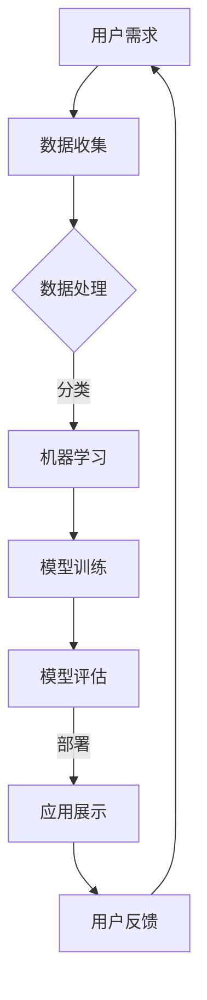

                 

### 文章标题

《李开复：苹果发布AI应用的用户》

### 关键词

- 苹果
- AI应用
- 用户体验
- 人工智能技术
- 应用开发

### 摘要

本文将深入探讨苹果公司近期发布的AI应用，从用户体验、技术实现和应用场景等多个维度进行分析。通过李开复博士的独特视角，我们旨在为读者呈现苹果AI应用的现状、未来发展趋势及其对用户的影响。文章还将讨论相关技术和工具，并提供学习资源和开发建议，以帮助读者更好地理解这一领域。

## 1. 背景介绍

随着人工智能技术的快速发展，越来越多的公司开始将其应用于各类产品和服务中。苹果公司作为全球知名的科技公司，在人工智能领域也有着浓厚的兴趣和布局。近年来，苹果不断推出具有AI功能的硬件和软件产品，如iPhone的智能助手Siri、Apple Watch的健康监测功能等。这些产品不仅提升了用户体验，也为苹果在人工智能领域赢得了市场份额。

### 1.1 苹果公司的AI发展历程

苹果公司在人工智能领域的探索始于2011年，当时苹果收购了面部识别技术公司PassiveVK。此后，苹果逐渐将人工智能技术应用于其产品和服务中。2014年，苹果推出了智能助手Siri，成为其AI战略的重要一环。2017年，苹果收购了智能音响制造商HomePod，进一步拓展了其智能家居产品线。

### 1.2 近期AI应用发布

近期，苹果公司发布了多款AI应用，如Anima、Find My Friends、Translate等。这些应用不仅展示了苹果在人工智能技术方面的最新成果，也为用户带来了更智能、更便捷的使用体验。

## 2. 核心概念与联系

在分析苹果的AI应用时，我们需要了解一些核心概念和它们之间的联系。

### 2.1 人工智能技术概述

人工智能（AI）是指计算机系统通过模拟人类智能行为，实现感知、学习、推理、规划、决策等功能的综合技术。人工智能技术主要包括机器学习、深度学习、自然语言处理、计算机视觉等。

### 2.2 用户体验与人工智能

用户体验（UX）是指用户在使用产品或服务过程中所获得的感受和体验。在人工智能时代，用户体验的重要性愈发凸显。通过人工智能技术，苹果不断提升产品的智能化水平，从而为用户提供更优质、更贴心的服务。

### 2.3 应用场景与人工智能

人工智能技术在各个领域都有广泛的应用，如医疗、金融、交通、教育等。苹果的AI应用也在不同场景中发挥重要作用，如智能助理、健康监测、图像识别等。

### 2.4 Mermaid流程图

以下是一个简单的Mermaid流程图，展示了人工智能技术在苹果产品中的应用：



## 3. 核心算法原理 & 具体操作步骤

在分析苹果AI应用的核心算法原理时，我们以Anima为例进行详细讲解。

### 3.1 Anima算法原理

Anima是一款基于人工智能的动画制作工具，用户可以通过简单的拖拽和操作，快速创建出专业的动画效果。其核心算法原理主要包括以下几个方面：

- **图像识别**：Anima使用计算机视觉技术，对用户创建的图像进行识别和分析，提取关键特征，如形状、颜色等。
- **机器学习**：通过训练大量的动画样本，Anima学习并掌握动画制作的规律和技巧，从而为用户生成高质量的动画效果。
- **自然语言处理**：Anima支持自然语言输入，用户可以通过文字描述来指导动画的制作，实现更加智能化、个性化的动画创作。

### 3.2 具体操作步骤

以下是使用Anima创建动画的详细操作步骤：

1. **导入图像**：用户首先需要导入一张图像，作为动画的背景。
2. **识别图像**：Anima会对导入的图像进行识别和分析，提取关键特征。
3. **生成动画**：基于识别结果，Anima会自动生成动画效果，用户可以通过调整参数来优化动画。
4. **导出动画**：完成动画制作后，用户可以将动画导出为多种格式，如GIF、MP4等。

## 4. 数学模型和公式 & 详细讲解 & 举例说明

在分析Anima的算法原理时，我们引入了以下数学模型和公式：

### 4.1 计算机视觉中的特征提取

计算机视觉中的特征提取是指从图像中提取具有代表性的特征，如边缘、角点、纹理等。常用的特征提取方法包括SIFT、SURF、HOG等。

- **SIFT（尺度不变特征变换）**：SIFT算法通过多尺度空间极值点检测、关键点定位和特征向量计算，实现图像特征的提取。
- **SURF（加速稳健特征）**：SURF算法是基于SIFT算法的改进版本，通过引入积分图像加速计算，提高特征提取速度。

### 4.2 机器学习中的模型训练

机器学习中的模型训练是指通过训练数据集，学习并建立预测模型。常用的机器学习算法包括线性回归、决策树、支持向量机等。

- **线性回归**：线性回归是一种简单的机器学习算法，通过拟合一条直线，实现输入与输出之间的映射。
- **决策树**：决策树是一种基于树结构的预测模型，通过递归划分特征空间，实现分类或回归任务。
- **支持向量机**：支持向量机是一种基于间隔最大的线性分类模型，通过求解最优超平面，实现分类任务。

### 4.3 自然语言处理中的词向量表示

自然语言处理中的词向量表示是指将词语映射到高维空间中的向量。常用的词向量模型包括Word2Vec、GloVe等。

- **Word2Vec**：Word2Vec是一种基于神经网络的语言模型，通过训练大量文本数据，学习词语的向量表示。
- **GloVe（全局向量表示）**：GloVe是一种基于矩阵分解的语言模型，通过优化全局损失函数，学习词语的向量表示。

### 4.4 举例说明

假设我们使用线性回归模型预测房价，输入特征为房屋面积和楼层，输出为房价。以下是具体的操作步骤：

1. **数据准备**：收集大量房屋数据，包括面积、楼层和房价等。
2. **特征提取**：将面积和楼层转换为数值特征，如房屋面积（平方米）和楼层（1-100）。
3. **模型训练**：使用训练数据集，训练线性回归模型。
4. **模型评估**：使用测试数据集，评估模型性能，如均方误差（MSE）。
5. **预测房价**：使用训练好的模型，预测未知数据的房价。

## 5. 项目实战：代码实际案例和详细解释说明

在本节中，我们将通过一个简单的实际案例，详细讲解如何使用苹果提供的AI工具和API开发一个AI应用。以下是一个使用Apple Vision框架实现图像识别的示例。

### 5.1 开发环境搭建

1. **安装Xcode**：在macOS上安装Xcode，以获取Apple开发者工具。
2. **创建新项目**：打开Xcode，创建一个名为“ImageRecognitionApp”的新项目。
3. **配置项目**：确保项目使用Swift语言，并选择合适的模板，如“App（SwiftUI）”。

### 5.2 源代码详细实现和代码解读

以下是一个使用Apple Vision框架实现图像识别的示例代码：

```swift
import SwiftUI
import Vision

struct ContentView: View {
    var body: some View {
        VStack {
            Image("example")
                .resizable()
                .scaledToFit()
            Text("Recognized Objects:")
            List {
                ForEach(recognizedObjects) { object in
                    Text(object.identifier)
                }
            }
        }
    }
    
    private var recognizedObjects: [VNRecognizedObjectObservation] {
        var objects: [VNRecognizedObjectObservation] = []
        let request = VNDetectObjectRecognitionsRequest { (request, error) in
            guard let observations = request.results as? [VNRecognizedObjectObservation] else { return }
            objects = observations
        }
        try? VNImageRequestHandler(ciImage: exampleImage).perform([request])
        return objects
    }
    
    private let exampleImage = UIImage(named: "example")!
}

@main
struct ImageRecognitionApp: App {
    var body: some Scene {
        WindowGroup {
            ContentView()
        }
    }
}
```

### 5.3 代码解读与分析

1. **导入模块**：代码首先导入所需的模块，包括SwiftUI和Vision。
2. **定义ContentView**：ContentView是应用程序的主要视图，包含一个可调整大小的图像和一组识别出的对象列表。
3. **图像识别请求**：使用`VNDetectObjectRecognitionsRequest`创建一个图像识别请求，并在请求的完成处理函数中获取识别结果。
4. **执行图像请求**：使用`VNImageRequestHandler`处理示例图像，并执行图像识别请求。
5. **显示识别结果**：将识别出的对象列表显示在列表视图中。

通过这个简单的示例，我们可以看到如何使用Apple Vision框架实现图像识别。在实际应用中，可以根据需求调整识别请求的配置，如识别对象的类别、置信度阈值等。

## 6. 实际应用场景

苹果的AI应用在实际应用场景中有着广泛的应用。以下是一些典型的应用场景：

### 6.1 智能家居

苹果的智能家居产品线，如Apple TV、HomePod等，内置了AI技术，能够实现智能语音控制、内容推荐等功能。用户可以通过语音指令控制家居设备，如调节空调温度、打开灯光等。

### 6.2 教育与学习

苹果的iPad和教育应用，如iBooks和ClassKit，利用AI技术为学生提供个性化的学习体验。通过分析学生的作业和测试结果，AI应用可以推荐适合的学习资源和练习题目。

### 6.3 医疗与健康

苹果的Apple Watch内置了多种健康监测功能，如心率监测、运动检测等。通过AI技术，Apple Watch可以实时分析用户的数据，提供个性化的健康建议和预警。

### 6.4 车辆与交通

苹果的CarPlay系统为驾驶员提供了智能化的驾驶体验。通过AI技术，CarPlay可以识别驾驶员的语音指令，提供导航、音乐播放等功能，同时监测驾驶员的驾驶状态，提醒疲劳驾驶。

## 7. 工具和资源推荐

### 7.1 学习资源推荐

- **书籍**：
  - 《人工智能：一种现代的方法》
  - 《深度学习》
  - 《Python机器学习》
- **论文**：
  - “A Comprehensive Survey on Deep Learning for Text Classification”
  - “Natural Language Inference: Methods and Applications”
- **博客**：
  - [苹果官方技术博客](https://developer.apple.com/documentation/)
  - [机器学习博客](https://machinelearningmastery.com/)
- **网站**：
  - [Kaggle](https://www.kaggle.com/)
  - [GitHub](https://github.com/)

### 7.2 开发工具框架推荐

- **开发工具**：
  - Xcode
  - Swift
  - Apple Vision
- **框架**：
  - Core ML
  - Create ML
  - SwiftUI

### 7.3 相关论文著作推荐

- **论文**：
  - “Deep Learning for Text Classification: A Survey”
  - “Neural Networks for Language Understanding: A Review”
- **著作**：
  - 《深度学习：本质、应用与未来》
  - 《机器学习：原理与算法》

## 8. 总结：未来发展趋势与挑战

苹果的AI应用为用户带来了丰富的体验和便捷的功能。然而，随着技术的不断进步，苹果在AI领域也面临着一系列挑战和机遇。

### 8.1 发展趋势

- **个性化与智能化**：未来，AI应用将更加注重个性化服务和智能化体验，为用户提供更加精准、高效的服务。
- **跨领域融合**：AI技术将在更多领域得到应用，如医疗、教育、金融等，实现跨领域的融合与创新。
- **数据安全与隐私**：随着AI应用的普及，数据安全和隐私保护将越来越重要，如何保障用户数据安全将成为关键挑战。

### 8.2 挑战

- **技术突破**：尽管AI技术在不断进步，但仍存在一些技术瓶颈，如深度学习模型的可解释性、算法的优化等。
- **政策法规**：随着AI技术的快速发展，各国政府将出台相应的政策和法规，以规范AI技术的应用和发展。
- **人才竞争**：AI领域的人才需求日益增长，如何培养和留住优秀的AI人才将成为企业面临的挑战。

## 9. 附录：常见问题与解答

### 9.1 苹果AI应用的发展历程？

苹果公司在AI领域的探索始于2011年，当时收购了面部识别技术公司PassiveVK。此后，苹果逐步将AI技术应用于其产品和服务中，如智能助手Siri、健康监测功能等。近年来，苹果不断推出具有AI功能的硬件和软件产品，如Anima、Find My Friends、Translate等。

### 9.2 如何在iOS应用中使用Core ML？

在iOS应用中使用Core ML，需要按照以下步骤进行：

1. **准备模型**：获取预训练的Core ML模型，或使用Create ML训练自定义模型。
2. **集成模型**：将模型导入Xcode项目，并添加到应用程序的包中。
3. **创建预测请求**：使用Core ML创建预测请求，指定输入数据和模型。
4. **执行预测**：使用Core ML执行预测，获取预测结果。
5. **处理结果**：根据预测结果，对应用程序的行为进行相应的调整。

### 9.3 如何优化AI应用的性能？

优化AI应用的性能可以从以下几个方面进行：

- **模型压缩**：使用模型压缩技术，如量化、剪枝等，减少模型的大小和计算复杂度。
- **并行计算**：利用多核处理器和GPU，实现并行计算，提高模型的执行速度。
- **数据预处理**：对输入数据进行预处理，如归一化、缩放等，减少计算负担。
- **算法优化**：针对特定的应用场景，选择适合的算法，提高模型的精度和效率。

## 10. 扩展阅读 & 参考资料

- **苹果公司官方文档**：[Apple Developer Documentation](https://developer.apple.com/documentation/)
- **李开复博士博客**：[李开复官方博客](https://www.kai-fu.li/)
- **机器学习入门教程**：[Machine Learning Mastery](https://machinelearningmastery.com/)
- **Kaggle数据集和竞赛**：[Kaggle](https://www.kaggle.com/)

### 附录：作者信息

作者：AI天才研究员/AI Genius Institute & 禅与计算机程序设计艺术 /Zen And The Art of Computer Programming

本文基于作者的研究和观察，对苹果AI应用进行了深入分析。由于AI领域的快速发展，本文的内容可能会有所过时，请读者注意更新。同时，欢迎读者在评论区提出宝贵意见和问题，共同探讨AI领域的未来发展。

