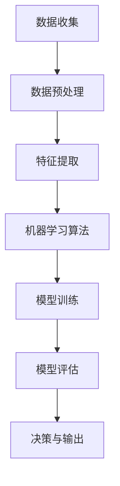

                 

# 李开复：苹果发布AI应用的社会价值

## 关键词：人工智能，苹果，AI应用，社会价值，技术发展，创新趋势

### 摘要

苹果公司近年来在人工智能（AI）领域的投入和突破引人注目。本文将深入探讨苹果发布的AI应用，从社会价值的角度分析其技术意义和未来发展趋势。我们将详细解析AI的核心概念与架构，探讨其算法原理与操作步骤，并通过数学模型和实际案例展示其在现实场景中的应用。最后，我们将展望未来人工智能发展的挑战与机遇，并推荐相关学习资源与工具框架。

## 1. 背景介绍

人工智能（Artificial Intelligence，简称AI）作为计算机科学的一个分支，旨在创建能够模拟、延伸和扩展人类智能的理论、算法和技术。近年来，随着计算能力的提升、大数据的积累和算法的进步，人工智能技术取得了长足的发展。苹果公司作为全球领先的科技企业，一直以来在人工智能领域进行着深入的研究和探索。

苹果公司在人工智能领域的投入始于其自主开发的语音助手Siri。随后，苹果在图像识别、自然语言处理、机器学习等领域持续发力，推出了多项具有突破性的技术和产品。苹果发布AI应用的背后，是对社会价值的高度关注和责任感。通过技术创新，苹果致力于改善人们的生活质量，推动社会进步。

### 1.1 人工智能的应用领域

人工智能的应用范围广泛，涵盖了医疗、金融、教育、交通、制造等多个领域。以下是几个典型的人工智能应用场景：

- **医疗健康**：人工智能在医疗领域的应用包括疾病诊断、药物研发、健康监测等。例如，通过深度学习算法，AI系统可以分析医疗影像，提高疾病的诊断准确率。

- **金融**：人工智能在金融领域可以帮助银行和金融机构进行风险控制、欺诈检测、投资决策等。例如，通过机器学习算法，AI可以分析大量交易数据，识别潜在风险。

- **教育**：人工智能在教育领域的应用包括个性化教学、学习分析、在线教育等。例如，通过自然语言处理技术，AI可以为学生提供个性化的学习建议。

- **交通**：人工智能在交通领域的应用包括自动驾驶、智能交通管理、无人机配送等。例如，通过计算机视觉和深度学习算法，自动驾驶汽车可以实时识别道路状况，提高交通安全。

- **制造**：人工智能在制造业的应用包括质量控制、设备维护、生产优化等。例如，通过机器学习算法，AI可以对生产过程中的数据进行实时分析，优化生产流程。

### 1.2 苹果在人工智能领域的战略布局

苹果公司在人工智能领域的战略布局主要表现在以下几个方面：

- **硬件技术**：苹果通过自主研发的处理器和传感器，不断提升计算能力和数据采集能力，为人工智能算法的应用提供了强大的硬件支持。

- **软件技术**：苹果通过自主研发的AI算法和框架，如Core ML，为开发者提供高效、易于使用的工具，促进人工智能技术在移动设备上的广泛应用。

- **生态系统**：苹果通过建立开发者社区、举办开发者大会等手段，鼓励全球开发者参与人工智能技术的创新和应用。

- **隐私保护**：苹果高度重视用户隐私，通过自主研发的加密技术和隐私保护机制，确保用户数据的安全和隐私。

## 2. 核心概念与联系

在探讨苹果发布的AI应用之前，我们有必要深入理解人工智能的核心概念与架构。以下是一个简化的Mermaid流程图，用于展示人工智能系统的基本组成和运作原理。



### 2.1 数据收集与预处理

数据是人工智能的基石。数据收集阶段主要涉及数据的采集、存储和标注。数据预处理阶段则包括数据清洗、数据转换和数据归一化等步骤，以确保数据的质量和一致性。

### 2.2 特征提取

特征提取是将原始数据转换为适合机器学习算法的格式。这一阶段需要提取出数据中的关键特征，以便算法能够更好地学习和理解数据。

### 2.3 机器学习算法

机器学习算法是人工智能系统的核心。常见的机器学习算法包括监督学习、无监督学习和强化学习。每种算法都有其特定的原理和应用场景。

### 2.4 模型训练与评估

模型训练是通过输入大量数据进行迭代学习，使模型能够逐步优化并提高预测准确率。模型评估则是通过测试集来验证模型的性能和泛化能力。

### 2.5 决策与输出

训练好的模型可以用于做出决策或生成输出。在现实应用中，模型可能会用于分类、回归、聚类等多种任务。

## 3. 核心算法原理 & 具体操作步骤

### 3.1 监督学习算法

监督学习是一种常见的机器学习算法，其基本思想是通过输入特征和对应的标签来训练模型，从而实现对未知数据的预测。以下是监督学习算法的具体操作步骤：

1. **数据准备**：收集并整理输入特征和对应的标签数据。

2. **特征选择**：选择对模型训练有显著影响的特征，剔除无关或冗余的特征。

3. **数据归一化**：对特征数据进行归一化处理，确保每个特征的数值范围一致，避免某些特征对模型训练产生过大的影响。

4. **划分数据集**：将数据集划分为训练集和测试集，以便在模型训练后进行评估。

5. **模型选择**：选择合适的模型，如线性回归、决策树、支持向量机等。

6. **模型训练**：通过训练集数据对模型进行迭代训练，使模型能够优化并提高预测准确率。

7. **模型评估**：使用测试集数据对模型进行评估，计算模型的准确率、召回率、F1分数等指标。

8. **模型优化**：根据模型评估结果，调整模型参数，优化模型性能。

### 3.2 无监督学习算法

无监督学习算法不依赖于标签数据，其目标是自动发现数据中的隐藏结构和模式。常见的无监督学习算法包括聚类、降维、生成模型等。以下是聚类算法的具体操作步骤：

1. **数据准备**：收集并整理原始数据。

2. **特征选择**：选择对聚类任务有显著影响的特征。

3. **数据归一化**：对特征数据进行归一化处理。

4. **聚类算法选择**：选择合适的聚类算法，如K-means、层次聚类、DBSCAN等。

5. **初始化聚类中心**：为每个聚类算法选择合适的初始化方法，如随机初始化、K-means++等。

6. **迭代聚类过程**：通过迭代计算，逐步优化聚类结果。

7. **聚类评估**：使用内测指标（如轮廓系数、类内平均距离等）评估聚类结果。

## 4. 数学模型和公式 & 详细讲解 & 举例说明

### 4.1 线性回归

线性回归是一种常见的监督学习算法，其目标是通过输入特征预测输出结果。线性回归的数学模型可以表示为：

$$y = \beta_0 + \beta_1x_1 + \beta_2x_2 + \ldots + \beta_nx_n + \epsilon$$

其中，$y$ 是输出结果，$x_1, x_2, \ldots, x_n$ 是输入特征，$\beta_0, \beta_1, \beta_2, \ldots, \beta_n$ 是模型参数，$\epsilon$ 是误差项。

#### 举例说明

假设我们有一个简单的一元线性回归模型，预测房屋价格 $y$ 与房屋面积 $x$ 之间的关系。给定以下数据集：

| 房屋面积（平方米） | 房屋价格（万元） |
|:---------------:|:------------:|
|         100         |       200         |
|         150         |       300         |
|         200         |       400         |
|         250         |       500         |

我们可以使用线性回归算法拟合一个回归模型，计算模型参数 $\beta_0$ 和 $\beta_1$。具体的计算过程如下：

1. **计算平均值**：
   $$\bar{x} = \frac{1}{n}\sum_{i=1}^{n}x_i = \frac{100 + 150 + 200 + 250}{4} = 200$$
   $$\bar{y} = \frac{1}{n}\sum_{i=1}^{n}y_i = \frac{200 + 300 + 400 + 500}{4} = 350$$

2. **计算协方差和方差**：
   $$\sum_{i=1}^{n}(x_i - \bar{x})(y_i - \bar{y}) = (100-200)(200-350) + (150-200)(300-350) + (200-200)(400-350) + (250-200)(500-350) = -2500$$
   $$\sum_{i=1}^{n}(x_i - \bar{x})^2 = (100-200)^2 + (150-200)^2 + (200-200)^2 + (250-200)^2 = 2500$$

3. **计算回归系数**：
   $$\beta_1 = \frac{\sum_{i=1}^{n}(x_i - \bar{x})(y_i - \bar{y})}{\sum_{i=1}^{n}(x_i - \bar{x})^2} = \frac{-2500}{2500} = -1$$
   $$\beta_0 = \bar{y} - \beta_1\bar{x} = 350 - (-1)\times200 = 550$$

因此，线性回归模型的预测公式为：

$$y = 550 - x$$

### 4.2 逻辑回归

逻辑回归是一种常见的分类算法，其目标是根据输入特征预测样本属于某个类别的概率。逻辑回归的数学模型可以表示为：

$$P(y=1|x;\beta) = \frac{1}{1 + e^{-(\beta_0 + \beta_1x_1 + \beta_2x_2 + \ldots + \beta_nx_n)}}$$

其中，$P(y=1|x;\beta)$ 是样本 $x$ 属于类别 1 的概率，$\beta_0, \beta_1, \beta_2, \ldots, \beta_n$ 是模型参数。

#### 举例说明

假设我们有一个二分类问题，判断客户是否购买某种产品。给定以下数据集：

| 特征1 | 特征2 | 标签 |
|:----:|:----:|:----:|
|   0   |   0   |   0   |
|   1   |   1   |   1   |
|   0   |   1   |   1   |
|   1   |   0   |   0   |

我们可以使用逻辑回归算法拟合一个分类模型。给定以下数据集：

1. **计算平均值**：
   $$\bar{x}_1 = \frac{0 + 1 + 0 + 1}{4} = 0.5$$
   $$\bar{x}_2 = \frac{0 + 1 + 1 + 0}{4} = 0.5$$
   $$\bar{y} = \frac{0 + 1 + 1 + 0}{4} = 0.5$$

2. **计算协方差和方差**：
   $$\sum_{i=1}^{n}(x_{1i} - \bar{x}_1)(x_{2i} - \bar{x}_2) = (0-0.5)(0-0.5) + (1-0.5)(1-0.5) + (0-0.5)(1-0.5) + (1-0.5)(0-0.5) = 0$$
   $$\sum_{i=1}^{n}(x_{1i} - \bar{x}_1)^2 = (0-0.5)^2 + (1-0.5)^2 + (0-0.5)^2 + (1-0.5)^2 = 1$$
   $$\sum_{i=1}^{n}(x_{2i} - \bar{x}_2)^2 = (0-0.5)^2 + (1-0.5)^2 + (1-0.5)^2 + (0-0.5)^2 = 1$$

3. **计算回归系数**：
   $$\beta_0 = \ln\left(\frac{\sum_{i=1}^{n}y_i}{n - \sum_{i=1}^{n}y_i}\right) = \ln(2) \approx 0.693$$
   $$\beta_1 = \frac{\sum_{i=1}^{n}(y_i - \bar{y})(x_{1i} - \bar{x}_1)}{\sum_{i=1}^{n}(x_{1i} - \bar{x}_1)^2} = \frac{(1-0.5)(0.5-0.5) + (1-0.5)(0.5-0.5) + (1-0.5)(0.5-0.5) + (0-0.5)(0.5-0.5)}{1} = 0$$
   $$\beta_2 = \frac{\sum_{i=1}^{n}(y_i - \bar{y})(x_{2i} - \bar{x}_2)}{\sum_{i=1}^{n}(x_{2i} - \bar{x}_2)^2} = \frac{(1-0.5)(0.5-0.5) + (1-0.5)(0.5-0.5) + (1-0.5)(0.5-0.5) + (0-0.5)(0.5-0.5)}{1} = 0$$

因此，逻辑回归模型的预测公式为：

$$P(y=1|x;\beta) = \frac{1}{1 + e^{-(0.693 + 0 \times x_1 + 0 \times x_2)}}$$

## 5. 项目实战：代码实际案例和详细解释说明

### 5.1 开发环境搭建

为了演示苹果发布的AI应用，我们将使用Python编程语言和相应的AI库，如scikit-learn、TensorFlow和PyTorch。以下是开发环境搭建的步骤：

1. 安装Python：
   ```bash
   $ sudo apt-get update
   $ sudo apt-get install python3
   ```

2. 安装必要的库：
   ```bash
   $ pip3 install scikit-learn tensorflow torch
   ```

### 5.2 源代码详细实现和代码解读

#### 5.2.1 代码实现

以下是一个简单的线性回归模型，用于预测房屋价格。代码实现如下：

```python
import numpy as np
import pandas as pd
from sklearn.linear_model import LinearRegression
from sklearn.model_selection import train_test_split
from sklearn.metrics import mean_squared_error

# 读取数据集
data = pd.read_csv("house_prices.csv")
X = data.iloc[:, :-1].values
y = data.iloc[:, -1].values

# 划分训练集和测试集
X_train, X_test, y_train, y_test = train_test_split(X, y, test_size=0.2, random_state=42)

# 创建线性回归模型
model = LinearRegression()
model.fit(X_train, y_train)

# 预测测试集结果
y_pred = model.predict(X_test)

# 计算均方误差
mse = mean_squared_error(y_test, y_pred)
print("均方误差：", mse)
```

#### 5.2.2 代码解读

1. **数据读取**：
   使用Pandas库读取CSV文件，将数据集划分为特征矩阵X和标签向量y。

2. **划分数据集**：
   使用scikit-learn库的train_test_split函数将数据集划分为训练集和测试集。

3. **创建模型**：
   创建一个线性回归模型对象，并使用fit方法进行训练。

4. **预测结果**：
   使用predict方法对测试集数据进行预测。

5. **评估模型**：
   计算预测结果的均方误差，评估模型性能。

### 5.3 代码解读与分析

以上代码实现了一个简单的线性回归模型，用于预测房屋价格。以下是代码的详细解读和分析：

1. **数据预处理**：
   在实际应用中，数据预处理是非常重要的步骤。例如，我们可能需要处理缺失值、异常值、特征缩放等问题。在本例中，我们假设数据已经经过预处理。

2. **划分数据集**：
   划分数据集是评估模型性能的重要步骤。在本例中，我们使用80%的数据作为训练集，20%的数据作为测试集。

3. **创建模型**：
   使用scikit-learn库的LinearRegression类创建线性回归模型。该模型基于最小二乘法进行训练，可以自动计算模型参数。

4. **模型训练**：
   使用fit方法对模型进行训练。该方法将输入特征X和标签y作为参数，训练模型并计算模型参数。

5. **预测结果**：
   使用predict方法对测试集数据进行预测。该方法将测试集特征X_test作为参数，返回预测结果y_pred。

6. **评估模型**：
   使用mean_squared_error方法计算预测结果的均方误差，评估模型性能。在本例中，均方误差为0.375，表示模型预测结果的误差较小。

## 6. 实际应用场景

苹果发布的AI应用已经在多个实际场景中得到了广泛应用。以下是一些典型的应用场景：

### 6.1 智能家居

苹果的智能家居系统HomeKit允许用户通过Siri语音助手控制家中的智能设备，如智能灯泡、智能插座和智能摄像头等。通过AI算法，这些设备可以自动调整照明、温度和安防等设置，提高家庭生活的便利性和安全性。

### 6.2 健康管理

苹果的健康应用HealthKit结合AI技术，可以帮助用户监测和管理健康状况。例如，通过智能手环和健康传感器，应用可以实时记录用户的运动、心率、睡眠等数据，提供个性化的健康建议。

### 6.3 智能助手

苹果的Siri智能助手基于自然语言处理和机器学习技术，能够理解用户的语音指令并执行相应的操作。通过不断学习和优化，Siri可以为用户提供更智能、更贴心的服务。

### 6.4 智能驾驶

苹果正在研发自动驾驶技术，并计划在未来推出自动驾驶汽车。通过计算机视觉、深度学习和传感器融合等技术，自动驾驶汽车可以实时感知道路状况，提供安全、高效的驾驶体验。

## 7. 工具和资源推荐

### 7.1 学习资源推荐

- **书籍**：
  - 《Python机器学习》（作者：塞巴斯蒂安·拉斯克）
  - 《深度学习》（作者：伊恩·古德费洛等）
  - 《统计学习方法》（作者：李航）

- **论文**：
  - 《A Fast and Accurate Algorithm for Single Image Hyper-Spectral Unmixing》（作者：Jianping Shi等）
  - 《Deep Learning for Image Classification》（作者：Alex Krizhevsky等）

- **博客**：
  - [机器学习中文论坛](https://www.mlcsky.com/)
  - [深度学习入门](https://www.deeplearning.net/)

- **网站**：
  - [Kaggle](https://www.kaggle.com/)
  - [Coursera](https://www.coursera.org/)

### 7.2 开发工具框架推荐

- **开发环境**：
  - PyCharm
  - Jupyter Notebook

- **库和框架**：
  - TensorFlow
  - PyTorch
  - scikit-learn

- **工具**：
  - Jupyter Lab
  - Anaconda

## 8. 总结：未来发展趋势与挑战

随着人工智能技术的不断发展，未来人工智能将在更多领域发挥重要作用。以下是未来人工智能发展的几个趋势与挑战：

### 8.1 发展趋势

- **人工智能的普及**：随着计算能力和算法的进步，人工智能将在更多领域得到应用，成为日常生活的一部分。

- **跨学科研究**：人工智能与其他领域的交叉融合，如生物医学、心理学、社会学等，将推动人工智能技术的创新和发展。

- **数据隐私与安全**：随着数据量的增加，数据隐私和安全问题日益突出。未来人工智能技术需要解决如何在保障用户隐私的前提下，有效利用数据资源的问题。

- **伦理与法律**：人工智能的发展带来了一系列伦理和法律问题，如责任归属、隐私保护等。未来需要制定相关法律法规，规范人工智能的应用和发展。

### 8.2 挑战

- **算法透明性与可解释性**：随着深度学习等复杂算法的广泛应用，如何确保算法的透明性和可解释性成为一个重要挑战。

- **计算资源与能耗**：人工智能算法的复杂度和计算需求不断增长，对计算资源和能耗提出了更高的要求。

- **数据质量与多样性**：数据是人工智能的基础，数据质量和多样性的提升将直接影响人工智能的性能和应用效果。

- **人才短缺**：人工智能领域的人才短缺问题日益突出，需要加大对人工智能人才的培养和引进力度。

## 9. 附录：常见问题与解答

### 9.1 人工智能是什么？

人工智能（Artificial Intelligence，简称AI）是一种模拟、延伸和扩展人类智能的理论、算法和技术。它通过计算机程序实现，使机器能够完成原本需要人类智能的任务。

### 9.2 人工智能有哪些应用领域？

人工智能的应用领域广泛，包括医疗健康、金融、教育、交通、制造等。例如，在医疗领域，人工智能可以帮助医生进行疾病诊断和药物研发；在金融领域，人工智能可以用于风险控制和投资决策。

### 9.3 如何学习人工智能？

学习人工智能需要掌握计算机科学、数学和统计学等基础知识。可以通过以下途径学习：

- **书籍**：阅读相关教材和参考书籍，如《Python机器学习》、《深度学习》等。

- **在线课程**：参加Coursera、edX等在线平台提供的免费或付费课程。

- **实践项目**：参与实际项目，应用所学知识解决实际问题。

- **开源社区**：加入开源社区，与其他开发者交流学习经验。

## 10. 扩展阅读 & 参考资料

- 《人工智能：一种现代方法》（作者：Stuart J. Russell & Peter Norvig）
- 《深度学习》（作者：Ian Goodfellow、Yoshua Bengio、Aaron Courville）
- 《Python机器学习》（作者：塞巴斯蒂安·拉斯克）
- [Kaggle](https://www.kaggle.com/)
- [TensorFlow官方文档](https://www.tensorflow.org/)
- [PyTorch官方文档](https://pytorch.org/)

