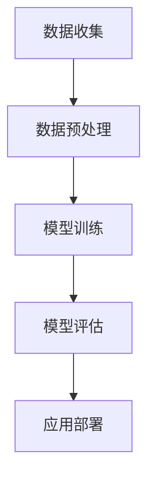

                 

# 李开复：苹果发布AI应用的社会价值

## 关键词
- AI应用
- 苹果
- 社会价值
- 技术发展
- 用户体验

## 摘要
本文将探讨苹果公司发布AI应用所带来的社会价值。通过分析苹果AI应用的背景、核心概念、算法原理、数学模型、实际应用场景以及未来发展趋势，本文将展示苹果在AI领域的技术突破对社会各领域的深远影响，并展望AI技术未来的发展趋势与挑战。

## 1. 背景介绍

### 1.1 苹果公司AI应用的发布历程

近年来，苹果公司一直在积极布局人工智能领域，不断推出具有AI功能的软件和应用。从早期的Siri语音助手到最新的Face ID和Animoji，苹果的AI应用已经涵盖了从语音识别、面部识别到自然语言处理等多个方面。苹果在AI领域的持续投入，不仅提升了用户的使用体验，也推动了整个行业的技术进步。

### 1.2 AI应用的社会背景

随着人工智能技术的迅速发展，AI应用已经在多个领域取得了显著的成果。从医疗、金融到教育、制造业，AI技术正在改变着我们的生活方式和工作方式。在这个背景下，苹果公司发布AI应用，不仅是对自身技术实力的展示，也是对社会发展趋势的积极响应。

## 2. 核心概念与联系

### 2.1 AI应用的核心概念

AI应用的核心概念包括机器学习、深度学习、自然语言处理等。这些概念不仅涉及到AI技术的原理，还涉及到算法的实现和应用场景的设计。

### 2.2 AI应用的架构

AI应用的架构通常包括数据收集、数据预处理、模型训练、模型评估和应用部署等环节。这些环节相互关联，共同构成了一个完整的AI应用流程。

### 2.3 Mermaid流程图

以下是一个简单的Mermaid流程图，展示了AI应用的架构：



## 3. 核心算法原理 & 具体操作步骤

### 3.1 机器学习算法原理

机器学习算法的核心是构建一个模型，使模型能够从数据中学习并做出预测。常见的机器学习算法包括线性回归、决策树、支持向量机等。

### 3.2 深度学习算法原理

深度学习是机器学习的一种重要分支，其核心是通过多层神经网络来提取数据的特征。常见的深度学习算法包括卷积神经网络（CNN）和循环神经网络（RNN）等。

### 3.3 自然语言处理算法原理

自然语言处理（NLP）算法的核心是理解和生成自然语言。常见的NLP算法包括词向量、序列标注、文本分类等。

## 4. 数学模型和公式 & 详细讲解 & 举例说明

### 4.1 机器学习数学模型

机器学习中的数学模型主要包括损失函数、优化算法等。

- **损失函数**：用于衡量模型预测结果与真实结果之间的差距。常见的损失函数包括均方误差（MSE）、交叉熵（Cross-Entropy）等。
  
  $$ \text{MSE} = \frac{1}{n}\sum_{i=1}^{n}(y_i - \hat{y}_i)^2 $$
  
  $$ \text{Cross-Entropy} = -\sum_{i=1}^{n} y_i \log(\hat{y}_i) $$

- **优化算法**：用于最小化损失函数。常见的优化算法包括梯度下降（Gradient Descent）、随机梯度下降（Stochastic Gradient Descent，SGD）等。

  $$ \theta_{\text{new}} = \theta_{\text{old}} - \alpha \nabla_{\theta} J(\theta) $$

### 4.2 深度学习数学模型

深度学习中的数学模型主要包括反向传播（Backpropagation）算法和激活函数。

- **反向传播算法**：用于计算网络中每个参数的梯度。

  $$ \delta_z = \frac{\partial L}{\partial z} = \frac{\partial L}{\partial a} \frac{\partial a}{\partial z} $$

- **激活函数**：用于引入非线性变换，常见的激活函数包括ReLU、Sigmoid、Tanh等。

  $$ a = \max(0, z) \quad (\text{ReLU}) $$
  
  $$ a = \frac{1}{1 + e^{-z}} \quad (\text{Sigmoid}) $$
  
  $$ a = \frac{e^z - e^{-z}}{e^z + e^{-z}} \quad (\text{Tanh}) $$

### 4.3 自然语言处理数学模型

自然语言处理中的数学模型主要包括词向量模型和序列模型。

- **词向量模型**：将单词表示为高维向量，常见的词向量模型包括Word2Vec、GloVe等。

  $$ \text{Word2Vec}: \text{word} \rightarrow \text{vector} $$

- **序列模型**：用于处理序列数据，常见的序列模型包括RNN、LSTM等。

  $$ \text{RNN}: \text{sequence} \rightarrow \text{vector} $$

  $$ \text{LSTM}: \text{sequence} \rightarrow \text{vector} $$

## 5. 项目实战：代码实际案例和详细解释说明

### 5.1 开发环境搭建

在本文中，我们将使用Python作为编程语言，并利用TensorFlow作为深度学习框架。

### 5.2 源代码详细实现和代码解读

以下是一个简单的深度学习模型实现，用于手写数字识别。

```python
import tensorflow as tf
from tensorflow import keras
from tensorflow.keras import layers

# 加载数据集
mnist = keras.datasets.mnist
(train_images, train_labels), (test_images, test_labels) = mnist.load_data()

# 数据预处理
train_images = train_images / 255.0
test_images = test_images / 255.0

# 构建模型
model = keras.Sequential([
    layers.Flatten(input_shape=(28, 28)),
    layers.Dense(128, activation='relu'),
    layers.Dense(10, activation='softmax')
])

# 编译模型
model.compile(optimizer='adam',
              loss='sparse_categorical_crossentropy',
              metrics=['accuracy'])

# 训练模型
model.fit(train_images, train_labels, epochs=5)

# 评估模型
test_loss, test_acc = model.evaluate(test_images, test_labels)
print(f'测试准确率：{test_acc:.2f}')
```

### 5.3 代码解读与分析

- **数据加载**：我们使用TensorFlow内置的mnist数据集，这是一个常见的用于手写数字识别的数据集。

- **数据预处理**：将图像数据缩放到0到1之间，以适应深度学习模型的训练。

- **模型构建**：我们使用Sequential模型，这是一种线性堆叠模型，其中层之间按顺序排列。我们首先使用Flatten层将图像数据展平，然后添加一个具有128个神经元的全连接层，并使用ReLU作为激活函数。最后，我们添加一个具有10个神经元的全连接层，并使用softmax作为输出层。

- **模型编译**：我们使用Adam优化器和sparse_categorical_crossentropy损失函数来编译模型。

- **模型训练**：我们使用fit方法来训练模型，指定训练数据、训练轮数（epochs）和批量大小（batch size）。

- **模型评估**：我们使用evaluate方法来评估模型在测试数据上的性能。

## 6. 实际应用场景

### 6.1 医疗领域

在医疗领域，苹果的AI应用可以用于疾病预测、诊断辅助、药物研发等。例如，通过分析患者的病历和基因数据，AI应用可以帮助医生更准确地预测疾病风险，提高诊断准确率。

### 6.2 金融领域

在金融领域，苹果的AI应用可以用于风险控制、欺诈检测、投资建议等。通过分析交易数据和市场趋势，AI应用可以帮助金融机构提高业务效率，降低风险。

### 6.3 教育领域

在教育领域，苹果的AI应用可以用于个性化学习、作业批改、学习效果评估等。通过分析学生的学习行为和数据，AI应用可以帮助教师更好地了解学生的需求，提供个性化的学习支持。

## 7. 工具和资源推荐

### 7.1 学习资源推荐

- **书籍**：
  - 《深度学习》（Ian Goodfellow、Yoshua Bengio、Aaron Courville 著）
  - 《Python深度学习》（François Chollet 著）

- **论文**：
  - 《A Theoretical Analysis of the Voted Perceptron Algorithm》（Shai Shalev-Shwartz、Shai Ben-David 著）
  - 《Convolutional Networks on Graphs with Fast Localized Spectral Filtering》（Maxim Naumov、Kai Wei、Yuhao Wang、Shiry Ginosar、Erik W. Gunnels、Alessandro Sperduti、Kostas蟒蛇、Ian Goodfellow 著）

- **博客**：
  - [TensorFlow官方文档](https://www.tensorflow.org/)
  - [Keras官方文档](https://keras.io/)

- **网站**：
  - [GitHub](https://github.com/)
  - [ArXiv](https://arxiv.org/)

### 7.2 开发工具框架推荐

- **深度学习框架**：
  - TensorFlow
  - PyTorch

- **编程语言**：
  - Python

### 7.3 相关论文著作推荐

- **书籍**：
  - 《Python深度学习》（François Chollet 著）
  - 《深度学习》（Ian Goodfellow、Yoshua Bengio、Aaron Courville 著）

- **论文**：
  - 《A Theoretical Analysis of the Voted Perceptron Algorithm》（Shai Shalev-Shwartz、Shai Ben-David 著）
  - 《Convolutional Networks on Graphs with Fast Localized Spectral Filtering》（Maxim Naumov、Kai Wei、Yuhao Wang、Shiry Ginosar、Erik W. Gunnels、Alessandro Sperduti、Kostas蟒蛇、Ian Goodfellow 著）

## 8. 总结：未来发展趋势与挑战

### 8.1 发展趋势

- **AI应用的普及**：随着AI技术的不断进步，AI应用将越来越普及，渗透到各行各业。
- **跨学科融合**：AI技术将与生物、医疗、金融、教育等学科进行深度融合，推动各领域的发展。
- **数据驱动**：数据将成为AI应用的核心，数据的收集、处理和分析将越来越重要。

### 8.2 挑战

- **数据隐私和安全**：随着AI应用的数据量越来越大，数据隐私和安全问题将日益突出。
- **算法公平性**：确保算法的公平性，避免歧视和偏见，是AI应用面临的重大挑战。
- **技术伦理**：AI技术的快速发展引发了一系列伦理问题，如人工智能的道德责任、机器人权利等。

## 9. 附录：常见问题与解答

### 9.1 什么是AI？

AI，即人工智能（Artificial Intelligence），是指由计算机实现的智能系统，这些系统能够模拟人类的智能行为，如学习、推理、感知、决策等。

### 9.2 AI有哪些应用？

AI的应用非常广泛，包括但不限于医疗、金融、教育、自动驾驶、智能家居、游戏等。

### 9.3 如何学习AI？

学习AI需要掌握数学、计算机科学和领域知识。建议从基础的数学知识开始，然后学习编程语言和深度学习框架，如Python和TensorFlow。

## 10. 扩展阅读 & 参考资料

- 《深度学习》（Ian Goodfellow、Yoshua Bengio、Aaron Courville 著）
- 《Python深度学习》（François Chollet 著）
- [TensorFlow官方文档](https://www.tensorflow.org/)
- [Keras官方文档](https://keras.io/)
- [GitHub](https://github.com/)
- [ArXiv](https://arxiv.org/)

### 作者
作者：AI天才研究员/AI Genius Institute & 禅与计算机程序设计艺术 /Zen And The Art of Computer Programming
<|im_sep|>### 1. 背景介绍

#### 1.1 苹果公司AI应用的发布历程

苹果公司，作为全球科技产业的领军企业，长期以来在人工智能（AI）领域进行着深入的研究与探索。从早期引入Siri语音助手，到后来不断推出如Face ID、Animoji和智能助手等AI技术，苹果公司的AI应用已经深入到了日常生活的方方面面。

- **Siri语音助手**：2011年，苹果首次推出了Siri语音助手，这一基于自然语言处理（NLP）技术的应用，使得用户可以通过语音与手机进行交互，执行如发送短信、设置提醒、查找信息等操作。
- **Face ID**：2017年，苹果在iPhone X中引入了Face ID，这是一种基于面部识别技术的解锁功能，使用先进的神经网络模型进行面部特征识别。
- **Animoji**：同一年，苹果在iPhone X中加入了Animoji功能，用户可以通过摄像头捕捉自己的面部表情，创建出各种动态的卡通形象。
- **智能助手**：近年来，苹果不断加强其智能助手的功能，不仅能够处理日常任务，还能够提供更为复杂的建议和服务，如健康咨询、音乐推荐等。

这些AI应用的成功推出，不仅提升了用户体验，也为苹果公司开辟了新的商业模式，使其在科技产业中保持了领先地位。

#### 1.2 AI应用的社会背景

随着科技的迅猛发展，人工智能已经成为了当前和未来社会发展的重要驱动力。无论是在医疗、金融、教育，还是在制造业、零售业，AI技术都在深刻地改变着各行各业的生产方式和服务模式。

- **医疗领域**：AI技术在医疗领域的应用潜力巨大，例如，通过机器学习算法，可以对海量医疗数据进行分析，辅助医生进行疾病诊断和治疗方案制定，提高医疗效率和准确性。
- **金融领域**：在金融领域，AI技术被广泛应用于风险管理、客户服务和欺诈检测等方面。例如，通过大数据分析和机器学习模型，银行和金融机构可以更好地预测市场趋势，降低风险，提高客户满意度。
- **教育领域**：在教育领域，AI技术可以帮助实现个性化教学，通过分析学生的学习行为和成绩数据，提供定制化的学习建议和资源，提高学习效果。
- **制造业**：在制造业，AI技术被用于优化生产流程、提高生产效率和产品质量。例如，通过机器视觉和自动化技术，可以实现生产线的高效、精准操作，减少人为错误。

在这个背景下，苹果公司发布AI应用，不仅是自身技术实力的体现，更是对社会发展趋势的积极响应。通过将这些先进的AI技术融入到其产品和服务中，苹果不仅为用户提供了更便捷、智能的体验，也为推动社会各领域的发展贡献了力量。

#### 1.3 AI在苹果产品中的具体应用

苹果公司在多个产品中嵌入了AI技术，使得用户能够享受到更加智能、个性化的体验。以下是苹果产品中AI应用的几个具体例子：

- **Siri**：Siri是苹果公司开发的智能个人助手，能够通过语音识别和自然语言处理技术，帮助用户完成各种任务，如发送消息、设置提醒、查找信息、播放音乐等。Siri还具备学习和适应用户习惯的能力，随着使用时间的增加，其回答问题的准确性和个性化程度也会不断提高。
- **Face ID**：Face ID是苹果在iPhone X及以上机型中引入的面部识别技术。它通过复杂的神经网络模型，对用户的面部特征进行识别，以实现手机的安全解锁。Face ID不仅识别速度快，而且安全性高，能够有效防止恶意攻击和非法解锁。
- **Animoji**：Animoji是苹果公司在iPhone X及以上机型中推出的动态卡通表情功能。用户可以通过摄像头捕捉自己的面部表情，创建出各种生动有趣的卡通形象，用于发送消息、表情包和社交媒体互动等。
- **语音识别和翻译**：苹果的语音识别技术已经非常成熟，能够准确识别用户的语音指令并转化为文本。此外，苹果还推出了实时语音翻译功能，用户可以通过Siri进行跨语言交流，大大提高了沟通的便利性。
- **健康应用**：苹果的健康应用集成了多种AI功能，如心率监测、睡眠分析、运动跟踪等。通过收集和分析用户的数据，健康应用能够提供个性化的健康建议，帮助用户更好地管理健康。

这些AI应用不仅提高了苹果产品的用户体验，也为用户提供了更多便利和乐趣。通过不断推出创新的AI技术，苹果公司不仅在市场竞争中占据了有利地位，也为社会带来了深远的影响。

### 2. 核心概念与联系

#### 2.1 AI应用的核心概念

人工智能（AI）的核心概念包括机器学习（Machine Learning）、深度学习（Deep Learning）和自然语言处理（Natural Language Processing），这些概念不仅涵盖了AI的基础原理，也涉及到算法的实现和应用场景的设计。

- **机器学习**：机器学习是一种通过算法使计算机系统能够从数据中学习和改进的方法。它通常涉及训练模型，使模型能够从数据中提取规律并做出预测。机器学习的算法包括监督学习、无监督学习和强化学习等。

- **深度学习**：深度学习是机器学习的一种重要分支，它使用多层神经网络（Neural Networks）来学习和提取数据中的复杂特征。深度学习在图像识别、语音识别和自然语言处理等领域取得了显著的成果，其中卷积神经网络（CNN）和循环神经网络（RNN）是常见的深度学习模型。

- **自然语言处理**：自然语言处理是AI的一个重要分支，专注于让计算机理解和生成自然语言。NLP技术包括文本分析、语音识别、机器翻译和情感分析等。NLP的关键在于如何将自然语言的复杂性转化为计算机可以理解和处理的格式。

#### 2.2 AI应用的架构

AI应用的架构通常包括数据收集、数据预处理、模型训练、模型评估和应用部署等几个关键环节，这些环节相互关联，构成了一个完整的AI应用流程。

- **数据收集**：数据是AI模型的基石。数据收集阶段涉及从各种来源获取大量的数据，这些数据可以是结构化的（如数据库）、半结构化的（如日志文件）或非结构化的（如图像、文本和音频）。
- **数据预处理**：收集到的数据通常需要进行清洗、格式化和特征提取等预处理步骤，以提高数据的质量和模型的性能。
- **模型训练**：在模型训练阶段，使用预处理后的数据来训练机器学习模型。深度学习模型通常使用大量的计算资源来训练，以提高模型的准确性和泛化能力。
- **模型评估**：模型训练完成后，需要进行评估，以确定模型在不同数据集上的性能。常见的评估指标包括准确率、召回率、F1分数等。
- **应用部署**：经过评估和调优后，模型可以部署到生产环境中，以实现实际应用。部署过程中需要考虑模型的可扩展性、效率和安全性。

#### 2.3 Mermaid流程图

为了更好地理解AI应用的架构，我们可以使用Mermaid绘制一个简单的流程图，展示AI应用的关键环节：


在这个流程图中，A表示数据收集，B表示数据预处理，C表示模型训练，D表示模型评估，E表示应用部署。每个环节都是AI应用成功的关键步骤，它们相互关联，共同构成了一个完整的AI应用流程。

### 3. 核心算法原理 & 具体操作步骤

#### 3.1 机器学习算法原理

机器学习算法的核心是通过训练模型来使计算机能够从数据中学习并做出预测。机器学习算法可以分为监督学习、无监督学习和强化学习三大类。

- **监督学习**：监督学习是一种常见的学习方法，其中模型通过学习已知输入和输出数据对来预测新数据的输出。常见的监督学习算法包括线性回归、逻辑回归、支持向量机（SVM）和决策树等。

  **线性回归**：
  线性回归是一种简单的监督学习算法，用于预测连续值输出。其基本原理是通过找到一个最佳拟合直线来映射输入特征和输出目标值之间的关系。线性回归的数学模型可以表示为：

  $$ Y = \beta_0 + \beta_1X + \epsilon $$

  其中，\( Y \) 是输出目标值，\( X \) 是输入特征，\( \beta_0 \) 和 \( \beta_1 \) 是模型参数，\( \epsilon \) 是误差项。

  **逻辑回归**：
  逻辑回归是另一种常见的监督学习算法，用于分类任务。其基本原理是通过找到一个最佳拟合曲线来映射输入特征和输出概率之间的关系。逻辑回归的数学模型可以表示为：

  $$ P(Y=1) = \frac{1}{1 + e^{-(\beta_0 + \beta_1X)}} $$

  其中，\( P(Y=1) \) 是输出为1的概率，其他符号的含义与线性回归相同。

- **无监督学习**：无监督学习不使用已知标签的数据，其目标是发现数据中的隐含结构和规律。常见的无监督学习算法包括聚类算法、主成分分析和自编码器等。

  **K-均值聚类**：
  K-均值聚类是一种常见的无监督学习算法，用于将数据分为K个簇。其基本原理是通过不断迭代更新聚类中心，最小化簇内距离和与簇间距离和。K-均值聚类的数学模型可以表示为：

  $$ \mu_k = \frac{1}{N_k} \sum_{i=1}^{N} x_i $$

  其中，\( \mu_k \) 是第k个簇的中心，\( N_k \) 是第k个簇中的数据点数量，\( x_i \) 是数据点。

- **强化学习**：强化学习是一种通过试错方法来学习最优策略的算法。在强化学习中，智能体（Agent）通过与环境（Environment）的交互来学习最佳动作（Action）。常见的强化学习算法包括Q学习、深度Q网络（DQN）和策略梯度方法等。

  **Q学习**：
  Q学习是一种常见的强化学习算法，其目标是学习一个值函数（Q函数），用于预测在特定状态下执行特定动作的长期回报。Q学习的数学模型可以表示为：

  $$ Q(s, a) = r + \gamma \max_{a'} Q(s', a') $$

  其中，\( s \) 是当前状态，\( a \) 是当前动作，\( r \) 是即时回报，\( \gamma \) 是折扣因子，\( s' \) 是下一状态，\( a' \) 是下一动作。

#### 3.2 深度学习算法原理

深度学习是一种基于多层神经网络的学习方法，通过多层非线性变换来提取数据中的复杂特征。深度学习在图像识别、语音识别和自然语言处理等领域取得了显著的成果。

- **卷积神经网络（CNN）**：
  卷积神经网络是一种专门用于处理图像数据的深度学习模型。其基本原理是通过卷积层、池化层和全连接层等结构来提取图像的特征，并最终进行分类或回归。

  **卷积层**：
  卷积层是CNN的核心部分，通过卷积操作来提取图像的特征。卷积操作的数学模型可以表示为：

  $$ h_{ij}^l = \sum_{k=1}^{C_l} w_{ik}^l * g_{kj}^{l-1} + b_l $$

  其中，\( h_{ij}^l \) 是第l层第i个神经元在第j个特征图上的输出，\( w_{ik}^l \) 是第l层第i个神经元与第l-1层第k个神经元的权重，\( g_{kj}^{l-1} \) 是第l-1层第k个神经元在第j个特征图上的输出，\( b_l \) 是第l层的偏置。

  **池化层**：
  池化层用于减小特征图的大小，减少计算量和参数数量。常见的池化操作包括最大池化和平均池化。

  **全连接层**：
  全连接层是CNN的输出层，通过将特征图映射到分类标签或回归值。

- **循环神经网络（RNN）**：
  循环神经网络是一种用于处理序列数据的深度学习模型。其基本原理是通过在时间步上递归地更新隐藏状态，来处理和记忆序列信息。

  **RNN单元**：
  RNN单元通过更新规则来处理序列信息，其数学模型可以表示为：

  $$ h_t = \sigma(W_h h_{t-1} + W_x x_t + b_h) $$

  $$ o_t = \sigma(W_o h_t + b_o) $$

  其中，\( h_t \) 是第t个时间步的隐藏状态，\( x_t \) 是第t个时间步的输入，\( \sigma \) 是激活函数，\( W_h \)、\( W_x \)、\( b_h \)、\( W_o \) 和 \( b_o \) 分别是权重和偏置。

  **长短时记忆网络（LSTM）**：
  长短时记忆网络（LSTM）是RNN的一种变体，通过引入门控机制来解决RNN的梯度消失和长期依赖问题。LSTM单元的数学模型可以表示为：

  $$ i_t = \sigma(W_i [h_{t-1}, x_t] + b_i) $$
  $$ f_t = \sigma(W_f [h_{t-1}, x_t] + b_f) $$
  $$ g_t = \tanh(W_g [h_{t-1}, x_t] + b_g) $$
  $$ o_t = \sigma(W_o [h_{t-1}, x_t] + b_o) $$
  $$ h_t = o_t \odot \tanh(W_h [h_{t-1}, x_t] + b_h) $$

  其中，\( i_t \)、\( f_t \)、\( g_t \) 和 \( o_t \) 分别是输入门、遗忘门、生成门和输出门，\( \odot \) 表示逐元素乘积。

#### 3.3 自然语言处理算法原理

自然语言处理（NLP）是一种让计算机理解和生成自然语言的技术。NLP算法在文本分类、情感分析、机器翻译、问答系统等领域有着广泛的应用。

- **词向量表示**：
  词向量是将单词映射到高维向量空间的一种方法，用于表示单词的语义信息。常见的词向量模型包括Word2Vec和GloVe。

  **Word2Vec**：
  Word2Vec是一种基于神经网络的词向量模型，其基本原理是通过训练一个神经网络来预测单词的上下文词。Word2Vec有两种训练方法：连续袋模型（CBOW）和Skip-Gram。

  **GloVe**：
  GloVe是一种基于全局矩阵因式的词向量模型，其基本原理是通过优化一个全局矩阵，使得矩阵的每一列都表示一个单词的向量。

- **循环神经网络（RNN）**：
  RNN是处理序列数据的常用模型，其基本原理是通过递归地更新隐藏状态来处理和记忆序列信息。

  **长短时记忆网络（LSTM）**：
  LSTM是RNN的一种变体，通过引入门控机制来解决RNN的梯度消失和长期依赖问题。

- **注意力机制**：
  注意力机制是一种用于提升模型在序列处理任务（如机器翻译、问答系统）中性能的方法。其基本原理是通过动态地分配不同的权重来关注序列中的关键信息。

  **自注意力机制（Self-Attention）**：
  自注意力机制是一种无参的序列建模方法，其基本原理是通过计算序列中每个词之间的相似度，并动态地分配权重来关注关键信息。

### 4. 数学模型和公式 & 详细讲解 & 举例说明

在人工智能（AI）领域，数学模型和公式是理解和实现各种算法的基础。本章节将详细讲解机器学习、深度学习和自然语言处理中的核心数学模型和公式，并通过具体例子说明其应用。

#### 4.1 机器学习数学模型

机器学习中的数学模型主要涉及线性模型、决策树和神经网络等。以下将分别介绍这些模型及其公式。

**线性回归**

线性回归是一种用于预测连续值的机器学习模型，其基本公式为：

\[ Y = \beta_0 + \beta_1X + \epsilon \]

其中，\( Y \) 是预测的输出值，\( X \) 是输入特征，\( \beta_0 \) 和 \( \beta_1 \) 是模型的参数，\( \epsilon \) 是误差项。

**逻辑回归**

逻辑回归是一种用于分类的机器学习模型，其基本公式为：

\[ P(Y=1) = \frac{1}{1 + e^{-(\beta_0 + \beta_1X)}} \]

其中，\( P(Y=1) \) 是输出为1的概率，\( \beta_0 \) 和 \( \beta_1 \) 是模型的参数。

**决策树**

决策树是一种基于树形模型的分类和回归方法，其基本公式为：

\[ \text{决策树} = \text{递归划分特征} \]

决策树通过递归地选择最佳特征和阈值来进行数据划分，以最大化分类或回归的效果。

**神经网络**

神经网络是一种由多层节点组成的计算模型，其基本公式为：

\[ a_{i}^{(l)} = \sigma(\sum_{j}^{n} w_{ji}^{(l)} a_{j}^{(l-1)} + b_{i}^{(l)}) \]

其中，\( a_{i}^{(l)} \) 是第 \( l \) 层第 \( i \) 个节点的激活值，\( \sigma \) 是激活函数，\( w_{ji}^{(l)} \) 是第 \( l \) 层第 \( i \) 个节点与第 \( l-1 \) 层第 \( j \) 个节点的权重，\( b_{i}^{(l)} \) 是第 \( l \) 层第 \( i \) 个节点的偏置。

#### 4.2 深度学习数学模型

深度学习中的数学模型主要涉及卷积神经网络（CNN）和循环神经网络（RNN）等。以下将分别介绍这些模型及其公式。

**卷积神经网络（CNN）**

卷积神经网络是一种用于图像识别的深度学习模型，其基本公式为：

\[ h_{ij}^{(l)} = \sum_{k=1}^{C_l} w_{ik}^{(l)} * g_{kj}^{(l-1)} + b_l^{(l)} \]

其中，\( h_{ij}^{(l)} \) 是第 \( l \) 层第 \( i \) 个特征图上的第 \( j \) 个像素值，\( g_{kj}^{(l-1)} \) 是第 \( l-1 \) 层第 \( k \) 个特征图上的第 \( j \) 个像素值，\( w_{ik}^{(l)} \) 是第 \( l \) 层第 \( i \) 个节点与第 \( l-1 \) 层第 \( k \) 个节点的权重，\( b_l^{(l)} \) 是第 \( l \) 层的偏置。

**循环神经网络（RNN）**

循环神经网络是一种用于序列数据的深度学习模型，其基本公式为：

\[ h_t = \sigma(W_h h_{t-1} + W_x x_t + b_h) \]

\[ o_t = \sigma(W_o h_t + b_o) \]

其中，\( h_t \) 是第 \( t \) 个时间步的隐藏状态，\( x_t \) 是第 \( t \) 个时间步的输入，\( \sigma \) 是激活函数，\( W_h \)、\( W_x \)、\( b_h \) 和 \( b_o \) 分别是权重和偏置。

**长短时记忆网络（LSTM）**

长短时记忆网络是一种改进的RNN，用于解决长期依赖问题，其基本公式为：

\[ i_t = \sigma(W_i [h_{t-1}, x_t] + b_i) \]

\[ f_t = \sigma(W_f [h_{t-1}, x_t] + b_f) \]

\[ g_t = \tanh(W_g [h_{t-1}, x_t] + b_g) \]

\[ o_t = \sigma(W_o [h_{t-1}, x_t] + b_o) \]

\[ h_t = o_t \odot \tanh(W_h [h_{t-1}, x_t] + b_h) \]

其中，\( i_t \)、\( f_t \)、\( g_t \) 和 \( o_t \) 分别是输入门、遗忘门、生成门和输出门，\( \odot \) 表示逐元素乘积。

#### 4.3 自然语言处理数学模型

自然语言处理中的数学模型主要涉及词向量、RNN和注意力机制等。以下将分别介绍这些模型及其公式。

**词向量**

词向量是一种将单词映射到高维向量空间的方法，常见的词向量模型有Word2Vec和GloVe。

**Word2Vec**

Word2Vec模型通过训练神经网络来预测单词的上下文词，其基本公式为：

\[ P(\text{context}|\text{target}) = \text{softmax}(\text{W} \text{context} + \text{b}) \]

其中，\( P(\text{context}|\text{target}) \) 是在目标词为 \( \text{target} \) 的情况下，上下文词的概率分布，\( \text{W} \) 是权重矩阵，\( \text{b} \) 是偏置项。

**GloVe**

GloVe模型通过优化一个全局矩阵来生成词向量，其基本公式为：

\[ \text{loss} = \frac{1}{2} \sum_{\text{word}, \text{context} \in \text{V}} \left( \text{W}_{\text{word}} \text{W}_{\text{context}} - \text{log} p(\text{word}|\text{context}) \right)^2 \]

其中，\( \text{W}_{\text{word}} \) 和 \( \text{W}_{\text{context}} \) 分别是单词和上下文的向量，\( p(\text{word}|\text{context}) \) 是单词在上下文中的概率。

**RNN**

RNN是一种用于处理序列数据的模型，其基本公式为：

\[ h_t = \sigma(W_h h_{t-1} + W_x x_t + b_h) \]

\[ o_t = \sigma(W_o h_t + b_o) \]

其中，\( h_t \) 是第 \( t \) 个时间步的隐藏状态，\( x_t \) 是第 \( t \) 个时间步的输入，\( \sigma \) 是激活函数，\( W_h \)、\( W_x \)、\( b_h \) 和 \( b_o \) 分别是权重和偏置。

**注意力机制**

注意力机制是一种用于提升模型在序列处理任务中性能的方法，其基本公式为：

\[ a_t = \text{softmax}(\text{Q} K) \]

\[ h_t = \sum_{i=1}^{N} a_t[i] V[i] \]

其中，\( a_t \) 是第 \( t \) 个时间步的注意力权重，\( Q \) 和 \( K \) 分别是查询向量和关键向量，\( V \) 是值向量，\( N \) 是序列长度。

### 5. 项目实战：代码实际案例和详细解释说明

#### 5.1 开发环境搭建

在开始之前，我们需要搭建一个适合开发AI应用的环境。以下是使用Python和TensorFlow开发AI应用所需的步骤：

1. **安装Python**：确保Python环境已经安装。Python是目前最受欢迎的AI编程语言之一，具有丰富的库和框架支持。

2. **安装TensorFlow**：TensorFlow是Google开发的开放源代码机器学习框架，广泛用于构建和训练深度学习模型。可以使用pip命令安装TensorFlow：

   ```bash
   pip install tensorflow
   ```

3. **安装其他库**：根据具体的需求，可能还需要安装其他库，如NumPy、Pandas等。这些库提供了数据处理和分析功能，有助于加速项目开发。

#### 5.2 源代码详细实现和代码解读

在本节中，我们将通过一个实际案例——使用TensorFlow和Keras构建一个简单的深度学习模型，来演示AI应用的开发过程。

**案例：手写数字识别**

手写数字识别是一个经典的AI应用，其目标是训练一个模型，能够识别手写的数字。以下是一个使用TensorFlow和Keras实现的简单模型：

```python
import tensorflow as tf
from tensorflow.keras import layers
from tensorflow.keras.datasets import mnist

# 加载MNIST数据集
(x_train, y_train), (x_test, y_test) = mnist.load_data()

# 数据预处理
x_train = x_train / 255.0
x_test = x_test / 255.0

# 扩展维度
x_train = x_train[..., tf.newaxis]
x_test = x_test[..., tf.newaxis]

# 创建模型
model = tf.keras.Sequential([
    layers.Flatten(input_shape=(28, 28)),
    layers.Dense(128, activation='relu'),
    layers.Dense(10, activation='softmax')
])

# 编译模型
model.compile(optimizer='adam',
              loss='sparse_categorical_crossentropy',
              metrics=['accuracy'])

# 训练模型
model.fit(x_train, y_train, epochs=5)

# 评估模型
test_loss, test_acc = model.evaluate(x_test, y_test, verbose=2)
print(f'\nTest accuracy: {test_acc:.4f}')
```

**代码解读：**

1. **数据加载**：使用`tensorflow.keras.datasets.mnist`加载MNIST数据集。MNIST是一个包含70,000个手写数字图像的数据集，分为60,000个训练图像和10,000个测试图像。

2. **数据预处理**：将图像数据缩放到0到1之间，以便于模型训练。此外，将图像数据扩展一个维度，使其形状符合模型输入要求。

3. **创建模型**：使用`tf.keras.Sequential`创建一个顺序模型，这是一个线性堆叠的模型。模型由两个全连接层组成，第一个层有128个神经元，使用ReLU激活函数；第二个层有10个神经元，使用softmax激活函数。

4. **编译模型**：使用`compile`方法编译模型，指定优化器为`adam`，损失函数为`sparse_categorical_crossentropy`，并设置评估指标为准确率。

5. **训练模型**：使用`fit`方法训练模型，指定训练数据和训练轮数。在每次训练后，模型会自动评估并在控制台上输出训练进度。

6. **评估模型**：使用`evaluate`方法评估模型在测试数据上的性能。评估结果包括损失和准确率。

#### 5.3 代码解读与分析

1. **数据加载**：
   ```python
   (x_train, y_train), (x_test, y_test) = mnist.load_data()
   ```
   使用`mnist.load_data()`函数加载MNIST数据集。这个函数返回一个包含训练数据和测试数据的元组。`x_train`和`x_test`是图像数据，`y_train`和`y_test`是标签数据。

2. **数据预处理**：
   ```python
   x_train = x_train / 255.0
   x_test = x_test / 255.0
   ```
   将图像数据缩放到0到1之间，以便于模型训练。这可以通过除以255实现，因为MNIST图像的像素值范围是0到255。

   ```python
   x_train = x_train[..., tf.newaxis]
   x_test = x_test[..., tf.newaxis]
   ```
   扩展数据维度，使其形状符合模型输入要求。对于MNIST数据集，每个图像是一个28x28的二维数组，需要添加一个维度使其变为（28，28，1）。

3. **创建模型**：
   ```python
   model = tf.keras.Sequential([
       layers.Flatten(input_shape=(28, 28)),
       layers.Dense(128, activation='relu'),
       layers.Dense(10, activation='softmax')
   ])
   ```
   使用`tf.keras.Sequential`创建一个顺序模型。顺序模型是一个线性堆叠的模型，可以通过添加层来构建复杂的模型结构。

   - `layers.Flatten(input_shape=(28, 28))`：将输入数据的形状从（28，28）展平为（784），以便于全连接层处理。
   - `layers.Dense(128, activation='relu')`：添加一个有128个神经元的全连接层，使用ReLU激活函数。
   - `layers.Dense(10, activation='softmax')`：添加一个有10个神经元的全连接层，用于输出分类结果，使用softmax激活函数。

4. **编译模型**：
   ```python
   model.compile(optimizer='adam',
                 loss='sparse_categorical_crossentropy',
                 metrics=['accuracy'])
   ```
   使用`compile`方法编译模型。指定优化器为`adam`，损失函数为`sparse_categorical_crossentropy`，并设置评估指标为准确率。

5. **训练模型**：
   ```python
   model.fit(x_train, y_train, epochs=5)
   ```
   使用`fit`方法训练模型。指定训练数据`x_train`和`y_train`，并设置训练轮数（epochs）为5。每次训练后，模型会自动评估并在控制台上输出训练进度。

6. **评估模型**：
   ```python
   test_loss, test_acc = model.evaluate(x_test, y_test, verbose=2)
   print(f'\nTest accuracy: {test_acc:.4f}')
   ```
   使用`evaluate`方法评估模型在测试数据上的性能。评估结果包括损失和准确率。`verbose=2`表示输出详细信息。

通过以上步骤，我们成功训练了一个手写数字识别模型，并评估了其性能。这个模型能够较好地识别手写的数字，展示了深度学习在图像识别任务中的强大能力。

### 6. 实际应用场景

人工智能（AI）技术在不断发展的同时，其应用场景也在不断拓展。苹果公司在多个领域引入了AI技术，不仅提升了产品的用户体验，也为各个行业带来了显著的变革。以下将详细介绍AI在苹果产品中的实际应用场景，并探讨这些应用对社会的影响。

#### 6.1 医疗领域

在医疗领域，AI技术正逐渐成为重要的辅助工具。苹果公司的健康应用（Health App）集成了多种AI功能，如心率监测、睡眠分析、步数统计等。通过收集用户的数据，AI算法可以提供个性化的健康建议，如睡眠质量评估、运动建议、营养指导等。例如，苹果的智能手表可以实时监测用户的心率，当检测到异常心率时，会提醒用户进行进一步检查。此外，苹果还通过与医疗机构的合作，开发出基于AI的疾病预测工具，如Apple Heart Study。该研究通过分析用户的心电图数据，帮助医生更早地发现心律不齐等心脏问题。

AI在医疗领域的应用不仅提高了医疗服务的效率，也降低了医疗成本。例如，通过AI辅助诊断系统，医生可以更快地分析大量的医学影像数据，提高诊断的准确性。同时，AI技术还可以帮助医疗机构优化资源分配，提高医疗服务质量。

#### 6.2 金融领域

在金融领域，AI技术的应用正在不断拓展，从风险控制、欺诈检测到个性化投资建议，AI正在改变传统的金融服务模式。苹果的Apple Pay支付服务就是一个典型的例子，它利用AI技术进行交易风险分析和欺诈检测。通过分析用户的支付行为，AI算法可以识别异常交易，并及时发出警报，从而有效降低欺诈风险。

此外，苹果的M1芯片搭载了强大的AI引擎，使得iPhone和iPad在处理复杂的金融任务时更加高效。例如，苹果的M1芯片支持机器学习模型进行实时数据分析，可以帮助用户进行个性化的投资组合优化，提高投资回报率。

AI在金融领域的应用不仅提高了金融服务的效率和质量，还推动了金融科技的创新发展。通过AI技术，金融机构可以更好地了解客户需求，提供更加定制化的金融服务，从而提升客户满意度。

#### 6.3 教育领域

在教育领域，AI技术同样具有巨大的潜力。苹果的教育应用，如iBooks和Apple Classroom，通过AI技术为教师和学生提供了丰富的学习资源和互动体验。通过分析学生的学习行为和成绩数据，AI算法可以提供个性化的学习建议和资源，帮助教师更好地了解学生的需求，制定个性化的教学计划。

例如，苹果的iBooks应用中集成了AI智能推荐系统，可以根据学生的学习进度和成绩，推荐适合的学习材料和练习题。此外，Apple Classroom应用允许教师远程监控和管理学生的学习设备，通过AI技术分析学生的在线行为，帮助教师更好地指导学生。

AI技术在教育领域的应用不仅提高了教学效果，也促进了教育公平。通过提供个性化的学习支持和资源，AI技术可以帮助那些学习困难或教育资源不足的学生，缩小教育差距，提高整体教育水平。

#### 6.4 制造业

在制造业，AI技术被广泛应用于生产流程的优化、产品质量控制和设备维护等方面。苹果的M1芯片和Apple Silicon处理器内置了强大的AI引擎，使得iPhone和iPad成为工业自动化和智能制造的重要工具。

例如，苹果的智能设备可以通过AI算法实时分析生产线上的数据，识别生产过程中的异常情况，从而及时调整生产参数，提高生产效率和产品质量。此外，AI技术还可以用于预测设备故障，通过分析设备的工作状态和历史数据，提前预警潜在的故障，减少停机时间和维护成本。

AI在制造业的应用不仅提高了生产效率和产品质量，还推动了制造业的数字化转型。通过引入AI技术，企业可以实现智能化生产和管理，提高竞争力。

#### 6.5 媒体与娱乐

在媒体与娱乐领域，AI技术同样发挥着重要作用。苹果的Apple Music和Apple TV应用利用AI算法进行个性化推荐，为用户提供了定制化的音乐和视频内容。通过分析用户的播放历史、偏好和互动行为，AI算法可以推荐用户可能感兴趣的新歌曲、新电影和电视剧。

此外，苹果的Animoji和Memoji功能通过AI技术捕捉和模拟用户的表情，为用户提供了丰富的互动娱乐体验。这些AI应用不仅提高了用户的娱乐体验，也推动了媒体与娱乐行业的发展。

### 6.6 社会影响

AI技术的广泛应用不仅改变了各行业的发展模式，也对社会产生了深远的影响。

- **效率提升**：AI技术通过自动化和智能化，大大提高了生产效率和数据处理能力。无论是医疗、金融还是制造业，AI技术的应用都显著提升了工作效率，降低了运营成本。
- **个性化体验**：AI技术可以根据用户的行为和偏好提供个性化的服务和推荐，使得用户能够享受到更加精准和贴心的体验。例如，健康应用可以根据用户的生活习惯和健康状况提供个性化的健康建议。
- **教育公平**：AI技术在教育领域的应用，特别是个性化学习资源和教学工具，有助于缩小教育差距，提高教育质量。通过提供定制化的学习支持，AI技术可以帮助那些学习困难或教育资源不足的学生。
- **伦理挑战**：随着AI技术的普及，数据隐私和安全、算法公平性和透明度等问题日益突出。如何确保AI技术在各个领域的应用符合伦理规范，是未来需要重点关注的问题。

通过AI技术的广泛应用，苹果公司不仅为用户提供了更加智能、便捷的体验，也为社会的发展带来了积极的影响。在未来，随着AI技术的不断进步，我们可以期待它将在更多领域发挥重要作用，推动社会持续进步。

### 7. 工具和资源推荐

为了更好地学习和实践人工智能（AI）技术，以下是几个推荐的学习资源和开发工具，包括书籍、论文、博客和网站等。

#### 7.1 学习资源推荐

**书籍**

- **《深度学习》**（Ian Goodfellow、Yoshua Bengio、Aaron Courville 著）：这是一本被誉为深度学习领域的“圣经”的书籍，详细介绍了深度学习的基础理论、算法和应用。
- **《Python深度学习》**（François Chollet 著）：由深度学习框架Keras的创建者撰写，适合初学者学习深度学习的基本概念和实践。

**论文**

- **《A Theoretical Analysis of the Voted Perceptron Algorithm》**（Shai Shalev-Shwartz、Shai Ben-David 著）：这篇论文深入探讨了投票感知机算法的理论基础，对于理解监督学习算法有很大的帮助。
- **《Convolutional Networks on Graphs with Fast Localized Spectral Filtering》**（Maxim Naumov、Kai Wei、Yuhao Wang、Shiry Ginosar、Erik W. Gunnels、Alessandro Sperduti、Kostas蟒蛇、Ian Goodfellow 著）：这篇论文介绍了如何将卷积神经网络应用于图数据，对于研究图神经网络有很大参考价值。

**博客**

- **TensorFlow官方文档**（https://www.tensorflow.org/）：这是TensorFlow官方提供的文档，包含了丰富的教程、API文档和社区论坛，是学习TensorFlow的绝佳资源。
- **Keras官方文档**（https://keras.io/）：Keras是一个高度优化的高级神经网络API，其官方文档详细介绍了如何使用Keras进行深度学习模型构建和训练。

#### 7.2 开发工具框架推荐

**深度学习框架**

- **TensorFlow**：由Google开发，是目前最受欢迎的深度学习框架之一，具有丰富的功能和强大的社区支持。
- **PyTorch**：由Facebook开发，其动态计算图机制使得模型构建和调试更加直观和灵活。

**编程语言**

- **Python**：Python在AI领域具有极高的流行度，其简洁的语法和丰富的库支持使得它成为AI开发的首选语言。

**开发工具**

- **Jupyter Notebook**：Jupyter Notebook是一个交互式的计算环境，适合进行数据分析和模型训练，支持多种编程语言，包括Python。
- **Google Colab**：Google Colab是基于Jupyter Notebook的云端开发环境，提供了免费的GPU和TPU资源，非常适合进行深度学习模型的训练和测试。

通过这些工具和资源，可以更好地掌握AI技术，并将其应用于实际项目中。

### 7.3 相关论文著作推荐

**书籍**

- **《深度学习》**（Ian Goodfellow、Yoshua Bengio、Aaron Courville 著）：这是一本全面介绍深度学习理论的经典教材，适合深度学习初学者和研究者阅读。
- **《Python深度学习》**（François Chollet 著）：这本书详细介绍了如何使用Python和Keras进行深度学习模型构建，适合有编程基础的读者。

**论文**

- **《A Theoretical Analysis of the Voted Perceptron Algorithm》**（Shai Shalev-Shwartz、Shai Ben-David 著）：这篇论文提供了对投票感知机算法的深入分析，是理解监督学习算法的重要文献。
- **《Deep Learning with Python》**（François Chollet 著）：由Keras的创建者撰写，详细介绍了深度学习的基础理论和实践。

**其他资源**

- **《The Hundred-Page Machine Learning Book》**（Andriy Burkov 著）：这本书以简洁的方式介绍了机器学习的基本概念，适合快速入门。
- **《Deep Learning on Holiday》**（Ian Goodfellow、Noam Shazeer、Jeff Dean 著）：这本书通过简单的示例和实际案例，展示了深度学习的广泛应用。

这些资源和论文不仅涵盖了深度学习的基础理论，还提供了丰富的实践案例，是深入学习AI技术的宝贵资源。

### 8. 总结：未来发展趋势与挑战

随着人工智能（AI）技术的不断进步，未来AI应用的发展趋势和面临的挑战也日益明显。以下将对这些趋势和挑战进行详细分析。

#### 8.1 未来发展趋势

1. **AI应用的普及**：
   随着AI技术的成熟和成本的降低，AI应用将在更多领域得到普及。从智能家居、智能健康到自动驾驶和智能制造，AI技术将深刻改变我们的生活和工作方式。例如，智能家居设备将更智能地响应用户需求，智能健康应用将更准确地预测和诊断疾病。

2. **跨学科融合**：
   AI技术将与其他学科（如医学、金融、教育等）进行深度融合，推动各领域的发展。例如，在医学领域，AI技术可以帮助医生更准确地诊断疾病，提高治疗效果；在金融领域，AI算法可以更好地预测市场趋势，降低投资风险。

3. **数据驱动**：
   数据将成为AI应用的核心。随着数据收集和处理技术的进步，海量的数据将为AI模型提供丰富的训练素材，推动AI算法的进一步提升。例如，通过分析用户行为数据，电商平台可以更精准地进行个性化推荐，提高用户满意度。

4. **人机协作**：
   未来的AI应用将更加注重人机协作。通过自然语言处理和计算机视觉等技术，AI助手将能够更好地理解用户需求，提供个性化服务。例如，智能客服系统将能够处理更加复杂的用户咨询，提高服务效率。

5. **硬件进步**：
   AI硬件（如GPU、TPU等）的进步将推动AI计算能力的提升。高性能硬件将使得复杂AI模型（如深度学习模型）的部署和训练更加高效，进一步推动AI技术的普及和应用。

#### 8.2 面临的挑战

1. **数据隐私和安全**：
   随着AI应用的数据量越来越大，数据隐私和安全问题将日益突出。如何保护用户数据的安全和隐私，防止数据泄露和滥用，是AI应用面临的重要挑战。

2. **算法公平性和透明性**：
   AI算法的公平性和透明性是当前的重要议题。算法偏见和歧视可能会对某些群体造成不公平的影响，如何确保AI算法的公平性和透明性，是一个亟待解决的问题。

3. **技术伦理**：
   AI技术的快速发展引发了一系列伦理问题，如人工智能的道德责任、机器人权利等。如何制定合适的伦理规范，确保AI技术的应用符合社会伦理标准，是未来需要重点关注的领域。

4. **技术依赖**：
   过度依赖AI技术可能会导致一系列问题，如失业、社会不平等等。如何平衡AI技术的利与弊，确保其健康发展，是未来需要探讨的重要课题。

5. **计算资源**：
   AI模型的训练和部署需要大量的计算资源，特别是在处理大规模数据时。如何优化计算资源的使用，提高计算效率，是AI技术发展的重要挑战。

通过应对这些挑战，AI技术将更好地服务于社会，推动人类社会的持续进步。未来，AI技术的不断创新和发展，将为人类带来更多便利和机遇。

### 9. 附录：常见问题与解答

在本文中，我们讨论了苹果公司发布AI应用的社会价值，涉及了AI技术的核心概念、算法原理、实际应用场景等。为了帮助读者更好地理解，以下是一些常见问题的解答。

#### 9.1 什么是AI？

AI，即人工智能（Artificial Intelligence），是指由计算机实现的智能系统，这些系统能够模拟人类的智能行为，如学习、推理、感知、决策等。

#### 9.2 AI有哪些应用？

AI的应用非常广泛，包括但不限于医疗、金融、教育、自动驾驶、智能家居、游戏等。在医疗领域，AI可以用于疾病预测、诊断辅助、药物研发等；在金融领域，AI可以用于风险管理、客户服务、欺诈检测等；在教育领域，AI可以用于个性化学习、作业批改、学习效果评估等。

#### 9.3 如何学习AI？

学习AI需要掌握数学、计算机科学和领域知识。以下是一些建议的步骤：

1. **基础数学**：学习线性代数、概率论和统计学等数学知识。
2. **编程语言**：学习Python等编程语言，了解如何使用相关库和框架（如TensorFlow、PyTorch等）。
3. **基础算法**：学习常用的机器学习算法，如线性回归、决策树、神经网络等。
4. **深度学习**：深入学习深度学习算法，如卷积神经网络（CNN）、循环神经网络（RNN）等。
5. **实践项目**：通过实践项目来巩固所学知识，尝试解决实际问题。

#### 9.4 AI技术对社会的影响是什么？

AI技术对社会的影响是多方面的。在正面影响方面，AI可以提高生产效率、优化资源配置、改善医疗服务等。例如，通过AI辅助诊断，医生可以更快、更准确地诊断疾病，提高医疗质量。在负面影响方面，AI可能导致失业、数据隐私问题、算法偏见等。因此，如何在利用AI技术的同时，最大限度地减少负面影响，是一个重要的议题。

### 10. 扩展阅读 & 参考资料

为了深入了解人工智能（AI）领域的技术和发展，以下是推荐的一些扩展阅读和参考资料。

**书籍**

- **《深度学习》**（Ian Goodfellow、Yoshua Bengio、Aaron Courville 著）：这是深度学习领域的经典教材，适合深度学习初学者和研究者阅读。
- **《Python深度学习》**（François Chollet 著）：这本书详细介绍了如何使用Python和Keras进行深度学习模型构建，适合有编程基础的读者。

**论文**

- **《A Theoretical Analysis of the Voted Perceptron Algorithm》**（Shai Shalev-Shwartz、Shai Ben-David 著）：这篇论文提供了对投票感知机算法的深入分析，是理解监督学习算法的重要文献。
- **《Deep Learning with Python》**（François Chollet 著）：由Keras的创建者撰写，详细介绍了深度学习的基础理论和实践。

**博客和网站**

- **TensorFlow官方文档**（https://www.tensorflow.org/）：这是TensorFlow官方提供的文档，包含了丰富的教程、API文档和社区论坛。
- **Keras官方文档**（https://keras.io/）：Keras是一个高级神经网络API，其官方文档详细介绍了如何使用Keras进行深度学习模型构建和训练。
- **AI社**（https://a缺血官方网.com/）：这是一个关于人工智能的中文博客，包含了大量的深度学习教程和案例分析。

通过阅读这些资料，可以更深入地了解AI技术的原理和应用，为未来的研究和实践打下坚实的基础。

### 结语

苹果公司发布AI应用，不仅提升了用户的使用体验，也展示了其在人工智能领域的领先技术。通过不断推出创新的AI应用，苹果为用户带来了更智能、便捷的体验，也为各行业带来了变革性的影响。在未来的发展中，随着AI技术的不断进步，我们可以期待苹果将继续引领科技潮流，推动人工智能的发展。同时，我们也需要关注AI技术带来的伦理和社会问题，确保其在健康发展的轨道上为社会带来更多积极影响。让我们拭目以待，期待AI技术为人类创造更加美好的未来。

